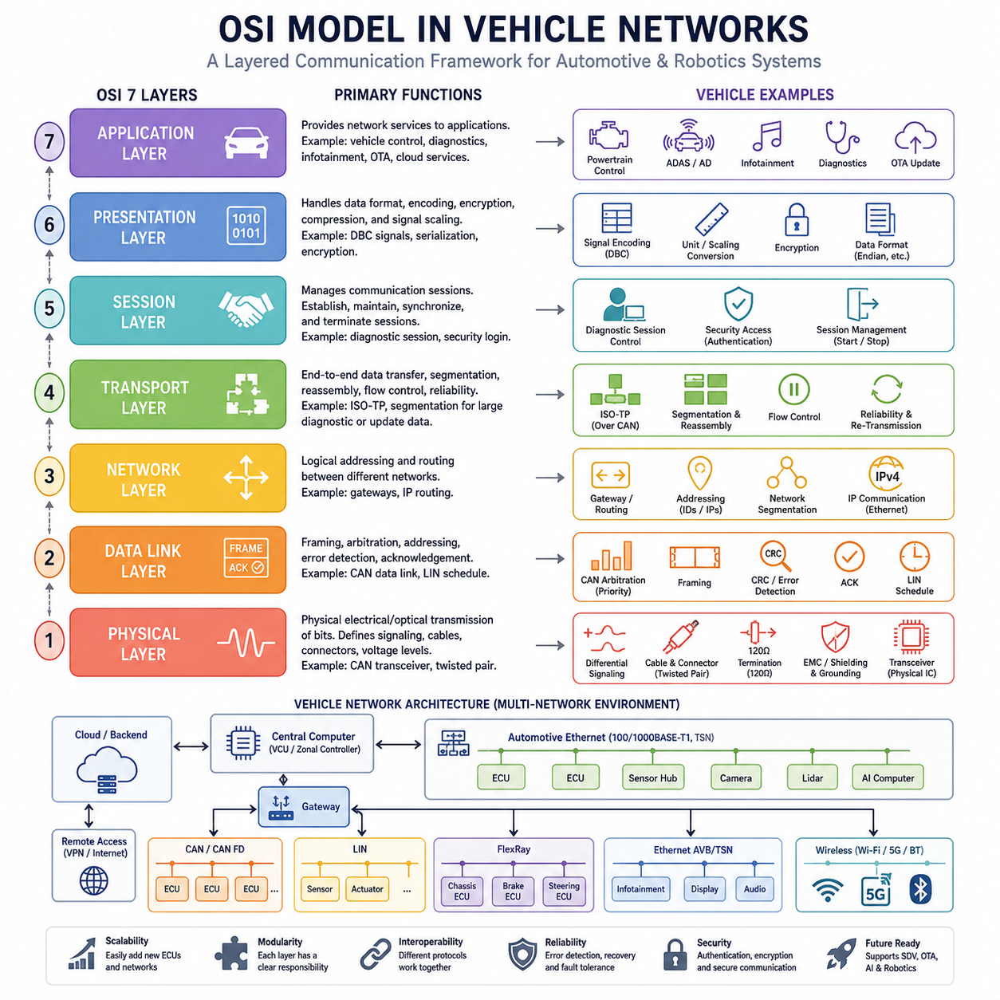
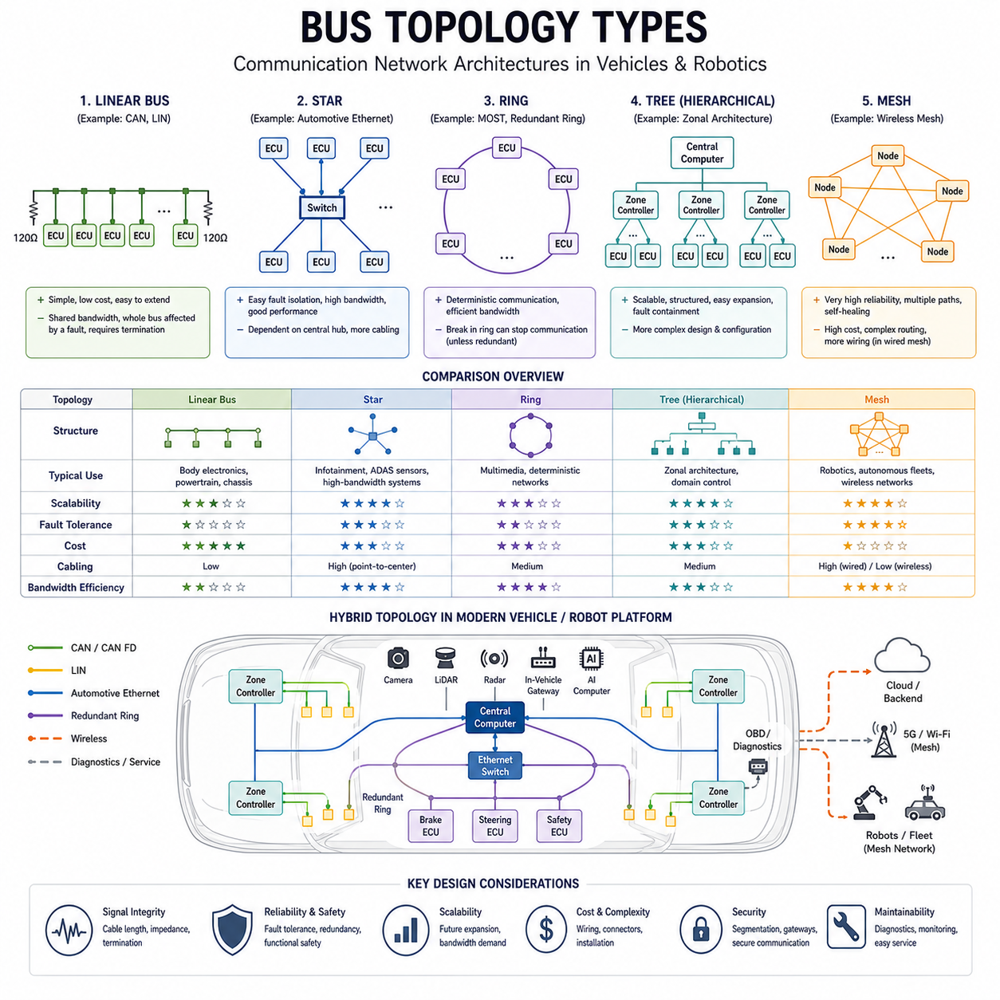
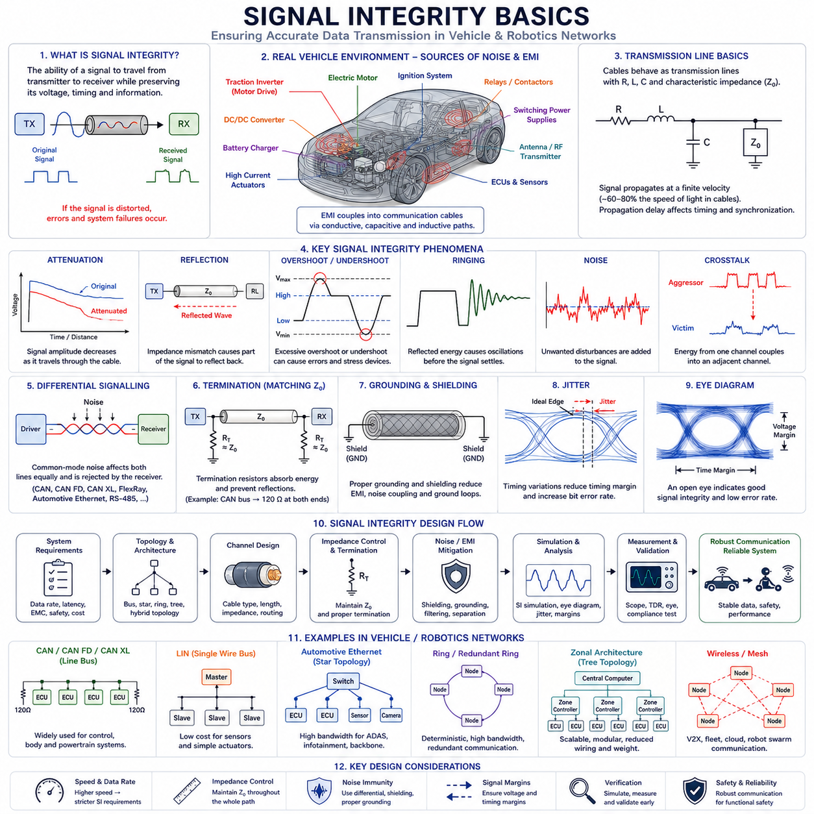
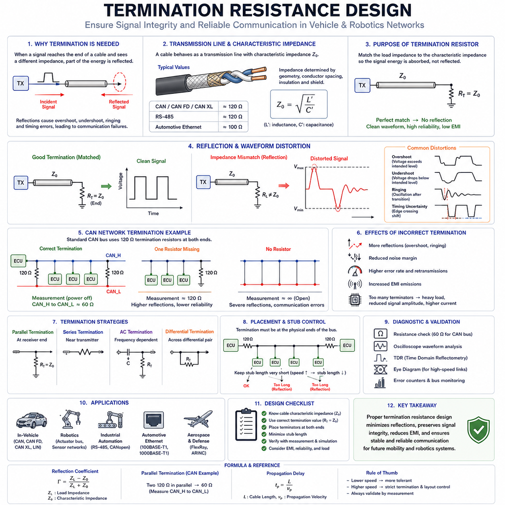
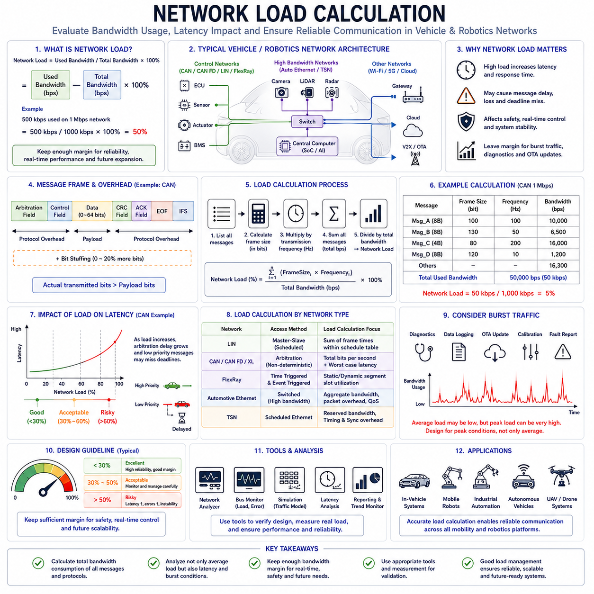

**Volume 06 Automotive Communication**


# Chapter 1. Network Fundamentals

##  

## 1.1 OSI Model in Vehicle Networks

{width="7.268055555555556in" height="7.268055555555556in"}

The Open Systems Interconnection (OSI) Model is one of the most fundamental concepts in communication engineering and serves as a universal framework for understanding how information is exchanged between electronic systems. Although the OSI model was originally developed by the International Organization for Standardization (ISO) as a generic networking reference architecture, its principles have become deeply embedded in automotive communication systems. Modern vehicles, autonomous mobile robots (AMRs), industrial vehicles, agricultural machines, mining equipment, humanoid robots, and future Physical AI platforms all rely on communication networks that can be analyzed and designed using the layered approach defined by the OSI model. In automotive engineering, understanding the OSI model is not merely an academic exercise. It provides engineers with a structured methodology for designing, troubleshooting, validating, and scaling communication systems across increasingly complex electronic architectures.

A modern vehicle may contain dozens or even hundreds of Electronic Control Units (ECUs). These ECUs must communicate reliably to coordinate powertrain control, braking systems, steering systems, battery management, body electronics, infotainment systems, advanced driver assistance systems, autonomous driving functions, diagnostics, and over-the-air updates. As vehicles evolve toward software-defined architectures, the communication infrastructure becomes as important as the mechanical design itself. The OSI model offers a conceptual framework that separates communication functions into manageable layers, allowing engineers to focus on specific technical problems without needing to understand every detail of the entire communication stack.

The OSI model consists of seven layers: Physical Layer, Data Link Layer, Network Layer, Transport Layer, Session Layer, Presentation Layer, and Application Layer. Each layer performs a distinct function and communicates with the layers directly above and below it. While not every automotive protocol explicitly implements all seven layers, the OSI model remains an invaluable analytical tool for understanding how automotive networks operate.

The Physical Layer forms the foundation of all communication systems. It defines how bits are transmitted across physical media. In vehicle networks, the Physical Layer includes cables, connectors, transceivers, voltage levels, signal timing, electromagnetic compatibility requirements, and termination schemes. When engineers design a CAN network, for example, they must determine cable impedance, wire gauge, maximum bus length, connector specifications, shielding requirements, and termination resistor placement. These decisions all belong to the Physical Layer.

Within an automotive environment, the Physical Layer faces unique challenges. Vehicles operate in electrically noisy environments containing motors, ignition systems, switching power converters, inverters, battery chargers, and high-current actuators. Electromagnetic interference can significantly affect communication reliability if the physical network is not designed properly. Consequently, automotive communication standards place strong emphasis on differential signaling techniques, cable routing strategies, grounding schemes, shielding methodologies, and termination design.

The CAN bus provides an excellent example of Physical Layer engineering. CAN High and CAN Low lines transmit differential signals that improve immunity to common-mode noise. Termination resistors placed at both ends of the bus maintain signal integrity and minimize reflections. The success of CAN in automotive applications is largely attributable to the robustness of its Physical Layer implementation.

Above the Physical Layer resides the Data Link Layer. This layer defines how devices share access to the communication medium and how data is packaged into frames. The Data Link Layer is responsible for error detection, arbitration, addressing mechanisms, acknowledgment procedures, and frame formatting.

In CAN networks, the Data Link Layer performs one of the most innovative arbitration mechanisms ever developed for distributed control systems. Multiple ECUs may attempt to transmit simultaneously. Instead of causing destructive collisions, CAN uses a priority-based arbitration process where the message with the highest priority continues transmission while lower-priority nodes automatically defer their communication. This approach ensures deterministic behavior and efficient bandwidth utilization.

The Data Link Layer also incorporates error detection mechanisms such as Cyclic Redundancy Check (CRC), frame checks, acknowledgment bits, bit monitoring, and error confinement algorithms. These mechanisms enable communication systems to detect and isolate faults while maintaining overall network stability.

In LIN networks, the Data Link Layer operates differently. LIN employs a master-slave architecture in which a single master node controls communication timing and scheduling. This simplifies implementation and reduces hardware cost but sacrifices some flexibility compared to CAN. The LIN Data Link Layer is optimized for low-cost body electronics applications such as seat controls, window lifters, mirror adjustments, and climate control subsystems.

The Network Layer is responsible for routing information between different network segments. Traditional automotive networks historically had limited use for the Network Layer because most communication occurred within a single bus domain. However, the rise of centralized computing architectures and automotive Ethernet has significantly increased the importance of routing functionality.

Modern vehicles frequently contain multiple CAN networks, LIN clusters, Ethernet domains, FlexRay segments, and wireless communication interfaces. Gateways act as routing devices that transfer messages between these domains. The Network Layer provides mechanisms for addressing, path selection, packet forwarding, and logical segmentation.

In autonomous vehicles and advanced robotics platforms, the Network Layer becomes increasingly important because communication may span multiple computational domains. Sensor processing units, AI accelerators, motion controllers, cloud interfaces, and remote diagnostics systems may all exchange information through interconnected network infrastructures. As a result, IP-based communication architectures are becoming more prevalent.

The Transport Layer provides end-to-end communication management. Its responsibilities include segmentation, reassembly, flow control, retransmission management, and communication reliability. While traditional CAN communication often bypasses a dedicated Transport Layer for small messages, many diagnostic and software update applications require Transport Layer functionality.

For example, Unified Diagnostic Services (UDS) frequently transfers data larger than a single CAN frame can accommodate. Since classical CAN supports only eight bytes of payload per frame, large diagnostic messages must be divided into multiple segments. Protocols such as ISO-TP handle this segmentation and reassembly process, effectively implementing Transport Layer functionality.

With CAN FD and Automotive Ethernet, larger payload sizes have become available, but Transport Layer services remain essential for software downloads, firmware updates, calibration transfers, and diagnostic operations. In software-defined vehicles, Transport Layer performance increasingly influences system responsiveness and update efficiency.

The Session Layer manages communication sessions between systems. It establishes, maintains, synchronizes, and terminates communication exchanges. While the Session Layer is often less visible in traditional automotive networks, it becomes increasingly relevant in diagnostic systems, remote connectivity platforms, cloud-based services, and OTA update frameworks.

For example, a diagnostic tester connecting to a vehicle must establish a communication session before requesting ECU data. Security access procedures, authentication sequences, and diagnostic session control services can be viewed as Session Layer activities. These mechanisms ensure that communication occurs within defined operational contexts and security boundaries.

The Presentation Layer is responsible for data representation, encoding, formatting, compression, and encryption. Its purpose is to ensure that communicating systems interpret exchanged information consistently. In automotive communication systems, Presentation Layer functionality often appears in data serialization formats, signal encoding standards, encryption frameworks, and diagnostic message representations.

Consider a vehicle speed signal transmitted between ECUs. The actual numerical value may be encoded using specific scaling factors, offsets, byte ordering conventions, and unit definitions. Signal databases such as DBC files define these representations. Without standardized encoding rules, different ECUs might interpret identical binary data differently, leading to operational failures.

Cybersecurity technologies further highlight the role of the Presentation Layer. Encryption algorithms, certificate management systems, secure communication protocols, and authentication frameworks all rely on data transformation mechanisms that align with Presentation Layer responsibilities.

At the top of the OSI architecture resides the Application Layer. This layer contains the actual services and functions used by end applications. In automotive systems, Application Layer functions include engine control, battery management, braking commands, steering requests, diagnostics, infotainment services, navigation functions, fleet management services, and autonomous driving algorithms.

When an autonomous driving controller requests steering torque, that command originates at the Application Layer. When a battery management system reports state-of-charge information, that communication is generated at the Application Layer. The lower layers simply provide mechanisms for transporting this information reliably and efficiently.

One of the greatest strengths of the OSI model is abstraction. Engineers can solve problems at one layer without needing to redesign the entire system. A Physical Layer issue involving cable impedance can be addressed independently of Application Layer software. Similarly, cybersecurity improvements at higher layers can often be implemented without changing physical wiring infrastructure.

The OSI model also facilitates protocol comparison. LIN, CAN, CAN FD, CAN XL, FlexRay, Automotive Ethernet, and future communication technologies can all be analyzed according to how they implement various OSI layers. This common framework enables engineers to evaluate tradeoffs involving bandwidth, latency, determinism, complexity, cost, scalability, and reliability.

As automotive architectures evolve toward zonal and centralized computing designs, Ethernet-based communication systems are increasingly replacing traditional bus technologies. In these architectures, the OSI model becomes even more relevant because Ethernet, TCP/IP, TSN, AVB, DoIP, and cloud connectivity protocols naturally align with layered communication concepts.

The same trend is visible in robotics and Physical AI systems. Modern AMRs, mobile manipulators, humanoid robots, quadrupeds, and cargo UAV platforms increasingly integrate heterogeneous communication technologies. Low-level motor control may use CAN FD. Sensor synchronization may use Ethernet TSN. Fleet communication may utilize MQTT. Cloud interfaces may employ REST APIs or gRPC. Despite these differences, all communication flows can be analyzed using the OSI framework.

For Hills Robotics platforms, the OSI model provides a common engineering language across Indoor AMRs, Outdoor Autonomous Vehicles, Mobile Manipulators, Quadruped Robots, Humanoid Systems, and future Cargo UAV architectures. Engineers responsible for electrical systems, communication protocols, embedded software, AI computing platforms, cybersecurity, diagnostics, and cloud infrastructure can use the OSI model to understand how their subsystems interact within a unified communication architecture. This layered approach simplifies integration, accelerates troubleshooting, improves maintainability, and supports long-term scalability as robotic systems continue to evolve toward highly connected, software-defined, and AI-driven mobility platforms. The OSI model therefore remains one of the most important conceptual foundations in vehicle networking and serves as the starting point for understanding every communication protocol discussed throughout this volume.

OSI(Open Systems Interconnection) 모델은 통신 공학에서 가장 기본적이고 중요한 개념 중 하나이며, 전자 시스템 간 정보가 어떻게 전달되는지를 이해하기 위한 표준적인 프레임워크이다. 원래 OSI 모델은 국제표준화기구(ISO)에 의해 범용 네트워크 참조 모델로 개발되었지만, 오늘날 자동차 통신 시스템에서도 그 원리가 깊게 적용되고 있다. 현대 자동차뿐만 아니라 AMR(Autonomous Mobile Robot), 산업용 차량, 농업용 기계, 광산 장비, 휴머노이드 로봇, 그리고 미래의 Physical AI 플랫폼에 이르기까지 거의 모든 이동체 시스템은 OSI 모델의 관점에서 분석할 수 있는 통신 구조를 사용하고 있다.

자동차 분야에서 OSI 모델을 이해하는 것은 단순한 이론 학습이 아니다. 이는 점점 복잡해지는 전자 아키텍처를 설계하고, 문제를 분석하며, 검증하고, 확장하기 위한 체계적인 방법론을 제공한다. 현대 자동차에는 수십 개에서 많게는 수백 개의 ECU(Electronic Control Unit)가 탑재된다. 이들 ECU는 파워트레인 제어, 조향 시스템, 제동 시스템, 배터리 관리, 차체 제어, 인포테인먼트, ADAS, 자율주행 기능, 진단 시스템, OTA 업데이트 등을 위해 끊임없이 데이터를 주고받는다. 차량이 Software Defined Vehicle(SDV)로 진화함에 따라 통신 아키텍처는 기계 구조만큼이나 중요한 핵심 요소가 되고 있다.

OSI 모델은 통신 기능을 여러 계층으로 분리하여 복잡한 시스템을 이해하기 쉽게 만든다. 각 계층은 특정 역할을 담당하며, 바로 위와 아래 계층과만 상호작용한다. 실제 자동차 프로토콜이 OSI 7계층을 모두 완벽하게 구현하는 것은 아니지만, 차량 네트워크를 이해하고 분석하는 데 매우 유용한 기준이 된다.

가장 아래에 위치한 계층은 물리 계층(Physical Layer)이다. 물리 계층은 비트가 실제로 어떻게 전송되는지를 정의한다. 여기에는 케이블, 커넥터, 트랜시버, 전압 레벨, 신호 타이밍, EMC 요구사항, 종단 저항(Termination) 등이 포함된다. 예를 들어 CAN 네트워크를 설계할 때 케이블 임피던스, 배선 길이, 커넥터 규격, 차폐 방식, 종단 저항 위치 등을 결정하는 작업은 모두 물리 계층의 영역이다.

자동차 환경에서 물리 계층은 특히 중요하다. 차량 내부에는 모터, 인버터, DC/DC 컨버터, 배터리 충전기, 고전류 액추에이터 등 다양한 전기적 노이즈 발생원이 존재한다. 이러한 환경에서는 전자파 간섭(EMI)이 통신 품질에 큰 영향을 미칠 수 있기 때문에 차동 신호 방식, 접지 설계, 차폐 설계, 케이블 라우팅, 종단 설계가 필수적으로 고려된다.

CAN 버스는 물리 계층 설계의 대표적인 사례이다. CAN High와 CAN Low는 차동 신호를 사용하여 공통 모드 노이즈에 강한 특성을 가진다. 또한 버스 양 끝에 설치되는 종단 저항은 신호 반사를 최소화하여 통신 신뢰성을 높인다. CAN이 자동차 산업에서 수십 년 동안 표준으로 사용될 수 있었던 이유 중 하나도 바로 이러한 뛰어난 물리 계층 설계에 있다.

물리 계층 위에는 데이터 링크 계층(Data Link Layer)이 존재한다. 이 계층은 데이터를 프레임 단위로 구성하고, 여러 장치가 동일한 통신 매체를 공유할 수 있도록 관리한다. 또한 오류 검출, 주소 지정, 프레임 형식 정의, 충돌 방지 및 우선순위 제어 기능도 담당한다.

CAN 프로토콜의 가장 혁신적인 부분 중 하나가 바로 데이터 링크 계층의 중재(Arbitration) 메커니즘이다. 여러 ECU가 동시에 송신을 시도하더라도 충돌이 발생하지 않는다. 대신 우선순위가 높은 메시지가 계속 전송되고, 우선순위가 낮은 노드는 자동으로 전송을 중단하고 대기한다. 이를 통해 높은 실시간성과 효율적인 대역폭 활용이 가능해진다.

데이터 링크 계층은 또한 CRC, ACK, 비트 모니터링, 오류 카운터, 에러 프레임 등의 기능을 통해 통신 오류를 감지하고 격리한다. 이러한 기능은 네트워크 전체의 안정성을 유지하는 데 중요한 역할을 한다.

LIN 프로토콜에서는 데이터 링크 계층이 조금 다른 방식으로 동작한다. LIN은 Master-Slave 구조를 사용하며, 하나의 Master ECU가 전체 통신 스케줄을 관리한다. 이는 비용을 줄이고 구현을 단순화할 수 있는 장점이 있어 시트 조절, 윈도우 제어, 미러 제어, 공조 시스템과 같은 저비용 바디 전장 분야에서 널리 사용된다.

그 위의 계층은 네트워크 계층(Network Layer)이다. 네트워크 계층은 서로 다른 네트워크 구간 사이에서 데이터를 전달하고 경로를 결정하는 역할을 한다. 과거의 차량에서는 대부분의 통신이 단일 버스 내에서 이루어졌기 때문에 네트워크 계층의 역할이 크지 않았다. 그러나 최근의 차량은 CAN, LIN, FlexRay, Ethernet, 무선 통신 등 여러 네트워크를 동시에 사용하므로 네트워크 계층의 중요성이 증가하고 있다.

현대 차량에서는 게이트웨이 ECU가 서로 다른 네트워크를 연결한다. 게이트웨이는 한 네트워크에서 수신한 데이터를 다른 네트워크로 전달하며, 라우팅과 주소 변환 기능을 수행한다. 자율주행 차량과 대규모 로봇 플랫폼에서는 센서 컴퓨터, AI 서버, 제어기, 클라우드 시스템이 모두 연결되므로 IP 기반 네트워크 구조가 점차 확대되고 있다.

전송 계층(Transport Layer)은 종단 간 데이터 전송을 관리한다. 이 계층은 데이터 분할(Segmentation), 재조립(Reassembly), 흐름 제어, 재전송 관리 등을 수행한다. 일반적인 CAN 메시지는 크기가 작기 때문에 전송 계층을 직접 사용하지 않는 경우도 많지만, 진단이나 소프트웨어 업데이트와 같은 대용량 데이터 전송에서는 매우 중요하다.

예를 들어 UDS(Unified Diagnostic Services)는 하나의 CAN 프레임에 담을 수 없는 대량의 데이터를 전송해야 하는 경우가 많다. 전통적인 CAN은 최대 8바이트만 전송할 수 있기 때문에 ISO-TP와 같은 프로토콜을 사용하여 데이터를 여러 프레임으로 나누어 전송하고 다시 조립한다. 이러한 기능이 바로 전송 계층의 역할이다.

최근 CAN FD와 Automotive Ethernet이 보급되면서 더 큰 데이터 전송이 가능해졌지만, OTA 업데이트, ECU 플래싱, 캘리브레이션 데이터 다운로드 등에서는 여전히 전송 계층 기능이 필수적이다.

세션 계층(Session Layer)은 통신 세션을 생성하고 유지하며 종료하는 역할을 담당한다. 일반적인 차량 제어에서는 존재감이 크지 않지만, 진단 시스템, 클라우드 서비스, 원격 접속, OTA 업데이트 환경에서는 중요한 역할을 한다.

예를 들어 정비용 진단기가 차량에 연결될 경우 먼저 진단 세션을 생성해야 한다. 이후 보안 인증, 권한 확인, ECU 접근 권한 부여 등의 과정이 진행된다. 이러한 절차는 세션 계층의 개념으로 이해할 수 있다.

표현 계층(Presentation Layer)은 데이터의 형식과 표현 방식을 정의한다. 데이터 인코딩, 압축, 암호화, 단위 변환 등이 여기에 포함된다. 자동차 네트워크에서는 신호 정의와 데이터 표현 규칙이 매우 중요하다.

예를 들어 차량 속도 데이터가 100이라는 숫자로 전송되었다고 가정해 보자. 실제 속도는 스케일링 계수와 오프셋에 따라 10 km/h일 수도 있고 100 km/h일 수도 있다. 이러한 해석 규칙은 DBC 파일과 같은 신호 정의 문서에 기록된다. 모든 ECU가 동일한 방식으로 데이터를 해석할 수 있도록 하는 것이 표현 계층의 역할이다.

사이버보안 역시 표현 계층과 밀접한 관련이 있다. 데이터 암호화, 인증서 관리, 보안 통신 프로토콜 등은 데이터를 특정 형식으로 변환하여 안전하게 전달하는 기능을 수행한다.

가장 상위 계층은 응용 계층(Application Layer)이다. 이 계층에는 실제 차량 기능과 서비스가 존재한다. 엔진 제어, 배터리 관리, 제동 명령, 조향 명령, 자율주행 판단, 인포테인먼트 서비스, 차량 진단, 원격 관제 등이 모두 응용 계층에 해당한다.

자율주행 컴퓨터가 조향 제어기에 목표 조향각을 전달하거나, 배터리 관리 시스템이 SOC(State of Charge)를 보고하는 행위는 모두 응용 계층에서 발생하는 기능이다. 아래 계층들은 이러한 정보를 안전하고 신뢰성 있게 전달하는 역할을 수행할 뿐이다.

OSI 모델의 가장 큰 장점은 계층화에 있다. 엔지니어는 특정 계층의 문제를 해결하면서 다른 계층을 변경하지 않아도 된다. 예를 들어 케이블 임피던스 문제는 물리 계층에서 해결할 수 있으며, 데이터 암호화 문제는 상위 계층에서 해결할 수 있다. 이러한 구조는 시스템의 유지보수성과 확장성을 크게 향상시킨다.

또한 OSI 모델은 다양한 통신 프로토콜을 비교하는 공통 기준을 제공한다. LIN, CAN, CAN FD, CAN XL, FlexRay, Automotive Ethernet과 같은 프로토콜은 모두 OSI 모델 관점에서 분석할 수 있으며, 이를 통해 대역폭, 지연 시간, 실시간성, 확장성, 비용, 신뢰성 등을 객관적으로 비교할 수 있다.

최근 자동차 산업은 도메인 기반 아키텍처를 넘어 중앙집중형 컴퓨팅과 Zonal Architecture로 이동하고 있다. 이러한 구조에서는 Ethernet, TCP/IP, TSN, DoIP와 같은 기술이 핵심 역할을 수행하며 OSI 모델의 중요성은 더욱 커지고 있다.

동일한 변화는 로봇 산업에서도 나타난다. 현대 AMR, 모바일 매니퓰레이터, 휴머노이드, 사족보행 로봇, Cargo UAV는 CAN FD, EtherCAT, Ethernet TSN, MQTT, REST API, gRPC 등 다양한 통신 기술을 동시에 사용한다. 각각의 프로토콜은 다르지만 모두 OSI 모델이라는 공통 프레임워크 안에서 이해할 수 있다.

힐스로보틱스의 Indoor AMR, Outdoor Autonomous Vehicle, Mobile Manipulator, Quadruped, Humanoid, Cargo UAV 플랫폼에서도 OSI 모델은 통신 설계의 기본 언어 역할을 수행한다. 전장 설계 엔지니어, 임베디드 소프트웨어 개발자, 자율주행 엔지니어, AI 개발자, 클라우드 개발자, 사이버보안 전문가 모두가 동일한 계층 구조를 기반으로 시스템을 이해하고 설계할 수 있다.

결국 OSI 모델은 단순한 네트워크 이론이 아니라 미래의 소프트웨어 정의 차량(SDV), 소프트웨어 정의 로봇(SDR), 그리고 Physical AI 플랫폼을 구축하기 위한 핵심적인 사고 체계이다. 이후 CAN, LIN, CAN FD, CAN XL, Automotive Ethernet, DoIP, OTA와 같은 모든 차량 통신 기술을 이해하기 위한 출발점이 바로 OSI 모델이라고 할 수 있다.

##  

## 1.2 Bus Topology Types

{width="7.268055555555556in" height="7.268055555555556in"}

Bus topology is one of the most fundamental concepts in communication network design and serves as the structural foundation upon which all vehicle communication systems are built. Regardless of whether a system uses LIN, CAN, CAN FD, CAN XL, FlexRay, Automotive Ethernet, EtherCAT, or future software-defined communication architectures, the physical arrangement of devices and communication channels significantly influences network performance, reliability, scalability, cost, and maintainability. In automotive engineering, selecting an appropriate bus topology is often as important as selecting the communication protocol itself because the topology determines how electronic control units exchange information, how failures propagate through the system, and how future expansion can be accommodated.

As modern vehicles evolve into distributed computing platforms containing dozens or hundreds of ECUs, sensors, actuators, AI accelerators, and communication gateways, topology selection becomes a major architectural decision. The same principles apply to autonomous mobile robots, industrial robots, mobile manipulators, quadrupeds, humanoids, outdoor autonomous vehicles, and future cargo UAV platforms. Every network architecture must balance performance, fault tolerance, wiring complexity, electromagnetic compatibility, and manufacturing cost.

A bus topology defines the physical and logical arrangement of nodes connected within a communication network. The topology determines how devices are interconnected and how information travels between them. While many communication protocols can theoretically operate over multiple topologies, practical engineering constraints often make certain topologies significantly more effective than others.

Historically, the earliest vehicle communication systems relied on point-to-point wiring. In this architecture, each electronic device was connected directly to every device with which it needed to communicate. While conceptually simple, this approach became increasingly impractical as vehicle functionality expanded. As more ECUs were added, wiring complexity grew exponentially, resulting in increased vehicle weight, larger harnesses, higher manufacturing costs, reduced reliability, and greater difficulty in troubleshooting.

The introduction of network communication fundamentally changed vehicle architecture. Instead of requiring dedicated wiring between every pair of devices, multiple ECUs could share a common communication medium. This dramatically reduced wiring complexity while improving flexibility and enabling more sophisticated electronic functions.

The most widely recognized topology in automotive communication is the linear bus topology. In a linear bus architecture, all nodes connect to a common communication backbone. Messages transmitted by one node propagate along the bus and are received by every node. Individual ECUs determine whether a message is relevant by examining identifiers contained within the communication frame.

CAN is the most prominent example of a protocol utilizing linear bus topology. In a CAN network, all ECUs connect to a pair of communication wires known as CAN High and CAN Low. Messages travel throughout the entire network, and each ECU independently decides whether to process or ignore specific frames.

Linear bus topology offers several significant advantages. Wiring requirements are relatively low because only a single communication backbone is required. New nodes can often be added with minimal modifications. Communication latency remains predictable because all nodes share the same medium. Cost is generally lower than more complex topologies due to reduced cable length and simplified installation.

However, linear bus topology also introduces limitations. Since all nodes share a common communication channel, bandwidth must be shared among all participants. As network traffic increases, bus utilization rises and communication delays may become more significant. Faults affecting the main bus can potentially disrupt communication throughout the network. Proper termination design is essential to maintain signal integrity and prevent reflections.

Termination resistors play a critical role in linear bus architectures. At high communication speeds, signal reflections can cause data corruption and communication instability. By matching cable impedance through appropriate termination resistance, signal quality can be preserved across the entire network.

Another common topology is the star topology. In a star network, every node connects directly to a central communication hub, switch, or controller. Communication between two devices passes through this central point rather than traveling directly between endpoints.

Automotive Ethernet frequently employs star topology. Ethernet switches act as central communication hubs connecting cameras, LiDAR sensors, radar systems, AI computers, infotainment controllers, zonal controllers, and gateways. As vehicle architectures increasingly transition toward centralized computing platforms, star topology has become more important than ever.

The primary advantage of star topology is fault isolation. A failure affecting one communication link generally impacts only the associated node rather than the entire network. Diagnostic procedures become easier because individual communication channels can be monitored independently. Network performance can also improve because dedicated communication paths reduce contention among devices.

Star topology supports high bandwidth applications particularly well. Modern autonomous vehicles generate enormous amounts of sensor data from cameras, LiDAR systems, radar sensors, ultrasonic sensors, GNSS receivers, and high-definition mapping systems. Ethernet-based star networks provide the scalability required to support these data-intensive workloads.

The primary disadvantage of star topology is dependence on the central hub. If the central switch or controller fails, communication across the entire network may be disrupted. Wiring complexity may also increase because each node requires a dedicated connection to the central device. This can result in higher material costs and increased installation effort.

Ring topology represents another important communication architecture. In a ring network, each node connects to two neighboring nodes, forming a closed communication loop. Messages travel around the ring until they reach their intended destination.

Historically, the MOST protocol used ring topology extensively within automotive infotainment systems. Optical fiber rings enabled high-bandwidth transmission of multimedia content among audio amplifiers, displays, navigation systems, CD players, DVD players, and entertainment controllers.

Ring topology provides deterministic communication behavior because message transmission follows a predefined path. Bandwidth utilization can be highly efficient, and communication scheduling may be tightly controlled. However, ring architectures are generally more vulnerable to cable failures. A single break in the communication loop can potentially interrupt network operation unless redundancy mechanisms are implemented.

Modern industrial Ethernet protocols sometimes incorporate redundant ring topologies to improve fault tolerance. If a cable failure occurs, communication traffic can automatically reroute through alternative paths, maintaining operational continuity.

Tree topology combines characteristics of both bus and star architectures. A tree network consists of hierarchical branches extending from a central root node. Subnetworks connect to higher-level aggregation points, creating a structured communication hierarchy.

Many modern vehicle architectures increasingly resemble tree topologies. Central computing platforms connect to zonal controllers, which in turn connect to local ECUs, sensors, and actuators. This hierarchical organization simplifies wiring distribution and supports modular system design.

The rise of zonal vehicle architectures has accelerated adoption of tree-based network structures. Instead of distributing ECUs throughout the vehicle according to function, zonal architectures organize devices according to physical location. Front, rear, left, right, and central zones each contain dedicated controllers responsible for local communication and resource management.

Tree topology supports scalability exceptionally well. Additional branches can be added without fundamentally redesigning the network. Fault containment improves because problems may remain localized within individual branches. Maintenance procedures become more manageable due to the structured organization of communication resources.

Mesh topology represents one of the most robust communication architectures available. In a mesh network, nodes maintain multiple communication paths to other devices. Full mesh implementations provide direct connectivity between every pair of nodes, while partial mesh architectures establish redundant connections only where necessary.

Mesh networks offer exceptional fault tolerance because communication can continue even when multiple links fail. Alternative routes allow data to bypass damaged or unavailable network segments. This characteristic makes mesh topology attractive for safety-critical systems and military applications.

Despite its robustness, mesh topology is rarely implemented fully within automotive environments due to excessive wiring complexity, increased cost, and greater management overhead. However, elements of mesh networking appear in wireless communication systems, autonomous vehicle fleets, industrial robotics networks, and future distributed AI infrastructures.

Hybrid topology combines multiple topology types within a single network architecture. Most modern vehicles employ hybrid topologies because no single topology can satisfy all communication requirements simultaneously.

A typical software-defined vehicle may use CAN bus topology for body electronics, LIN bus topology for low-cost sensors and actuators, Ethernet star topology for high-bandwidth perception systems, ring-based redundancy mechanisms for critical subsystems, and wireless mesh connectivity for cloud communication and fleet coordination. These diverse networks interact through gateways and centralized computing platforms.

Hybrid topology enables engineers to optimize communication architecture according to subsystem requirements. Low-cost functions can utilize inexpensive bus structures, while high-performance systems benefit from dedicated Ethernet connections. Safety-critical applications may incorporate redundancy mechanisms unavailable in simpler architectures.

From a signal integrity perspective, topology selection directly affects communication reliability. Bus length, branch length, node spacing, cable impedance, connector placement, termination design, and electromagnetic compatibility must all be considered. As communication speeds increase from LIN\'s tens of kilobits per second to multi-gigabit Automotive Ethernet, topology constraints become increasingly important.

CAN networks, for example, impose strict limitations on stub lengths because excessive branch connections can create signal reflections. Automotive Ethernet requires controlled impedance cabling and carefully designed switching infrastructure. Time-sensitive networking systems depend on precise synchronization mechanisms that may be influenced by network topology.

Safety considerations further influence topology selection. Functional safety standards such as ISO 26262 increasingly require fault containment, redundancy, and diagnostic coverage. Topologies supporting fault isolation and graceful degradation often provide advantages in safety-critical applications such as braking systems, steering systems, autonomous driving functions, and drive-by-wire architectures.

Cybersecurity architecture is similarly affected by topology design. Segmentation, gateway placement, intrusion detection systems, firewalls, and secure communication domains all depend on network structure. Star and tree architectures often simplify security management because traffic flows through well-defined control points.

The transition toward software-defined vehicles and AI-native robotic platforms is reshaping topology design principles. Traditional distributed ECU architectures are giving way to centralized and zonal computing systems connected through high-speed Ethernet backbones. In these architectures, communication topology becomes closely integrated with computing architecture, power distribution architecture, functional safety architecture, and cybersecurity architecture.

For Hills Robotics platforms, including Indoor AMRs, Outdoor Autonomous Vehicles, Inspection Robots, Mobile Manipulators, Quadruped Robots, Humanoid Systems, and future Cargo UAVs, topology selection must be driven by system requirements rather than protocol popularity alone. Low-level motor control networks may employ CAN FD linear bus architectures. Safety systems may incorporate redundant communication channels. High-bandwidth perception systems may rely on Ethernet star topologies. Fleet coordination systems may utilize wireless mesh communication. Centralized AI computing platforms may adopt hierarchical tree architectures based on zonal principles.

Understanding bus topology types therefore provides the foundation for designing scalable, reliable, maintainable, and future-ready communication systems. Before selecting a communication protocol, engineers must first understand how devices should be interconnected. The topology ultimately determines how efficiently information flows through the vehicle, how faults are managed, how systems scale over time, and how future generations of intelligent mobility platforms will be constructed. Bus topology is therefore not merely a wiring arrangement; it is a core architectural decision that influences every aspect of vehicle communication system performance and evolution.

버스 토폴로지는 통신 네트워크 설계에서 가장 기본적인 개념 중 하나이며, 모든 차량 통신 시스템의 구조적 기반이 된다. LIN, CAN, CAN FD, CAN XL, FlexRay, Automotive Ethernet, EtherCAT 또는 미래의 소프트웨어 정의 통신 아키텍처를 사용하든 관계없이, 장치들이 어떻게 연결되고 데이터가 어떤 경로를 통해 이동하는지는 네트워크의 성능, 신뢰성, 확장성, 비용, 유지보수성에 직접적인 영향을 미친다. 자동차 전장 시스템에서 적절한 버스 토폴로지를 선택하는 것은 통신 프로토콜을 선택하는 것만큼 중요하며, 이는 ECU 간 정보 교환 방식, 장애 전파 특성, 그리고 미래 확장 가능성을 결정하기 때문이다.

현대 자동차는 수십 개에서 수백 개에 이르는 ECU, 센서, 액추에이터, AI 컴퓨팅 장치, 게이트웨이 시스템으로 구성된 분산 컴퓨팅 플랫폼으로 진화하고 있다. 이러한 변화는 AMR, 산업용 로봇, 모바일 매니퓰레이터, 사족보행 로봇, 휴머노이드, 실외 자율주행 차량, 그리고 미래 Cargo UAV 플랫폼에도 동일하게 적용된다. 따라서 모든 네트워크 아키텍처는 성능, 고장 허용성, 배선 복잡도, EMC, 제조 비용 사이에서 적절한 균형을 찾아야 한다.

버스 토폴로지는 네트워크 내 장치들의 물리적 또는 논리적 연결 구조를 의미한다. 즉, 장치들이 어떻게 연결되어 있는지, 그리고 데이터가 어떤 경로를 따라 이동하는지를 정의하는 것이다. 하나의 프로토콜이 여러 형태의 토폴로지에서 동작할 수는 있지만, 실제 엔지니어링 환경에서는 특정 토폴로지가 특정 프로토콜과 훨씬 더 잘 맞는 경우가 많다.

자동차 전장 시스템 초창기에는 주로 Point-to-Point 배선 방식이 사용되었다. 이 구조에서는 통신이 필요한 장치들 사이에 각각 전용 배선이 연결된다. 개념적으로는 단순하지만 ECU 수가 증가할수록 배선 수가 기하급수적으로 증가하게 된다. 결과적으로 하네스 중량 증가, 제조 비용 상승, 공간 부족, 신뢰성 저하, 유지보수 어려움 등의 문제가 발생하였다.

네트워크 기반 통신 기술의 등장으로 이러한 문제는 크게 개선되었다. 여러 ECU가 하나의 통신 매체를 공유할 수 있게 되면서 배선 길이가 감소하고 시스템 유연성이 향상되었으며, 더 복잡한 전자 제어 기능을 구현할 수 있게 되었다.

자동차 산업에서 가장 널리 사용되는 구조는 선형 버스 토폴로지(Linear Bus Topology)이다. 선형 버스 구조에서는 모든 노드가 하나의 공통 통신 백본에 연결된다. 하나의 ECU가 전송한 메시지는 전체 네트워크로 전달되며, 각 ECU는 자신에게 필요한 메시지만 선택적으로 처리한다.

CAN 네트워크가 대표적인 예이다. CAN 버스에서는 모든 ECU가 CAN High와 CAN Low 두 개의 통신선에 연결된다. 하나의 노드가 데이터를 전송하면 네트워크 전체가 이를 수신하며, 각 ECU는 메시지 ID를 기반으로 자신이 처리해야 할 데이터인지 판단한다.

선형 버스 구조는 배선이 단순하고 비용이 낮다는 장점을 가진다. 새로운 ECU를 추가하는 것도 상대적으로 쉽다. 또한 모든 노드가 동일한 버스를 공유하기 때문에 통신 구조가 직관적이며 실시간성이 우수하다.

반면 모든 노드가 동일한 통신 채널을 공유하므로 대역폭 경쟁이 발생할 수 있다. 네트워크 부하가 증가하면 지연 시간이 커질 수 있으며, 메인 버스에 문제가 발생하면 전체 네트워크가 영향을 받을 수 있다. 또한 적절한 종단 저항 설계가 이루어지지 않으면 신호 반사가 발생하여 통신 품질이 저하될 수 있다.

특히 CAN 네트워크에서는 종단 저항이 매우 중요하다. 통신 속도가 높아질수록 케이블 양 끝에 설치된 종단 저항은 신호 반사를 줄이고 데이터 무결성을 유지하는 핵심 요소가 된다.

다음으로 많이 사용되는 구조는 스타 토폴로지(Star Topology)이다. 스타 구조에서는 모든 장치가 중앙 허브 또는 스위치에 직접 연결된다. 두 장치 간 통신은 중앙 장치를 경유하여 이루어진다.

Automotive Ethernet이 대표적인 사례이다. Ethernet 스위치는 카메라, LiDAR, 레이더, AI 컴퓨터, 인포테인먼트 시스템, 존 컨트롤러 등을 연결하는 중앙 허브 역할을 수행한다. 최근 중앙집중형 컴퓨팅 아키텍처가 증가하면서 스타 토폴로지의 중요성도 크게 높아지고 있다.

스타 구조의 가장 큰 장점은 장애 격리(Fault Isolation)이다. 특정 장치 또는 특정 케이블에 문제가 발생하더라도 전체 네트워크가 영향을 받지 않는다. 또한 각 링크가 독립적으로 존재하기 때문에 진단과 유지보수가 쉽다.

고대역폭 통신에도 유리하다. 자율주행 차량은 카메라, LiDAR, 레이더, 초음파 센서, GNSS 등으로부터 엄청난 양의 데이터를 생성하는데, 스타 구조의 Ethernet 네트워크는 이러한 데이터를 효율적으로 처리할 수 있다.

그러나 스타 구조는 중앙 스위치에 대한 의존성이 높다. 중앙 장치가 고장나면 전체 네트워크가 영향을 받을 수 있다. 또한 모든 장치가 중앙 허브까지 개별 케이블을 사용해야 하므로 배선 길이와 비용이 증가할 수 있다.

링 토폴로지(Ring Topology)는 각 노드가 양 옆의 노드와 연결되어 하나의 폐회로를 형성하는 구조이다. 데이터는 링을 따라 순환하며 목적지에 도달한다.

과거 차량 인포테인먼트 시스템에서 사용되었던 MOST(Media Oriented Systems Transport)가 대표적인 사례이다. 광섬유 기반의 링 네트워크를 통해 오디오, 비디오, 내비게이션 데이터를 고속으로 전송하였다.

링 구조는 데이터 전송 경로가 명확하기 때문에 결정론적(Deterministic) 통신이 가능하다. 또한 대역폭 활용 효율이 우수하다. 하지만 케이블이 끊어질 경우 전체 링이 영향을 받을 수 있다는 단점이 존재한다.

이를 해결하기 위해 산업용 네트워크에서는 이중 링(Redundant Ring) 구조를 사용하기도 한다. 하나의 경로가 끊어져도 다른 방향으로 통신을 우회할 수 있어 높은 가용성을 제공한다.

트리 토폴로지(Tree Topology)는 스타 구조와 버스 구조의 특성을 결합한 계층형 네트워크이다. 중앙 루트 노드에서 여러 브랜치가 확장되는 형태를 가지며, 각 브랜치는 다시 하위 장치들을 연결한다.

최근 차량 아키텍처는 점점 트리 구조에 가까워지고 있다. 중앙 컴퓨터가 여러 존 컨트롤러와 연결되고, 각 존 컨트롤러가 다시 센서와 액추에이터를 관리하는 구조가 대표적이다.

특히 Zonal Architecture에서는 차량을 전방, 후방, 좌측, 우측, 중앙 등의 물리적 구역으로 나누고, 각 구역에 존 컨트롤러를 배치한다. 이는 배선 길이를 크게 줄이고 유지보수성을 향상시키는 효과를 제공한다.

트리 구조는 확장성이 매우 우수하다. 새로운 브랜치를 추가하는 것만으로 시스템 확장이 가능하며, 장애가 특정 영역에 국한될 수 있어 유지보수도 용이하다.

메시 토폴로지(Mesh Topology)는 가장 높은 수준의 신뢰성을 제공하는 구조 중 하나이다. 메시 구조에서는 하나의 노드가 여러 개의 경로를 통해 다른 노드와 연결된다.

완전 메시(Full Mesh)의 경우 모든 노드가 서로 직접 연결된다. 따라서 특정 링크가 손상되더라도 데이터는 다른 경로를 통해 전달될 수 있다.

이러한 특성 때문에 메시 네트워크는 군사 시스템, 항공우주 시스템, 안전 필수 시스템에서 선호된다. 최근에는 자율주행 차량 플릿, 클라우드 기반 로봇 시스템, 무선 센서 네트워크 등에서도 메시 개념이 적용되고 있다.

그러나 자동차 환경에서는 배선량과 비용이 지나치게 증가하기 때문에 완전 메시 구조를 사용하는 경우는 거의 없다. 대신 일부 핵심 시스템에 한해 부분 메시(Partial Mesh)가 적용되는 경우가 많다.

현대 차량에서 가장 일반적인 형태는 하이브리드 토폴로지(Hybrid Topology)이다. 하이브리드 구조는 여러 종류의 토폴로지를 동시에 사용하는 방식이다.

예를 들어 차체 전장 시스템은 CAN 버스 구조를 사용하고, 창문이나 시트 제어는 LIN 버스를 사용하며, 자율주행 센서는 Ethernet 스타 구조를 사용하고, 클라우드 연결은 무선 네트워크를 사용하는 형태가 이에 해당한다.

하이브리드 구조의 가장 큰 장점은 각 시스템 요구사항에 맞는 최적의 통신 방식을 적용할 수 있다는 점이다. 저비용 시스템은 간단한 버스 구조를 사용하고, 고성능 시스템은 Ethernet 기반 구조를 사용하며, 안전 필수 시스템은 이중화 구조를 사용할 수 있다.

토폴로지 선택은 신호 무결성에도 직접적인 영향을 준다. 버스 길이, 분기 길이, 노드 간 거리, 케이블 임피던스, 종단 저항 설계, EMC 대책 등은 모두 토폴로지와 밀접한 관련이 있다.

CAN 네트워크에서는 스텁(Stub) 길이가 너무 길어지면 신호 반사가 증가하여 통신 오류가 발생할 수 있다. Automotive Ethernet에서는 정밀한 임피던스 제어와 스위치 설계가 요구된다. TSN(Time Sensitive Networking) 기반 시스템에서는 네트워크 구조가 시간 동기화 성능에 직접적인 영향을 준다.

기능 안전(Functional Safety) 측면에서도 토폴로지의 중요성은 매우 크다. ISO 26262와 같은 안전 규격은 장애 격리, 이중화, 진단 가능성을 요구한다. 따라서 브레이크 바이 와이어, 스티어 바이 와이어, 자율주행 시스템과 같은 안전 필수 기능에서는 장애 허용성이 높은 토폴로지가 선호된다.

사이버보안 역시 네트워크 구조와 밀접하게 연결된다. 게이트웨이 위치, 방화벽 배치, IDS/IPS 시스템, 보안 영역 분리 등은 모두 토폴로지 설계에 영향을 받는다. 일반적으로 스타 구조와 트리 구조는 보안 정책을 중앙에서 관리하기가 상대적으로 쉽다.

현재 자동차 산업은 분산 ECU 구조에서 중앙집중형 컴퓨팅과 Zonal Architecture 구조로 빠르게 이동하고 있다. 이에 따라 Ethernet 기반 스타 및 트리 구조가 점점 중요해지고 있으며, 통신 토폴로지는 컴퓨팅 아키텍처, 전력 아키텍처, 기능 안전 아키텍처, 사이버보안 아키텍처와 긴밀하게 통합되고 있다.

힐스로보틱스의 Indoor AMR, Outdoor Autonomous Vehicle, Inspection AMR, Mobile Manipulator, Quadruped, Humanoid, Cargo UAV 플랫폼에서도 통신 토폴로지 선택은 핵심 설계 요소가 된다. 저수준 모터 제어에는 CAN FD 버스 구조가 사용될 수 있으며, 안전 네트워크는 이중화 구조를 사용할 수 있다. 고대역폭 인지 시스템은 Ethernet 스타 구조를 사용하고, 플릿 관리 시스템은 무선 메시 네트워크를 사용할 수 있다. 또한 중앙 AI 컴퓨팅 플랫폼은 존 기반 트리 구조를 채택할 가능성이 높다.

결국 버스 토폴로지는 단순한 배선 구조가 아니라 시스템 전체의 성능과 확장성을 결정하는 핵심 아키텍처 요소이다. 통신 프로토콜을 선택하기 전에 먼저 어떤 방식으로 장치들을 연결할 것인지를 결정해야 하며, 이 결정이 데이터 흐름, 장애 처리, 유지보수성, 확장성, 그리고 미래 모빌리티 플랫폼의 발전 방향까지 좌우하게 된다. 따라서 버스 토폴로지에 대한 이해는 모든 차량 및 로봇 통신 시스템 설계의 출발점이라고 할 수 있다.

##  

## 1.3 Signal Integrity Basics

{width="7.268055555555556in" height="7.268055555555556in"}

Signal integrity is one of the most important yet frequently underestimated disciplines in modern vehicle communication engineering. As automotive systems evolve from simple distributed control networks into highly connected, software-defined computing platforms, the reliability of communication signals becomes increasingly critical. Every electronic control unit, sensor, actuator, gateway, central computer, autonomous driving controller, battery management system, radar, LiDAR, camera, and cloud connectivity module depends on the accurate transmission of digital information. Regardless of how sophisticated a communication protocol may be, if the electrical signals carrying that information become distorted, corrupted, delayed, or lost, the entire system can suffer degraded performance or even catastrophic failure.

Signal integrity refers to the ability of an electrical signal to travel from a transmitter to a receiver while preserving its intended shape, timing, amplitude, and information content. In an ideal world, a digital signal would transition instantly between logic levels, maintain perfect voltage amplitudes, and arrive at its destination without distortion. In reality, physical communication channels introduce numerous imperfections that alter signal behavior. Understanding these imperfections and designing systems to mitigate them is the foundation of signal integrity engineering.

In automotive communication systems, signal integrity becomes particularly challenging because vehicles operate in electrically hostile environments. Electric motors, traction inverters, DC/DC converters, switching power supplies, battery chargers, ignition systems, high-current actuators, and wireless transmitters all generate electromagnetic disturbances that can interfere with communication networks. At the same time, modern vehicles increasingly rely on high-speed communication technologies such as CAN FD, CAN XL, Automotive Ethernet, FlexRay, and high-bandwidth sensor interfaces. As communication speeds increase, signal integrity concerns become more significant because even small electrical imperfections can produce substantial communication errors.

A useful way to understand signal integrity is to consider the communication channel as more than just a wire. At low frequencies, engineers often think of wires as ideal conductors. However, at higher communication speeds, every cable behaves as a transmission line possessing resistance, inductance, capacitance, and characteristic impedance. These electrical properties influence how signals propagate and determine whether information arrives correctly at the receiving device.

One of the most fundamental concepts in signal integrity is signal propagation. Electrical signals do not travel instantaneously through a cable. Instead, they propagate at a finite velocity determined by the dielectric properties of the cable insulation. In many automotive communication cables, signal propagation occurs at approximately sixty to eighty percent of the speed of light. While these delays may appear negligible, they become significant in high-speed communication systems where timing margins are measured in nanoseconds.

As signal propagation delays increase, communication engineers must carefully consider synchronization, timing budgets, arbitration mechanisms, and protocol behavior. In CAN networks, propagation delays influence bit timing calculations. In Automotive Ethernet systems, propagation delays affect synchronization accuracy and Time Sensitive Networking performance. In autonomous driving systems utilizing multiple synchronized sensors, propagation delay management becomes a critical design consideration.

Another fundamental signal integrity issue is attenuation. As signals travel through cables, energy is gradually lost due to conductor resistance, dielectric losses, connector imperfections, and electromagnetic radiation. This reduction in signal amplitude is known as attenuation. Excessive attenuation can make it difficult for receivers to distinguish between logical ones and zeros, leading to communication errors.

Attenuation generally increases with cable length and communication frequency. High-frequency signal components experience greater losses than low-frequency components. This phenomenon causes signal edges to become less sharp as they travel through the communication channel. As a result, digital waveforms gradually lose their ideal rectangular shape and become increasingly rounded.

The degradation of signal edges directly affects communication reliability because digital systems depend on precise threshold detection. When signal transitions become too slow, timing uncertainty increases and receiver interpretation becomes less predictable. This problem becomes especially important in high-speed Automotive Ethernet networks operating at hundreds of megabits or gigabits per second.

One of the most important signal integrity concepts is impedance. Every transmission line possesses a characteristic impedance determined by its geometry and material properties. Characteristic impedance represents the relationship between voltage and current for signals propagating along the cable.

When signal paths maintain consistent impedance, signals travel smoothly from source to destination. Problems arise when impedance discontinuities occur. Connectors, branch connections, improperly designed PCB traces, damaged cables, or incorrect terminations can all create impedance mismatches. These mismatches cause a portion of the signal energy to be reflected back toward the transmitter.

Signal reflections represent one of the most common causes of communication instability. Reflected signals combine with the original waveform, producing overshoot, undershoot, ringing, and waveform distortion. In severe cases, reflections can cause receivers to misinterpret data bits, resulting in communication errors and network instability.

Termination resistors are used to minimize reflections by matching cable impedance. CAN networks provide a classic example. Standard CAN communication typically employs two 120-ohm termination resistors located at opposite ends of the bus. These resistors match the characteristic impedance of the communication cable and absorb signal energy that would otherwise be reflected.

Proper termination design becomes increasingly important as communication speed increases. Networks operating at low data rates may tolerate imperfect termination, but high-speed communication systems often require carefully engineered impedance matching throughout the entire signal path.

Overshoot and undershoot are additional signal integrity phenomena that frequently occur in high-speed communication systems. Overshoot occurs when signal voltage temporarily exceeds its intended value during transitions. Undershoot occurs when voltage drops below the intended level. These effects are often caused by transmission line reflections, inductive switching behavior, or impedance mismatches.

Excessive overshoot can stress semiconductor devices and reduce long-term reliability. Excessive undershoot may cause unintended logic state changes or trigger protective circuitry. Engineers often use signal integrity simulations and oscilloscope measurements to evaluate these effects and ensure compliance with communication specifications.

Ringing represents another common waveform distortion mechanism. Ringing occurs when reflected energy repeatedly oscillates within a communication channel following a signal transition. Instead of settling quickly to the desired voltage level, the waveform exhibits multiple oscillations before stabilizing.

Ringing can significantly reduce noise margins and increase susceptibility to communication errors. In automotive environments, ringing often results from improper termination, excessive cable lengths, poorly designed PCB layouts, or inappropriate connector selection.

Noise is a pervasive challenge in signal integrity engineering. Electrical noise refers to unwanted disturbances superimposed upon communication signals. Noise sources may originate internally within the communication system or externally from surrounding equipment.

Common automotive noise sources include motor drivers, inverter switching circuits, ignition systems, DC/DC converters, battery chargers, relays, contactors, solenoids, and radio transmitters. These devices generate electromagnetic fields that can couple into communication wiring through conductive, capacitive, or inductive mechanisms.

Differential signaling is one of the most effective techniques for improving noise immunity. CAN, CAN FD, CAN XL, FlexRay, Automotive Ethernet, RS-485, and numerous industrial communication systems utilize differential signaling. Instead of transmitting information using a single voltage referenced to ground, differential systems encode information as the voltage difference between two conductors.

Because external noise tends to affect both conductors similarly, differential receivers can reject common-mode disturbances while preserving the intended signal. This characteristic significantly improves communication reliability in electrically noisy environments.

Electromagnetic interference, commonly abbreviated as EMI, represents a major concern in vehicle communication systems. EMI refers to electromagnetic energy emitted by one device that interferes with the operation of another device. As vehicles incorporate increasing numbers of high-power electronic systems, managing EMI becomes a critical engineering challenge.

Electric vehicle traction inverters are particularly significant EMI sources. Rapid switching of hundreds of amperes generates high-frequency electromagnetic emissions capable of affecting nearby communication networks. Consequently, communication cable routing, shielding design, grounding architecture, and connector selection must all consider EMI mitigation.

Cable shielding is frequently employed to reduce electromagnetic interference. Shielded cables surround communication conductors with conductive layers that block external electromagnetic fields. The effectiveness of shielding depends on material properties, termination methods, grounding strategy, and installation quality.

Grounding itself plays an essential role in signal integrity. Improper grounding can create ground loops, common-mode voltage differences, and noise coupling paths. Modern vehicle communication systems often utilize carefully engineered grounding architectures to minimize interference and maintain stable communication performance.

Crosstalk is another signal integrity challenge encountered in densely packed wiring harnesses and printed circuit boards. Crosstalk occurs when electromagnetic energy from one communication channel couples into an adjacent channel. As communication frequencies increase and wiring density grows, crosstalk becomes increasingly significant.

Automotive Ethernet systems operating at gigabit speeds are particularly sensitive to crosstalk effects. Engineers mitigate crosstalk through cable spacing, shielding, twisted-pair construction, differential signaling, controlled impedance routing, and proper connector design.

Jitter is an important timing-related signal integrity phenomenon. Jitter refers to variations in the timing of signal transitions relative to their expected positions. Excessive jitter can reduce timing margins and increase bit error rates. Sources of jitter include noise, power supply instability, clock inaccuracies, transmission line effects, and electromagnetic interference.

High-speed communication protocols impose strict jitter requirements to ensure reliable operation. Automotive Ethernet, camera interfaces, radar networks, and sensor synchronization systems often require detailed jitter analysis during system validation.

Eye diagrams provide one of the most widely used methods for evaluating signal integrity. An eye diagram overlays many signal transitions on a single display, creating a pattern resembling an eye. The size and shape of the eye opening provide valuable information regarding noise margins, timing margins, jitter, attenuation, and overall communication quality.

A wide-open eye indicates strong signal integrity and reliable communication performance. A partially closed eye suggests increasing signal degradation and reduced communication robustness. Engineers frequently use eye diagrams during validation testing of Automotive Ethernet networks and other high-speed communication systems.

Simulation tools play a major role in modern signal integrity engineering. Before physical hardware is built, engineers often perform transmission line analysis, electromagnetic simulations, impedance modeling, and signal integrity verification using specialized software tools. These simulations help identify potential problems early in the design process and reduce costly redesign efforts.

In autonomous vehicles and advanced robotics platforms, signal integrity extends beyond traditional communication networks. Camera interfaces, LiDAR data channels, radar links, GPU interconnects, memory buses, sensor synchronization networks, and AI computing architectures all require rigorous signal integrity management. As data rates continue increasing, signal integrity engineering becomes increasingly intertwined with system architecture decisions.

For Hills Robotics platforms, including Indoor AMRs, Outdoor Autonomous Vehicles, Inspection Robots, Mobile Manipulators, Quadruped Robots, Humanoid Systems, and Cargo UAV platforms, signal integrity should be treated as a system-level engineering discipline rather than a component-level concern. Communication protocols such as CAN FD, Automotive Ethernet, EtherCAT, TSN, sensor interfaces, and AI computing networks all depend upon robust signal integrity foundations.

Ultimately, signal integrity is the science of ensuring that digital information remains accurate as it travels through physical communication channels. It bridges the gap between theoretical communication protocols and real-world hardware implementation. Engineers who understand signal propagation, impedance control, reflections, attenuation, noise, EMI, crosstalk, jitter, and grounding principles are far better equipped to design reliable vehicle communication systems. As mobility platforms continue evolving toward software-defined architectures, centralized computing, AI-driven autonomy, and high-bandwidth sensor fusion, signal integrity will remain one of the most critical foundations of successful communication system design.

신호 무결성(Signal Integrity)은 현대 차량 통신 공학에서 가장 중요하면서도 종종 과소평가되는 분야 중 하나이다. 자동차가 단순한 분산 제어 시스템에서 고도로 연결된 소프트웨어 정의 차량(Software Defined Vehicle)으로 진화함에 따라 통신 신호의 신뢰성은 점점 더 중요해지고 있다. ECU, 센서, 액추에이터, 게이트웨이, 중앙 컴퓨터, 자율주행 제어기, 배터리 관리 시스템(BMS), 레이더, LiDAR, 카메라, 클라우드 연결 모듈 등 모든 전자 시스템은 디지털 정보를 정확하게 전달하는 능력에 의존한다. 아무리 우수한 통신 프로토콜이라 하더라도 실제 전기 신호가 왜곡되거나 손실되면 전체 시스템 성능이 저하되거나 심각한 장애가 발생할 수 있다.

신호 무결성이란 송신기(Transmitter)에서 수신기(Receiver)까지 신호가 전달되는 과정에서 원래의 파형, 전압, 타이밍, 데이터 정보를 유지하는 능력을 의미한다. 이상적인 디지털 신호는 논리 0과 논리 1 사이를 순간적으로 전환하며 정확한 전압을 유지해야 한다. 그러나 실제 환경에서는 케이블, 커넥터, PCB, 전자파 간섭 등의 영향으로 인해 신호가 왜곡된다. 이러한 왜곡을 이해하고 최소화하는 것이 신호 무결성 공학의 핵심이다.

자동차 환경은 신호 무결성 측면에서 매우 까다로운 환경이다. 전기 모터, 트랙션 인버터, DC/DC 컨버터, 배터리 충전기, 점화 시스템, 고전류 액추에이터, 무선 송신기 등은 지속적으로 전자기적 잡음을 발생시킨다. 동시에 CAN FD, CAN XL, Automotive Ethernet, FlexRay, 고속 카메라 인터페이스와 같은 고속 통신 기술의 사용이 증가하고 있다. 통신 속도가 높아질수록 아주 작은 전기적 결함도 심각한 통신 오류로 이어질 수 있기 때문에 신호 무결성의 중요성은 더욱 커진다.

신호 무결성을 이해하기 위해서는 먼저 케이블을 단순한 전선이 아닌 전송선로(Transmission Line)로 이해해야 한다. 저속 환경에서는 전선을 단순 도체로 생각할 수 있지만, 고속 통신 환경에서는 모든 케이블이 저항, 인덕턴스, 커패시턴스, 특성 임피던스(Characteristic Impedance)를 갖는 전송선로로 동작한다. 이러한 특성이 신호 전파 특성을 결정하며 통신 품질에 직접적인 영향을 미친다.

신호 전파(Propagation)는 가장 기본적인 개념 중 하나이다. 전기 신호는 케이블을 통해 순간적으로 이동하지 않는다. 케이블 절연체의 유전 특성에 의해 결정되는 속도로 이동한다. 일반적인 자동차용 통신 케이블에서는 빛의 속도의 약 60\~80% 정도로 신호가 전달된다. 이러한 지연은 매우 짧아 보이지만 나노초 단위의 타이밍을 사용하는 고속 통신에서는 중요한 설계 요소가 된다.

CAN 네트워크에서는 신호 전파 지연이 비트 타이밍(Bit Timing)에 직접적인 영향을 준다. Automotive Ethernet에서는 시간 동기화와 TSN(Time Sensitive Networking)의 정확도에 영향을 준다. 여러 센서가 동시에 동작하는 자율주행 시스템에서는 전파 지연 관리가 매우 중요한 설계 요소가 된다.

감쇠(Attenuation)는 신호가 케이블을 따라 이동하면서 점차 에너지를 잃는 현상이다. 케이블 저항, 절연체 손실, 커넥터 손실, 전자파 방사 등으로 인해 신호의 크기가 감소한다. 감쇠가 지나치게 커지면 수신기는 논리 0과 논리 1을 정확하게 구분할 수 없게 된다.

감쇠는 일반적으로 케이블 길이가 길어질수록 증가하며, 주파수가 높을수록 더욱 심해진다. 특히 고주파 성분이 더 많이 감소하기 때문에 디지털 신호의 상승 및 하강 에지가 둔화된다. 결과적으로 이상적인 사각파는 점점 둥글고 흐릿한 형태로 변하게 된다.

에지의 둔화는 수신기가 신호를 해석하는 시점을 불명확하게 만든다. 이는 타이밍 오차를 증가시키고 통신 신뢰성을 떨어뜨린다. 따라서 고속 Automotive Ethernet 시스템에서는 감쇠 관리가 매우 중요하다.

임피던스(Impedance)는 신호 무결성에서 가장 중요한 개념 중 하나이다. 모든 전송선로는 특정한 특성 임피던스를 가진다. 특성 임피던스는 전압과 전류의 비율로 정의되며 케이블의 구조와 재질에 의해 결정된다.

전송 경로 전체가 동일한 임피던스를 유지하면 신호는 문제없이 전달된다. 그러나 커넥터, PCB 패턴, 분기선(Stub), 손상된 케이블 등으로 인해 임피던스 불일치가 발생하면 신호의 일부가 반사된다.

이러한 신호 반사(Reflection)는 통신 오류의 주요 원인 중 하나이다. 반사된 신호는 원래 신호와 중첩되어 오버슈트(Overshoot), 언더슈트(Undershoot), 링잉(Ringing)과 같은 파형 왜곡을 발생시킨다. 심한 경우 수신기가 데이터를 잘못 해석하여 통신 장애가 발생할 수 있다.

이를 방지하기 위해 종단 저항(Termination Resistor)이 사용된다. CAN 네트워크에서는 버스 양 끝에 각각 120Ω 종단 저항을 설치한다. 이 저항은 케이블의 특성 임피던스와 일치하여 반사 에너지를 흡수하고 신호 품질을 유지한다.

통신 속도가 높아질수록 종단 설계의 중요성은 더욱 커진다. 저속 네트워크는 다소 부정확한 종단 설계도 허용할 수 있지만, 고속 네트워크는 매우 정밀한 임피던스 매칭이 요구된다.

오버슈트는 신호가 목표 전압보다 일시적으로 더 높은 전압에 도달하는 현상이다. 반대로 언더슈트는 목표 전압보다 낮은 전압으로 떨어지는 현상이다. 이러한 현상은 반사, 인덕턴스 효과, 임피던스 불일치 등에 의해 발생한다.

과도한 오버슈트는 반도체 소자에 스트레스를 가해 수명을 단축시킬 수 있으며, 과도한 언더슈트는 잘못된 논리 상태를 유발할 수 있다. 따라서 오실로스코프를 이용한 파형 측정과 신호 무결성 시뮬레이션이 필수적으로 수행된다.

링잉(Ringing)은 신호 전환 후 파형이 여러 번 진동하는 현상이다. 이는 반사된 에너지가 케이블 내부에서 반복적으로 왕복하면서 발생한다. 정상적인 신호는 빠르게 안정되어야 하지만, 링잉이 심하면 수신기의 오동작 가능성이 증가한다.

노이즈(Noise)는 신호 위에 중첩되는 원치 않는 전기적 교란이다. 자동차에서는 모터 드라이버, 인버터, 배터리 충전기, 릴레이, 솔레노이드, 무선 송신기 등이 대표적인 노이즈 발생원이다.

이러한 환경에서 가장 효과적인 기술 중 하나가 차동 신호(Differential Signaling)이다. CAN, CAN FD, CAN XL, FlexRay, RS-485, Automotive Ethernet은 모두 차동 신호 방식을 사용한다.

차동 신호는 단일 전압이 아니라 두 선 사이의 전압 차이를 정보로 사용한다. 외부 노이즈는 일반적으로 두 선에 동일하게 영향을 주므로 수신기는 공통 모드 노이즈(Common Mode Noise)를 제거하고 실제 데이터만 추출할 수 있다. 이것이 CAN 네트워크가 매우 높은 노이즈 환경에서도 안정적으로 동작하는 이유이다.

전자파 간섭(EMI, Electromagnetic Interference)은 차량 통신 시스템에서 매우 중요한 문제이다. EMI는 한 장치에서 발생한 전자기 에너지가 다른 장치의 동작을 방해하는 현상을 의미한다.

특히 전기차의 트랙션 인버터는 수백 암페어의 전류를 고속으로 스위칭하기 때문에 강력한 EMI를 발생시킨다. 따라서 통신 케이블의 라우팅, 차폐 설계, 접지 설계, 커넥터 선택 시 EMI 대책이 반드시 고려되어야 한다.

차폐(Shielding)는 EMI를 줄이는 대표적인 방법이다. 차폐 케이블은 통신선을 금속층으로 감싸 외부 전자파를 차단한다. 하지만 차폐 성능은 단순히 금속층 존재 여부만으로 결정되지 않는다. 접지 방식, 종단 처리, 설치 품질에 따라 성능이 크게 달라진다.

접지(Grounding) 역시 신호 무결성의 핵심 요소이다. 부적절한 접지는 그라운드 루프(Ground Loop), 공통 모드 전압 차이, 노이즈 경로 형성 등을 유발할 수 있다. 따라서 차량 통신 시스템은 체계적인 접지 아키텍처를 필요로 한다.

크로스토크(Crosstalk)는 인접한 신호선 간 전자기 결합에 의해 발생하는 간섭 현상이다. 하나의 통신 채널에서 발생한 신호가 옆 채널에 영향을 주어 데이터 오류를 유발할 수 있다.

고속 Automotive Ethernet에서는 크로스토크 관리가 특히 중요하다. 이를 위해 트위스트 페어(Twisted Pair), 차폐, 적절한 케이블 간격, PCB 레이아웃 최적화 등의 기술이 사용된다.

지터(Jitter)는 신호 전환 시점이 이상적인 위치에서 벗어나는 현상이다. 지터가 증가하면 수신기의 타이밍 마진이 감소하고 비트 오류율(Bit Error Rate)이 증가한다.

지터의 원인은 노이즈, 전원 변동, 클럭 불안정성, 전송선로 특성, EMI 등 매우 다양하다. Automotive Ethernet, 카메라 인터페이스, 레이더 네트워크, TSN 시스템에서는 지터 분석이 필수적인 검증 항목이다.

아이 다이어그램(Eye Diagram)은 신호 무결성을 평가하는 대표적인 방법이다. 여러 신호 파형을 겹쳐서 표시하면 사람의 눈(Eye)과 유사한 형태가 나타난다.

눈이 크게 열려 있을수록 신호 품질이 우수하며, 눈이 닫혀 있을수록 노이즈, 지터, 감쇠, 왜곡이 심하다는 의미이다. Automotive Ethernet 검증 과정에서는 아이 다이어그램 분석이 필수적으로 수행된다.

현대 차량 및 로봇 시스템에서는 시뮬레이션 기반 신호 무결성 분석이 일반화되고 있다. 실제 하드웨어 제작 전에 전송선로 모델링, EMI 시뮬레이션, 임피던스 분석, Eye Diagram 예측 등을 수행하여 문제를 사전에 발견한다.

자율주행 차량과 Physical AI 플랫폼에서는 신호 무결성의 범위가 더욱 확대된다. 카메라 인터페이스, LiDAR 데이터 링크, 레이더 통신, GPU 인터커넥트, 메모리 버스, 센서 동기화 네트워크까지 모두 신호 무결성 관리 대상이 된다.

힐스로보틱스의 Indoor AMR, Outdoor Autonomous Vehicle, Inspection Robot, Mobile Manipulator, Quadruped, Humanoid, Cargo UAV 플랫폼에서도 신호 무결성은 단순한 하드웨어 문제가 아니라 시스템 아키텍처 수준에서 관리되어야 하는 핵심 기술이다. CAN FD, Automotive Ethernet, EtherCAT, TSN, 고속 센서 인터페이스, AI 컴퓨팅 네트워크는 모두 견고한 신호 무결성 설계를 기반으로 해야 한다.

결국 신호 무결성은 디지털 정보가 실제 물리적 통신 경로를 통과하면서도 정확성을 유지하도록 보장하는 기술이다. 이는 이론적인 통신 프로토콜과 실제 하드웨어 구현 사이를 연결하는 핵심 분야라고 할 수 있다. 신호 전파, 임피던스 제어, 반사, 감쇠, 노이즈, EMI, 크로스토크, 지터, 접지 설계를 이해하는 엔지니어는 훨씬 더 신뢰성 높은 차량 및 로봇 통신 시스템을 설계할 수 있다. 미래의 소프트웨어 정의 차량, AI 기반 자율주행 시스템, 중앙집중형 컴퓨팅 아키텍처가 발전할수록 신호 무결성은 더욱 중요한 핵심 기술로 자리 잡게 될 것이다.

##  

## 1.4 Termination Resistance Design

{width="7.268055555555556in" height="7.268055555555556in"}

Termination resistance design is one of the most critical yet often misunderstood aspects of communication network engineering. In automotive communication systems, industrial automation networks, robotics platforms, autonomous vehicles, aerospace systems, and high-speed computing infrastructures, proper termination design directly determines signal quality, communication reliability, electromagnetic compatibility, and overall system robustness. While communication protocols such as CAN, CAN FD, CAN XL, FlexRay, Automotive Ethernet, EtherCAT, and RS-485 each have unique electrical characteristics, they all share a common challenge: preventing signal reflections caused by impedance discontinuities within transmission lines.

As communication speeds continue increasing, transmission line behavior becomes increasingly important. Engineers can no longer treat communication wires as simple electrical conductors. Instead, cables must be analyzed as transmission lines with characteristic impedance, propagation delay, distributed capacitance, distributed inductance, and frequency-dependent losses. Within this environment, termination resistance serves as a fundamental mechanism for controlling signal reflections and preserving waveform integrity.

To understand the purpose of termination resistance, it is first necessary to understand how signals propagate through a communication cable. When a transmitter sends a digital signal, the signal travels along the communication channel as an electromagnetic wave. This wave propagates through the cable at a finite velocity determined by the cable\'s dielectric properties. During propagation, the signal encounters connectors, branch connections, junction points, devices, and eventually the end of the transmission line.

If the electrical impedance at the end of the cable differs from the characteristic impedance of the transmission line, a portion of the signal energy is reflected back toward the transmitter. This reflected signal interferes with the original waveform and creates distortion. The severity of this distortion depends on the magnitude of the impedance mismatch and the communication speed.

At low communication speeds, signal reflections may not significantly affect operation because reflected energy dissipates before the next signal transition occurs. However, at higher speeds, reflections overlap with subsequent data bits and can cause severe communication errors. As modern vehicle communication systems increasingly utilize high-speed networks, reflection management has become a central design concern.

The characteristic impedance of a transmission line represents the ratio of voltage to current for a traveling electromagnetic wave. This impedance is determined by cable geometry, conductor spacing, conductor diameter, insulation material, and shielding structure. For most automotive CAN communication cables, characteristic impedance is approximately 120 ohms. Automotive Ethernet cables typically exhibit characteristic impedances around 100 ohms. RS-485 networks commonly use transmission lines near 120 ohms as well.

The primary objective of termination resistance is to match the impedance seen by the traveling signal to the characteristic impedance of the cable. When impedance matching is achieved, the signal energy is absorbed rather than reflected. The result is clean signal propagation with minimal waveform distortion.

The reflection coefficient is often used to quantify the severity of reflections. It is determined by comparing load impedance and characteristic impedance. A perfect impedance match produces a reflection coefficient of zero, meaning no reflection occurs. A complete mismatch produces a reflection coefficient approaching one, meaning nearly all signal energy is reflected.

Signal reflections manifest themselves in several observable waveform distortions. Overshoot occurs when reflected energy adds to the original signal and temporarily increases voltage beyond its intended level. Undershoot occurs when destructive interference causes voltage to drop below expected levels. Ringing appears as oscillatory behavior following signal transitions. Timing uncertainty increases because waveform crossings occur at unpredictable moments. Collectively, these effects degrade communication reliability and reduce system noise margins.

The most widely recognized example of termination resistance design is found in CAN networks. Classical CAN communication utilizes a differential bus architecture consisting of CAN High and CAN Low conductors. The communication backbone is terminated at both ends using 120-ohm resistors. These resistors match the characteristic impedance of the twisted-pair cable and absorb signal energy reaching the ends of the network.

The dual termination structure serves multiple purposes. First, it minimizes reflections by creating an impedance-matched load. Second, it establishes proper common-mode operating conditions for transceivers. Third, it contributes to electromagnetic compatibility performance by maintaining balanced signal behavior throughout the network.

In a correctly designed CAN network, two 120-ohm termination resistors connected in parallel create an effective network resistance of approximately 60 ohms when measured between CAN High and CAN Low with power removed. This measurement is commonly used during troubleshooting to verify proper termination installation.

If one termination resistor is missing, the measured resistance becomes approximately 120 ohms. Communication may still function under some conditions, particularly at lower speeds and shorter cable lengths, but reliability is significantly reduced. Reflections increase, noise margins decrease, and error rates rise.

If both termination resistors are absent, communication instability becomes severe. Signal reflections dominate waveform behavior, particularly at high bit rates. Under such conditions, intermittent communication failures often occur, especially in electrically noisy environments.

Excessive termination can also create problems. Installing additional termination resistors reduces overall network impedance below the intended value. This increases current demand on transceivers and may reduce signal amplitude. Although reflections may decrease, communication quality can still deteriorate because the transmitter must drive an excessively heavy load.

CAN FD introduces additional challenges because higher data rates increase sensitivity to signal integrity issues. Classical CAN commonly operates at speeds up to one megabit per second, whereas CAN FD may operate with data phases reaching several megabits per second. At these speeds, even relatively small impedance mismatches can generate significant reflections. Consequently, termination design becomes more critical, and cable routing practices must be more carefully controlled.

CAN XL further increases communication speed and bandwidth, making transmission line effects even more important. Engineers designing CAN XL networks must pay close attention to impedance continuity, connector design, PCB trace impedance, branch lengths, and termination placement.

RS-485 networks use similar termination principles. Because RS-485 also employs differential signaling and transmission-line behavior, termination resistors matching cable impedance are typically installed at both ends of the communication bus. Improper termination can produce communication errors, reduced operating distance, and increased susceptibility to electromagnetic interference.

Automotive Ethernet introduces a different set of considerations. Ethernet communication relies on point-to-point links rather than shared buses. Each link is individually terminated according to Ethernet physical layer requirements. Instead of simple discrete termination resistors located at cable ends, Ethernet transceivers incorporate sophisticated impedance matching networks designed to support high-frequency operation.

At gigabit communication speeds, impedance discontinuities become increasingly problematic. Connectors, PCB traces, cable transitions, and magnetics must all be carefully engineered to maintain impedance continuity. Even minor impedance mismatches can significantly degrade signal quality.

FlexRay networks also utilize termination strategies designed to minimize reflections. Because FlexRay supports deterministic communication for safety-critical applications, maintaining signal integrity is essential. Proper termination ensures predictable timing behavior and reliable data transmission throughout the network.

Termination design extends beyond communication cables into printed circuit boards. High-speed PCB traces behave as transmission lines whenever signal rise times become comparable to propagation delays. In such situations, termination techniques may be required directly on the PCB to preserve waveform quality.

Several termination strategies are commonly employed. Parallel termination places a resistor matching characteristic impedance at the receiver end of the transmission line. Series termination places a resistor near the transmitter output to control signal transitions and reduce reflections. AC termination combines resistors and capacitors to achieve frequency-dependent behavior. Differential termination places a resistor directly across differential conductors.

The optimal strategy depends upon communication protocol requirements, power consumption constraints, signal frequencies, and network architecture. Automotive communication systems frequently employ differential termination because differential signaling dominates modern vehicle networks.

Termination placement is equally important. Termination resistors must generally be located at the physical ends of the communication bus. Installing termination resistors at intermediate locations fails to absorb reflected energy effectively and can create additional impedance discontinuities.

Branch connections, often called stubs, introduce further challenges. A stub behaves as a secondary transmission line attached to the primary bus. Signals entering the stub may be reflected back into the main network, creating additional waveform distortion. Consequently, most communication standards impose limits on allowable stub lengths.

CAN network design guidelines frequently specify maximum stub lengths based on communication speed. As bit rates increase, permissible stub lengths decrease. High-speed CAN FD networks often require very short branch connections to maintain signal integrity.

Electromagnetic compatibility considerations are closely related to termination design. Improperly terminated networks often generate increased electromagnetic emissions because reflected energy produces higher-frequency waveform components. At the same time, communication networks experiencing reflections become more susceptible to externally generated interference.

Proper termination therefore contributes not only to communication reliability but also to EMC performance. Automotive manufacturers devote significant effort to optimizing termination design because communication failures and EMC failures often originate from the same underlying signal integrity issues.

Diagnostic engineers frequently evaluate termination integrity during troubleshooting. Resistance measurements, time-domain reflectometry, oscilloscope analysis, eye-diagram evaluation, and network error monitoring are commonly used techniques. A correctly terminated network generally exhibits clean waveform transitions, predictable timing behavior, and low communication error rates.

Time-domain reflectometry is particularly valuable because it allows engineers to identify impedance discontinuities and locate reflection sources within communication cables. By observing reflected wave behavior, faults such as damaged cables, poor connectors, missing terminators, or excessive stubs can be identified accurately.

Modern autonomous vehicles, advanced robotics systems, and AI-native mobility platforms increasingly rely on high-bandwidth communication architectures. Sensor fusion systems combine data from cameras, LiDARs, radars, IMUs, GNSS receivers, and numerous distributed computing nodes. As data rates continue increasing, termination design becomes increasingly critical to maintaining system performance.

For Hills Robotics platforms, including Indoor AMRs, Outdoor Autonomous Vehicles, Inspection Robots, Mobile Manipulators, Quadruped Robots, Humanoid Systems, and future Cargo UAV architectures, termination resistance should be considered a system-level design parameter rather than a simple hardware detail. CAN FD networks supporting motor control, safety communication, battery management systems, and distributed sensors depend upon proper termination. Automotive Ethernet backbones connecting AI computers, perception systems, and centralized controllers require rigorous impedance matching and transmission-line design practices.

Ultimately, termination resistance design represents the practical application of transmission-line theory to real-world communication systems. It ensures that electromagnetic energy propagates efficiently through communication channels without creating harmful reflections. By matching impedance, controlling waveform behavior, minimizing electromagnetic emissions, and preserving signal integrity, termination resistance serves as one of the foundational elements of reliable vehicle communication engineering. As communication bandwidth continues increasing across future software-defined vehicles, autonomous robots, and Physical AI systems, the importance of proper termination design will only continue to grow.

종단 저항(Termination Resistance) 설계는 통신 네트워크 엔지니어링에서 가장 중요하면서도 자주 오해되는 분야 중 하나이다. 자동차 통신 시스템, 산업 자동화 네트워크, 로봇 플랫폼, 자율주행 차량, 항공우주 시스템, 고속 컴퓨팅 인프라에 이르기까지 적절한 종단 설계는 신호 품질, 통신 신뢰성, 전자파 적합성(EMC), 그리고 시스템 전체의 안정성을 결정하는 핵심 요소이다. CAN, CAN FD, CAN XL, FlexRay, Automotive Ethernet, EtherCAT, RS-485와 같은 다양한 통신 프로토콜은 각각 다른 전기적 특성을 가지지만, 모두 공통적으로 전송선로 내 임피던스 불연속에 의해 발생하는 신호 반사(Reflection)를 방지해야 한다는 과제를 가지고 있다.

통신 속도가 증가할수록 전송선로의 특성은 더욱 중요해진다. 엔지니어는 더 이상 통신 케이블을 단순한 전선으로 취급할 수 없다. 케이블은 특성 임피던스(Characteristic Impedance), 전파 지연(Propagation Delay), 분포 인덕턴스(Distributed Inductance), 분포 커패시턴스(Distributed Capacitance), 주파수 의존 손실(Frequency Dependent Loss)을 가진 전송선로(Transmission Line)로 이해해야 한다. 이러한 환경에서 종단 저항은 신호 반사를 제어하고 파형의 무결성을 유지하기 위한 가장 기본적인 수단이 된다.

종단 저항의 목적을 이해하기 위해서는 먼저 신호가 케이블을 따라 어떻게 전달되는지를 이해해야 한다. 송신기(Transmitter)가 디지털 신호를 전송하면 신호는 전자기파(Electromagnetic Wave)의 형태로 케이블을 따라 이동한다. 이 신호는 케이블의 절연 특성에 의해 결정되는 속도로 전파되며, 이동 과정에서 커넥터, 분기점, ECU, 케이블 끝단 등을 만나게 된다.

만약 케이블 끝단의 임피던스가 전송선로의 특성 임피던스와 다르다면, 신호 에너지의 일부가 원래 진행 방향과 반대로 반사된다. 이 반사된 신호는 원래 신호와 중첩되면서 파형 왜곡을 유발한다. 반사의 정도는 임피던스 차이와 통신 속도에 따라 달라진다.

저속 통신에서는 반사된 신호가 다음 비트가 전송되기 전에 사라질 수 있기 때문에 큰 문제가 되지 않을 수도 있다. 그러나 고속 통신에서는 반사 신호가 다음 데이터 비트와 겹쳐 심각한 통신 오류를 유발한다. 따라서 현대 차량의 고속 통신 시스템에서는 반사 제어가 필수적인 설계 요소가 되었다.

특성 임피던스는 전송선로를 따라 이동하는 전자기파의 전압과 전류의 비율로 정의된다. 이는 케이블의 구조, 도체 간 거리, 도체 직경, 절연체 재질, 차폐 구조 등에 의해 결정된다. 일반적인 CAN 케이블의 특성 임피던스는 약 120Ω이며, Automotive Ethernet은 일반적으로 100Ω, RS-485 역시 약 120Ω 수준의 특성 임피던스를 가진다.

종단 저항의 가장 중요한 역할은 신호가 도달하는 지점의 임피던스를 케이블의 특성 임피던스와 일치시키는 것이다. 임피던스가 일치하면 신호 에너지는 흡수되고 반사되지 않는다. 결과적으로 깨끗한 파형과 안정적인 통신이 가능해진다.

신호 반사의 정도를 나타내는 지표로 반사 계수(Reflection Coefficient)가 사용된다. 완벽하게 임피던스가 일치하면 반사 계수는 0이 되며, 반사가 전혀 발생하지 않는다. 반대로 임피던스 차이가 매우 크면 반사 계수는 1에 가까워지며 대부분의 에너지가 반사된다.

신호 반사는 다양한 파형 왜곡 현상으로 나타난다. 오버슈트(Overshoot)는 반사 신호가 원래 신호와 더해져 순간적으로 목표 전압보다 높은 전압을 만드는 현상이다. 언더슈트(Undershoot)는 반대로 전압이 예상보다 낮아지는 현상이다. 링잉(Ringing)은 파형이 여러 번 진동하는 현상이며, 타이밍 오차(Timing Uncertainty)도 증가한다. 이러한 현상들은 모두 통신 신뢰성을 저하시킨다.

종단 저항 설계의 가장 대표적인 사례는 CAN 네트워크이다. CAN은 CAN High와 CAN Low 두 개의 선을 사용하는 차동 통신(Differential Communication) 방식이다. CAN 버스의 양 끝에는 각각 120Ω 종단 저항이 설치된다. 이 저항은 트위스트 페어 케이블의 특성 임피던스와 일치하며, 끝단에 도달한 신호 에너지를 흡수한다.

CAN 네트워크에서 두 개의 120Ω 종단 저항은 병렬로 연결된 것과 동일하게 동작한다. 따라서 전원이 꺼진 상태에서 CAN High와 CAN Low 사이의 저항을 측정하면 약 60Ω이 측정된다. 이는 정비 및 진단 과정에서 종단 저항 상태를 확인하는 가장 기본적인 방법 중 하나이다.

만약 한쪽 종단 저항이 제거되면 측정값은 약 120Ω이 된다. 저속 환경에서는 통신이 일부 동작할 수도 있지만, 반사가 증가하여 신뢰성이 크게 저하된다. 특히 고속 CAN FD 환경에서는 오류 발생 가능성이 급격히 증가한다.

양쪽 종단 저항이 모두 제거되면 상황은 더욱 심각해진다. 신호가 끝단에서 모두 반사되기 때문에 파형 왜곡이 매우 심해지며, 고속 환경에서는 정상적인 통신이 거의 불가능해질 수 있다.

반대로 종단 저항이 너무 많이 설치되는 경우도 문제가 된다. 추가적인 종단 저항이 설치되면 전체 네트워크 임피던스가 낮아지고 송신기가 더 큰 전류를 공급해야 한다. 이 경우 신호 진폭이 감소하고 통신 품질이 저하될 수 있다.

CAN FD에서는 이러한 문제가 더욱 중요해진다. Classical CAN이 일반적으로 1Mbps 이하에서 동작하는 반면 CAN FD는 데이터 구간에서 수 Mbps 이상의 속도를 사용할 수 있다. 속도가 높아질수록 작은 임피던스 불일치도 큰 반사로 이어지기 때문에 종단 설계의 중요성이 증가한다.

CAN XL은 더욱 높은 속도와 대역폭을 제공하므로 임피던스 연속성, 커넥터 설계, PCB 패턴 임피던스, 분기 길이, 종단 위치 등에 대해 더욱 엄격한 관리가 필요하다.

RS-485 역시 유사한 원리를 적용한다. RS-485는 차동 통신과 전송선로 이론을 기반으로 하기 때문에 일반적으로 케이블 특성 임피던스와 동일한 종단 저항을 네트워크 양 끝에 설치한다. 종단 설계가 부적절하면 통신 거리 감소, 오류 증가, EMI 민감도 증가와 같은 문제가 발생할 수 있다.

Automotive Ethernet은 조금 다른 접근 방식을 사용한다. Ethernet은 공유 버스가 아닌 Point-to-Point 구조를 사용한다. 각 링크는 개별적으로 임피던스 매칭이 이루어지며, 단순한 저항 대신 PHY 내부의 고속 임피던스 매칭 회로가 사용된다.

기가비트급 Ethernet에서는 작은 임피던스 변화도 심각한 문제를 유발할 수 있다. 커넥터, PCB 패턴, 케이블 전환부, 마그네틱(Magnetics) 등 모든 구간에서 임피던스 연속성을 유지해야 한다.

FlexRay 역시 종단 설계를 사용하여 반사를 최소화한다. FlexRay는 브레이크 제어, 조향 제어와 같은 안전 필수 시스템을 대상으로 설계되었기 때문에 신호 무결성이 매우 중요하다. 적절한 종단 설계는 예측 가능한 타이밍과 높은 신뢰성을 제공한다.

종단 설계는 케이블뿐 아니라 PCB 설계에도 적용된다. 신호의 상승 시간이 전파 지연과 비슷해지는 순간부터 PCB 패턴도 전송선로처럼 동작하기 때문이다. 따라서 고속 PCB에서는 패턴 종단(Termination)이 필요할 수 있다.

종단 방식에는 여러 종류가 있다. 병렬 종단(Parallel Termination)은 수신기 측에 특성 임피던스와 동일한 저항을 연결하는 방식이다. 직렬 종단(Series Termination)은 송신기 근처에 저항을 배치하여 신호 전환 속도를 제어한다. AC 종단은 저항과 커패시터를 결합하여 특정 주파수 대역에서만 동작하도록 설계한다. 차동 종단(Differential Termination)은 두 차동선 사이에 직접 저항을 연결하는 방식이다.

어떤 방식을 선택할지는 프로토콜, 전력 소모, 통신 속도, 네트워크 구조에 따라 달라진다. 자동차 네트워크에서는 대부분 차동 통신을 사용하기 때문에 차동 종단 방식이 가장 널리 사용된다.

종단 저항의 위치도 매우 중요하다. 종단 저항은 반드시 버스의 물리적 양 끝에 설치되어야 한다. 중간 지점에 설치하면 반사 에너지를 효과적으로 흡수하지 못하며 오히려 새로운 임피던스 불연속을 만들 수 있다.

분기선(Stub)은 종단 설계에서 또 다른 중요한 요소이다. 스텁은 메인 버스에 연결된 짧은 가지 형태의 전송선로이다. 스텁 내부로 들어간 신호는 다시 메인 버스로 반사될 수 있기 때문에 통신 품질에 영향을 준다.

CAN 표준에서는 통신 속도에 따라 허용 가능한 최대 스텁 길이를 규정하고 있다. 통신 속도가 높아질수록 허용 가능한 스텁 길이는 짧아진다. 특히 CAN FD에서는 매우 짧은 스텁만 허용되는 경우가 많다.

EMC 측면에서도 종단 설계는 매우 중요하다. 잘못 종단된 네트워크는 반사로 인해 고주파 성분이 증가하면서 전자파 방사량이 증가할 수 있다. 동시에 외부 EMI에 대한 민감도도 증가한다.

따라서 적절한 종단 설계는 통신 신뢰성뿐만 아니라 EMC 성능 향상에도 직접적으로 기여한다. 자동차 제조사들이 종단 설계에 많은 노력을 기울이는 이유도 바로 여기에 있다.

현장에서 종단 상태를 진단하기 위해 다양한 기법이 사용된다. 저항 측정, 오실로스코프 분석, TDR(Time Domain Reflectometry), Eye Diagram 분석, 네트워크 에러 카운터 모니터링 등이 대표적이다.

특히 TDR은 케이블 내부의 임피던스 불연속 위치를 정확하게 찾을 수 있는 강력한 도구이다. 손상된 케이블, 불량 커넥터, 누락된 종단 저항, 과도한 스텁 등을 빠르게 식별할 수 있다.

자율주행 차량과 AI 기반 로봇 플랫폼은 점점 더 높은 대역폭의 통신 네트워크를 사용하고 있다. 카메라, LiDAR, 레이더, IMU, GNSS, AI 컴퓨터 간의 데이터 교환이 증가함에 따라 종단 설계의 중요성도 더욱 커지고 있다.

힐스로보틱스의 Indoor AMR, Outdoor Autonomous Vehicle, Inspection Robot, Mobile Manipulator, Quadruped, Humanoid, Cargo UAV 플랫폼에서도 종단 저항은 단순한 회로 부품이 아니라 시스템 수준의 핵심 설계 요소로 다루어져야 한다. 모터 제어용 CAN FD 네트워크, BMS, 안전 제어 네트워크, Automotive Ethernet 백본 등은 모두 정확한 종단 설계를 기반으로 해야 한다.

결국 종단 저항 설계는 전송선로 이론을 실제 통신 시스템에 적용한 대표적인 사례라고 할 수 있다. 이는 신호 반사를 제거하고, 파형 왜곡을 최소화하며, 전자파 방사를 줄이고, 신호 무결성을 유지하는 핵심 기술이다. 미래의 소프트웨어 정의 차량(SDV), 자율주행 로봇, Physical AI 플랫폼으로 발전할수록 종단 저항 설계의 중요성은 더욱 커질 것이며, 신뢰성 높은 통신 시스템 구축의 필수 요소로 자리 잡게 될 것이다.

##  

## 1.5 Network Load Calculation

{width="7.268055555555556in" height="7.268055555555556in"}

Network load calculation is one of the most important engineering activities in the design, validation, and optimization of vehicle communication systems. Regardless of whether a network uses LIN, CAN, CAN FD, CAN XL, FlexRay, Automotive Ethernet, EtherCAT, or Time Sensitive Networking (TSN), engineers must understand how much communication bandwidth is being consumed and how much capacity remains available for future expansion. A communication network that is overloaded can experience increased latency, missed deadlines, message loss, synchronization problems, and ultimately system failure. Conversely, a properly engineered network maintains sufficient bandwidth margins to ensure reliable operation under all expected conditions.

In modern vehicles and robotic systems, communication networks serve as the nervous system of the entire platform. Electronic Control Units (ECUs), sensors, actuators, battery management systems, autonomous driving controllers, safety systems, perception modules, cloud gateways, and central computing units continuously exchange data. Every message consumes a portion of the available communication bandwidth. As the number of devices increases and data rates grow, network load management becomes a critical architectural concern.

Network load refers to the percentage of available communication bandwidth currently occupied by data transmission. It represents the ratio between actual network usage and maximum theoretical network capacity. Understanding this relationship allows engineers to predict system performance, identify bottlenecks, and determine whether a communication architecture can support future functionality.

The simplest expression of network load can be described as the amount of bandwidth consumed divided by the total available bandwidth. If a communication network supports one megabit per second and the transmitted data occupies five hundred kilobits per second, the resulting network load is fifty percent. Although the concept appears simple, real-world vehicle networks contain numerous complexities that must be considered during accurate load calculations.

In automotive communication systems, network load directly affects message latency. When network utilization is low, messages can generally be transmitted immediately after becoming available. As network utilization increases, messages must wait for access to the communication medium. This waiting period increases transmission delay and reduces system responsiveness.

CAN networks provide a clear example of the relationship between network load and latency. CAN utilizes a priority-based arbitration mechanism that allows multiple ECUs to share a common communication bus. Under low network utilization, arbitration delays are minimal. However, as utilization approaches maximum capacity, lower-priority messages may experience substantial delays while higher-priority messages continue to dominate bus access.

This characteristic makes load calculation particularly important for real-time control systems. Critical functions such as braking, steering, stability control, motor control, and battery management often require deterministic communication timing. Excessive network load can compromise these timing requirements and negatively affect system safety.

To understand network load calculations, it is first necessary to understand message structure. Every communication frame consists of more than just application data. In addition to payload information, communication protocols include identifiers, control fields, cyclic redundancy checks, acknowledgment bits, synchronization fields, delimiters, and other protocol overhead.

For example, a CAN message containing eight bytes of application data actually occupies significantly more than sixty-four bits on the communication bus. The complete frame includes arbitration fields, control bits, CRC fields, acknowledgment bits, inter-frame spacing, and bit-stuffing overhead. Consequently, engineers must calculate total transmitted bits rather than considering payload size alone.

Bit stuffing represents an important consideration in CAN load calculations. CAN communication requires insertion of additional bits whenever specific bit patterns occur within the transmitted data stream. These inserted bits improve synchronization but increase actual bandwidth consumption. Depending on message content, bit stuffing may increase frame size by several percent.

A simplified CAN network load calculation begins by determining the size of each message frame in bits. This frame size is multiplied by the message transmission frequency to determine the total number of transmitted bits per second. Summing the bandwidth consumption of all messages provides total network utilization.

Consider a CAN network operating at one megabit per second. Suppose one ECU transmits a one-hundred-bit message every ten milliseconds. This message is transmitted one hundred times per second, resulting in ten thousand transmitted bits per second. If multiple ECUs generate additional traffic, the total network load becomes the sum of all transmitted bits divided by the available one million bits per second.

In practice, engineers often maintain network utilization below approximately thirty to fifty percent for safety-critical systems. Although CAN networks can technically operate at significantly higher loads, maintaining bandwidth margins improves robustness and accommodates unexpected communication events.

Automotive manufacturers frequently establish internal design guidelines specifying maximum allowable network utilization. These limits vary depending on application requirements, safety classifications, communication priorities, and future scalability considerations.

Network load calculations become more complex when multiple message priorities are involved. In CAN communication, high-priority messages may experience negligible delays even under heavy network utilization. Lower-priority messages, however, may encounter significant arbitration delays. Therefore, engineers must evaluate not only total utilization but also worst-case response times.

Worst-case response time analysis is particularly important for real-time systems. A network operating at sixty percent utilization may appear acceptable from a bandwidth perspective, yet specific low-priority messages could still experience unacceptable delays. Consequently, load analysis often includes latency analysis, schedulability analysis, and priority analysis.

CAN FD introduces additional considerations. Unlike Classical CAN, CAN FD allows higher data rates during the data transmission phase. The arbitration portion of the message may operate at one speed while the payload portion operates at a significantly higher speed. This dual-rate structure increases bandwidth efficiency and reduces network load for large messages.

Because larger payloads can be transmitted more efficiently, CAN FD often reduces overall network utilization compared to Classical CAN. Functions that previously required multiple CAN frames can frequently be transmitted within a single CAN FD frame. As a result, network designers can support more devices and larger datasets without increasing bus speed.

CAN XL extends this concept further by providing substantially larger payload capacities and higher communication rates. As vehicle architectures evolve toward centralized computing and software-defined operation, CAN XL enables efficient communication of increasingly complex data structures while maintaining manageable network utilization.

LIN networks employ a different communication model. Because LIN uses a master-slave architecture with deterministic scheduling, load calculations focus on schedule tables and frame timing rather than arbitration delays. Engineers calculate the total communication time required by all scheduled frames and compare it against the available schedule period.

The deterministic nature of LIN simplifies load analysis but imposes limitations on scalability. As additional devices and messages are added, schedule tables become longer, reducing system responsiveness and increasing communication latency.

FlexRay networks introduce time-triggered communication mechanisms that provide deterministic bandwidth allocation. Network load calculations within FlexRay systems involve static segments, dynamic segments, cycle timing, slot allocation, and communication scheduling. Because bandwidth can be reserved for specific functions, FlexRay enables predictable performance even under heavy utilization.

Automotive Ethernet fundamentally changes the nature of network load analysis. Ethernet networks provide significantly higher bandwidth than traditional fieldbus technologies. Communication speeds ranging from one hundred megabits per second to multiple gigabits per second dramatically increase available capacity.

However, higher bandwidth does not eliminate the need for load calculations. Camera streams, LiDAR point clouds, radar data, high-definition maps, artificial intelligence processing, over-the-air updates, and cloud communication can quickly consume available resources. Engineers must therefore evaluate aggregate bandwidth consumption across switches, links, processors, and storage systems.

A single high-resolution camera may generate hundreds of megabits per second of raw image data. Multiple cameras, combined with LiDAR and radar systems, can produce gigabits of data every second. Consequently, autonomous vehicle communication architectures require comprehensive bandwidth planning.

Network load calculations for Ethernet systems often include packet overhead, protocol overhead, retransmission effects, switch latency, Quality of Service mechanisms, multicast traffic, synchronization traffic, and cybersecurity-related communication. These factors contribute to total bandwidth consumption and influence system performance.

Time Sensitive Networking introduces additional requirements. TSN enables deterministic Ethernet communication by reserving bandwidth and scheduling transmission opportunities. Engineers must calculate not only average utilization but also reserved bandwidth allocations, synchronization overhead, and timing guarantees.

Another important aspect of network load calculation is burst traffic analysis. Average bandwidth utilization alone may not accurately represent network behavior. Many vehicle systems generate traffic bursts during specific operating conditions.

Diagnostic sessions provide a common example. During normal operation, diagnostic communication may consume negligible bandwidth. However, software updates, calibration downloads, data logging, fault reporting, and maintenance activities can temporarily generate extremely high communication loads. Networks must be designed to accommodate these peak demands without disrupting critical functions.

Over-the-air software updates represent another significant source of burst traffic. Modern software-defined vehicles may transfer gigabytes of software data through communication networks. These transfers must coexist with safety-critical control communication without compromising operational integrity.

Sensor fusion systems create additional load calculation challenges. Cameras, LiDARs, radars, IMUs, GNSS receivers, ultrasonic sensors, and environmental monitoring systems continuously generate large volumes of data. Data aggregation, synchronization, filtering, compression, and distribution all contribute to communication bandwidth requirements.

Cybersecurity functions also consume network resources. Authentication procedures, encryption protocols, intrusion detection systems, certificate management services, secure communication channels, and security monitoring traffic must be included in comprehensive load calculations.

Simulation plays an increasingly important role in network load analysis. Modern vehicle communication architectures often contain thousands of signals and hundreds of communication nodes. Manual calculations become impractical. Specialized engineering tools perform traffic modeling, bandwidth analysis, timing verification, and communication simulation to predict system behavior under various operating conditions.

Network monitoring tools provide valuable insight during system validation. Engineers analyze bus utilization, message frequencies, error rates, latency distributions, and bandwidth trends to verify that actual network performance matches design expectations. Continuous monitoring also supports predictive maintenance and operational diagnostics.

As vehicles transition toward zonal architectures, communication load calculations increasingly occur at multiple levels. Local zonal networks, backbone Ethernet networks, wireless communication links, cloud interfaces, and edge computing systems each require separate bandwidth analysis. Communication architects must ensure that bottlenecks do not emerge at interconnection points between these domains.

For Hills Robotics platforms, including Indoor AMRs, Outdoor Autonomous Vehicles, Inspection Robots, Mobile Manipulators, Quadruped Robots, Humanoid Systems, and future Cargo UAV platforms, network load calculation should be integrated into the earliest stages of system architecture development. Motor control networks based on CAN FD, safety communication networks, battery management systems, sensor buses, Automotive Ethernet perception backbones, AI computing clusters, fleet management systems, and cloud connectivity infrastructures all contribute to overall communication load.

A perception system containing multiple cameras, LiDAR sensors, radar units, GNSS receivers, and AI accelerators may generate communication requirements far exceeding those of traditional industrial robots. Accurate load calculations therefore become essential for selecting appropriate communication technologies, determining network segmentation strategies, and ensuring long-term scalability.

Ultimately, network load calculation is much more than a mathematical exercise. It is a fundamental engineering discipline that directly influences communication reliability, real-time performance, safety, cybersecurity, scalability, and future expandability. By accurately understanding how bandwidth is consumed throughout a communication system, engineers can design architectures that remain reliable under normal operation, peak traffic conditions, future software updates, and evolving functional requirements. As autonomous vehicles, AI-native robots, and software-defined mobility platforms continue increasing in complexity, network load calculation will remain one of the foundational activities underlying successful communication system design.

네트워크 부하 계산(Network Load Calculation)은 차량 통신 시스템의 설계, 검증, 최적화 과정에서 가장 중요한 엔지니어링 활동 중 하나이다. LIN, CAN, CAN FD, CAN XL, FlexRay, Automotive Ethernet, EtherCAT, TSN(Time Sensitive Networking) 등 어떤 통신 기술을 사용하든 엔지니어는 현재 얼마나 많은 통신 대역폭이 사용되고 있는지, 그리고 미래 확장을 위해 얼마나 많은 여유 대역폭이 남아 있는지를 정확히 이해해야 한다. 네트워크가 과부하 상태에 도달하면 지연 시간 증가, 메시지 전달 실패, 동기화 오류, 실시간 성능 저하, 심지어 시스템 장애까지 발생할 수 있다. 반대로 적절하게 설계된 네트워크는 충분한 대역폭 여유를 확보하여 모든 상황에서 안정적으로 동작할 수 있다.

현대 자동차와 로봇 시스템에서 통신 네트워크는 인체의 신경망과 같은 역할을 수행한다. ECU, 센서, 액추에이터, 배터리 관리 시스템(BMS), 자율주행 제어기, 안전 제어기, 인지 시스템, 클라우드 게이트웨이, 중앙 컴퓨터는 지속적으로 데이터를 교환한다. 이러한 모든 데이터는 통신 대역폭을 소비하며, 장치 수와 데이터량이 증가할수록 네트워크 부하 관리의 중요성은 더욱 커진다.

네트워크 부하는 전체 사용 가능한 대역폭 대비 현재 사용 중인 대역폭의 비율을 의미한다. 즉, 실제 데이터 전송량이 네트워크 최대 용량에서 차지하는 비율을 나타낸다. 이를 통해 엔지니어는 시스템 성능을 예측하고 병목 현상을 발견하며, 미래 기능 확장이 가능한지 판단할 수 있다.

가장 단순한 형태의 네트워크 부하는 다음과 같은 개념으로 표현할 수 있다.

**Network Load = 사용 중인 대역폭 / 전체 대역폭 × 100%**

예를 들어 1 Mbps의 CAN 네트워크에서 현재 500 kbps를 사용하고 있다면 네트워크 부하는 50%가 된다. 개념은 단순하지만 실제 차량 네트워크에서는 훨씬 복잡한 요소들이 고려되어야 한다.

네트워크 부하는 메시지 지연 시간(Latency)에 직접적인 영향을 미친다. 네트워크 사용률이 낮을 때는 메시지가 생성되자마자 거의 즉시 전송될 수 있다. 그러나 사용률이 높아질수록 메시지는 통신 버스를 사용할 수 있을 때까지 대기해야 하며, 결과적으로 전송 지연이 증가한다.

CAN 네트워크는 이러한 현상을 이해하기 좋은 사례이다. CAN은 우선순위 기반 중재(Arbitration) 방식을 사용한다. 네트워크 부하가 낮을 때는 거의 모든 메시지가 즉시 전송된다. 하지만 부하가 증가하면 우선순위가 높은 메시지가 버스를 점유하게 되고, 우선순위가 낮은 메시지는 지속적으로 전송 기회를 기다려야 한다.

이러한 특성 때문에 네트워크 부하 계산은 실시간 제어 시스템에서 매우 중요하다. 브레이크 제어, 조향 제어, 안정성 제어, 모터 제어, 배터리 관리 시스템 등은 일정 시간 내에 반드시 데이터가 전달되어야 한다. 과도한 네트워크 부하는 이러한 요구사항을 위협할 수 있다.

네트워크 부하를 계산하기 위해서는 먼저 메시지 구조를 이해해야 한다. 하나의 통신 프레임은 단순히 응용 데이터(Payload)만으로 구성되지 않는다. 실제로는 식별자(ID), 제어 필드(Control Field), CRC, ACK, 동기화 비트, 프레임 구분자(Delimiter), 인터프레임 스페이스(IFS) 등 다양한 오버헤드가 포함된다.

예를 들어 8바이트 데이터를 전송하는 Classical CAN 메시지는 단순히 64비트만 사용하는 것이 아니다. 실제 버스에서는 훨씬 더 많은 비트가 전송된다. 따라서 네트워크 부하를 계산할 때는 Payload 크기만이 아니라 전체 프레임 크기를 고려해야 한다.

CAN에서는 비트 스터핑(Bit Stuffing)도 고려해야 한다. CAN 프로토콜은 특정 비트 패턴이 반복되면 추가적인 비트를 삽입한다. 이는 동기화를 위한 기능이지만 실제 전송 비트 수를 증가시킨다. 따라서 실제 네트워크 부하는 이론적인 계산보다 다소 높게 나타날 수 있다.

CAN 네트워크 부하 계산은 일반적으로 각 메시지의 전체 프레임 크기를 계산한 후, 이를 전송 주기와 곱하여 초당 전송 비트 수를 구하는 방식으로 수행된다.

예를 들어 하나의 메시지가 100비트 크기를 가지고 있고, 10ms마다 전송된다고 가정하자. 이 메시지는 초당 100회 전송되므로 총 10,000bit/s의 대역폭을 소비한다. 이러한 계산을 모든 메시지에 대해 수행한 후 합산하면 전체 네트워크 부하를 계산할 수 있다.

실제 차량 설계에서는 일반적으로 네트워크 부하를 30\~50% 수준 이하로 유지하려고 한다. 이론적으로는 더 높은 부하에서도 동작 가능하지만, 충분한 여유를 확보하는 것이 시스템 안정성 측면에서 유리하기 때문이다.

자동차 제조사들은 종종 자체적인 설계 규정을 가지고 있으며, 안전 등급과 기능 특성에 따라 허용 가능한 최대 네트워크 부하를 정의한다. 일반적으로 안전 필수 시스템일수록 더 낮은 네트워크 부하를 유지한다.

네트워크 부하 분석은 단순히 총 사용량만 확인하는 것이 아니다. CAN에서는 메시지 우선순위에 따라 실제 응답 시간이 달라질 수 있기 때문에 Worst Case Response Time 분석도 수행해야 한다.

예를 들어 전체 네트워크 부하가 60%라 하더라도 특정 저우선순위 메시지가 지나치게 오랜 시간 대기한다면 실시간 요구사항을 만족하지 못할 수 있다. 따라서 네트워크 설계자는 부하 계산뿐 아니라 지연 시간 분석, 스케줄링 분석, 우선순위 분석도 함께 수행해야 한다.

CAN FD는 Classical CAN보다 훨씬 효율적인 데이터 전송이 가능하다. CAN FD는 Arbitration 구간과 Data 구간의 속도를 다르게 설정할 수 있으며, Data 구간에서는 훨씬 높은 속도를 사용할 수 있다.

또한 Payload 크기도 크게 증가하여 하나의 메시지에 더 많은 데이터를 담을 수 있다. 따라서 기존에는 여러 개의 CAN 프레임이 필요했던 데이터를 하나의 CAN FD 프레임으로 전송할 수 있어 전체 네트워크 부하를 감소시킬 수 있다.

CAN XL은 이보다 더욱 큰 Payload와 높은 속도를 제공한다. 소프트웨어 정의 차량(SDV) 시대에는 데이터 양이 계속 증가하고 있기 때문에 CAN XL은 네트워크 부하를 관리하는 중요한 기술로 주목받고 있다.

LIN 네트워크는 다른 방식으로 부하를 계산한다. LIN은 Master-Slave 구조를 사용하며 모든 통신이 스케줄 테이블에 의해 제어된다. 따라서 네트워크 부하는 각 프레임이 차지하는 시간을 모두 합산하여 전체 스케줄 주기와 비교하는 방식으로 계산된다.

LIN은 구조가 단순하여 계산이 쉽지만 확장성은 제한적이다. 노드와 메시지가 증가할수록 스케줄이 길어지고 응답 시간이 증가한다.

FlexRay는 시간 기반(Time Triggered) 통신을 사용한다. 네트워크는 Static Segment와 Dynamic Segment로 나뉘며, 특정 시간 슬롯이 특정 기능에 할당된다. 따라서 부하 계산은 슬롯 사용률, 사이클 시간, 예약 대역폭 등을 기준으로 수행된다.

Automotive Ethernet은 기존 필드버스와는 완전히 다른 규모의 대역폭을 제공한다. 100 Mbps, 1 Gbps, 10 Gbps 이상의 통신 속도를 제공할 수 있기 때문에 기존 CAN 네트워크와는 다른 관점의 분석이 필요하다.

그러나 높은 대역폭이 있다고 해서 부하 계산이 불필요한 것은 아니다. 카메라 영상, LiDAR 포인트 클라우드, 레이더 데이터, HD 맵, AI 처리 데이터, OTA 업데이트, 클라우드 통신은 매우 큰 대역폭을 소비한다.

예를 들어 고해상도 카메라 한 대는 수백 Mbps의 데이터를 생성할 수 있다. 여러 대의 카메라와 LiDAR, 레이더가 동시에 동작하는 자율주행 차량에서는 초당 수 Gbps의 데이터가 발생할 수 있다.

Ethernet 네트워크에서는 패킷 오버헤드, 프로토콜 오버헤드, 스위치 지연, QoS(Quality of Service), 멀티캐스트 트래픽, 시간 동기화 트래픽 등도 모두 부하 계산에 포함해야 한다.

TSN(Time Sensitive Networking)은 Ethernet 기반의 실시간 통신 기술이다. TSN에서는 단순한 평균 사용률뿐 아니라 예약된 대역폭(Reserved Bandwidth), 시간 슬롯 사용률, 동기화 트래픽도 함께 분석해야 한다.

평균 네트워크 부하만으로는 실제 시스템을 정확히 평가할 수 없다. 버스트 트래픽(Burst Traffic)도 반드시 고려해야 한다.

예를 들어 차량 진단(Diagnostics)은 평상시에는 거의 대역폭을 사용하지 않는다. 그러나 ECU 플래싱, 소프트웨어 다운로드, 데이터 로깅, 오류 분석이 시작되면 순간적으로 매우 높은 네트워크 부하를 발생시킬 수 있다.

OTA 업데이트 역시 대표적인 버스트 트래픽이다. 현대 SDV는 수 기가바이트의 소프트웨어를 차량 내부 네트워크를 통해 전송해야 한다. 이러한 상황에서도 브레이크, 조향, 안전 기능은 정상적으로 동작해야 한다.

센서 융합(Sensor Fusion) 시스템은 네트워크 부하 계산을 더욱 복잡하게 만든다. 카메라, LiDAR, 레이더, IMU, GNSS, 초음파 센서에서 생성된 데이터는 수집, 동기화, 필터링, 압축, 분배 과정을 거치며 추가적인 대역폭을 소비한다.

사이버보안 기능 역시 네트워크 자원을 사용한다. 인증(Authentication), 암호화(Encryption), IDS(Intrusion Detection System), 인증서 관리, 보안 모니터링 트래픽도 전체 네트워크 부하에 포함되어야 한다.

최근 차량 개발에서는 시뮬레이션 기반 네트워크 분석이 필수적이다. 수백 개 ECU와 수천 개 신호를 수작업으로 분석하는 것은 현실적으로 불가능하기 때문이다. 따라서 전문 툴을 사용하여 트래픽 모델링, 대역폭 분석, 타이밍 검증, 통신 시뮬레이션을 수행한다.

실제 차량 검증 단계에서는 네트워크 모니터링 도구를 사용하여 버스 사용률, 메시지 주기, 에러율, 지연 시간 분포, 대역폭 사용량 등을 분석한다. 이를 통해 설계 단계의 계산 결과와 실제 동작 결과를 비교할 수 있다.

최근의 Zonal Architecture에서는 네트워크 부하 분석이 여러 계층에서 수행된다. 각 존(Zonal Network), 중앙 Ethernet 백본, 무선 통신 네트워크, 클라우드 연결, 엣지 컴퓨팅 네트워크 등 각각에 대해 별도의 분석이 필요하다.

힐스로보틱스의 Indoor AMR, Outdoor Autonomous Vehicle, Inspection Robot, Mobile Manipulator, Quadruped, Humanoid, Cargo UAV 플랫폼에서도 네트워크 부하 계산은 초기 아키텍처 설계 단계부터 수행되어야 한다. CAN FD 기반 모터 제어 네트워크, BMS 네트워크, 안전 통신망, 센서 버스, Automotive Ethernet 백본, AI 컴퓨팅 클러스터, 플릿 관리 시스템, 클라우드 연결 시스템이 모두 전체 네트워크 부하에 영향을 미친다.

특히 다수의 카메라, LiDAR, 레이더, GNSS, IMU를 사용하는 실외 자율주행 플랫폼은 기존 산업용 로봇보다 훨씬 큰 데이터량을 처리해야 한다. 따라서 정확한 네트워크 부하 계산은 적절한 통신 기술 선택, 네트워크 분할(Network Segmentation), 미래 확장성 확보를 위해 필수적이다.

결국 네트워크 부하 계산은 단순한 숫자 계산이 아니다. 이는 통신 신뢰성, 실시간 성능, 기능 안전, 사이버보안, 확장성, 유지보수성에 직접적인 영향을 미치는 핵심 엔지니어링 분야이다. 시스템 전체에서 대역폭이 어떻게 사용되는지를 정확히 이해할 수 있을 때 비로소 정상 운행, 피크 부하 상황, OTA 업데이트, 미래 기능 확장까지 모두 대응 가능한 안정적인 통신 아키텍처를 설계할 수 있다. 미래의 자율주행 차량, AI 네이티브 로봇, 소프트웨어 정의 모빌리티 플랫폼 시대에는 네트워크 부하 계산이 통신 설계의 가장 중요한 기초 기술 중 하나로 계속 자리잡게 될 것이다.
