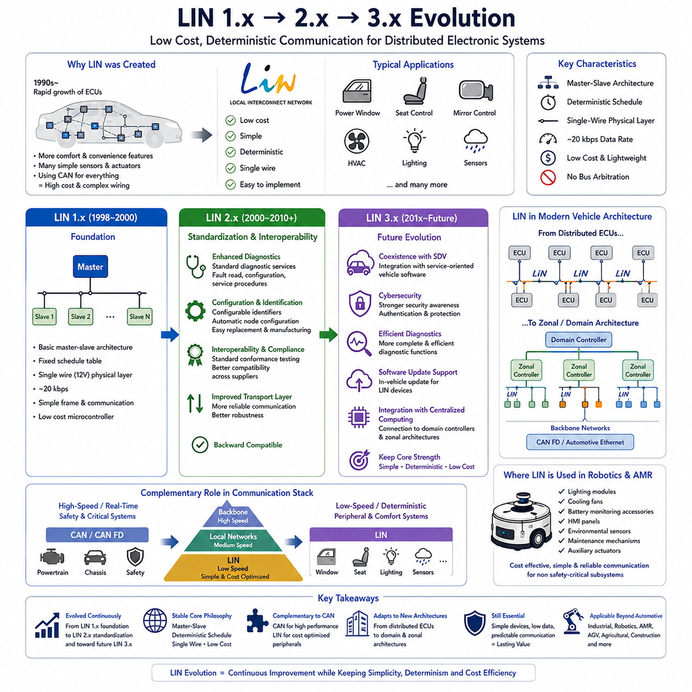
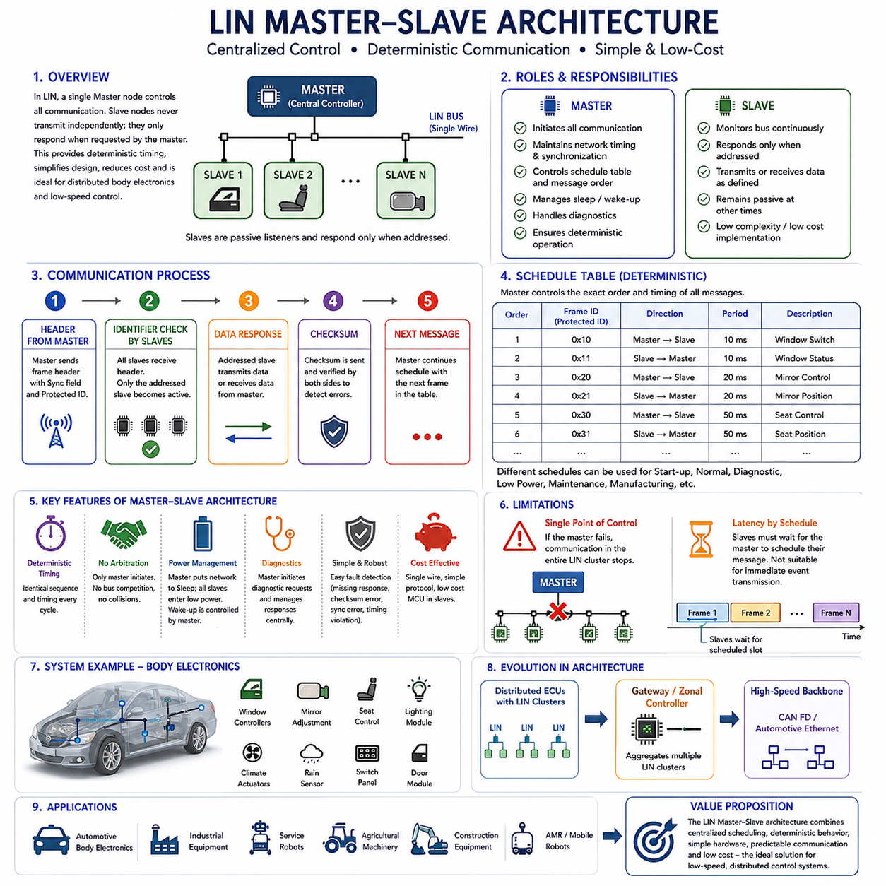
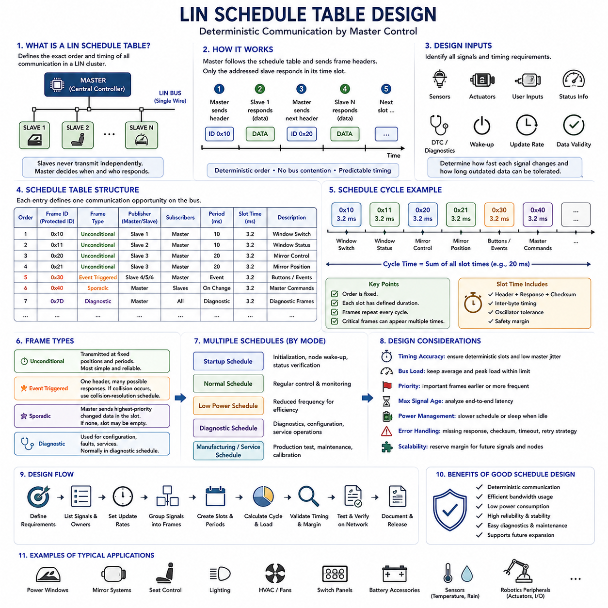
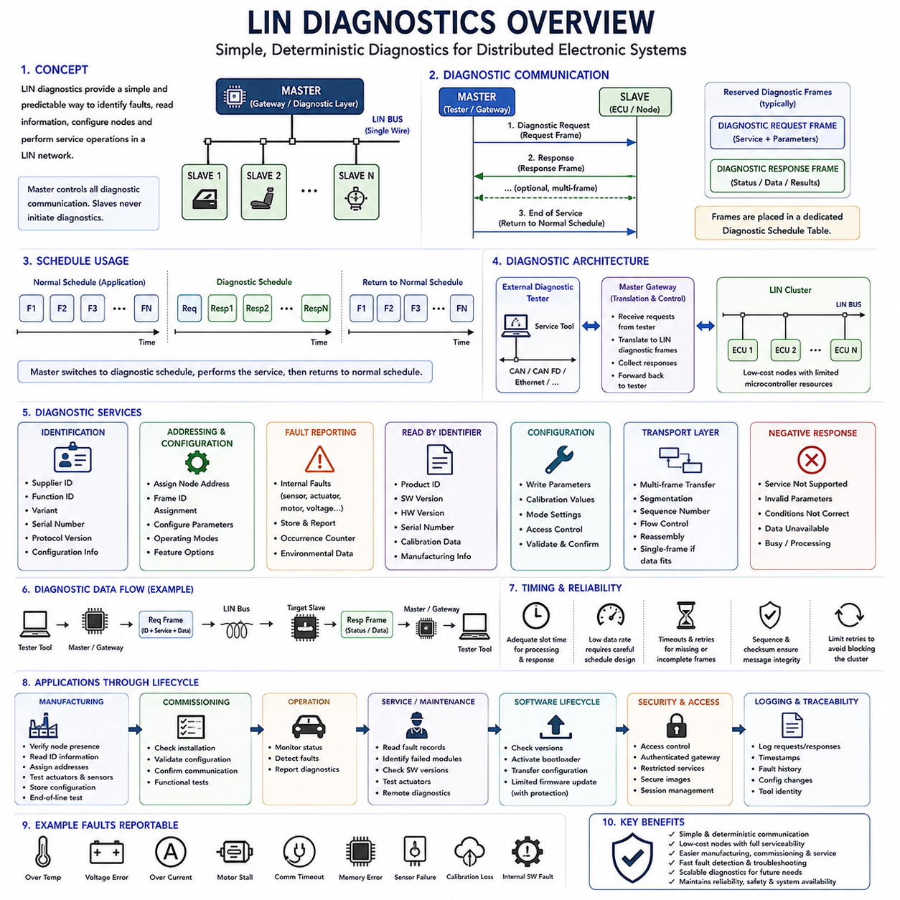
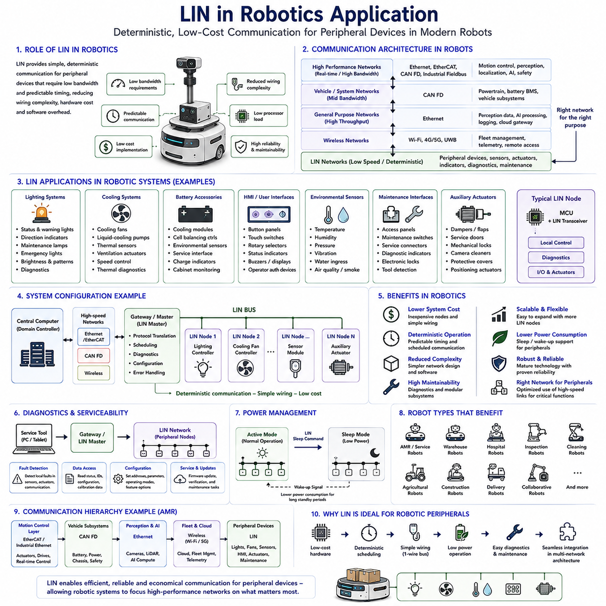

**Volume 06 Automotive Communication**

# Chapter 2. LIN Protocol

## 2.1 LIN 1x 2x 3x Evolution

{width="7.268055555555556in" height="7.268055555555556in"}

LIN (Local Interconnect Network) was introduced to address the growing demand for low-cost communication in automotive electronic systems. During the 1990s, the number of Electronic Control Units increased rapidly as manufacturers added power windows, mirror controls, seat adjustment systems, climate control modules, lighting controllers, rain sensors, and numerous comfort features. Using Controller Area Network for every electronic device significantly increased wiring complexity and system cost. LIN was therefore developed as a lightweight communication protocol capable of supporting simple distributed control applications while complementing higher-performance vehicle networks. The protocol emphasized simplicity, deterministic communication, low hardware cost, and easy implementation rather than maximum bandwidth.

The earliest commercial implementation, commonly referred to as LIN 1.x, established the fundamental architecture that still defines the protocol today. A single master node controlled communication while multiple slave nodes responded according to a predefined communication schedule. The protocol operated over a single-wire physical layer, reducing wiring weight and connector complexity compared with differential communication buses. Typical data rates reached approximately 20 kbps, which proved sufficient for switches, actuators, sensors, and body electronics that transmitted relatively small amounts of information at predictable intervals.

LIN 1.x focused primarily on reducing wiring harness complexity while maintaining reliable communication under normal automotive operating conditions. The master periodically transmitted frame headers, and each assigned slave responded only when addressed by the schedule table. Since only one device transmitted payload data at any given time, bus arbitration was unnecessary. This simplified protocol behavior reduced controller requirements, lowered software complexity, and enabled inexpensive microcontrollers with integrated UART peripherals to implement the communication stack without dedicated communication hardware.

Although LIN 1.x successfully reduced system cost, early deployments revealed several limitations regarding interoperability between suppliers. Different interpretations of protocol behavior occasionally resulted in compatibility issues when components from multiple vendors were integrated into the same vehicle platform. Diagnostic capabilities were also relatively limited, making maintenance and system verification more difficult as vehicle electrical architectures became increasingly complex. These experiences motivated the automotive industry to develop a more standardized and interoperable protocol specification.

LIN 2.0 represented the first major evolution of the protocol by improving standardization, diagnostics, configuration management, and interoperability. Released in the early 2000s, LIN 2.0 introduced enhanced diagnostic services, improved transport layer functionality, automatic node configuration support, and more rigorous protocol definitions. These improvements allowed vehicle manufacturers to integrate LIN devices from different suppliers with significantly greater confidence while simplifying validation during vehicle development.

One of the most important additions in LIN 2.x was standardized diagnostic communication. Maintenance engineers could now retrieve fault information, configure devices, verify network operation, and perform software-related service procedures using standardized mechanisms. Diagnostic communication greatly reduced maintenance effort and improved field service efficiency because all compliant devices behaved consistently regardless of manufacturer. This capability also supported production-line testing and end-of-line verification during vehicle assembly.

LIN 2.x also introduced better support for node configuration and identification. Each slave node could be assigned configurable identifiers that simplified manufacturing, replacement, and maintenance activities. Production engineers no longer needed separate hardware variants for every installation location because configuration parameters could often be assigned during manufacturing or commissioning. This increased manufacturing flexibility while reducing inventory complexity throughout the automotive supply chain.

Another significant improvement involved stronger interoperability through standardized conformance testing. Component suppliers could validate their implementations against common specifications before delivering products to vehicle manufacturers. Compliance testing reduced integration risk, minimized unexpected communication behavior, and improved confidence when combining electronic modules developed by different organizations. As global automotive supply chains expanded, standardized compliance became increasingly valuable for maintaining product quality.

The LIN Consortium continued refining the protocol, leading to LIN 2.1 and LIN 2.2, which focused on correcting ambiguities, improving robustness, and maintaining backward compatibility. Rather than fundamentally redesigning the communication architecture, these revisions clarified protocol behavior, refined diagnostic services, strengthened transport-layer reliability, and improved documentation. Manufacturers could therefore upgrade software implementations without replacing existing physical network infrastructure.

LIN 2.2A became one of the most widely adopted versions because it combined mature protocol behavior with excellent compatibility across suppliers. Numerous body control modules, lighting systems, HVAC controllers, seat electronics, steering wheel switches, rain sensors, window lifters, mirror adjustment modules, and door control units adopted this specification. The protocol demonstrated that stable low-speed communication could remain commercially valuable even as high-speed vehicle networks continued to evolve.

The transition toward LIN 3.x does not represent a complete replacement of previous protocol generations but rather an evolutionary direction supporting modern automotive electrical architectures. Future developments emphasize improved coexistence with service-oriented vehicle software, enhanced cybersecurity awareness, more efficient diagnostics, better software update support, and closer integration with centralized computing platforms. While the fundamental master-slave scheduling concept remains effective, surrounding system requirements continue to evolve alongside software-defined vehicles.

As vehicle architectures increasingly migrate toward domain controllers and zonal architectures, the role of LIN also changes. Instead of connecting directly to numerous distributed Electronic Control Units, LIN subnetworks increasingly connect to intelligent gateway modules or zonal controllers. These controllers aggregate multiple LIN clusters and communicate with higher-speed backbone networks such as CAN FD or Automotive Ethernet. This hierarchical architecture preserves the cost advantages of LIN while supporting modern centralized computing systems.

Despite significant advances in automotive communication technologies, LIN continues to occupy an important position because many peripheral devices simply do not require high bandwidth. Window switches, seat position sensors, mirror motors, lighting actuators, sunroof controllers, climate control flaps, occupancy sensors, and similar devices exchange relatively small amounts of deterministic information. Using high-speed communication protocols for such components would unnecessarily increase hardware complexity, power consumption, and system cost.

From a network engineering perspective, the evolution from LIN 1.x to LIN 3.x illustrates how communication protocols mature through continuous refinement rather than revolutionary redesign. The physical layer, deterministic scheduling philosophy, and master-slave communication model have remained remarkably stable because they successfully satisfy the requirements of low-cost embedded control. Most evolutionary improvements have focused on interoperability, diagnostics, configuration, maintainability, software integration, and lifecycle management rather than increasing communication speed alone.

The relationship between LIN and CAN also evolved throughout successive protocol generations. Rather than competing directly, the two protocols became complementary technologies within vehicle communication architectures. CAN provides reliable real-time communication for powertrain, chassis, and safety-critical functions, while LIN serves local peripheral devices requiring deterministic yet inexpensive communication. This layered communication strategy optimizes both performance and cost across the complete electrical system.

The emergence of Software-Defined Vehicles and centralized computing does not eliminate the need for LIN. Instead, LIN increasingly functions as an intelligent edge communication technology connecting distributed sensors and actuators to centralized controllers. Local intelligence remains near physical devices while system-level decision making moves toward domain controllers and high-performance computing platforms. This architectural separation enables scalable vehicle designs while preserving the economic advantages that originally motivated LIN development.

The lessons learned from LIN evolution also influence communication architectures beyond passenger vehicles. Industrial automation equipment, service robots, agricultural machines, construction vehicles, Autonomous Mobile Robots, and other embedded systems frequently require reliable communication for numerous low-speed peripheral devices. Designers often adopt communication strategies inspired by LIN principles, including deterministic scheduling, centralized control, simplified hardware implementation, and predictable network behavior for cost-sensitive embedded applications.

In modern Autonomous Mobile Robot platforms, LIN can provide an efficient communication solution for non-safety-critical peripheral subsystems such as lighting modules, cooling fans, battery monitoring accessories, human-machine interface panels, environmental sensors, seat or maintenance mechanisms, and auxiliary actuators. High-performance perception, motion control, localization, and fleet communication continue to rely on faster protocols, while LIN minimizes cost and wiring complexity for secondary functions. This balanced architecture demonstrates that mature communication protocols often remain valuable because they solve specific engineering problems efficiently rather than attempting to satisfy every possible communication requirement.

Ultimately, the evolution from LIN 1.x through LIN 2.x toward future LIN 3.x concepts reflects the broader progression of embedded communication engineering. The protocol has continuously adapted to changing requirements while preserving its original design philosophy of simplicity, predictability, low implementation cost, and deterministic operation. More than two decades after its introduction, LIN remains an essential component of automotive and robotic communication architectures because its evolutionary development has consistently balanced technological advancement with practical engineering requirements.

## 2.2 Master Slave Architecture

{width="7.268055555555556in" height="7.268055555555556in"}

In a Local Interconnect Network, the Master-Slave architecture forms the foundation of all communication activities. Unlike communication protocols that allow multiple nodes to compete for bus access, LIN adopts a centralized control model in which a single master node completely governs network timing, communication scheduling, and message initiation. Slave nodes never transmit data independently and only respond when explicitly requested by the master. This deterministic communication mechanism significantly simplifies network behavior, reduces implementation complexity, minimizes hardware requirements, and provides predictable communication timing suitable for low-cost embedded systems.

The Master-Slave architecture was intentionally designed to satisfy the requirements of distributed electronic control systems that exchange relatively small amounts of data at fixed intervals. Many automotive body electronics, including window controllers, mirror adjustment systems, seat controllers, lighting modules, climate control actuators, rain sensors, and switch panels, do not require high-speed event-driven communication. Instead, they benefit from a communication architecture that provides stable, periodic, and deterministic message transmission with minimal software overhead. LIN achieves this objective through centralized scheduling rather than distributed arbitration.

Within a LIN network, only one master node exists for each communication cluster. The master is responsible for maintaining network synchronization, initiating every communication frame, determining message transmission order, controlling communication timing, managing sleep and wake-up procedures, and coordinating diagnostic communication. Since every transmission originates from the master, network behavior remains highly predictable regardless of the number of slave devices connected to the bus.

Slave nodes perform a much simpler role than the master. Each slave continuously monitors the communication bus while waiting for a frame header containing its assigned identifier. When the identifier matches its configured response frame, the slave transmits or receives the associated data according to the protocol definition. At all other times, slave nodes remain passive listeners. This simplified behavior allows extremely inexpensive microcontrollers with limited computational resources to implement complete LIN communication functionality.

One of the greatest advantages of the Master-Slave architecture is deterministic communication. Because the master completely controls transmission timing through predefined schedule tables, every communication cycle follows an identical sequence unless the schedule itself changes. Engineers therefore know exactly when every message will appear on the network. This predictable timing greatly simplifies software design, real-time scheduling, testing, debugging, and functional verification.

Unlike Controller Area Network, LIN does not require bus arbitration. In CAN, multiple Electronic Control Units may simultaneously attempt transmission, requiring arbitration based on message priority. LIN completely eliminates this complexity because only the master initiates communication. Slave nodes never compete for bus access since they only respond after receiving a valid frame header addressed specifically to them. The absence of arbitration reduces protocol complexity while lowering hardware implementation costs.

Communication within the Master-Slave architecture begins with the master transmitting a frame header. The frame header consists of a synchronization field, a protected identifier, and associated timing information that informs every slave about the upcoming communication transaction. All slave nodes receive this header simultaneously, but only the addressed slave becomes active while every other node remains silent. This behavior prevents message collisions and guarantees orderly communication throughout the network.

The synchronization field plays a particularly important role because LIN employs inexpensive oscillators rather than highly accurate crystal references in many slave devices. The synchronization byte enables slave nodes to adjust their local timing before interpreting the remainder of the communication frame. Consequently, reliable communication can be maintained even when low-cost hardware exhibits relatively large clock tolerances.

The protected identifier determines both the destination node and the communication type. Every slave continuously compares incoming identifiers with its configured response table. When a match occurs, the slave either transmits its data or prepares to receive information from the master, depending on the frame definition. This identifier-based communication allows multiple independent devices to share the same physical bus without requiring complex addressing mechanisms.

After the frame header has been transmitted, the designated slave either sends the data field or accepts incoming information from the master. The communication concludes with checksum verification, allowing both the transmitting and receiving nodes to detect transmission errors. If communication errors occur, higher-level diagnostic procedures may request retransmission or initiate maintenance activities depending on the system implementation.

Schedule tables are fundamental to the Master-Slave architecture because they define the precise communication order throughout normal operation. Each schedule specifies the sequence of frame identifiers, transmission intervals, repetition frequency, and communication priorities required for a particular operational mode. Different schedules may be activated for startup, normal driving, diagnostic operation, manufacturing, maintenance, or low-power conditions, allowing the network to adapt to changing operational requirements without modifying the underlying communication protocol.

The Master-Slave architecture also supports deterministic power management. When communication activity is no longer required, the master may issue a sleep command that instructs every slave to enter a low-power operating mode. During sleep, current consumption decreases significantly, contributing to improved battery efficiency. When communication must resume, the master generates a wake-up sequence that restores normal network operation in a controlled and synchronized manner.

Diagnostic communication follows the same centralized philosophy. The master initiates diagnostic requests and directs responses from the appropriate slave nodes. This centralized diagnostic management simplifies fault isolation because engineers can identify which device generated each response while maintaining a consistent communication sequence. Standardized diagnostic services introduced in later LIN versions further improved maintenance efficiency and interoperability across multiple suppliers.

Fault tolerance within the Master-Slave architecture is achieved through simplicity rather than redundancy. Since communication timing is predetermined and only one device controls bus access, abnormal behavior can often be detected quickly by monitoring missing responses, checksum failures, synchronization errors, or timing violations. Diagnostic software can therefore identify communication faults without requiring complex distributed fault-management algorithms.

Although the Master-Slave architecture provides exceptional simplicity, it also introduces several limitations. The entire communication network depends on the proper operation of the master node. If the master becomes unavailable, communication across the entire LIN cluster ceases because slave nodes cannot independently initiate message transmission. Consequently, the master represents a single point of control that must operate reliably throughout the system lifecycle.

Communication latency is also influenced by schedule-table design. Since slave nodes cannot immediately transmit new information, they must wait until the master schedules the corresponding communication frame. Critical information requiring immediate transmission is therefore better suited to higher-performance protocols such as CAN or CAN FD, while LIN remains ideal for periodic monitoring and low-speed peripheral control.

The Master-Slave architecture scales efficiently for distributed body electronics because additional slave devices can often be incorporated simply by extending the communication schedule and assigning new frame identifiers. This modular expansion simplifies vehicle development, reduces wiring complexity, and allows manufacturers to introduce optional features without fundamentally redesigning the communication architecture.

As automotive electrical systems evolve toward domain controllers and zonal architectures, the Master-Slave concept continues to remain relevant. Individual LIN clusters increasingly connect to intelligent gateway controllers that aggregate multiple peripheral networks before forwarding information to high-speed backbone communication systems. The deterministic behavior of each LIN cluster allows higher-level controllers to manage numerous peripheral devices while preserving predictable communication timing and minimizing implementation cost.

The same architectural principles have proven valuable beyond passenger vehicles. Industrial automation equipment, service robots, agricultural machinery, construction equipment, and Autonomous Mobile Robots frequently require communication among numerous low-speed sensors, switches, actuators, lighting modules, cooling systems, maintenance interfaces, and auxiliary devices. Centralized Master-Slave communication provides an economical solution whenever deterministic behavior, simple implementation, and predictable scheduling are more important than maximum communication bandwidth.

Ultimately, the LIN Master-Slave architecture demonstrates that effective communication design depends on selecting an architecture appropriate for application requirements rather than pursuing maximum performance. By combining centralized scheduling, deterministic timing, simplified hardware, predictable communication behavior, and low implementation cost, the Master-Slave model has remained a highly successful foundation for LIN networks and continues to serve as an efficient communication architecture for modern automotive electronics and robotic peripheral control systems.

## 2.3 Schedule Table Design

{width="7.268055555555556in" height="7.268055555555556in"}

A LIN schedule table defines the exact order and timing of communication within a Local Interconnect Network. Because slave nodes cannot transmit independently, the master must determine when each frame header is sent and which node may respond. The schedule table therefore acts as the operational timeline of the network, converting application requirements into a deterministic sequence of communication slots that can be repeated continuously during normal operation.

Each schedule entry usually contains a frame identifier, transmission period, slot duration, frame type, publisher, subscriber, and timing relationship to neighboring entries. The master processes these entries sequentially and transmits the corresponding frame headers at predefined moments. By controlling every communication opportunity, the schedule table eliminates bus contention and allows engineers to predict when each signal will be updated, received, and available to the application software.

The first step in schedule table design is to identify all signals exchanged across the LIN cluster. Engineers must determine which sensors produce information, which actuators require commands, how quickly each value can change, and how long the receiving function can tolerate outdated data. Window switches, motor positions, temperature values, lighting commands, fan status, diagnostic information, and wake-up requests may all require different update rates and communication priorities.

Signal timing requirements should be translated into frame periods that reflect actual functional needs. A rapidly changing user input may require transmission every 10 or 20 milliseconds, while a slowly varying temperature sensor may only need an update every 100 or 500 milliseconds. Selecting periods that are unnecessarily short increases network load, power consumption, and processor activity without improving system behavior, while excessively long periods may create delayed or unstable control responses.

Multiple signals are commonly packed into a single LIN frame to use the available payload efficiently. Signals with similar update periods, operational importance, and publisher ownership should be grouped whenever possible. However, engineers should avoid combining fast-changing control data with slow status information if doing so forces the entire frame to be transmitted more frequently than necessary. Effective signal packing balances bandwidth efficiency, timing accuracy, maintainability, and future expansion.

Slot duration must include enough time for the frame header, response field, checksum, inter-byte timing, oscillator tolerance, and required safety margin. The designer should not assume that the nominal data length alone determines the slot time. Variations in slave response timing, software interrupt latency, physical-layer delay, and clock synchronization must also be considered so that one frame never overlaps with the next scheduled communication opportunity.

The total schedule cycle is formed by adding the durations of all scheduled slots. This cycle time determines how frequently the complete set of messages is repeated. If a frame must be transmitted more often than the overall cycle allows, it may appear multiple times within the same schedule table. Repeating critical frames at shorter intervals is often more efficient than reducing every slot period or creating an unnecessarily fast global communication cycle.

Determinism is achieved only when slot timing remains consistent under all specified operating conditions. The master software must therefore execute the schedule with controlled jitter and avoid delays caused by unrelated tasks. Timer configuration, interrupt priorities, operating-system scheduling, diagnostic processing, and application workload must be reviewed carefully because excessive master-side timing variation can reduce the predictability that LIN is intended to provide.

Schedule table design should consider both average bus load and peak communication demand. A schedule that appears acceptable during normal operation may become overloaded when diagnostics, configuration, event handling, or status reporting are added. Engineers should reserve timing margin for exceptional conditions and future feature expansion. Operating the network continuously near its theoretical capacity leaves little tolerance for timing deviation, software updates, or additional nodes.

LIN supports several frame types, and each type influences scheduling behavior. Unconditional frames are transmitted at fixed positions and provide the simplest deterministic operation. Event-triggered frames allow several possible responses to share one slot when events occur infrequently. Sporadic frames are initiated when specific master-side information changes, while diagnostic frames support configuration, fault reporting, and service operations. Schedule design must account for the behavior and limitations of each frame category.

Unconditional frames are generally preferred for signals that require regular and predictable updates. Their fixed transmission positions simplify timing analysis and guarantee that receivers obtain data within a known maximum age. Safety-related monitoring, actuator commands, position feedback, and frequently used status values often benefit from this approach, although LIN itself is normally applied to non-safety-critical or lower-criticality peripheral functions.

Event-triggered frames can reduce bus load when several slave nodes generate similar low-frequency events. The master sends one shared header, and only a slave with new information attempts to respond. If more than one slave responds simultaneously, a collision may occur, and the master must switch to a collision-resolution schedule containing the associated unconditional frames. This method improves efficiency but introduces additional design and validation complexity.

Sporadic frames are useful when the master publishes several signals that change infrequently. Instead of transmitting every related frame periodically, the master selects the highest-priority pending frame for the available sporadic slot. If no data has changed, the slot may remain unused. Designers must define clear priority rules and ensure that low-priority updates are not delayed indefinitely by repeatedly occurring higher-priority traffic.

Diagnostic schedules are normally separated from the regular application schedule. When a diagnostic session begins, the master may temporarily switch to a schedule containing diagnostic request and response frames. This avoids disturbing normal communication more than necessary while allowing node identification, fault retrieval, configuration, and service procedures. The transition between normal and diagnostic schedules must be controlled so that essential application signals are not unintentionally delayed.

Different schedule tables may be created for startup, normal operation, sleep preparation, diagnostics, manufacturing, maintenance, degraded operation, and feature-specific modes. A startup schedule may prioritize node initialization and status verification, whereas a normal schedule emphasizes regular control and monitoring. A low-power schedule may reduce transmission frequency, and a service schedule may allocate more bandwidth to diagnostics. Mode-dependent schedules improve efficiency but require carefully defined transition conditions.

Schedule transitions must occur at predictable boundaries. The master should normally complete the current frame or schedule cycle before activating another table unless an urgent system condition requires immediate action. Designers must define which events trigger transitions, which schedule has priority, how pending transmissions are handled, and how slave nodes interpret delayed or temporarily missing frames. Poorly controlled transitions can create stale data, unexpected actuator behavior, or diagnostic failures.

Frame priorities are implemented indirectly through position and repetition rate rather than bus arbitration. High-priority information should appear earlier, more frequently, or in dedicated schedules, while less important data may be transmitted later or at longer intervals. Priority design should be based on functional impact, signal freshness requirements, failure response, and user experience rather than convenience during software implementation.

The maximum age of each signal should be calculated from its frame period, communication latency, processing delay, and schedule transition behavior. A receiving function may not act immediately after transmission because the slave must first process the data and update its application state. End-to-end timing analysis should therefore include sensing, frame scheduling, bus transmission, reception, software processing, and actuator response to confirm that the complete control loop satisfies its requirement.

Schedule tables also influence power consumption. Frequent communication prevents nodes from remaining in low-power states and increases processor wake-up activity. Systems intended to operate from limited battery capacity should use slower schedules when functions are inactive and transition to sleep when communication is unnecessary. Wake-up behavior must be coordinated with schedule activation so that slaves have sufficient time to initialize before valid data exchange begins.

Error handling should be incorporated into schedule design rather than treated as a separate concern. Missing responses, checksum errors, framing errors, and invalid data may require counters, retries, diagnostic reporting, or fallback behavior. Immediate retransmission is not always necessary because it can disturb deterministic timing. In many cases, the next periodic occurrence of the frame provides a controlled retry while higher-level software monitors repeated failures.

Testing should verify not only message content but also timing behavior. Engineers should measure frame periods, slot durations, response delays, master jitter, bus utilization, schedule transitions, collision resolution, sleep entry, wake-up recovery, and diagnostic operation. Tests should include normal voltage, temperature, processor load, oscillator tolerance, communication faults, and worst-case software execution to confirm that the schedule remains stable throughout the expected operating environment.

Simulation and network analysis tools are valuable during early design because they allow engineers to estimate bus load and identify timing conflicts before hardware becomes available. A model can represent frame lengths, periods, signal packing, diagnostic traffic, and schedule transitions. However, simulated timing should later be confirmed on the physical network because actual transceiver behavior, cable characteristics, interrupt latency, and slave implementation may introduce additional delay.

Schedule documentation should clearly record frame identifiers, signal ownership, publishers, subscribers, update periods, slot times, frame lengths, schedule names, activation conditions, diagnostic behavior, and revision history. Consistent documentation allows software developers, electrical engineers, test teams, suppliers, and service personnel to understand the network without reconstructing design intent from source code. Version control is essential because a small timing change can affect multiple nodes.

In automotive and robotic systems, a well-designed LIN schedule table enables low-cost peripheral devices to operate as one coordinated network. Lighting modules, cooling fans, switch panels, auxiliary actuators, battery accessories, maintenance interfaces, environmental sensors, and comfort functions can exchange information predictably without complex arbitration or expensive hardware. The quality of the schedule directly determines communication responsiveness, efficiency, stability, and serviceability.

Ultimately, LIN schedule table design is the process of transforming functional timing requirements into a deterministic communication plan. Successful designs balance signal freshness, frame grouping, cycle time, bus load, diagnostics, power management, fault handling, and future scalability. When the schedule is carefully analyzed, documented, and validated, the LIN cluster provides reliable and predictable communication while preserving the simplicity and low implementation cost that define the protocol.

## 2.4 LIN Diagnostics

{width="7.268055555555556in" height="7.268055555555556in"}

LIN diagnostics provide a structured method for identifying faults, reading status information, configuring nodes, and supporting service activities within a Local Interconnect Network. Because LIN is commonly used for low-cost sensors, switches, motors, lighting modules, and body electronics, diagnostic communication must remain simple, predictable, and compatible with limited microcontroller resources. The diagnostic architecture extends normal LIN communication without changing the basic master-controlled operating principle.

Diagnostic communication in LIN is initiated and coordinated by the master node. Slave nodes do not begin diagnostic exchanges independently, even when an internal fault has been detected. Instead, the master sends a diagnostic request through a predefined diagnostic frame, and the addressed slave returns a response in the corresponding response frame. This centralized structure preserves deterministic bus access and prevents diagnostic traffic from creating uncontrolled communication behavior.

LIN diagnostics commonly use two reserved frame identifiers for request and response communication. The master request frame carries service information and parameters from the diagnostic tester or master application to one or more slave nodes. The slave response frame carries status, identification data, fault information, or configuration results back to the master. These frames are generally placed in a dedicated diagnostic schedule table.

A diagnostic exchange begins when the master switches from the normal application schedule to a diagnostic schedule. The request frame is transmitted first, followed by one or more response opportunities. After the requested diagnostic operation is completed, the master returns to the normal schedule. This schedule-based approach allows service communication to occur without permanently disrupting periodic control and monitoring messages.

The master node often acts as a gateway between an external diagnostic tester and the LIN cluster. A service tool may communicate with the vehicle or robot through CAN, CAN FD, Ethernet, or another higher-level network, while the gateway translates the request into LIN diagnostic messages. The response from the slave is then forwarded back to the tester. This architecture allows inexpensive LIN devices to participate in system-level diagnostics.

Node identification is one of the most important diagnostic functions. Each LIN slave may contain supplier identification, function identification, variant information, serial number, protocol version, and configurable addressing data. These values help production engineers, service technicians, and software tools determine exactly which device is installed and whether it is compatible with the expected system configuration.

LIN diagnostics also support node addressing and configuration. During manufacturing or commissioning, a slave may receive a new node address or frame identifier assignment based on its physical position or intended function. Configurable addressing reduces the need for multiple hardware variants and allows identical components to be installed in different locations. Correct configuration management is therefore essential for avoiding duplicate addresses or incorrect signal routing.

Fault reporting allows a slave to communicate internal abnormal conditions to the master. Typical examples include sensor failure, actuator blockage, motor overcurrent, supply voltage error, communication timeout, calibration loss, memory corruption, thermal overload, and internal software faults. The slave may store fault status locally until the master requests diagnostic information through the appropriate service.

Diagnostic Trouble Codes can be implemented at the LIN subsystem level even though the exact representation may depend on the application architecture. A slave may report standardized or manufacturer-specific fault identifiers together with status bits, occurrence counters, environmental conditions, or aging information. These records help maintenance personnel distinguish temporary communication disturbances from persistent hardware or software failures.

Read-by-identifier services are commonly used to retrieve static or semi-static information from a slave. The master may request product identification, software version, hardware version, serial number, calibration data, configuration state, or manufacturing information. These services are valuable during production testing, replacement verification, field service, and software compatibility checks.

Configuration services allow the master to change selected parameters stored inside the slave. These parameters may include node addresses, frame assignments, calibration values, operating modes, feature options, or application-specific settings. Because incorrect configuration can disable communication or create unsafe behavior, configuration services should include validation, access control, range checking, and confirmation of successful storage.

Transport-layer support becomes necessary when diagnostic information exceeds the payload capacity of a single LIN frame. In this case, the data is divided into multiple frames and transferred according to a defined sequence. The transport layer manages message segmentation, sequence numbering, flow control, timing, and reassembly. This allows larger diagnostic records or configuration data to be exchanged over the low-bandwidth network.

Single-frame communication is used when the complete diagnostic request or response fits within one frame. This method minimizes delay and protocol overhead. Multi-frame communication is used for larger data sets and requires the receiver to track the sequence correctly. Timeouts and sequence checks are necessary because a missing or delayed frame can invalidate the complete diagnostic message.

Diagnostic timing must be designed carefully because LIN operates at a relatively low data rate. The schedule must provide enough time for slave processing, frame transmission, response preparation, and transport-layer sequencing. If diagnostic slots are too short, slower slave devices may fail to respond. If too much bandwidth is allocated to diagnostics, normal application messages may be delayed beyond their acceptable update periods.

Timeout handling is essential for reliable diagnostic operation. The master must detect missing responses, incomplete multi-frame transfers, delayed processing, invalid sequence numbers, and communication interruptions. Depending on the service, the master may repeat the request, abort the transaction, report a diagnostic failure, or return to the normal schedule. Repeated retries should be limited to prevent one faulty node from blocking the entire cluster.

Negative responses provide information when a requested service cannot be completed. A slave may reject a request because the service is unsupported, the parameters are invalid, the operating conditions are incorrect, the requested data is unavailable, or the device is busy. Clear negative response behavior improves troubleshooting because the tester can distinguish between communication failure and an intentionally rejected diagnostic request.

Production-line diagnostics are a major application of LIN diagnostic services. During manufacturing, the system can verify node presence, read identification information, assign addresses, test actuators, validate sensor signals, confirm wiring integrity, and store configuration data. Automated end-of-line testing reduces manual inspection effort and ensures that each installed device communicates correctly before the product leaves the factory.

Field service diagnostics support maintenance after deployment. Technicians can identify failed modules, retrieve stored fault records, confirm software versions, verify replacement parts, test actuator operation, and check communication quality. Since LIN nodes are often physically distributed throughout a vehicle or robot, remote diagnostic access reduces disassembly time and improves service efficiency.

Diagnostic communication also supports software lifecycle management. Although LIN is not typically used as the primary channel for large software updates, it may assist with bootloader activation, version checking, configuration transfer, or limited firmware programming. The master or gateway must ensure that update procedures are robust against power loss, communication interruption, incorrect software images, and incomplete memory programming.

Cybersecurity must be considered when diagnostic services can modify device behavior. Unauthorized access to configuration, actuator control, calibration, or software update functions may create operational or safety risks. Access control, authenticated gateway communication, restricted service modes, secure software images, diagnostic session management, and protected production credentials help reduce misuse.

Diagnostic access should be separated according to lifecycle stage and user authority. Manufacturing functions, engineering development services, maintenance operations, and customer-level diagnostics may require different permissions. A service technician may be allowed to read faults and replace a node but not modify protected calibration parameters. Clear access levels reduce accidental changes and support traceable system management.

Logging diagnostic activity improves traceability and root-cause analysis. The master or gateway may record diagnostic requests, responses, node addresses, timestamps, failure results, configuration changes, software versions, and service-tool identity. These records help engineering teams determine whether a problem originated from the device, network, software, maintenance procedure, or unauthorized modification.

Diagnostic validation should include both functional and timing tests. Engineers should verify correct service responses, node identification, address assignment, multi-frame transfer, negative responses, timeout behavior, schedule transitions, error recovery, sleep interaction, and gateway routing. Tests should also cover voltage variation, temperature extremes, processor load, damaged wiring, missing nodes, corrupted frames, and interrupted communication.

In Autonomous Mobile Robot systems, LIN diagnostics can support peripheral devices such as lighting controllers, cooling fan modules, environmental sensors, auxiliary actuators, battery accessories, maintenance panels, and low-cost human-machine interfaces. The main robot controller can collect fault information from these devices and integrate it into a central maintenance dashboard, improving serviceability without requiring expensive communication hardware in every module.

Ultimately, LIN diagnostics extend a simple low-cost communication network into a maintainable and serviceable subsystem. By combining master-controlled requests, standardized diagnostic frames, node identification, configuration, fault reporting, transport-layer support, timeout handling, access control, and lifecycle traceability, LIN diagnostics enable reliable manufacturing, commissioning, operation, maintenance, and troubleshooting while preserving the deterministic and economical characteristics of the protocol.

## 2.5 LIN in Robotics Application

{width="7.268055555555556in" height="7.268055555555556in"}

Although the Local Interconnect Network was originally developed for automotive body electronics, its architecture has proven highly applicable to modern robotic systems. Robots often contain numerous peripheral devices that require reliable communication but do not demand high bandwidth or extremely low latency. Examples include lighting controllers, cooling systems, environmental sensors, battery monitoring accessories, maintenance interfaces, user control panels, and auxiliary actuators. Using LIN for these subsystems reduces wiring complexity, hardware cost, processor requirements, and software overhead while maintaining deterministic communication behavior.

Modern robots typically employ multiple communication technologies simultaneously. High-speed networks such as Ethernet, EtherCAT, CAN FD, or industrial fieldbuses handle motion control, perception, localization, artificial intelligence processing, and safety-critical functions. LIN complements these networks by providing an inexpensive communication layer for secondary devices. Rather than replacing high-performance communication protocols, LIN allows system architects to allocate each subsystem to the most appropriate network according to bandwidth, timing, reliability, and implementation cost.

Autonomous Mobile Robots represent an excellent example of heterogeneous communication architecture. A central computing platform processes camera images, LiDAR data, localization algorithms, fleet communication, navigation planning, and artificial intelligence workloads using high-performance communication networks. Meanwhile, numerous peripheral devices exchange relatively small amounts of information at predictable intervals. LIN enables these devices to operate efficiently without consuming valuable bandwidth on higher-speed communication buses.

Lighting systems are among the most common robotic applications for LIN communication. Status indicators, warning lights, direction indicators, maintenance lamps, emergency illumination, and decorative lighting generally require simple periodic commands rather than continuous high-speed data exchange. A LIN-based lighting controller can independently manage brightness, flashing patterns, diagnostic reporting, and fault detection while receiving periodic commands from the central controller through a deterministic communication schedule.

Cooling systems also benefit from LIN implementation. High-performance computing platforms frequently contain multiple cooling fans, liquid-cooling pumps, thermal sensors, and ventilation actuators. These devices continuously exchange temperature readings, operating status, fan speeds, and diagnostic information without requiring high-bandwidth communication. A dedicated LIN cluster allows thermal management to operate independently while reducing the complexity of the primary communication network.

Battery monitoring accessories represent another suitable application. Although primary Battery Management Systems often communicate through CAN because of safety and bandwidth requirements, auxiliary battery devices such as cooling modules, balancing controllers, environmental sensors, service interfaces, charging indicators, or battery cabinet monitoring units can efficiently communicate over LIN. Separating auxiliary functions from the primary battery network simplifies system architecture and reduces implementation cost.

Human-machine interfaces frequently include components that exchange relatively small amounts of information. Button panels, touch switches, rotary selectors, maintenance displays, status indicators, operator authentication devices, warning buzzers, and maintenance keyboards generally operate at low communication rates. Connecting these devices through a LIN cluster reduces wiring while providing deterministic response times suitable for user interaction.

Environmental monitoring modules often require only periodic communication. Temperature sensors, humidity sensors, enclosure pressure sensors, vibration monitors, water ingress detectors, air quality sensors, smoke detectors, and maintenance condition sensors typically generate slowly changing data. LIN provides sufficient bandwidth for these measurements while simplifying sensor integration throughout large robotic platforms.

Maintenance interfaces also benefit from centralized LIN communication. Access panels, maintenance switches, service connectors, diagnostic indicators, electronic locks, cabinet sensors, tool detection modules, and maintenance authorization devices may all communicate through the same LIN network. The central controller receives summarized maintenance information while each local LIN node independently manages its peripheral devices.

Auxiliary actuators represent another important application category. Cooling dampers, ventilation flaps, service doors, cable management systems, mechanical locks, indicator mechanisms, camera cleaning devices, protective covers, and accessory positioning actuators generally require deterministic but relatively slow communication. LIN allows these devices to be controlled efficiently without increasing the load on real-time motion-control networks.

Sensor aggregation is a valuable architectural benefit in robotic systems. Rather than connecting every low-speed sensor directly to the main controller, several local sensors may communicate with a dedicated LIN master or intelligent gateway. The gateway preprocesses sensor information, performs local diagnostics, filters invalid measurements, and forwards summarized information to higher-level controllers. This hierarchical architecture reduces network complexity while improving scalability.

Gateway controllers play an increasingly important role as robotic systems become more complex. A gateway may connect several independent LIN clusters to CAN FD, Industrial Ethernet, or robotic middleware. The gateway performs protocol translation, message scheduling, diagnostics, configuration management, timestamp synchronization, and error reporting. This layered communication architecture allows each network to operate according to its own strengths while maintaining complete system integration.

Deterministic scheduling remains one of LIN\'s greatest advantages in robotics. Peripheral devices rarely require asynchronous communication because their operating behavior changes relatively slowly. Fixed communication schedules ensure that sensor readings, actuator commands, diagnostic information, and maintenance status are updated predictably. Engineers can therefore calculate worst-case communication latency and guarantee consistent system behavior under all operating conditions.

Robotic safety architecture also benefits indirectly from LIN. Although safety-critical emergency functions should remain on dedicated safety-certified communication systems, many supporting devices contribute to operational safety without requiring certified real-time networks. Warning lights, operator indicators, maintenance notifications, cabinet monitoring, environmental sensing, and equipment status reporting can all be managed through LIN while preserving deterministic communication behavior.

Distributed robotic architectures frequently divide intelligence across multiple electronic modules. Instead of connecting every peripheral directly to the central computer, local controllers manage groups of nearby devices. Each local controller communicates internally through LIN while exchanging higher-level information with the main computer through faster networks. This distributed approach reduces cable length, simplifies maintenance, improves modularity, and supports scalable robot development.

Serviceability improves significantly when LIN diagnostics are incorporated into robotic subsystems. Local controllers can identify disconnected sensors, actuator faults, communication failures, thermal alarms, power anomalies, calibration problems, and configuration errors before reporting summarized information to the central maintenance system. Maintenance personnel therefore troubleshoot complete subsystems instead of individually examining every connected device.

Power management represents another practical advantage. Many robotic peripherals spend long periods in standby mode. LIN sleep commands allow local devices to enter low-power operation while wake-up sequences restore communication only when required. Reduced processor activity and communication traffic contribute to longer battery operating time, especially in mobile robotic platforms operating continuously throughout warehouses, hospitals, airports, factories, and logistics centers.

Software architecture also becomes more modular when LIN is introduced appropriately. Peripheral device drivers, diagnostic services, configuration management, firmware updates, and maintenance functions can be organized around individual LIN clusters. Software developers may update or replace one subsystem without affecting unrelated communication networks, improving maintainability and simplifying long-term product evolution.

Future robotic platforms are expected to integrate increasing numbers of sensors and intelligent peripheral devices. Domain controllers and centralized computing architectures will continue processing computationally intensive perception and artificial intelligence workloads, while distributed communication networks manage local hardware efficiently. LIN will remain valuable for numerous low-speed subsystems because its deterministic scheduling, mature ecosystem, low implementation cost, and proven reliability continue to satisfy peripheral communication requirements.

Industrial service robots, warehouse robots, hospital robots, inspection robots, cleaning robots, agricultural robots, construction robots, delivery robots, and collaborative robotic systems all contain numerous peripheral devices with communication requirements similar to those found in automotive electronics. Consequently, LIN principles extend naturally beyond the automotive industry into a wide variety of robotic applications where predictable communication, low hardware complexity, and economical implementation remain important engineering objectives.

In Autonomous Mobile Robot platforms, a practical communication hierarchy often places Industrial Ethernet or EtherCAT at the motion-control layer, CAN FD for vehicle subsystems, Ethernet for perception and artificial intelligence, wireless communication for fleet management, and LIN for local peripheral devices. Each protocol performs the tasks best suited to its capabilities, creating a balanced communication architecture that optimizes performance, scalability, reliability, maintainability, and overall system cost.

Ultimately, the role of LIN in robotic applications demonstrates that communication architecture should be selected according to functional requirements rather than technological popularity. High-bandwidth protocols are essential for perception, localization, artificial intelligence, and motion control, while deterministic low-cost communication remains the optimal solution for numerous peripheral devices. By integrating LIN appropriately within a layered communication architecture, robotic systems achieve lower implementation cost, simpler wiring, improved modularity, predictable operation, easier maintenance, and greater long-term scalability without compromising overall system performance.
