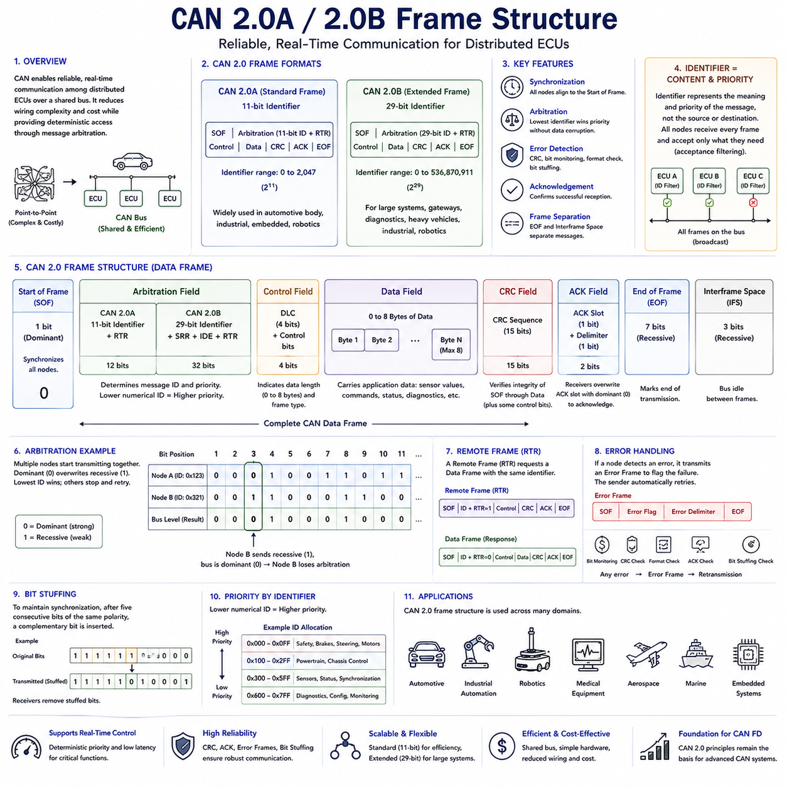
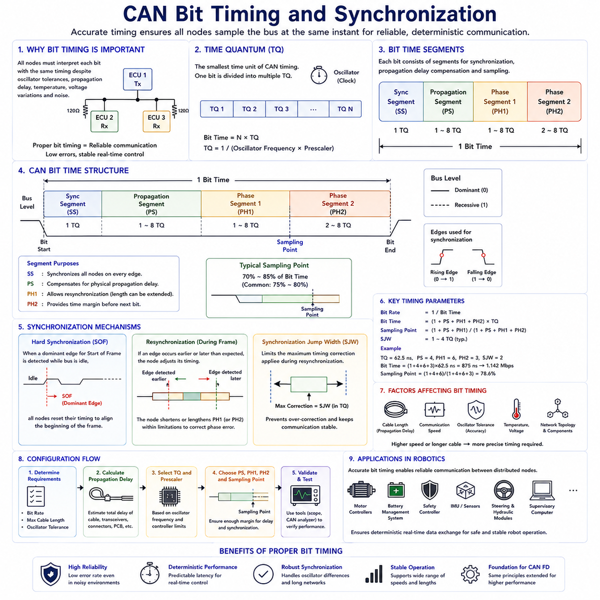
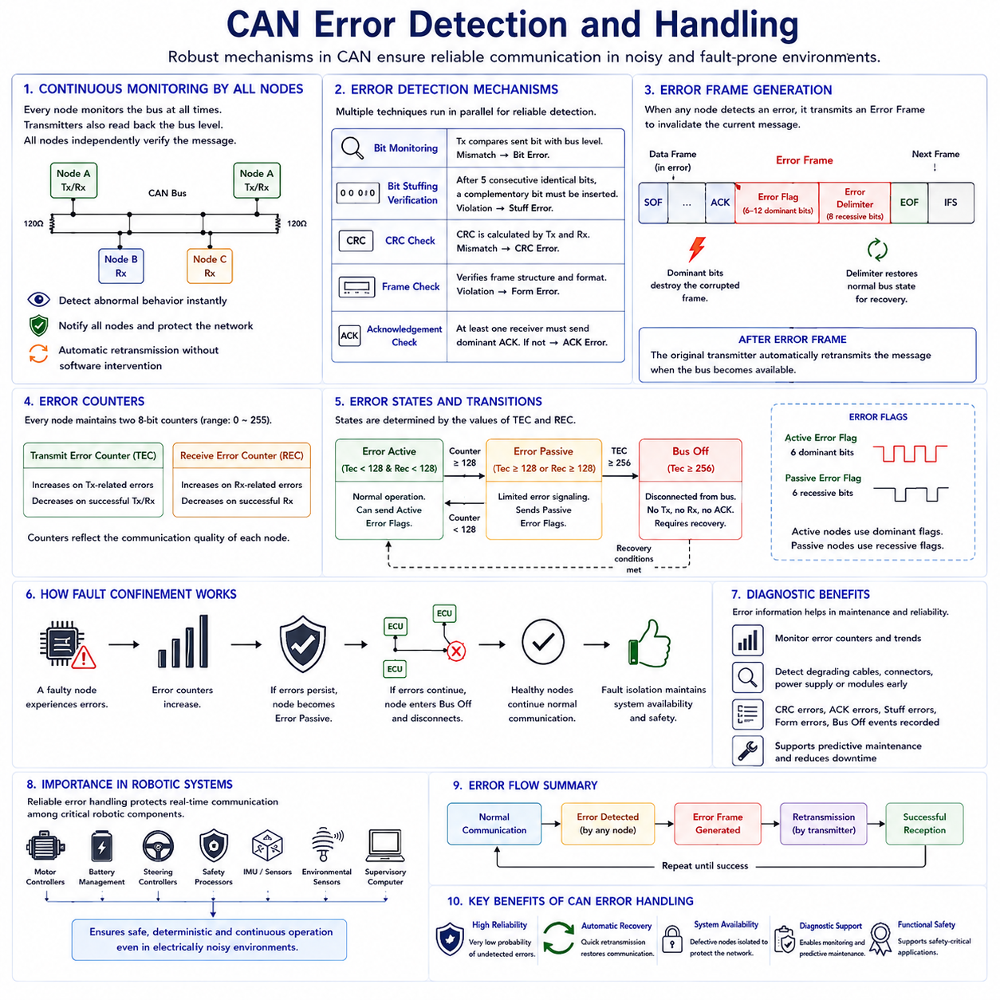
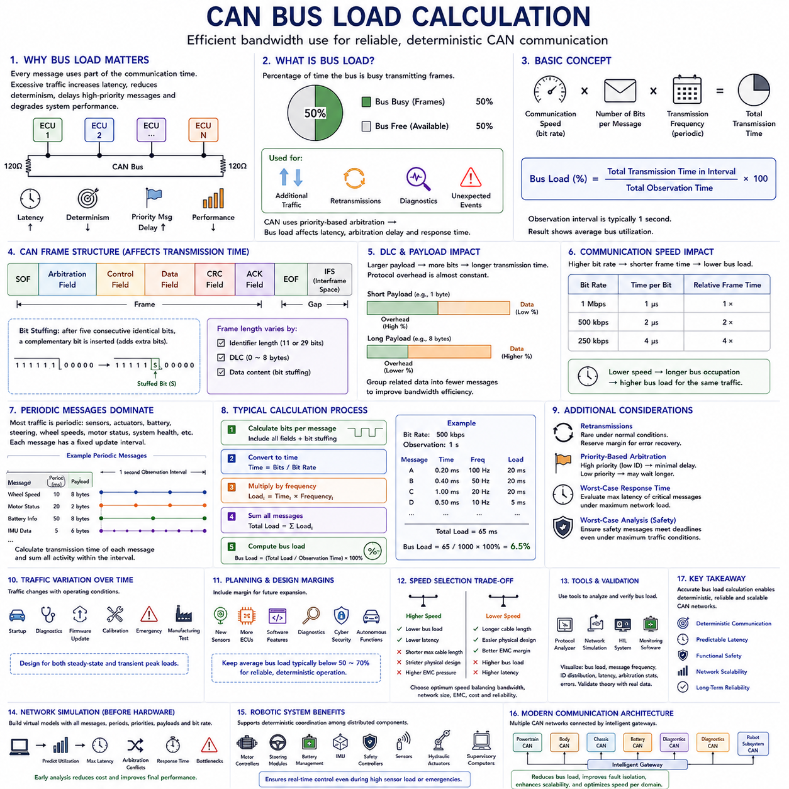
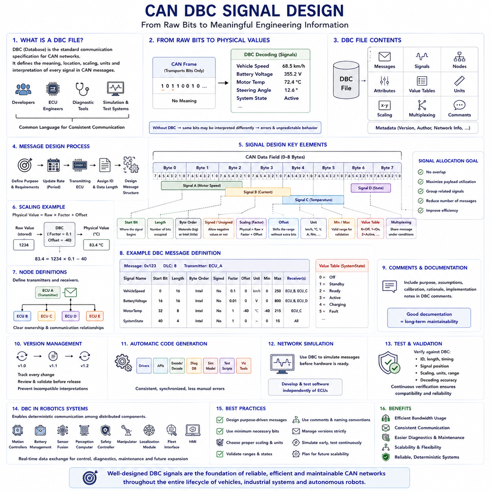

**Volume 06 Automotive Communication**

# Chapter 3. CAN Protocol

## 3.1 CAN 2.0A 2.0B Frame Structure

{width="7.268055555555556in" height="7.268055555555556in"}

The Controller Area Network was developed to provide reliable, real-time communication among distributed Electronic Control Units within automotive systems. Before CAN was introduced, point-to-point wiring connected individual electronic modules directly, resulting in increasing wiring complexity, higher vehicle weight, greater manufacturing cost, and reduced maintainability as more electronic functions were added. CAN addressed these challenges by introducing a shared communication bus where multiple controllers exchange information efficiently while maintaining deterministic access through message arbitration. The CAN 2.0 specification became the foundation of modern automotive communication and later expanded into industrial automation, robotics, medical equipment, aerospace, and numerous embedded control systems.

The CAN 2.0 specification defines two compatible frame formats known as CAN 2.0A and CAN 2.0B. CAN 2.0A uses an 11-bit standard identifier, while CAN 2.0B extends the identifier length to 29 bits, significantly increasing the available message address space. Both formats share the same physical communication principles, arbitration mechanism, error detection strategy, and overall frame organization. Devices supporting the extended format can generally communicate with both frame types, allowing manufacturers to balance compatibility, network complexity, and addressing requirements according to system design objectives.

A CAN frame is designed to transport information while simultaneously providing synchronization, arbitration, control, error detection, acknowledgement, and frame separation. Unlike communication protocols that require independent control messages for these functions, CAN integrates all essential communication mechanisms directly into each transmitted frame. As a result, every message becomes a self-contained communication transaction that can be interpreted consistently by every node connected to the network.

Communication always begins with the Start of Frame field. The Start of Frame consists of a single dominant bit that synchronizes every node connected to the bus. Since all controllers continuously monitor bus activity, detecting this dominant transition allows every receiver to align its internal timing before interpreting the remainder of the frame. Accurate synchronization is particularly important because CAN networks often operate at communication speeds ranging from several tens of kilobits per second to one megabit per second while maintaining reliable communication over varying cable lengths.

Immediately following the Start of Frame is the Arbitration Field, which determines both the message identity and transmission priority. In the standard CAN 2.0A frame, this field contains the 11-bit identifier together with the Remote Transmission Request bit. In the extended CAN 2.0B frame, additional control bits and an extra 18 identifier bits expand the identifier to 29 bits. The identifier does not represent a source or destination address. Instead, it identifies the meaning and priority of the transmitted information, allowing multiple controllers to process only the messages relevant to their assigned functions.

The arbitration mechanism represents one of the most innovative features of CAN communication. Multiple nodes may begin transmitting simultaneously after detecting an idle bus. During arbitration, each transmitter continuously compares the transmitted bit with the observed bus level. Because dominant bits always overwrite recessive bits, the message with the numerically lowest identifier wins arbitration without corrupting the communication already in progress. Nodes that lose arbitration simply stop transmitting and automatically retry after the current frame has been completed.

Following arbitration, the Control Field specifies characteristics of the transmitted frame. This field contains information describing the Data Length Code together with control bits that distinguish between standard and extended frame formats. The Data Length Code indicates how many bytes of application data follow within the Data Field. Classical CAN allows payload lengths ranging from zero to eight bytes, providing sufficient capacity for many real-time control applications while minimizing communication latency.

The Data Field carries the actual application information exchanged between Electronic Control Units. Depending on the application, these bytes may represent sensor measurements, actuator commands, diagnostic information, system status, control parameters, calibration values, or synchronization signals. CAN intentionally treats the payload as application-independent data, allowing identical communication mechanisms to support widely different control systems without modifying the underlying protocol.

After the Data Field, the Cyclic Redundancy Check field verifies transmission integrity. The transmitter calculates a CRC value using all protected bits within the communication frame and appends the result to the message. Every receiving node independently performs the same calculation and compares its result with the transmitted CRC. Any mismatch indicates that transmission errors have occurred, causing the frame to be rejected and automatically retransmitted if necessary. This distributed verification process provides extremely high communication reliability even in electrically noisy environments.

The Acknowledgement Field provides immediate confirmation that at least one receiver has successfully received the transmitted frame. During this field, the transmitter sends a recessive bit while every correctly receiving node overwrites it with a dominant bit. If no dominant acknowledgement is detected, the transmitter concludes that no receiver successfully accepted the message and automatically schedules retransmission. This mechanism allows communication failures to be detected without requiring complex higher-layer confirmation procedures.

The End of Frame marks the completion of message transmission using a sequence of recessive bits. These bits ensure that every controller recognizes the conclusion of the current communication before another frame begins. Following the End of Frame, an Interframe Space separates consecutive messages, allowing controllers sufficient time to prepare for subsequent communication while maintaining orderly bus operation throughout continuous message exchanges.

One of the distinguishing characteristics of CAN frame structure is that messages are identified by content rather than by physical device addresses. Every controller continuously receives every transmitted frame and independently determines whether the identifier matches one of its configured acceptance filters. Messages not required by a particular controller are discarded locally without affecting network communication. This broadcast communication model greatly simplifies distributed control architectures because adding new devices generally requires only updated filtering rather than modifications to existing message sources.

CAN 2.0A employs the standard frame format using the 11-bit identifier. This version supports 2,048 possible identifiers and remains widely used in automotive body electronics, industrial controllers, embedded equipment, and robotic subsystems. Its relatively short arbitration field improves communication efficiency because fewer identifier bits are transmitted during every message. Systems with moderate addressing requirements often prefer the standard format because it maximizes bandwidth utilization.

CAN 2.0B extends the identifier length to 29 bits, increasing the number of available identifiers to more than 536 million unique values. This significantly expanded addressing capability supports large distributed systems containing numerous functional modules, gateways, diagnostic services, and communication domains. Heavy commercial vehicles, agricultural machinery, industrial automation systems, marine electronics, and advanced robotic platforms frequently benefit from the additional identifier space available through extended CAN communication.

Although both frame formats coexist on compatible networks, arbitration always preserves deterministic communication. Standard identifiers have higher priority than extended identifiers when their shared base identifier values are identical because of the arbitration rules governing the Identifier Extension bit. System designers therefore carefully allocate identifier values to ensure predictable communication priorities regardless of which frame format individual messages employ.

Remote Frames provide another communication capability defined within CAN 2.0. Instead of carrying application data, a Remote Frame requests transmission of a Data Frame possessing the same identifier. Historically, this mechanism allowed one controller to request updated information from another without specifying additional protocol commands. Modern automotive systems generally prefer periodic transmission schedules or higher-layer communication protocols, causing Remote Frames to become much less common in contemporary network implementations.

Error Frames constitute an essential part of CAN reliability. Whenever a controller detects a communication error through bit monitoring, CRC verification, frame format checking, acknowledgement monitoring, or bit stuffing validation, it immediately transmits an Error Frame. This intentionally destroys the corrupted communication so that every node recognizes the failure. The original transmitter subsequently retries communication according to the protocol\'s automatic error recovery procedures, maintaining data consistency across the entire network.

Bit stuffing further improves communication reliability. To maintain synchronization, CAN automatically inserts a complementary bit after five consecutive bits of identical polarity. Every receiver removes these inserted bits before processing the actual message content. Any violation of the bit stuffing rule immediately indicates communication corruption, providing another independent mechanism for error detection while simultaneously maintaining clock synchronization among distributed controllers.

Frame efficiency depends on several factors beyond the application payload itself. Arbitration bits, control information, CRC, acknowledgement, bit stuffing, and interframe spacing all contribute communication overhead. Engineers therefore evaluate both payload efficiency and overall bus utilization when designing real-time communication schedules. Optimizing message frequency, payload grouping, identifier allocation, and network loading helps maintain predictable latency while avoiding unnecessary bandwidth consumption.

Frame identifiers also establish the communication priority hierarchy throughout the network. Messages associated with braking systems, steering control, motor control, emergency functions, or synchronization often receive lower numerical identifiers so they win arbitration more frequently. Less time-critical information such as diagnostics, configuration updates, environmental monitoring, or maintenance status generally receives lower priority identifiers. Proper identifier allocation directly influences system responsiveness under heavy communication load.

In robotic systems, CAN frame structure supports communication among distributed motor controllers, battery management systems, inertial sensors, safety controllers, hydraulic modules, steering systems, environmental monitoring devices, and supervisory controllers. Every subsystem exchanges information using the same standardized frame organization regardless of application purpose. This common communication model simplifies software development, hardware integration, testing, diagnostics, and long-term maintenance while allowing different manufacturers\' devices to coexist within a unified robotic communication architecture.

The evolution from CAN 2.0A to CAN 2.0B illustrates how communication protocols expand to support increasingly complex distributed systems while preserving backward compatibility and deterministic operation. Although later technologies such as CAN FD extend payload capacity and communication performance, the fundamental frame organization established by CAN 2.0 continues to define the core principles of synchronization, arbitration, error detection, acknowledgement, and reliable real-time communication that remain essential throughout modern automotive and robotic control systems.

## 3.2 Bit Timing and Synchronization

{width="7.268055555555556in" height="7.268055555555556in"}

Bit timing is one of the most fundamental concepts in Controller Area Network communication because it determines how every transmitting and receiving node interprets individual bits on the shared communication bus. Unlike asynchronous communication methods where each device operates independently, CAN requires every controller to maintain nearly identical timing throughout message transmission. Precise synchronization ensures that all Electronic Control Units observe the same bit boundaries despite variations in oscillator frequency, signal propagation delay, cable length, and environmental conditions. The ability to maintain accurate timing allows CAN networks to achieve deterministic communication with extremely high reliability in electrically noisy environments.

Every CAN controller contains an internal clock generated by a crystal oscillator or other timing source. Although these oscillators are highly accurate, no two devices produce exactly the same frequency. Manufacturing tolerances, temperature variation, supply voltage fluctuations, and component aging introduce small frequency differences between controllers. Without an effective synchronization mechanism, these small timing deviations would gradually accumulate, eventually causing receivers to sample transmitted bits incorrectly. CAN overcomes this challenge by continuously adjusting internal timing whenever suitable synchronization events occur during communication.

The smallest unit of CAN communication timing is the Time Quantum, commonly abbreviated as TQ. A Time Quantum represents the minimum programmable time interval used by the CAN controller to construct each communication bit. Rather than defining a bit as a fixed physical duration, CAN divides every bit into multiple Time Quanta, allowing engineers to configure communication timing according to network length, communication speed, oscillator frequency, and hardware characteristics. This flexible timing model enables CAN to operate reliably across a wide variety of embedded systems without changing the underlying communication protocol.

Each CAN bit consists of several logical timing segments that together define the complete bit period. These segments include the Synchronization Segment, Propagation Segment, Phase Segment 1, and Phase Segment 2. Every segment serves a specific purpose during communication, allowing synchronization adjustments, propagation delay compensation, and sampling accuracy to coexist within a single bit interval. Proper configuration of these segments determines whether a CAN network can operate reliably under different physical installation conditions.

The Synchronization Segment always occupies one Time Quantum and marks the beginning of every communication bit. This segment aligns all participating nodes whenever a signal transition occurs on the bus. Since CAN communication relies on detecting dominant-to-recessive or recessive-to-dominant transitions, these edges provide natural synchronization opportunities throughout message transmission. Every controller continuously monitors these transitions and adjusts its internal timing whenever necessary to maintain synchronization with the transmitting node.

Following the Synchronization Segment, the Propagation Segment compensates for physical signal delays throughout the communication network. Electrical signals require measurable time to travel along communication cables, connectors, transceivers, and printed circuit board traces. As network length increases, propagation delay also increases. The Propagation Segment ensures that transmitted signals have sufficient time to reach every node before receivers perform bit sampling. Proper configuration becomes increasingly important in large industrial networks, commercial vehicles, and distributed robotic platforms containing long communication cables.

Phase Segment 1 provides additional timing flexibility before the sampling point. During this interval, synchronization adjustments may extend the current bit duration when necessary to compensate for clock differences among communicating controllers. This adjustment process is called resynchronization and allows every receiver to gradually correct timing errors without interrupting communication. The ability to modify Phase Segment 1 contributes significantly to the remarkable robustness of CAN communication under real-world operating conditions.

Phase Segment 2 follows the sampling point and completes the remaining portion of the communication bit. Like Phase Segment 1, this segment may also participate in synchronization adjustments, although its primary function is to provide sufficient timing margin before the next communication bit begins. Together, the two phase segments allow CAN controllers to compensate for oscillator drift while maintaining accurate synchronization throughout long communication sessions involving thousands of consecutive transmitted bits.

The Sampling Point represents the exact instant at which every receiving controller determines whether the current bus level corresponds to a dominant or recessive bit. This moment typically occurs near seventy to eighty-five percent of the total bit duration, although precise positioning depends on network configuration. Selecting an appropriate sampling point balances propagation delay compensation against timing margin, ensuring reliable communication across different cable lengths and operating environments.

Oscillator tolerance directly influences allowable communication performance. Every controller\'s internal oscillator deviates slightly from its nominal frequency, and accumulated frequency differences determine how quickly timing errors grow between synchronization events. Networks employing high communication speeds or long cable lengths generally require oscillators with tighter tolerances because less timing margin exists for accumulated synchronization errors. Selecting appropriate oscillator specifications therefore becomes an important part of CAN hardware design.

Hard synchronization occurs whenever a controller detects the Start of Frame dominant edge while the bus was previously idle. During this event, every receiving controller immediately resets its internal bit timing so that the new communication frame begins with complete synchronization. Hard synchronization establishes the timing reference for the entire communication frame and provides the foundation upon which all subsequent resynchronization adjustments are based.

Resynchronization continuously maintains synchronization after communication has already begun. Whenever an unexpected signal transition occurs slightly earlier or later than predicted, the controller calculates a phase error and adjusts its internal timing accordingly. Instead of restarting communication, the controller simply lengthens or shortens the appropriate phase segment within predefined limits. These small corrections occur transparently throughout message transmission, allowing reliable communication despite unavoidable oscillator variations.

The amount by which timing may be adjusted during resynchronization is controlled by the Synchronization Jump Width. This configurable parameter limits the maximum timing correction applied after each synchronization event. Restricting the adjustment magnitude prevents excessive timing changes that could destabilize communication while still allowing sufficient flexibility to compensate for normal oscillator drift. Engineers carefully select Synchronization Jump Width values according to network speed, oscillator quality, and expected operating conditions.

Bit timing configuration requires balancing multiple design constraints simultaneously. Higher communication speeds reduce the duration of each communication bit, leaving less time for propagation delay compensation and synchronization adjustments. Longer communication cables increase propagation delay, requiring larger timing margins. Oscillator accuracy influences allowable synchronization error, while network topology affects overall signal distribution. Successful CAN system design therefore requires coordinated optimization of all timing parameters rather than independent adjustment of individual values.

Communication speed significantly influences timing configuration. Low-speed CAN networks operating at several tens of kilobits per second provide generous timing margins that accommodate long communication distances and relatively inexpensive oscillators. High-speed networks operating near one megabit per second require much more precise timing because each communication bit occupies only a very short interval. Consequently, high-speed automotive control systems often employ shorter communication cables together with carefully selected hardware components.

Signal propagation delay consists of several independent contributions. Electrical signals require time to travel through communication cables, transceiver circuits, connector interfaces, printed circuit boards, and internal controller logic. Every component contributes a small delay that collectively determines the total propagation time across the network. Engineers estimate these delays during network design to ensure that the configured Propagation Segment provides sufficient timing margin for reliable communication.

Bus length and communication speed share an inverse relationship. As communication speed increases, the maximum practical cable length decreases because propagation delay consumes a larger percentage of each communication bit. Conversely, reducing communication speed increases the allowable communication distance. Automotive body electronics, industrial automation systems, and mobile robots therefore select communication speeds appropriate for their expected physical network dimensions and performance requirements.

Proper bit timing directly influences communication reliability, latency, error rate, and electromagnetic compatibility. Incorrect timing configuration may produce CRC errors, acknowledgement failures, arbitration loss, frame errors, or complete communication instability. Many communication problems initially attributed to software defects actually originate from improperly configured timing parameters. Careful validation using oscilloscopes, CAN analyzers, and protocol monitoring equipment therefore forms an essential part of network commissioning and troubleshooting.

Modern CAN controllers often provide automatic timing calculation tools that simplify network configuration. Engineers specify oscillator frequency, desired communication speed, and selected hardware characteristics, after which configuration software recommends suitable timing parameters. Although these automated tools significantly reduce configuration complexity, experienced engineers still verify sampling point placement, propagation margin, oscillator tolerance, and synchronization performance to ensure reliable operation under all anticipated environmental conditions.

In robotic systems, accurate bit timing ensures reliable communication among motor controllers, battery management systems, safety controllers, inertial measurement units, steering modules, hydraulic controllers, environmental sensors, and supervisory computers. These distributed devices frequently operate under vibration, temperature variation, electrical noise, and dynamic mechanical loading. Proper synchronization allows every subsystem to exchange deterministic real-time information while maintaining coordinated motion, functional safety, and stable autonomous operation throughout demanding industrial environments.

The bit timing architecture defined within CAN represents one of the protocol\'s greatest engineering achievements because it enables independent controllers possessing imperfect oscillators to communicate with exceptional reliability over shared communication media. Through Time Quanta, synchronization segments, sampling point control, propagation delay compensation, resynchronization, and carefully controlled timing adjustments, CAN achieves deterministic communication performance that has supported automotive and industrial embedded systems for decades and continues to serve as the foundation for modern CAN FD communication technologies.

## 3.3 Error Detection and Handling

{width="7.268055555555556in" height="7.268055555555556in"}

Reliable communication has always been one of the primary design objectives of the Controller Area Network protocol. Automotive control systems exchange safety-critical information that directly influences braking, steering, powertrain operation, battery management, and numerous other vehicle functions. Any corrupted message may lead to incorrect control decisions with potentially serious consequences. Instead of relying on higher software layers to detect communication failures, CAN incorporates comprehensive error detection and recovery mechanisms directly into the protocol itself. Every node actively participates in maintaining communication integrity, making CAN one of the most fault-tolerant fieldbus technologies used in embedded systems.

CAN assumes that communication errors may occur because of electromagnetic interference, electrical noise, voltage fluctuations, cable damage, faulty connectors, defective transceivers, oscillator inaccuracies, or hardware failures. Rather than attempting to prevent every possible disturbance, the protocol continuously monitors communication quality and immediately detects abnormal behavior whenever transmission integrity is compromised. Once an error is detected, the current communication is terminated, every participating node is informed, and retransmission occurs automatically without application software intervention.

One of the most important characteristics of CAN is that every transmitting and receiving controller continuously monitors the communication bus. A transmitting node not only sends information but also simultaneously observes the actual bus level to verify that transmitted bits appear correctly on the physical network. Likewise, every receiver independently validates frame format, timing consistency, cyclic redundancy check values, acknowledgement behavior, and protocol rules. This distributed monitoring architecture ensures that communication reliability does not depend upon a single controller or centralized supervisory device.

CAN employs multiple independent error detection mechanisms operating simultaneously throughout message transmission. These mechanisms include Bit Monitoring, Bit Stuffing Verification, Cyclic Redundancy Check verification, Frame Check, and Acknowledgement Check. Each mechanism evaluates communication integrity from a different perspective, providing redundant protection against numerous failure modes. Since multiple techniques operate concurrently, the probability of an undetected communication error becomes extremely small, contributing to the outstanding reliability of CAN-based control systems.

Bit Monitoring represents one of the simplest yet most effective error detection techniques. During transmission, every transmitting controller compares each transmitted bit with the actual electrical level observed on the communication bus. Under normal conditions these values must match exactly. If a transmitter sends a recessive bit but observes a dominant level, or transmits a dominant bit but detects an unexpected recessive level outside arbitration rules, a Bit Error is immediately recognized. This continuous self-verification allows transmission faults to be detected within a single communication bit.

Bit Stuffing Verification provides another independent layer of communication protection. CAN automatically inserts one complementary bit after every sequence of five consecutive identical bits to maintain synchronization among distributed controllers. Every receiver removes these stuffed bits before processing the message. If more than five consecutive identical bits appear where stuffing should have occurred, every controller immediately recognizes a Stuff Error. Because bit stuffing affects nearly every transmitted frame, this mechanism continuously validates both synchronization and transmission integrity throughout network operation.

The Cyclic Redundancy Check mechanism detects data corruption using mathematical error detection algorithms. Before transmission, the sender calculates a CRC value using protected portions of the communication frame and appends the resulting checksum to the message. Every receiver independently performs the identical calculation using the received data. If the locally calculated CRC differs from the transmitted value, a CRC Error is declared immediately. This technique detects random bit corruption with extremely high probability and remains one of the most powerful error detection mechanisms available within digital communication systems.

Frame Check validates whether every communication frame follows the protocol-defined structure. CAN specifies precise locations for the Start of Frame, Arbitration Field, Control Field, Data Field, CRC Field, Acknowledgement Field, End of Frame, and Interframe Space. Every receiving controller continuously verifies that these fields appear in the correct sequence and contain valid formatting. Any violation of frame organization immediately produces a Form Error, preventing incorrectly structured messages from propagating throughout the network.

Acknowledgement Check confirms that transmitted messages have been successfully received by at least one node connected to the communication bus. During the acknowledgement slot, the transmitter expects one or more receivers to overwrite the transmitted recessive bit with a dominant bit. If no acknowledgement is detected, the transmitter concludes that communication has failed because no receiver accepted the message successfully. Although the message content itself may be correct, the absence of acknowledgement still triggers automatic retransmission to maintain reliable information delivery.

Whenever any controller detects an error through one of the protocol\'s monitoring mechanisms, it immediately generates an Error Frame. Unlike ordinary communication frames, an Error Frame intentionally violates normal communication rules so that every connected controller immediately recognizes that the current transmission has become invalid. This deliberate disruption prevents corrupted information from being accepted by any receiving node and ensures that all controllers maintain consistent communication state across the entire network.

An Error Frame consists primarily of an Error Flag followed by an Error Delimiter. During the Error Flag, one or more dominant bits deliberately interrupt the current communication sequence, destroying the corrupted frame before it can be accepted. The Error Delimiter subsequently restores normal communication conditions, allowing the network to recover and prepare for automatic retransmission. This structured recovery process enables CAN networks to recover rapidly from transient communication disturbances without requiring manual intervention.

After an Error Frame has terminated the corrupted communication, the original transmitting controller automatically schedules retransmission once the communication bus becomes available. Application software normally does not need to repeat transmission requests because the protocol itself guarantees reliable delivery whenever communication conditions permit. Automatic retransmission significantly reduces software complexity while ensuring that temporary disturbances rarely result in permanent information loss.

Although automatic retransmission improves reliability, CAN also prevents permanently defective controllers from continuously disrupting network communication. Every CAN controller therefore maintains two internal error counters known as the Transmit Error Counter and the Receive Error Counter. These counters increase whenever communication errors occur and decrease gradually during successful communication. Rather than treating every error equally, the protocol evaluates long-term communication quality based on accumulated controller behavior.

The values stored within the error counters determine the operational state of each controller. Initially every controller operates in the Error Active state, where full communication capability remains available. As communication errors accumulate beyond predefined thresholds, the controller transitions into the Error Passive state. If communication failures continue increasing despite previous recovery attempts, the controller eventually enters the Bus Off state, disconnecting itself completely from network communication to prevent widespread disruption.

An Error Active controller participates fully in network communication while possessing the authority to generate Active Error Flags whenever communication problems are detected. Since Active Error Flags contain dominant bits that immediately interrupt communication, these controllers actively protect network integrity by preventing corrupted messages from being accepted. Under normal operating conditions nearly every controller within a healthy CAN network remains in the Error Active state.

The Error Passive state indicates that a controller has experienced persistent communication difficulties but has not yet failed completely. Instead of transmitting dominant Active Error Flags, Error Passive controllers generate Passive Error Flags that interfere less aggressively with ongoing communication. They continue participating in message exchange while reducing their influence on overall network behavior. This intermediate operating mode provides additional recovery opportunities before complete network isolation becomes necessary.

The Bus Off state represents the protocol\'s final protection mechanism against malfunctioning hardware. Once a controller enters Bus Off, it immediately disconnects itself from network communication and neither transmits nor acknowledges messages. This isolation prevents defective hardware from continuously corrupting communication among otherwise healthy controllers. Recovery from Bus Off usually requires explicit software intervention or satisfaction of protocol-defined recovery conditions before normal communication resumes.

The progressive transition from Error Active through Error Passive to Bus Off illustrates one of CAN\'s most sophisticated reliability features. Instead of treating communication failures as isolated events, the protocol evaluates long-term communication quality and adapts controller behavior accordingly. Healthy controllers continue communicating normally while malfunctioning devices gradually remove themselves from the network. This distributed fault confinement strategy allows the majority of the system to remain operational even when individual hardware failures occur.

Fault confinement significantly improves overall system availability. A single defective controller cannot indefinitely monopolize communication bandwidth because repeated transmission failures eventually force it into the Bus Off state. Meanwhile, healthy controllers continue exchanging messages with minimal interruption. This behavior is especially important in automotive systems, industrial automation, and autonomous robotic platforms where maintaining operation despite localized failures represents an essential system requirement.

Error detection mechanisms also support diagnostic capabilities. By monitoring error counters, error frame frequency, CRC failures, acknowledgement errors, stuffing violations, and Bus Off events, maintenance engineers can identify deteriorating communication quality before complete system failure occurs. Modern diagnostic software records these events, allowing predictive maintenance strategies to replace aging cables, damaged connectors, unstable power supplies, or failing electronic modules before catastrophic communication failures develop.

In robotic systems, reliable error handling is essential because distributed motor controllers, battery management systems, steering controllers, safety processors, inertial sensors, environmental sensors, and supervisory computers depend upon continuous real-time communication. Electromagnetic interference generated by high-power motors, switching converters, hydraulic actuators, and industrial machinery may temporarily disturb communication. CAN error detection and automatic recovery ensure that these disturbances rarely propagate into unsafe robot behavior or mission failure.

The combination of multiple independent error detection techniques, immediate error notification, automatic retransmission, distributed fault confinement, adaptive controller states, and hardware isolation has established CAN as one of the most dependable communication protocols in modern embedded engineering. Even after decades of deployment across millions of vehicles and industrial systems, the protocol\'s comprehensive approach to error detection and handling continues to provide the foundation for safe, deterministic, and highly reliable communication in automotive electronics, robotics, industrial automation, and modern CAN FD networks.

## 3.4 Bus Load Calculation

{width="7.268055555555556in" height="7.268055555555556in"}

Efficient utilization of communication bandwidth is one of the most important design objectives in Controller Area Network systems. Every message transmitted on the shared communication bus occupies a portion of the available communication time, and excessive traffic can increase latency, reduce determinism, delay high-priority messages, and eventually degrade overall system performance. Bus load calculation provides engineers with a quantitative method for evaluating communication capacity before physical implementation, allowing network parameters to be optimized during the design stage rather than after deployment.

Bus load represents the percentage of available communication bandwidth currently occupied by transmitted messages. A network operating at fifty percent bus load spends approximately half of its available communication time transmitting frames while the remaining capacity remains available for additional communication, retransmissions, diagnostic messages, or unexpected events. Because CAN employs priority-based arbitration rather than fixed scheduling, bus load directly influences communication latency, arbitration delay, and message response time throughout the network.

Calculating bus load requires understanding both communication speed and message transmission duration. Every CAN message occupies the communication medium for a finite period determined by the number of transmitted bits and the configured bit rate. If multiple messages are transmitted repeatedly according to periodic schedules, the combined transmission time divided by the total observation interval determines the average bus utilization. Although the calculation appears straightforward, several protocol features influence the actual number of transmitted bits.

The total length of a CAN frame depends on multiple factors including the Start of Frame, Arbitration Field, Control Field, Data Field, Cyclic Redundancy Check, Acknowledgement Field, End of Frame, Interframe Space, and Bit Stuffing. Even if two messages carry identical application data, differences in identifier length or data length can produce different transmission durations. Consequently, engineers evaluate complete protocol overhead rather than considering application payload alone when estimating network bandwidth utilization.

The Data Length Code significantly influences transmission time because larger payloads require additional communication bits. Classical CAN supports payload sizes ranging from zero to eight bytes, with longer payloads naturally requiring more transmission time. However, protocol overhead remains relatively constant regardless of payload size. Therefore, short messages generally exhibit lower communication efficiency because protocol overhead occupies a larger percentage of the transmitted frame. Grouping related information into fewer messages can often improve overall bandwidth utilization.

Communication speed directly determines the duration required to transmit a given frame. At a communication rate of one megabit per second, each bit occupies one microsecond. The same frame transmitted at five hundred kilobits per second requires twice as much time, while communication at two hundred fifty kilobits per second doubles the transmission duration again. Lower communication speeds therefore increase bus occupancy for identical message traffic, reducing the remaining bandwidth available for future communication.

Periodic messages dominate most automotive and industrial CAN networks. Sensor measurements, actuator commands, battery information, steering data, wheel speeds, motor status, and system health information are often transmitted according to fixed update intervals. Bus load calculations therefore begin by determining the transmission period of every periodic message, calculating its communication time, and summing all recurring communication activity over a representative observation interval such as one second.

A typical calculation multiplies the number of bits within a message by the transmission frequency and divides the result by the configured communication speed. Repeating this process for every message produces the total communication demand imposed upon the network. Dividing the accumulated transmission time by the total observation period yields average bus utilization expressed as a percentage. Although software tools automate these calculations, understanding the underlying relationships remains essential for accurate network design.

Bit Stuffing introduces additional complexity because the actual number of transmitted bits varies according to message content. CAN automatically inserts complementary bits after five consecutive identical bits, increasing frame length slightly. Since stuffing depends upon transmitted data patterns, engineers usually estimate average stuffing overhead rather than calculating exact values for every possible message. Conservative network design often assumes slightly higher transmission lengths to maintain sufficient communication margin.

Bus load calculations should also consider retransmissions caused by communication errors. Under normal operating conditions retransmissions occur infrequently, contributing negligible bandwidth consumption. However, electrically noisy environments, damaged cables, defective transceivers, or unstable power supplies may temporarily increase retransmission frequency. Engineers therefore reserve additional communication capacity beyond nominal traffic levels so that occasional recovery activity does not significantly delay critical real-time messages.

Priority-based arbitration influences effective communication delay even when average bus utilization appears acceptable. High-priority messages possessing lower identifier values generally experience minimal transmission delay because they consistently win arbitration. Conversely, low-priority messages may experience substantially longer waiting times whenever higher-priority traffic becomes active. Bus load analysis therefore evaluates not only average bandwidth utilization but also worst-case response time for every critical communication message.

Worst-case analysis becomes particularly important in safety-related systems. Braking commands, steering information, emergency shutdown signals, collision avoidance messages, and functional safety communications often possess strict timing requirements measured in milliseconds. Engineers calculate whether these messages can always meet their deadlines even under maximum network traffic conditions. Successful verification requires combining bus load analysis with arbitration timing and worst-case scheduling evaluation.

Average bus load alone cannot fully describe network performance because communication traffic often varies over time. Certain operating conditions generate significantly higher message activity than normal operation. Vehicle startup, diagnostic sessions, firmware updates, fault recovery, emergency events, calibration procedures, and manufacturing tests may all produce temporary communication peaks. Network design therefore considers both steady-state operation and transient peak traffic conditions.

Communication bandwidth planning generally includes safety margins to accommodate future system expansion. Additional sensors, control modules, software features, diagnostic services, cybersecurity functions, or autonomous driving capabilities often increase communication requirements after initial product deployment. Designing networks that initially operate at moderate bus utilization provides flexibility for future enhancements without requiring expensive hardware redesign.

Although no universal limit exists, many automotive and industrial applications attempt to maintain average bus utilization below approximately fifty to seventy percent during normal operation. This operating range provides sufficient communication margin for arbitration delays, retransmissions, diagnostic traffic, and unexpected operating conditions while preserving deterministic real-time performance. Networks consistently approaching maximum utilization become increasingly sensitive to communication disturbances and future expansion requirements.

Bus load calculations also assist engineers when selecting appropriate communication speeds. Increasing communication speed reduces transmission duration for every message, lowering average bus utilization. However, higher speeds simultaneously reduce maximum allowable cable length and require stricter physical network design. Engineers therefore balance communication bandwidth, network dimensions, electromagnetic compatibility, hardware cost, and reliability when selecting the optimum communication rate.

Software development tools frequently provide graphical bus load visualization throughout system development. Protocol analyzers, network simulation environments, hardware-in-the-loop systems, and communication monitoring software display real-time bus utilization together with message frequency, identifier distribution, latency, arbitration statistics, and communication errors. These measurements allow engineers to validate theoretical calculations using actual operational data collected from prototype systems.

Network simulation plays an increasingly important role before hardware becomes available. Engineers construct virtual communication models containing every expected message together with realistic transmission periods, priorities, payload lengths, and communication speeds. Simulation predicts average utilization, maximum latency, arbitration conflicts, response time, and communication bottlenecks before physical implementation begins. Early analysis reduces development cost while improving final communication performance.

In robotic systems, bus load calculation supports deterministic coordination among distributed motor controllers, steering modules, battery management systems, inertial measurement units, safety controllers, environmental sensors, hydraulic actuators, manipulators, and supervisory computers. Autonomous robots frequently execute simultaneous perception, navigation, motion control, diagnostics, and safety monitoring, all requiring predictable communication timing. Proper bandwidth planning ensures that mission-critical control messages remain available even during periods of intensive sensor activity or emergency system response.

Modern communication architectures often distribute communication across multiple CAN networks rather than relying upon a single shared bus. Powertrain control, body electronics, chassis systems, battery management, diagnostics, and robotic subsystems may each operate on independent communication channels connected through intelligent gateways. Dividing communication in this manner reduces individual bus load, improves fault isolation, enhances scalability, and allows different communication speeds to be optimized for specific functional domains.

Accurate bus load calculation represents far more than a simple bandwidth estimation exercise. It provides the analytical foundation for deterministic communication, predictable latency, functional safety, network scalability, and long-term system reliability. By evaluating protocol overhead, communication frequency, arbitration behavior, retransmission margin, future expansion capacity, and worst-case operating conditions, engineers design CAN networks capable of maintaining stable real-time performance throughout the complete operational lifetime of modern vehicles, industrial automation equipment, and autonomous robotic platforms.

## 3.5 CAN DBC Signal Design

{width="7.268055555555556in" height="7.268055555555556in"}

The Controller Area Network Database, commonly known as the DBC file, serves as the standardized communication specification that defines how application data is encoded and decoded within a CAN network. Rather than describing electrical characteristics or communication timing, the DBC file specifies the meaning, location, scaling, units, and interpretation of every signal transmitted inside CAN messages. It acts as a common language shared among software developers, hardware engineers, diagnostic tools, simulation environments, and testing systems, ensuring that every device interprets communication consistently throughout the entire product lifecycle.

A CAN frame merely transports a sequence of binary bits without understanding their physical meaning. The DBC file transforms these raw bits into meaningful engineering values by defining individual signals within each message. Vehicle speed, battery voltage, steering angle, motor temperature, wheel torque, hydraulic pressure, robot position, and system status all exist as signals occupying specific bit positions inside CAN frames. Without a DBC specification, identical binary data could be interpreted differently by separate electronic control units, leading to communication errors and unpredictable system behavior.

A DBC file typically contains message definitions, signal definitions, node information, transmission attributes, value tables, comments, scaling parameters, units, multiplexing information, and various metadata describing network behavior. Every CAN message is assigned a unique identifier together with its data length, transmitter node, and associated collection of signals. Each signal further defines its bit location, bit length, byte order, signed or unsigned representation, conversion formula, physical unit, minimum value, maximum value, and receiving nodes.

Message design begins by defining the communication purpose before allocating identifiers and payload locations. Engineers first determine which subsystem requires communication, what information must be exchanged, how frequently updates are required, and which electronic control unit will transmit the data. Only after understanding functional requirements can an efficient message structure be designed. Well-organized message definitions simplify future software development, diagnostics, maintenance, and system expansion.

Signal design focuses on representing physical quantities efficiently within limited communication bandwidth. Every signal occupies only the number of bits necessary to achieve the required measurement resolution. A steering angle requiring one-tenth degree precision may require a different bit length than a simple on-off status indicator. Engineers therefore balance measurement accuracy, communication bandwidth, computational simplicity, and future scalability when selecting signal sizes.

Bit position plays a fundamental role in DBC signal definitions. Every signal begins at a specified starting bit and occupies a continuous sequence of bits within the CAN payload. Signal allocation must avoid overlap while maximizing payload utilization. Careful bit arrangement minimizes unused space, reduces the total number of required messages, and improves communication efficiency across the entire network. Logical grouping of related signals also simplifies software implementation and debugging.

Byte order defines how multi-byte signals are arranged within the CAN payload. DBC files support both Motorola big-endian and Intel little-endian representations. Since processors from different manufacturers may store numerical values differently, explicitly defining byte order ensures that transmitting and receiving devices reconstruct identical numerical values regardless of processor architecture. Incorrect byte order configuration remains one of the most common causes of communication integration problems during system development.

Signal length directly determines the numerical range and resolution available for representing physical values. Longer signals support wider measurement ranges or finer precision but consume additional communication bandwidth. Designers evaluate expected operating conditions together with sensor accuracy and control requirements before selecting appropriate signal sizes. Reserving excessive bits wastes bandwidth, while allocating insufficient bits limits future system capability.

Signed and unsigned representations determine whether signals may contain negative values. Measurements such as steering angle, motor current, acceleration, angular velocity, or position error often require signed representations because values may exist in both positive and negative directions. Conversely, quantities including battery voltage, remaining energy, wheel speed magnitude, and operating time are generally represented as unsigned values because negative measurements have no physical meaning.

Scaling factors convert stored binary values into meaningful engineering units. Rather than transmitting floating-point numbers directly, CAN networks typically transmit compact integer values together with scaling parameters defined in the DBC file. A stored integer multiplied by a scale factor and adjusted by an offset produces the corresponding physical quantity. This approach reduces communication bandwidth, simplifies embedded software, and maintains deterministic computational performance while supporting high measurement precision.

Offset values shift numerical ranges without increasing signal length. Temperature sensors frequently illustrate this concept because physical temperatures may include negative values while transmitted integers remain positive. Applying a suitable offset allows the complete operating range to be represented efficiently within limited communication bits. Combined with scaling factors, offsets provide flexible conversion between binary storage and engineering measurements.

Engineering units provide semantic meaning for every transmitted signal. Speed may be represented in kilometers per hour or meters per second, torque in newton-meters, temperature in degrees Celsius, pressure in kilopascals, voltage in volts, and current in amperes. Clearly defined units eliminate ambiguity between development teams and ensure that simulation tools, diagnostic software, logging systems, and visualization platforms display consistent physical information.

Minimum and maximum signal values establish valid operating boundaries for transmitted data. These limits assist software validation, diagnostic monitoring, fault detection, and safety supervision by identifying unrealistic measurements caused by sensor failures, communication corruption, software defects, or hardware malfunctions. Validation logic frequently compares received values against DBC-defined limits before allowing downstream control algorithms to utilize the information.

Enumerated value tables improve readability for discrete operating states. Rather than displaying numerical values such as zero, one, two, or three, development tools automatically translate them into descriptive states including Off, Standby, Ready, Active, Charging, Emergency, or Fault. These symbolic definitions greatly simplify diagnostics, maintenance, software debugging, and communication analysis because engineers observe meaningful system states instead of abstract binary values.

Multiplexing enables multiple groups of signals to share the same CAN message under different operating conditions. One signal functions as the multiplexer selector while other signals become active according to its value. This technique significantly improves bandwidth utilization by allowing different data sets to occupy identical payload locations without increasing the total number of transmitted messages. Multiplexing proves especially useful when optional subsystems communicate infrequently or only under specific operational modes.

Node definitions identify communication responsibilities throughout the network. Every message specifies its transmitting node together with intended receiving nodes, allowing engineers to visualize complete communication relationships among distributed electronic control units. Maintaining clear ownership simplifies software integration, network verification, responsibility assignment, and future maintenance activities within increasingly complex distributed control systems.

Comments embedded within DBC files provide valuable documentation describing signal purpose, operating assumptions, calibration methods, engineering rationale, and implementation notes. Although comments do not influence communication behavior, they significantly improve long-term maintainability by preserving design knowledge that may otherwise disappear as development teams evolve. Well-documented DBC files frequently become central references throughout the entire product lifecycle.

Version management represents an essential aspect of DBC maintenance. Communication specifications evolve continuously as products gain new sensors, control functions, safety features, diagnostic capabilities, and autonomous behaviors. Strict version control prevents incompatible software releases from interpreting communication differently. Every modification should remain traceable, documented, reviewed, and validated before deployment into production systems.

Modern automotive and industrial development environments automatically generate software directly from DBC files. Communication drivers, application interfaces, signal encoding functions, decoding libraries, diagnostic databases, simulation models, test scripts, and visualization tools can all be generated consistently from a single communication specification. Automatic generation reduces manual coding errors while maintaining synchronization among software, testing, documentation, and system integration activities.

Network simulation environments extensively utilize DBC files before hardware becomes available. Engineers simulate complete CAN communication by generating virtual messages according to DBC definitions, allowing application software, diagnostic systems, control algorithms, and monitoring tools to be developed and validated independently of physical electronic control units. This model-based workflow significantly shortens development schedules while improving communication reliability.

DBC files also support comprehensive testing throughout system verification. Automated testing frameworks compare transmitted messages against DBC specifications to verify identifier usage, signal positions, scaling accuracy, timing behavior, engineering units, allowable ranges, and decoding correctness. Continuous verification ensures that communication remains fully compatible as software evolves through successive development iterations.

In autonomous robots, DBC signal design extends beyond conventional automotive communication by coordinating distributed intelligence across motion controllers, battery management systems, sensor fusion processors, perception computers, safety controllers, manipulators, localization modules, fleet management interfaces, and human-machine interaction systems. Well-designed signal definitions enable deterministic real-time information exchange while supporting diagnostics, predictive maintenance, software updates, and future feature expansion without fundamentally redesigning communication architecture.

Effective CAN DBC signal design combines communication efficiency, software consistency, system scalability, and long-term maintainability into a unified communication specification. By carefully defining message structures, signal allocation, scaling methods, engineering semantics, validation limits, documentation, and version management, engineers establish a robust foundation that allows distributed CAN networks to exchange reliable information accurately throughout the complete operational lifetime of modern vehicles, industrial automation systems, and autonomous robotic platforms.
