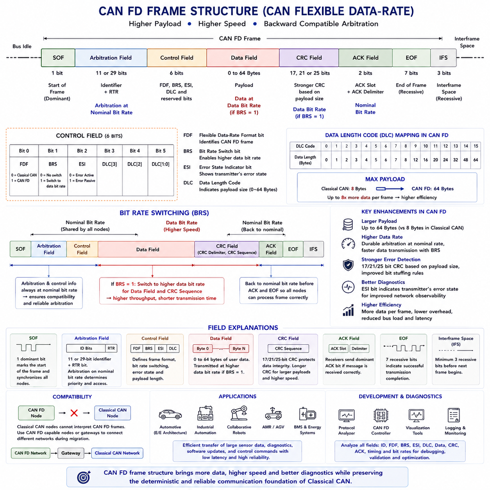
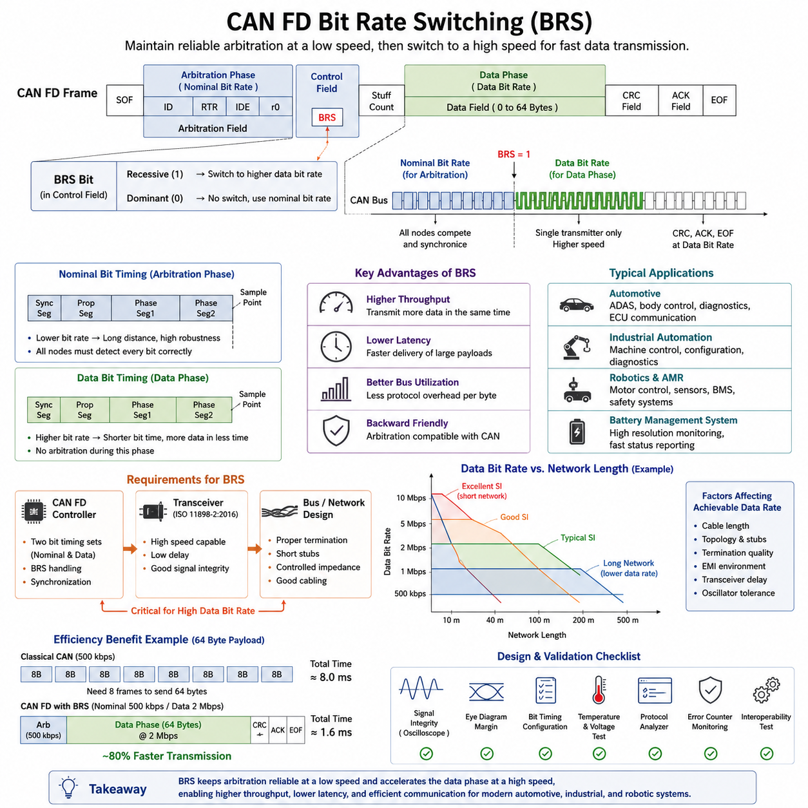
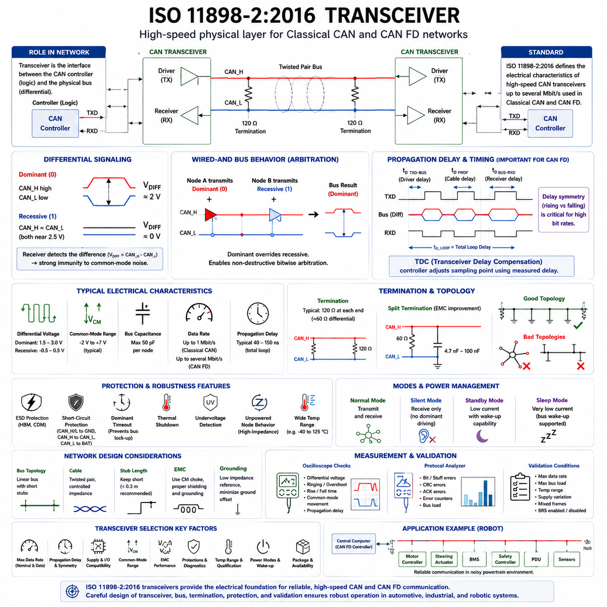
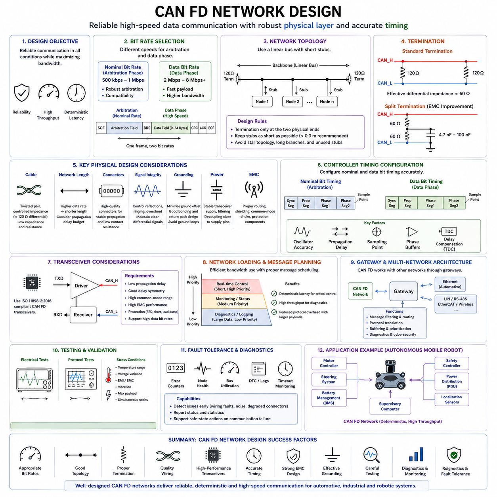
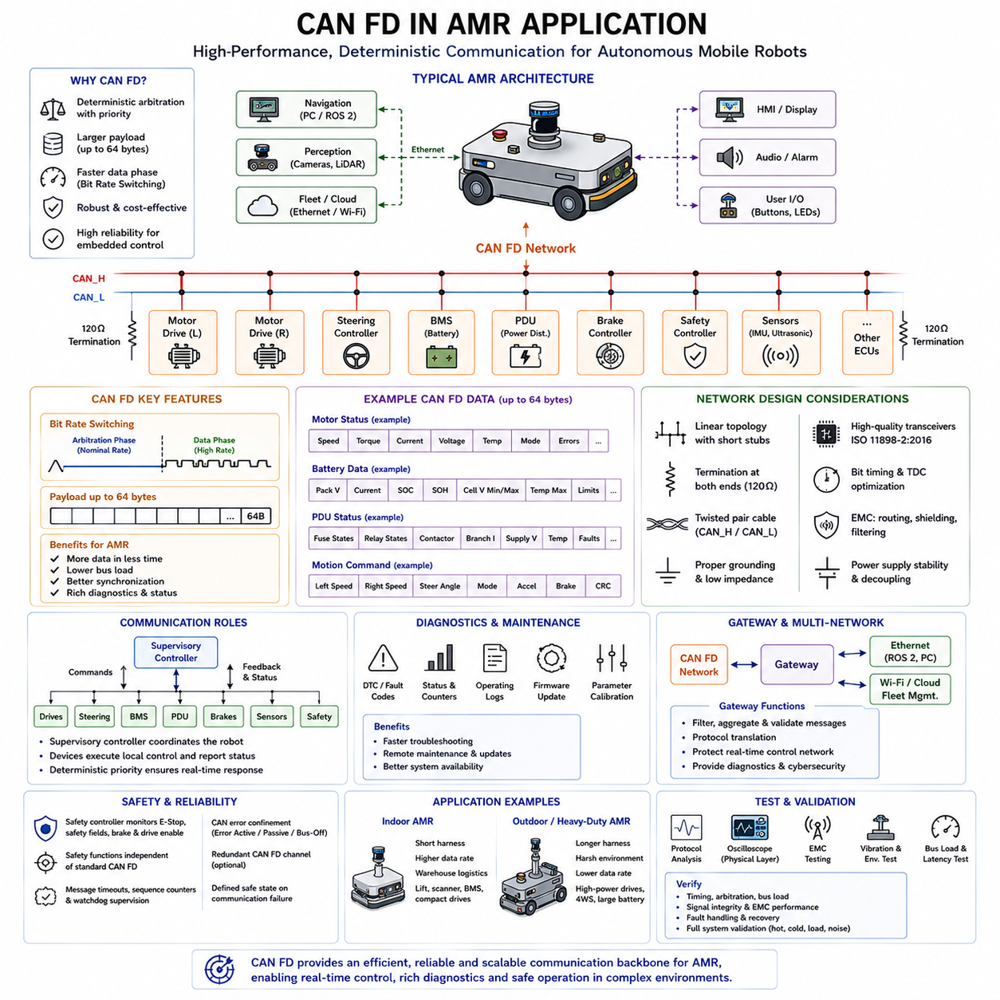

**Volume 06 Automotive Communication**


# Chapter 4. CAN FD Protocol

##  

## 4.1 CAN FD Frame Structure

{width="7.268055555555556in" height="7.268055555555556in"}

The CAN Flexible Data-Rate protocol, commonly known as CAN FD, extends the capabilities of Classical CAN by increasing payload capacity and supporting higher communication speeds during data transmission. While maintaining the proven arbitration mechanism and robust error detection principles of the original CAN protocol, CAN FD significantly improves communication efficiency for modern embedded systems that exchange larger amounts of sensor data, diagnostic information, software updates, and control commands. The frame structure of CAN FD introduces several new fields and modified control bits that distinguish it from Classical CAN while preserving compatibility during arbitration.

A CAN FD frame retains the fundamental organization of a CAN communication frame, beginning with the Start of Frame followed by the Arbitration Field, Control Field, Data Field, Cyclic Redundancy Check field, Acknowledgement Field, End of Frame, and Interframe Space. Although the overall communication sequence remains familiar to engineers experienced with Classical CAN, several fields have been expanded or redefined to support additional functionality. These structural enhancements allow higher throughput without fundamentally changing the deterministic communication model that has made CAN widely adopted in automotive and industrial applications.

The Start of Frame continues to indicate the beginning of every transmitted message by forcing the communication bus into the dominant state. All connected nodes synchronize their internal bit timing using this transition before receiving the remainder of the frame. Maintaining an identical Start of Frame mechanism ensures that CAN FD preserves the synchronization behavior of Classical CAN, allowing communication controllers to detect message boundaries reliably regardless of message length or communication speed.

The Arbitration Field functions almost identically to that of Classical CAN. It contains either the standard 11-bit identifier or the extended 29-bit identifier together with the Remote Transmission Request related information. During arbitration every transmitting node compares its transmitted bits with the observed bus state, immediately withdrawing whenever a dominant bit overrides its recessive bit. Because arbitration always occurs at the nominal communication speed, CAN FD nodes remain compatible with existing arbitration principles while guaranteeing deterministic bus access based on message priority.

One of the most important differences between Classical CAN and CAN FD appears within the Control Field. Additional control bits indicate whether the transmitted frame follows the Classical CAN format or the CAN FD format. These bits also specify whether Bit Rate Switching is enabled and whether the transmitter supports the enhanced error detection mechanisms associated with CAN FD. Consequently, receiving nodes can immediately recognize the communication format before processing the remainder of the message.

The Flexible Data Format bit, commonly abbreviated as FDF, identifies a frame as a CAN FD message. Classical CAN frames transmit this position differently, allowing communication controllers to distinguish between conventional and flexible data-rate communication without ambiguity. The presence of the FDF bit enables gradual migration from Classical CAN toward CAN FD by allowing compatible communication controllers to recognize both message formats appropriately within mixed development environments.

Another significant addition is the Bit Rate Switch bit, abbreviated as BRS. During arbitration and control information transmission, communication proceeds at the nominal bit rate shared by all participating nodes. If the BRS bit is asserted, communication automatically switches to a higher data bit rate when transmitting the Data Field and portions of the CRC sequence. This mechanism significantly reduces overall transmission time while preserving reliable arbitration among all network participants.

The Error State Indicator, or ESI bit, communicates the transmitter\'s current error state to other nodes on the network. Controllers operating in the Error Passive state transmit the ESI bit differently from controllers operating in the Error Active state. This information allows diagnostic systems and network monitoring software to identify communication health without requiring additional diagnostic messages. The ESI field therefore improves network observability while consuming only a single communication bit.

The Data Length Code continues to describe payload size but supports substantially larger values than Classical CAN. Whereas Classical CAN limits payload capacity to eight bytes, CAN FD extends the maximum payload to sixty-four bytes. The Data Length Code therefore maps encoded values to larger payload sizes according to predefined conversion rules. This increased capacity dramatically improves communication efficiency because larger amounts of application data can be transmitted within a single communication frame instead of requiring multiple separate messages.

The expanded Data Field represents one of the primary advantages of CAN FD. Modern vehicles, industrial automation systems, collaborative robots, autonomous mobile robots, battery management systems, sensor fusion modules, and advanced driver assistance systems frequently exchange complex datasets that exceed the eight-byte limitation of Classical CAN. Supporting payloads of up to sixty-four bytes allows entire parameter groups, calibration information, diagnostic records, perception outputs, and software update blocks to be transmitted more efficiently with reduced protocol overhead.

Because CAN FD supports longer payloads and higher communication speeds, the Cyclic Redundancy Check mechanism has also been strengthened. Depending upon payload size, different CRC lengths are applied to improve error detection capability while maintaining extremely low probabilities of undetected communication errors. Enhanced CRC generation reflects the increased amount of transmitted information and the faster communication rates employed during the Data Field.

Bit stuffing continues to operate within CAN FD but has been refined to improve communication reliability and support enhanced error detection. Classical CAN inserts complementary bits after five consecutive identical bits throughout most of the frame. CAN FD modifies portions of this process to accommodate longer payloads and stronger CRC protection while preserving synchronization among all communication nodes. These refinements contribute to improved communication robustness despite significantly higher transmission throughput.

The Acknowledgement Field maintains its original function within CAN FD. After successfully receiving a valid message, one or more receiving nodes transmit a dominant acknowledgement bit, informing the transmitter that communication has been completed correctly. The transmitting node monitors this acknowledgement before concluding the transmission process. Maintaining this mechanism preserves compatibility with existing communication reliability principles while supporting the enhanced frame structure of CAN FD.

The End of Frame continues to consist of consecutive recessive bits that indicate successful completion of message transmission. Following the End of Frame, the Interframe Space provides sufficient idle time before the next message begins. These termination mechanisms remain fundamentally unchanged because they continue to provide reliable message separation, synchronization stability, and deterministic communication scheduling regardless of payload size or communication speed.

The introduction of Bit Rate Switching significantly changes transmission timing. Arbitration, identifier transmission, and critical control information always occur at the nominal bit rate shared by every node on the network. Only after arbitration has completed successfully does communication accelerate to the higher data bit rate if permitted by the BRS bit. Before the frame concludes, communication returns to the nominal rate so that every connected controller can correctly interpret frame completion and prepare for subsequent arbitration.

CAN FD controllers must therefore support two independent communication speeds within a single transmitted frame. The nominal bit rate guarantees compatibility during arbitration and network synchronization, while the faster data bit rate minimizes transmission duration during payload transfer. Engineers configure both timing parameters carefully to satisfy physical network constraints including cable length, transceiver characteristics, propagation delay, electromagnetic compatibility, and oscillator accuracy.

Frame efficiency improves substantially under CAN FD because protocol overhead increases only slightly while payload capacity expands dramatically. When transmitting large datasets, the ratio of application data to protocol overhead becomes significantly higher than in Classical CAN. This improved efficiency reduces average bus load, shortens communication latency, and increases total network throughput without requiring additional communication channels or fundamentally different network architectures.

Compatibility between Classical CAN and CAN FD requires careful network planning. Classical CAN controllers cannot correctly interpret CAN FD frames because they do not recognize the modified control bits and higher data rates. Consequently, mixed communication systems typically employ CAN FD capable controllers throughout the network or separate communication domains connected through gateways. During system migration, engineers carefully evaluate compatibility requirements before introducing CAN FD functionality.

Development tools provide extensive visualization of CAN FD frame structures during debugging and validation. Protocol analyzers display every frame field including identifiers, FDF, BRS, ESI, Data Length Code, payload contents, CRC information, acknowledgement status, and timing characteristics. Such detailed visualization assists engineers in verifying protocol implementation, diagnosing communication faults, optimizing bandwidth utilization, and validating interoperability among electronic control units produced by different manufacturers.

In autonomous robotic systems, CAN FD frame structures enable efficient communication among distributed controllers responsible for motion control, battery management, perception processing, localization, functional safety, actuator coordination, environmental sensing, and fleet management. Larger payloads reduce message fragmentation while higher communication speeds decrease latency for complex sensor information and coordinated control commands. These characteristics make CAN FD particularly valuable for intelligent robotic platforms requiring deterministic real-time communication together with increasing computational complexity.

The CAN FD frame structure represents a carefully engineered evolution rather than a complete replacement of Classical CAN. By preserving deterministic arbitration, synchronization mechanisms, acknowledgement procedures, and fault detection principles while introducing larger payloads, enhanced control fields, stronger error detection, and flexible data-rate transmission, CAN FD provides a scalable communication framework capable of supporting the growing data requirements of modern vehicles, industrial automation equipment, and autonomous robotic systems without sacrificing the reliability that has defined CAN technology for decades.

CAN FD(CAN Flexible Data-Rate) 프로토콜은 클래식 CAN(Classical CAN)의 기능을 확장하여 더 큰 페이로드(Payload) 용량과 데이터 전송 구간에서 더 높은 통신 속도(Communication Speed)를 지원한다. CAN FD는 기존 CAN 프로토콜의 검증된 중재(Arbitration) 메커니즘과 강력한 오류 검출(Error Detection) 원리를 그대로 유지하면서도, 대용량 센서 데이터(Sensor Data), 진단 정보(Diagnostic Information), 소프트웨어 업데이트(Software Updates), 제어 명령(Control Commands)을 교환하는 현대의 임베디드 시스템(Embedded Systems)을 위해 통신 효율을 크게 향상시킨다. CAN FD의 프레임 구조(Frame Structure)는 클래식 CAN과 구별되는 새로운 필드(Field)와 수정된 제어 비트(Control Bits)를 추가하면서도, 중재 과정에서는 기존 방식과의 호환성을 유지하도록 설계되었다.

CAN FD 프레임은 프레임 시작(Start of Frame), 중재 필드(Arbitration Field), 제어 필드(Control Field), 데이터 필드(Data Field), 순환 중복 검사 필드(Cyclic Redundancy Check Field), 확인 필드(Acknowledgement Field), 프레임 종료(End of Frame), 프레임 간 간격(Interframe Space)으로 구성되는 기본적인 CAN 프레임 구조를 그대로 유지한다. 전체적인 통신 순서는 클래식 CAN과 매우 유사하지만, 여러 필드가 새로운 기능을 지원하기 위해 확장되거나 재정의되었다. 이러한 구조적 개선은 CAN이 자동차와 산업 자동화 분야에서 널리 채택된 핵심 이유인 결정적인 통신 모델(Deterministic Communication Model)을 유지하면서도 훨씬 높은 데이터 처리량(Throughput)을 제공한다.

프레임 시작(Start of Frame)은 모든 메시지의 시작을 알리기 위해 통신 버스를 지배 상태(Dominant State)로 전환하는 역할을 계속 수행한다. 모든 연결된 노드는 이 전이를 이용하여 내부 비트 타이밍(Bit Timing)을 동기화한 후 나머지 프레임을 수신한다. 프레임 시작 메커니즘을 클래식 CAN과 동일하게 유지함으로써 CAN FD 역시 메시지 길이나 통신 속도와 관계없이 안정적으로 메시지 경계를 검출하고 동기화를 유지할 수 있다.

중재 필드(Arbitration Field)는 클래식 CAN과 거의 동일한 방식으로 동작한다. 이 필드는 표준 11비트 식별자(Standard 11-Bit Identifier) 또는 확장 29비트 식별자(Extended 29-Bit Identifier)와 원격 전송 요청(Remote Transmission Request) 관련 정보를 포함한다. 중재 과정에서는 각각의 송신 노드가 자신이 전송한 비트와 실제 버스 상태를 비교하며, 자신의 열성 비트(Recessive Bit)가 다른 노드의 지배 비트(Dominant Bit)에 의해 덮어쓰여지는 즉시 전송을 중단한다. 중재는 항상 명목 통신 속도(Nominal Bit Rate)에서 수행되므로 CAN FD는 기존 CAN의 우선순위 기반 중재 원리를 그대로 유지하면서 결정적인 버스 접근(Deterministic Bus Access)을 보장한다.

클래식 CAN과 CAN FD의 가장 큰 차이 가운데 하나는 제어 필드(Control Field)에 있다. CAN FD는 추가적인 제어 비트를 이용하여 현재 프레임이 클래식 CAN 형식인지 CAN FD 형식인지를 표시한다. 또한 비트 속도 전환(Bit Rate Switching)이 활성화되었는지와 향상된 오류 검출 기능을 사용하는지를 함께 나타낸다. 따라서 수신 노드는 프레임의 나머지 내용을 처리하기 전에 어떤 통신 형식이 사용되는지를 즉시 판단할 수 있다.

유연 데이터 형식 비트(Flexible Data Format Bit), 일반적으로 FDF 비트(FDF Bit)는 현재 프레임이 CAN FD 메시지임을 나타낸다. 클래식 CAN은 동일한 위치에서 다른 의미의 비트를 사용하므로 통신 제어기(Communication Controllers)는 기존 CAN과 CAN FD 프레임을 명확하게 구분할 수 있다. FDF 비트의 도입은 기존 시스템에서 CAN FD로 점진적으로 전환(Migration)할 수 있도록 지원하며, 혼합 개발 환경(Mixed Development Environments)에서도 두 가지 프레임 형식을 올바르게 인식할 수 있도록 한다.

또 하나의 중요한 추가 기능은 비트 속도 전환(Bit Rate Switch), 즉 BRS 비트(BRS Bit)이다. 중재와 제어 정보는 모든 노드가 공유하는 명목 비트 속도(Nominal Bit Rate)에서 전송된다. 그러나 BRS 비트가 활성화되면 데이터 필드(Data Field)와 CRC 일부를 전송하는 동안 통신 속도가 더 높은 데이터 비트 속도(Data Bit Rate)로 자동 전환된다. 이러한 방식은 모든 노드가 안정적으로 중재를 수행하면서도 전체 전송 시간을 크게 단축시킬 수 있도록 해준다.

오류 상태 표시기(Error State Indicator), 즉 ESI 비트(ESI Bit)는 현재 송신 노드의 오류 상태(Error State)를 다른 노드에 전달하는 역할을 한다. 오류 수동(Error Passive) 상태에 있는 제어기는 오류 활성(Error Active) 상태의 제어기와 다른 방식으로 ESI 비트를 전송한다. 이를 통해 네트워크 모니터링(Network Monitoring) 소프트웨어나 진단 시스템은 별도의 진단 메시지 없이도 각 노드의 통신 상태를 파악할 수 있다. 따라서 ESI 필드는 단 하나의 비트만으로도 네트워크의 가시성(Network Observability)을 크게 향상시킨다.

데이터 길이 코드(Data Length Code, DLC)는 여전히 페이로드 크기를 나타내지만 클래식 CAN보다 훨씬 큰 데이터를 지원한다. 클래식 CAN이 최대 8바이트(Byte)까지 지원하는 반면, CAN FD는 최대 64바이트까지 데이터를 전송할 수 있다. 따라서 DLC는 정의된 변환 규칙에 따라 훨씬 큰 페이로드 크기를 표현한다. 이러한 확장 덕분에 대량의 애플리케이션 데이터를 여러 개의 메시지로 나누지 않고 하나의 프레임으로 전송할 수 있어 통신 효율이 크게 향상된다.

확장된 데이터 필드(Data Field)는 CAN FD의 가장 큰 장점 가운데 하나이다. 현대 자동차, 산업 자동화 시스템, 협동 로봇(Collaborative Robots), 자율주행 모바일 로봇(Autonomous Mobile Robots), 배터리 관리 시스템(Battery Management Systems), 센서 융합 모듈(Sensor Fusion Modules), 첨단 운전자 지원 시스템(Advanced Driver Assistance Systems)은 기존 8바이트 제한을 초과하는 대용량 데이터를 자주 교환한다. 최대 64바이트까지 지원하는 데이터 필드는 파라미터 그룹(Parameter Groups), 보정 정보(Calibration Information), 진단 기록(Diagnostic Records), 인지 결과(Perception Outputs), 소프트웨어 업데이트 블록(Software Update Blocks)을 훨씬 효율적으로 전송할 수 있도록 해준다.

CAN FD는 더 긴 페이로드와 더 높은 통신 속도를 지원하므로 순환 중복 검사(Cyclic Redundancy Check, CRC) 메커니즘도 함께 강화되었다. 페이로드 크기에 따라 서로 다른 CRC 길이를 적용하여 더 많은 데이터를 전송하면서도 매우 낮은 미검출 오류 확률(Undetected Communication Error Probability)을 유지한다. 향상된 CRC 생성 방식은 증가한 데이터 양과 더 높은 데이터 전송 속도를 반영한 결과이다.

비트 스터핑(Bit Stuffing)은 CAN FD에서도 계속 사용되지만, 더 높은 신뢰성과 향상된 오류 검출을 지원하도록 일부 방식이 개선되었다. 클래식 CAN은 동일한 비트가 다섯 번 연속될 경우 대부분의 프레임 구간에서 보완 비트(Complementary Bit)를 삽입한다. CAN FD는 더 긴 페이로드와 강화된 CRC 보호를 지원하기 위해 일부 스터핑 규칙을 수정하면서도 모든 노드의 동기화를 유지하도록 설계되었다. 이러한 개선은 훨씬 높은 데이터 처리량에서도 안정적인 통신을 가능하게 한다.

확인 필드(Acknowledgement Field)는 CAN FD에서도 기존과 동일한 역할을 수행한다. 하나 이상의 수신 노드가 정상적으로 메시지를 수신하면 지배 비트(Dominant Acknowledgement Bit)를 전송하여 송신 노드에게 성공적인 수신을 알린다. 송신 노드는 전송을 완료하기 전에 이 확인 비트를 검사한다. 이러한 메커니즘을 그대로 유지함으로써 CAN FD 역시 기존 CAN의 높은 통신 신뢰성을 유지하면서 향상된 프레임 구조를 지원한다.

프레임 종료(End of Frame)는 연속된 열성 비트(Recessive Bits)로 구성되어 메시지 전송이 정상적으로 완료되었음을 나타낸다. 이어지는 프레임 간 간격(Interframe Space)은 다음 메시지가 시작되기 전에 충분한 유휴 시간(Idle Time)을 제공한다. 이러한 종료 메커니즘은 페이로드 크기나 통신 속도와 관계없이 안정적인 메시지 구분, 동기화 유지, 결정적인 통신 스케줄링을 제공하므로 CAN FD에서도 거의 변경 없이 유지된다.

비트 속도 전환(Bit Rate Switching)의 도입은 프레임 전송 타이밍을 크게 변화시켰다. 중재 과정, 식별자 전송, 주요 제어 정보는 항상 모든 노드가 공유하는 명목 비트 속도에서 수행된다. 중재가 성공적으로 완료된 이후에만 BRS 비트가 허용하는 경우 데이터 비트 속도로 전환된다. 프레임이 종료되기 전에 다시 명목 속도로 복귀하여 모든 노드가 프레임 종료를 정확하게 인식하고 다음 중재를 준비할 수 있도록 한다.

따라서 CAN FD 제어기는 하나의 프레임 안에서 서로 다른 두 개의 통신 속도를 모두 지원해야 한다. 명목 비트 속도는 중재와 네트워크 동기화를 보장하고, 더 높은 데이터 비트 속도는 실제 데이터 전송 시간을 최소화한다. 엔지니어는 케이블 길이(Cable Length), 트랜시버 특성(Transceiver Characteristics), 전파 지연(Propagation Delay), 전자파 적합성(Electromagnetic Compatibility, EMC), 발진기 정확도(Oscillator Accuracy) 등을 종합적으로 고려하여 두 가지 속도를 모두 설정해야 한다.

CAN FD에서는 프로토콜 오버헤드(Protocol Overhead)는 소폭만 증가하는 반면 페이로드 용량은 크게 증가하므로 프레임 효율(Frame Efficiency)이 크게 향상된다. 대용량 데이터를 전송할 경우 실제 애플리케이션 데이터(Application Data)가 차지하는 비율이 클래식 CAN보다 훨씬 높아진다. 결과적으로 평균 버스 부하(Average Bus Load)가 감소하고 통신 지연시간(Latency)이 줄어들며 전체 네트워크 처리량(Network Throughput)이 크게 증가한다. 이러한 성능 향상은 새로운 통신 채널을 추가하거나 기존 네트워크 구조를 크게 변경하지 않고도 달성할 수 있다.

클래식 CAN과 CAN FD의 호환성(Compatibility)을 확보하기 위해서는 신중한 네트워크 설계(Network Planning)가 필요하다. 기존 CAN 제어기는 수정된 제어 비트와 높은 데이터 속도를 이해하지 못하기 때문에 CAN FD 프레임을 올바르게 처리할 수 없다. 따라서 혼합 시스템(Mixed Communication Systems)에서는 모든 노드를 CAN FD 지원 제어기로 구성하거나 게이트웨이(Gateways)를 이용하여 서로 다른 통신 영역을 분리하는 방식이 일반적으로 사용된다. 시스템 전환(Migration) 과정에서는 이러한 호환성 요구사항을 충분히 검토해야 한다.

개발 도구(Development Tools)는 디버깅(Debugging)과 검증(Validation) 과정에서 CAN FD 프레임 구조를 매우 상세하게 시각화한다. 프로토콜 분석기(Protocol Analyzers)는 식별자(Identifiers), FDF, BRS, ESI, 데이터 길이 코드(Data Length Code), 페이로드 내용(Payload Contents), CRC 정보, 확인 상태(Acknowledgement Status), 타이밍 특성(Timing Characteristics)을 모두 표시한다. 이러한 정보는 엔지니어가 프로토콜 구현을 검증하고, 통신 오류를 분석하며, 대역폭 활용도를 최적화하고, 서로 다른 제조사의 전자제어장치 간 상호운용성(Interoperability)을 확인하는 데 매우 중요한 역할을 한다.

자율주행 로봇 시스템에서는 CAN FD 프레임 구조가 모션 제어(Motion Control), 배터리 관리(Battery Management), 인지 처리(Perception Processing), 위치추정(Localization), 기능 안전(Functional Safety), 액추에이터 협조 제어(Actuator Coordination), 환경 센싱(Environmental Sensing), 플릿 관리(Fleet Management)와 같은 분산 제어기를 효율적으로 연결한다. 더 큰 페이로드는 메시지 분할(Message Fragmentation)을 줄여주고, 높은 데이터 전송 속도는 복잡한 센서 데이터와 협조 제어 명령(Coordinated Control Commands)의 지연시간을 크게 감소시킨다. 이러한 특징은 결정적인 실시간 통신과 증가하는 계산 요구사항을 동시에 만족해야 하는 지능형 로봇 플랫폼(Intelligent Robotic Platforms)에 특히 적합하다.

CAN FD 프레임 구조는 클래식 CAN을 완전히 대체하는 새로운 프로토콜이라기보다 기존 기술을 신중하게 발전시킨 결과라고 볼 수 있다. 결정적인 중재(Deterministic Arbitration), 동기화 메커니즘(Synchronization Mechanisms), 확인 절차(Acknowledgement Procedures), 오류 검출 원리(Fault Detection Principles)는 그대로 유지하면서, 더 큰 페이로드, 향상된 제어 필드, 강화된 오류 검출, 유연한 데이터 속도 전송(Flexible Data-Rate Transmission)을 추가하였다. 이를 통해 CAN FD는 수십 년 동안 CAN 기술이 유지해 온 높은 신뢰성을 그대로 유지하면서도 현대 자동차, 산업 자동화 장비, 자율주행 로봇 시스템이 요구하는 급격히 증가하는 데이터 처리 요구사항을 효과적으로 지원하는 확장 가능한 통신 프레임워크(Scalable Communication Framework)를 제공한다.

##  

## 4.2 Bit Rate Switching BRS

{width="7.268055555555556in" height="7.268055555555556in"}

Bit Rate Switching (BRS) is one of the defining capabilities that distinguishes CAN FD from Classical CAN. In a traditional CAN network, every portion of the communication frame is transmitted at a single fixed bit rate determined during network configuration. While this approach guarantees interoperability and predictable timing, it also limits the maximum amount of useful application data that can be transferred within a given time. CAN FD introduces Bit Rate Switching to overcome this limitation by allowing different sections of the same frame to be transmitted at different speeds while preserving compatibility with the arbitration process defined by the CAN protocol. The feature significantly improves network efficiency without fundamentally changing the distributed arbitration mechanism that has made CAN successful for decades.

The operation of BRS begins during the arbitration phase of a CAN FD frame. All nodes on the network participate in arbitration using the nominal bit rate, which is identical to the speed configured for conventional CAN communication. Since every node must observe identical timing during arbitration, the deterministic priority resolution mechanism remains unchanged. Once arbitration has been completed successfully and only one transmitting node remains active, the Bit Rate Switch bit within the frame informs all receiving nodes that the subsequent data phase will be transmitted at a higher communication speed. Every node that supports CAN FD synchronously changes its timing parameters before the beginning of the data field.

Separating arbitration and data transmission into two different bit rates provides a practical balance between robustness and throughput. Arbitration requires long communication distances, stable synchronization, and reliable propagation across all nodes in the network. These requirements favor relatively conservative communication speeds. The payload section, however, is transmitted only after bus ownership has already been determined. Since no competing transmitters exist during this period, significantly higher bit rates can be used without affecting arbitration reliability. This design enables CAN FD to maintain compatibility with proven network architectures while dramatically reducing message transmission time for large payloads.

The Bit Rate Switch mechanism is indicated by the BRS control bit located within the CAN FD frame format. When the bit is recessive, participating controllers recognize that the data phase will operate at the configured higher bit rate. If the bit remains dominant, the entire frame continues to use the nominal communication speed. This flexibility allows individual messages to selectively benefit from high-speed transmission while permitting slower operation for applications requiring maximum robustness or compatibility. Consequently, network designers can optimize communication characteristics according to the requirements of each message rather than forcing a single operating mode for the entire system.

Implementing BRS requires two independent sets of bit timing parameters within every CAN FD controller. The nominal bit timing governs arbitration and acknowledgement fields, while the data bit timing controls the payload transmission interval. Both configurations define synchronization segments, propagation segments, phase buffers, and sampling points appropriate for their respective communication speeds. The controller automatically switches between these timing configurations based on the frame state without requiring software intervention during transmission. This hardware-based transition ensures precise synchronization even at significantly higher data rates.

Because communication speed changes dynamically during transmission, synchronization accuracy becomes more demanding than in Classical CAN. The oscillator tolerance of every participating node, the propagation delay of the communication medium, and the performance of the physical transceiver all influence successful high-speed operation. As data bit rates increase, the available timing margin decreases substantially, making clock accuracy and network design increasingly important. CAN FD controllers therefore employ enhanced synchronization mechanisms that continuously compensate for small timing deviations throughout frame reception.

Transceiver Delay Compensation plays an essential role in reliable Bit Rate Switching operation. At higher communication speeds, the propagation delay introduced by CAN transceivers becomes a significant percentage of the individual bit time. Without compensation, the receiver may sample incoming bits too early or too late, resulting in communication errors. Modern CAN FD controllers estimate the transceiver delay and automatically adjust the sampling point during the high-speed data phase. This mechanism extends reliable operation at several megabits per second while maintaining interoperability between different hardware implementations.

The achievable data bit rate depends upon numerous physical characteristics of the communication network. Cable length, wiring topology, connector quality, stub length, electromagnetic interference, and transceiver characteristics all influence signal integrity. Although CAN FD standards allow considerably higher communication speeds than Classical CAN, practical implementations must evaluate these physical limitations carefully. Many automotive and industrial systems successfully operate with nominal rates of 500 kbps or 1 Mbps while increasing the data phase to 2 Mbps, 5 Mbps, or even 8 Mbps depending on network topology and component quality.

Network length has a particularly strong influence on Bit Rate Switching performance. During arbitration, relatively low communication speeds allow signals to propagate across long cables without violating synchronization requirements. During the high-speed data phase, however, shorter bit times reduce the acceptable propagation delay considerably. As a result, higher data rates generally require shorter network lengths, carefully controlled cable impedance, minimized branch connections, and improved termination quality. System architects must therefore balance communication speed against physical installation constraints when designing CAN FD networks.

The improvement in transmission efficiency becomes especially significant for large payloads. Classical CAN limits the payload to eight bytes, causing protocol overhead to occupy a substantial percentage of total transmission time. CAN FD expands the payload capacity to as many as sixty-four bytes while simultaneously accelerating the data phase through Bit Rate Switching. The combined effect dramatically reduces protocol overhead per byte of useful information, allowing considerably more application data to be exchanged without increasing network utilization proportionally. This higher efficiency is one of the primary motivations for adopting CAN FD in modern embedded systems.

Latency improvements achieved through BRS benefit real-time control applications that exchange large amounts of sensor or actuator information. Instead of transmitting multiple small Classical CAN frames, an application can consolidate related information into a single CAN FD message while completing transmission in less time than would otherwise be required. Reduced bus occupancy lowers communication delays for other nodes as well, improving overall network responsiveness under heavy load conditions. These characteristics are particularly valuable in distributed robotic control systems where deterministic communication remains essential.

Automotive electronic architectures increasingly depend on Bit Rate Switching to support advanced driver assistance systems, centralized computing platforms, high-resolution sensor interfaces, and software-defined vehicle functions. Electronic control units exchange larger diagnostic datasets, firmware update packets, calibration parameters, and sensor measurements than were envisioned when Classical CAN was introduced. CAN FD with BRS satisfies many of these increasing bandwidth requirements while allowing manufacturers to preserve existing CAN infrastructure, wiring practices, engineering knowledge, and network management strategies.

Industrial automation systems also benefit substantially from BRS because machine controllers frequently transfer configuration parameters, process measurements, diagnostics, and maintenance information alongside deterministic control commands. High-speed data transmission shortens maintenance operations, accelerates production parameter downloads, and improves diagnostic responsiveness without requiring an entirely new communication technology. Equipment manufacturers can therefore enhance system capability while maintaining compatibility with mature CAN-based industrial ecosystems that have demonstrated reliability over many years.

Autonomous Mobile Robots and service robots represent another important application area for Bit Rate Switching. Multiple motor controllers, battery management systems, safety controllers, localization modules, perception sensors, and supervisory computers continuously exchange operational information. Although Ethernet often carries high-bandwidth perception data, CAN FD remains highly attractive for deterministic control communication among distributed embedded devices. BRS allows richer diagnostic information, higher-resolution actuator feedback, expanded battery monitoring data, and more comprehensive health reporting to be transmitted efficiently without increasing bus congestion.

Battery management systems illustrate the practical advantages of Bit Rate Switching particularly well. Modern battery packs contain numerous monitoring channels measuring voltage, current, temperature, balancing status, fault conditions, and state estimation variables. CAN FD enables these larger datasets to be transferred within a single communication frame, while BRS minimizes transmission time during the data phase. Faster reporting improves system monitoring responsiveness without sacrificing the deterministic arbitration behavior required for safety-critical battery protection functions.

Software diagnostics and firmware updates similarly benefit from BRS. Service tools often transfer calibration tables, diagnostic logs, software metadata, and configuration parameters significantly larger than eight bytes. CAN FD reduces the number of required communication frames while high-speed payload transmission shortens maintenance sessions. Although Ethernet-based diagnostics may eventually dominate high-end systems, CAN FD remains an attractive solution where cost, simplicity, or existing infrastructure favor continued CAN-based communication.

Designing a reliable BRS network requires careful validation under realistic operating conditions. Engineers typically evaluate signal quality using oscilloscopes, CAN protocol analyzers, eye diagrams, and error counters while testing across temperature extremes, supply voltage variations, electromagnetic interference environments, and maximum network loading. Particular attention is paid to synchronization stability during transitions between nominal and data bit rates. Validation also confirms compatibility among controllers and transceivers supplied by different semiconductor vendors.

Network simulation and timing analysis further assist engineers in optimizing Bit Rate Switching configurations before physical implementation. Bus utilization calculations, propagation delay estimation, oscillator tolerance analysis, and worst-case latency simulations help determine appropriate nominal and data bit rates. These engineering activities ensure that communication remains reliable under all anticipated operating scenarios while maximizing available bandwidth. Proper configuration often delivers substantial performance improvements without requiring changes to higher-level application software.

Despite its advantages, Bit Rate Switching introduces additional engineering complexity compared with Classical CAN. Controllers, transceivers, network topology, cable quality, and timing configuration must all satisfy tighter performance requirements. Legacy CAN nodes that do not support CAN FD cannot correctly interpret CAN FD frames, requiring careful migration planning or gateway-based integration. Engineers must therefore evaluate compatibility, certification requirements, and lifecycle considerations before introducing BRS into mixed communication environments.

As embedded systems continue evolving toward centralized computing, software-defined functionality, and increasingly intelligent robotic platforms, Bit Rate Switching remains a practical technology that extends the useful life of CAN communication while providing significantly greater bandwidth. Its ability to combine reliable low-speed arbitration with efficient high-speed payload transmission offers an elegant engineering solution that balances compatibility, determinism, scalability, and performance. For modern automotive electronics, industrial automation equipment, and autonomous robotic platforms, BRS has become one of the most valuable enhancements introduced by the CAN FD protocol, enabling efficient communication without abandoning the mature and dependable operational principles established by Classical CAN.

비트 전환(Bit Rate Switching, BRS)은 CAN FD를 기존의 Classical CAN과 구별하는 가장 핵심적인 기능 중 하나이다. 기존 CAN 네트워크에서는 통신 프레임 전체가 네트워크 설정 시 결정된 하나의 고정된 비트 속도(Bit Rate)로 전송된다. 이러한 방식은 상호운용성과 예측 가능한 타이밍을 보장하지만, 일정 시간 동안 전송할 수 있는 실제 애플리케이션 데이터의 양에는 한계가 있다. CAN FD는 이러한 제한을 극복하기 위해 비트 전환(Bit Rate Switching, BRS)을 도입하였으며, 하나의 프레임 안에서도 서로 다른 구간을 서로 다른 속도로 전송할 수 있도록 설계되었다. 이 기능은 CAN 프로토콜의 분산 중재(Arbitration) 메커니즘을 그대로 유지하면서도 네트워크 효율을 크게 향상시킨다.

BRS의 동작은 CAN FD 프레임의 중재 단계(Arbitration Phase)에서 시작된다. 네트워크에 연결된 모든 노드는 기존 CAN과 동일한 명목 비트 속도(Nominal Bit Rate)를 사용하여 중재에 참여한다. 모든 노드가 동일한 타이밍을 유지해야만 우선순위 기반의 결정적 중재 메커니즘이 정상적으로 동작할 수 있기 때문이다. 중재가 완료되어 하나의 송신 노드만 버스 사용권을 획득하면, 프레임 내부의 비트 전환(Bit Rate Switch, BRS) 비트가 이후 데이터 구간(Data Phase)이 더 높은 비트 속도로 전송될 것임을 모든 수신 노드에게 알린다. CAN FD를 지원하는 모든 노드는 데이터 필드가 시작되기 직전에 동시에 새로운 타이밍 설정으로 전환한다.

중재와 데이터 전송을 서로 다른 비트 속도로 분리하는 것은 신뢰성과 전송 성능 사이의 균형을 제공한다. 중재 과정은 긴 배선 거리, 안정적인 동기화, 그리고 네트워크 전체에 대한 신호 전파를 고려해야 하므로 상대적으로 낮고 안정적인 통신 속도가 적합하다. 반면 데이터 전송 구간은 이미 하나의 송신기만 버스를 사용하고 있기 때문에 경쟁 송신기가 존재하지 않는다. 따라서 중재의 신뢰성을 저하시키지 않으면서도 훨씬 높은 비트 속도를 사용할 수 있다. 이러한 구조 덕분에 CAN FD는 기존 네트워크 구조와의 호환성을 유지하면서도 대용량 데이터를 훨씬 빠르게 전송할 수 있다.

비트 전환(Bit Rate Switching) 기능은 CAN FD 프레임의 제어(Control) 영역에 위치한 BRS 비트를 통해 표시된다. BRS 비트가 열성(Recessive) 상태이면 참여하는 모든 컨트롤러는 이후 데이터 구간을 미리 설정된 고속 비트 속도로 전송해야 함을 인식한다. 반대로 BRS 비트가 우성(Dominant) 상태이면 프레임 전체가 명목 비트 속도로 유지된다. 이러한 유연성 덕분에 일부 메시지만 고속 전송의 이점을 활용하고, 높은 신뢰성이 필요한 메시지는 기존 속도로 유지할 수 있다. 결과적으로 네트워크 설계자는 전체 네트워크가 아닌 개별 메시지 단위로 최적의 통신 특성을 선택할 수 있다.

BRS를 구현하기 위해서는 모든 CAN FD 컨트롤러 내부에 두 개의 독립적인 비트 타이밍(Bit Timing) 설정이 존재해야 한다. 하나는 중재 및 응답(Acknowledge) 구간에서 사용하는 명목 비트 타이밍이며, 다른 하나는 데이터 구간에서 사용하는 데이터 비트 타이밍이다. 각각의 설정은 동기화 구간(Synchronization Segment), 전파 구간(Propagation Segment), 위상 버퍼(Phase Buffer), 샘플링 지점(Sampling Point) 등을 서로 다른 통신 속도에 맞게 정의한다. 컨트롤러는 프레임의 진행 상태에 따라 소프트웨어 개입 없이 하드웨어적으로 두 설정을 자동 전환하므로 고속 통신에서도 정확한 동기화를 유지할 수 있다.

통신 속도가 프레임 도중에 변경되기 때문에 동기화 정확도는 Classical CAN보다 훨씬 중요해진다. 모든 노드의 발진기(Oscillator) 오차, 통신 케이블의 전파 지연(Propagation Delay), 물리 계층(Physical Layer) 트랜시버(Transceiver)의 성능은 모두 고속 통신의 성공 여부에 영향을 미친다. 데이터 비트 속도가 높아질수록 허용 가능한 타이밍 여유는 급격히 감소하므로 클록 정확성과 네트워크 설계 품질이 더욱 중요해진다. 따라서 CAN FD 컨트롤러는 프레임 수신 동안 지속적으로 작은 타이밍 오차를 보정하는 향상된 동기화 기능을 제공한다.

트랜시버 지연 보상(Transceiver Delay Compensation, TDC)은 BRS의 안정적인 동작을 위해 매우 중요한 기능이다. 높은 비트 속도에서는 트랜시버 내부에서 발생하는 신호 지연이 하나의 비트 시간(Bit Time)에서 차지하는 비율이 매우 커진다. 이러한 지연을 보상하지 않으면 수신기가 너무 이르거나 늦게 데이터를 샘플링하여 통신 오류가 발생할 수 있다. 최신 CAN FD 컨트롤러는 트랜시버 지연을 추정하고 데이터 구간에서 샘플링 위치를 자동으로 조정한다. 이러한 기능 덕분에 수 Mbps 수준의 고속 통신에서도 다양한 하드웨어 간의 안정적인 상호운용성이 가능해진다.

실제로 구현 가능한 데이터 비트 속도는 네트워크의 다양한 물리적 특성에 의해 결정된다. 케이블 길이, 배선 구조, 커넥터 품질, 스텁(Stub) 길이, 전자파 간섭(Electromagnetic Interference, EMI), 트랜시버 성능 등이 모두 신호 무결성(Signal Integrity)에 영향을 미친다. CAN FD 표준은 Classical CAN보다 훨씬 높은 통신 속도를 지원하지만 실제 시스템에서는 이러한 물리적 제약을 충분히 고려해야 한다. 많은 자동차 및 산업용 시스템은 명목 속도를 500 kbps 또는 1 Mbps로 유지하면서 데이터 구간만 2 Mbps, 5 Mbps, 또는 경우에 따라 8 Mbps 수준까지 향상시켜 운용하고 있다.

네트워크 길이는 BRS 성능에 가장 큰 영향을 주는 요소 중 하나이다. 중재 구간에서는 비교적 낮은 통신 속도를 사용하므로 긴 케이블에서도 안정적인 신호 전파가 가능하다. 그러나 데이터 구간에서는 비트 시간이 매우 짧아지기 때문에 허용 가능한 전파 지연 역시 크게 감소한다. 따라서 높은 데이터 속도를 구현하려면 네트워크 길이를 짧게 유지하고, 일정한 임피던스(Impedance)를 가진 케이블을 사용하며, 스텁 길이를 최소화하고, 종단 저항(Termination)의 품질을 향상시켜야 한다. 시스템 설계자는 통신 속도와 실제 설치 환경 사이의 적절한 균형을 찾아야 한다.

BRS는 특히 대용량 데이터를 전송할 때 매우 큰 효율 향상을 제공한다. Classical CAN은 최대 8바이트(Byte)의 데이터만 전송할 수 있기 때문에 프로토콜 오버헤드가 전체 전송 시간에서 큰 비중을 차지한다. CAN FD는 최대 64바이트까지 데이터를 전송할 수 있으며, 동시에 데이터 구간을 고속으로 전송한다. 이 두 가지 효과가 결합되면서 실제 유효 데이터당 프로토콜 오버헤드가 크게 감소하고, 동일한 네트워크 부하에서 훨씬 많은 애플리케이션 데이터를 처리할 수 있다. 이러한 높은 효율성은 CAN FD가 빠르게 확산되는 가장 중요한 이유 가운데 하나이다.

BRS를 통해 얻어지는 낮은 지연 시간(Latency)은 대용량 센서 및 액추에이터 데이터를 주고받는 실시간 제어 시스템에서 매우 중요한 장점이 된다. 여러 개의 Classical CAN 프레임으로 나누어 전송해야 했던 정보를 하나의 CAN FD 프레임으로 통합할 수 있으며, 전체 전송 시간도 오히려 더 짧아질 수 있다. 결과적으로 버스 점유율(Bus Occupancy)이 감소하고 다른 노드들의 통신 지연 역시 줄어들어 전체 네트워크 응답성이 향상된다. 이러한 특성은 분산 제어 기반의 로봇 시스템에서 특히 큰 가치를 가진다.

자동차 전자 아키텍처(Electronic Architecture)는 첨단 운전자 보조 시스템(Advanced Driver Assistance Systems, ADAS), 중앙 집중형 컴퓨팅(Centralized Computing), 고해상도 센서, 소프트웨어 정의 차량(Software Defined Vehicle, SDV) 기술의 발전과 함께 점점 더 많은 데이터를 처리해야 한다. 전자제어장치(Electronic Control Unit, ECU)는 진단 데이터, 소프트웨어 업데이트, 캘리브레이션 정보, 센서 데이터를 이전보다 훨씬 많이 교환한다. CAN FD와 BRS는 기존 CAN 인프라와 배선, 엔지니어링 경험을 그대로 유지하면서 이러한 증가하는 대역폭 요구를 효과적으로 충족시킨다.

산업 자동화(Industrial Automation) 분야에서도 BRS는 매우 유용하다. 기계 제어기는 실시간 제어 명령뿐 아니라 다양한 설정 정보, 공정 데이터, 진단 정보, 유지보수 데이터를 지속적으로 교환한다. 데이터 구간의 고속 전송은 생산 파라미터 다운로드 시간을 줄이고 유지보수 작업을 단축하며 진단 응답 속도를 향상시킨다. 따라서 제조사는 오랜 기간 검증된 CAN 기반 산업 네트워크를 그대로 활용하면서도 시스템 성능을 크게 향상시킬 수 있다.

자율이동로봇(Autonomous Mobile Robot, AMR)과 서비스 로봇 역시 BRS의 대표적인 활용 분야이다. 모터 제어기(Motor Controller), 배터리 관리 시스템(Battery Management System, BMS), 안전 제어기(Safety Controller), 위치 추정(Localization) 장치, 인지(Perception) 센서, 상위 제어 컴퓨터는 지속적으로 다양한 정보를 교환한다. 대용량 센서 데이터는 주로 이더넷(Ethernet)을 사용하지만, 분산 제어를 위한 결정적 통신은 여전히 CAN FD가 적합하다. BRS는 더욱 풍부한 진단 정보, 고해상도 액추에이터 피드백, 세부적인 배터리 상태 정보, 그리고 다양한 시스템 상태 데이터를 효율적으로 전달하면서도 버스 혼잡을 최소화한다.

배터리 관리 시스템(BMS)은 BRS의 장점을 가장 잘 보여주는 사례 중 하나이다. 최신 배터리 팩은 셀 전압, 전류, 온도, 셀 밸런싱(Balancing), 고장 상태, 충전 상태(State of Charge, SOC), 건강 상태(State of Health, SOH) 등 수많은 데이터를 지속적으로 측정한다. CAN FD는 이러한 데이터를 하나의 프레임으로 전송할 수 있으며, BRS는 데이터 구간의 전송 시간을 크게 단축한다. 결과적으로 안전 기능에 필요한 결정적 통신 특성을 유지하면서도 더욱 빠른 배터리 상태 모니터링이 가능해진다.

소프트웨어 진단(Diagnostics)과 펌웨어 업데이트(Firmware Update) 역시 BRS의 대표적인 활용 사례이다. 서비스 장비는 캘리브레이션 테이블(Calibration Table), 진단 로그(Diagnostic Log), 소프트웨어 메타데이터(Metadata), 다양한 설정 정보를 지속적으로 교환한다. CAN FD는 필요한 프레임 수를 줄여주며, 데이터 구간의 고속 전송은 전체 유지보수 시간을 크게 단축한다. 고급 시스템에서는 이더넷 기반 진단이 확대되고 있지만, 비용과 기존 인프라를 고려하면 CAN FD는 여전히 매우 경쟁력 있는 선택지이다.

안정적인 BRS 네트워크를 설계하기 위해서는 실제 운용 환경에서 충분한 검증이 필요하다. 엔지니어는 오실로스코프(Oscilloscope), CAN 프로토콜 분석기(Protocol Analyzer), 아이 다이어그램(Eye Diagram), 오류 카운터(Error Counter) 등을 이용하여 다양한 온도, 전원 전압, 전자파 환경, 최대 네트워크 부하 조건에서 신호 품질을 평가한다. 특히 명목 속도와 데이터 속도 사이의 전환 과정에서 동기화가 안정적으로 유지되는지 확인하는 것이 중요하며, 서로 다른 반도체 제조사의 컨트롤러와 트랜시버 간 호환성도 함께 검증해야 한다.

네트워크 시뮬레이션(Network Simulation)과 타이밍 분석(Timing Analysis)은 실제 구현 이전에 BRS 구성을 최적화하는 데 중요한 역할을 한다. 버스 부하 계산(Bus Load Calculation), 전파 지연 분석, 발진기 오차 분석, 최악 지연 시간(Worst-Case Latency) 시뮬레이션 등을 통해 적절한 명목 비트 속도와 데이터 비트 속도를 결정할 수 있다. 이러한 분석을 수행하면 상위 애플리케이션 소프트웨어를 변경하지 않고도 안정성을 유지하면서 통신 성능을 크게 향상시킬 수 있다.

BRS는 뛰어난 장점을 제공하지만 Classical CAN보다 설계 복잡성이 증가한다는 점도 고려해야 한다. 컨트롤러, 트랜시버, 배선 구조, 케이블 품질, 타이밍 설정 모두 더욱 엄격한 성능 요구사항을 만족해야 한다. 또한 CAN FD를 지원하지 않는 기존 CAN 노드는 CAN FD 프레임을 정상적으로 해석하지 못하므로, 기존 시스템과의 혼합 운용을 위해서는 게이트웨이(Gateway) 또는 단계적 전환(Migration) 전략이 필요하다. 따라서 시스템 엔지니어는 호환성, 인증 요구사항, 그리고 제품 수명주기를 종합적으로 고려하여 BRS를 도입해야 한다.

임베디드 시스템이 중앙 집중형 컴퓨팅, 소프트웨어 정의 기능, 그리고 더욱 지능적인 로봇 플랫폼으로 발전함에 따라 비트 전환(Bit Rate Switching, BRS)은 CAN 통신의 수명을 연장하면서도 훨씬 높은 대역폭을 제공하는 핵심 기술로 자리 잡고 있다. 낮은 속도의 안정적인 중재와 높은 속도의 효율적인 데이터 전송을 하나의 프레임 안에서 동시에 구현함으로써 호환성, 결정성(Determinism), 확장성(Scalability), 그리고 성능을 모두 만족시키는 우수한 엔지니어링 해법을 제공한다. 현대 자동차 전자 시스템, 산업 자동화 장비, 그리고 자율주행 로봇 플랫폼에서 BRS는 Classical CAN의 검증된 장점을 유지하면서도 새로운 시대의 데이터 요구를 충족시키는 가장 중요한 CAN FD 기술 가운데 하나로 평가받고 있다.

##  

## 4.3 ISO 11898 2 2016 Transceiver

{width="7.268055555555556in" height="7.268055555555556in"}

ISO 11898-2:2016 defines the high-speed physical medium attachment requirements used by Classical CAN and CAN FD networks. The standard describes how a transceiver converts the controller's logical transmit signal into differential voltages on the CAN_H and CAN_L conductors and how it reconstructs the received bus state. Its purpose is to ensure that compliant nodes can communicate reliably despite wiring resistance, propagation delay, electromagnetic noise, ground offset, and variations in component characteristics.

A CAN transceiver forms the electrical interface between the CAN protocol controller and the physical bus. The controller processes frames, arbitration, acknowledgement, error detection, and bit timing, while the transceiver drives and senses the differential pair. On the digital side, the controller normally provides transmit data through the TXD signal and receives the detected bus state through RXD. On the network side, the transceiver connects to CAN_H, CAN_L, supply, ground, and optional mode-control or fault-reporting pins.

Differential signaling is fundamental to the robustness of high-speed CAN. A dominant bus state is produced by driving CAN_H upward and CAN_L downward, creating a positive differential voltage between the two wires. A recessive state is produced when active differential drive is released and the bus returns toward a balanced condition through termination and internal biasing. The receiver determines the logical state primarily from the voltage difference rather than from either conductor's absolute voltage to ground.

Using the voltage difference between CAN_H and CAN_L provides strong rejection of common-mode interference. External electromagnetic noise often couples with similar polarity and magnitude onto both conductors, shifting their voltages together. Because the differential voltage may remain nearly unchanged, the receiver can still identify the transmitted state correctly. This principle is one reason CAN remains dependable in vehicles, industrial equipment, mobile robots, and electrically noisy powertrain environments.

The wired-AND behavior of CAN is implemented electrically through dominant and recessive states. A dominant transmission overrides a recessive transmission when multiple nodes access the bus simultaneously. This behavior enables nondestructive bitwise arbitration, because a node transmitting a recessive bit can observe a dominant state generated by another node and withdraw without corrupting the frame. The transceiver must reproduce this behavior accurately while preventing excessive current or damaging contention between network participants.

ISO 11898-2:2016 is especially important for CAN FD because the data phase may operate at a considerably higher bit rate than the arbitration phase. The transceiver must therefore support faster signal transitions, lower internal propagation delay, controlled symmetry, and improved timing consistency. A component may work correctly in a Classical CAN network yet fail to provide sufficient timing margin for CAN FD at several megabits per second. Transceiver selection must consequently consider the maximum required data-phase speed.

Propagation delay represents the time between a change at TXD, the corresponding transition on the bus, and the detected change at RXD. This delay includes transmitter switching, cable propagation, receiver detection, and internal logic processing. At low bit rates, the delay occupies only a small portion of the bit time. At high CAN FD data rates, however, it may consume a significant portion of the available sampling window and directly affect reliable bit detection.

Delay symmetry is as important as absolute propagation delay. Rising and falling transitions do not always pass through the transceiver and wiring with identical timing. Excessive asymmetry changes the apparent duration of dominant and recessive bits, creating duty-cycle distortion. At high speed, accumulated distortion can shift edges away from their expected positions and reduce the sampling margin. CAN FD transceivers are therefore designed to maintain tightly controlled timing characteristics across voltage and temperature.

Transceiver Delay Compensation is used by many CAN FD controllers to address the timing impact of the physical transceiver loop. The controller measures or estimates the delay between its transmitted edge and the corresponding received edge, then positions an additional sampling point appropriately during the data phase. This function allows higher bit rates to be used without requiring the primary sample point to absorb the entire transceiver delay. Correct configuration remains dependent on the actual hardware and network topology.

The 2016 edition of ISO 11898-2 consolidated high-speed CAN physical-layer requirements and introduced support relevant to improved CAN FD operation. It includes characteristics associated with high-speed transceivers and defines electrical behavior intended to preserve interoperability among devices from different suppliers. The standard does not define application messages or network management. Instead, it establishes the electrical foundation upon which the CAN and CAN FD data-link protocols operate.

Termination is essential because the CAN bus is a transmission line rather than an ideal lumped electrical connection. A typical high-speed network uses approximately 120-ohm termination at each physical end of the main bus, producing an effective differential load of about 60 ohms. Proper termination absorbs signal energy and limits reflections. Missing, duplicated, incorrectly located, or poorly matched termination can distort edges and create ringing that becomes increasingly severe as the data rate rises.

Split termination may be used to improve electromagnetic compatibility and stabilize the common-mode voltage. Instead of one resistor directly between CAN_H and CAN_L, the termination is divided into two resistors whose midpoint is connected to ground through a capacitor. The resistive values still provide the required differential impedance, while the capacitor offers a path for common-mode high-frequency noise. Component tolerance, grounding quality, and capacitor placement strongly influence the actual benefit.

Bus topology also determines whether a transceiver can operate reliably at the intended speed. A linear trunk with short stubs is generally preferred because it minimizes impedance discontinuities and reflection paths. Star connections, long branches, unused cable extensions, and multiple connector transitions may create delayed echoes that overlap subsequent bits. A network that performs well at 500 kbit/s may become unstable when the CAN FD data phase is increased to 2 or 5 Mbit/s.

Cable characteristics must be matched to the required physical-layer performance. Twisted-pair wiring helps equalize noise coupling and maintain a controlled differential impedance. Conductor resistance affects dominant voltage levels and available current, while capacitance slows signal edges and increases loading. Shielding may be needed in severe electromagnetic environments, but incorrect shield termination can introduce ground loops or unintended current paths. Wiring must therefore be designed as part of the communication system.

Common-mode voltage tolerance allows nodes with moderate ground-potential differences to communicate without immediately losing receiver functionality. Vehicles and mobile robots often contain long power paths, high motor currents, battery return variations, and separated electronic modules. These conditions can cause local ground references to differ. A compliant transceiver must continue interpreting the differential bus signal across its specified common-mode range, although system grounding should still minimize sustained ground offset.

Receiver thresholds determine when the differential input is interpreted as dominant or recessive. The thresholds must tolerate signal attenuation, noise, component variation, and network loading while maintaining adequate hysteresis. Hysteresis reduces unwanted state changes when the input is near the switching threshold. Reliable receiver design is particularly important during slow or distorted edges, because insufficient noise margin may generate false transitions, synchronization errors, or repeated frame retransmission.

The transmitter output stage must generate dominant levels that remain valid under the expected bus load. It must also release the bus quickly enough to produce a clean recessive transition. Current limiting and thermal protection are commonly integrated to protect the device during short circuits or abnormal loading. However, protection behavior differs among products, so designers must examine how the selected transceiver responds to CAN_H-to-ground, CAN_L-to-battery, wire-to-wire short circuits, and prolonged dominant conditions.

Fault tolerance at the transceiver level improves network survivability but does not eliminate the need for system-level protection. Devices may include undervoltage detection, thermal shutdown, dominant timeout, short-circuit protection, and bus-pin protection against automotive electrical disturbances. External components such as transient voltage suppressors, common-mode chokes, series resistors, and filtering capacitors may also be required. Their parasitic capacitance and impedance must not compromise high-speed signal integrity.

A dominant timeout function prevents a malfunctioning controller or damaged TXD signal from holding the entire network permanently dominant. If TXD remains dominant beyond an allowed interval, the transceiver releases the bus even though the controller continues requesting a dominant state. This protection can preserve communication among other nodes. The timeout duration must nevertheless be compatible with the longest valid dominant sequence expected from the supported CAN or CAN FD protocol operation.

Power-supply behavior is another important design consideration. Many transceivers operate from a 5 V supply for the bus interface while providing digital pins compatible with 3.3 V microcontrollers through a separate I/O supply. Others are designed for different supply arrangements. Engineers must verify logic thresholds, output levels, sequencing, and behavior when one supply is present while another is absent. Incorrect assumptions can cause leakage, unintended bus loading, or communication during partial-power conditions.

Unpowered-node behavior is critical in networks where modules can be switched off independently. A powered-down transceiver should not excessively load CAN_H or CAN_L, clamp the bus, or disturb communication between active nodes. This characteristic supports partial networking, sleep strategies, service modes, and fault isolation. It is especially valuable in vehicles and autonomous machines where different subsystems may enter low-power states while safety, battery, or wake-up communication remains active.

Many modern transceivers include standby, sleep, or silent operating modes. Standby reduces supply current while retaining selected wake-up or bus-monitoring capabilities. Silent mode allows the node to receive bus traffic without actively driving dominant bits, which is useful during diagnostics, commissioning, or fault containment. Mode transitions must be controlled carefully because an unexpected state can prevent acknowledgement, block transmission, or create confusing intermittent network behavior.

Wake-up functionality may allow bus activity to reactivate a sleeping electronic control unit. The transceiver detects a specified dominant and recessive pattern or qualified bus event and signals the local power-management circuitry. Proper filtering is necessary so that electromagnetic disturbances do not repeatedly wake the system. The wake-up design must also coordinate with software initialization, controller readiness, and network timing so that the node does not interfere with active communication immediately after power restoration.

Electromagnetic emission is strongly affected by transceiver edge rate and signal symmetry. Faster edges improve timing margin but contain greater high-frequency energy, increasing radiated and conducted emissions. Some devices provide slope control or optimized driver shaping to reduce emissions. For high-speed CAN FD, excessive slope reduction may distort the signal, so the designer must select a transceiver whose edge characteristics balance communication speed, network length, and electromagnetic compatibility requirements.

A common-mode choke can reduce unwanted common-mode current on the cable and improve emission performance. It presents relatively high impedance to common-mode noise while allowing the intended differential CAN signal to pass. Nevertheless, the choke introduces leakage inductance, capacitance, and possible resonance. Poorly selected components can worsen ringing or delay edges. Validation must therefore be performed with the actual transceiver, cable, termination, connector, and protection network rather than with isolated components.

Printed circuit board layout has a direct influence on transceiver performance. CAN_H and CAN_L should be routed as a closely coupled differential pair with balanced geometry and minimal unnecessary length. Protection devices and the connector should be located to minimize exposed paths, while decoupling capacitors should be placed close to the supply pins. Stubs between the transceiver and connector should remain short, and noisy switching nodes from motor drives or DC-DC converters should be kept away.

Grounding strategy must support both signal integrity and fault-current control. The transceiver ground should connect to a stable local reference with low impedance at relevant frequencies. Chassis coupling, cable shield termination, and signal ground connections must be coordinated so that electromagnetic currents do not flow through sensitive logic paths. In robots with high-current traction systems, communication grounding must be considered together with battery return routing, inverter switching, and protective bonding.

Component qualification is determined by the target application. Automotive systems may require devices qualified for wide temperature ranges, electrical transient exposure, long service life, and automotive quality standards. Industrial robots may emphasize isolation, connector robustness, maintenance conditions, and immunity to motor-drive noise. Safety-related systems additionally require diagnostic coverage, failure analysis, and documented behavior under faults. Compliance with ISO 11898-2 alone does not satisfy every product-level requirement.

Galvanic isolation may be introduced between the CAN controller and transceiver or through an integrated isolated CAN device. Isolation helps break ground loops, limit fault-current paths, and protect low-voltage electronics from hazardous or noisy domains. It also adds propagation delay, channel asymmetry, power-isolation requirements, cost, and board area. For CAN FD, the isolation barrier must support the required data rate without consuming excessive timing margin or introducing unacceptable jitter.

Interoperability testing should include transceivers from different vendors, controller implementations, cable lengths, temperature conditions, and supply tolerances. A network may appear reliable when all nodes use identical components yet fail when a replacement module introduces different edge timing or receiver thresholds. Robust design therefore considers worst-case combinations rather than typical laboratory conditions. Error counters, retransmissions, eye patterns, and differential voltage margins should be observed during stress testing.

Oscilloscope measurements provide essential evidence during physical-layer validation. Engineers examine dominant and recessive voltages, differential amplitude, common-mode movement, ringing, overshoot, edge timing, and propagation delay. Measurements should be taken at multiple locations, including the transmitter, both bus ends, and difficult branch nodes. Differential probes with appropriate bandwidth and low loading are preferred because ordinary single-ended probing can misrepresent the actual bus behavior or disturb the circuit.

Protocol analyzers complement electrical measurements by identifying frame errors, bit errors, stuff errors, CRC errors, acknowledgement failures, and error-passive transitions. Correlating analyzer events with oscilloscope captures helps distinguish software configuration problems from physical-layer faults. Testing should include maximum bus load, rapid message bursts, mixed frame lengths, BRS-enabled frames, non-BRS CAN FD frames, and transitions between nominal and data-phase timing configurations.

In an autonomous mobile robot, an ISO 11898-2:2016-compatible transceiver may connect motor controllers, steering actuators, battery management units, safety controllers, power distribution units, and supervisory computers. The network must remain reliable near traction inverters, relays, contactors, charging systems, and long harness routes. CAN FD allows richer status and diagnostic data, but the transceiver and network must be engineered for the selected data-phase rate rather than treated as a direct replacement requiring no validation.

For safety-relevant robot communication, physical-layer faults should be detected and contained through multiple mechanisms. CAN error handling can identify many transmission failures, while controller error counters isolate persistently faulty nodes. System software may monitor message freshness, sequence counters, timeout conditions, and plausibility. Redundant communication or safe-state transitions may be required when communication is lost. The transceiver provides the electrical channel, but functional safety depends on the complete architecture.

Selecting a transceiver should begin with nominal bit rate, maximum CAN FD data rate, supply voltage, I/O compatibility, required operating temperature, common-mode range, propagation delay, and electromagnetic performance. Additional criteria include standby current, wake-up support, fault protection, packaging, qualification, diagnostic features, and availability. The fastest device is not automatically the best choice; the selected component must match the real network topology, cable quality, environmental conditions, and lifecycle strategy.

ISO 11898-2:2016 transceivers enable CAN and CAN FD controllers to communicate over a shared differential bus with predictable electrical behavior. Their performance determines whether protocol-level advantages such as arbitration, error confinement, larger payloads, and bit rate switching can be realized reliably in hardware. Careful attention to delay, termination, topology, EMC, grounding, protection, and validation transforms the transceiver from a simple interface component into a critical element of dependable automotive, industrial, and robotic communication architecture.

ISO 11898-2:2016은 Classical CAN과 CAN FD 네트워크에서 사용되는 고속 물리 계층(Physical Layer)의 물리 매체 접속(Physical Medium Attachment, PMA) 요구사항을 정의하는 표준이다. 이 표준은 트랜시버(Transceiver)가 CAN 컨트롤러의 논리적인 송신 신호를 CAN_H와 CAN_L의 차동(Differential) 전압으로 변환하는 방법과, 버스에서 수신한 전기적 신호를 다시 논리 신호로 복원하는 방법을 규정한다. 그 목적은 배선 저항, 전파 지연(Propagation Delay), 전자파 잡음(Electromagnetic Noise), 접지 전위차(Ground Offset), 부품 특성 편차가 존재하는 환경에서도 표준을 준수하는 모든 노드가 안정적으로 통신할 수 있도록 하는 데 있다.

CAN 트랜시버는 CAN 프로토콜 컨트롤러와 실제 물리 버스(Physical Bus)를 연결하는 전기적 인터페이스 역할을 수행한다. 컨트롤러는 프레임 처리(Frame Processing), 중재(Arbitration), 응답(Acknowledgement), 오류 검출(Error Detection), 비트 타이밍(Bit Timing)을 담당하며, 트랜시버는 실제 차동 신호를 송수신한다. 디지털 측에서는 컨트롤러가 일반적으로 TXD(Transmit Data) 신호를 통해 송신 데이터를 전달하고 RXD(Receive Data) 신호를 통해 버스 상태를 수신한다. 네트워크 측에서는 CAN_H, CAN_L, 전원(Supply), 접지(Ground), 그리고 경우에 따라 동작 모드 제어나 오류 보고 기능을 위한 추가 핀들과 연결된다.

차동 신호(Differential Signaling)는 고속 CAN의 높은 신뢰성을 가능하게 하는 핵심 기술이다. 우성(Dominant) 상태에서는 CAN_H 전압을 상승시키고 CAN_L 전압을 하강시켜 두 선 사이에 양(+)의 차동 전압을 형성한다. 반대로 열성(Recessive) 상태에서는 능동적인 차동 구동을 해제하여 종단 저항(Termination)과 내부 바이어스(Bias)에 의해 버스가 균형 상태로 복귀한다. 수신기는 각 선의 절대 전압이 아니라 CAN_H와 CAN_L 사이의 전압 차이를 기준으로 논리 상태를 판별한다.

CAN_H와 CAN_L의 전압 차이를 이용하는 방식은 공통 모드(Common-Mode) 잡음에 대한 매우 우수한 내성을 제공한다. 외부 전자파 간섭(Electromagnetic Interference, EMI)은 대부분 두 선에 거의 동일한 크기와 극성으로 유입되어 두 선의 절대 전압을 동시에 변화시킨다. 그러나 두 선 사이의 차동 전압은 거의 변하지 않기 때문에 수신기는 송신된 논리 상태를 정확하게 복원할 수 있다. 이러한 원리는 차량, 산업 자동화 장비, 자율이동로봇(Autonomous Mobile Robot, AMR), 그리고 전기적 노이즈가 심한 구동 시스템에서도 CAN이 높은 신뢰성을 유지하는 가장 중요한 이유 중 하나이다.

CAN의 유선 AND(Wired-AND) 동작은 우성과 열성 상태의 전기적 특성을 통해 구현된다. 여러 노드가 동시에 버스를 사용하려고 할 경우 우성 신호는 항상 열성 신호를 덮어쓰게 된다. 따라서 열성 비트를 전송하던 노드는 버스에서 우성 상태를 감지하면 다른 노드가 더 높은 우선순위를 가지고 있음을 인식하고 즉시 송신을 중단한다. 이 과정에서 프레임은 손상되지 않으며 이를 비파괴 비트 단위 중재(Nondestructive Bitwise Arbitration)라고 한다. 트랜시버는 이러한 동작을 정확하게 구현하면서도 과도한 전류나 노드 간 충돌로 인한 손상이 발생하지 않도록 설계되어야 한다.

ISO 11898-2:2016은 특히 CAN FD에서 더욱 중요한 의미를 가진다. CAN FD에서는 데이터 구간(Data Phase)이 중재 구간(Arbitration Phase)보다 훨씬 높은 속도로 동작할 수 있기 때문이다. 따라서 트랜시버는 더 빠른 신호 상승 및 하강 시간, 낮은 내부 전파 지연, 우수한 타이밍 대칭성, 그리고 향상된 시간 정확도를 제공해야 한다. Classical CAN에서는 정상적으로 동작하는 트랜시버라도 수 Mbps 수준의 CAN FD에서는 충분한 타이밍 여유를 확보하지 못할 수 있으므로 최대 데이터 전송 속도를 고려하여 부품을 선정해야 한다.

전파 지연(Propagation Delay)은 TXD에서 발생한 신호 변화가 실제 버스에 반영되고 다시 RXD에서 감지될 때까지 걸리는 시간을 의미한다. 여기에는 송신기 스위칭, 케이블 전파 시간, 수신기 검출 시간, 내부 논리 처리 시간이 모두 포함된다. 낮은 비트 속도에서는 이러한 지연이 전체 비트 시간(Bit Time)의 작은 부분만 차지하지만, 고속 CAN FD에서는 샘플링 구간(Sampling Window)의 상당 부분을 차지할 수 있어 안정적인 비트 판독에 직접적인 영향을 준다.

절대적인 전파 지연뿐 아니라 지연 대칭성(Delay Symmetry)도 매우 중요하다. 상승 에지(Rising Edge)와 하강 에지(Falling Edge)는 항상 동일한 속도로 전달되지 않는다. 이러한 비대칭성이 커지면 우성과 열성 비트의 실제 길이가 달라져 듀티 사이클 왜곡(Duty Cycle Distortion)이 발생한다. 고속 통신에서는 이러한 왜곡이 누적되어 샘플링 위치를 벗어나게 만들고 통신 안정성을 크게 저하시킬 수 있다. 따라서 CAN FD용 트랜시버는 온도와 전압 변화에도 일정한 타이밍 특성을 유지하도록 설계된다.

트랜시버 지연 보상(Transceiver Delay Compensation, TDC)은 CAN FD 컨트롤러에서 이러한 물리 계층 지연을 보상하기 위해 사용하는 중요한 기능이다. 컨트롤러는 자신의 송신 에지와 다시 수신되는 에지 사이의 지연을 측정하거나 추정한 후 데이터 구간에서 추가적인 샘플링 위치를 적절하게 조정한다. 이를 통해 주 샘플링 포인트(Main Sample Point)에 모든 지연을 반영하지 않아도 더 높은 데이터 속도를 사용할 수 있다. 물론 정확한 설정은 실제 하드웨어와 네트워크 구조에 맞게 이루어져야 한다.

2016년 개정된 ISO 11898-2 표준은 고속 CAN 물리 계층 요구사항을 통합하면서 CAN FD 지원을 위한 다양한 특성을 추가하였다. 특히 고속 트랜시버의 전기적 특성과 다양한 제조사의 부품 간 상호운용성(Interoperability)을 보장하기 위한 요구사항을 포함하고 있다. 이 표준은 애플리케이션 메시지나 네트워크 관리(Network Management)를 정의하지 않으며, CAN 및 CAN FD 데이터 링크 계층(Data Link Layer)이 안정적으로 동작할 수 있도록 하는 전기적 기반을 제공하는 것이 목적이다.

종단 저항(Termination)은 CAN 버스가 단순한 전기 연결이 아니라 전송선(Transmission Line)이기 때문에 반드시 필요하다. 일반적인 고속 CAN 네트워크에서는 버스 양 끝에 각각 약 120Ω의 종단 저항을 사용하여 전체 차동 부하를 약 60Ω으로 만든다. 올바른 종단은 신호 에너지를 흡수하여 반사(Reflection)를 최소화한다. 종단 저항이 없거나, 너무 많거나, 위치가 잘못되었거나, 임피던스가 맞지 않으면 신호 에지가 왜곡되고 링잉(Ringing)이 발생하며, 이러한 현상은 데이터 속도가 높아질수록 더욱 심각해진다.

분할 종단(Split Termination)은 전자파 적합성(Electromagnetic Compatibility, EMC)을 향상시키고 공통 모드 전압(Common-Mode Voltage)을 안정화하기 위해 사용되기도 한다. 하나의 저항 대신 두 개의 저항으로 종단을 구성하고, 그 중앙점을 커패시터(Capacitor)를 통해 접지에 연결한다. 두 저항은 기존과 동일한 차동 임피던스를 유지하며, 커패시터는 고주파 공통 모드 잡음의 우회 경로를 제공한다. 그러나 실제 효과는 저항 오차, 접지 품질, 커패시터의 위치 등에 크게 영향을 받는다.

버스 토폴로지(Bus Topology) 역시 트랜시버의 안정적인 동작에 큰 영향을 준다. 일반적으로는 짧은 스텁(Stub)을 가진 선형 버스(Linear Bus)가 가장 바람직하다. 이러한 구조는 임피던스 변화와 신호 반사를 최소화한다. 반면 스타(Star) 구조, 긴 분기선, 사용하지 않는 케이블 연장, 과도한 커넥터 연결은 지연된 반사 신호를 발생시켜 이후 비트와 중첩될 수 있다. 따라서 500 kbps에서 정상적으로 동작하는 네트워크라도 CAN FD 데이터 구간을 2 Mbps 또는 5 Mbps로 증가시키면 불안정해질 수 있다.

케이블 특성(Cable Characteristics) 역시 물리 계층 성능에 맞게 설계되어야 한다. 연선(Twisted Pair)은 외부 잡음이 두 선에 동일하게 유입되도록 만들어 차동 통신의 장점을 극대화한다. 도체 저항은 우성 전압과 공급 가능한 전류에 영향을 주며, 케이블 정전용량(Capacitance)은 신호 에지를 느리게 만들어 버스 부하를 증가시킨다. 강한 전자파 환경에서는 차폐(Shielding)가 필요할 수도 있지만, 차폐를 잘못 접지하면 접지 루프(Ground Loop)나 원치 않는 전류 경로가 발생할 수 있다. 따라서 케이블 역시 통신 시스템의 일부로 설계되어야 한다.

공통 모드 전압 허용 범위(Common-Mode Voltage Tolerance)는 서로 다른 접지 전위를 가진 노드 간에도 통신이 가능하도록 한다. 차량이나 이동형 로봇은 긴 전원 배선, 높은 모터 전류, 배터리 전압 강하, 분산된 전자장치 때문에 접지 기준점이 서로 다를 수 있다. 표준을 만족하는 트랜시버는 이러한 조건에서도 지정된 공통 모드 전압 범위 내에서는 차동 신호를 정상적으로 해석해야 한다. 물론 시스템 차원에서는 접지 전위차를 최소화하는 것이 여전히 중요하다.

수신기 임계값(Receiver Threshold)은 입력 차동 전압을 우성 또는 열성으로 판단하는 기준이다. 이 임계값은 신호 감쇠, 잡음, 부품 편차, 버스 부하를 모두 고려하면서도 충분한 히스테리시스(Hysteresis)를 제공해야 한다. 히스테리시스는 입력이 임계값 근처에서 천천히 변화할 때 불필요한 상태 전환을 방지한다. 특히 신호 에지가 느리거나 왜곡된 경우 충분한 잡음 여유가 확보되지 않으면 잘못된 비트 판독, 동기화 오류, 반복적인 프레임 재전송이 발생할 수 있다.

송신기 출력단(Output Stage)은 예상되는 버스 부하에서도 충분한 우성 전압을 생성해야 하며, 동시에 열성 상태로 빠르게 복귀할 수 있어야 한다. 또한 과전류 제한(Current Limiting)과 과열 보호(Thermal Protection)는 단락(Short Circuit)이나 비정상적인 부하 조건에서 장치를 보호한다. 그러나 이러한 보호 기능은 제조사마다 동작 방식이 다르므로 CAN_H 단락, CAN_L 단락, 배터리 단락, 선간 단락, 장시간 우성 상태 유지 등의 조건에서 트랜시버가 어떻게 동작하는지 반드시 확인해야 한다.

트랜시버 수준의 고장 보호(Fault Protection)는 네트워크의 생존성을 향상시키지만 시스템 차원의 보호를 대체하지는 못한다. 트랜시버는 저전압 감지(Undervoltage Detection), 과열 차단(Thermal Shutdown), 우성 타임아웃(Dominant Timeout), 단락 보호, 버스 핀 보호 등을 제공할 수 있다. 또한 TVS 다이오드(Transient Voltage Suppressor), 공통 모드 초크(Common-Mode Choke), 직렬 저항, 필터 커패시터 등의 외부 보호 부품이 함께 사용되기도 한다. 이들의 기생 정전용량과 임피던스가 고속 신호 품질을 저하시키지 않도록 설계해야 한다.

우성 타임아웃(Dominant Timeout)은 고장 난 컨트롤러나 TXD 신호가 버스를 영구적으로 우성 상태로 유지하는 것을 방지한다. TXD가 일정 시간 이상 계속 우성을 유지하면 트랜시버는 컨트롤러의 요청과 관계없이 버스를 해제한다. 이를 통해 다른 노드들은 계속 통신을 수행할 수 있다. 다만 타임아웃 시간은 CAN 및 CAN FD 프로토콜에서 발생 가능한 가장 긴 정상 우성 구간보다 충분히 길어야 한다.

전원 공급(Power Supply) 구조도 중요한 설계 요소이다. 많은 트랜시버는 버스 인터페이스를 위해 5V 전원을 사용하면서도 디지털 입출력은 별도의 3.3V I/O 전원을 통해 최신 마이크로컨트롤러와 호환된다. 일부 제품은 다른 전원 구조를 지원하기도 한다. 엔지니어는 논리 레벨, 출력 전압, 전원 인가 순서, 일부 전원만 존재하는 상황에서의 동작을 반드시 확인해야 한다. 잘못된 설계는 누설 전류, 버스 부하 증가, 또는 부분 전원 상태에서의 오동작을 유발할 수 있다.

전원이 차단된 노드(Unpowered Node)의 동작 특성도 매우 중요하다. 전원이 꺼진 트랜시버는 CAN_H나 CAN_L을 과도하게 부하시키거나 버스를 고정시키지 않아야 하며, 다른 활성 노드의 통신을 방해해서도 안 된다. 이러한 특성은 부분 네트워킹(Partial Networking), 절전 모드, 유지보수, 고장 격리에 매우 유용하다. 특히 차량이나 자율주행 로봇에서는 일부 시스템만 절전 상태에 들어가더라도 안전 장치나 배터리 시스템은 계속 동작해야 하므로 이러한 특성이 필수적이다.

많은 최신 트랜시버는 대기 모드(Standby), 절전 모드(Sleep), 또는 무음 모드(Silent Mode)를 제공한다. 대기 모드는 소비 전류를 줄이면서 일부 버스 감시와 웨이크업 기능을 유지한다. 무음 모드는 버스 데이터를 수신하지만 우성 신호를 송신하지 않기 때문에 진단, 시운전, 고장 분석 등에 유용하다. 그러나 모드 전환이 잘못되면 응답(Acknowledgement)이 이루어지지 않거나 송신이 차단되는 등 예측하기 어려운 통신 문제가 발생할 수 있다.

웨이크업(Wake-up) 기능은 버스의 통신 활동만으로 절전 상태의 ECU를 다시 활성화할 수 있도록 한다. 트랜시버는 지정된 우성 및 열성 패턴이나 특정 버스 이벤트를 감지하여 전원 관리 회로에 신호를 전달한다. 이 과정에서는 전자파 잡음에 의해 반복적으로 시스템이 깨어나지 않도록 적절한 필터링이 필요하다. 또한 소프트웨어 초기화, 컨트롤러 준비 상태, 네트워크 타이밍과도 정확히 연계되어야 한다.

전자파 방출(Electromagnetic Emission)은 트랜시버의 에지 속도(Edge Rate)와 신호 대칭성에 크게 영향을 받는다. 빠른 에지는 타이밍 여유를 증가시키지만 고주파 성분이 증가하여 방사 노이즈와 전도 노이즈가 커질 수 있다. 일부 트랜시버는 슬루율 제어(Slope Control)나 최적화된 드라이버 형상을 제공하여 방출 노이즈를 감소시킨다. 그러나 CAN FD에서는 지나친 슬루율 감소가 신호 왜곡을 유발할 수 있으므로 속도와 EMC를 동시에 고려해야 한다.

공통 모드 초크(Common-Mode Choke)는 케이블의 공통 모드 전류를 감소시켜 EMI 성능을 향상시키는 데 사용된다. 공통 모드 잡음에는 높은 임피던스를 제공하지만 정상적인 차동 CAN 신호는 거의 그대로 통과시킨다. 그러나 초크 역시 누설 인덕턴스(Leakage Inductance), 기생 정전용량, 공진 특성을 가지므로 잘못 선택하면 오히려 링잉이나 신호 지연을 증가시킬 수 있다. 따라서 실제 트랜시버, 케이블, 종단 저항, 보호 회로를 포함한 상태에서 반드시 검증해야 한다.

인쇄회로기판(Printed Circuit Board, PCB) 레이아웃은 트랜시버 성능에 직접적인 영향을 준다. CAN_H와 CAN_L은 서로 밀접하게 결합된 차동 쌍(Differential Pair)으로 배선해야 하며, 보호 소자와 커넥터는 가능한 한 트랜시버 가까이에 배치해야 한다. 전원 디커플링 커패시터(Decoupling Capacitor)는 공급 핀 근처에 배치하고, 트랜시버와 커넥터 사이의 스텁은 최소화해야 한다. 또한 모터 드라이버나 DC-DC 컨버터와 같은 강한 스위칭 회로는 CAN 배선에서 충분히 떨어져 있어야 한다.

접지(Grounding) 설계는 신호 무결성(Signal Integrity)과 고장 전류 제어를 동시에 고려해야 한다. 트랜시버의 접지는 낮은 임피던스를 가진 안정적인 기준점에 연결되어야 하며, 차체 접지, 차폐 연결, 신호 접지 역시 서로 조화롭게 설계되어야 한다. 특히 고전류 구동 시스템을 사용하는 로봇에서는 배터리 리턴(Battery Return), 인버터(Inverter), 보호 접지(Protective Bonding)를 모두 고려한 종합적인 접지 설계가 필요하다.

부품의 인증(Qualification)은 적용 분야에 따라 달라진다. 자동차 분야에서는 넓은 온도 범위, 전기적 과도현상(Electrical Transient), 장기간 사용 수명, 자동차 품질 규격을 만족해야 한다. 산업용 로봇은 절연, 커넥터 내구성, 유지보수 환경, 모터 노이즈 내성을 더욱 중요하게 고려할 수 있다. 안전 관련 시스템은 추가적으로 진단 기능, 고장 분석, 고장 시 동작 특성까지 검토해야 한다. ISO 11898-2 준수만으로 모든 제품 수준 요구사항을 만족하는 것은 아니다.

갈바닉 절연(Galvanic Isolation)은 CAN 컨트롤러와 트랜시버 사이 또는 절연형 CAN 트랜시버 내부에서 구현될 수 있다. 절연은 접지 루프를 차단하고 고장 전류를 제한하며 저전압 전자회로를 보호한다. 그러나 절연은 추가적인 전파 지연, 비대칭성, 절연 전원, 비용, PCB 면적 증가를 가져온다. 특히 CAN FD에서는 절연 장치 역시 요구되는 데이터 속도를 충분히 지원하면서 과도한 지터(Jitter)를 발생시키지 않아야 한다.

상호운용성 시험(Interoperability Testing)은 서로 다른 제조사의 트랜시버와 컨트롤러, 다양한 케이블 길이, 온도 조건, 전원 전압 조건을 포함하여 수행되어야 한다. 동일한 부품만 사용하면 정상적으로 동작하더라도 다른 제조사의 부품으로 교체하면 에지 타이밍이나 수신기 임계값 차이로 인해 문제가 발생할 수 있다. 따라서 설계는 평균적인 조건이 아니라 최악의 조건(Worst Case)을 기준으로 검증되어야 하며, 오류 카운터(Error Counter), 재전송(Retransmission), 아이 패턴(Eye Pattern), 차동 전압 여유 등을 함께 분석해야 한다.

오실로스코프(Oscilloscope)는 물리 계층 검증에서 가장 중요한 측정 장비이다. 엔지니어는 우성과 열성 전압, 차동 전압 크기, 공통 모드 변화, 링잉, 오버슈트(Overshoot), 에지 타이밍, 전파 지연 등을 측정한다. 측정은 송신기뿐 아니라 버스 양 끝과 분기 지점에서도 수행하는 것이 바람직하다. 또한 차동 프로브(Differential Probe)를 사용하는 것이 일반적인 단일 종단(Single-Ended) 측정보다 훨씬 정확한 결과를 제공한다.

프로토콜 분석기(Protocol Analyzer)는 전기적 측정을 보완하는 중요한 장비이다. 프레임 오류(Frame Error), 비트 오류(Bit Error), 스터프 오류(Stuff Error), CRC 오류, 응답 오류(Acknowledgement Failure), Error Passive 상태 등을 분석할 수 있다. 이러한 결과를 오실로스코프 측정과 함께 비교하면 소프트웨어 설정 문제와 물리 계층 문제를 효과적으로 구분할 수 있다. 시험은 최대 버스 부하, 연속 메시지 전송, 다양한 프레임 길이, BRS 활성 프레임, 일반 CAN FD 프레임 등을 모두 포함해야 한다.

자율이동로봇(AMR)에서는 ISO 11898-2:2016을 지원하는 트랜시버가 모터 제어기, 조향 시스템, 배터리 관리 시스템(BMS), 안전 제어기, 전력 분배 장치(Power Distribution Unit, PDU), 상위 제어 컴퓨터를 연결하는 데 사용될 수 있다. 이러한 네트워크는 인버터, 릴레이, 컨택터, 충전 시스템, 긴 하네스 환경에서도 안정적으로 동작해야 한다. CAN FD는 더욱 풍부한 상태 정보와 진단 데이터를 제공하지만, 트랜시버와 전체 네트워크는 선택한 데이터 속도에 맞추어 반드시 검증되어야 한다.

안전 관련 로봇 통신에서는 물리 계층의 고장을 여러 계층에서 탐지하고 제한해야 한다. CAN 오류 처리 기능은 다양한 전송 오류를 검출하며, 컨트롤러의 오류 카운터는 반복적으로 오류를 발생시키는 노드를 네트워크에서 격리한다. 상위 소프트웨어는 메시지 최신성(Message Freshness), 시퀀스 카운터(Sequence Counter), 타임아웃(Time-out), 데이터 타당성(Plausibility)을 지속적으로 감시한다. 통신이 완전히 상실되면 중복 통신이나 안전 상태(Safe State) 전환이 요구될 수 있다. 트랜시버는 전기적 통신 경로를 제공하지만 기능 안전(Functional Safety)은 전체 시스템 아키텍처에 의해 결정된다.

트랜시버를 선택할 때는 명목 비트 속도(Nominal Bit Rate), 최대 CAN FD 데이터 속도, 전원 전압, 입출력 호환성, 동작 온도 범위, 공통 모드 허용 범위, 전파 지연, EMC 성능 등을 우선 고려해야 한다. 여기에 대기 전류, 웨이크업 기능, 보호 기능, 패키지, 인증, 진단 기능, 공급 안정성도 함께 검토해야 한다. 가장 빠른 부품이 항상 최선은 아니며, 실제 네트워크 구조와 케이블 품질, 사용 환경, 제품 수명주기에 가장 적합한 트랜시버를 선택하는 것이 중요하다.

ISO 11898-2:2016 트랜시버는 CAN 및 CAN FD 컨트롤러가 하나의 차동 버스를 통해 예측 가능한 전기적 특성으로 통신할 수 있도록 하는 핵심 부품이다. 트랜시버의 성능은 중재(Arbitration), 오류 제한(Error Confinement), 대용량 페이로드(Payload), 비트 전환(Bit Rate Switching, BRS)과 같은 CAN FD의 장점을 실제 하드웨어에서 구현할 수 있는지를 결정한다. 전파 지연, 종단 저항, 버스 구조, EMC, 접지, 보호 회로, 그리고 충분한 검증 과정을 종합적으로 고려할 때 트랜시버는 단순한 인터페이스 소자가 아니라 자동차, 산업 자동화, 로봇 시스템의 신뢰성 높은 통신 아키텍처를 완성하는 핵심 요소가 된다.

##  

## 4.4 CAN FD Network Design

{width="7.268055555555556in" height="7.268055555555556in"}

CAN FD network design extends the well-established principles of Classical CAN while introducing additional considerations required to support significantly higher data transmission speeds during the data phase. Although CAN FD preserves the same arbitration mechanism and physical wiring concept, the increased data bit rate places much stricter requirements on signal integrity, propagation delay, topology, transceiver performance, and timing accuracy. A successful CAN FD network therefore requires coordinated design of the controller configuration, physical layer, wiring harness, termination, power distribution, and electromagnetic compatibility rather than simply replacing Classical CAN controllers with CAN FD-compatible devices.

The primary objective of CAN FD network design is to achieve reliable communication under all expected operating conditions while maximizing available bandwidth. Designers must ensure that every node can correctly participate in arbitration at the nominal bit rate and subsequently receive high-speed data without synchronization errors. This requires careful consideration of both logical network architecture and physical implementation. Since the arbitration phase and data phase operate under different timing conditions, the network must satisfy two separate performance requirements within a single communication frame.

One of the most important design decisions is selecting appropriate nominal and data bit rates. The nominal bit rate determines arbitration performance and network compatibility, while the data bit rate defines payload transmission speed. Typical automotive and industrial systems continue using nominal bit rates of 500 kbps or 1 Mbps while increasing the data phase to 2 Mbps, 5 Mbps, or even higher depending on network length and hardware capability. Higher data rates improve throughput but reduce available timing margins, making physical network quality increasingly important.

Bus topology has a dominant influence on CAN FD performance. The preferred architecture remains a linear backbone with termination resistors located only at the two physical ends of the bus. Every communication node connects through a short branch known as a stub. Excessively long stubs introduce impedance discontinuities and delayed signal reflections that become increasingly problematic as data rates rise. While Classical CAN networks may tolerate relatively long branch connections, CAN FD often requires substantially shorter stubs to maintain acceptable signal integrity.

Network length directly limits achievable communication speed. During arbitration, relatively low bit rates allow signals sufficient time to propagate across long cables before sampling occurs. During the high-speed data phase, however, shorter bit times significantly reduce the allowable propagation delay. As a result, increasing the data bit rate generally requires reducing total network length or improving overall physical quality. Designers must evaluate cable routing, connector placement, harness segmentation, and node distribution before selecting the final communication speed.

Termination plays a fundamental role in preserving waveform quality. Standard high-speed CAN networks use approximately 120-ohm termination resistors at each end of the backbone, producing an effective differential impedance of approximately 60 ohms. Proper termination minimizes reflections and stabilizes differential signaling. Incorrect resistance values, improperly located termination, multiple termination points, or missing termination can produce ringing, overshoot, distorted edges, and communication failures, particularly during high-speed CAN FD operation.

Cable selection is equally important. Twisted-pair wiring provides balanced electromagnetic coupling while maintaining controlled characteristic impedance throughout the communication path. Uniform cable construction minimizes impedance variations that could generate reflections. Longer cables increase resistance, capacitance, and propagation delay, reducing available timing margin. Shielded cables may improve electromagnetic performance in harsh environments, although improper shield grounding can introduce unwanted current paths or ground-loop effects.

Connector quality becomes increasingly significant at higher communication speeds. Every connector introduces additional impedance discontinuity, contact resistance, and mechanical tolerance. Poor connector quality may create localized reflections or intermittent communication failures due to vibration, corrosion, or contamination. Automotive and industrial CAN FD networks therefore employ connectors specifically designed for high-speed differential communication with stable electrical characteristics throughout their operational lifetime.

The CAN FD controller configuration must accurately match the physical network characteristics. Both nominal bit timing and data bit timing require careful adjustment of synchronization segments, propagation segments, phase buffers, and sampling points. These parameters determine how the controller interprets incoming edges and compensates for clock variation among network nodes. Incorrect timing configuration may cause reliable operation during light testing while producing sporadic errors under temperature variation, supply voltage changes, or maximum network loading.

Oscillator accuracy is more critical in CAN FD than in Classical CAN. Since high-speed communication reduces available sampling windows, clock frequency errors accumulate more rapidly between synchronization events. Every participating node must satisfy oscillator tolerance requirements compatible with the selected communication speed and network length. Designers should evaluate worst-case frequency deviation over manufacturing variation, temperature range, aging, and supply voltage before finalizing timing parameters.

Propagation delay analysis forms an essential part of CAN FD network engineering. Total delay includes controller delay, transceiver delay, cable propagation, connector delay, and receiver response time. These delays determine whether transmitted bits arrive within the intended sampling window at every receiving node. Excessive propagation delay may not affect arbitration at lower speeds but can produce bit errors during the high-speed data phase if timing margins become insufficient.

Transceiver selection significantly influences achievable network performance. ISO 11898-2:2016 compliant CAN FD transceivers provide lower propagation delay, improved delay symmetry, enhanced signal integrity, and support for higher communication speeds compared with earlier Classical CAN devices. However, different transceiver families exhibit different electrical characteristics, output drive capability, common-mode voltage tolerance, electromagnetic emission, and protection features. Component selection should therefore be based upon complete network requirements rather than communication speed alone.

Transceiver Delay Compensation has become an important feature in many CAN FD systems. The controller measures or estimates the delay introduced by the transceiver loop and adjusts the sampling position during the high-speed data phase accordingly. This mechanism extends reliable operation at several megabits per second while accommodating unavoidable physical-layer delays. Correct implementation nevertheless depends on compatible controller hardware, transceiver characteristics, and proper software configuration.

Signal integrity represents one of the primary engineering challenges in CAN FD network design. Differential voltage amplitude, edge shape, ringing, overshoot, undershoot, common-mode movement, and electromagnetic interference all influence receiver performance. At higher communication speeds, relatively small waveform distortions may reduce available sampling margin sufficiently to generate CRC errors, bit errors, or repeated retransmissions. Network validation therefore requires both protocol analysis and electrical waveform measurement.

Electromagnetic compatibility must be considered from the earliest stages of network development. High-speed signal transitions generate increased high-frequency energy that may both emit electromagnetic interference and become susceptible to external disturbances. Proper cable routing, differential pair consistency, shielding strategy, grounding architecture, connector design, filtering components, and PCB layout all contribute to satisfactory EMC performance. Design modifications performed late in development often prove significantly more expensive than preventive EMC planning.

Grounding strategy influences communication reliability as much as wiring topology. Although CAN uses differential signaling, excessive ground offset between distributed electronic control units may exceed transceiver common-mode tolerance. Mobile robots, electric vehicles, and industrial machines often contain high-current traction systems capable of generating substantial ground-potential differences. Proper bonding, controlled return-current paths, and coordinated grounding architecture help maintain stable communication throughout all operating conditions.

Power distribution should also support reliable CAN FD operation. Stable transceiver supply voltage minimizes output variation and timing drift. Power filtering reduces conducted noise entering sensitive communication circuitry from switching power converters, motor drivers, and battery systems. Decoupling capacitors positioned close to transceiver supply pins reduce transient voltage fluctuations during high-speed communication while improving overall signal stability.

PCB layout has become increasingly important as CAN FD data rates continue increasing. CAN_H and CAN_L traces should be routed as closely coupled differential pairs with consistent spacing and minimal unnecessary length. Stubs between the transceiver and connector should remain extremely short. Protection devices should be located near external connectors, while power decoupling components should be positioned immediately adjacent to supply pins. High-current switching circuits should remain physically separated from communication circuitry whenever practical.

Protection circuitry preserves communication reliability under abnormal electrical conditions. Transient Voltage Suppressors protect against electrostatic discharge and load-dump events. Common-mode chokes may reduce conducted electromagnetic emission without significantly affecting differential communication. Series resistors, filtering capacitors, and surge protection devices should be selected carefully because excessive parasitic capacitance or inductance may reduce signal quality at higher data rates.

Network loading requires careful management even though CAN FD substantially increases available bandwidth. Higher payload capacity reduces protocol overhead and improves efficiency, yet communication scheduling remains important for deterministic systems. Critical control messages should retain high arbitration priority while large diagnostic or logging transfers utilize remaining bandwidth without delaying time-sensitive traffic. Proper message planning frequently improves overall performance more effectively than simply increasing communication speed.

System architects should divide communication into functional categories according to timing requirements. Real-time control messages typically require predictable latency and consistent update periods. Monitoring information may tolerate longer intervals, while diagnostics, firmware updates, and calibration data often transfer opportunistically when network loading permits. This logical separation helps optimize bus utilization while preserving deterministic behavior for safety-related functions.

Gateway design becomes increasingly important as modern vehicles and robots incorporate multiple communication networks. CAN FD gateways exchange information with Automotive Ethernet, LIN, RS-485, EtherCAT, or wireless communication systems. The gateway should prioritize deterministic message forwarding while preventing unnecessary network congestion. Message filtering, routing tables, protocol translation, buffering, and cybersecurity mechanisms all influence overall communication performance.

Network diagnostics should be integrated into the original architecture rather than added after deployment. Error counters, bus utilization monitoring, communication statistics, node health reporting, frame retransmission analysis, and diagnostic trouble codes provide valuable insight during development and maintenance. Continuous monitoring allows emerging wiring faults, connector degradation, or electromagnetic disturbances to be detected before complete communication failure occurs.

Software configuration management also affects CAN FD network reliability. Every node should maintain consistent database definitions, message identifiers, signal encoding, timing configuration, and protocol parameters. Changes to frame length, arbitration identifiers, or timing values require coordinated deployment across all participating controllers. Configuration inconsistency often produces communication failures that appear to be hardware problems despite originating entirely from software.

Testing should begin with individual node verification before progressing toward complete network validation. Engineers normally evaluate controller timing, transceiver operation, waveform quality, bus utilization, synchronization stability, fault recovery, and interoperability under increasing communication load. Validation should include temperature extremes, supply voltage variation, electromagnetic interference, vibration, maximum payload transmission, simultaneous node activity, and worst-case traffic conditions.

Oscilloscope measurements provide detailed visibility into physical-layer performance. Engineers examine dominant and recessive voltages, differential amplitude, edge timing, ringing, propagation delay, common-mode movement, and signal symmetry at multiple network locations. Differential probes minimize measurement error while preserving signal integrity. Electrical analysis complements protocol analysis by identifying waveform abnormalities before they produce observable communication failures.

Protocol analyzers verify logical communication behavior throughout the network. Engineers monitor arbitration success, acknowledgement, CRC verification, error frames, retransmissions, bus loading, and timing consistency while simultaneously correlating these observations with oscilloscope waveforms. Combined electrical and protocol analysis provides significantly greater diagnostic capability than either technique used independently.

Redundancy and fault tolerance should be considered whenever CAN FD supports safety-related or mission-critical functions. Dual communication buses, redundant controllers, independent power supplies, and diverse communication paths improve overall system availability. Software should monitor communication freshness, sequence continuity, timeout conditions, and diagnostic status while initiating appropriate safe-state actions whenever network integrity cannot be guaranteed.

Autonomous Mobile Robots represent an excellent example of comprehensive CAN FD network design. Motor controllers, steering systems, battery management units, safety controllers, power distribution modules, localization sensors, and supervisory computers exchange deterministic control information over the shared communication bus. Higher CAN FD throughput enables richer diagnostics, improved battery monitoring, enhanced actuator feedback, and expanded system health reporting while preserving deterministic arbitration behavior. Successful implementation nevertheless depends upon coordinated optimization of wiring, transceivers, timing configuration, grounding, EMC, and validation rather than merely increasing communication speed.

Future CAN FD network design will increasingly coexist with Automotive Ethernet in centralized electronic architectures. Ethernet will typically transport high-bandwidth perception, mapping, artificial intelligence, and multimedia data, while CAN FD continues providing deterministic real-time communication for distributed embedded control systems. Rather than competing technologies, the two networks complement one another, with CAN FD delivering reliable, low-latency communication for safety-critical controllers and Ethernet supporting data-intensive computing platforms. Careful physical-layer engineering, timing analysis, network planning, and comprehensive validation ensure that CAN FD remains one of the most dependable communication technologies for automotive, industrial automation, and advanced robotic systems.

CAN FD 네트워크 설계(CAN FD Network Design)는 Classical CAN에서 오랫동안 검증된 설계 원칙을 기반으로 하면서도 데이터 구간(Data Phase)에서 훨씬 높은 전송 속도를 지원하기 위해 추가적인 설계 요소를 고려해야 한다. CAN FD는 기존 CAN과 동일한 중재(Arbitration) 방식과 물리적인 배선 구조를 유지하지만, 데이터 비트 속도(Data Bit Rate)의 증가로 인해 신호 무결성(Signal Integrity), 전파 지연(Propagation Delay), 네트워크 토폴로지(Network Topology), 트랜시버 성능, 타이밍 정확도에 대한 요구사항이 훨씬 엄격해진다. 따라서 성공적인 CAN FD 네트워크는 단순히 CAN 컨트롤러를 교체하는 것이 아니라 컨트롤러 설정, 물리 계층(Physical Layer), 하네스(Harness), 종단 저항(Termination), 전원 분배(Power Distribution), 전자파 적합성(Electromagnetic Compatibility, EMC)을 모두 통합적으로 설계해야 한다.

CAN FD 네트워크 설계의 가장 중요한 목표는 모든 예상 운용 환경에서 안정적인 통신을 유지하면서도 사용 가능한 대역폭(Bandwidth)을 최대한 활용하는 것이다. 모든 노드는 명목 비트 속도(Nominal Bit Rate)에서 정상적으로 중재에 참여해야 하며, 이후 데이터 구간에서는 동기화 오류 없이 고속 데이터를 수신할 수 있어야 한다. 이를 위해서는 논리적인 네트워크 구조(Logical Network Architecture)뿐 아니라 실제 물리적인 구현(Physical Implementation)까지 함께 고려해야 한다. 하나의 프레임 안에서 중재 구간과 데이터 구간이 서로 다른 속도로 동작하기 때문에 네트워크는 두 가지 서로 다른 성능 요구사항을 동시에 만족해야 한다.

가장 중요한 설계 결정 중 하나는 적절한 명목 비트 속도와 데이터 비트 속도를 선택하는 것이다. 명목 비트 속도는 중재 성능과 기존 네트워크와의 호환성을 결정하며, 데이터 비트 속도는 실제 페이로드(Payload)의 전송 속도를 결정한다. 자동차 및 산업용 시스템에서는 일반적으로 500 kbps 또는 1 Mbps의 명목 속도를 유지하면서 데이터 구간만 2 Mbps, 5 Mbps 또는 그 이상의 속도로 운용한다. 데이터 속도가 높아질수록 전송 효율은 향상되지만 허용 가능한 타이밍 여유는 감소하므로 물리적인 네트워크 품질이 더욱 중요해진다.

버스 토폴로지(Bus Topology)는 CAN FD 성능에 가장 큰 영향을 미치는 요소 중 하나이다. 권장되는 구조는 여전히 양 끝에만 종단 저항을 배치한 선형 백본(Linear Backbone) 구조이다. 모든 노드는 스텁(Stub)이라 불리는 짧은 분기선을 통해 메인 버스에 연결된다. 스텁이 길어질수록 임피던스(Impedance)의 불연속성이 증가하고 반사(Reflection)가 발생하며, 이러한 현상은 데이터 속도가 높아질수록 더욱 심각해진다. Classical CAN에서는 비교적 긴 스텁도 허용되는 경우가 있지만 CAN FD에서는 훨씬 짧은 스텁이 요구된다.

네트워크 길이(Network Length)는 구현 가능한 최대 통신 속도를 직접적으로 제한한다. 중재 구간에서는 낮은 비트 속도를 사용하므로 긴 케이블에서도 신호가 충분히 전달될 수 있다. 그러나 데이터 구간에서는 비트 시간이 매우 짧아져 허용 가능한 전파 지연도 크게 감소한다. 따라서 데이터 속도를 높이기 위해서는 전체 네트워크 길이를 줄이거나 배선 품질을 향상시켜야 한다. 최종 통신 속도를 결정하기 전에 케이블 경로, 커넥터 위치, 하네스 구성, 노드 배치 등을 충분히 검토해야 한다.

종단 저항(Termination)은 신호 품질을 유지하는 가장 기본적인 요소이다. 일반적인 고속 CAN 네트워크는 버스 양 끝에 각각 약 120Ω의 종단 저항을 사용하여 전체 차동 임피던스를 약 60Ω으로 만든다. 올바른 종단은 신호 반사를 최소화하고 안정적인 차동 통신을 유지한다. 반대로 종단 저항 값이 잘못되었거나 위치가 부적절하거나, 종단이 중복되거나 누락되면 링잉(Ringing), 오버슈트(Overshoot), 신호 왜곡이 발생하며 특히 CAN FD의 고속 데이터 구간에서 심각한 통신 오류를 유발할 수 있다.

케이블 선택(Cable Selection) 역시 매우 중요하다. 연선(Twisted Pair)은 외부 잡음이 두 선에 동일하게 유입되도록 하여 차동 통신의 장점을 극대화하고 일정한 특성 임피던스(Characteristic Impedance)를 유지한다. 긴 케이블은 저항, 정전용량(Capacitance), 전파 지연을 증가시켜 타이밍 여유를 감소시킨다. 강한 전자파 환경에서는 차폐(Shielding)가 도움이 될 수 있지만 차폐를 잘못 접지하면 접지 루프(Ground Loop)가 발생할 수 있으므로 적절한 설계가 필요하다.

커넥터 품질(Connector Quality)은 고속 통신에서 더욱 중요해진다. 모든 커넥터는 일정한 임피던스 변화와 접촉 저항(Contact Resistance)을 발생시키며 기계적인 오차도 존재한다. 품질이 낮은 커넥터는 국부적인 반사나 진동, 부식, 오염으로 인해 간헐적인 통신 오류를 유발할 수 있다. 따라서 자동차 및 산업용 CAN FD 네트워크에서는 장기간 안정적인 전기적 특성을 유지하는 고품질 커넥터를 사용한다.

CAN FD 컨트롤러의 타이밍 설정은 실제 네트워크 특성과 정확하게 일치해야 한다. 명목 비트 타이밍(Nominal Bit Timing)과 데이터 비트 타이밍(Data Bit Timing)은 각각 동기화 구간(Synchronization Segment), 전파 구간(Propagation Segment), 위상 버퍼(Phase Buffer), 샘플링 지점(Sampling Point)을 적절하게 설정해야 한다. 이러한 파라미터는 클록 오차를 보정하고 신호를 올바르게 해석하는 기준이 된다. 설정이 부적절하면 실험실에서는 정상적으로 동작하더라도 온도 변화, 전압 변화, 최대 부하 조건에서 간헐적인 오류가 발생할 수 있다.

발진기(Oscillator)의 정확도는 CAN FD에서 Classical CAN보다 훨씬 중요하다. 데이터 속도가 높아질수록 샘플링 여유가 줄어들기 때문에 클록 오차가 빠르게 누적된다. 따라서 모든 노드는 선택한 통신 속도와 네트워크 길이에 적합한 발진기 허용 오차(Oscillator Tolerance)를 만족해야 한다. 제조 편차, 온도 변화, 노화(Aging), 전원 전압 변화까지 모두 고려하여 최악의 조건에서 타이밍을 검증해야 한다.

전파 지연 분석(Propagation Delay Analysis)은 CAN FD 설계의 핵심 과정이다. 전체 지연에는 컨트롤러 지연, 트랜시버 지연, 케이블 전파 시간, 커넥터 지연, 수신기 응답 시간이 모두 포함된다. 이러한 지연은 송신된 비트가 모든 노드의 샘플링 시점 이전에 도착하는지를 결정한다. 낮은 속도에서는 문제가 없던 지연도 고속 데이터 구간에서는 비트 오류(Bit Error)를 유발할 수 있으므로 반드시 계산해야 한다.

트랜시버 선택(Transceiver Selection)은 네트워크 성능을 결정하는 중요한 요소이다. ISO 11898-2:2016을 만족하는 CAN FD 트랜시버는 기존 Classical CAN보다 낮은 전파 지연, 향상된 대칭성(Delay Symmetry), 높은 신호 품질을 제공한다. 그러나 제조사마다 출력 성능, 공통 모드 전압(Common-Mode Voltage) 허용 범위, EMC 특성, 보호 기능이 다르므로 단순히 최고 속도만 비교해서는 안 된다. 전체 네트워크 요구사항에 맞는 제품을 선택하는 것이 중요하다.

트랜시버 지연 보상(Transceiver Delay Compensation, TDC)은 CAN FD의 중요한 기능이다. 컨트롤러는 트랜시버에서 발생하는 루프 지연(Loop Delay)을 측정하거나 추정한 후 데이터 구간에서 샘플링 위치를 자동으로 조정한다. 이를 통해 수 Mbps의 높은 데이터 속도에서도 안정적인 통신이 가능하다. 물론 이 기능은 컨트롤러와 트랜시버의 호환성, 그리고 올바른 소프트웨어 설정이 전제되어야 한다.

신호 무결성(Signal Integrity)은 CAN FD 네트워크 설계에서 가장 어려운 기술 요소 중 하나이다. 차동 전압(Differential Voltage), 신호 에지(Edge Shape), 링잉, 오버슈트, 언더슈트(Undershoot), 공통 모드 전압 변화, 전자파 간섭은 모두 수신 성능에 영향을 준다. 고속 통신에서는 작은 신호 왜곡도 CRC 오류, 비트 오류, 반복 재전송(Retransmission)을 유발할 수 있으므로 프로토콜 분석뿐 아니라 실제 파형 측정도 반드시 수행해야 한다.

전자파 적합성(EMC)은 초기 설계 단계부터 고려되어야 한다. 빠른 신호 에지는 더 많은 고주파 성분을 발생시키므로 방사 노이즈와 외부 간섭에 모두 영향을 준다. 적절한 케이블 배선, 차동 쌍(Differential Pair)의 균일성, 차폐 설계, 접지 구조, 커넥터 설계, 필터, PCB 레이아웃은 모두 EMC 성능 향상에 기여한다. 개발 후반에 EMC 문제를 수정하는 것은 초기 설계에서 반영하는 것보다 훨씬 많은 비용이 소요된다.

접지 전략(Grounding Strategy)은 배선 구조만큼이나 중요하다. CAN은 차동 통신을 사용하지만 서로 다른 ECU 사이의 접지 전위차가 트랜시버의 공통 모드 허용 범위를 초과하면 통신 오류가 발생할 수 있다. 전기차(Electric Vehicle), 이동형 로봇(Mobile Robot), 산업 장비는 고전류 구동 시스템을 포함하므로 접지 전위차가 쉽게 발생한다. 적절한 접지(Bonding)와 리턴 전류(Return Current) 설계는 모든 운용 조건에서 안정적인 통신을 유지하는 핵심 요소이다.

전원 분배(Power Distribution) 역시 안정적인 CAN FD 동작을 지원해야 한다. 안정적인 전원은 트랜시버 출력 특성과 타이밍 드리프트(Timing Drift)를 최소화한다. 또한 전원 필터(Power Filter)는 DC-DC 컨버터, 모터 드라이버, 배터리 시스템에서 발생하는 전도 노이즈(Conducted Noise)를 감소시킨다. 트랜시버 전원 핀 근처에 배치된 디커플링 커패시터(Decoupling Capacitor)는 고속 통신 시 발생하는 순간적인 전압 변동을 줄여준다.

PCB 레이아웃은 데이터 속도가 증가할수록 더욱 중요해진다. CAN_H와 CAN_L은 항상 일정한 간격을 유지하는 차동 쌍으로 배선해야 하며 불필요하게 길어져서는 안 된다. 트랜시버와 커넥터 사이의 스텁은 최소화해야 하고, 보호 소자는 커넥터 근처에 배치하는 것이 바람직하다. 또한 전원 디커플링 부품은 전원 핀 가까이에 배치하며, 모터 드라이버와 같은 고전류 스위칭 회로는 통신 회로와 충분히 분리해야 한다.

보호 회로(Protection Circuit)는 비정상적인 전기 환경에서도 통신을 유지하도록 돕는다. TVS 다이오드(Transient Voltage Suppressor)는 정전기 방전(Electrostatic Discharge, ESD)과 Load Dump를 보호하며, 공통 모드 초크(Common-Mode Choke)는 EMI를 감소시킨다. 직렬 저항, 필터 커패시터, 서지 보호 소자는 신중하게 선택해야 하며, 과도한 기생 정전용량이나 인덕턴스가 고속 신호를 왜곡하지 않도록 해야 한다.

CAN FD는 대역폭을 크게 증가시키지만 네트워크 부하(Network Loading)는 여전히 중요한 설계 요소이다. 페이로드가 증가하면서 프로토콜 오버헤드는 감소하지만 메시지 스케줄링(Message Scheduling)은 계속 필요하다. 실시간 제어 메시지는 높은 우선순위를 유지해야 하며, 대용량 진단이나 로그 데이터는 남는 대역폭을 활용하도록 설계해야 한다. 단순히 속도를 높이는 것보다 메시지 구조를 최적화하는 것이 전체 성능 향상에 더 효과적인 경우가 많다.

시스템 설계자는 메시지를 기능에 따라 분류하는 것이 바람직하다. 실시간 제어 메시지는 일정한 지연 시간(Latency)과 주기(Update Period)를 유지해야 한다. 모니터링 정보는 다소 긴 주기를 허용할 수 있으며, 진단(Diagnostics), 펌웨어 업데이트(Firmware Update), 캘리브레이션(Calibration) 데이터는 여유 대역폭을 활용하여 전송하는 것이 일반적이다. 이러한 논리적 구분은 버스 활용도를 높이면서도 결정성(Determinism)을 유지하는 데 도움이 된다.

현대 차량과 로봇은 여러 통신 네트워크를 동시에 사용하므로 게이트웨이(Gateway) 설계도 중요하다. CAN FD 게이트웨이는 Automotive Ethernet, LIN, RS-485, EtherCAT, 무선 통신과 데이터를 교환한다. 게이트웨이는 결정적인 메시지를 우선 전달하면서도 불필요한 네트워크 혼잡을 방지해야 한다. 이를 위해 메시지 필터(Message Filter), 라우팅 테이블(Routing Table), 프로토콜 변환(Protocol Translation), 버퍼(Buffer), 사이버보안(Cybersecurity) 기능이 함께 고려된다.

네트워크 진단(Network Diagnostics)은 개발 후 추가하는 기능이 아니라 처음부터 설계에 포함되어야 한다. 오류 카운터(Error Counter), 버스 사용률(Bus Utilization), 통신 통계, 노드 상태(Node Health), 재전송 분석, 진단 고장 코드(Diagnostic Trouble Code, DTC)는 개발과 유지보수에서 매우 중요한 정보를 제공한다. 지속적인 모니터링은 배선 손상, 커넥터 열화, EMI 문제를 조기에 발견할 수 있도록 해준다.

소프트웨어 설정 관리(Configuration Management) 역시 CAN FD 네트워크의 신뢰성에 직접적인 영향을 준다. 모든 노드는 동일한 DBC(Database), 메시지 ID, 신호 정의(Signal Definition), 타이밍 설정, 프로토콜 파라미터를 사용해야 한다. 프레임 길이, Arbitration ID, 타이밍 값이 변경되면 모든 노드에 동시에 적용되어야 한다. 이러한 불일치는 하드웨어 문제가 아닌 소프트웨어 설정 문제임에도 실제 통신 오류처럼 나타나는 경우가 많다.

시험(Testing)은 개별 노드 검증부터 시작하여 전체 네트워크 검증으로 단계적으로 진행하는 것이 바람직하다. 엔지니어는 컨트롤러 타이밍, 트랜시버 동작, 파형 품질, 버스 사용률, 동기화 안정성, 오류 복구, 상호운용성을 점차 높은 통신 부하에서 시험한다. 또한 극한 온도, 전압 변화, EMI, 진동, 최대 페이로드, 다중 노드 동시 송신 등 최악의 조건까지 모두 검증해야 한다.

오실로스코프(Oscilloscope)는 물리 계층 검증에서 핵심적인 측정 장비이다. 엔지니어는 우성 및 열성 전압, 차동 전압 크기, 신호 에지, 링잉, 전파 지연, 공통 모드 변화 등을 여러 위치에서 측정한다. 차동 프로브(Differential Probe)를 사용하면 측정 오차를 줄이고 실제 신호 특성을 정확하게 분석할 수 있다. 이러한 전기적 분석은 프로토콜 분석만으로는 발견하기 어려운 문제를 조기에 확인할 수 있게 한다.

프로토콜 분석기(Protocol Analyzer)는 네트워크의 논리적인 동작을 검증하는 데 사용된다. 중재 성공 여부, 응답(Acknowledgement), CRC, 오류 프레임(Error Frame), 재전송, 버스 부하, 타이밍 등을 확인하며, 오실로스코프 파형과 함께 분석하면 원인 분석이 훨씬 쉬워진다. 전기적 측정과 프로토콜 분석을 함께 수행하는 것이 가장 효과적인 진단 방법이다.

안전 관련(Safety-Critical) 시스템에서는 중복성(Redundancy)과 고장 허용(Fault Tolerance)도 함께 고려해야 한다. 이중 CAN 버스(Dual CAN Bus), 이중 컨트롤러, 독립 전원, 다양한 통신 경로를 사용하면 시스템 가용성을 향상시킬 수 있다. 소프트웨어는 메시지 최신성(Freshness), 시퀀스(Sequence), 타임아웃(Time-out), 진단 정보를 지속적으로 감시하며, 통신 이상이 발생하면 즉시 안전 상태(Safe State)로 전환해야 한다.

자율이동로봇(AMR)은 CAN FD 네트워크 설계의 대표적인 적용 사례이다. 모터 제어기(Motor Controller), 조향 시스템(Steering System), 배터리 관리 시스템(Battery Management System, BMS), 안전 제어기(Safety Controller), 전력 분배 장치(Power Distribution Unit, PDU), 위치 추정 센서(Localization Sensor), 상위 제어 컴퓨터는 하나의 CAN FD 버스를 통해 결정적인 제어 정보를 교환한다. CAN FD는 더욱 풍부한 진단 정보와 액추에이터 피드백, 배터리 상태 정보를 제공하지만, 성공적인 구현을 위해서는 배선, 트랜시버, 타이밍 설정, 접지, EMC, 검증이 모두 함께 최적화되어야 한다.

향후 CAN FD 네트워크는 중앙 집중형 전자 아키텍처(Centralized Electronic Architecture)에서 Automotive Ethernet과 함께 사용될 가능성이 더욱 커질 것이다. Ethernet은 인공지능(AI), 지도(Map), 인지(Perception), 멀티미디어와 같은 대용량 데이터를 처리하고, CAN FD는 분산 제어 시스템에서 결정적이고 지연 시간이 짧은 실시간 통신을 담당하게 된다. 두 기술은 경쟁 관계가 아니라 상호 보완적인 관계이며, CAN FD는 안전 제어기와 분산 ECU 간의 신뢰성 높은 통신을 담당하고 Ethernet은 대용량 컴퓨팅 플랫폼을 지원한다. 철저한 물리 계층 설계, 타이밍 분석, 네트워크 계획, 그리고 충분한 검증을 수행한다면 CAN FD는 앞으로도 자동차, 산업 자동화, 그리고 첨단 로봇 시스템에서 가장 신뢰성 높은 통신 기술 가운데 하나로 계속 활용될 것이다.

##  

## 4.5 CAN FD in AMR Application

{width="7.268055555555556in" height="7.268055555555556in"}

CAN FD is well suited to Autonomous Mobile Robot applications because it combines deterministic arbitration with a larger payload and a faster data phase. An AMR contains many distributed controllers that must exchange motion commands, actuator feedback, battery information, safety states, and diagnostic data in real time. CAN FD provides more bandwidth than Classical CAN while preserving the robust priority-based communication behavior required for embedded control.

In a typical AMR, the CAN FD network connects the supervisory controller with motor drives, steering actuators, the Battery Management System, the Power Distribution Unit, safety controllers, braking modules, and selected sensors. Each device remains responsible for its local control function while sharing status and commands through the common bus. This distributed structure reduces wiring complexity and allows subsystems to be developed, tested, and serviced as modular components.

The supervisory controller usually acts as the main coordination node rather than directly controlling every electrical output. It receives velocity targets from the navigation system, converts them into wheel or steering commands, and transmits the results to lower-level controllers. CAN FD carries these commands with predictable latency while returning encoder values, motor current, temperature, fault status, and operating mode information from each actuator.

Motor control is one of the most important CAN FD applications in an AMR. Each motor controller may report rotational speed, torque estimate, phase current, DC-link voltage, temperature, control state, and diagnostic flags. Classical CAN often requires these values to be divided among several frames. CAN FD can combine related feedback into a larger payload, reducing protocol overhead and improving the consistency of synchronized actuator data.

For differential-drive robots, the left and right wheel controllers must receive coordinated speed or torque commands. Even small timing differences can affect heading accuracy, path tracking, and stopping behavior. High-priority CAN FD messages can deliver both wheel commands within a predictable update cycle, while larger feedback frames return measured wheel speed, encoder position, current consumption, and controller health for motion estimation and fault detection.

Four-wheel-drive and multi-axle AMRs create even greater communication demands. Several drive motors, steering actuators, brakes, suspension modules, and wheel sensors may operate simultaneously. CAN FD allows the supervisory controller to exchange richer data with these distributed devices without increasing bus utilization excessively. This supports coordinated traction control, electronic differential functions, wheel-slip monitoring, and fault-tolerant motion control.

Steering systems also benefit from CAN FD communication. A steering controller may exchange target angle, measured angle, steering velocity, motor current, position-sensor status, calibration data, and fault information. In four-wheel-steering platforms, front and rear steering modules must remain synchronized according to the selected driving mode. CAN FD provides sufficient bandwidth for normal, crab, pivot, and reduced-radius steering commands while preserving deterministic message priority.

The Battery Management System is another major CAN FD node. Modern AMR batteries monitor cell voltages, pack voltage, current, temperatures, insulation status, balancing activity, contactor states, State of Charge, State of Health, and fault conditions. A CAN FD frame can carry more battery information at once, allowing the robot controller to make better decisions about available power, charging, derating, mission completion, and emergency shutdown.

More detailed battery reporting is especially valuable in high-capacity outdoor or heavy-duty AMRs. These platforms may experience rapid current changes during acceleration, climbing, steering, braking, or lifting operations. CAN FD allows the BMS to report dynamic limits such as allowable discharge current, regenerative charge current, thermal restrictions, and contactor readiness. The motion controller can then reduce performance before battery protection is triggered unexpectedly.

The Power Distribution Unit can use CAN FD to report fuse states, relay commands, contactor feedback, branch currents, supply voltages, temperature, and electrical faults. Intelligent PDUs may also support programmable load switching and controlled power sequencing. Through CAN FD, the supervisory controller can start or stop subsystems in the correct order, isolate faulty branches, and record electrical events without requiring separate control wires for every function.

Safety controllers may exchange emergency-stop status, protective field state, brake commands, drive-enable signals, safety relay feedback, and communication health information. Standard CAN FD communication alone does not automatically create a safety-rated network, but it can support safety-related architectures when combined with appropriate hardware, monitoring, redundancy, timing supervision, and application-layer safety mechanisms. Critical safety actions must remain independent of ordinary software failures.

A common design approach separates standard operational communication from certified safety functions. Normal CAN FD carries commands, status, diagnostics, and coordinated control data, while dedicated safety circuits or safety-rated communication handle emergency stopping and protective functions. The CAN FD network can still provide detailed safety status to the robot computer, enabling diagnostics and recovery procedures without becoming the only mechanism responsible for hazard prevention.

Message priority must reflect the operational importance of each AMR function. Emergency or fault-related information should use high-priority identifiers, followed by motion commands and actuator feedback. Battery limits, steering status, and braking information also require predictable delivery. Lower-priority messages may include detailed diagnostics, maintenance counters, event logs, configuration data, and software update traffic. Proper identifier planning preserves deterministic behavior under heavy network load.

CAN FD supports larger payloads of up to sixty-four bytes, which can simplify AMR message design. Related signals may be grouped into one coherent frame rather than divided across many small messages. For example, a motor-status frame may include speed, current, voltage, temperature, torque, mode, error code, and operating limits. This grouping reduces frame overhead and makes it easier for the receiver to process values originating from the same sampling interval.

Larger frames should nevertheless be designed carefully. Combining too many unrelated signals may increase latency for rapidly changing data or force unnecessary transmission of slowly changing values. Engineers should group signals according to function, update rate, priority, and timing sensitivity. Fast control variables may require short periodic frames, while diagnostic and configuration values can use longer CAN FD frames at lower frequencies.

Bit Rate Switching provides an additional performance advantage. Arbitration can occur at a robust nominal speed such as 500 kbps or 1 Mbps, while the data field is transmitted at 2 Mbps, 5 Mbps, or another validated rate. This reduces the time required to send large AMR status frames. The selected data rate must match the cable length, topology, transceiver characteristics, oscillator accuracy, and electromagnetic environment of the actual robot.

AMR wiring conditions can be challenging because the communication harness often passes near motor phases, inverters, DC-DC converters, relays, contactors, battery cables, and charging circuits. These devices generate conducted and radiated electromagnetic noise. The CAN FD network must therefore use a controlled twisted pair, proper termination, short stubs, suitable grounding, and carefully selected transceivers. Physical-layer quality is essential for reliable operation at higher data rates.

A linear bus topology is generally preferred inside the AMR. The two ends of the main backbone are terminated with approximately 120-ohm resistors, and each controller connects through a short stub. Long branches, star connections, and unused harness extensions should be avoided because they create impedance discontinuities and reflections. This becomes particularly important when the CAN FD data phase operates several times faster than the arbitration phase.

The location of termination resistors should be defined in the electrical architecture and wiring documentation. Removable controllers or optional modules can accidentally create missing or duplicated termination if the responsibility is unclear. Service technicians should be able to verify the effective bus resistance during maintenance. A correctly powered-down network typically shows an effective resistance near 60 ohms between CAN_H and CAN_L when two 120-ohm terminations are present.

Transceiver selection must reflect the intended AMR environment. An ISO 11898-2:2016-compatible CAN FD transceiver should support the target data rate, expected common-mode range, operating temperature, and fault conditions. Low propagation delay and good delay symmetry improve high-speed timing margin. Additional features such as dominant timeout, thermal shutdown, short-circuit protection, standby mode, and undervoltage detection improve robustness in mobile robotic systems.

Ground-potential differences can occur between controllers located near the battery, motors, sensors, and computing systems. Although CAN uses differential signaling, excessive ground offset can move bus voltages outside the receiver's common-mode operating range. The robot grounding architecture should provide low-impedance return paths while preventing traction current from flowing through communication grounds. Isolation may be considered between electrically noisy or independently powered domains.

Galvanically isolated CAN FD can be useful when an AMR contains separate power domains, high-voltage equipment, charging interfaces, or externally connected payloads. Isolation reduces ground-loop current and protects sensitive controllers from abnormal voltages. However, isolated transceivers and digital isolators introduce propagation delay and jitter. Their timing performance must be included in the CAN FD bit-timing and Transceiver Delay Compensation analysis.

The CAN FD controller requires separate nominal and data-phase timing configurations. Engineers must select time quanta, synchronization jump widths, propagation segments, phase segments, and sampling points based on controller clock frequency and network delay. Timing should not be copied blindly from another system because cable length, controller type, transceiver delay, and oscillator tolerance may differ. Worst-case analysis is required for production-level reliability.

Transceiver Delay Compensation is especially important when the AMR uses a high data-phase rate. The controller observes the delay between its transmitted signal and the corresponding received bus signal, then adjusts the secondary sampling point. This helps compensate for the transceiver loop and local physical delay. Incorrect TDC configuration can cause errors that appear only at high speed, elevated temperature, or specific supply voltages.

Bus-load analysis should account for nominal arbitration time, data-phase time, bit stuffing, acknowledgements, error handling, and message repetition. Average utilization alone is not sufficient because AMR traffic often occurs in bursts. Starting motion, applying brakes, changing steering modes, recovering from faults, or connecting a charger may cause many nodes to transmit simultaneously. Worst-case latency should be evaluated for the most critical messages.

A well-designed communication schedule prevents diagnostic traffic from interfering with control loops. Periodic motion commands and feedback frames should have defined update rates and deadlines. Event-driven fault messages may interrupt lower-priority communication when necessary. Large calibration transfers, log uploads, or firmware updates should be rate-limited or performed while the robot is stopped. This preserves control stability and predictable response under all conditions.

CAN FD can support time-correlated actuator and sensor information, but it does not provide global time synchronization automatically. Message timestamps may be generated by the transmitting node or assigned by the supervisory controller. For precise multi-axis control, the system may use synchronization frames, local clock correction, or hardware-triggered sampling. The required method depends on whether the application needs millisecond-level coordination or much tighter timing accuracy.

Diagnostics are significantly improved by the larger payload and greater bandwidth of CAN FD. Each controller can report structured fault codes, operating snapshots, counters, firmware versions, reset causes, voltage history, and thermal conditions. The robot computer can collect these records and associate them with mission events. Richer diagnostic data reduces troubleshooting time and helps distinguish mechanical problems, electrical faults, communication errors, and software defects.

Unified Diagnostic Services may be implemented over CAN FD for controller identification, fault-code management, parameter reading, calibration, security access, and software download. CAN FD shortens many diagnostic transactions because larger transport-layer segments can be transmitted more efficiently. Service tools can access motor drives, BMS units, steering controllers, and other ECUs through a central diagnostic connector or gateway without direct physical access to every device.

Firmware updates are another important use case. Distributed AMR controllers require coordinated software maintenance throughout the product lifecycle. CAN FD can transfer larger software blocks faster than Classical CAN, reducing update time for motor controllers, power modules, and embedded sensors. The update architecture should include authentication, integrity checking, version control, recovery after interruption, and safeguards that prevent incompatible software combinations from being installed.

A communication gateway may connect the CAN FD network to Ethernet, ROS 2, a fleet computer, or a cloud service. High-level navigation and perception systems often use Ethernet because cameras, LiDARs, maps, and artificial intelligence data require much greater bandwidth. The gateway converts selected high-level commands and state information into compact CAN FD messages for distributed actuators while forwarding diagnostic information back to the main computer.

The gateway should not transmit all Ethernet or ROS traffic directly onto CAN FD. It must filter, aggregate, validate, and prioritize information according to the embedded control requirements. For example, a high-level velocity command may be converted into validated wheel-speed targets, while detailed camera data remains entirely on Ethernet. Clear interface boundaries protect the real-time control network from unnecessary traffic and malformed external messages.

Cybersecurity becomes increasingly important when CAN FD is connected to Ethernet, wireless communication, remote diagnostics, or fleet-management systems. Traditional CAN arbitration does not provide message encryption or sender authentication by itself. The system should therefore protect gateway access, diagnostic services, firmware updates, and configuration changes. Application-layer freshness values, message authentication, secure boot, access control, and network segmentation may be required according to the threat analysis.

Fault handling should distinguish communication errors from subsystem faults. A motor controller may stop responding because of a wiring fault, local reset, power loss, software failure, or bus-off condition. The supervisory controller should monitor message timeouts, sequence counters, error states, and controller availability. When communication is lost, the robot should enter a predefined degraded or safe state rather than continuing to operate with stale commands.

CAN error confinement helps prevent one faulty node from continuously disrupting the network. Controllers maintain transmit and receive error counters and may transition through error-active, error-passive, and bus-off states. The AMR software should monitor these conditions and define controlled recovery behavior. Automatic restart without diagnosis may repeatedly reconnect a defective node, while permanent shutdown may unnecessarily disable the robot after a temporary disturbance.

Redundant CAN FD channels may be used in mission-critical or safety-related AMRs. One network can serve as the primary control bus while another provides redundant communication or connects independent safety functions. Redundancy is effective only when common-cause failures are considered. Separate routing, power supplies, transceivers, connectors, and controller resources may be required to prevent one electrical fault from disabling both channels simultaneously.

Testing should include individual-node verification, subsystem integration, and complete-vehicle validation. Engineers must confirm message timing, arbitration behavior, bus utilization, error recovery, diagnostic communication, and software compatibility. Physical-layer testing should measure differential voltage, ringing, propagation delay, edge symmetry, and common-mode movement at multiple locations. Tests should be repeated at minimum and maximum supply voltage and across the required temperature range.

Electromagnetic compatibility testing should reproduce actual AMR operating conditions. Motors should accelerate and brake, steering actuators should move, relays and contactors should switch, chargers should connect, and DC-DC converters should operate at representative loads. Communication should be monitored for errors during these events. A network that performs well with stationary electronics may fail when the complete robot generates realistic electrical noise.

Mechanical and environmental testing is also necessary. Vibration can loosen connectors or create intermittent contact resistance, while moisture, dust, and corrosion may degrade the harness over time. Cable bending near steering or suspension mechanisms can damage conductors. Temperature changes alter oscillator frequency, transceiver delay, and termination resistance. CAN FD validation must therefore include the physical operating environment rather than focusing only on laboratory communication tests.

Maintenance design should make the network easy to inspect and diagnose. Accessible test points, documented termination locations, connector pin definitions, cable identifiers, and expected resistance values help technicians locate faults. Diagnostic software should display bus utilization, active nodes, error counters, missing messages, and recent communication events. Good serviceability reduces downtime and prevents unnecessary replacement of correctly functioning controllers.

In an indoor logistics AMR, CAN FD may connect compact wheel drives, lift mechanisms, brakes, BMS, safety scanners, and the main controller. The relatively short harness allows a high data-phase rate, while deterministic arbitration supports responsive motion control. Rich diagnostic frames help monitor motor temperature, wheel wear, battery condition, and lift status during continuous warehouse operation.

In an outdoor AMR, the same technology must tolerate longer harnesses, stronger electromagnetic noise, wider temperature ranges, water-resistant connectors, and larger power systems. Drive and steering modules may be distributed around a large chassis, increasing cable delay and ground offset. The selected CAN FD data rate may therefore be lower than that of a compact indoor robot, even though the network carries more devices and larger diagnostic datasets.

Heavy-duty AMRs can use CAN FD to coordinate multiple traction motors, four-wheel steering, hydraulic or electric lifting equipment, braking systems, and high-capacity batteries. The network enables centralized supervision while preserving local actuator control. Careful message planning allows safety and motion commands to retain priority over maintenance and logging traffic. Robust wiring, isolation, grounding, and redundant communication may be required for industrial reliability.

CAN FD does not replace Ethernet, EtherCAT, or dedicated safety networks in every AMR function. It is most effective for distributed embedded control where moderate bandwidth, deterministic priority, low cost, and strong fault handling are important. Cameras, 3D LiDARs, and AI computers generally remain on Ethernet, while CAN FD connects actuators, power electronics, safety interfaces, and intelligent peripheral modules. This layered architecture assigns each network technology to the tasks it performs best.

A successful CAN FD implementation in an AMR depends on the integration of protocol design, electrical engineering, software architecture, and validation. Larger payloads and Bit Rate Switching provide valuable performance improvements, but they cannot compensate for poor topology, incorrect termination, weak grounding, incompatible timing, or uncontrolled message traffic. Every controller, transceiver, cable, connector, and software interface must be treated as part of one communication system.

When properly engineered, CAN FD provides an effective communication backbone for modern Autonomous Mobile Robots. It supports deterministic control, detailed actuator feedback, comprehensive battery monitoring, intelligent power distribution, improved diagnostics, and faster software maintenance. Its compatibility with established CAN principles also reduces development risk while allowing AMR platforms to scale from compact indoor robots to complex outdoor and heavy-duty autonomous machines.

CAN FD는 결정적 중재(Deterministic Arbitration), 더 큰 페이로드(Payload), 그리고 더 빠른 데이터 구간(Data Phase)을 결합하므로 자율이동로봇(Autonomous Mobile Robot, AMR) 애플리케이션에 매우 적합하다. AMR은 동작 명령, 액추에이터 피드백(Actuator Feedback), 배터리 정보, 안전 상태, 진단 데이터를 실시간으로 교환해야 하는 다수의 분산 제어기(Distributed Controller)를 포함한다. CAN FD는 임베디드 제어(Embedded Control)에 필요한 견고한 우선순위 기반 통신 방식을 유지하면서 Classical CAN보다 더 높은 대역폭(Bandwidth)을 제공한다.

일반적인 AMR에서 CAN FD 네트워크는 상위 제어기(Supervisory Controller)를 모터 드라이브(Motor Drive), 조향 액추에이터(Steering Actuator), 배터리 관리 시스템(Battery Management System, BMS), 전력 분배 장치(Power Distribution Unit, PDU), 안전 제어기(Safety Controller), 제동 모듈(Braking Module), 그리고 일부 센서와 연결한다. 각 장치는 자신의 로컬 제어 기능(Local Control Function)을 담당하면서 공통 버스를 통해 상태와 명령을 공유한다. 이러한 분산 구조는 배선 복잡성을 줄이고 하위 시스템을 모듈형 구성요소로 개발, 시험, 정비할 수 있도록 한다.

상위 제어기는 일반적으로 모든 전기 출력을 직접 제어하기보다는 전체 시스템의 주요 조정 노드(Coordination Node) 역할을 수행한다. 상위 제어기는 내비게이션 시스템(Navigation System)으로부터 속도 목표값을 수신하고 이를 휠 또는 조향 명령으로 변환한 뒤 하위 제어기로 전송한다. CAN FD는 이러한 명령을 예측 가능한 지연 시간(Latency)으로 전달하면서 각 액추에이터로부터 엔코더 값(Encoder Value), 모터 전류, 온도, 고장 상태, 동작 모드 정보를 반환한다.

모터 제어(Motor Control)는 AMR에서 CAN FD가 활용되는 가장 중요한 분야 중 하나이다. 각 모터 제어기는 회전 속도, 토크 추정값(Torque Estimate), 상 전류(Phase Current), 직류 링크 전압(DC-Link Voltage), 온도, 제어 상태, 진단 플래그(Diagnostic Flag)를 보고할 수 있다. Classical CAN에서는 이러한 값을 여러 프레임으로 분할해야 하는 경우가 많다. CAN FD는 관련 피드백을 더 큰 하나의 페이로드에 통합하여 프로토콜 오버헤드(Protocol Overhead)를 줄이고 동기화된 액추에이터 데이터의 일관성을 향상시킬 수 있다.

차동 구동 로봇(Differential-Drive Robot)에서는 좌측 및 우측 휠 제어기가 서로 조정된 속도 또는 토크 명령을 수신해야 한다. 작은 타이밍 차이도 방향 정확도, 경로 추종(Path Tracking), 정지 동작에 영향을 줄 수 있다. 높은 우선순위를 가진 CAN FD 메시지는 두 휠의 명령을 예측 가능한 갱신 주기(Update Cycle) 안에서 전달하며, 더 큰 피드백 프레임은 측정 휠 속도, 엔코더 위치, 소비 전류, 제어기 상태를 반환하여 동작 추정(Motion Estimation)과 고장 검출(Fault Detection)을 지원한다.

사륜구동(Four-Wheel Drive) 및 다축 AMR은 더욱 높은 통신 성능을 요구한다. 여러 개의 구동 모터, 조향 액추에이터, 브레이크, 서스펜션 모듈(Suspension Module), 휠 센서가 동시에 동작할 수 있다. CAN FD는 버스 사용률(Bus Utilization)을 과도하게 증가시키지 않으면서 상위 제어기와 이러한 분산 장치 간에 더 풍부한 데이터를 교환할 수 있게 한다. 이를 통해 협조식 트랙션 제어(Coordinated Traction Control), 전자식 차동 기능(Electronic Differential Function), 휠 슬립 감시(Wheel-Slip Monitoring), 고장 허용 동작 제어(Fault-Tolerant Motion Control)를 지원할 수 있다.

조향 시스템(Steering System)도 CAN FD 통신의 이점을 크게 얻을 수 있다. 조향 제어기는 목표 각도, 측정 각도, 조향 속도, 모터 전류, 위치 센서 상태, 캘리브레이션 데이터(Calibration Data), 고장 정보를 교환할 수 있다. 사륜 조향(Four-Wheel Steering) 플랫폼에서는 전륜과 후륜 조향 모듈이 선택된 주행 모드에 따라 동기화되어야 한다. CAN FD는 일반 주행, 크랩 주행(Crab Steering), 피벗 주행(Pivot Steering), 최소 회전 반경 주행(Reduced-Radius Steering)에 필요한 명령을 결정적인 메시지 우선순위를 유지하면서 전달할 수 있다.

배터리 관리 시스템(BMS)은 또 다른 주요 CAN FD 노드이다. 현대의 AMR 배터리는 셀 전압, 팩 전압, 전류, 온도, 절연 상태, 밸런싱 동작(Balancing Activity), 컨택터 상태(Contactor State), 충전 상태(State of Charge, SOC), 건강 상태(State of Health, SOH), 고장 조건을 감시한다. 하나의 CAN FD 프레임은 더 많은 배터리 정보를 동시에 전달할 수 있으므로 로봇 제어기는 사용 가능한 전력, 충전, 출력 제한(Derating), 임무 완료 가능성, 비상 종료에 대해 더 정확한 결정을 내릴 수 있다.

상세한 배터리 상태 보고는 특히 대용량 야외형 또는 중량물 운반 AMR에서 중요하다. 이러한 플랫폼은 가속, 경사 주행, 조향, 제동, 인양 작업 중 급격한 전류 변화를 경험할 수 있다. CAN FD를 통해 BMS는 허용 방전 전류, 회생 충전 전류(Regenerative Charge Current), 열 제한(Thermal Restriction), 컨택터 준비 상태와 같은 동적 한계값(Dynamic Limit)을 보고할 수 있다. 동작 제어기는 배터리 보호 기능이 갑작스럽게 작동하기 전에 성능을 선제적으로 낮출 수 있다.

전력 분배 장치(PDU)는 CAN FD를 사용하여 퓨즈 상태, 릴레이 명령, 컨택터 피드백, 분기 전류(Branch Current), 공급 전압, 온도, 전기적 고장을 보고할 수 있다. 지능형 PDU(Intelligent PDU)는 프로그래밍 가능한 부하 스위칭(Programmable Load Switching)과 제어된 전원 시퀀싱(Power Sequencing)도 지원할 수 있다. 상위 제어기는 CAN FD를 통해 각 하위 시스템을 올바른 순서로 기동하거나 정지하고, 고장 분기를 격리하며, 모든 기능에 별도의 제어선을 사용하지 않고도 전기적 이벤트를 기록할 수 있다.

안전 제어기는 비상 정지(Emergency Stop), 보호 필드 상태(Protective Field State), 브레이크 명령, 구동 허가(Drive Enable), 안전 릴레이 피드백, 통신 상태 정보를 교환할 수 있다. 일반 CAN FD 통신 자체가 자동으로 안전 등급 네트워크(Safety-Rated Network)를 구성하는 것은 아니지만, 적절한 하드웨어, 감시, 중복성(Redundancy), 타이밍 감독(Timing Supervision), 애플리케이션 계층 안전 메커니즘과 결합하면 안전 관련 아키텍처(Safety-Related Architecture)를 지원할 수 있다. 핵심 안전 동작은 일반 소프트웨어 고장과 독립적으로 유지되어야 한다.

일반적인 설계 방식은 표준 운용 통신(Standard Operational Communication)과 인증된 안전 기능(Certified Safety Function)을 분리하는 것이다. 일반 CAN FD는 명령, 상태, 진단, 협조 제어 데이터를 전달하고, 전용 안전 회로나 안전 등급 통신은 비상 정지와 보호 기능을 담당한다. CAN FD 네트워크는 여전히 상세한 안전 상태를 로봇 컴퓨터에 제공하여 진단과 복구 절차를 지원할 수 있지만, 위험 방지를 담당하는 유일한 수단이 되어서는 안 된다.

메시지 우선순위(Message Priority)는 각 AMR 기능의 운용 중요도를 반영해야 한다. 비상 또는 고장 관련 정보는 가장 높은 우선순위 식별자(Identifier)를 사용해야 하며, 그다음으로 동작 명령과 액추에이터 피드백이 배치되어야 한다. 배터리 제한값, 조향 상태, 제동 정보도 예측 가능한 시간 내에 전달되어야 한다. 상세 진단, 유지보수 카운터(Maintenance Counter), 이벤트 로그(Event Log), 설정 데이터, 소프트웨어 업데이트 트래픽은 낮은 우선순위를 사용할 수 있다. 적절한 식별자 설계는 높은 네트워크 부하에서도 결정성을 유지한다.

CAN FD는 최대 64바이트(Byte)의 더 큰 페이로드를 지원하므로 AMR 메시지 설계를 단순화할 수 있다. 관련 신호를 여러 개의 작은 메시지로 분할하지 않고 하나의 일관된 프레임에 그룹화할 수 있다. 예를 들어 모터 상태 프레임에는 속도, 전류, 전압, 온도, 토크, 모드, 오류 코드, 운용 한계값을 포함할 수 있다. 이러한 그룹화는 프레임 오버헤드를 줄이고 수신기가 동일한 샘플링 시점에서 생성된 값을 처리하기 쉽게 만든다.

그러나 큰 프레임도 신중하게 설계해야 한다. 지나치게 많은 관련 없는 신호를 하나로 결합하면 빠르게 변화하는 데이터의 지연 시간이 증가하거나 변화가 느린 값까지 불필요하게 자주 전송될 수 있다. 엔지니어는 기능, 갱신 주기, 우선순위, 타이밍 민감도에 따라 신호를 그룹화해야 한다. 빠른 제어 변수는 짧은 주기의 프레임을 사용하고, 진단 및 설정 값은 낮은 주기의 긴 CAN FD 프레임을 사용할 수 있다.

비트 전환(Bit Rate Switching, BRS)은 추가적인 성능 향상을 제공한다. 중재는 500 kbps 또는 1 Mbps와 같은 안정적인 명목 속도에서 수행하고, 데이터 필드는 2 Mbps, 5 Mbps 또는 검증된 다른 속도로 전송할 수 있다. 이를 통해 대용량 AMR 상태 프레임의 전송 시간을 줄일 수 있다. 선택된 데이터 속도는 실제 로봇의 케이블 길이, 토폴로지, 트랜시버 특성, 발진기 정확도, 전자파 환경에 적합해야 한다.

AMR의 통신 하네스는 모터 상 배선(Motor Phase), 인버터(Inverter), DC-DC 컨버터, 릴레이, 컨택터, 배터리 케이블, 충전 회로 근처를 통과하는 경우가 많기 때문에 배선 환경이 매우 까다롭다. 이러한 장치는 전도 및 방사 전자파 잡음(Conducted and Radiated Electromagnetic Noise)을 발생시킨다. 따라서 CAN FD 네트워크는 일정한 특성을 가진 연선(Twisted Pair), 적절한 종단 저항, 짧은 스텁, 적합한 접지, 신중하게 선정된 트랜시버를 사용해야 한다. 높은 데이터 속도에서 안정적으로 동작하려면 물리 계층 품질이 필수적이다.

일반적으로 AMR 내부에서는 선형 버스 토폴로지(Linear Bus Topology)가 권장된다. 메인 백본의 양 끝은 약 120Ω의 저항으로 종단하고, 각 제어기는 짧은 스텁을 통해 연결한다. 긴 분기선, 스타 연결(Star Connection), 사용하지 않는 하네스 연장은 임피던스 불연속성과 반사를 발생시키므로 피해야 한다. CAN FD 데이터 구간이 중재 구간보다 몇 배 빠르게 동작할수록 이러한 물리적 설계 원칙은 더욱 중요해진다.

종단 저항의 위치는 전기 아키텍처(Electrical Architecture)와 배선 문서에 명확하게 정의되어야 한다. 탈착 가능한 제어기 또는 선택 사양 모듈은 책임 범위가 명확하지 않으면 종단 저항의 누락이나 중복을 유발할 수 있다. 정비 기술자는 유지보수 과정에서 실효 버스 저항(Effective Bus Resistance)을 확인할 수 있어야 한다. 두 개의 120Ω 종단 저항이 정상적으로 설치된 전원 차단 상태의 네트워크에서는 일반적으로 CAN_H와 CAN_L 사이에서 약 60Ω이 측정된다.

트랜시버 선택은 AMR의 실제 운용 환경을 반영해야 한다. ISO 11898-2:2016 호환 CAN FD 트랜시버는 목표 데이터 속도, 예상 공통 모드 범위(Common-Mode Range), 운용 온도, 고장 조건을 지원해야 한다. 낮은 전파 지연과 우수한 지연 대칭성은 고속 통신의 타이밍 여유를 향상시킨다. 우성 타임아웃(Dominant Timeout), 과열 차단(Thermal Shutdown), 단락 보호, 대기 모드(Standby Mode), 저전압 감지(Undervoltage Detection) 기능은 이동형 로봇 시스템의 견고성을 향상시킨다.

배터리, 모터, 센서, 컴퓨팅 시스템 근처에 배치된 제어기 사이에서는 접지 전위차(Ground-Potential Difference)가 발생할 수 있다. CAN은 차동 신호를 사용하지만 지나친 접지 오프셋(Ground Offset)은 버스 전압을 수신기의 공통 모드 운용 범위 밖으로 이동시킬 수 있다. 로봇의 접지 아키텍처는 낮은 임피던스의 리턴 경로를 제공하면서도 구동 전류가 통신 접지를 통해 흐르지 않도록 설계해야 한다. 전기적으로 노이즈가 심하거나 독립적으로 전원이 공급되는 영역 사이에는 절연(Isolation)을 고려할 수 있다.

갈바닉 절연 CAN FD(Galvanically Isolated CAN FD)는 AMR에 분리된 전원 영역, 고전압 장비, 충전 인터페이스, 외부 장착 페이로드가 포함될 때 유용할 수 있다. 절연은 접지 루프 전류를 줄이고 민감한 제어기를 비정상 전압으로부터 보호한다. 그러나 절연형 트랜시버와 디지털 아이솔레이터(Digital Isolator)는 전파 지연과 지터(Jitter)를 추가한다. 따라서 이들의 타이밍 성능을 CAN FD 비트 타이밍과 트랜시버 지연 보상 분석에 포함해야 한다.

CAN FD 컨트롤러에는 서로 분리된 명목 비트 타이밍과 데이터 구간 타이밍 설정이 필요하다. 엔지니어는 컨트롤러 클록 주파수와 네트워크 지연을 기준으로 시간 양자(Time Quantum), 동기화 점프 폭(Synchronization Jump Width), 전파 구간, 위상 구간, 샘플링 지점을 선정해야 한다. 케이블 길이, 컨트롤러 종류, 트랜시버 지연, 발진기 허용 오차가 다를 수 있으므로 다른 시스템의 설정값을 그대로 복사해서는 안 된다. 양산 수준의 신뢰성을 확보하려면 최악 조건 분석(Worst-Case Analysis)이 필요하다.

트랜시버 지연 보상(Transceiver Delay Compensation, TDC)은 AMR이 높은 데이터 구간 속도를 사용할 때 특히 중요하다. 컨트롤러는 송신 신호와 버스에서 다시 수신한 신호 사이의 지연을 관찰한 뒤 보조 샘플링 지점(Secondary Sampling Point)을 조정한다. 이를 통해 트랜시버 루프와 로컬 물리 지연을 보상할 수 있다. TDC 설정이 잘못되면 고속, 고온 또는 특정 전원 전압에서만 나타나는 통신 오류가 발생할 수 있다.

버스 부하 분석(Bus-Load Analysis)은 명목 중재 시간, 데이터 구간 시간, 비트 스터핑(Bit Stuffing), 응답, 오류 처리, 메시지 반복을 모두 포함해야 한다. AMR 통신은 순간적으로 집중되는 경우가 많기 때문에 평균 사용률만으로는 충분하지 않다. 동작 시작, 제동, 조향 모드 변경, 고장 복구, 충전기 연결 시 여러 노드가 동시에 전송할 수 있다. 가장 중요한 메시지에 대해서는 최악 지연 시간(Worst-Case Latency)을 평가해야 한다.

잘 설계된 통신 스케줄(Communication Schedule)은 진단 트래픽이 제어 루프를 방해하지 않도록 한다. 주기적인 동작 명령과 피드백 프레임에는 명확한 갱신 주기와 마감 시간(Deadline)이 정의되어야 한다. 이벤트 기반 고장 메시지는 필요할 때 낮은 우선순위 통신보다 먼저 전송될 수 있다. 대용량 캘리브레이션 전송, 로그 업로드, 펌웨어 업데이트는 전송률을 제한하거나 로봇이 정지한 상태에서 수행해야 한다. 이를 통해 모든 조건에서 제어 안정성과 예측 가능한 응답을 유지할 수 있다.

CAN FD는 시간적으로 연관된 액추에이터와 센서 정보를 지원할 수 있지만 자체적으로 전역 시간 동기화(Global Time Synchronization)를 제공하지는 않는다. 메시지 타임스탬프(Timestamp)는 송신 노드가 생성하거나 상위 제어기가 부여할 수 있다. 정밀한 다축 제어(Multi-Axis Control)를 위해 시스템은 동기화 프레임, 로컬 클록 보정(Local Clock Correction), 하드웨어 트리거 샘플링(Hardware-Triggered Sampling)을 사용할 수 있다. 필요한 방식은 애플리케이션이 밀리초 수준의 협조만 요구하는지, 그보다 훨씬 높은 타이밍 정확도를 요구하는지에 따라 달라진다.

CAN FD의 더 큰 페이로드와 높은 대역폭은 진단 기능을 크게 향상시킨다. 각 제어기는 구조화된 고장 코드, 동작 시점의 상태 스냅샷(Status Snapshot), 카운터, 펌웨어 버전, 리셋 원인, 전압 이력, 열 상태를 보고할 수 있다. 로봇 컴퓨터는 이러한 기록을 수집하여 임무 이벤트(Mission Event)와 연계할 수 있다. 풍부한 진단 데이터는 기계적 문제, 전기적 고장, 통신 오류, 소프트웨어 결함을 구분하는 데 필요한 문제 해결 시간을 줄여준다.

통합 진단 서비스(Unified Diagnostic Services, UDS)는 제어기 식별, 고장 코드 관리, 파라미터 읽기, 캘리브레이션, 보안 접근(Security Access), 소프트웨어 다운로드를 위해 CAN FD 위에서 구현될 수 있다. CAN FD는 더 큰 전송 계층 세그먼트(Transport-Layer Segment)를 효율적으로 전달할 수 있으므로 많은 진단 트랜잭션의 시간을 단축한다. 서비스 장비는 각 장치에 직접 접근하지 않고도 중앙 진단 커넥터 또는 게이트웨이를 통해 모터 드라이브, BMS, 조향 제어기, 기타 ECU에 접근할 수 있다.

펌웨어 업데이트(Firmware Update)도 중요한 적용 분야이다. 분산된 AMR 제어기는 제품 수명주기 동안 체계적인 소프트웨어 유지보수가 필요하다. CAN FD는 Classical CAN보다 더 큰 소프트웨어 블록을 빠르게 전송할 수 있어 모터 제어기, 전력 모듈, 임베디드 센서의 업데이트 시간을 줄인다. 업데이트 아키텍처에는 인증(Authentication), 무결성 검증(Integrity Check), 버전 관리, 중단 후 복구, 호환되지 않는 소프트웨어 조합의 설치를 방지하는 보호 기능이 포함되어야 한다.

통신 게이트웨이(Communication Gateway)는 CAN FD 네트워크를 Ethernet, ROS 2, 플릿 컴퓨터(Fleet Computer), 클라우드 서비스와 연결할 수 있다. 카메라, LiDAR, 지도, 인공지능 데이터는 훨씬 높은 대역폭이 필요하므로 상위 내비게이션 및 인지 시스템은 일반적으로 Ethernet을 사용한다. 게이트웨이는 선택된 상위 명령과 상태 정보를 분산 액추에이터용의 간결한 CAN FD 메시지로 변환하고, 진단 정보는 다시 메인 컴퓨터로 전달한다.

게이트웨이는 모든 Ethernet 또는 ROS 트래픽을 CAN FD에 그대로 전달해서는 안 된다. 임베디드 제어 요구사항에 따라 정보를 필터링, 통합(Aggregation), 검증, 우선순위화해야 한다. 예를 들어 상위 속도 명령은 검증된 휠 속도 목표값으로 변환할 수 있지만 상세한 카메라 데이터는 Ethernet 네트워크에만 남겨야 한다. 명확한 인터페이스 경계는 실시간 제어 네트워크를 불필요한 트래픽과 잘못 형식화된 외부 메시지로부터 보호한다.

CAN FD가 Ethernet, 무선 통신, 원격 진단, 플릿 관리 시스템과 연결될수록 사이버보안(Cybersecurity)은 더욱 중요해진다. 전통적인 CAN 중재 방식은 자체적으로 메시지 암호화나 송신자 인증을 제공하지 않는다. 따라서 시스템은 게이트웨이 접근, 진단 서비스, 펌웨어 업데이트, 설정 변경을 보호해야 한다. 위협 분석(Threat Analysis)에 따라 애플리케이션 계층의 최신성 값(Freshness Value), 메시지 인증, 보안 부팅(Secure Boot), 접근 제어(Access Control), 네트워크 분할(Network Segmentation)이 요구될 수 있다.

고장 처리는 통신 오류와 하위 시스템 고장을 구분해야 한다. 모터 제어기가 응답하지 않는 원인은 배선 고장, 로컬 리셋, 전원 상실, 소프트웨어 고장, 버스 오프(Bus-Off) 상태일 수 있다. 상위 제어기는 메시지 타임아웃, 시퀀스 카운터, 오류 상태, 제어기 가용성을 감시해야 한다. 통신이 상실되면 오래된 명령으로 계속 동작하지 않고 미리 정의된 성능 저하 상태(Degraded State) 또는 안전 상태(Safe State)로 전환해야 한다.

CAN 오류 제한(Error Confinement)은 하나의 고장 노드가 네트워크를 지속적으로 방해하는 것을 방지한다. 컨트롤러는 송신 및 수신 오류 카운터를 유지하며 오류 활성(Error Active), 오류 수동(Error Passive), 버스 오프 상태로 전환할 수 있다. AMR 소프트웨어는 이러한 상태를 감시하고 제어된 복구 동작을 정의해야 한다. 진단 없이 자동 재시작하면 고장 노드가 반복적으로 네트워크에 연결될 수 있으며, 영구 정지는 일시적인 간섭 이후에도 로봇을 불필요하게 정지시킬 수 있다.

임무 핵심(Mission-Critical) 또는 안전 관련 AMR에는 이중 CAN FD 채널(Redundant CAN FD Channel)을 적용할 수 있다. 하나의 네트워크는 주 제어 버스로 사용하고, 다른 네트워크는 중복 통신 또는 독립 안전 기능을 담당할 수 있다. 중복성은 공통 원인 고장(Common-Cause Failure)을 고려할 때만 효과적이다. 하나의 전기적 고장이 두 채널을 동시에 정지시키지 않도록 분리된 배선 경로, 전원, 트랜시버, 커넥터, 컨트롤러 자원이 필요할 수 있다.

시험은 개별 노드 검증, 하위 시스템 통합, 전체 차량 검증으로 진행해야 한다. 엔지니어는 메시지 타이밍, 중재 동작, 버스 사용률, 오류 복구, 진단 통신, 소프트웨어 호환성을 확인해야 한다. 물리 계층 시험에서는 여러 위치에서 차동 전압, 링잉, 전파 지연, 에지 대칭성, 공통 모드 변화를 측정해야 한다. 시험은 최소 및 최대 공급 전압과 요구 온도 범위에서 반복되어야 한다.

전자파 적합성 시험은 실제 AMR 운용 조건을 재현해야 한다. 모터는 가속 및 제동하고, 조향 액추에이터는 동작하며, 릴레이와 컨택터는 전환되고, 충전기는 연결되며, DC-DC 컨버터는 대표 부하에서 운용되어야 한다. 이러한 이벤트가 발생하는 동안 통신 오류를 감시해야 한다. 정지된 전자장치 상태에서 정상적으로 동작하는 네트워크도 전체 로봇이 실제 전기적 잡음을 발생시키면 실패할 수 있다.

기계적 및 환경 시험도 필요하다. 진동은 커넥터를 느슨하게 하거나 간헐적인 접촉 저항을 유발할 수 있으며, 습기, 먼지, 부식은 시간이 지나면서 하네스를 열화시킬 수 있다. 조향 또는 서스펜션 기구 근처에서 반복적으로 굽혀지는 케이블은 도체 손상을 일으킬 수 있다. 온도 변화는 발진기 주파수, 트랜시버 지연, 종단 저항에 영향을 준다. 따라서 CAN FD 검증은 실험실 통신 시험뿐 아니라 실제 물리적 운용 환경을 포함해야 한다.

유지보수 설계(Maintenance Design)는 네트워크를 쉽게 점검하고 진단할 수 있도록 해야 한다. 접근 가능한 시험점(Test Point), 문서화된 종단 저항 위치, 커넥터 핀 정의, 케이블 식별자, 예상 저항값은 기술자가 고장을 찾는 데 도움이 된다. 진단 소프트웨어는 버스 사용률, 활성 노드, 오류 카운터, 누락 메시지, 최근 통신 이벤트를 표시해야 한다. 우수한 정비성(Serviceability)은 가동 중단 시간을 줄이고 정상적으로 동작하는 제어기의 불필요한 교체를 방지한다.

실내 물류 AMR에서 CAN FD는 소형 휠 드라이브, 리프트 기구(Lift Mechanism), 브레이크, BMS, 안전 스캐너, 메인 제어기를 연결할 수 있다. 비교적 짧은 하네스 덕분에 높은 데이터 구간 속도를 사용할 수 있으며, 결정적 중재는 응답성이 높은 동작 제어를 지원한다. 풍부한 진단 프레임은 지속적인 창고 운용 중 모터 온도, 휠 마모, 배터리 상태, 리프트 상태를 감시하는 데 도움이 된다.

야외형 AMR에서는 동일한 기술이 더 긴 하네스, 더 강한 전자파 잡음, 넓은 온도 범위, 방수 커넥터, 대용량 전원 시스템을 견뎌야 한다. 구동 및 조향 모듈은 큰 섀시 전체에 분산될 수 있어 케이블 지연과 접지 오프셋이 증가한다. 따라서 네트워크에 더 많은 장치와 더 큰 진단 데이터가 포함되더라도 선택되는 CAN FD 데이터 속도는 소형 실내 로봇보다 낮을 수 있다.

중량물 운반 AMR(Heavy-Duty AMR)은 CAN FD를 사용하여 다수의 견인 모터, 사륜 조향, 유압 또는 전동 인양 장치, 제동 시스템, 대용량 배터리를 협조 제어할 수 있다. 네트워크는 로컬 액추에이터 제어를 유지하면서 중앙 집중식 감시를 가능하게 한다. 신중한 메시지 설계는 안전 및 동작 명령이 유지보수와 로그 트래픽보다 높은 우선순위를 유지하도록 한다. 산업 수준의 신뢰성을 위해 견고한 배선, 절연, 접지, 중복 통신이 필요할 수 있다.

CAN FD가 모든 AMR 기능에서 Ethernet, EtherCAT, 전용 안전 네트워크를 대체하는 것은 아니다. CAN FD는 중간 수준의 대역폭, 결정적 우선순위, 낮은 비용, 강력한 고장 처리 기능이 중요한 분산 임베디드 제어에 가장 효과적이다. 카메라, 3D LiDAR, AI 컴퓨터는 일반적으로 Ethernet을 사용하고, CAN FD는 액추에이터, 전력 전자장치, 안전 인터페이스, 지능형 주변 장치를 연결한다. 이러한 계층형 아키텍처(Layered Architecture)는 각 네트워크 기술을 가장 적합한 기능에 배치한다.

AMR에서 CAN FD를 성공적으로 구현하려면 프로토콜 설계, 전기 엔지니어링, 소프트웨어 아키텍처, 검증을 통합해야 한다. 더 큰 페이로드와 비트 전환은 중요한 성능 향상을 제공하지만 잘못된 토폴로지, 부정확한 종단, 취약한 접지, 호환되지 않는 타이밍, 통제되지 않은 메시지 트래픽을 보완할 수는 없다. 모든 제어기, 트랜시버, 케이블, 커넥터, 소프트웨어 인터페이스를 하나의 통신 시스템으로 다루어야 한다.

CAN FD를 올바르게 설계하면 현대 자율이동로봇을 위한 효과적인 통신 백본(Communication Backbone)을 제공한다. CAN FD는 결정적 제어, 상세한 액추에이터 피드백, 종합적인 배터리 감시, 지능형 전력 분배, 향상된 진단, 더 빠른 소프트웨어 유지보수를 지원한다. 또한 검증된 CAN 원칙과의 호환성은 개발 위험을 줄이고 AMR 플랫폼이 소형 실내 로봇에서 복잡한 야외형 및 중량물 운반 자율 시스템까지 확장될 수 있도록 한다.
