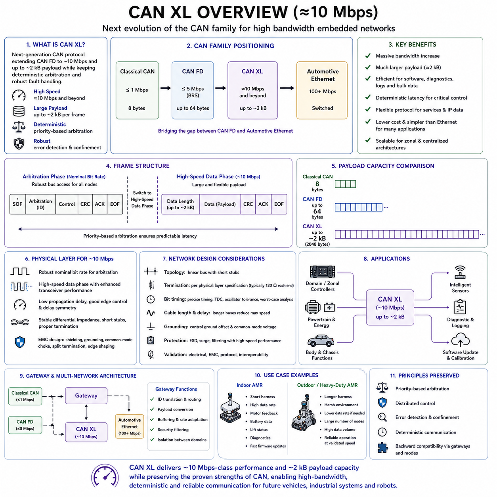
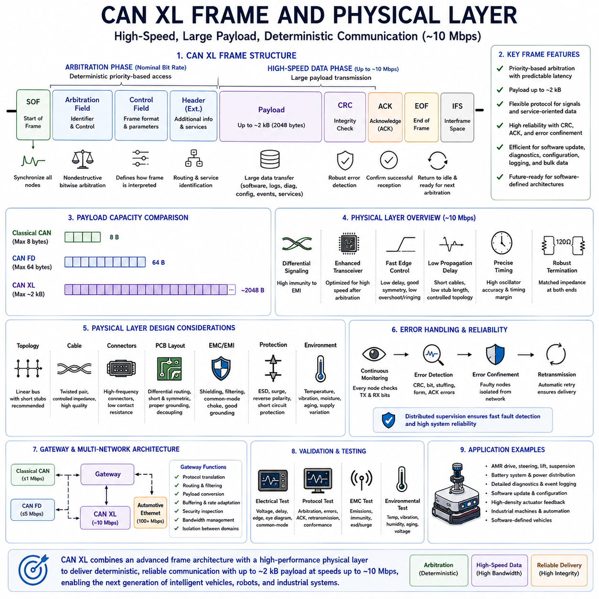
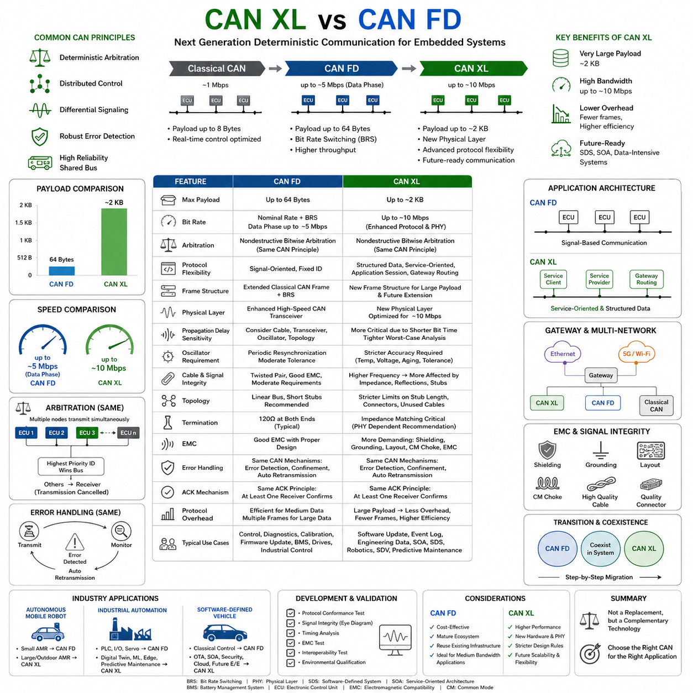
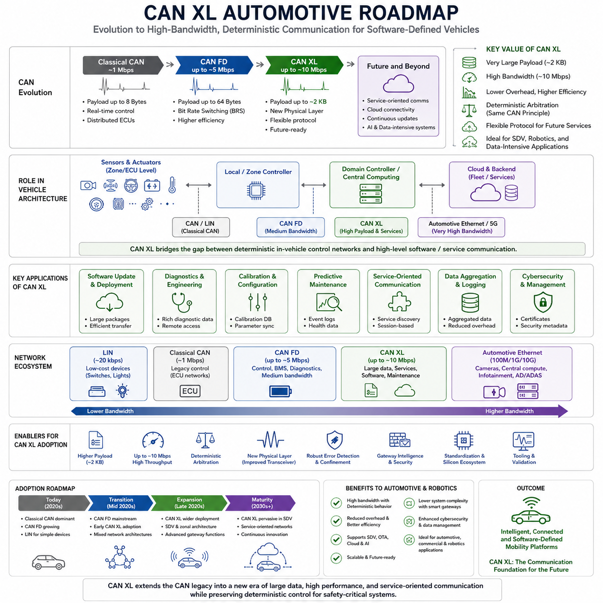
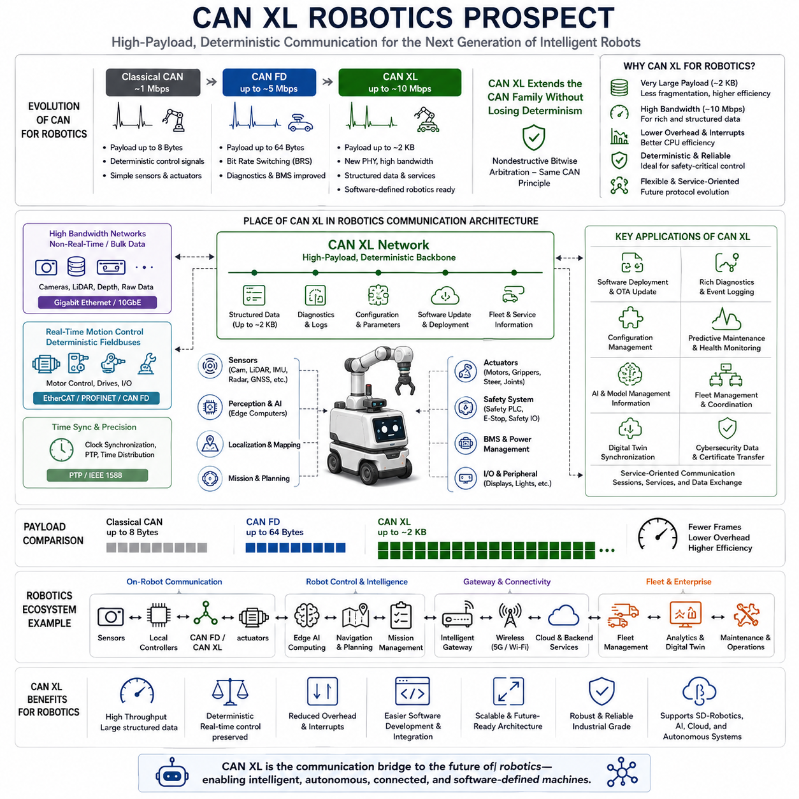

**Volume 06 Automotive Communication**

# Chapter 5. CAN XL Protocol

## 5.1 CAN XL Overview 10Mbps

{width="7.268055555555556in" height="7.268055555555556in"}

CAN XL is the next major evolution of the Controller Area Network family, developed to provide substantially higher bandwidth while preserving the deterministic arbitration and fault-handling principles that made Classical CAN and CAN FD widely adopted. It targets communication speeds of approximately 10 Mbps and beyond, enabling embedded networks to carry larger software, diagnostic, control, and service-oriented data without immediately migrating every function to Ethernet.

The architecture of CAN XL is designed to bridge the performance gap between CAN FD and Automotive Ethernet. CAN FD significantly improved payload size and data-phase speed, but modern vehicles, robots, and industrial machines increasingly exchange software images, detailed diagnostics, high-resolution status data, security information, and gateway traffic. CAN XL responds to these needs with a much larger payload, more flexible protocol fields, and higher physical-layer performance.

CAN XL retains priority-based bus access so that messages with lower numerical identifiers can still win arbitration without destroying frames transmitted by lower-priority nodes. This preserves predictable latency for critical control traffic. Unlike contention-based Ethernet, which may require switching and traffic-shaping mechanisms to achieve determinism, CAN XL inherits CAN's familiar distributed arbitration model directly at the shared-bus level.

A CAN XL frame is divided into an arbitration phase and a high-speed data phase. Arbitration normally occurs at a robust nominal bit rate so that all nodes can participate reliably across the complete network. After bus ownership is established, the transmitting node changes to a faster data-phase rate. This principle resembles Bit Rate Switching in CAN FD, but CAN XL introduces a more advanced frame structure and physical-layer operation.

The commonly referenced 10 Mbps capability represents a practical target rather than a single universal operating value. Actual speed depends on cable length, network topology, transceiver characteristics, oscillator accuracy, connector quality, and electromagnetic conditions. Short, carefully controlled networks may support higher performance, while longer or electrically harsh installations may require reduced data rates to maintain adequate timing and signal-integrity margins.

One of the most important improvements is the greatly expanded payload capacity. Classical CAN supports a maximum of eight data bytes, while CAN FD supports up to sixty-four bytes. CAN XL increases the possible payload to approximately two kilobytes per frame. This allows large blocks of software, diagnostics, configuration data, and structured messages to be transferred with far less protocol overhead than would be required using many smaller CAN FD frames.

The large payload changes how network applications can be designed. Data that previously required transport-layer segmentation across dozens or hundreds of frames may fit into one or a small number of CAN XL frames. This reduces processing overhead, acknowledgement handling, buffer management, and retransmission complexity. It also improves efficiency for firmware distribution, calibration transfer, event logging, and service-oriented communication between embedded controllers.

Despite the larger payload, network designers must avoid treating every CAN XL frame as a maximum-length data container. A long low-priority frame can occupy the bus for a meaningful period and delay subsequent messages. Time-critical control data should still use appropriately sized frames and high-priority identifiers. Large payloads are most effective for bulk transfers, diagnostics, software updates, and aggregated data that can tolerate longer transmission intervals.

CAN XL introduces protocol fields that support better identification and routing of higher-layer data. These fields help gateways and receiving applications distinguish different payload types without relying entirely on a separate application convention. The resulting flexibility supports traditional signal-based communication as well as service-oriented architectures in which data structures, commands, events, and network services coexist on the same communication medium.

The protocol is designed to carry multiple higher-layer technologies more naturally than earlier CAN generations. Ethernet-style payloads, Internet Protocol traffic, or service-oriented data can potentially be transported through CAN XL adaptation mechanisms. This does not make CAN XL identical to Ethernet, but it allows system architects to create more consistent communication models between constrained embedded controllers and high-performance computing domains.

CAN XL also strengthens the role of CAN-based networks in zonal and centralized electronic architectures. Modern systems often place a small number of powerful computers at the center while distributing compact input, output, actuator, and sensor controllers around the machine. CAN XL can connect these zonal devices with greater bandwidth than CAN FD while retaining low-cost shared wiring and deterministic access for time-sensitive embedded functions.

In a vehicle, CAN XL may support domain controllers, zonal gateways, body electronics, powertrain modules, energy systems, chassis functions, and intelligent sensors. Automotive Ethernet remains suitable for cameras, radar streams, infotainment, and high-bandwidth computing. CAN XL is positioned between CAN FD and Ethernet, providing a practical solution for data volumes that exceed CAN FD capability but do not require a fully switched Ethernet architecture.

Autonomous Mobile Robots can benefit from this intermediate network class. A complex AMR may contain multiple drive controllers, steering modules, safety controllers, battery systems, intelligent power distribution units, manipulators, and payload interfaces. CAN XL can carry detailed actuator feedback, energy information, configuration data, logs, and software updates while preserving priority-based delivery for motion and safety-related communication.

Heavy-duty AMRs create especially demanding communication conditions because many distributed controllers operate simultaneously across a large chassis. Four-wheel steering, multiple traction motors, braking systems, lifting mechanisms, high-capacity batteries, and mission equipment can produce large amounts of status data. CAN XL provides more room for coordinated state exchange without forcing all embedded devices to adopt Ethernet hardware and software.

The physical layer is a critical part of achieving 10 Mbps-class operation. Faster communication requires transceivers with low propagation delay, precise edge control, good delay symmetry, and strong electromagnetic performance. The wiring harness must maintain stable differential impedance, short branches, controlled connector transitions, and proper termination. A network that works reliably with CAN FD cannot automatically be assumed to support CAN XL at its intended speed.

CAN XL physical-layer development introduces an operating concept intended to improve high-speed signal transmission after arbitration. During the arbitration-related portion, the bus maintains behavior compatible with dominant and recessive signaling. During the high-speed phase, enhanced transceiver operation can provide stronger and more controlled signal behavior. This improves timing and reduces the limitations associated with traditional open-drain-style CAN signaling.

Different physical-layer modes may be considered according to backward compatibility and performance requirements. Some implementations may prioritize coexistence with established CAN FD wiring and transceiver behavior, while others may use CAN XL-specific transceiver capabilities to reach higher rates. The selected mode affects compatibility, network length, speed, electromagnetic emissions, and the ability to mix different generations of CAN devices.

Backward compatibility requires careful interpretation. CAN XL follows the design philosophy of the CAN family, but a Classical CAN or CAN FD controller cannot automatically receive and interpret a CAN XL frame. Mixed-generation networks require suitable controllers, selective operating modes, separate channels, or gateways. Migration therefore involves architectural planning rather than simply replacing one transceiver while leaving every other node unchanged.

A gateway can isolate legacy CAN, CAN FD, CAN XL, and Ethernet domains while forwarding selected information between them. This arrangement allows existing subsystems to remain operational while new high-bandwidth functions are introduced gradually. The gateway may perform identifier translation, payload conversion, routing, buffering, security checking, and rate adaptation. Its design must preserve timing requirements and prevent high-volume traffic from overwhelming lower-speed networks.

Bit timing becomes more demanding as the data rate approaches and exceeds 10 Mbps. Oscillator tolerance, synchronization jump width, sampling point, transceiver delay, and cable propagation must be evaluated using worst-case values. Small timing errors that are harmless at 500 kbps can become critical at high speed. Controller timing parameters should therefore be calculated from the actual topology and validated across temperature, voltage, and component variation.

Propagation delay includes the controller output path, transceiver driver, cable, connector, receiving transceiver, and controller input. Every nanosecond consumes a larger percentage of the bit time as speed increases. Long harnesses and distributed nodes can therefore limit achievable performance. Network architects may need to divide a large machine into multiple local CAN XL segments connected through gateways rather than attempting one extremely long high-speed bus.

Topology should remain as close as possible to a linear backbone with short stubs. Star connections and long branches generate reflections that may overlap later signal transitions. Connector chains, unused harness extensions, service adapters, and optional modules also alter impedance. The higher the selected data rate, the more strictly the physical arrangement must be controlled through electrical architecture and harness design rules.

Termination must match the physical-layer mode and transceiver specification. Traditional high-speed CAN commonly uses 120-ohm resistors at both ends of the bus, but CAN XL implementations may introduce additional requirements depending on the selected physical-layer approach. Designers should not assume that a termination network optimized for Classical CAN will always provide the best performance for CAN XL. Simulation and measurement are required.

Electromagnetic compatibility is a major design challenge because faster edges contain more high-frequency energy. Improper routing can increase both conducted and radiated emissions. Twisted-pair quality, cable shielding, common-mode chokes, split termination, grounding, connector placement, and PCB layout must be coordinated. Edge shaping may reduce emissions, but excessive filtering can also reduce timing margin and distort the high-speed signal.

Common-mode voltage and ground offset remain important even though CAN XL uses differential communication. Vehicles and robots often contain high-current motors, batteries, contactors, inverters, and DC-DC converters that create local ground differences. The transceiver must tolerate the expected common-mode range, while system grounding should prevent traction or charging currents from flowing through communication references. Isolation may be necessary between power domains.

Protection components must be selected for both electrical robustness and high-speed performance. Transient voltage suppressors, common-mode chokes, filters, and series elements can protect against electrostatic discharge, surge events, and electromagnetic disturbances. However, their parasitic capacitance and inductance may degrade CAN XL waveforms. Component selection must therefore consider bandwidth, clamping behavior, package layout, and actual network loading.

CAN XL is expected to improve software update performance significantly. Embedded controllers increasingly require large firmware packages, security patches, calibration datasets, and configuration files. Transferring these over Classical CAN can take a long time, and even CAN FD may be limiting in large systems. CAN XL's higher speed and larger frames reduce transfer duration while allowing the update process to remain within a familiar CAN-based infrastructure.

Diagnostics also benefit from the expanded payload. A controller can report detailed fault snapshots, operating histories, internal measurements, software versions, counters, and trace records in a compact number of frames. Service tools can retrieve more information with fewer transactions. This supports faster troubleshooting, predictive maintenance, and remote support for vehicles, industrial machines, and autonomous robots.

Security becomes increasingly important as frame size and network connectivity increase. Traditional CAN arbitration does not provide encryption, authentication, or access control by itself. CAN XL systems may therefore use application-layer message authentication, secure diagnostics, freshness counters, protected firmware updates, secure boot, and gateway-based filtering. Larger payloads make it easier to include security metadata, but security still requires a complete system architecture.

Network-load analysis remains essential despite the higher bandwidth. Engineers must consider frame transmission time, arbitration delay, error handling, retransmissions, payload size, and burst traffic. Large software or diagnostic transfers should not interfere with real-time control. Traffic shaping, message priorities, update windows, bandwidth reservations, and gateway rate control may be required to preserve deterministic performance during peak activity.

CAN XL can coexist with time-sensitive control if communication classes are clearly separated. Motion commands, braking information, actuator limits, and safety status should use high-priority short frames. Monitoring data may use medium-priority periodic frames, while logs, calibration blocks, and updates use lower priority. This structured scheduling allows bulk traffic and real-time control to share the same network without compromising essential deadlines.

Error detection and fault confinement remain central strengths of the CAN approach. Controllers monitor transmitted and received bits, verify checks, generate error information, and isolate persistently faulty nodes. CAN XL expands protocol capability while preserving the expectation that communication faults are detected quickly. System software should additionally monitor message timeouts, sequence continuity, data freshness, and node availability.

Testing must include protocol, timing, electrical, environmental, and interoperability verification. Engineers should measure differential voltage, common-mode movement, propagation delay, ringing, overshoot, edge symmetry, and sampling margin. Protocol tools should monitor arbitration, frame errors, retransmission, bus load, and fault recovery. Tests should cover minimum and maximum cable length, different transceiver vendors, temperature extremes, and supply variation.

Electromagnetic testing should reproduce realistic operating states. Motors, inverters, chargers, relays, wireless equipment, and high-current loads should operate while CAN XL traffic is monitored at maximum expected speed. A network that succeeds on a bench may fail when installed near actual switching power electronics. Full-system validation is therefore essential before the selected data rate is released for production.

Interoperability is especially important during the early adoption of a new protocol generation. Controllers and transceivers from different suppliers may interpret timing margins differently or provide different edge characteristics. Validation should use worst-case combinations rather than identical components only. Standard conformance is necessary, but practical interoperability testing remains essential for reliable field operation.

For an indoor AMR, short harnesses and controlled packaging may allow CAN XL to operate near its higher performance range. The network can support detailed motor feedback, battery data, lift status, diagnostics, and rapid firmware maintenance. Ethernet can remain dedicated to perception and navigation, while CAN XL serves as the embedded control and service backbone connecting distributed electromechanical devices.

For an outdoor or heavy-duty robot, the achievable speed may be limited by longer wiring, larger ground offsets, harsh electromagnetic conditions, and more connectors. The network may still gain major benefits from CAN XL's payload and protocol efficiency even if the maximum theoretical bit rate is not used. Reliable operation at a validated lower speed is more valuable than unstable operation at the highest advertised rate.

CAN XL should not be regarded as a universal replacement for CAN FD or Ethernet. CAN FD remains cost-effective for many control networks with moderate data requirements, while Ethernet is superior for extremely high-bandwidth streams and switched communication. CAN XL fills the intermediate space where deterministic arbitration, shared-bus simplicity, larger payloads, and approximately 10 Mbps-class performance provide the best system-level balance.

The introduction of CAN XL represents a continuation of the CAN family rather than a complete architectural break. It preserves familiar concepts such as identifiers, arbitration, distributed control, and fault confinement while adding the capacity required for software-defined and data-intensive embedded systems. This reduces migration risk for organizations with extensive CAN experience while enabling more advanced applications.

When properly designed, CAN XL can provide a scalable communication backbone for future vehicles, industrial automation systems, and autonomous robotic platforms. Its combination of deterministic access, multi-kilobyte payload capability, higher data rates, gateway compatibility, and improved protocol flexibility allows embedded controllers to exchange richer information without abandoning proven CAN engineering principles. Reliable 10 Mbps-class operation nevertheless depends on disciplined physical-layer design, timing analysis, traffic planning, security, and comprehensive validation.

## 5.2 CAN XL Frame and PHY

{width="7.268055555555556in" height="7.268055555555556in"}

CAN XL frame architecture and physical-layer technology represent the most significant technical evolution in the CAN family since the introduction of CAN FD. While CAN FD primarily increased payload size and communication speed, CAN XL introduces a fundamentally enhanced protocol structure together with an advanced physical-layer concept capable of supporting communication speeds approaching 10 Mbps. These improvements enable CAN XL to address the growing communication demands of software-defined vehicles, industrial automation systems, autonomous mobile robots, and distributed embedded computing platforms while preserving the deterministic communication philosophy that has characterized CAN networks for decades.

The CAN XL frame is designed to support much larger data transfers without sacrificing communication reliability. Like previous generations, every communication begins with an arbitration process that determines which node gains bus access. After successful arbitration, the transmitting controller enters a high-speed data transmission phase that allows substantially larger payloads than either Classical CAN or CAN FD. This separation between arbitration and high-speed transmission enables efficient use of available bandwidth while maintaining deterministic access to the shared communication medium.

The frame structure preserves the concept of sequential communication fields but extends their functionality considerably. Each field contributes to synchronization, identification, control, payload management, integrity verification, and frame completion. Rather than simply enlarging existing CAN FD fields, CAN XL reorganizes parts of the protocol to improve scalability, future extensibility, and compatibility with increasingly complex software architectures. This approach allows CAN XL to transport both traditional signal-oriented data and modern service-oriented communication within the same protocol framework.

Frame transmission begins with the Start of Frame field, allowing all network nodes to synchronize their internal communication state machines. Accurate synchronization is essential because timing errors accumulate rapidly as communication speed increases. Every controller continuously monitors the bus and aligns its internal timing with observed signal transitions. This synchronization process provides the foundation for reliable arbitration and subsequent high-speed data transmission across distributed embedded controllers.

The arbitration field retains one of CAN\'s greatest strengths: nondestructive bitwise arbitration. Multiple controllers may attempt transmission simultaneously, but only the highest-priority identifier remains active while all other controllers immediately become receivers without destroying the transmitted frame. This mechanism guarantees deterministic access regardless of network utilization. Critical real-time messages therefore continue to receive predictable communication latency even as overall network traffic increases significantly.

Unlike switched communication technologies that require centralized scheduling or quality-of-service management, CAN XL performs priority resolution directly on the shared bus. Every controller independently evaluates transmitted and observed bits during arbitration. When a controller detects a higher-priority dominant bit while transmitting a recessive bit, it immediately stops transmitting and waits for the current frame to complete. This elegant distributed arbitration mechanism remains one of the defining characteristics of the CAN protocol family.

Following arbitration, the control portion of the frame specifies important communication parameters required for successful reception. These include frame interpretation information, payload characteristics, protocol configuration, and other communication attributes understood by both transmitter and receiver. Because CAN XL supports substantially more flexible communication than previous CAN generations, the control fields contain more information describing how the remaining frame should be processed.

One of the most significant protocol improvements is support for extremely large payloads. CAN XL increases maximum payload capacity to approximately two kilobytes, representing a dramatic increase compared with both Classical CAN and CAN FD. This expanded capacity allows large software images, structured diagnostic records, configuration databases, calibration parameters, and service-oriented messages to be transferred with significantly fewer protocol overhead bytes than previously possible.

Large payload capability fundamentally changes network efficiency. Classical CAN often required hundreds of separate frames to transport large diagnostic or firmware data, while CAN FD substantially reduced this requirement through sixty-four-byte payloads. CAN XL further decreases transmission overhead by allowing much larger application data blocks within individual frames. Reduced framing overhead increases effective bandwidth while decreasing controller interrupt frequency and protocol processing load.

Despite supporting very large payloads, efficient network design still requires careful message sizing. Short real-time control messages should remain compact in order to minimize latency and bus occupancy. Large CAN XL frames are most appropriate for applications such as firmware distribution, event logging, engineering diagnostics, machine configuration, production testing, and software maintenance. Separating time-critical traffic from bulk data remains an important communication design principle.

The protocol includes mechanisms that improve payload identification beyond traditional message identifiers alone. Additional protocol information enables receiving software and gateways to distinguish various communication services more efficiently. This flexibility supports modern distributed software architectures where embedded controllers exchange not only numerical signals but also structured data objects, service requests, event notifications, and application-specific communication sessions.

CAN XL has been designed with future software-defined systems in mind. Rather than limiting communication to fixed signal definitions, the protocol supports increasingly dynamic communication models. Service-oriented software architectures allow applications to discover services, exchange structured information, and communicate through standardized interfaces instead of relying exclusively on fixed message databases. CAN XL provides protocol flexibility that better accommodates these evolving software development practices.

Frame integrity remains a fundamental design objective. Every transmitted frame includes mechanisms allowing receivers to verify that communication occurred without corruption. Robust error detection protects against noise, timing disturbances, signal distortion, electromagnetic interference, and other communication faults. If an error is detected, the network immediately initiates retransmission procedures while identifying communication faults through CAN\'s well-established error confinement mechanisms.

Error detection remains distributed throughout the network rather than centralized within a master controller. Every node independently validates received information while simultaneously monitoring its own transmitted signals. This distributed supervision allows communication faults to be detected extremely rapidly while preventing individual hardware failures from remaining undetected. The resulting fault tolerance continues to distinguish CAN-based communication from many alternative industrial networking technologies.

After successful transmission, receiving controllers acknowledge correct frame reception through the acknowledgement mechanism. This confirms that at least one intended receiver successfully interpreted the transmitted frame. Missing acknowledgement indicates that communication was unsuccessful or that no active receiver accepted the frame. The transmitter can therefore initiate retransmission according to protocol rules without requiring additional application-level recovery mechanisms.

The End of Frame sequence defines the conclusion of communication while restoring the network to its idle state. Controllers immediately become ready for subsequent arbitration following completion of interframe spacing requirements. Although frame completion appears straightforward, accurate timing during these transitions is essential because high-speed communication leaves very little margin for synchronization errors between consecutive frames.

While the logical frame structure defines protocol behavior, the physical layer determines whether communication can actually occur reliably at approximately 10 Mbps. The physical layer specifies differential signaling methods, electrical voltage levels, transceiver behavior, cable characteristics, termination strategy, connector requirements, propagation delay limits, and electromagnetic compatibility considerations. Successful CAN XL implementation depends equally upon protocol design and physical-layer engineering.

CAN XL continues using differential communication because differential signaling provides excellent immunity to external electromagnetic interference. Two complementary communication wires carry equal but opposite voltage changes. External noise generally affects both conductors similarly, allowing differential receivers to reject common-mode disturbances while accurately detecting intended communication signals. This principle remains highly effective even as communication speed increases substantially.

The physical layer introduces enhanced transceiver operation intended to improve high-speed communication beyond traditional open-drain CAN signaling. During arbitration, the network preserves familiar dominant and recessive behavior required for distributed priority resolution. Once arbitration completes, however, the transceiver may employ optimized signal-generation techniques better suited for very high communication speeds. This hybrid approach combines backward architectural compatibility with significantly improved physical-layer performance.

Signal edge quality becomes increasingly important at higher communication speeds. Every rising and falling transition must occur rapidly enough to maintain adequate timing margin while avoiding excessive overshoot, undershoot, ringing, or electromagnetic emission. Transceiver output stages therefore require careful optimization of drive strength, slew rate, output impedance, and switching symmetry. Small waveform distortions that are insignificant at one megabit per second may become major reliability concerns near ten megabits per second.

Propagation delay represents one of the primary limitations of high-speed communication. Total delay includes controller output timing, transceiver switching delay, cable propagation time, connector delay, receiver response, and controller input synchronization. Because communication bit periods become much shorter at higher speeds, these accumulated delays consume a much larger percentage of available timing margin. Network designers must therefore evaluate worst-case propagation delay across every possible communication path.

Oscillator accuracy becomes increasingly critical as communication speed rises. Every participating controller relies upon its local clock to generate communication timing. Small frequency differences between oscillators accumulate until synchronization events occur. High-speed communication reduces acceptable timing error considerably, requiring oscillators with tighter frequency tolerance across manufacturing variation, operating temperature, aging, and supply-voltage changes.

Cable quality significantly influences CAN XL performance. Twisted-pair wiring remains the preferred transmission medium because it maintains controlled differential impedance while minimizing susceptibility to external interference. Uniform conductor spacing, insulation consistency, cable geometry, and manufacturing quality all contribute to stable signal propagation. High-quality cables become increasingly important as communication frequency and edge rate continue increasing.

Network topology strongly affects physical-layer reliability. A linear backbone with short branch connections remains the preferred configuration because it minimizes signal reflections and impedance discontinuities. Long stubs, star topologies, unused cable extensions, and excessive connector chains generate reflections that may interfere with subsequent signal transitions. Careful wiring architecture therefore becomes increasingly important as communication speed approaches ten megabits per second.

Termination remains essential for controlling reflections within the communication channel. Differential impedance must remain consistent throughout the network while termination absorbs transmitted signal energy at the physical ends of the bus. Although traditional high-speed CAN commonly employs one hundred twenty ohm termination resistors at each end, CAN XL physical-layer implementations may introduce additional recommendations depending upon transceiver technology and selected operating mode.

Connector performance also becomes increasingly significant. Every connector introduces additional impedance variation, contact resistance, parasitic capacitance, and mechanical tolerance. Poor connector quality may produce localized signal reflections or intermittent communication failures caused by vibration, corrosion, contamination, or wear. Automotive and industrial CAN XL systems therefore require connectors specifically designed for high-frequency differential communication.

Printed circuit board layout directly influences signal integrity at high communication speeds. Differential traces should remain closely coupled with constant spacing while avoiding unnecessary length differences. High-current switching circuits should remain separated from communication traces. Ground planes should provide stable return-current paths while minimizing electromagnetic radiation. Protection devices should be positioned near external connectors, and decoupling capacitors should remain close to transceiver supply pins.

Electromagnetic compatibility represents one of the greatest engineering challenges for CAN XL. Faster switching edges naturally generate higher-frequency spectral components that increase both conducted and radiated emissions. Effective electromagnetic design therefore requires coordinated optimization of cable routing, shielding strategy, grounding architecture, connector placement, PCB layout, filtering, common-mode chokes, and transceiver output characteristics. Successful EMC performance cannot be achieved through a single design technique alone.

Grounding strategy remains important despite differential communication. Large industrial machines, electric vehicles, and autonomous robots often contain powerful traction motors, battery systems, inverters, chargers, and switching power supplies that generate significant ground-potential differences. Transceivers must tolerate expected common-mode voltage while system grounding prevents heavy current from flowing through communication reference paths. Galvanic isolation may be appropriate where independent electrical domains interact.

Protection circuitry safeguards communication hardware against abnormal electrical events. Electrostatic discharge, surge transients, load dump conditions, reverse polarity, and short circuits must all be considered during hardware development. Protection components should provide effective electrical robustness without excessively increasing parasitic capacitance or degrading high-frequency communication performance. Achieving both objectives simultaneously requires careful component selection and PCB implementation.

The physical layer must also support reliable operation throughout the complete environmental operating range. Temperature changes alter oscillator frequency, transceiver propagation delay, cable resistance, and termination characteristics. Mechanical vibration influences connector integrity, while moisture and contamination affect long-term electrical performance. CAN XL hardware should therefore be validated under realistic operating conditions representative of its intended deployment environment.

Network segmentation becomes increasingly attractive as communication complexity grows. Rather than constructing one extremely large high-speed network, designers may divide the system into multiple CAN XL domains connected through intelligent gateways. Each local network maintains shorter cable lengths and reduced propagation delay while gateways exchange information between domains. This architecture improves scalability while simplifying timing verification and fault isolation.

Gateways play an increasingly important role in mixed-network systems. They connect Classical CAN, CAN FD, CAN XL, Automotive Ethernet, industrial Ethernet, and wireless communication technologies while performing protocol translation, routing, filtering, buffering, security inspection, and bandwidth management. Proper gateway design prevents high-volume diagnostic or software traffic from interfering with deterministic embedded control communication.

CAN XL physical-layer validation requires considerably more than successful protocol communication. Engineers must evaluate differential voltage amplitude, signal symmetry, propagation delay, rise and fall times, ringing, overshoot, undershoot, common-mode voltage, eye diagrams, timing margin, electromagnetic emissions, and receiver sensitivity. Oscilloscopes, differential probes, protocol analyzers, vector network analyzers, and EMC test equipment together provide comprehensive understanding of network performance.

Protocol validation complements physical-layer testing by verifying arbitration behavior, frame interpretation, error recovery, retransmission, acknowledgement, fault confinement, and interoperability among controllers from different manufacturers. Successful implementation requires both protocol correctness and electrical integrity. A logically correct protocol implementation may still fail if physical-layer characteristics violate required timing or signal-quality margins.

Autonomous Mobile Robots provide an excellent example of CAN XL frame and physical-layer integration. High-performance AMRs may distribute drive controllers, steering modules, battery systems, intelligent power distribution, suspension controllers, lifting mechanisms, environmental sensors, and supervisory computers throughout a large mobile platform. CAN XL provides sufficient bandwidth for detailed diagnostic information, software updates, configuration management, and comprehensive actuator feedback while preserving deterministic communication for motion control and safety monitoring.

Future embedded architectures will increasingly combine CAN XL with Automotive Ethernet rather than replacing one technology with the other. Ethernet will continue supporting cameras, LiDAR, radar, artificial intelligence computing, cloud connectivity, and extremely high-bandwidth data streams. CAN XL will provide deterministic communication for distributed embedded control while offering significantly greater bandwidth than CAN FD. Together these complementary technologies create flexible communication architectures capable of supporting the next generation of intelligent vehicles, industrial automation equipment, and autonomous robotic systems.

## 5.3 CAN XL vs CAN FD Comparison

{width="7.268055555555556in" height="7.268055555555556in"}

CAN XL and CAN FD belong to the same Controller Area Network family and share many fundamental communication principles, including deterministic arbitration, distributed control, differential signaling, robust error detection, and reliable communication over a shared bus. However, they were designed to solve different generations of embedded networking challenges. CAN FD significantly extended the capabilities of Classical CAN by increasing payload size and introducing faster data transmission, whereas CAN XL was developed to support the communication requirements of software-defined systems, service-oriented architectures, and increasingly data-intensive embedded applications while maintaining the deterministic behavior that has made CAN successful for decades.

The evolution from Classical CAN to CAN FD and finally to CAN XL represents a gradual expansion of network capability rather than a complete redesign. Classical CAN focused primarily on real-time control messages with payloads limited to eight bytes and communication speeds generally limited to one megabit per second. CAN FD addressed growing bandwidth requirements by supporting payloads of up to sixty-four bytes together with higher data-phase transmission speeds through Bit Rate Switching. CAN XL extends this evolution further by introducing payloads approaching two kilobytes, communication speeds near ten megabits per second, enhanced protocol flexibility, and improved support for modern distributed software architectures.

One of the most obvious differences between CAN FD and CAN XL is payload capacity. CAN FD increased the maximum payload from eight bytes to sixty-four bytes, allowing more efficient transmission of diagnostic information, calibration data, and firmware updates. CAN XL expands the payload dramatically to approximately two kilobytes, making it possible to transport significantly larger application data blocks within a single communication frame. This reduces protocol overhead, decreases controller interrupt frequency, and improves effective bandwidth utilization during large data transfers.

Although larger payloads increase communication efficiency, they also require careful application design. CAN FD already demonstrated that unnecessarily large messages can occupy the shared bus for extended periods, potentially delaying lower-priority traffic. CAN XL provides even larger payload capability, making intelligent message segmentation and communication scheduling increasingly important. Real-time control data should remain relatively small, while software distribution, event logging, engineering diagnostics, configuration management, and bulk data transfer can benefit substantially from the expanded frame size.

Communication speed also distinguishes the two technologies. CAN FD typically operates with arbitration at conventional nominal bit rates while increasing only the data phase through Bit Rate Switching. Depending on network design, data-phase transmission may reach several megabits per second. CAN XL extends achievable communication performance toward approximately ten megabits per second through an enhanced protocol structure and an advanced physical layer specifically optimized for higher-speed differential communication.

Both technologies preserve deterministic arbitration using CAN\'s well-established nondestructive bitwise arbitration mechanism. Multiple nodes may request transmission simultaneously, yet the highest-priority identifier always gains immediate bus access without destroying communication. Lower-priority transmitters simply become receivers and retry later. This arbitration principle remains unchanged because it provides predictable latency for safety-critical and real-time embedded control regardless of overall network traffic.

Despite sharing the same arbitration philosophy, CAN XL introduces substantially greater protocol flexibility following arbitration. CAN FD primarily transports conventional signal-oriented communication where fixed identifiers correspond to predefined signals. CAN XL extends the protocol to better accommodate structured data, service-oriented communication, application sessions, gateway routing, and more sophisticated communication models expected within future software-defined embedded systems.

Frame structures also differ significantly. CAN FD extends the Classical CAN frame while maintaining overall protocol organization. Additional control information supports larger payloads and Bit Rate Switching, yet the protocol remains relatively close to earlier CAN implementations. CAN XL reorganizes portions of the frame structure to accommodate substantially larger payloads, additional protocol information, future extensibility, and more advanced communication services without sacrificing deterministic operation.

The physical layers represent another major distinction. CAN FD generally continues using enhanced versions of traditional high-speed CAN transceivers while relying upon improved timing analysis and faster switching during the data phase. CAN XL introduces a more advanced physical-layer concept capable of supporting communication approaching ten megabits per second. Although arbitration behavior remains compatible with traditional CAN philosophy, high-speed transmission employs optimized signaling techniques intended specifically for higher bandwidth communication.

Propagation delay becomes increasingly important when comparing the two technologies. CAN FD already requires careful consideration of cable length, transceiver delay, oscillator tolerance, and network topology at higher data rates. CAN XL further tightens timing requirements because communication bit periods become even shorter. Consequently, network designers must perform much more detailed worst-case timing analysis covering controllers, transceivers, cables, connectors, and environmental operating conditions.

Oscillator performance requirements similarly become more demanding. CAN FD systems generally tolerate reasonable manufacturing variation while maintaining synchronization through periodic resynchronization events. CAN XL requires considerably tighter oscillator accuracy because smaller timing errors occupy a larger percentage of each communication bit. Designers must therefore evaluate oscillator stability across temperature variation, supply voltage fluctuation, manufacturing tolerance, and long-term aging more carefully than in many CAN FD applications.

Cable quality also becomes more critical with CAN XL. Both technologies rely upon differential twisted-pair communication for excellent electromagnetic immunity. However, the higher communication frequencies associated with CAN XL increase sensitivity to impedance discontinuities, connector imperfections, cable geometry variation, and branch-line reflections. Networks that operate successfully with CAN FD may require improved wiring quality or shorter cable lengths before achieving reliable CAN XL communication.

Network topology recommendations remain fundamentally similar but become increasingly strict with higher communication speeds. Linear bus architectures with short branch connections remain preferred for both CAN FD and CAN XL because they minimize signal reflections. However, CAN XL places tighter limitations on stub length, connector count, unused cable branches, and impedance discontinuities. High-speed communication reduces available timing margin, making previously acceptable wiring practices potentially unsuitable.

Termination strategy continues to play an essential role in both technologies. Proper impedance matching prevents reflections that may corrupt communication. While CAN FD commonly uses standard one-hundred-twenty-ohm termination resistors at both ends of the bus, CAN XL physical-layer implementations may introduce additional recommendations depending upon transceiver architecture and selected operating mode. Engineers should therefore validate actual signal quality rather than assuming identical termination practices remain optimal.

Electromagnetic compatibility remains important for both protocols but becomes increasingly challenging with CAN XL. Faster signal transitions naturally generate higher-frequency spectral components that may increase conducted and radiated emissions. Shielding, grounding, cable routing, common-mode chokes, PCB layout, connector selection, and transceiver design therefore become even more important. Successful CAN XL implementation requires more comprehensive EMC engineering than many traditional CAN FD networks.

Error detection mechanisms remain one of the strongest similarities between the two technologies. Both protocols continuously monitor transmitted and received bits while verifying frame integrity through multiple protocol-level error checks. Transmission faults trigger automatic retransmission while faulty controllers may eventually isolate themselves through CAN\'s distributed error confinement mechanism. This robust fault management philosophy remains unchanged because it continues providing exceptional communication reliability under adverse operating conditions.

Both CAN FD and CAN XL maintain acknowledgment mechanisms confirming successful frame reception. Transmitters expect at least one receiver to acknowledge correct communication. Missing acknowledgments indicate communication failure or absence of active receivers, allowing retransmission without application-level intervention. This automatic communication recovery mechanism significantly simplifies embedded software compared with many other industrial communication technologies.

Protocol overhead differs considerably because of payload size. CAN FD frames remain relatively efficient for medium-sized messages, but transmitting very large application data still requires segmentation into multiple frames with associated protocol overhead. CAN XL dramatically reduces segmentation requirements by allowing much larger payloads per frame. Consequently, software updates, calibration transfers, engineering logs, diagnostic records, and structured data exchange become significantly more bandwidth efficient.

Application software architecture also evolves with CAN XL. CAN FD generally transports predefined signals referenced by fixed communication databases. CAN XL introduces greater flexibility supporting structured information, service-oriented communication, application-layer routing, and future protocol extensions. This capability aligns more closely with software-defined vehicles and distributed robotics platforms where communication requirements continue evolving after initial product deployment.

Gateway functionality becomes increasingly important when integrating CAN XL into existing systems. Most future embedded platforms will continue containing Classical CAN, CAN FD, CAN XL, Automotive Ethernet, industrial Ethernet, and wireless communication simultaneously. Intelligent gateways perform protocol translation, payload conversion, routing, buffering, bandwidth management, and security inspection while allowing each network technology to operate within its optimal application domain.

Migration from CAN FD to CAN XL will generally occur gradually rather than through immediate replacement. Existing CAN FD networks already satisfy the requirements of many industrial controllers, body electronics, battery management systems, motor drives, and machine automation products. CAN XL is primarily intended for systems requiring substantially higher bandwidth, larger structured data transfers, future software extensibility, and closer integration with service-oriented architectures. Many future products will therefore employ both technologies simultaneously.

Development complexity increases somewhat with CAN XL because designers must consider additional protocol features, higher communication frequencies, tighter physical-layer tolerances, larger memory requirements, expanded software architecture, and more sophisticated validation procedures. However, these additional engineering efforts are balanced by significantly improved communication capability and greater long-term scalability for increasingly intelligent embedded systems.

Validation requirements become more demanding for CAN XL. In addition to traditional protocol verification, engineers must perform more comprehensive signal integrity analysis, timing verification, eye diagram evaluation, electromagnetic compatibility testing, interoperability validation, and environmental qualification. Higher communication speed leaves smaller electrical margins, making physical-layer validation nearly as important as protocol verification.

Cost considerations differ depending upon application requirements. CAN FD remains an economical solution for many distributed control systems where communication payloads remain moderate and existing infrastructure can be reused. CAN XL may initially require newer controllers, advanced transceivers, higher-quality cabling, and more extensive engineering validation. However, applications requiring large data transfers may ultimately reduce overall system complexity because fewer communication frames, fewer protocol transactions, and simplified software transport mechanisms become necessary.

Autonomous Mobile Robots illustrate these differences particularly well. Compact indoor robots performing relatively simple transportation tasks often communicate efficiently using CAN FD because actuator commands, battery status, safety signals, and sensor monitoring generate moderate communication loads. Larger outdoor robots, autonomous construction equipment, mining vehicles, agricultural machinery, and intelligent logistics platforms increasingly generate detailed diagnostics, software updates, structured configuration databases, predictive maintenance information, and service-oriented communication that benefit from CAN XL\'s expanded bandwidth and payload capacity.

Industrial automation systems demonstrate similar migration patterns. Traditional programmable logic controllers, distributed input-output modules, servo drives, and sensor networks frequently operate effectively with CAN FD. Future manufacturing systems incorporating digital twins, machine learning, cloud diagnostics, predictive maintenance, edge computing, collaborative robots, and software-defined manufacturing infrastructure require significantly richer information exchange. CAN XL provides communication capability better aligned with these evolving industrial requirements.

Software-defined vehicles represent perhaps the strongest motivation for CAN XL development. Modern vehicles increasingly rely upon centralized computing, over-the-air software updates, service-oriented communication, cybersecurity monitoring, cloud connectivity, and continuously evolving software functionality. CAN FD remains highly effective for conventional embedded control, while CAN XL provides additional bandwidth and protocol flexibility supporting future electronic architectures without abandoning CAN\'s deterministic communication principles.

Rather than viewing CAN XL as a replacement for CAN FD, it is more accurate to consider both technologies as complementary members of the same communication family. CAN FD continues serving medium-bandwidth deterministic control applications extremely well, while CAN XL addresses emerging requirements involving larger structured data, higher communication performance, software-defined functionality, and future embedded architectures. Selecting the appropriate protocol depends not upon technological superiority alone but upon communication bandwidth, application complexity, system scalability, long-term maintenance strategy, and overall architectural objectives.

## 5.4 CAN XL Automotive Roadmap

{width="7.268055555555556in" height="7.268055555555556in"}

CAN XL represents the third major generation of the Controller Area Network (CAN) family and is designed to address the communication requirements of next-generation automotive electronic and electrical architectures. While Classical CAN was originally optimized for deterministic real-time control and CAN FD expanded payload capacity and transmission speed, CAN XL extends the technology further by introducing significantly larger payloads, higher bandwidth, and greater protocol flexibility. Rather than replacing previous CAN generations, CAN XL forms part of a long-term evolutionary roadmap in which different generations coexist according to application requirements. This evolutionary strategy allows manufacturers to preserve existing investments while gradually introducing new communication capabilities into increasingly software-defined vehicles.

The automotive industry has undergone a fundamental transformation over the past decade. Traditional vehicles contained numerous independent electronic control units (ECUs) communicating through relatively small messages for localized control functions. Modern vehicles, however, require continuous software updates, advanced driver assistance systems, centralized computing, cloud connectivity, artificial intelligence, and increasingly complex sensor processing. These developments have dramatically increased communication bandwidth requirements while maintaining strict real-time performance and functional safety constraints. CAN XL was developed to satisfy these new requirements without abandoning the deterministic communication philosophy that has made CAN successful for decades.

The evolution from Classical CAN to CAN FD and finally to CAN XL reflects changing software architectures rather than merely increasing communication speed. Classical CAN primarily transported individual control signals between distributed ECUs. CAN FD improved efficiency by increasing payload size and supporting Bit Rate Switching, enabling larger diagnostic messages and faster firmware updates. CAN XL extends this progression by supporting structured application data, larger software components, service-oriented communication models, and future protocol extensions suitable for highly integrated vehicle computing platforms.

One of the primary motivations behind the CAN XL roadmap is the transition toward Software-Defined Vehicles (SDVs). Instead of viewing vehicle functionality as fixed hardware features, manufacturers increasingly implement new capabilities through software that can be continuously updated throughout the vehicle\'s operational life. OTA software updates, feature activation, cybersecurity improvements, predictive maintenance, and cloud-connected services require significantly larger volumes of data than previous automotive systems. CAN XL provides an intermediate communication layer capable of supporting these applications while maintaining deterministic bus arbitration for critical control functions.

Centralized computing architectures are another major driver influencing the adoption of CAN XL. Conventional vehicle architectures often contain over one hundred distributed ECUs connected through multiple CAN buses. Modern platforms are gradually replacing many small controllers with fewer high-performance domain controllers and central computing units capable of executing numerous software functions simultaneously. This architectural shift requires communication networks capable of transporting larger datasets between computing domains without sacrificing reliability or predictable timing characteristics.

Vehicle networking is also evolving toward zonal architectures, where electronic components are grouped according to physical location rather than functional purpose. In zonal systems, local controllers collect information from nearby sensors and actuators before forwarding data to centralized computing platforms. This architecture reduces wiring complexity while increasing communication efficiency. CAN XL fits naturally into these zonal networks by providing greater payload capacity for aggregated sensor information while remaining compatible with deterministic control applications operating within individual zones.

The automotive communication roadmap increasingly combines multiple networking technologies rather than relying on a single protocol. Low-speed functions continue to utilize LIN for cost-sensitive devices such as switches and lighting modules. Classical CAN remains appropriate for legacy control systems requiring modest bandwidth. CAN FD supports medium-bandwidth control, diagnostics, and battery management systems. CAN XL expands communication capacity for structured application data and software services, while Automotive Ethernet provides extremely high bandwidth for cameras, centralized computing, and multimedia applications. Each technology occupies a specific position within the overall vehicle communication hierarchy.

CAN XL is particularly valuable for applications involving large structured datasets that previously required fragmentation across multiple CAN FD frames. Software deployment, engineering diagnostics, calibration databases, configuration management, predictive maintenance records, and service-oriented communication all benefit from the protocol\'s significantly larger payload capability. Reducing frame fragmentation improves bandwidth utilization, decreases protocol overhead, lowers processor interrupt frequency, and simplifies application-level software handling of large information blocks.

Another important aspect of the CAN XL roadmap involves gateway evolution. Future automotive gateways no longer simply translate messages between different buses. Instead, they perform protocol conversion, application routing, bandwidth optimization, security inspection, data aggregation, network virtualization, and service management. CAN XL supports these intelligent gateway functions by transporting richer application-level information that can be interpreted and routed more efficiently across heterogeneous vehicle networks.

Cybersecurity requirements also influence CAN XL adoption. Future connected vehicles require secure software updates, authenticated communication, protected diagnostics, secure boot processes, and continuous vulnerability management throughout their operational lifetime. Although CAN XL itself does not replace dedicated cybersecurity mechanisms, its larger payloads and more flexible protocol structure facilitate the transportation of certificates, encrypted messages, authentication data, software packages, and security-related metadata that would be cumbersome to transmit using smaller legacy CAN frames.

Automated driving technologies further accelerate the demand for advanced in-vehicle communication. Advanced Driver Assistance Systems (ADAS), autonomous driving controllers, sensor fusion processors, high-definition mapping systems, and artificial intelligence modules continuously exchange substantial amounts of structured information. While high-resolution sensor streams are generally transported through Automotive Ethernet, numerous supporting functions including diagnostics, configuration synchronization, health monitoring, fault reporting, and subsystem coordination can be efficiently handled using CAN XL, reducing the burden on higher-bandwidth networks.

The roadmap also reflects increasing integration between automotive systems and cloud infrastructure. Vehicles continuously exchange operational data with backend services for fleet management, predictive maintenance, digital twins, remote diagnostics, and software lifecycle management. Efficient communication between local controllers and centralized computing platforms simplifies the collection, organization, and transmission of cloud-bound information. CAN XL contributes by transporting structured application data throughout the vehicle before higher-level systems communicate externally through wireless connectivity.

Electrified vehicles introduce additional communication challenges that align with the capabilities of CAN XL. Battery Management Systems (BMS), charging controllers, thermal management modules, power electronics, energy optimization algorithms, and high-voltage safety systems exchange increasingly detailed diagnostic and operational information. Although many real-time control signals remain suitable for CAN FD, larger engineering datasets, historical performance records, calibration parameters, and maintenance information benefit from the expanded payload capacity available in CAN XL.

The transition toward CAN XL is expected to occur gradually rather than through immediate replacement of existing communication systems. Automotive development cycles typically span many years, and manufacturers have substantial investments in CAN and CAN FD infrastructure. Consequently, mixed-network architectures containing Classical CAN, CAN FD, CAN XL, Automotive Ethernet, and LIN will remain common throughout the transition period. Intelligent gateways will ensure interoperability while allowing new technologies to be introduced incrementally without disrupting proven vehicle functions.

Semiconductor development represents another essential element of the CAN XL roadmap. New controllers, enhanced transceivers, higher-performance microcontrollers, improved physical layer implementations, and advanced network analysis tools are gradually becoming available to support commercial deployment. As silicon vendors expand CAN XL product portfolios, development costs are expected to decrease while interoperability between suppliers continues to improve through standardized implementations and compliance testing.

Physical layer improvements are equally important for successful CAN XL deployment. Higher communication speeds require greater attention to signal integrity, cable impedance, connector quality, propagation delay, electromagnetic compatibility, and network topology. Vehicle manufacturers must adopt stricter design methodologies, including comprehensive timing analysis, signal integrity simulation, eye diagram validation, and worst-case environmental testing to ensure reliable operation under demanding automotive conditions.

The roadmap extends beyond passenger vehicles into commercial transportation and intelligent mobility platforms. Heavy-duty trucks, buses, construction machinery, agricultural equipment, mining vehicles, autonomous delivery platforms, and industrial mobile robots increasingly require software-defined architectures similar to those found in passenger cars. These systems benefit from deterministic communication while simultaneously requiring larger software updates, structured diagnostics, fleet management information, and predictive maintenance capabilities that align closely with CAN XL functionality.

Autonomous Mobile Robots (AMRs) illustrate how automotive communication technologies influence industrial robotics. Indoor logistics robots performing relatively simple navigation and material transport generally operate effectively using CAN FD for motor control, battery management, and safety communication. Outdoor autonomous vehicles, heavy industrial robots, mining platforms, agricultural machines, and inspection robots require richer communication involving large diagnostic logs, software deployment packages, configuration databases, cloud synchronization, and advanced fleet coordination. CAN XL provides a practical communication foundation for these increasingly sophisticated robotic systems while preserving deterministic network behavior for safety-critical motion control.

Future automotive communication architectures are therefore expected to rely on complementary rather than competing technologies. LIN will remain appropriate for simple body electronics, CAN FD will continue serving deterministic medium-bandwidth control applications, CAN XL will address structured high-capacity embedded communication, and Automotive Ethernet will provide extremely high-speed connectivity for centralized computing and sensor-rich applications. This layered communication strategy maximizes performance, scalability, reliability, and cost efficiency while supporting the long-term evolution toward software-defined transportation systems. The CAN XL roadmap ultimately represents not merely an increase in communication bandwidth but a fundamental step toward more intelligent, service-oriented, secure, and continuously updatable vehicle architectures capable of supporting the next generation of automotive and robotic technologies.

## 5.5 CAN XL Robotics Prospect

{width="7.268055555555556in" height="7.268055555555556in"}

Robotics communication architectures are evolving rapidly as autonomous systems become more intelligent, interconnected, and software-driven. Traditional industrial robots primarily exchanged deterministic control signals among motor controllers, sensors, and programmable logic controllers using fieldbus technologies or conventional CAN networks. Modern Autonomous Mobile Robots (AMRs), humanoid robots, quadrupeds, collaborative robots, agricultural machines, construction equipment, and autonomous mining vehicles now process significantly larger volumes of information involving perception, artificial intelligence, cloud services, diagnostics, and fleet coordination. These developments are driving communication requirements beyond the capabilities of conventional CAN networks while preserving the need for deterministic real-time control. CAN XL provides an evolutionary path that extends the proven CAN ecosystem toward future robotics applications without abandoning its fundamental communication philosophy.

The historical development of robotic communication closely resembles the evolution observed in automotive electronics. Early robots primarily executed repetitive motion sequences with relatively simple sensor feedback and centralized controllers. As robotics progressed toward autonomous operation, systems began incorporating multiple cameras, LiDAR sensors, radar modules, GNSS receivers, IMUs, force sensors, environmental monitoring devices, and distributed computing platforms. The communication network evolved from transporting individual actuator commands into supporting increasingly sophisticated software services, distributed processing, and high-level application coordination. CAN XL represents an important communication technology capable of supporting this transition while maintaining deterministic message arbitration.

Modern robotic systems increasingly employ heterogeneous communication architectures in which multiple networking technologies coexist according to application requirements. Real-time motor control may continue using EtherCAT or CAN FD, while sensor synchronization utilizes Precision Time Protocol (PTP), high-bandwidth perception data travels through Gigabit Ethernet, and cloud communication occurs through wireless networks such as Wi-Fi, 5G, or satellite links. CAN XL fits naturally within this layered architecture by providing medium-to-high bandwidth deterministic communication for structured application data that exceeds the practical limits of CAN FD while avoiding the complexity of full Ethernet deployment for every subsystem.

One of the most significant advantages of CAN XL in robotics is its substantially increased payload capacity. Conventional CAN FD supports payloads up to 64 bytes, requiring large engineering datasets to be fragmented across numerous frames. CAN XL expands payload capacity to approximately 2 KB, allowing calibration databases, configuration files, diagnostic records, software packages, parameter sets, maintenance logs, and structured operational information to be transmitted more efficiently. Larger payloads reduce protocol overhead, minimize processor interrupt frequency, simplify application software, and improve overall communication efficiency across distributed robotic systems.

Future robotic platforms are expected to rely heavily on Software-Defined Robotics principles similar to Software-Defined Vehicles. Instead of fixed functionality determined during manufacturing, robots will continuously receive software improvements, new autonomous behaviors, artificial intelligence models, cybersecurity updates, and operational enhancements throughout their service life. This lifecycle management approach requires communication networks capable of transporting increasingly large software components safely and efficiently. CAN XL provides a practical communication foundation for these continuous software deployment strategies while maintaining compatibility with deterministic embedded control.

Artificial intelligence integration further increases communication demands within robotic platforms. Edge AI computers continuously exchange perception results, localization information, semantic maps, obstacle classifications, environmental models, mission updates, and operational status with lower-level embedded controllers. Although raw sensor streams typically remain on high-speed Ethernet networks, structured inference results, AI configuration parameters, model management information, and health monitoring data can be efficiently transported through CAN XL. This separation enables each communication technology to perform tasks best suited to its capabilities.

Fleet management systems introduce another important application area for CAN XL. Modern warehouses, manufacturing facilities, logistics centers, ports, airports, hospitals, and mining operations increasingly deploy large numbers of autonomous robots working cooperatively under centralized fleet coordination. Individual robots continuously exchange mission assignments, navigation parameters, operational diagnostics, maintenance information, software versions, battery status, and resource allocation data. CAN XL provides an efficient communication mechanism for transporting structured information between distributed controllers inside each robot while supporting higher-level coordination through gateways connected to enterprise networks.

Industrial mobile robots also require increasingly sophisticated diagnostics throughout their operational lifetime. Traditional diagnostic systems primarily reported fault codes and basic operational parameters. Future robots are expected to maintain comprehensive health records, environmental operating histories, predictive maintenance indicators, calibration histories, actuator performance trends, software inventories, cybersecurity status, and detailed event logging. These structured diagnostic datasets significantly exceed the payload limitations of conventional CAN networks. CAN XL enables richer diagnostic capabilities while preserving compatibility with deterministic maintenance communication.

Configuration management becomes increasingly important as robotic platforms become modular and customizable. Large autonomous systems often support interchangeable sensors, manipulators, battery packs, payload modules, inspection equipment, communication devices, and specialized application hardware. Efficient distribution of configuration databases across distributed controllers simplifies commissioning, field upgrades, maintenance, and product customization. CAN XL allows complete configuration structures to be transferred using fewer communication frames, reducing synchronization complexity during system initialization and reconfiguration.

Digital twin technology represents another emerging robotics application benefiting from CAN XL. Digital twins maintain continuously updated virtual representations of physical robotic systems throughout their lifecycle. Controllers periodically exchange operational parameters, calibration values, maintenance history, environmental conditions, component health indicators, and software versions with supervisory systems. CAN XL supports efficient transportation of these structured datasets from embedded controllers toward higher-level computing platforms responsible for digital twin synchronization and lifecycle analytics.

Predictive maintenance systems increasingly rely on large collections of operational data gathered over extended periods. Motor temperatures, vibration measurements, battery degradation trends, actuator torque histories, wheel slip statistics, navigation performance, environmental exposure, communication quality, and controller utilization collectively support intelligent maintenance planning. While high-frequency sensor acquisition often remains local, summarized maintenance information, statistical analyses, and historical records can be efficiently communicated through CAN XL for long-term fleet optimization.

Robotic cybersecurity requirements are also expanding rapidly. Autonomous systems require authenticated software deployment, secure boot validation, encrypted parameter management, certificate distribution, access control, intrusion detection, and continuous vulnerability mitigation. Although cybersecurity mechanisms involve multiple software layers beyond communication protocols themselves, CAN XL facilitates secure information exchange by supporting larger authentication structures, encrypted configuration packages, digital certificates, and security metadata within a deterministic communication environment.

Collaborative robots operating alongside human workers require particularly reliable communication between distributed safety controllers, perception systems, motion planners, and actuator networks. Functional safety remains dependent upon deterministic communication timing, robust error detection, and predictable network behavior. CAN XL preserves the nondestructive bitwise arbitration mechanism inherited from previous CAN generations while expanding communication capacity for advanced safety diagnostics, event logging, and system management information required by increasingly intelligent robotic applications.

Heavy-duty autonomous equipment presents another strong candidate for CAN XL deployment. Construction machinery, mining vehicles, agricultural tractors, forestry equipment, military logistics platforms, airport service vehicles, and port automation systems integrate numerous distributed subsystems operating under demanding environmental conditions. These machines generate extensive operational data related to hydraulic systems, powertrains, energy management, environmental sensing, autonomous navigation, payload control, and predictive diagnostics. CAN XL provides sufficient bandwidth for transporting structured engineering information while maintaining the robustness traditionally associated with CAN-based industrial communication.

Humanoid robots represent one of the most communication-intensive robotic architectures currently under development. A humanoid platform may incorporate dozens of actuators, multiple force sensors, tactile arrays, stereo cameras, depth sensors, LiDAR units, microphones, battery management systems, distributed motor controllers, edge AI computers, and centralized planning modules. Although high-bandwidth perception data primarily utilizes Ethernet, numerous configuration databases, software deployment packages, diagnostics, synchronization information, and structured controller communication can benefit from CAN XL\'s expanded payload and deterministic characteristics.

Quadruped robots similarly demonstrate increasing communication complexity as they evolve beyond remote-controlled research platforms into autonomous inspection, security, industrial maintenance, and disaster response systems. Coordinated locomotion, perception, environmental awareness, mission management, health monitoring, payload integration, and cloud synchronization require communication architectures capable of supporting both deterministic control and structured operational information. CAN XL provides a balanced solution that complements existing real-time motion control networks without replacing specialized high-speed communication technologies.

Gateway architectures become increasingly important as robotic communication ecosystems diversify. A modern autonomous robot may simultaneously utilize CAN FD, CAN XL, EtherCAT, Automotive Ethernet, Gigabit Ethernet, USB, PCIe, Wi-Fi, Bluetooth, GNSS correction links, and cloud communication interfaces. Intelligent gateways perform protocol translation, data aggregation, bandwidth optimization, cybersecurity inspection, service routing, quality-of-service management, and network isolation. CAN XL integrates naturally into these gateway architectures by efficiently transporting structured application data between embedded control domains and higher-level computing systems.

Future robotics standards are expected to emphasize interoperability, modularity, service-oriented communication, and software portability rather than proprietary vendor-specific communication interfaces. CAN XL aligns well with these trends by supporting structured application information, flexible protocol evolution, improved scalability, and coexistence with multiple networking technologies. Rather than replacing established industrial communication standards, CAN XL complements existing deterministic control networks while expanding communication capabilities for increasingly intelligent robotic platforms.

The transition toward CAN XL within robotics is likely to occur gradually over many years. Existing industrial robots, servo systems, battery management controllers, safety devices, and embedded control modules based on CAN FD will continue serving numerous applications effectively. CAN XL adoption will initially focus on systems requiring larger structured datasets, advanced diagnostics, software lifecycle management, predictive maintenance, AI integration, fleet intelligence, and software-defined robotic architectures. Mixed communication environments containing CAN, CAN FD, CAN XL, EtherCAT, and Ethernet are expected to become the dominant architecture for next-generation autonomous machines.

The long-term prospect of CAN XL extends beyond communication bandwidth improvements. It represents an enabling technology supporting the convergence of robotics, artificial intelligence, cloud computing, digital twins, cybersecurity, predictive maintenance, and software-defined system engineering. As autonomous machines become increasingly intelligent, connected, and continuously evolving through software updates, deterministic communication combined with larger payload capacity will become essential. CAN XL offers a practical evolutionary step that preserves the reliability, robustness, and predictability of the CAN family while providing the flexibility required for future robotic ecosystems.
