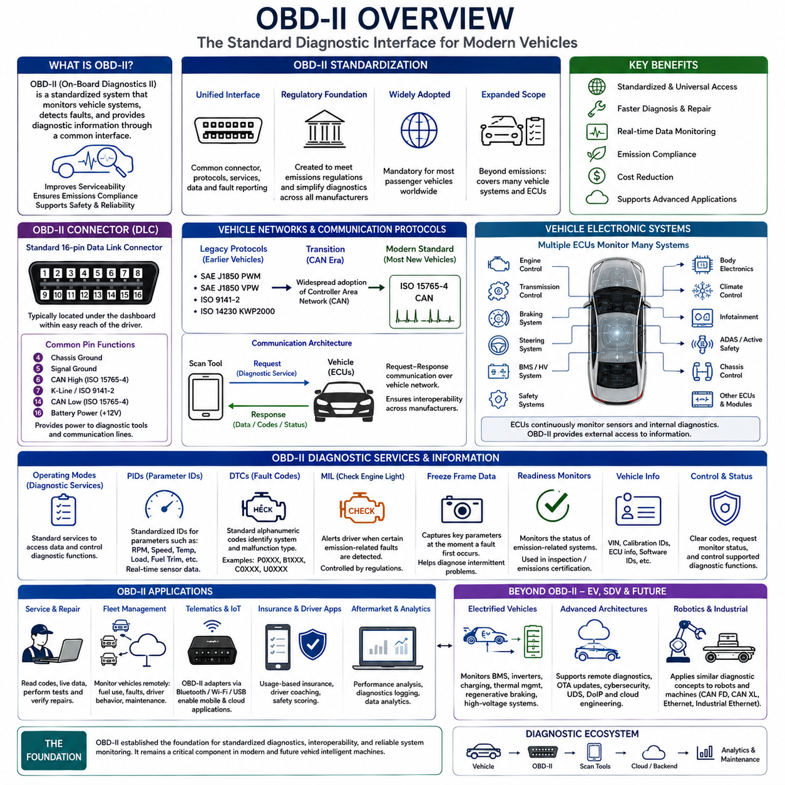
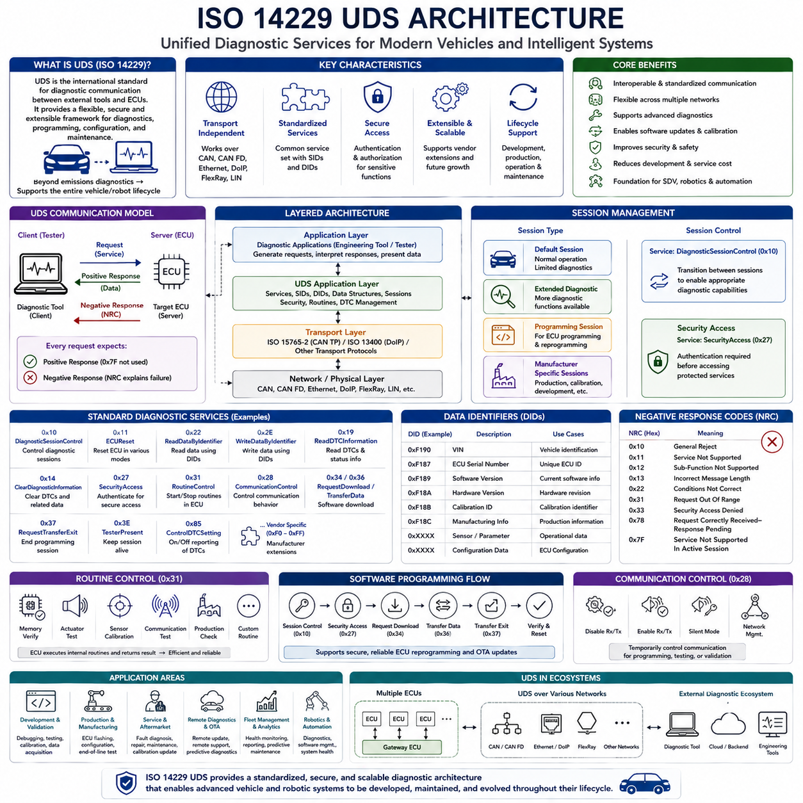
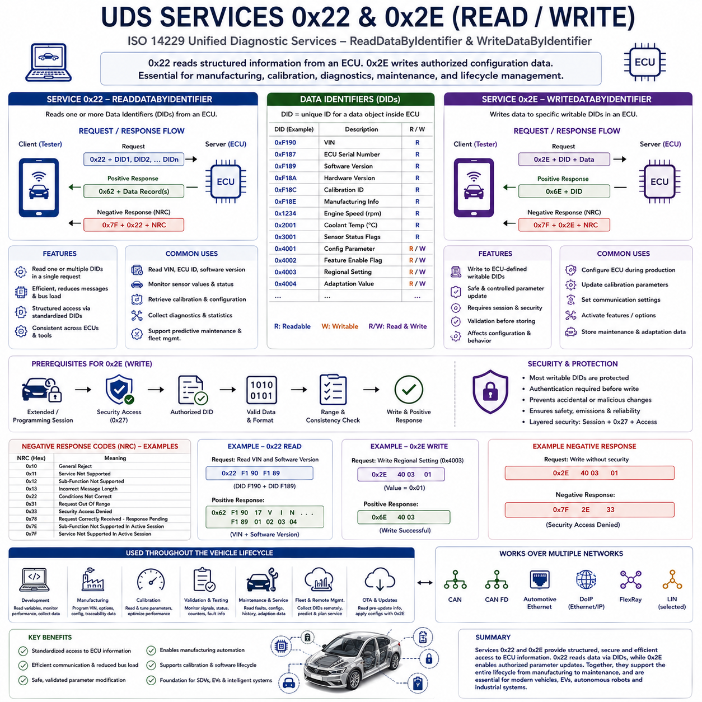
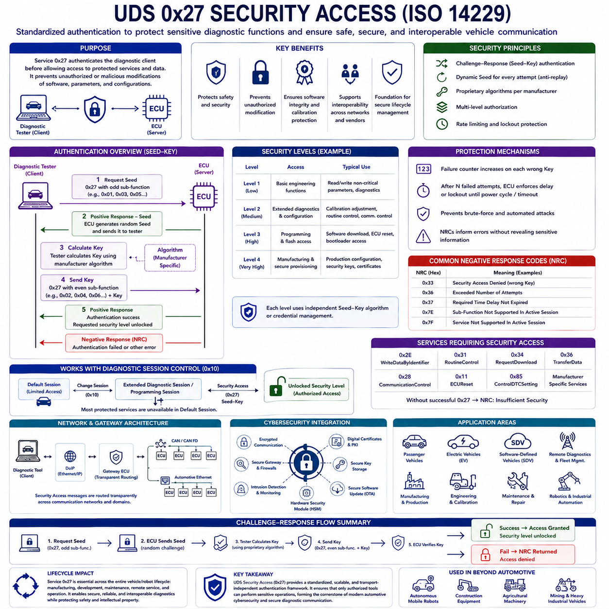
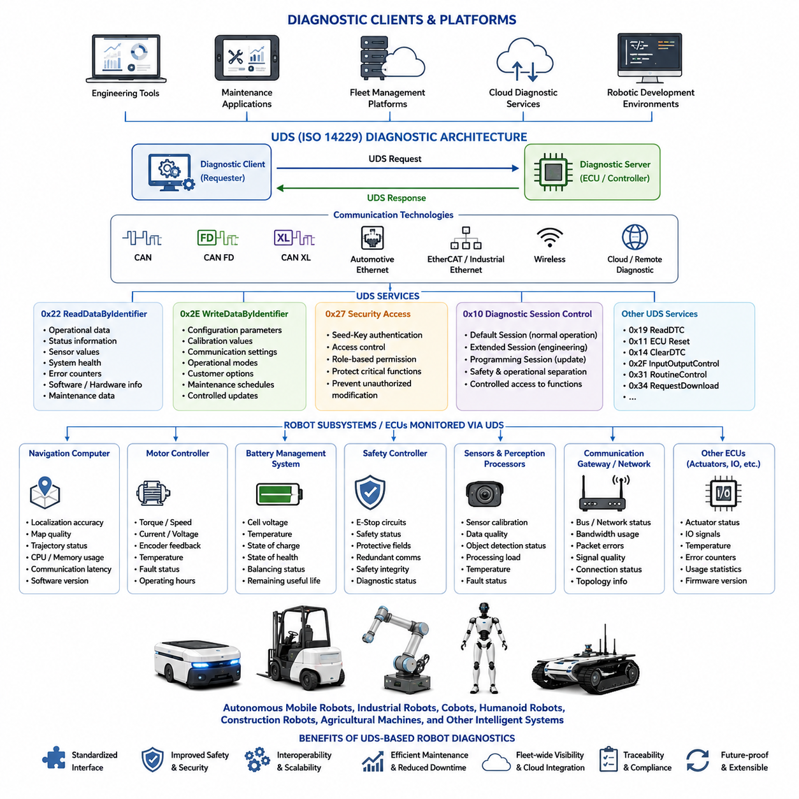

**Volume 06 Automotive Communication**

# Chapter 6. Diagnostics and UDS

## 6.1 OBD II Overview

{width="7.268055555555556in" height="7.268055555555556in"}

차량용 온보드 진단 II(On-Board Diagnostics II, OBD-II)는 현대 자동차에서 전자 시스템의 상태, 성능, 그리고 배출가스(Emissions) 관련 기능을 지속적으로 감시하기 위해 사용되는 표준화된 진단 아키텍처(Diagnostic Architecture)이다. OBD-II는 차량의 정비성과 환경 규제 준수를 향상시키기 위해 도입되었으며, 진단 장비(Diagnostic Tool)가 전자제어장치(Electronic Control Unit, ECU)와 공통된 방식으로 통신할 수 있는 표준 인터페이스(Interface)를 제공한다. 제조사마다 서로 다른 진단 커넥터(Connector)와 독자적인 통신 방식을 사용하던 기존 시스템과 달리, OBD-II는 표준 커넥터, 통신 프로토콜(Communication Protocol), 진단 서비스(Diagnostic Service), 그리고 고장 보고(Fault Reporting) 방식을 통일하였다. 오늘날 OBD-II는 자동차 산업 전반에서 차량 진단, 유지보수, 정기 검사, 그리고 플릿 상태 관리(Fleet Health Monitoring)의 기본 기반 기술로 활용되고 있다.

OBD-II가 개발된 가장 큰 배경은 점점 강화되는 환경 규제(Environmental Regulation)였다. 초기 차량의 진단 시스템은 제조사마다 구조와 방식이 크게 달라 정비가 복잡하고 비용도 높았다. 이에 따라 규제 기관(Regulatory Authority)은 제조사와 관계없이 배출가스 관련 고장을 지속적으로 감시할 수 있는 공통 진단 체계의 필요성을 인식하였다. OBD-II는 진단 커넥터(Data Link Connector, DLC), 통신 프로토콜, 진단 고장 코드(Diagnostic Trouble Code, DTC), 파라미터(Parameter) 식별 방법, 그리고 고장 표시등(Malfunction Indicator Lamp, MIL)의 동작 방식을 표준화하였다. 비록 법적 목적은 배출가스 관리였지만, 현재 OBD-II는 훨씬 광범위한 차량 진단 기능을 제공하는 핵심 기술로 발전하였다.

현대 자동차는 엔진 제어(Engine Management), 변속기 제어(Transmission Control), 제동 시스템(Braking System), 조향 시스템(Steering System), 배터리 관리 시스템(Battery Management System, BMS), 차체 전장(Body Electronics), 안전 시스템(Safety System), 공조 시스템(Climate Control), 인포테인먼트(Infotainment) 등을 담당하는 다수의 ECU를 포함하고 있다. 이러한 ECU는 수백에서 수천 개의 센서 정보를 지속적으로 감시하고 내부 소프트웨어 진단을 수행한다. OBD-II는 외부 진단 장비가 이러한 ECU에 접근하여 운용 데이터(Operational Data)를 읽고, 고장 정보를 확인하며, 시스템 상태를 검사하고, 표준화된 진단 절차를 수행할 수 있도록 지원한다.

표준화된 16핀 데이터 링크 커넥터(Data Link Connector, DLC)는 OBD-II를 대표하는 가장 중요한 요소 가운데 하나이다. 이 커넥터는 일반적으로 운전석 하부 대시보드(Dashboard) 근처에 설치되어 정비 시 진단 장비를 쉽게 연결할 수 있도록 설계되어 있다. 커넥터는 진단 장비에 전원을 공급하는 동시에 하나 이상의 차량 네트워크 통신선을 제공한다. 커넥터의 위치와 핀 배열(Pin Assignment)이 표준화되어 있기 때문에 범용 진단 장비(Universal Scan Tool)는 제조사에 관계없이 동일한 인터페이스를 사용할 수 있다.

물리적인 커넥터는 동일하지만 OBD-II는 역사적으로 다양한 통신 프로토콜을 지원해 왔다. 초기에는 SAE J1850 PWM, SAE J1850 VPW, ISO 9141-2, ISO 14230 Keyword Protocol 2000(KWP2000) 등이 사용되었다. 이후 Controller Area Network(CAN)가 자동차 산업의 표준 통신 기술로 자리 잡으면서 ISO 15765-4 CAN이 대부분의 신형 차량에서 필수 프로토콜이 되었다. 이러한 변화는 통신 속도, 신뢰성(Reliability), 상호운용성(Interoperability), 그리고 진단 성능을 크게 향상시키는 동시에 진단 장비 설계를 단순화하였다.

진단 장비와 ECU 간의 통신은 요청-응답(Request-Response) 구조를 기반으로 한다. 스캔 툴(Scan Tool)은 차량 네트워크를 통해 표준화된 진단 요청을 전송하고, 해당 ECU는 지원 가능한 경우 요청된 정보를 응답으로 반환한다. 이러한 구조는 전문 엔지니어링 장비부터 저가의 소비자용 스캐너까지 다양한 진단 장비가 동일한 방식으로 차량 정보를 획득할 수 있도록 한다. 통신 절차는 제조사 간의 상호운용성을 보장하면서도 제조사별 확장 기능(Proprietary Extension)을 추가할 수 있도록 설계되어 있다.

OBD-II는 진단 기능을 표준화된 운용 모드(Operating Mode) 또는 진단 서비스(Diagnostic Service)로 구성한다. 이러한 서비스는 현재 센서 데이터(Current Sensor Data), 저장된 고장 코드(Stored Fault Code), 프리즈 프레임 데이터(Freeze Frame Data), 산소 센서(Oxygen Sensor) 성능, 배출가스 준비 상태(Readiness Monitor), 차량 식별 정보(Vehicle Identification Information), 그리고 DTC 관리 기능 등을 제공한다. 이러한 표준 서비스는 제조사가 달라도 동일한 방식으로 진단 소프트웨어를 사용할 수 있도록 지원하며, 필요에 따라 제조사 고유 기능도 추가할 수 있다.

파라미터 ID(Parameter ID, PID)는 차량 운용 데이터를 표준 방식으로 제공하기 위한 핵심 개념이다. 각각의 PID는 엔진 회전수(Engine Speed), 냉각수 온도(Coolant Temperature), 흡입 공기 온도(Intake Air Temperature), 차량 속도(Vehicle Speed), 연료 시스템 상태(Fuel System Status), 스로틀 위치(Throttle Position), 흡기 매니폴드 압력(Manifold Pressure), 계산된 엔진 부하(Calculated Engine Load), 산소 센서 출력(Oxygen Sensor Output), 연료 보정(Fuel Trim)과 같은 특정 운용 변수를 나타낸다. 진단 소프트웨어는 ECU가 반환한 원시 데이터(Raw Data)를 표준 변환식을 이용하여 사람이 이해할 수 있는 값으로 변환한다.

진단 고장 코드(Diagnostic Trouble Code, DTC)는 OBD-II의 또 다른 핵심 요소이다. ECU는 사전에 정의된 조건에 따라 이상 상태를 감지하면 해당 고장을 식별하는 표준 코드(Standardized Code)를 저장한다. 코드 구조는 문제가 동력계(Powertrain), 차체(Body), 섀시(Chassis), 또는 네트워크 통신(Network Communication) 가운데 어느 영역에 속하는지를 쉽게 식별할 수 있도록 설계되어 있다. 이러한 표준화된 DTC 체계는 정비 과정의 일관성을 높이고 문제 분석을 더욱 효율적으로 수행할 수 있도록 지원한다.

고장 표시등(Malfunction Indicator Lamp, MIL)은 일반적으로 체크 엔진(Check Engine) 경고등으로 알려져 있으며, 특정 배출가스 관련 이상이 발생하면 운전자에게 즉시 알려주는 역할을 수행한다. 모든 고장이 즉시 MIL을 점등시키는 것은 아니며, 규정에 따라 일부 고장은 반복적으로 발생한 경우에만 경고등이 점등된다. 이러한 방식은 불필요한 경고를 줄이는 동시에 실제로 중요한 문제는 적절한 시점에 운전자에게 전달할 수 있도록 설계되어 있다.

프리즈 프레임 데이터(Freeze Frame Data)는 고장이 처음 발생한 순간의 차량 운용 상태를 함께 저장하여 진단 정확도를 높여준다. ECU는 단순히 DTC만 저장하는 것이 아니라 엔진 회전수, 차량 속도, 엔진 부하, 냉각수 온도, 연료 보정 값, 스로틀 위치 등 다양한 운용 데이터를 함께 기록한다. 이러한 정보는 간헐적으로 발생하는 문제를 재현하거나 고장이 발생한 당시의 운행 환경을 이해하는 데 매우 중요한 역할을 수행한다.

준비 상태 모니터(Readiness Monitor)는 배출가스 관련 시스템의 자체 진단(Self-Diagnosis)이 완료되었는지를 나타낸다. 촉매 변환기(Catalytic Converter), 산소 센서, 증발가스 제어 시스템(Evaporative Emission Control System), 배기가스 재순환 시스템(Exhaust Gas Recirculation, EGR), 2차 공기 공급 시스템(Secondary Air Injection), 실화 감지(Misfire Detection), 연료 시스템(Fuel System) 등은 모두 자체적인 진단 절차를 수행한다. 차량 검사 프로그램은 이러한 모니터가 정상적으로 완료되었는지를 확인하여 실제 운행 조건에서 모든 진단 기능이 수행되었는지를 판단한다.

OBD-II는 현대 자동차 유지보수에서 매우 중요한 역할을 수행한다. 정비사는 차량이 실제 운행되는 상태에서 센서 출력(Sensor Output), 액추에이터 명령(Actuator Command), 연료 시스템 상태, 점화 시기(Ignition Timing), 배터리 전압(Battery Voltage), 공기 유량(Airflow) 등 다양한 데이터를 실시간으로 확인할 수 있다. 이러한 실시간 데이터는 정지 상태에서는 발견하기 어려운 간헐적인 문제를 진단하는 데 매우 효과적이며, 이상 징후를 조기에 발견하여 예방 정비(Preventive Maintenance)에도 활용된다.

전문 진단 시스템은 표준 OBD-II 기능을 넘어 제조사 고유의 진단 기능도 함께 지원한다. 표준 OBD-II는 주로 배출가스 관련 기능을 담당하지만, 전문 장비는 차체 전장, 에어백(Airbag), 변속기 적응 제어(Transmission Adaptation), 첨단 운전자 지원 시스템(ADAS), 서스펜션 제어(Suspension Control), 배터리 관리 시스템(BMS), 그리고 소프트웨어 프로그래밍(Software Programming)까지 접근할 수 있다. 그럼에도 불구하고 OBD-II는 대부분의 차량에서 모든 진단 절차가 시작되는 공통 인터페이스 역할을 수행한다.

저렴한 OBD-II 어댑터(Adapter)의 보급은 새로운 자동차 서비스 시장을 만들어냈다. Bluetooth, Wi-Fi, USB 기반 진단 인터페이스를 이용하면 스마트폰(Smartphone), 태블릿(Tablet), 노트북(Laptop), 클라우드 기반 플릿 관리 시스템이 차량 데이터를 실시간으로 수집할 수 있다. 이를 통해 연료 소비(Fuel Consumption), 엔진 사용률(Engine Utilization), 유지보수 일정(Maintenance Interval), 고장 코드(DTC), 운전자 운전 습관(Driver Behavior), 차량 상태(Vehicle Health)를 원격으로 관리할 수 있으며, 보험 텔레매틱스(Insurance Telematics), 운전자 코칭(Driver Coaching), 예지 정비, 성능 분석(Performance Analysis)에도 널리 활용되고 있다.

전기차(Electric Vehicle) 역시 OBD 기반 진단 개념을 그대로 활용하면서 감시 대상 시스템을 더욱 확대하고 있다. 하이브리드(Hybrid) 및 순수 전기차(Battery Electric Vehicle, BEV)는 배터리 관리 시스템(BMS), 고전압 인버터(High-Voltage Inverter), 전기 구동 장치(Electric Drive Unit), 충전 시스템(Charging System), 열관리 시스템(Thermal Management System), 회생 제동(Regenerative Braking), 전력 분배 시스템(Power Distribution System)에 대한 진단 기능을 필요로 한다. 기본 원리는 동일하지만 앞으로는 배터리 상태(State of Health), 충전 성능(Charging Performance), 고전압 시스템의 운용 상태까지 포함하는 더욱 다양한 진단 기능이 요구될 것이다.

소프트웨어 정의 차량(Software-Defined Vehicle, SDV)의 발전은 차량 진단의 역할도 크게 확대하고 있다. 미래 차량은 원격 진단(Remote Diagnostics), OTA(Over-the-Air) 소프트웨어 업데이트, 사이버 보안(Cybersecurity) 감시, 예지 정비, 소프트웨어 버전 관리(Software Version Management), 디지털 인증서(Digital Certificate) 검증, 클라우드 기반 엔지니어링 분석 등을 수행해야 한다. 기존 OBD-II는 여전히 로컬(Local) 진단 인터페이스로서 중요한 역할을 담당하지만, Unified Diagnostic Services(UDS), Diagnostics over Internet Protocol(DoIP)과 같은 새로운 진단 프로토콜이 더욱 복잡한 전자 아키텍처를 지원하게 된다. 따라서 OBD-II는 독립적인 기술이라기보다 미래 진단 생태계(Diagnostic Ecosystem)의 중요한 구성 요소로 계속 활용될 것이다.

자율이동로봇(Autonomous Mobile Robot, AMR)과 지능형 산업용 기계(Intelligent Industrial Machine) 역시 자동차와 유사한 진단 개념을 점차 채택하고 있다. 분산 제어기(Distributed Controller), 배터리 시스템(Battery System), 모터 드라이브(Motor Drive), 인지 센서(Perception Sensor), 자율주행 컴퓨터(Navigation Computer), 안전 제어기(Safety Controller), 통신 게이트웨이(Communication Gateway)는 모두 표준화된 고장 보고(Fault Reporting), 상태 모니터링(Health Monitoring), 파라미터 접근(Parameter Access), 예지 정비 기능을 필요로 한다. 미래 로봇 진단 시스템은 CAN FD, CAN XL, Automotive Ethernet, 산업용 Ethernet을 사용할 수 있지만, 표준화된 고장 식별(Standardized Fault Identification), 구조화된 운용 데이터(Structured Operational Data), 이력 관리(Historical Event Recording), 체계적인 상태 평가(Systematic Health Evaluation)와 같은 OBD-II의 기본 철학을 그대로 계승할 가능성이 높다.

OBD-II의 장기적인 의미는 단순히 배출가스 규제를 만족시키는 수준을 넘어선다. OBD-II는 자동차 산업 전반에 걸쳐 표준화된 전자 진단(Electronic Diagnostics), 상호운용 가능한 정비 장비(Interoperable Service Equipment), 체계적인 고장 보고(Structured Fault Reporting), 그리고 범용 통신 인터페이스(Universal Communication Interface)의 기반을 마련하였다. 차량이 중앙 집중형 컴퓨팅(Centralized Computing), 소프트웨어 정의 기능, 클라우드 연결성(Cloud Connectivity), 자율주행으로 계속 발전하더라도 OBD-II는 유지보수, 진단, 플릿 운영(Fleet Operation), 엔지니어링 분석, 그리고 전체 제품 생명주기 관리(Lifecycle Management)를 지원하는 핵심 기술로 남게 될 것이다. 또한 OBD-II의 기본 원리는 미래의 지능형 자동차, 자율 로봇, 그리고 다양한 사이버 물리 시스템(Cyber-Physical System)의 진단 기술 설계에도 지속적으로 영향을 미칠 것으로 예상된다.

## 6.2 ISO 14229 UDS Architecture

{width="7.268055555555556in" height="7.268055555555556in"}

통합 진단 서비스(Unified Diagnostic Services, UDS)는 ISO 14229로 표준화된 현대 자동차 전자 시스템의 대표적인 진단 통신 아키텍처(Diagnostic Communication Architecture)이다. UDS는 외부 진단 장비(Diagnostic Equipment)가 차량 내 전자제어장치(Electronic Control Unit, ECU)와 통신할 수 있도록 포괄적인 진단 서비스(Diagnostic Service)를 정의한다. 기존의 진단 방식이 주로 배출가스 관련 정보에 초점을 맞추었다면, UDS는 고장 진단(Fault Diagnosis), 소프트웨어 프로그래밍(Software Programming), 캘리브레이션(Calibration), 설정 관리(Configuration Management), 보안 접근(Security Access), 루틴 실행(Routine Execution), 데이터 획득(Data Acquisition), 그리고 시스템 유지보수(System Maintenance)를 지원하는 유연한 구조를 제공한다. 이러한 아키텍처는 현대의 소프트웨어 정의 차량(Software-Defined Vehicle, SDV)의 핵심 요소가 되었으며, 지능형 로봇과 산업용 시스템의 진단 플랫폼으로도 점차 활용되고 있다.

ISO 14229는 하위 통신 매체(Communication Medium)와 독립적으로 동작하는 통합 진단 아키텍처를 제공하기 위해 개발되었다. 특정 물리 계층(Physical Layer)에 제한되지 않으며 Controller Area Network(CAN), CAN FD, Automotive Ethernet, FlexRay, 일부 LIN, 그리고 Diagnostics over Internet Protocol(DoIP) 위에서 모두 동작할 수 있다. 진단 서비스와 전송 계층(Transport Layer)을 분리함으로써 새로운 통신 기술이 도입되더라도 진단 소프트웨어를 다시 설계할 필요가 없다. 차량 네트워크가 발전하더라도 애플리케이션 계층(Application Layer)은 그대로 유지되고, 전송 계층만 변경하면 되는 구조이다.

UDS 아키텍처는 계층형 통신 모델(Layered Communication Model)을 기반으로 구성된다. 최상위에는 엔지니어링 도구(Engineering Tool)나 서비스 장비(Service Equipment)에서 동작하는 진단 애플리케이션이 위치하며, 진단 요청(Diagnostic Request)을 생성한다. 이 요청은 통신 미들웨어(Communication Middleware)와 전송 프로토콜을 거쳐 대상 ECU로 전달된다. ECU는 요청을 해석하고 필요한 작업을 수행한 후 요청된 데이터 또는 적절한 응답(Response)을 반환한다. 이러한 계층 구조는 모듈화(Modularity), 이식성(Portability), 상호운용성(Interoperability), 그리고 장기적인 유지보수성을 크게 향상시킨다.

UDS의 통신 구조는 클라이언트-서버(Client-Server) 모델을 따른다. 진단 장비는 클라이언트(Client)의 역할을 수행하며, 각각의 ECU는 진단 서버(Diagnostic Server)의 역할을 담당한다. 모든 통신은 클라이언트가 특정 ECU로 진단 요청을 전송하면서 시작된다. 서버는 요청을 검증하고, 접근 권한을 확인하며, 요청된 서비스를 수행한 후 정상적으로 완료된 경우에는 긍정 응답(Positive Response)을, 수행할 수 없는 경우에는 원인을 포함한 부정 응답(Negative Response)을 반환한다. 이러한 결정적인 요청-응답 구조는 여러 ECU가 존재하는 차량에서도 통신 관리를 단순하게 유지할 수 있도록 한다.

진단 세션(Diagnostic Session)은 UDS 아키텍처의 핵심 개념 가운데 하나이다. 모든 진단 기능을 항상 사용할 수 있도록 허용하는 것이 아니라 ECU의 동작을 여러 개의 운영 세션(Operating Session)으로 구분한다. 기본 세션(Default Session)은 정상 차량 운행을 지원하면서 제한된 진단 기능만 허용한다. 확장 진단 세션(Extended Diagnostic Session)은 보다 많은 엔지니어링 기능을 제공하며, 프로그래밍 세션(Programming Session)은 ECU 재프로그램(Reprogramming)과 소프트웨어 다운로드를 지원한다. 또한 제조사는 생산, 개발, 캘리브레이션 등을 위한 전용 세션을 추가로 정의할 수도 있다. 이러한 세션 제어(Session Control)는 안전성과 보안을 동시에 향상시킨다.

서비스 식별자(Service Identifier, SID)는 UDS에서 제공하는 모든 진단 서비스를 고유하게 정의한다. 각각의 서비스는 데이터 읽기(Read Data), 파라미터 쓰기(Write Parameter), 루틴 제어(Routine Control), 고장 메모리 삭제(Clear Fault Memory), 진단 고장 코드(Diagnostic Trouble Code, DTC) 조회, 소프트웨어 프로그래밍, 통신 관리 등 특정 진단 기능을 수행한다. 표준화된 SID는 제조사가 달라도 동일한 의미를 가지므로 진단 소프트웨어의 개발과 상호운용성을 크게 향상시키며, 필요에 따라 제조사 고유 기능도 추가할 수 있도록 지원한다.

UDS 아키텍처는 애플리케이션 데이터(Application Data)와 통신 관리(Communication Management)를 명확하게 구분한다. 애플리케이션 서비스는 센서 값(Sensor Value), 설정 파라미터(Configuration Parameter), 캘리브레이션 데이터(Calibration Data), 식별 정보(Identification Information), 소프트웨어 메타데이터(Software Metadata)를 제공한다. 반면 통신 관리 서비스는 세션 설정(Session Establishment), 사용자 인증(Authentication), 타이밍 관리(Timing Management), 통신 상태(State Management), 메시지 순서(Message Sequencing)를 담당한다. 이러한 분리는 소프트웨어 재사용성을 높이고 다양한 차량 플랫폼에서 동일한 진단 구조를 사용할 수 있도록 한다.

데이터 식별자(Data Identifier, DID)는 ECU 내부 정보를 표준 방식으로 접근하기 위한 중요한 구조이다. 하나의 DID는 차량 식별 번호(Vehicle Identification Number, VIN), ECU 일련번호(Serial Number), 소프트웨어 버전(Software Version), 하드웨어 개정 정보(Hardware Revision), 캘리브레이션 식별자(Calibration Identifier), 생산 정보(Manufacturing Information), 설정 데이터(Configuration Data), 운용 통계(Operational Statistics), 센서 측정값(Sensor Measurement) 등 하나의 특정 정보를 나타낸다. 진단 장비는 원하는 DID를 요청하고 ECU는 표준 형식에 따라 해당 정보를 반환한다. 이러한 구조는 생산, 정비, 개발, 유지보수, 제품 생명주기 관리(Lifecycle Management)를 크게 단순화한다.

UDS는 높은 통신 신뢰성을 위해 강력한 응답 처리(Response Handling) 기능을 제공한다. 모든 요청은 반드시 정상 수행을 의미하는 긍정 응답 또는 실패 원인을 설명하는 부정 응답을 반환한다. 부정 응답은 지원하지 않는 서비스(Unsupported Service), 잘못된 파라미터(Invalid Parameter), 부족한 접근 권한(Insufficient Security Privilege), 잘못된 세션 상태(Incorrect Session State), ECU 처리 중(Busy Processing), 통신 타이밍 위반(Timing Violation) 등 다양한 원인을 나타낼 수 있다. 표준화된 응답 코드는 진단 장비가 문제를 일관성 있게 해석하도록 지원한다.

타이밍 관리(Timing Management)는 ISO 14229에서 매우 중요한 요소이다. 일부 진단 작업은 일반 제어 메시지보다 훨씬 긴 시간이 필요하다. 소프트웨어 다운로드, 메모리 검증(Memory Verification), 플래시 메모리 삭제(Flash Erase), 캘리브레이션 업데이트, 루틴 실행은 수백 밀리초(Millisecond)에서 수 초(Second)가 소요될 수 있다. UDS는 이러한 작업이 진행되는 동안 ECU가 계속 처리 중임을 알릴 수 있는 절차를 정의하여 불필요한 통신 타임아웃(Timeout)을 방지한다. 이러한 구조는 복잡한 진단 작업의 신뢰성을 크게 향상시킨다.

현대 UDS에서는 보안(Security)이 매우 중요한 요소이다. 파라미터 변경(Parameter Modification), 소프트웨어 프로그래밍, 보안 설정(Security Configuration), 액추에이터 제어(Actuator Control)는 허가되지 않은 사용자가 접근할 경우 심각한 안전 문제를 초래할 수 있다. 따라서 이러한 서비스는 보안 접근(Security Access) 절차를 통해 보호된다. 진단 장비는 먼저 인증(Authentication)을 완료해야만 권한이 필요한 서비스를 사용할 수 있다. 인증 알고리즘은 제조사마다 다르지만 ISO 14229는 이러한 보안 구조를 일관성 있게 구현할 수 있는 공통 프레임워크(Framework)를 제공한다.

루틴 제어 서비스(Routine Control Service)는 ECU 내부에서 미리 정의된 작업을 실행하기 위한 표준 메커니즘이다. 진단 장비가 알고리즘 자체를 실행하는 것이 아니라 ECU 내부에서 메모리 검증(Memory Verification), 액추에이터 기능 시험(Actuator Functional Test), 센서 캘리브레이션(Sensor Calibration), 통신 자체 시험(Self-Test), 체크섬 검증(Checksum Validation), 생산 검사(Production Verification), 품질 검사(Quality Inspection) 등을 수행하고 결과만 반환한다. 이러한 구조는 통신량을 줄이고 소프트웨어의 일관성을 유지하는 데 매우 효과적이다.

통신 제어 서비스(Communication Control Service)는 개발과 생산 과정에서 네트워크의 동작을 일시적으로 변경할 수 있도록 지원한다. 일부 진단 작업은 일반 네트워크 트래픽을 중지하거나 특정 통신만 허용해야 하는 경우가 있다. UDS는 이러한 통신 상태를 표준 방식으로 제어하며, 작업이 완료되면 ECU는 자동으로 정상 통신 상태로 복귀한다. 이를 통해 소프트웨어 다운로드와 시스템 검증을 더욱 안정적으로 수행할 수 있다.

소프트웨어 프로그래밍(Software Programming)은 UDS가 제공하는 가장 중요한 기능 가운데 하나이다. 현대 차량은 기능 개선(Function Improvement), 소프트웨어 오류 수정(Bug Fix), 사이버 보안 강화(Cybersecurity Enhancement), 새로운 기능 추가를 위해 지속적으로 펌웨어(Firmware)를 업데이트해야 한다. UDS는 메모리 준비(Memory Preparation), 안전한 데이터 전송(Secure Data Transfer), 블록 검증(Block Verification), 무결성 검사(Integrity Check), 프로그래밍 완료, 프로그래밍 후 검증(Post-Programming Validation)을 위한 표준 서비스를 제공한다. 이러한 기능은 정비소뿐 아니라 OTA 업데이트의 핵심 기반이 된다.

진단 고장 코드(DTC) 관리 역시 UDS와 긴밀하게 통합되어 있다. ECU는 하드웨어(Hardware), 소프트웨어 실행 상태, 센서 유효성(Sensor Validity), 통신 무결성(Communication Integrity), 시스템 동작(System Behavior)을 지속적으로 감시한다. 이상 조건이 정의된 기준을 만족하면 DTC와 함께 상태 정보(Status Information)를 저장한다. UDS는 저장된 고장 조회(Read Fault), 수리 후 메모리 삭제(Clear Memory), 상세 상태 조회(Status Record), 고장 변화 추적(Fault Evolution Monitoring)을 위한 서비스를 제공한다.

UDS는 일반 정비를 넘어 엔지니어링 데이터 획득(Engineering Data Acquisition)도 지원한다. 개발자는 ECU 내부 변수(Internal Variable), 캘리브레이션 값, 실행 카운터(Execution Counter), 소프트웨어 상태, 통신 통계(Communication Statistics), 온도 정보(Thermal Condition), 성능 지표(Performance Indicator)를 확인해야 한다. UDS는 생산용 진단 장비와 호환성을 유지하면서도 이러한 엔지니어링 데이터를 표준 방식으로 제공한다. 따라서 동일한 진단 구조를 생산, 개발, 검증, 유지보수 전반에서 사용할 수 있다.

게이트웨이 ECU(Gateway ECU)는 차량 전자 아키텍처가 복잡해질수록 더욱 중요한 역할을 수행한다. 현대 차량은 여러 개의 통신 도메인(Communication Domain)이 지능형 게이트웨이로 연결되어 있다. UDS는 이러한 구조를 지원하기 위해 진단 요청을 서로 다른 네트워크 사이로 투명하게 라우팅(Routing)할 수 있도록 설계되었다. 대상 ECU가 CAN, CAN FD, Automotive Ethernet 등 어느 네트워크에 존재하더라도 동일한 진단 서비스 정의를 사용할 수 있으므로 진단 장비의 구현이 크게 단순화된다.

중앙 집중형 컴퓨팅(Centralized Computing)과 소프트웨어 정의 차량(SDV)의 발전은 ISO 14229의 중요성을 더욱 높이고 있다. 미래 차량에서는 단순한 분산 ECU뿐 아니라 수많은 가상 소프트웨어 기능(Virtual Software Function)을 관리하는 고성능 컴퓨팅 플랫폼(High-Performance Computing Platform)과도 통신해야 한다. UDS는 기존 진단 서비스를 그대로 유지하면서 사이버 보안 프레임워크(Cybersecurity Framework), 클라우드 연결(Cloud Connectivity), 디지털 인증서(Digital Certificate), 원격 유지보수(Remote Maintenance), 예지 진단(Predictive Diagnostics), 소프트웨어 생명주기 관리와 통합되고 있다. 즉 차량 아키텍처가 발전하더라도 애플리케이션 계층은 그대로 유지된다.

로보틱스(Robotics)와 지능형 산업 자동화(Intelligent Industrial Automation) 역시 UDS가 제시한 구조를 적극적으로 활용할 수 있다. 자율이동로봇(AMR), 휴머노이드(Humanoid), 사족보행 로봇(Quadruped), 산업용 매니퓰레이터(Industrial Manipulator), 농업 기계, 건설 장비, 자율 광산 차량은 모두 분산 제어기(Distributed Controller), 소프트웨어 관리, 설정 서비스(Configuration Service), 예지 정비(Predictive Maintenance)를 위한 표준 진단 구조가 필요하다. CAN FD, CAN XL, Automotive Ethernet, EtherCAT, 산업용 Ethernet을 사용하더라도 ISO 14229의 클라이언트-서버 구조(Client-Server Architecture), 세션 관리(Session Management), 보안 구조(Security Architecture), 표준 서비스(Standardized Service), 구조화된 진단 통신(Structured Diagnostic Communication)은 미래 로봇 진단 시스템 설계의 중요한 기준이 될 수 있다.

ISO 14229의 장기적인 의미는 자동차 진단 기술을 넘어선다. ISO 14229는 전송 계층과 독립적인(Transport-Independent) 확장 가능하고(Scalable) 모듈화된(Modular) 진단 아키텍처를 제공한다. 애플리케이션 서비스(Application Service)와 통신 전송을 분리하고, 기능을 표준 서비스로 구성하며, 보안 접근을 통해 중요한 기능을 보호하고, 소프트웨어 생명주기 관리(Software Lifecycle Management)를 지원하는 구조는 미래의 커넥티드 차량(Connected Vehicle), 자율 로봇(Autonomous Robot), 산업 자동화 시스템(Industrial Automation System), 그리고 소프트웨어 정의 기계(Software-Defined Machine)의 핵심 기반이 된다. 임베디드 시스템(Embedded System)의 복잡성이 계속 증가할수록 ISO 14229가 제시한 아키텍처 원칙은 신뢰성 있는 진단(Reliable Diagnostics), 유지보수성(Maintainability), 상호운용성(Interoperability), 그리고 안전한 제품 생명주기 관리(Secure Lifecycle Management)를 위한 필수 기술로 계속 활용될 것이다.

## 6.3 UDS Service 0x22 0x2E ReadWrite

{width="7.268055555555556in" height="7.268055555555556in"}

ISO 14229에서 정의하는 통합 진단 서비스(Unified Diagnostic Services, UDS)는 외부 진단 장비가 전자제어장치(Electronic Control Unit, ECU)와 통신할 수 있도록 다양한 표준 진단 서비스를 제공한다. 그중 서비스(Service) 0x22(ReadDataByIdentifier)와 서비스 0x2E(WriteDataByIdentifier)는 ECU 내부의 구조화된 진단 정보를 직접 읽고 수정할 수 있는 가장 자주 사용되는 기능이다. 두 서비스는 제조, 캘리브레이션(Calibration), 유지보수(Maintenance), 소프트웨어 검증(Software Validation), 엔지니어링 개발(Engineering Development), 그리고 현장 진단(Field Diagnostics)을 포함한 전체 차량 생명주기(Lifecycle)에서 파라미터(Parameter)의 조회와 변경을 위한 핵심 기반을 제공한다. 표준화된 동작 방식 덕분에 다양한 제조사의 진단 장비가 ISO 14229를 지원하는 ECU와 일관성 있게 통신할 수 있으며, 데이터 식별자(Data Identifier, DID)를 통해 제조사별 고유 기능도 유연하게 지원할 수 있다.

서비스 0x22는 공식적으로 ReadDataByIdentifier라고 하며, ECU 내부에 저장된 특정 정보를 읽기 위한 기능을 제공한다. 진단 장비는 임의의 메모리 주소를 직접 읽는 것이 아니라 ECU가 정의한 데이터 식별자(DID)를 요청한다. 각각의 DID는 차량 식별 번호(Vehicle Identification Number, VIN), ECU 일련번호(Serial Number), 소프트웨어 버전(Software Version), 캘리브레이션 식별자(Calibration Identifier), 하드웨어 버전(Hardware Revision), 생산 정보(Manufacturing Information), 센서 값(Sensor Value), 설정 파라미터(Configuration Parameter), 운용 통계(Operational Statistic) 등 특정한 정보 객체를 의미한다. 이러한 추상화 계층(Abstraction Layer)은 ECU의 내부 메모리 구조를 외부에 노출하지 않으면서도 일관된 정보 접근을 가능하게 한다.

서비스 0x22의 구조는 표준적인 UDS 클라이언트-서버(Client-Server) 통신 모델을 따른다. 진단 장비는 서비스 식별자(Service Identifier, SID) 0x22와 하나 이상의 데이터 식별자를 포함한 요청(Request)을 생성한다. ECU는 요청을 검증한 후 내부 데이터 구조에서 해당 정보를 검색하여 긍정 응답(Positive Response)으로 반환한다. 만약 요청된 DID가 지원되지 않거나, 사용할 수 없거나, 보호되어 있거나, 일시적으로 접근할 수 없는 경우에는 ECU가 표준 부정 응답 코드(Negative Response Code, NRC)를 반환하여 거부 사유를 알려준다. 이러한 결정적인 요청-응답 구조는 다양한 차량 플랫폼에서도 예측 가능한 진단 통신을 가능하게 한다.

서비스 0x22의 중요한 특징 가운데 하나는 하나의 요청에서 여러 개의 데이터 식별자를 동시에 읽을 수 있다는 점이다. ECU가 이를 지원하는 경우, 진단 장비는 여러 DID를 한 번에 요청할 수 있으므로 각각을 개별적으로 읽는 것보다 통신 횟수를 크게 줄일 수 있다. 이러한 방식은 통신 오버헤드(Communication Overhead)를 줄이고, 진단 효율을 향상시키며, 버스(Bus) 사용량을 감소시키고, 유지보수 시간을 단축하는 데 매우 효과적이다. 특히 수많은 ECU와 방대한 진단 정보를 포함하는 현대 차량에서는 이러한 기능의 중요성이 더욱 커지고 있다.

데이터 식별자(Data Identifier, DID)는 ECU 내부 정보를 체계적으로 관리하기 위한 핵심 구조이다. ECU 내부 메모리 주소를 직접 사용하는 대신 모든 진단 정보에는 고유한 DID가 부여된다. 국제 표준(Standard) DID는 차량 식별 정보나 소프트웨어 버전과 같은 공통 정보를 제공하며, 제조사는 차량 플랫폼에 특화된 자체 DID를 정의하여 애플리케이션(Application) 고유 데이터를 관리할 수 있다. 이러한 구조는 상호운용성(Interoperability)을 유지하면서도 제조사별 설계 유연성을 동시에 제공한다.

제품 개발 과정에서는 서비스 0x22가 매우 중요한 역할을 수행한다. 캘리브레이션 엔지니어(Calibration Engineer)는 다양한 운전 조건에서 ECU 내부 변수를 지속적으로 읽어 제어 알고리즘(Control Algorithm)의 성능을 평가한다. 검증 엔지니어(Validation Engineer)는 센서 값, 통신 통계(Communication Statistics), 액추에이터 상태(Actuator State), 실행 카운터(Execution Counter), 진단 플래그(Diagnostic Flag), 환경 측정값(Environmental Measurement), 소프트웨어 변수 등을 실시간으로 모니터링한다. 생산 공장 역시 하드웨어 구성(Hardware Configuration), 제조 정보, 소프트웨어 설치 상태, 품질 관리(Quality Assurance) 정보를 확인하기 위해 서비스 0x22를 적극적으로 활용한다.

서비스 0x22는 예지 정비(Predictive Maintenance)와 플릿 관리(Fleet Management)에서도 매우 중요한 역할을 한다. 현대 차량은 배터리 상태(Battery Condition), 열 특성(Thermal Behavior), 액추에이터 사용량(Actuator Utilization), 통신 품질(Communication Quality), 환경 노출(Environmental Exposure), 누적 운전 시간(Accumulated Operating Hours), 유지보수 이력(Maintenance History), 진단 통계(Diagnostic Statistics) 등을 지속적으로 저장한다. 플릿 관리 시스템은 온보드 진단 게이트웨이(Onboard Diagnostic Gateway)를 통해 필요한 DID를 주기적으로 읽어 상태 기반 유지보수(Condition-Based Maintenance)를 수행할 수 있다. 이러한 기능은 차량 가동률을 높이고 예상하지 못한 고장을 줄이는 데 크게 기여한다.

서비스 0x22를 보완하는 서비스가 바로 서비스 0x2E(WriteDataByIdentifier)이다. 서비스 0x22가 정보를 읽는 기능이라면, 서비스 0x2E는 ECU 내부에 저장된 특정 설정 데이터를 수정하는 기능을 제공한다. 하지만 임의의 메모리를 자유롭게 수정하는 것이 아니라 ECU 설계자가 미리 쓰기 가능하도록 정의한 DID만 변경할 수 있다. 이러한 제한된 구조는 설정 변경이 시스템의 안전성과 무결성을 유지하면서 수행되도록 보장한다.

ECU에 데이터를 기록하는 작업은 데이터를 읽는 것보다 훨씬 엄격한 검증 절차를 요구한다. ECU는 먼저 요청된 DID가 쓰기를 지원하는지 확인하고, 현재 진단 세션(Diagnostic Session)이 쓰기를 허용하는지 검사하며, 보안 권한(Security Authorization)을 검증하고, 메시지 길이(Message Length)와 형식을 확인하며, 데이터 범위(Data Range)와 애플리케이션(Application)의 일관성 조건까지 모두 검사한다. 모든 조건이 만족된 경우에만 새로운 파라미터를 저장하고 긍정 응답을 반환한다.

서비스 0x2E에서는 보안(Security)이 매우 중요한 요소이다. 허가되지 않은 사용자가 ECU의 설정을 변경할 경우 차량 안전(Safety), 배출가스 규제(Emissions Compliance), 그리고 시스템 신뢰성(Reliability)에 직접적인 영향을 줄 수 있기 때문이다. 따라서 대부분의 쓰기 가능한 DID는 기본 진단 세션(Default Diagnostic Session)에서는 접근할 수 없다. 일반적으로 진단 장비는 먼저 확장 진단 세션(Extended Diagnostic Session) 또는 프로그래밍 세션(Programming Session)에 진입한 후 서비스 0x27(Security Access)을 이용하여 인증(Authentication)을 수행해야 한다. 인증이 성공한 이후에만 보호된 WriteDataByIdentifier 기능을 사용할 수 있다.

서비스 0x2E를 통해 수정되는 설정 파라미터는 ECU의 기능에 따라 매우 다양하다. 대표적으로 통신 설정(Communication Setting), 기능 활성화 플래그(Feature Activation Flag), 지역 설정(Regional Configuration), 캘리브레이션 상수(Calibration Constant), 적응 파라미터(Adaptation Parameter), 제조 정보(Manufacturing Information), 사용자 설정(Customer Customization), 초기화 값(Initialization Value), 유지보수 기록(Maintenance Record) 등이 있다. 특히 안전 관련 ECU는 쓰기 가능한 항목을 매우 제한적으로 제공하는 반면, 개발용 ECU는 훨씬 많은 설정 항목을 지원하는 경우가 많다.

생산 공정에서도 서비스 0x2E는 매우 중요한 역할을 수행한다. 차량 조립 과정에서 생산 시스템은 해당 차량의 사양에 맞도록 ECU를 자동으로 구성한다. 차량 식별 번호(VIN), 옵션 코드(Option Code), 지역 설정, 캘리브레이션 선택, 생산 시각(Production Timestamp), 공급업체 정보(Supplier Identifier), 보안 인증서(Security Certificate), 그리고 생산 이력 정보(Manufacturing Traceability Information) 등이 모두 표준 진단 절차를 통해 기록될 수 있다. 이러한 자동화는 생산 효율을 높이고 모든 ECU가 동일한 품질 기준으로 초기화되도록 한다.

캘리브레이션 작업 역시 서비스 0x2E를 적극적으로 활용한다. 엔진(Engine), 변속기(Transmission), 배터리(Battery), 전기 모터(Electric Motor), 제동 시스템(Braking System), 조향 시스템(Steering System), 열관리(Thermal Management) 제어 알고리즘은 다양한 환경에서 지속적으로 최적화되어야 한다. 개발 과정에서는 서비스 0x2E를 이용하여 일부 캘리브레이션 값을 임시로 변경하면서 성능을 평가하고, 최종적으로 검증된 값은 소프트웨어 프로그래밍을 통해 영구적으로 반영한다. 이러한 구조는 전체 소프트웨어를 다시 다운로드하지 않고도 효율적인 개발을 가능하게 한다.

오류 처리(Error Handling)는 서비스 0x22와 서비스 0x2E 모두에서 중요한 요소이다. 서비스 0x22에서 지원하지 않는 DID를 요청하면 ECU는 해당 DID를 처리할 수 없음을 나타내는 부정 응답 코드(NRC)를 반환한다. 서비스 0x2E 역시 권한 부족(Insufficient Security Privilege), 잘못된 진단 세션(Invalid Diagnostic Session), 잘못된 메시지 길이(Incorrect Message Length), 지원되지 않는 DID, 허용 범위를 벗어난 값(Out-of-Range Value), 또는 애플리케이션 검증 실패(Application Validation Failure) 등의 이유로 요청을 거부할 수 있다. 이러한 표준화된 오류 처리는 유지보수와 개발 과정에서 문제를 쉽게 분석할 수 있도록 지원한다.

두 서비스는 소프트웨어 정의 차량(Software-Defined Vehicle, SDV)의 소프트웨어 생명주기 관리(Software Lifecycle Management)에서도 매우 중요한 역할을 수행한다. 현대 차량은 OTA(Over-the-Air) 업데이트, 설정 변경(Configuration Update), 사이버 보안 개선(Cybersecurity Enhancement), 기능 활성화(Feature Activation), 클라우드 서비스(Cloud Service)를 지속적으로 수행한다. 서비스 0x22는 업데이트 전에 현재 설정, 소프트웨어 정보, 시스템 상태를 확인하는 데 사용되며, 서비스 0x2E는 설치 과정에서 필요한 설정 변경이나 기능 활성화를 안전하게 수행하는 데 사용된다.

게이트웨이 ECU(Gateway ECU)는 서비스 0x22와 서비스 0x2E를 여러 네트워크에 걸쳐 전달하는 중요한 역할을 수행한다. 엔지니어링 장비에서 생성된 진단 요청은 CAN, CAN FD, Automotive Ethernet, Diagnostics over Internet Protocol(DoIP) 등 여러 통신 네트워크를 거쳐 대상 ECU까지 전달될 수 있다. 게이트웨이는 ISO 14229에서 정의한 애플리케이션 계층(Application Layer)의 동작을 그대로 유지하면서 메시지를 투명하게 전달한다. 따라서 진단 소프트웨어는 네트워크 구조와 관계없이 동일한 방식으로 동작할 수 있다.

전기차(Electric Vehicle)는 서비스 0x22와 서비스 0x2E의 활용 범위를 더욱 확대하고 있다. 배터리 관리 시스템(Battery Management System, BMS), 전력전자(Power Electronics), 충전 제어기(Charging Controller), 열관리 시스템(Thermal Management System), 전기 구동 장치(Electric Drive Unit)는 다양한 진단 데이터를 DID 형태로 제공한다. 또한 승인된 사용자만이 배터리 설정, 충전 파라미터(Charging Parameter), 지역별 충전 정책, 열관리 설정, 유지보수 정보를 변경할 수 있도록 서비스 0x2E를 활용한다. 전동화(Electrification)가 확대될수록 이러한 구조화된 파라미터 관리의 중요성은 더욱 커질 것이다.

자율이동로봇(Autonomous Mobile Robot, AMR)과 지능형 산업 시스템(Intelligent Industrial System) 역시 서비스 0x22와 서비스 0x2E가 제시한 구조를 효과적으로 활용할 수 있다. 분산 제어기(Distributed Controller), 배터리 관리 장치(Battery Management Unit), 모터 드라이브(Motor Drive), 인지 모듈(Perception Module), 자율주행 컴퓨터(Navigation Computer), 안전 제어기(Safety Controller)는 운용 정보 조회와 설정 파라미터 변경을 위한 표준 구조를 필요로 한다. CAN FD, CAN XL, Automotive Ethernet, 산업용 Ethernet을 사용하더라도 ISO 14229의 DID 기반 접근 방식은 복잡한 로봇 시스템의 진단 정보를 체계적으로 관리하는 매우 효과적인 방법이 될 수 있다.

ReadDataByIdentifier와 WriteDataByIdentifier의 장기적인 중요성은 단순한 차량 진단 기능을 넘어선다. 두 서비스는 임베디드 시스템(Embedded System)의 전체 생명주기에 걸쳐 구조화된 정보 관리(Structured Information Management)를 위한 표준 메커니즘을 제공한다. 제조 자동화(Manufacturing Automation), 엔지니어링 개발, 소프트웨어 검증, 예지 정비, 플릿 관리, 원격 진단(Remote Diagnostics), 사이버 보안 관리(Cybersecurity Management), 소프트웨어 정의 기능(Software-Defined Function), 그리고 지능형 제품 생명주기 관리(Intelligent Lifecycle Management)를 모두 지원하면서도 다양한 하드웨어 플랫폼 간의 상호운용성을 유지한다. 차량과 자율 시스템이 점점 소프트웨어 중심으로 발전함에 따라 서비스 0x22와 서비스 0x2E가 제공하는 구조화된 정보 접근 방식은 안전하고(Secure), 확장 가능하며(Scalable), 유지보수가 용이한(Maintainable) 진단 통신의 핵심 기반 기술로 계속 활용될 것이다.

## 6.4 UDS 0x27 Security Access

{width="7.268055555555556in" height="7.268055555555556in"}

ISO 14229에서 정의하는 통합 진단 서비스(Unified Diagnostic Services, UDS)는 외부 진단 장비가 전자제어장치(Electronic Control Unit, ECU)와 통신할 수 있도록 다양한 진단 서비스를 제공한다. 그중 서비스(Service) 0x27(Security Access)은 민감한 진단 기능을 허가되지 않은 접근으로부터 보호하기 위한 핵심 인증(Authentication) 메커니즘이다. 현대 차량은 소프트웨어로 설정 가능한 기능, 안전과 직결되는 파라미터(Parameter), 펌웨어(Firmware) 프로그래밍 기능, 그리고 제조사 고유의 캘리브레이션 데이터(Calibration Data)를 포함하고 있으며, 이러한 정보는 허가되지 않은 사용자가 접근해서는 안 된다. 서비스 0x27은 인증된 진단 장비만이 권한이 필요한 기능을 수행할 수 있도록 하는 표준 보안 프레임워크(Security Framework)를 제공하며, 제조사와 통신 네트워크가 달라도 일관된 방식으로 보안 기능을 구현할 수 있도록 지원한다.

Security Access의 가장 중요한 목적은 차량 소프트웨어와 설정(Configuration)에 대한 우발적, 무단 또는 악의적인 변경을 방지하는 것이다. 기본적인 진단 정보 조회는 일반적으로 인증 없이 허용될 수 있지만, 소프트웨어 프로그래밍(Software Programming), 캘리브레이션 업데이트(Calibration Update), 파라미터 수정(Parameter Modification), 통신 제어(Communication Control), 루틴 실행(Routine Execution), 코딩 변경(Coding Change), 보안 설정(Security Configuration)과 같은 기능은 높은 권한을 요구한다. ECU는 이러한 기능을 항상 개방하는 것이 아니라 Security Access 절차를 성공적으로 완료한 이후에만 보호된 서비스를 사용할 수 있도록 허용한다. 이러한 다계층 구조(Layered Architecture)는 차량의 안전성(Safety), 사이버 보안(Cybersecurity), 그리고 소프트웨어 무결성(Software Integrity)을 크게 향상시킨다.

Security Access는 고정된 비밀번호를 사용하는 방식이 아니라 챌린지-응답(Challenge-Response) 인증 모델을 사용한다. ECU는 먼저 난수(Random Number) 기반의 챌린지 값인 시드(Seed)를 생성하여 진단 장비에 전달한다. 진단 장비는 제조사가 정의한 알고리즘을 이용하여 시드로부터 키(Key)를 계산한 후 ECU에 전송한다. ECU 역시 동일한 알고리즘을 사용하여 내부적으로 키를 계산한 다음 수신된 키와 비교한다. 두 값이 일치하면 인증(Authentication)이 성공하고 요청된 보안 수준(Security Level)이 활성화된다.

이러한 시드-키(Seed-Key) 구조는 단순한 비밀번호 방식보다 훨씬 높은 보안성을 제공한다. 인증이 수행될 때마다 새로운 시드가 생성되므로 이전 통신을 그대로 재사용하는 재전송 공격(Replay Attack)은 매우 어렵다. 공격자가 과거의 통신을 모두 기록하더라도 이전에 사용한 키를 그대로 다시 전송해서는 인증에 성공할 수 없다. 따라서 진단 링크 커넥터(Diagnostic Link Connector, DLC)나 원격 유지보수(Remote Maintenance) 환경처럼 접근 가능한 통신 인터페이스에서도 높은 수준의 보안성을 유지할 수 있다. 이러한 동적 챌린지-응답(Dynamic Challenge-Response) 방식은 자동차 진단 보안의 가장 중요한 기본 원칙 가운데 하나이다.

Security Access 절차는 일반적으로 두 단계의 통신으로 구성된다. 먼저 진단 장비는 특정 보안 수준(Security Level)에 해당하는 홀수 번호의 서브 기능(Sub-function)을 이용하여 서비스 식별자(Service Identifier, SID) 0x27 요청을 전송하고 시드를 요청한다. ECU는 요청을 검증한 후 생성한 시드를 긍정 응답(Positive Response)으로 반환한다. 이후 진단 장비는 시드를 기반으로 키를 계산하고, 짝수 번호의 서브 기능과 함께 계산된 키를 ECU에 전송한다. ECU는 전달받은 키를 검증하여 인증에 성공하면 접근 권한을 부여하고, 실패하면 적절한 부정 응답 코드(Negative Response Code, NRC)를 반환한다.

현대 ECU는 일반적으로 여러 단계의 보안 수준(Security Level)을 지원한다. 기본적인 엔지니어링 기능은 낮은 보안 수준만 요구할 수 있지만, 소프트웨어 프로그래밍, 부트로더(Bootloader) 접근, 생산 설정(Production Configuration), 캘리브레이션 수정, 암호 키(Cryptographic Key) 관리, 보안 제조(Secure Manufacturing) 기능은 더욱 높은 보안 수준을 요구한다. 각각의 보안 수준은 독립적인 시드-키 알고리즘 또는 인증 관리 구조를 가질 수 있다. 이러한 계층적 구조(Hierarchical Structure)는 위험 수준에 따라 기능을 분리하면서 민감한 기능의 노출을 최소화한다.

시드를 키로 변환하는 수학적 알고리즘은 ISO 14229에서 정의하지 않는다. 대신 각 차량 제조사는 자체적인 사이버 보안 전략(Cybersecurity Strategy)에 따라 독자적인 인증 알고리즘(Authentication Algorithm)을 개발한다. 초기 시스템에서는 비교적 단순한 산술 연산을 사용하기도 했지만, 최근에는 대칭 암호화(Symmetric Encryption), 비대칭 암호화(Asymmetric Cryptography), 메시지 인증 알고리즘(Message Authentication Algorithm), 하드웨어 보안 모듈(Hardware Security Module, HSM), 보안 키 저장소(Secure Key Storage), 디지털 인증서(Digital Certificate) 기반의 고급 암호 기술이 널리 적용되고 있다. ISO 14229는 이러한 보안 기술이 발전하더라도 동일한 서비스 구조를 유지할 수 있도록 유연성을 제공한다.

무차별 대입 공격(Brute-Force Attack)을 방지하기 위한 다양한 보호 기능도 Security Access에 포함된다. 잘못된 키가 반복적으로 입력되면 ECU는 내부 실패 카운터(Failure Counter)를 증가시킨다. 일정 횟수 이상 인증에 실패하면 일정 시간 동안 추가 인증 요청을 거부하거나 지연시키며, 일부 ECU는 차량의 전원을 다시 켜거나 승인된 정비 절차를 수행할 때까지 잠금 상태(Lockout Condition)를 유지하기도 한다. 이러한 시간 기반 제한(Time-Based Restriction)은 자동화된 공격 도구의 효율을 크게 낮추고 인증 정보를 추측하는 데 필요한 계산 비용을 증가시킨다.

부정 응답 코드(NRC)는 Security Access 과정에서도 중요한 역할을 수행한다. 잘못된 키가 전송되면 ECU는 인증 실패(Authentication Failure)를 나타내는 오류를 반환할 수 있다. 또한 인증 시도 횟수 초과, 잘못된 메시지 형식(Invalid Message Format), 지원되지 않는 보안 수준(Unsupported Security Level), 잘못된 진단 세션(Incorrect Diagnostic Session), 재시도 전 대기 시간(Required Delay Time) 등 다양한 상황에 대해 표준화된 응답을 제공한다. 이러한 표준 오류 처리는 엔지니어링 진단을 단순화하면서도 공격자가 인증 절차를 분석하는 데 도움이 되는 과도한 정보를 제공하지 않도록 설계되어 있다.

Security Access는 서비스(Service) 0x10(Diagnostic Session Control)과 밀접하게 연동된다. 대부분의 보호 기능은 일반 차량 운행을 위한 기본 세션(Default Session)에서는 사용할 수 없다. 진단 장비는 먼저 확장 진단 세션(Extended Diagnostic Session)이나 프로그래밍 세션(Programming Session)으로 전환한 후 Security Access를 수행한다. 세션 전환(Session Transition)이 완료된 이후에만 시드-키 인증을 요청할 수 있으며, 이러한 세션 관리(Session Management)와 보안 관리(Security Management)의 결합은 ECU를 보호하는 추가적인 방어 계층(Defense Layer)을 형성한다.

UDS의 여러 서비스는 Security Access의 성공 여부에 직접적으로 의존한다. WriteDataByIdentifier(0x2E), RoutineControl(0x31), RequestDownload(0x34), TransferData(0x36), CommunicationControl(0x28), ECUReset(0x11), ControlDTCSetting(0x85), 그리고 제조사 고유 서비스(Manufacturer-Specific Service)는 대부분 인증이 완료되어야 실행할 수 있다. Security Access가 성공하지 못하면 이러한 서비스는 권한 부족을 나타내는 NRC를 반환한다. 따라서 서비스 0x27은 UDS 전체에서 권한이 필요한 기능으로 진입하기 위한 관문(Gateway) 역할을 수행한다.

소프트웨어 프로그래밍은 서비스 0x27이 보호하는 가장 중요한 기능 가운데 하나이다. 펌웨어 업데이트(Firmware Update)는 차량 제어 소프트웨어 자체를 변경하므로 허가되지 않은 프로그래밍은 심각한 위험을 초래할 수 있다. ECU는 메모리 삭제(Memory Erase), 소프트웨어 다운로드(Software Download), 플래시 프로그래밍(Flash Programming), 소프트웨어 검증(Software Verification)을 수행하기 전에 반드시 Security Access 인증을 요구한다. 적절한 보안 수준이 해제된 이후에만 프로그래밍 서비스를 수행할 수 있으며, 이를 통해 승인된 유지보수와 생산 공정, OTA(Over-the-Air) 업데이트를 안전하게 지원한다.

캘리브레이션 엔지니어(Calibration Engineer) 역시 ECU 최적화 과정에서 Security Access를 적극적으로 활용한다. 개발 차량은 엔진 관리(Engine Management), 전기 모터 제어(Electric Motor Control), 배터리 최적화(Battery Optimization), 열관리(Thermal Regulation), 조향 보조(Steering Assistance), 제동 시스템(Braking System), 자율주행 알고리즘(Autonomous Driving Algorithm) 등의 파라미터를 지속적으로 수정해야 한다. 이러한 값은 시스템 동작에 직접적인 영향을 주므로 무제한 접근이 허용되어서는 안 된다. Security Access는 적절한 인증 정보를 가진 개발 엔지니어만이 이러한 파라미터를 수정할 수 있도록 보장한다.

생산 공정에서도 Security Access는 매우 중요한 역할을 수행한다. 차량 조립 과정에서 생산 장비는 ECU와 인증을 수행한 후 생산 정보(Production Information), 옵션 코드(Option Code), 보안 자격 정보(Security Credential), 생산 이력(Manufacturing Traceability), 디지털 인증서(Digital Certificate), 시장별 기능(Market-Specific Feature)을 기록한다. 이러한 작업은 자동으로 수행되지만 모두 표준 인증 절차를 통해 보호되므로 생산 과정이나 물류 과정에서 무단 변경을 방지할 수 있다.

원격 진단(Remote Diagnostics)은 Security Access의 중요성을 더욱 높이고 있다. 현대 차량은 무선 네트워크를 통해 클라우드 플랫폼(Cloud Platform), 플릿 관리 시스템(Fleet Management System), 서비스 센터(Service Center), 제조사 지원 시스템(Manufacturer Support Infrastructure)과 연결된다. 원격 연결은 유지보수 효율을 향상시키지만 동시에 새로운 공격 표면(Attack Surface)을 제공한다. 따라서 Security Access는 암호화 통신(Encrypted Communication), 보안 게이트웨이(Secure Gateway), 침입 탐지(Intrusion Detection), 디지털 인증서, 하드웨어 보안 모듈(HSM), 안전한 소프트웨어 업데이트(Secure Software Update)와 함께 차량 사이버 보안의 핵심 요소가 된다.

게이트웨이 ECU(Gateway ECU)는 여러 통신 네트워크에 걸친 인증(Authentication)을 중계하는 역할도 수행한다. Automotive Ethernet이나 Diagnostics over Internet Protocol(DoIP)을 통해 시작된 진단 요청이 최종적으로 CAN 또는 CAN FD에 연결된 ECU를 대상으로 하는 경우에도 게이트웨이는 ISO 14229의 애플리케이션 계층(Application Layer)을 그대로 유지하면서 Security Access 메시지를 전달한다. 이러한 전송 계층 독립성(Transport Independence)은 어떤 물리 계층(Physical Layer)이나 네트워크 구조(Network Topology)를 사용하더라도 동일한 인증 절차를 유지할 수 있도록 한다.

전기차(Electric Vehicle, EV)와 소프트웨어 정의 차량(Software-Defined Vehicle, SDV)은 Security Access의 중요성을 더욱 높이고 있다. 배터리 관리 시스템(Battery Management System, BMS), 충전 제어기(Charging Controller), 고전압 전력전자(High-Voltage Power Electronics), 자율주행 컴퓨터(Autonomous Driving Computer), 중앙 집중형 컴퓨팅 플랫폼(Centralized Computing Platform), 첨단 운전자 지원 시스템(Advanced Driver Assistance System, ADAS)은 모두 높은 수준의 보안 보호가 필요한 안전 핵심 소프트웨어를 포함한다. 허가되지 않은 파라미터 변경은 배터리 안전성, 주행 성능, 충전 동작, 자율주행 기능에 직접적인 영향을 줄 수 있으므로 Security Access는 소프트웨어 중심 차량의 안전한 생명주기 관리(Secure Lifecycle Management)를 위한 핵심 기반이 된다.

자율이동로봇(Autonomous Mobile Robot, AMR), 산업 자동화 시스템(Industrial Automation System), 건설 장비(Construction Equipment), 농업 기계(Agricultural Equipment), 광산 차량(Mining Vehicle), 지능형 제조 시스템(Intelligent Manufacturing System) 역시 UDS Security Access가 제시한 구조를 효과적으로 활용할 수 있다. 분산 제어기(Distributed Controller), 자율주행 컴퓨터(Navigation Computer), 인지 시스템(Perception System), 배터리 관리 장치(Battery Management Unit), 로봇 매니퓰레이터(Robotic Manipulator), 기능 안전 제어기(Functional Safety Controller)는 모두 설정 변경이나 소프트웨어 업데이트 전에 인증 절차를 요구한다. CAN FD, CAN XL, Automotive Ethernet, EtherCAT, 산업용 Ethernet 등 어떤 통신 기술을 사용하더라도 챌린지-응답 인증 모델은 중요 시스템을 무단 접근으로부터 보호하기 위한 확장 가능한 보안 프레임워크를 제공한다.

서비스 0x27의 장기적인 의미는 단순히 개별 진단 명령을 보호하는 것을 넘어선다. Security Access는 제조(Manufacturing), 엔지니어링 개발(Engineering Development), 유지보수(Maintenance), 원격 진단(Remote Diagnostics), 예지 정비(Predictive Maintenance), 사이버 보안 규정 준수(Cybersecurity Compliance), 지능형 모빌리티(Intelligent Mobility)를 포함한 전체 소프트웨어 생명주기(Software Lifecycle)에서 신뢰(Trust)를 보장하는 표준 인증 메커니즘(Authentication Mechanism)을 제공한다. 커넥티드 차량(Connected Vehicle)과 자율 시스템(Autonomous System)이 점점 더 소프트웨어 중심 구조로 발전함에 따라 인증(Authentication)은 진단 통신(Diagnostic Communication)만큼이나 필수적인 요소가 될 것이다. ISO 14229의 Security Access가 제시하는 원칙은 전송 계층과 독립적인(Transport-Independent) 구조를 유지하면서도 안전하고(Secure), 상호운용 가능하며(Interoperable), 유지보수가 용이한(Maintainable) 진단 통신을 구현하기 위한 핵심 기반 기술로 앞으로도 계속 활용될 것이다.

## 6.5 Robot Diagnostics with UDS

{width="7.268055555555556in" height="7.268055555555556in"}

자율이동로봇(Autonomous Mobile Robot, AMR), 산업용 이동 로봇(Industrial Mobile Robot), 협동로봇(Collaborative Robot), 휴머노이드 로봇(Humanoid Robot), 건설 로봇(Construction Robot), 농업 기계(Agricultural Machine), 그리고 다양한 지능형 자율 시스템(Intelligent Autonomous System)은 점차 소프트웨어 정의(Software-Defined) 기반의 분산형 구조로 발전하고 있다. 현대의 로봇 플랫폼은 수많은 전자제어장치(Electronic Control Unit, ECU), 임베디드 제어기(Embedded Controller), 엣지 컴퓨터(Edge Computer), 인지 프로세서(Perception Processor), 모터 제어기(Motor Controller), 배터리 관리 시스템(Battery Management System, BMS), 기능 안전 제어기(Functional Safety Controller), 통신 게이트웨이(Communication Gateway), 그리고 클라우드 연결 서비스(Cloud-Connected Service)를 포함한다. 시스템 복잡성이 증가할수록 하드웨어(Hardware), 소프트웨어(Software), 통신(Communication), 설정(Configuration), 그리고 운용 상태(Operational Health)를 체계적으로 관리할 수 있는 표준 진단 아키텍처(Standardized Diagnostic Architecture)가 필수적이다. ISO 14229에서 정의한 통합 진단 서비스(Unified Diagnostic Services, UDS)는 자동차 산업에서 검증된 진단 프레임워크(Diagnostic Framework)를 제공하며, 이를 지능형 로봇 시스템으로 자연스럽게 확장할 수 있다.

기존의 로봇 진단(Robot Diagnostics)은 대부분 제조사별로 독자적으로 개발된 전용 통신 프로토콜(Proprietary Communication Protocol)에 의존해 왔다. 각각의 모터 제어기(Motor Controller), 안전 PLC(Safety PLC), 자율주행 시스템(Navigation System), 매니퓰레이터(Manipulator), 센서(Sensor), 배터리 제어기(Battery Controller)는 서로 다른 진단 인터페이스(Diagnostic Interface), 데이터 형식(Data Format), 명령 구조(Command Structure), 유지보수 절차(Maintenance Procedure)를 제공하는 경우가 많았다. 이러한 방식은 개별 시스템에서는 동작할 수 있지만 시스템 통합(System Integration)을 어렵게 하고, 엔지니어링 비용을 증가시키며, 상호운용성(Interoperability)을 저하시킬 뿐 아니라 대규모 플릿(Fleet) 유지보수를 매우 복잡하게 만든다. UDS와 같은 표준 진단 아키텍처를 적용하면 내부 구현 방식과 관계없이 다양한 로봇 하위 시스템(Sub-System)을 공통 진단 언어(Common Diagnostic Language)로 관리할 수 있다.

UDS의 계층형 아키텍처(Layered Architecture)는 모듈형 로봇 소프트웨어(Modular Robot Software) 구조와 매우 잘 부합한다. 상위 계층에서는 엔지니어링 도구(Engineering Tool), 유지보수 애플리케이션(Maintenance Application), 플릿 관리 플랫폼(Fleet Management Platform), 클라우드 진단 서비스(Cloud Diagnostic Service), 로봇 개발 환경(Robot Development Environment)이 진단 클라이언트(Diagnostic Client) 역할을 수행한다. 개별 로봇 제어기는 진단 서버(Diagnostic Server)로 동작하면서 표준화된 요청(Request)을 처리하고 응답(Response)을 생성한다. 통신은 CAN, CAN FD, CAN XL, Automotive Ethernet, EtherCAT 게이트웨이(Gateway), 산업용 Ethernet(Industrial Ethernet), 무선 통신(Wireless Communication), 또는 원격 유지보수(Remote Maintenance) 시스템을 통해 이루어질 수 있다. UDS는 애플리케이션 서비스(Application Service)와 전송 계층(Transport Layer)을 분리하기 때문에 하위 통신 기술이 변경되더라도 진단 소프트웨어는 거의 영향을 받지 않는다.

로봇 진단 시스템은 다양한 운용 파라미터(Operational Parameter)를 지속적으로 모니터링해야 한다. 자율주행 컴퓨터(Navigation Computer)는 위치 추정 정확도(Localization Accuracy), 지도 품질(Map Quality), 경로 상태(Trajectory Status), 프로세서 사용률(Processor Utilization), 메모리 사용량(Memory Consumption), 통신 지연(Communication Latency)을 관리한다. 모터 제어기는 토크(Torque), 회전 속도(Rotational Speed), 전류(Current), 전압(Voltage), 엔코더 피드백(Encoder Feedback), 온도(Thermal Condition), 고장 상태(Fault Status)를 관리한다. 배터리 관리 시스템(BMS)은 셀 전압(Cell Voltage), 온도 분포(Temperature Distribution), 충전 상태(State of Charge), 배터리 건강 상태(State of Health), 셀 밸런싱(Cell Balancing), 충전 이력(Charging History), 잔여 수명(Remaining Useful Life)을 관리한다. 기능 안전 제어기(Functional Safety Controller)는 비상 정지(Emergency Stop), 기능 안전 상태(Functional Safety Status), 보호 영역 감시(Protective Field Monitoring), 이중화 통신(Redundant Communication), 안전 진단(Safety Diagnostics)을 관리하며, UDS는 이러한 모든 정보를 표준 데이터 식별자(Data Identifier, DID)를 통해 구조적으로 제공할 수 있다.

ReadDataByIdentifier(서비스(Service) 0x22)는 로봇 진단에서 특히 중요한 역할을 수행한다. 유지보수 엔지니어(Maintenance Engineer)는 시스템을 중단하지 않고도 다양한 운용 정보를 지속적으로 확인해야 하기 때문이다. 유지보수 소프트웨어는 배터리 상태(Battery Condition), 휠 오도메트리(Wheel Odometry) 통계, 위치 추정 신뢰도(Localization Confidence), 센서 캘리브레이션 상태(Sensor Calibration Status), 액추에이터 온도(Actuator Temperature), 통신 품질(Communication Quality), 프로세서 사용률, 저장 공간(Storage Capacity), 소프트웨어 버전(Software Version), 하드웨어 식별 정보(Hardware Identification), 누적 운용 시간(Operating Hours), 유지보수 이력(Maintenance History), 오류 카운터(Error Counter) 등을 주기적으로 읽을 수 있다. 각각의 정보는 메모리 주소가 아니라 DID로 관리되므로 하드웨어 세대가 변경되더라도 진단 소프트웨어는 안정적으로 동작한다.

WriteDataByIdentifier(서비스 0x2E)는 로봇 운용 전반에서 체계적인 설정 관리(Configuration Management)를 가능하게 한다. 엔지니어는 통신 설정(Communication Parameter), 지역 설정(Regional Setting), 캘리브레이션 계수(Calibration Coefficient), 센서 오프셋(Sensor Offset), 휠 직경 보정(Wheel Diameter Compensation), 적재 하중 설정(Payload Configuration), 운용 모드(Operation Mode), 위치 추정 파라미터(Localization Parameter), 도킹 허용 오차(Docking Tolerance), 유지보수 일정(Maintenance Schedule), 고객 맞춤 설정(Customer Configuration)을 변경할 수 있다. 쓰기가 가능한 DID만 수정할 수 있으므로 모든 설정 변경은 체계적이고 추적 가능하며, 임의의 메모리를 수정하는 방식보다 훨씬 안전하다. 이러한 방식은 고객 환경에서 운용되는 상용 로봇 제품에 특히 중요하다.

Security Access(서비스 0x27)는 로봇의 자율성과 네트워크 연결성이 증가할수록 더욱 중요해지고 있다. 자율주행 파라미터(Navigation Parameter), 안전 설정(Safety Setting), 이동 제한(Motion Constraint), 인지 알고리즘(Perception Algorithm), 액추에이터 설정(Actuator Configuration)이 허가 없이 변경되면 로봇의 안전성과 신뢰성이 직접적으로 영향을 받을 수 있다. 따라서 유지보수 장비, 생산 장비, 클라우드 서비스, 엔지니어링 도구는 권한이 필요한 기능을 수행하기 전에 반드시 인증(Authentication)을 수행해야 한다. UDS의 시드-키(Seed-Key) 챌린지-응답(Challenge-Response) 방식은 분산 로봇 제어기에 적합한 확장 가능한 인증 모델을 제공하며, 제조사는 자체 암호 알고리즘(Cryptographic Algorithm)을 자유롭게 적용할 수 있다.

Diagnostic Session Control(서비스 0x10)은 일반 운용과 엔지니어링 작업을 명확하게 분리하여 시스템 안전성을 향상시킨다. 정상적인 자율 운용 중에는 로봇이 기본 세션(Default Session)에 머물면서 제한된 진단 정보만 제공한다. 유지보수 기술자는 확장 진단 세션(Extended Diagnostic Session)으로 전환하여 상세 진단을 수행할 수 있으며, 소프트웨어 배포 시스템은 프로그래밍 세션(Programming Session)에 진입한 후 펌웨어(Firmware)를 업데이트한다. 진단 세션을 통해 엔지니어링 기능을 제한하면 정상 운용 중 우발적인 설정 변경을 방지하면서도 유지보수 작업을 효율적으로 수행할 수 있다.

RoutineControl(서비스 0x31)은 다양한 진단 절차를 제어기 내부에서 직접 실행할 수 있도록 지원한다. 외부 장비가 대량의 원시 데이터(Raw Data)를 수집하는 대신 모터 제어기, 센서 프로세서(Sensor Processor), 배터리 관리 시스템, 기능 안전 제어기가 자체적으로 진단(Self-Diagnosis)을 수행한 후 결과만 반환한다. 대표적인 예로 액추에이터 검사(Actuator Verification), 엔코더 보정(Encoder Calibration), IMU 정렬(IMU Alignment), LiDAR 자체 진단(LiDAR Self-Diagnosis), 카메라 캘리브레이션(Camera Calibration) 검증, 배터리 밸런싱(Battery Balancing) 확인, 통신 무결성 검사(Communication Integrity Test), 저장장치 무결성(Storage Integrity) 확인, 하드웨어 기능 검사(Hardware Functional Verification) 등이 있다. 이러한 분산 진단 구조는 통신량을 줄이면서도 일관성 있는 진단을 가능하게 한다.

진단 고장 코드(Diagnostic Trouble Code, DTC)는 로봇 시스템의 이상 상태를 표준화된 방식으로 기록하는 핵심 기능이다. 자율주행 실패(Navigation Failure), 위치 추정 성능 저하(Localization Degradation), 통신 장애(Communication Interruption), 배터리 이상(Battery Abnormality), 모터 과부하(Motor Overload), 열 보호(Thermal Protection), 센서 오류(Sensor Failure), 캘리브레이션 불일치(Calibration Inconsistency), 소프트웨어 예외(Software Exception), 안전 위반(Safety Violation), 액추에이터 고장(Actuator Fault) 등을 제조사별 로그(Log) 대신 표준 DTC로 관리할 수 있다. 이러한 구조는 문제 분석을 단순화하고 유지보수를 빠르게 하며, 장기간의 이상 추세 분석(Historical Trend Analysis)과 플릿 단위의 상태 모니터링을 가능하게 한다.

소프트웨어 프로그래밍(Software Programming)은 OTA(Over-the-Air) 업데이트와 지속적인 소프트웨어 진화가 가능한 로봇 플랫폼에서 매우 중요한 기능이다. 현대 로봇은 자율주행 알고리즘(Navigation Algorithm), 인지 소프트웨어(Perception Software), 경로 계획(Motion Planning), 인공지능 모델(Artificial Intelligence Model), 사이버 보안(Cybersecurity), 기능 안전(Function Safety), 사용자 인터페이스(User Interface)를 지속적으로 업데이트한다. UDS의 RequestDownload, TransferData, RequestTransferExit, 그리고 검증 절차는 소프트웨어 무결성(Software Integrity)을 유지하면서 안전하게 펌웨어를 업데이트할 수 있는 표준 구조를 제공한다. 또한 Security Access와 결합하여 허가되지 않은 소프트웨어 변경을 효과적으로 방지한다.

플릿 관리 시스템(Fleet Management System)은 UDS 기반의 표준 진단 정보를 이용하여 수백 또는 수천 대의 로봇을 동시에 관리할 수 있다. 중앙 관리 플랫폼(Centralized Management Platform)은 각 로봇의 소프트웨어 버전, 하드웨어 구성, 배터리 건강 상태, 유지보수 기록, 진단 고장 정보, 통신 품질, 운용 시간, 임무 수행 통계(Mission Statistics), 환경 정보(Environmental Condition), 활용률(Utilization Metric)을 지속적으로 수집한다. 표준화된 진단 구조를 사용하면 기계 구조나 기능이 서로 다른 로봇이라도 동일한 진단 소프트웨어로 효율적으로 관리할 수 있다.

원격 진단(Remote Diagnostics)은 UDS와 최신 네트워크 기술(Network Technology)을 결합함으로써 더욱 실용적인 기능이 된다. 서비스 엔지니어(Service Engineer)는 창고(Warehouse), 병원(Hospital), 공장(Factory), 건설 현장(Construction Site), 물류 센터(Logistics Center), 항만(Port), 광산(Mine), 농업 현장(Agricultural Field), 스마트 시티(Smart City)에서 운용 중인 로봇에 직접 연결하지 않고도 진단 정보를 수집할 수 있다. 게이트웨이 제어기(Gateway Controller)는 클라우드 서비스, 산업용 Ethernet, CAN FD, CAN XL, 무선 통신, 로컬 임베디드 네트워크(Local Embedded Network) 사이에서 진단 메시지를 변환하면서도 UDS 애플리케이션 계층을 그대로 유지한다. 따라서 운용 환경이 달라져도 동일한 진단 절차를 사용할 수 있다.

인공지능(Artificial Intelligence, AI)은 표준 진단 데이터의 가치를 더욱 높여준다. 기계학습(Machine Learning) 알고리즘은 고장을 사전에 예측하기 위해 구조화된 운용 데이터가 필요하다. UDS를 통해 수집되는 액추에이터 동작, 배터리 열화(Battery Degradation), 열 특성(Thermal Characteristic), 통신 성능, 위치 추정 정확도, 프로세서 사용률, 유지보수 이력, 고장 발생 추세(Fault Evolution)는 예지 정비(Predictive Maintenance)의 핵심 데이터가 된다. AI는 이러한 데이터를 분석하여 부품 수명(Component Lifetime)을 예측하고, 예방 정비 일정을 추천하며, 이상 운용 패턴(Abnormal Operating Pattern)을 조기에 탐지하고, 대규모 로봇 플릿의 비계획 정지(Unplanned Downtime)를 최소화할 수 있다.

디지털 트윈(Digital Twin) 기술 역시 표준 진단 통신을 통해 큰 효과를 얻을 수 있다. 실제 로봇에서 수집되는 진단 정보는 가상 모델(Virtual Model)에 지속적으로 동기화된다. 엔지니어는 제어기 설정, 소프트웨어 버전, 캘리브레이션 상태, 하드웨어 사용률, 센서 상태, 액추에이터 성능, 환경 조건, 유지보수 활동을 디지털 트윈 환경에서 실시간으로 확인할 수 있다. 진단 정보가 표준 DID 구조를 사용하므로 하드웨어 변경이 발생하더라도 시뮬레이션 모델과 실제 시스템 간의 일관성을 유지할 수 있으며, 엔지니어링 분석과 제품 생명주기 관리(Lifecycle Documentation)도 단순화된다.

기능 안전(Functional Safety)은 표준 진단이 특히 큰 가치를 제공하는 분야이다. 기능 안전 제어기는 이중화 센서(Redundant Sensor), 비상 정지 시스템(Emergency Stop System), 안전 스캐너(Safety Scanner), 충돌 감지(Collision Detection), 이중화 통신(Redundant Communication), 액추에이터 감시(Actuator Supervision), 워치독 타이머(Watchdog Timer), 안전 인증 소프트웨어(Safety-Certified Software)를 지속적으로 감시한다. UDS는 결정적인 안전 동작(Deterministic Safety Behavior)을 방해하지 않으면서도 이러한 안전 상태를 엔지니어링 도구에 제공할 수 있다. 유지보수 담당자는 시스템 운용을 중단하지 않고도 기능 안전 상태를 효과적으로 평가할 수 있다.

대형 로봇 플랫폼은 일반적으로 여러 개의 분산 제어기(Distributed Controller)와 다양한 통신 네트워크(Network)를 포함한다. 휠 제어기(Wheel Controller), 로봇 암 제어기(Arm Controller), 배터리 관리 장치(Battery Management Unit), 인지 컴퓨터(Perception Computer), 기능 안전 제어기, 환경 감시 모듈(Environmental Monitoring Module), 페이로드 제어기(Payload Controller), 자율주행 프로세서(Navigation Processor)는 서로 다른 통신망에 연결될 수 있다. 게이트웨이 제어기는 이러한 여러 네트워크 사이에서 UDS 메시지를 투명하게 전달하므로 진단 장비는 실제 네트워크 구조와 관계없이 동일한 서비스 구조를 사용하여 모든 제어기에 접근할 수 있다. 이러한 전송 계층 독립성(Transport Independence)은 복잡한 로봇 시스템 통합을 크게 단순화한다.

사이버 보안(Cybersecurity)은 이제 로봇 진단과 분리할 수 없는 요소가 되었다. 커넥티드 로봇(Connected Robot)은 클라우드 인프라(Cloud Infrastructure), 플릿 관리 시스템, 엔지니어링 워크스테이션(Engineering Workstation), 제조 데이터베이스(Manufacturing Database), 창고 관리 시스템(Warehouse Management System, WMS), 전사적 자원 관리 시스템(Enterprise Resource Planning, ERP)과 지속적으로 데이터를 교환한다. 표준 진단 서비스는 보안 게이트웨이(Secure Gateway), 암호화 통신(Encrypted Communication), 디지털 인증서(Digital Certificate), 하드웨어 보안 모듈(Hardware Security Module, HSM), 인증 프레임워크(Authentication Framework), 침입 탐지 시스템(Intrusion Detection System), 보안 부팅(Secure Boot), 소프트웨어 무결성 검증(Software Integrity Verification)과 자연스럽게 통합된다. 현대의 로봇 시스템은 진단과 사이버 보안을 별개의 기능이 아니라 통합된 생명주기 관리(Unified Lifecycle Management)의 일부로 설계하고 있다.

UDS를 로봇 진단에 적용하는 장기적인 의미는 단순히 제조사별 유지보수 인터페이스를 대체하는 데 그치지 않는다. ISO 14229는 전체 로봇 생명주기를 지원할 수 있는 표준화(Standardized), 확장 가능(Scalable), 전송 계층 독립적(Transport-Independent)인 진단 아키텍처를 제공한다. 구조화된 진단 서비스(Structured Diagnostic Service), 표준 데이터 식별자(Standardized DID), 보안 인증(Authentication), 소프트웨어 생명주기 관리(Software Lifecycle Management), 예지 정비(Predictive Maintenance), 플릿 관리(Fleet Supervision), 원격 진단(Remote Diagnostics), 클라우드 연결(Cloud Connectivity), 디지털 트윈(Digital Twin), 인공지능(AI)을 하나의 통합 구조로 결합함으로써 미래의 자율 로봇 생태계(Autonomous Robotic Ecosystem)를 위한 강력한 기반을 제공한다. 앞으로 로봇이 더욱 연결되고(Connected), 소프트웨어 중심으로 발전하며(Software-Defined), AI 기반으로 진화할수록 표준 진단 통신(Standardized Diagnostic Communication)은 자동차 산업에서와 마찬가지로 로봇 시스템의 신뢰성(Reliability), 유지보수성(Maintainability), 그리고 확장성(Scalability)을 보장하는 핵심 기술로 자리 잡게 될 것이다.
