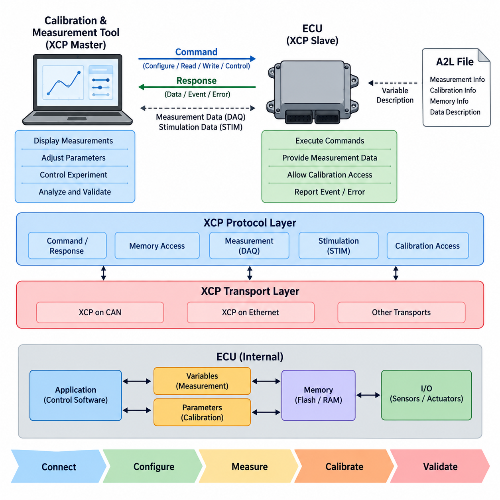
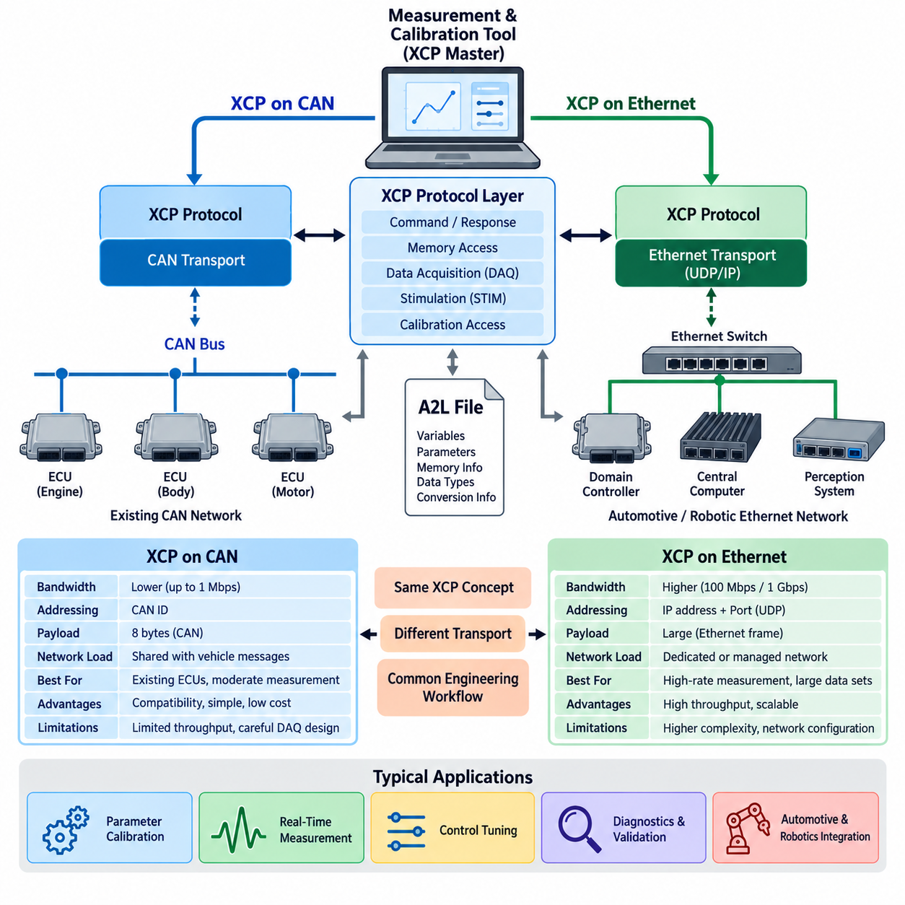
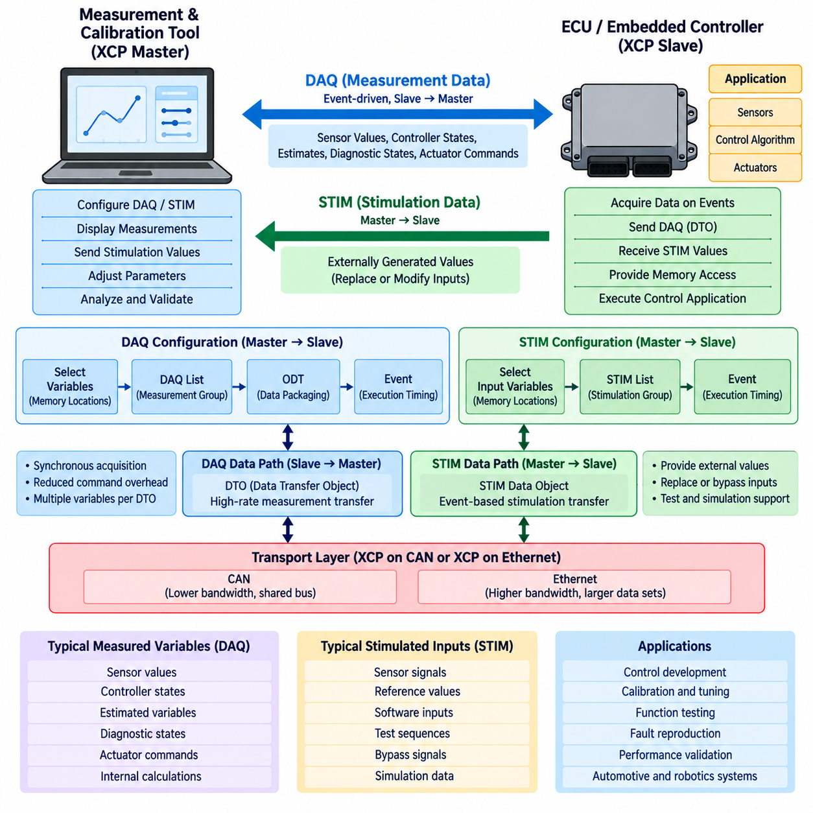
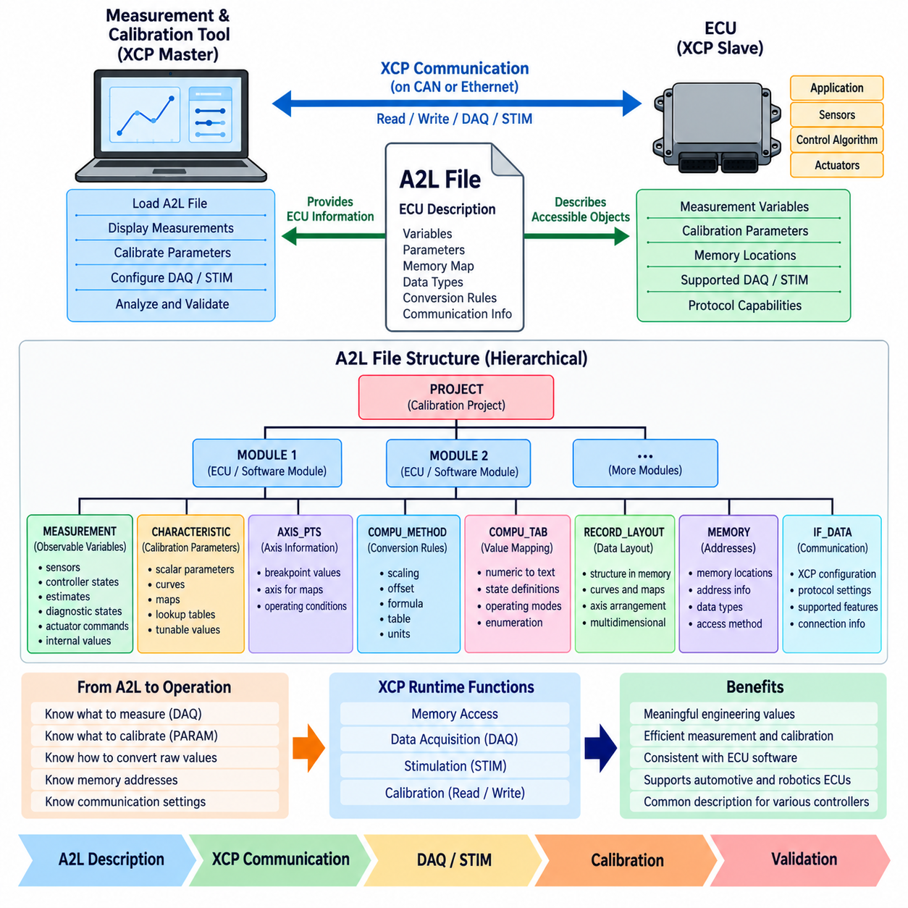
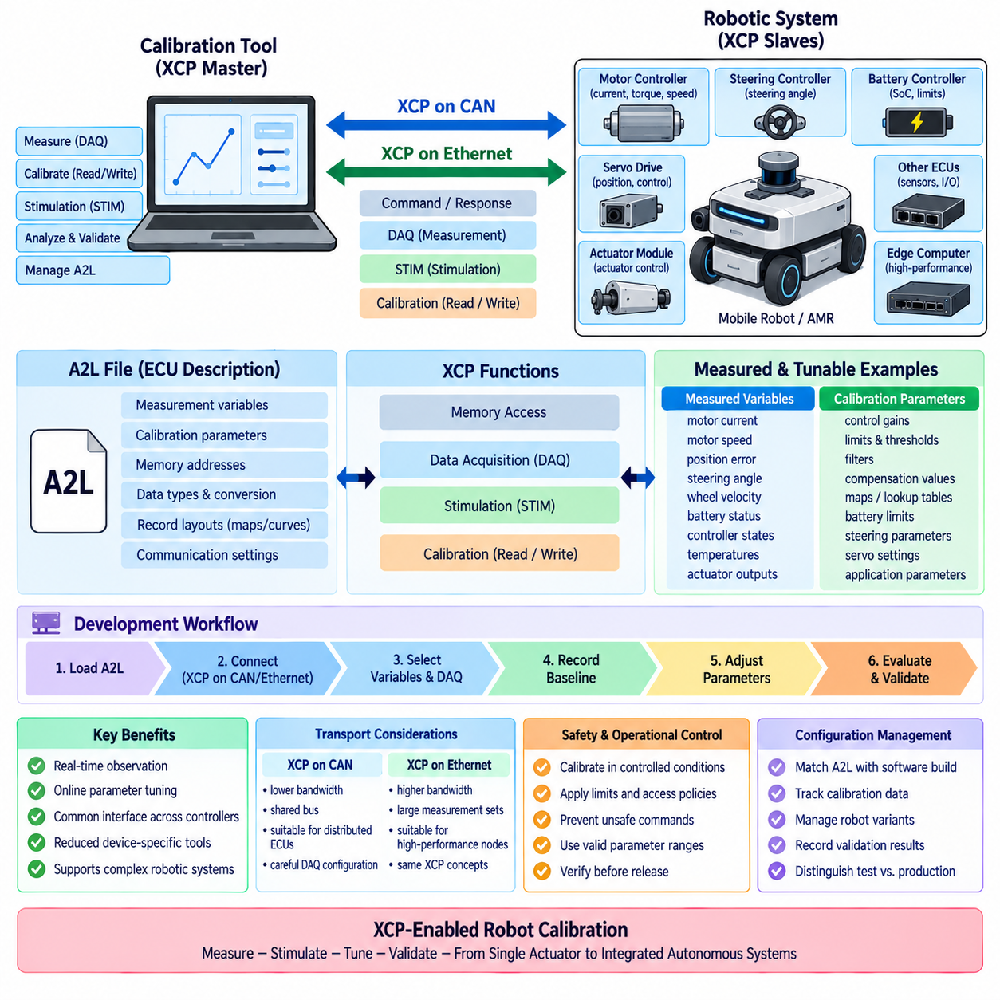

**Volume 06 Automotive Communication**

# Chapter 7. XCP Calibration

## 7.1 XCP Protocol Architecture

{width="7.268055555555556in" height="7.268055555555556in"}

XCP(Universal Measurement and Calibration Protocol)는 임베디드 제어 시스템(Embedded Control System)에서 측정(Measurement), 캘리브레이션(Calibration), 자극 입력(Stimulation), 메모리 접근(Memory Access)을 수행하도록 설계된 표준화 통신 프로토콜(Standardized Communication Protocol)이다. 자동차 엔지니어링(Automotive Engineering)에서는 ECU와 외부 개발 도구(Development Tool) 사이에 일관된 인터페이스를 제공하여, 제어 소프트웨어가 실행되는 동안 내부 변수를 관찰하고 캘리브레이션 파라미터를 변경할 수 있도록 한다.

XCP 아키텍처(XCP Architecture)는 마스터-슬레이브 통신 모델(Master-Slave Communication Model)을 따른다. 외부 캘리브레이션 또는 측정 도구가 일반적으로 XCP 마스터(XCP Master)로 동작하고, ECU 또는 다른 임베디드 컨트롤러(Embedded Controller)가 XCP 슬레이브(XCP Slave)로 동작한다. 마스터는 명령과 설정 작업을 시작하며, 슬레이브는 구현된 XCP 서비스에 따라 응답한다. 이러한 중앙집중형 상호작용은 측정 및 캘리브레이션 세션(Session)의 제어를 단순화한다.

XCP의 기본적인 특징은 프로토콜 계층(Protocol Layer)과 전송 계층(Transport Layer)이 분리되어 있다는 것이다. 프로토콜은 하위 통신 네트워크와 독립적으로 명령(Command), 응답(Response), 측정 메커니즘(Measurement Mechanism), 캘리브레이션 접근(Calibration Access), 데이터 수집 동작(Data Acquisition Behavior)을 정의한다. 이후 전송 계층 매핑(Transport-Layer Mapping)을 통해 XCP가 CAN이나 이더넷(Ethernet)과 같은 기술 위에서 동작할 수 있으며, 이러한 전송 방식은 캘리브레이션 엔지니어링(Calibration Engineering) 구조에서 별도로 다룰 수 있다.

XCP 마스터(XCP Master)와 슬레이브(XCP Slave) 사이의 통신에는 세션을 설정하고 관리하기 위한 명령 중심 교환(Command-Oriented Exchange)이 포함된다. 마스터는 슬레이브의 정보를 요청하고, 통신 자원(Communication Resource)을 설정하며, 메모리에 접근하고, 측정 기능을 제어할 수 있다. 슬레이브는 명령 응답(Command Response)을 반환하고 프로토콜 이벤트(Protocol Event)나 오류(Error)를 보고할 수도 있다. 이러한 명령-응답 메커니즘(Command-Response Mechanism)은 XCP 세션을 설정하는 제어 경로(Control Path)를 구성한다.

XCP는 구현에서 허용되는 경우 ECU 내부의 메모리 위치(Memory Location)에 직접 접근할 수 있는 기능을 제공한다. 메모리 기반 동작(Memory-Oriented Operation)을 통해 개발 도구는 내부 값을 읽고 제어 알고리즘(Control Algorithm)과 관련된 캘리브레이션 데이터를 변경할 수 있다. 따라서 제어기 게인(Controller Gain), 임계값(Threshold), 특성값(Characteristic Value), 룩업 테이블(Lookup Table)의 내용과 같은 파라미터를 캘리브레이션 변경 때마다 전체 소프트웨어를 다시 빌드하지 않고 조정할 수 있다.

측정(Measurement)은 XCP의 또 다른 핵심 기능이다. 엔지니어는 일반적인 네트워크 신호(Network Signal)로 제공되지 않는 ECU 내부 변수를 관찰해야 하는 경우가 많다. XCP를 사용하면 이러한 변수를 시스템이 동작하는 동안 측정 시스템(Measurement System)으로 전송할 수 있다. 이를 통해 실제 운전 조건에서 제어기 상태(Controller State), 센서 처리 결과(Sensor Processing Result), 중간 계산값(Intermediate Calculation), 진단 변수(Diagnostic Variable), 기타 소프트웨어 동작을 분석할 수 있다.

효율적인 고속 측정(High-Rate Measurement)을 위해 XCP는 일반적으로 DAQ라고 부르는 데이터 수집 메커니즘(Data Acquisition Mechanism)을 사용한다. 마스터가 모든 변수를 개별적으로 반복 요청하는 대신 측정 객체(Measurement Object)를 설정하면, 슬레이브는 정의된 수집 이벤트(Acquisition Event)에 따라 데이터를 전송한다. 이를 통해 명령 오버헤드(Command Overhead)를 줄이고 여러 내부 변수를 동기화하여 관찰할 수 있으므로, DAQ는 실시간 ECU 개발(Real-Time ECU Development)과 검증(Validation)에서 특히 중요하다.

DAQ 동작(DAQ Operation)은 메모리 위치(Memory Location)를 측정 이벤트(Measurement Event) 및 전송 데이터와 연결하는 설정 가능한 수집 구조(Configurable Acquisition Structure)를 중심으로 구성된다. ECU에서 정의된 이벤트가 발생하면 이에 대응하는 데이터를 수집하여 XCP를 통해 전송할 수 있다. ECU 실행 이벤트(Execution Event)와 측정 데이터 전송 사이의 이러한 관계를 통해 엔지니어는 수집된 변수를 제어 루프 타이밍(Control-Loop Timing) 및 내부 소프트웨어 실행(Software Execution)과 연관하여 분석할 수 있다.

XCP는 데이터 수집(Data Acquisition)을 보완하는 STIM 메커니즘(Stimulation Mechanism)도 지원한다. DAQ가 주로 슬레이브에서 마스터 방향으로 데이터를 전달하는 반면, STIM은 지원되는 응용에서 외부에서 생성된 값을 ECU 방향으로 전달할 수 있도록 한다. 이 기능은 제어된 시험 환경에서 내부 입력값(Internal Input)이나 중간값(Intermediate Value)을 외부 값으로 대체하거나 조작해야 하는 개발 환경에서 사용할 수 있다. DAQ와 STIM은 해당 볼륨 구조에서 별도의 주제로 다루어진다.

캘리브레이션(Calibration)과 측정(Measurement)을 수행하려면 통신 프로토콜만으로는 충분하지 않다. 외부 도구가 ECU 내부에 어떤 변수와 파라미터가 존재하는지를 이해해야 하기 때문이다. 이러한 이유로 XCP는 일반적으로 측정 및 캘리브레이션 객체를 해석하는 데 필요한 정보를 포함하는 A2L 설명(A2L Description)과 함께 사용된다. 따라서 해당 볼륨에서는 기본 XCP 프로토콜 아키텍처와 A2L 파일 구조(A2L File Structure)를 분리하여 프로토콜 동작과 데이터 설명(Data Description)을 독립적으로 학습할 수 있도록 구성한다.

XCP와 진단 프로토콜(Diagnostic Protocol)의 차이를 이해하는 것도 중요하다. 진단 통신(Diagnostic Communication)은 일반적으로 차량 서비스 기능(Vehicle Service Function), 고장 정보(Fault Information), 진단 식별자(Diagnostic Identifier), ECU 프로그래밍(ECU Programming), 표준화된 진단 서비스(Standardized Diagnostic Service)에 중점을 둔다. 반면 XCP는 주로 개발 단계에서 측정과 캘리브레이션을 수행하기 위한 엔지니어링 프로토콜(Engineering Protocol)이다. 두 방식 모두 ECU 정보에 접근할 수 있지만 목적, 통신 모델, 데이터 구성, 엔지니어링 작업 흐름(Engineering Workflow)은 서로 다르다.

전송 방식과 독립적인 아키텍처(Transport-Independent Architecture)를 통해 XCP는 서로 다른 통신 요구조건을 가진 시스템에 적용될 수 있다. 기존 ECU 네트워크와 중간 수준의 데이터 전송률(Data Rate)로 충분한 경우에는 CAN 기반 XCP(XCP on CAN)를 사용할 수 있으며, 이더넷은 대규모 측정 데이터와 고속 데이터 수집(High-Rate Acquisition)을 위해 훨씬 높은 대역폭(Bandwidth)을 제공할 수 있다. 선택한 전송 방식에 따라 프레이밍(Framing), 주소 지정(Addressing), 처리량(Throughput), 지연시간(Latency), 네트워크 설정(Network Configuration)은 달라지지만 기본적인 XCP 프로토콜 개념은 유지된다.

실제 개발 작업 흐름(Development Workflow)에서 엔지니어는 측정 및 캘리브레이션 시스템을 ECU에 연결하고 XCP 통신을 설정한 다음, 사용 가능한 자원(Resource)을 확인하고 필요한 측정 또는 캘리브레이션 접근을 설정한다. 이후 선택한 내부 변수를 수집하면서 파라미터를 조정하고 시스템 응답(System Response)을 평가할 수 있다. 이를 통해 제어 알고리즘 개발(Control-Algorithm Development), 파라미터 튜닝(Parameter Tuning), 측정(Measurement), 검증(Validation) 사이에 빠른 피드백 루프(Feedback Loop)를 형성할 수 있다.

동일한 아키텍처 원리는 기존 자동차 ECU를 넘어 로봇 컨트롤러(Robotic Controller)에도 확장될 수 있다. 모터 제어 장치(Motor-Control Unit), 조향 컨트롤러(Steering Controller), 전력전자 장치(Power Electronics), 배터리 컨트롤러(Battery Controller), 기타 임베디드 장치에는 체계적인 측정과 튜닝이 필요한 파라미터와 내부 상태가 존재할 수 있다. 따라서 해당 볼륨은 XCP 아키텍처에서 시작하여 CAN 및 이더넷 전송, DAQ/STIM 동작, A2L 설명, 최종적으로 로봇 캘리브레이션 응용(Robot Calibration Application)으로 확장되는 구조를 갖는다.

따라서 XCP는 임베디드 제어 소프트웨어(Embedded Control Software)와 측정 및 캘리브레이션 도구(Measurement and Calibration Tool)를 연결하는 엔지니어링 접근 아키텍처(Engineering Access Architecture)로 이해할 수 있다. 마스터-슬레이브 구조(Master-Slave Organization), 전송 독립성(Transport Independence), 메모리 접근(Memory Access), 측정 기능(Measurement Capability), 캘리브레이션 지원(Calibration Support), DAQ/STIM 메커니즘은 실시간 임베디드 시스템을 관찰하고 수정하기 위한 공통 기반을 제공한다. 이러한 특성은 XCP가 ECU 개발에서 지속적으로 중요한 역할을 하며 소프트웨어 중심으로 발전하는 자동차 및 로봇 플랫폼에도 적용될 수 있는 이유를 설명한다.

## 7.2 XCP on CAN and Ethernet

{width="7.268055555555556in" height="7.268055555555556in"}

XCP는 프로토콜 기능(Protocol Function)이 하위 전송 메커니즘(Transport Mechanism)과 분리되어 있기 때문에 서로 다른 통신 기술 위에서 동작할 수 있다. 대표적인 두 가지 구현 방식은 CAN 기반 XCP(XCP on CAN)와 이더넷 기반 XCP(XCP on Ethernet)이다. 두 방식 모두 동일한 기본 측정(Measurement) 및 캘리브레이션(Calibration) 개념을 제공하지만, 대역폭(Bandwidth), 주소 지정(Addressing), 패킷 처리(Packet Handling), 지연시간(Latency), 네트워크 설정(Network Configuration), 개발 과정에서 전송할 수 있는 데이터 규모에서 큰 차이가 있다.

CAN 기반 XCP(XCP on CAN)는 기존 CAN 네트워크에 측정 및 캘리브레이션 통신을 통합한다. 이 방식은 이미 CAN 인터페이스를 갖춘 기존 ECU, 모터 컨트롤러(Motor Controller), 바디 컨트롤러(Body Controller), 기타 임베디드 장치(Embedded Device)에 특히 유용하다. XCP 프로토콜 데이터는 할당된 CAN 식별자(CAN Identifier)를 사용하는 CAN 프레임(CAN Frame)을 통해 전송되므로 별도의 고속 물리 네트워크 없이 개발 도구가 대상 장치와 통신할 수 있다.

CAN 기반 XCP의 주요 장점은 기존 자동차 통신 인프라(Automotive Communication Infrastructure)와의 호환성이다. 엔지니어는 기존 CAN 트랜시버(CAN Transceiver), 배선(Wiring), 인터페이스(Interface), 개발 장비(Development Equipment)를 그대로 활용하면서 ECU의 측정 및 캘리브레이션 기능에 접근할 수 있다. 따라서 CAN 기반 XCP는 중간 수준의 측정 요구사항을 가진 임베디드 컨트롤러에 실용적이며, 특히 필요한 샘플링 속도(Sampling Rate)와 네트워크 대역폭 요구가 CAN의 한계 범위 안에 있을 때 효과적이다.

그러나 CAN 대역폭(CAN Bandwidth)은 XCP 측정 성능에 실질적인 제약을 발생시킨다. 통신 용량은 일반 차량 메시지(Vehicle Message), 진단(Diagnostics), 제어 트래픽(Control Traffic)과 공유되는 경우가 많다. 따라서 대규모 측정 목록(Measurement List)이나 고주파 데이터 수집(High-Frequency Acquisition)은 네트워크 부하(Network Load)를 크게 증가시킬 수 있다. 엔지니어는 캘리브레이션 작업이 시간 임계 제어 통신(Time-Critical Control Communication)을 방해하지 않도록 측정 변수, 수집 주기, 페이로드 활용률(Payload Utilization), 통신 우선순위(Communication Priority)를 신중하게 결정해야 한다.

이더넷 기반 XCP(XCP on Ethernet)는 XCP 통신을 이더넷 기반 네트워크(Ethernet-Based Network)를 통해 전송함으로써 이러한 대역폭 제한의 상당 부분을 해결한다. 이더넷은 클래식 CAN(Classical CAN)보다 훨씬 높은 처리량(Throughput)을 제공할 수 있으므로 많은 수의 내부 변수를 제공하거나 고속 측정(High-Rate Measurement)이 필요한 ECU에 적합하다. 특히 현대적인 도메인 컨트롤러(Domain Controller), 중앙 컴퓨터(Central Computer), 인지 시스템(Perception System), 고성능 임베디드 플랫폼(High-Performance Embedded Platform)은 이러한 높은 측정 용량의 이점을 활용할 수 있다.

이더넷 구현(Ethernet Implementation)에서는 XCP 프로토콜 메시지가 CAN 프레임을 통해 직접 전달되는 대신 IP 기반 통신 스택(IP-Based Communication Stack)을 통해 전달된다. 낮은 오버헤드(Low Overhead)와 효율적인 데이터 전송이 중요한 경우 UDP가 XCP 전송과 일반적으로 연계되며, 네트워크 설정에는 IP 주소(IP Address)와 포트(Port) 같은 개념이 추가된다. 이러한 전송 방식의 세부사항과 관계없이 XCP의 응용 개념은 대부분 유지되며, 이는 XCP의 전송 독립적 아키텍처(Transport-Independent Architecture)를 보여준다.

사용 가능한 대역폭의 차이는 데이터 수집(Data Acquisition, DAQ) 설계에 큰 영향을 준다. CAN 기반 XCP에서는 제한된 프레임 용량(Frame Capacity)과 버스 사용률(Bus Utilization)을 고려하여 DAQ를 구성해야 하므로 실제 실험에 필요한 변수를 신중하게 우선순위화해야 하는 경우가 많다. 반면 이더넷 기반 XCP는 더 큰 측정 데이터 집합(Measurement Set)과 높은 수집 주파수(Acquisition Frequency)를 수용할 수 있어 복잡한 소프트웨어와 제어 동작을 더욱 상세하게 관찰할 수 있다.

지연시간 특성(Latency Characteristics)은 단순한 대역폭과 별도로 고려해야 한다. 높은 대역폭을 가진 이더넷 연결이 모든 측정 패킷에 대해 자동으로 결정론적 전송(Deterministic Delivery)을 보장하는 것은 아니다. 네트워크 스위치(Network Switch), 운영체제 스케줄링(Operating-System Scheduling), 프로토콜 처리(Protocol Processing), 버퍼링(Buffering), 경쟁 트래픽(Competing Traffic)이 타이밍에 영향을 줄 수 있다. CAN은 처리량은 낮지만 예측 가능한 중재 동작(Arbitration Behavior)을 제공하며, 이더넷 시스템에서는 타이밍 일관성이 중요한 경우 적절한 아키텍처와 트래픽 관리(Traffic Management)가 필요할 수 있다.

캘리브레이션 동작(Calibration Operation)은 파라미터 값을 간헐적으로 읽거나 수정하는 경우가 많기 때문에 일반적으로 고속 연속 측정보다 필요한 대역폭이 작다. 따라서 측정 처리량이 제한적인 상황에서도 CAN 기반 XCP는 많은 캘리브레이션 작업에 효과적으로 사용될 수 있다. 반면 광범위한 실시간 측정(Real-Time Measurement), 대규모 데이터 세트(Large Data Set), 빠른 실험(Rapid Experimentation), 다수의 관찰 가능한 내부 상태를 가진 복잡한 컨트롤러와 캘리브레이션을 결합해야 한다면 이더넷의 장점이 더욱 커진다.

전송 방식(Transport) 선택은 개발 장비와 시스템 통합(System Integration)에도 영향을 준다. CAN 기반 XCP에서는 일반적으로 엔지니어링 워크스테이션(Engineering Workstation)과 대상 네트워크 사이에 CAN 인터페이스가 필요하지만, 이더넷 기반 XCP에서는 직접 연결하거나 개발 네트워크를 통해 연결된 이더넷 인터페이스를 사용할 수 있다. 두 경우 모두 측정 및 캘리브레이션 도구는 XCP 프로토콜 아키텍처에서 정의한 동일한 기본 마스터-슬레이브 구조(Master-Slave Architecture)를 기반으로 XCP 슬레이브와 통신한다.

A2L 설명(A2L Description)은 CAN 또는 이더넷 중 어느 방식으로 XCP 트래픽을 전달하더라도 중요하다. 측정 도구는 전송 방식과 독립적으로 변수(Variable), 파라미터(Parameter), 메모리 위치(Memory Location), 데이터 형식(Data Type), 변환 정보(Conversion Information), 기타 ECU 설명 정보를 이해해야 한다. 이러한 분리를 통해 ECU의 엔지니어링 설명(Engineering Description)은 해당 측정 및 캘리브레이션 객체에 접근하기 위해 사용되는 통신 매체(Communication Medium)와 개념적으로 독립된 상태를 유지할 수 있다.

따라서 XCP 전송 방식은 단순히 가장 빠른 네트워크를 선택하는 것이 아니라 시스템 수준 요구조건(System-Level Requirement)에 따라 결정해야 한다. 제한된 수의 캘리브레이션 파라미터만 가진 소형 임베디드 컨트롤러는 이더넷을 사용해도 얻는 이점이 크지 않을 수 있지만, 빠르게 변화하는 수천 개의 변수를 수집하는 고성능 ECU는 CAN의 실질적인 전송 용량을 쉽게 초과할 수 있다. 대역폭, 네트워크 부하, 타이밍 요구조건, 하드웨어 인터페이스, 비용, 소프트웨어 복잡성, 기존 아키텍처를 함께 고려해야 한다.

자동차와 로봇의 혼합 아키텍처(Mixed Automotive and Robotic Architecture)에서는 두 가지 전송 방식이 함께 존재할 수 있다. 모터 컨트롤러, 조향 컨트롤러(Steering Controller), 배터리 시스템(Battery System), 분산 임베디드 장치(Distributed Embedded Device)는 CAN을 사용할 수 있으며, 엣지 컴퓨터(Edge Computer), 인지 프로세서(Perception Processor), 고성능 컨트롤러는 이더넷을 통해 통신할 수 있다. XCP는 서로 다른 통신 영역(Communication Domain)에서 일관된 측정 및 캘리브레이션 개념을 제공하여 각 컨트롤러 유형마다 별개의 엔지니어링 접근 방식을 개발해야 하는 필요성을 줄일 수 있다.

이러한 전송 유연성(Transport Flexibility)은 시스템 통합 과정에서 특히 유용하다. 엔지니어는 CAN 기반 XCP를 통해 저수준 컨트롤러(Low-Level Controller)의 변수를 측정하면서 동시에 이더넷 기반 XCP를 사용하여 고대역폭 컴퓨팅 노드(High-Bandwidth Computing Node)를 측정할 수 있다. 서로 다른 네트워크 사이에서 데이터 수집 타이밍(Acquisition Timing)과 동기화(Synchronization)를 적절하게 관리한다면 여러 컨트롤러에서 얻은 데이터를 제어 튜닝(Control Tuning), 타이밍 분석(Timing Analysis), 고장 조사(Fault Investigation), 성능 검증(Performance Validation), 시스템 수준 캘리브레이션(System-Level Calibration)에 활용할 수 있다.

따라서 CAN 기반 XCP(XCP on CAN)와 이더넷 기반 XCP(XCP on Ethernet)는 동일한 측정 및 캘리브레이션 아키텍처를 구현하는 상호 보완적 방식으로 이해해야 한다. CAN은 기존 임베디드 네트워크와의 호환성(Compatibility), 단순성(Simplicity), 통합성(Integration)에 강점이 있으며, 이더넷은 데이터 집약적 컨트롤러(Data-Intensive Controller)를 위한 높은 대역폭과 확장성(Scalability)에 강점을 가진다. 각각의 장점과 한계를 이해하면 공통된 XCP 기반 개발 작업 흐름(XCP-Based Development Workflow)을 유지하면서 시스템에 적합한 전송 방식을 선택할 수 있다.

## 7.3 DAQ STIM Mode

{width="7.268055555555556in" height="7.268055555555556in"}

일반적으로 DAQ라고 부르는 XCP 데이터 수집(Data Acquisition)은 실행 중인 ECU 또는 임베디드 컨트롤러(Embedded Controller)의 내부 변수를 효율적으로 관찰하기 위해 설계되었다. XCP 마스터(XCP Master)가 모든 변수에 대해 개별 읽기 명령을 반복적으로 전송하는 대신, 슬레이브(Slave)는 특정 내부 이벤트가 발생할 때 미리 정의된 측정 데이터를 수집하여 자동으로 전송할 수 있다. 이러한 이벤트 구동 방식(Event-Driven Approach)은 명령 오버헤드(Command Overhead)를 줄이고 실시간 제어 동작(Real-Time Control Behavior)의 고속 측정을 지원한다.

DAQ 통신은 주로 XCP 슬레이브(XCP Slave)에서 XCP 마스터 방향으로 측정 데이터를 전송한다. 측정 정보에는 센서 값(Sensor Value), 제어기 상태(Controller State), 추정 변수(Estimated Variable), 진단 상태(Diagnostic State), 액추에이터 명령(Actuator Command), 중간 계산값(Intermediate Calculation), 기타 내부 소프트웨어 변수 등이 포함될 수 있다. 이러한 값은 응용 프로그램이 정상적으로 실행되는 동안 관찰할 수 있으므로, DAQ는 일반적인 차량 네트워크 신호(Vehicle Network Signal)만으로는 확인하기 어려운 동작을 상세하게 분석할 수 있도록 한다.

DAQ 설정(DAQ Configuration)은 선택된 ECU 메모리 위치(Memory Location)를 데이터 수집 구조(Acquisition Structure) 및 실행 이벤트(Execution Event)와 연결한다. 마스터는 측정해야 할 변수를 식별하고 이에 따라 슬레이브를 설정한다. 해당 이벤트가 발생하면 슬레이브는 지정된 데이터를 가져와 전송할 준비를 한다. 이를 통해 측정 타이밍(Measurement Timing)을 마스터의 반복적인 요청과 분리하고, 임베디드 응용 프로그램(Embedded Application)의 실행 타이밍에 맞추어 데이터를 수집할 수 있다.

XCP DAQ 구조는 일반적으로 DAQ 리스트(DAQ List), 객체 설명 테이블(Object Descriptor Table, ODT), 개별 측정 엔트리(Measurement Entry)를 사용하여 구성된다. DAQ 리스트는 특정 측정 동작과 연계된 데이터 수집 정보의 그룹을 나타내며, ODT는 패킷으로 실제 전송되는 데이터를 구성한다. 개별 엔트리는 측정 객체의 메모리 위치와 크기를 지정하므로 여러 변수를 사용 가능한 전송 페이로드(Transport Payload)에 효율적으로 패킹(Packing)할 수 있다.

이벤트(Event)는 동기식 DAQ 동작(Synchronous DAQ Operation)의 타이밍 기반을 제공한다. 이벤트는 주기적 제어 태스크(Periodic Control Task), 타이머 인터럽트(Timer Interrupt), 소프트웨어 러너블(Software Runnable), 센서 처리 주기(Sensor-Processing Cycle), 또는 ECU 구현에서 정의된 다른 실행 지점에 대응할 수 있다. 예를 들어 10 ms 제어 루프(Control Loop)와 관련된 변수는 해당 루프가 실행될 때 수집할 수 있으며, 이를 통해 측정 결과가 의미 있는 소프트웨어 실행 시점에서 제어기의 일관된 상태를 나타내도록 할 수 있다.

측정 설정이 완료되면 DAQ 패킷은 데이터 전송 객체(Data Transfer Object, DTO)를 통해 전달된다. 이러한 데이터 경로(Data Path)는 XCP 세션(Session)을 설정하고 제어하는 데 사용되는 명령-응답 경로(Command-Response Path)와 구분된다. 설정 명령(Configuration Command)과 고속 측정 데이터 전송(High-Rate Measurement Transfer)을 분리함으로써 XCP는 데이터 수집 과정의 프로토콜 오버헤드를 최소화하고 사용 가능한 CAN 또는 이더넷(Ethernet) 전송 용량을 더욱 효율적으로 활용할 수 있다.

DAQ 성능은 선택된 전송 방식(Transport)에 크게 의존한다. CAN 기반 XCP(XCP on CAN)에서는 측정 트래픽이 제한된 통신 용량을 공유하므로 변수의 수, 이벤트 주파수(Event Frequency), 패킷 크기(Packet Size), 기존 CAN 버스 부하(CAN Bus Load)를 신중하게 조정해야 한다. 이더넷 기반 XCP(XCP on Ethernet)는 일반적으로 더 큰 측정 데이터 집합과 높은 수집 속도를 지원할 수 있지만, 버퍼링(Buffering), 네트워크 트래픽(Network Traffic), 운영체제 동작(Operating-System Behavior), 동기화(Synchronization)는 여전히 실제 성능에 영향을 미친다.

STIM, 즉 자극 입력(Stimulation)은 DAQ와 상호 보완적인 데이터 전송 방향을 제공한다. ECU 내부에서 생성된 값을 관찰하는 대신 STIM은 외부에서 생성된 데이터를 XCP 슬레이브 내부의 지원되는 위치 또는 기능으로 전달할 수 있도록 한다. 마스터는 자극 입력값(Stimulation Value)을 준비하여 대상 시스템(Target System)으로 전송하며, 해당 값은 설정된 실행 이벤트에 따라 사용될 수 있다. 이를 통해 임베디드 응용 프로그램이 실행되는 동안 선택된 입력을 제어된 방식으로 변경할 수 있다.

따라서 DAQ와 STIM의 관계는 측정(Measurement)과 자극 입력(Stimulation)의 관계로 이해할 수 있다. DAQ는 ECU 내부 동작을 외부 개발 환경(Development Environment)에 제공하는 반면, STIM은 외부에서 제어되는 값을 대상 시스템 내부로 전달한다. 두 기능을 결합하면 엔지니어가 제어된 조건에서 선택된 입력을 의도적으로 변화시키면서 동시에 시스템 응답을 관찰할 수 있는 양방향 실험 인터페이스(Bidirectional Experimental Interface)를 구성할 수 있다.

STIM은 바이패싱(Bypassing), 기능 시험(Function Testing), 시뮬레이션 기반 검증(Simulation-Assisted Validation)이 포함된 개발 환경에서 특히 유용하다. 센서 값이나 소프트웨어 입력(Software Input)을 외부에서 생성된 데이터로 대체하여 실제 물리적 환경을 직접 구성하지 않고도 특정 운전 조건(Operating Condition)을 재현할 수 있다. 동시에 DAQ를 사용하면 자극 입력에 따라 내부 상태(Internal State)와 제어 출력(Control Output)이 어떻게 변화하는지를 관찰할 수 있다.

DAQ와 STIM을 함께 사용할 때는 타이밍(Timing)이 매우 중요하다. 측정 데이터는 알려진 실행 이벤트에 대응해야 하며, 자극 입력값은 응용 프로그램 주기(Application Cycle)의 적절한 시점에 대상 시스템에 도달해야 한다. 데이터가 너무 늦게 도착하거나 잘못된 이벤트와 연결되면 실험이 의도한 제어 동작을 더 이상 정확하게 나타내지 못할 수 있다. 따라서 이벤트 설정(Event Configuration)과 동기화(Synchronization)는 의미 있는 실시간 측정 및 자극 입력을 위한 핵심 요소이다.

DAQ와 STIM은 측정 및 캘리브레이션 환경(Measurement and Calibration Environment)에서 사용되는 ECU 설명(ECU Description)과도 밀접하게 연계된다. 엔지니어링 도구(Engineering Tool)는 어떤 변수를 측정할 수 있는지, 어떤 객체가 STIM에 사용될 수 있는지, 해당 객체가 메모리의 어느 위치에 존재하는지, 원시값(Raw Value)이 어떻게 표현되는지, ECU 실행 이벤트와 어떤 관계를 갖는지를 알아야 한다. 이러한 설명은 일반적으로 해당 볼륨의 다음 절에서 별도로 다루는 A2L 정보(A2L Information)를 통해 제공된다.

제어 개발(Control Development)에서 DAQ는 실험 중 기준값(Reference Value), 측정 상태(Measured State), 제어기 오차(Controller Error), 내부 추정값(Internal Estimate), 액추에이터 요청(Actuator Request) 등의 데이터를 기록할 수 있다. STIM은 제어된 입력 시퀀스(Input Sequence)를 제공하거나 선택된 신호를 대체할 수 있다. 자극 입력과 수집된 내부 응답을 비교하면 엔지니어는 일반적인 네트워크 모니터링(Network Monitoring)보다 훨씬 높은 가시성을 확보하여 제어 알고리즘(Control Algorithm)을 평가하고, 고장을 재현하며, 과도 응답(Transient Behavior)을 분석하고, 변경 사항을 검증할 수 있다.

동일한 메커니즘은 실시간 임베디드 컨트롤러를 포함하는 로봇 및 자율 시스템(Robotic and Autonomous System)에도 적용할 수 있다. 모터 컨트롤러(Motor Controller), 조향 시스템(Steering System), 배터리 컨트롤러(Battery Controller), 서보 드라이브(Servo Drive), 저수준 모션 컨트롤러(Low-Level Motion Controller)는 DAQ를 통해 내부 상태를 제공할 수 있으며, STIM을 통해 제어된 기준값이나 시험 입력(Test Input)을 공급받을 수 있다. CAN은 소형 분산 컨트롤러(Distributed Controller)에 적합할 수 있으며, 이더넷은 측정 집약적인 컴퓨팅 노드와 대규모 실험 데이터 흐름을 지원할 수 있다.

따라서 DAQ와 STIM은 XCP 측정 및 실험 환경에서 실시간 데이터 교환(Real-Time Data Exchange)의 핵심을 구성한다. DAQ는 이벤트와 동기화된 내부 데이터를 대상 시스템에서 개발 도구로 효율적으로 전달하며, STIM은 외부 데이터를 대상 시스템으로 전달하기 위한 제어된 경로를 제공한다. 메모리 접근(Memory Access), 캘리브레이션 서비스(Calibration Service), 전송 매핑(Transport Mapping), A2L 설명(A2L Description)과 결합하면 자동차 및 로봇 임베디드 제어 시스템을 체계적으로 관찰하고, 수정하고, 시험하고, 검증할 수 있는 기반을 제공한다.

## 7.4 A2L File Structure

{width="7.268055555555556in" height="7.268055555555556in"}

A2L 파일(A2L File)은 측정 및 캘리브레이션 환경(Measurement and Calibration Environment)에서 사용되는 ECU 설명 파일(ECU Description File)로, 엔지니어링 도구(Engineering Tool)가 변수(Variable), 파라미터(Parameter), 메모리 위치(Memory Location), 데이터 형식(Data Type), 변환 규칙(Conversion Rule), 관련 ECU 자원을 어떻게 해석할 것인지를 정의한다. XCP가 실행 중인 컨트롤러에 접근하기 위한 통신 메커니즘을 제공한다면, A2L 설명(A2L Description)은 접근한 데이터가 무엇을 의미하는지를 이해하는 데 필요한 의미적 정보(Semantic Information)를 제공한다.

A2L은 ASAM MCD-2 MC 설명 형식(Description Format)과 관련되며 ECU 소프트웨어 정보와 측정 또는 캘리브레이션 도구 사이의 구조화된 인터페이스(Structured Interface) 역할을 한다. A2L 파일 자체가 측정이나 캘리브레이션 통신을 수행하는 것은 아니다. 대신 XCP와 같은 프로토콜을 통해 개발 도구가 접근할 수 있는 객체(Object)를 설명하여, 원시 메모리 기반 통신(Raw Memory-Oriented Communication)을 의미 있는 엔지니어링 물리량(Engineering Quantity)으로 변환할 수 있도록 한다.

상위 수준에서 A2L 파일은 프로젝트(Project), 모듈(Module), 측정(Measurement), 캘리브레이션(Calibration), 변환(Conversion), 메모리(Memory), 통신 관련 정보(Communication-Related Information)를 포함하는 계층적 설명(Hierarchical Description)으로 구성된다. 하나의 프로젝트는 하나 이상의 ECU 관련 모듈을 포함할 수 있으며, 각 모듈은 특정 컨트롤러에 필요한 설명을 그룹화한다. 이러한 구조를 통해 많은 소프트웨어 변수와 캘리브레이션 객체를 하나의 공통 엔지니어링 설명 체계에서 체계적으로 관리할 수 있다.

프로젝트 구조(PROJECT Structure)는 설명의 최상위 조직 수준을 나타내며 캘리브레이션 프로젝트(Calibration Project)를 위한 컨테이너(Container)를 제공한다. 그 내부의 모듈 정의(MODULE Definition)는 개별 ECU 또는 소프트웨어 모듈 환경을 설명한다. 하나의 모듈에는 측정 객체(Measurement Object), 캘리브레이션 특성(Calibration Characteristic), 변환 방법(Conversion Method), 레코드 레이아웃(Record Layout), 메모리 설명(Memory Description), 통신 설정(Communication Setting), 그리고 측정 및 캘리브레이션 시스템에 필요한 기타 정의가 포함될 수 있다.

측정 객체(MEASUREMENT Object)는 개발 도구에서 관찰할 수 있는 ECU 내부 물리량을 설명한다. 대표적인 예로 센서 값(Sensor Value), 제어기 상태(Controller State), 추정값(Estimated Quantity), 진단 상태(Diagnostic State), 액추에이터 명령(Actuator Command), 중간 계산값(Intermediate Calculation)이 있다. 데이터 표현(Data Representation), 변환 참조(Conversion Reference), 유효 범위(Valid Range), 단위(Unit), ECU 접근 정보 등을 포함하여 원시값을 이해 가능한 물리량(Physical Quantity)으로 표시할 수 있도록 한다.

캘리브레이션 파라미터(Calibration Parameter)는 일반적으로 특성 설명(CHARACTERISTIC Description)을 통해 표현된다. 이러한 객체는 엔지니어가 캘리브레이션 과정에서 확인하거나 수정할 수 있는 물리량을 식별한다. 소프트웨어 설계에 따라 스칼라 파라미터(Scalar Parameter), 곡선(Curve), 맵(Map), 룩업 테이블(Lookup Table), 기타 튜닝 가능한 데이터 구조(Tunable Data Structure)를 나타낼 수 있다. 주소 및 레이아웃 정보를 통해 캘리브레이션 도구는 각 엔지니어링 파라미터를 ECU 메모리의 실제 표현과 연결할 수 있다.

축 포인트 설명(AXIS_PTS Description)은 캘리브레이션 객체가 곡선 또는 다차원 맵(Multidimensional Map)을 포함할 때 중요하다. 이는 캘리브레이션 테이블과 관련된 브레이크포인트(Breakpoint)를 해석하기 위한 축 정보를 정의한다. 축을 특성값과 별도로 설명함으로써 A2L 파일은 속도(Speed), 온도(Temperature), 부하(Load), 위치(Position), 기타 시스템 변수에 따라 인덱싱되는 제어기 맵처럼 운전 조건과 캘리브레이션 출력 사이의 관계를 표현할 수 있다.

ECU 메모리에 저장된 원시값(Raw Value)은 실제 엔지니어링 물리량으로 직접 해석할 수 없는 경우가 많다. 변환 방법 설명(COMPU_METHOD Description)은 내부 숫자 표현을 의미 있는 단위나 텍스트 표현(Textual Interpretation)으로 변환할 수 있도록 변환 관계를 정의한다. 스케일링(Scaling), 오프셋(Offset), 수식(Formula), 테이블(Table), 관련 단위를 표현할 수 있으므로 엔지니어는 원시 이진값 대신 전압(Voltage), 온도(Temperature), 압력(Pressure), 속도(Speed), 토크(Torque), 상태명(State Name)과 같은 물리량을 사용할 수 있다.

변환 테이블(COMPU_TAB) 및 관련 변환 테이블 구조(Conversion-Table Structure)는 ECU의 숫자 값이 개별 엔지니어링 값 또는 텍스트 상태(Textual State)에 대응하는 매핑을 지원할 수 있다. 예를 들어 내부 상태값은 초기화(Initialization), 대기(Standby), 활성 동작(Active Operation), 고장(Fault)과 같은 운전 모드를 나타낼 수 있다. 이러한 설명은 가독성을 향상시키고 측정 및 캘리브레이션 과정에서 엔지니어가 구현에 종속된 숫자 코드를 직접 해석해야 하는 필요성을 줄여준다.

레코드 레이아웃 정보(RECORD_LAYOUT Information)는 캘리브레이션 데이터 구조가 ECU 메모리에 어떻게 배치되는지를 설명한다. 이는 곡선, 맵, 축 값(Axis Value), 다차원 캘리브레이션 객체에서 특히 중요하다. 이러한 객체의 실제 메모리 표현(Physical Memory Representation)이 개념적인 엔지니어링 표현과 다를 수 있기 때문이다. 올바른 레이아웃 정보를 사용하면 캘리브레이션 도구가 ECU 데이터를 읽거나 수정할 때 해당 객체를 일관되게 접근하고 재구성할 수 있다.

메모리 주소(Memory Address)는 A2L 설명과 실제 ECU 소프트웨어 구현(Software Implementation)을 연결하는 중요한 요소이다. 측정 변수와 캘리브레이션 파라미터는 최종적으로 대상 컨트롤러(Target Controller) 내부의 위치 또는 접근 메커니즘과 연결되어야 한다. 소프트웨어가 다시 빌드되면 주소가 변경될 수 있으므로 A2L 생성 과정(A2L Generation Process)은 일반적으로 소프트웨어 빌드 정보(Software Build Information)와 밀접하게 연결되어 설명과 실행 가능한 ECU 소프트웨어가 서로 일치하도록 관리된다.

A2L 설명에는 캘리브레이션 도구와 ECU 사이의 통신을 설정하는 데 도움이 되는 정보도 포함된다. XCP 기반 개발(XCP-Based Development)에서는 프로토콜 관련 설정(Protocol-Related Configuration)을 통해 대상 시스템과 엔지니어링 접근을 설정하는 데 필요한 기능과 파라미터를 설명할 수 있다. 이러한 통신 설명(Communication Description)은 측정 및 캘리브레이션 객체 정의를 보완하며, 논리적인 엔지니어링 표현을 앞 절에서 설명한 XCP 통신 아키텍처(XCP Communication Architecture)와 연결한다.

A2L 정보는 DAQ 동작(DAQ Operation)과 밀접한 관계를 갖는다. XCP 마스터는 어떤 변수를 측정할 수 있으며 해당 변수를 어떻게 해석해야 하는지를 알아야 하기 때문이다. 엔지니어가 DAQ 실험에 사용할 변수를 선택하면 측정 도구는 A2L 설명을 이용하여 객체 속성(Object Property)과 변환 정보(Conversion Information)를 확인할 수 있다. 이후 XCP는 데이터 수집을 설정하고 해당 데이터를 ECU에서 전송하기 위한 런타임 메커니즘(Runtime Mechanism)을 제공한다.

동일한 관계가 캘리브레이션(Calibration)과 STIM 작업에도 적용된다. 캘리브레이션 도구는 A2L 설명에서 튜닝 가능한 객체(Tunable Object)를 식별하고 XCP를 통해 해당 ECU 데이터에 접근하며 값을 엔지니어링 단위(Engineering Unit)로 표시할 수 있다. 자극 입력(Stimulation)의 경우 적절한 객체 및 실행 정보를 통해 어떤 값이 외부에서 제어되는 실험에 참여할 수 있는지를 개발 환경이 이해할 수 있다. 따라서 A2L은 XCP 통신을 대체하는 것이 아니라 이를 보완한다.

A2L 파일과 ECU 소프트웨어 사이의 일관성(Consistency)을 유지하는 것은 매우 중요하다. 오래된 설명 파일에는 잘못된 주소, 데이터 형식, 범위, 레이아웃, 변환 정보가 포함될 수 있으며, 이로 인해 측정값이 잘못 해석되거나 캘리브레이션 작업이 의도하지 않은 데이터에 접근할 수 있다. 따라서 형상 관리(Configuration Management)에서는 올바른 A2L 설명을 해당 소프트웨어 빌드(Software Build), 실행 이미지(Executable Image), 캘리브레이션 데이터 세트(Calibration Data Set), 개발 릴리스(Development Release)와 연결하여 관리해야 한다.

자동차 및 로봇 개발(Automotive and Robotic Development)에서 A2L 파일은 기존 ECU부터 모터(Motor), 조향(Steering), 배터리(Battery), 서보(Servo), 모션 제어 시스템(Motion-Control System)에 이르는 다양한 컨트롤러를 위한 공통 설명 계층(Common Descriptive Layer)을 제공할 수 있다. CAN 또는 이더넷 기반 XCP와 DAQ/STIM 메커니즘을 결합하면 A2L 구조는 저수준 ECU 메모리 접근을 구조화된 엔지니어링 측정 및 캘리브레이션 작업 흐름으로 변환할 수 있으며, 임베디드 소프트웨어 구현(Embedded Software Implementation)과 시스템 수준 검증(System-Level Validation)을 연결하는 핵심적인 가교 역할을 한다.

## 7.5 Robot Calibration with XCP

{width="7.268055555555556in" height="7.268055555555556in"}

XCP를 활용한 로봇 캘리브레이션(Robot Calibration with XCP)은 범용 측정 및 캘리브레이션 프로토콜(Universal Measurement and Calibration Protocol)의 측정 및 캘리브레이션 기능을 로봇 임베디드 컨트롤러(Robotic Embedded Controller)에 적용한다. 캘리브레이션을 설정 파일(Configuration File)에만 의존하는 오프라인 과정으로 취급하는 대신, 엔지니어는 로봇 시스템이 동작하는 동안 내부 컨트롤러 변수를 관찰하고 허용된 파라미터를 수정할 수 있다. 이를 통해 제어 소프트웨어(Control Software), 물리 하드웨어(Physical Hardware), 캘리브레이션 도구(Calibration Tool) 사이에 직접적인 엔지니어링 인터페이스(Engineering Interface)를 구성할 수 있다.

로봇 시스템(Robotic System)은 일반적으로 서로 다른 역할을 담당하는 여러 컨트롤러로 구성된다. 모터 컨트롤러(Motor Controller)는 전류(Current), 토크(Torque), 속도(Velocity), 위치(Position)를 제어하며, 조향 컨트롤러(Steering Controller), 배터리 컨트롤러(Battery Controller), 서보 드라이브(Servo Drive), 액추에이터 모듈(Actuator Module), 기타 임베디드 장치는 각각의 로컬 기능(Local Function)을 관리한다. XCP는 이러한 컨트롤러 전반에 공통된 측정 및 캘리브레이션 메커니즘을 제공하여 장치별 디버깅(Debugging) 및 파라미터 조정 인터페이스에 대한 의존성을 줄일 수 있다.

모터 제어 캘리브레이션(Motor-Control Calibration)은 대표적인 적용 사례이다. 명령 토크(Commanded Torque), 측정 전류(Measured Current), 모터 속도(Motor Velocity), 위치 오차(Position Error), 제어기 출력(Controller Output), 포화 상태(Saturation State), 온도(Temperature)와 같은 내부 변수를 XCP 측정 기능을 통해 관찰할 수 있다. 이후 엔지니어는 제어 게인(Control Gain), 제한값(Limit), 필터(Filter), 임계값(Threshold), 보상값(Compensation Value)과 같은 캘리브레이션 파라미터를 조정하면서 제어된 운전 조건에서 발생하는 모터 응답을 평가할 수 있다.

이동 로봇(Mobile Robot)과 자율이동로봇(Autonomous Mobile Robot, AMR)의 조향 및 모션 제어 캘리브레이션(Steering and Motion-Control Calibration)에도 동일한 접근 방식을 사용할 수 있다. 엔지니어는 허용된 제어 파라미터를 변경하면서 조향각(Steering Angle), 휠 속도(Wheel Velocity), 기준 명령(Reference Command), 제어기 오차(Controller Error), 액추에이터 출력(Actuator Output), 내부 상태 추정값(Internal State Estimate)을 관찰할 수 있다. 이를 통해 명령된 운동(Commanded Motion), 임베디드 제어 동작(Embedded Control Behavior), 이동 플랫폼의 실제 물리적 응답(Physical Response) 사이의 관계를 분석하면서 캘리브레이션할 수 있다.

XCP 데이터 수집(Data Acquisition, DAQ)은 로봇 컨트롤러가 고수준 컴퓨팅 시스템(High-Level Computing System)보다 훨씬 빠른 주기로 제어 루프(Control Loop)를 실행하는 경우가 많기 때문에 특히 유용하다. DAQ는 측정 데이터를 내부 실행 이벤트(Execution Event)와 연결하여 제어 주기의 의미 있는 시점에서 변수를 수집할 수 있다. 따라서 엔지니어는 외부 컴퓨터의 비동기식 네트워크 모니터링(Asynchronous Network Monitoring)에만 의존하지 않고 임베디드 소프트웨어의 실제 실행 타이밍에 맞추어 제어기 동작을 관찰할 수 있다.

STIM은 지원되는 컨트롤러 입력에 제어된 외부 값(Controlled External Value)을 공급함으로써 DAQ를 보완할 수 있다. 개발 과정에서 기준 명령(Reference Command), 시뮬레이션된 센서 값(Simulated Sensor Value), 시험 시퀀스(Test Sequence)를 입력하면서 DAQ를 통해 내부 상태와 액추에이터 명령을 기록할 수 있다. 이러한 양방향 실험 기능(Bidirectional Experimental Capability)은 실제 물리적 이벤트에 전적으로 의존하지 않고 운전 조건을 재현하고, 제어 응답을 평가하며, 비정상 동작을 조사하고, 소프트웨어 변경 사항을 검증하는 데 유용하다.

A2L 설명(A2L Description)은 이러한 과정을 실용적으로 수행하는 데 필요한 엔지니어링 정보를 제공한다. 캘리브레이션 도구는 어떤 로봇 컨트롤러 변수를 측정할 수 있는지, 어떤 파라미터를 조정할 수 있는지, 객체가 어디에 위치하는지, 원시 데이터(Raw Data)가 어떻게 표현되는지, 숫자 값이 어떻게 엔지니어링 단위(Engineering Unit)로 변환되는지를 알아야 한다. A2L 정보와 XCP를 결합하면 저수준 메모리 접근(Low-Level Memory Access)을 전류, 토크, 속도, 위치, 온도, 제어 게인과 같이 의미 있는 물리량으로 표현할 수 있다.

CAN 기반 XCP(XCP on CAN)는 CAN이 저수준 임베디드 통신(Low-Level Embedded Communication)에 일반적으로 사용되기 때문에 많은 분산 로봇 컨트롤러(Distributed Robot Controller)에 적합하다. 모터 컨트롤러, 조향 장치(Steering Unit), 배터리 컨트롤러, 액추에이터 모듈이 CAN 네트워크를 공유하면서 XCP를 통해 선택된 장치에 엔지니어링 접근(Engineering Access)을 제공할 수 있다. 그러나 DAQ 통신은 정상적인 제어 및 상태 메시지(Control and Status Message)와 제한된 CAN 대역폭을 공유하므로 측정 트래픽(Measurement Traffic)을 신중하게 관리해야 한다.

이더넷 기반 XCP(XCP on Ethernet)는 로봇 컨트롤러가 더 큰 측정 데이터 집합(Measurement Set)을 제공하거나 높은 데이터 수집 속도(Acquisition Rate)가 필요한 경우 유용하다. 엣지 컴퓨터(Edge Computer)와 고성능 제어 노드(High-Performance Control Node)는 소형 CAN 연결 컨트롤러보다 훨씬 많은 내부 상태를 포함할 수 있다. 이더넷은 이러한 시스템을 관찰하기 위한 더 높은 대역폭을 제공하면서도 명령 접근(Command Access), DAQ, STIM, 캘리브레이션, A2L 기반 해석이라는 기본적인 XCP 개념을 CAN 기반 구현과 일관되게 유지할 수 있다.

캘리브레이션(Calibration)은 개념적으로 정상적인 로봇 운용(Normal Robot Operation)과 분리되어야 한다. 개발 접근(Development Access)을 통해 엔지니어가 액추에이터 동작에 직접 영향을 미치는 파라미터를 변경할 수 있으므로 부적절한 값이 위험한 명령을 발생시키지 않도록 제한값과 접근 정책(Access Policy)을 적용해야 한다. 따라서 캘리브레이션 세션(Calibration Session)은 수정된 값을 정상 운용에 적용하기 전에 적절한 운용 제약(Operational Constraint), 파라미터 범위(Parameter Range), 소프트웨어 보호 기능(Software Protection), 검증 절차(Verification Procedure)를 갖춘 통제된 조건에서 수행되어야 한다.

파라미터 변경(Parameter Change)에는 체계적인 형상 관리(Configuration Management)도 필요하다. 하나의 실험에서 좋은 성능을 보인 캘리브레이션 값은 올바른 컨트롤러 소프트웨어, 하드웨어 구성(Hardware Configuration), 로봇 변형 모델(Robot Variant), 운전 조건(Operating Condition)과 연결되어야 한다. 해당 A2L 설명, 소프트웨어 빌드(Software Build), 캘리브레이션 데이터(Calibration Data), 검증 결과(Validation Result)를 추적 가능하게 관리해야 엔지니어가 동일한 구성을 재현하고 실험용 값과 승인된 양산 파라미터(Approved Production Parameter)를 구분할 수 있다.

실제 캘리브레이션 작업 흐름(Calibration Workflow)은 측정 및 캘리브레이션 도구를 대상 컨트롤러(Target Controller)에 연결하고 해당 A2L 설명을 불러오는 것으로 시작한다. CAN 또는 이더넷을 통해 XCP 통신을 설정한 후 엔지니어는 측정 변수를 선택하고 DAQ 이벤트를 구성한다. 허용된 파라미터를 변경하기 전에 기준 동작(Baseline Behavior)을 기록함으로써 각 캘리브레이션 변경의 효과를 알려진 제어기 구성(Known Controller Configuration)과 비교할 수 있다.

이후 캘리브레이션 과정은 반복적인 엔지니어링 루프(Iterative Engineering Loop)가 된다. 측정 데이터를 통해 제어기 동작을 확인하고, 파라미터를 조정하며, 로봇 응답을 관찰한 다음 결과 데이터를 분석한다. DAQ는 고속 내부 상태(High-Rate Internal State)를 수집할 수 있으며, 필요한 경우 STIM은 제어된 시험 입력을 제공할 수 있다. 만족할 수 있는 동작을 확보한 이후에도 단일 실험의 성공만으로 캘리브레이션을 승인하는 것이 아니라 관련 운전 조건 전반에서 검증해야 한다.

이러한 접근 방식은 개별 액추에이터(Individual Actuator)에서 통합 로봇 서브시스템(Integrated Robotic Subsystem)까지 확장할 수 있다. 이동 로봇은 구동 모터(Drive Motor), 조향(Steering), 제동(Braking), 배터리 제한(Battery Limit), 서보 메커니즘(Servo Mechanism), 기타 임베디드 기능을 서로 연계하여 캘리브레이션해야 할 수 있다. XCP는 제어 알고리즘(Control Algorithm)이나 로봇 미들웨어(Robot Middleware)를 대체하지 않으며, 내부 컨트롤러 동작을 측정하고 튜닝 가능한 파라미터를 체계적으로 관리할 수 있는 표준화된 엔지니어링 접근 계층(Standardized Engineering Access Layer)을 제공한다.

따라서 XCP를 활용한 로봇 캘리브레이션은 XCP 캘리브레이션 장에서 설명한 프로토콜 아키텍처(Protocol Architecture), CAN 및 이더넷 전송(Transport), DAQ/STIM 동작, A2L 설명을 하나의 실제 로봇 개발 작업 흐름으로 연결한다. 이러한 요소를 결합하면 실시간 임베디드 동작(Real-Time Embedded Behavior)을 관찰하고, 제어 파라미터를 튜닝하며, 시험 조건을 재현하고, 로봇 컨트롤러를 검증할 수 있는 재사용 가능한 작업 흐름(Reusable Workflow)을 구축할 수 있으며, 개별 액추에이터 제어부터 통합 자율 플랫폼(Integrated Autonomous Platform)에 이르는 체계적인 개발을 지원할 수 있다.
