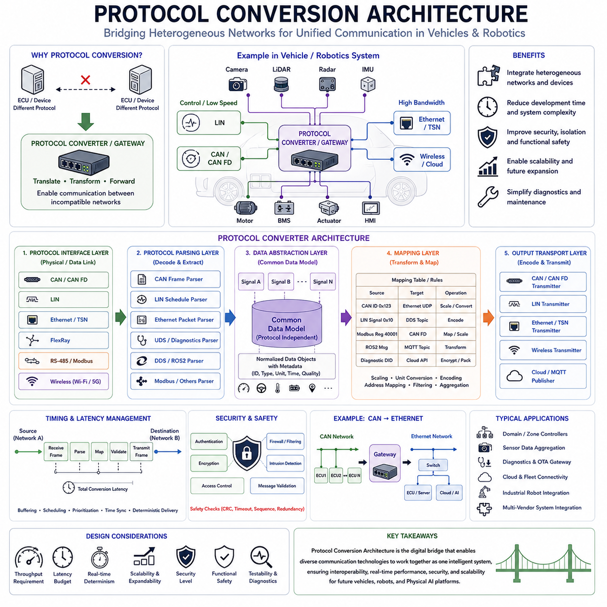
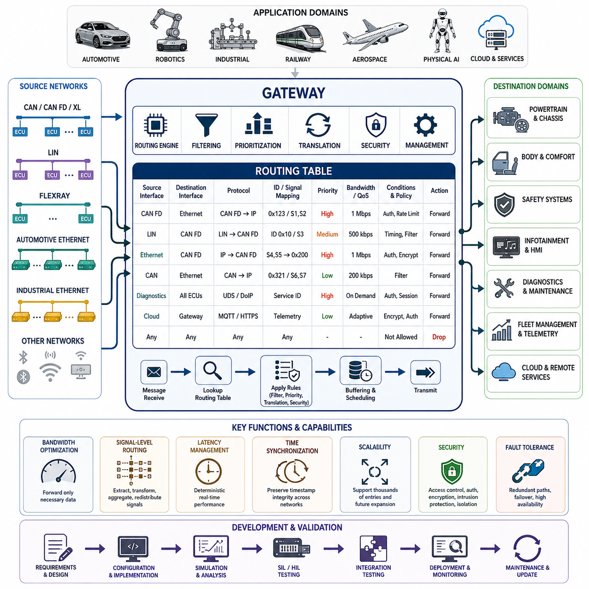
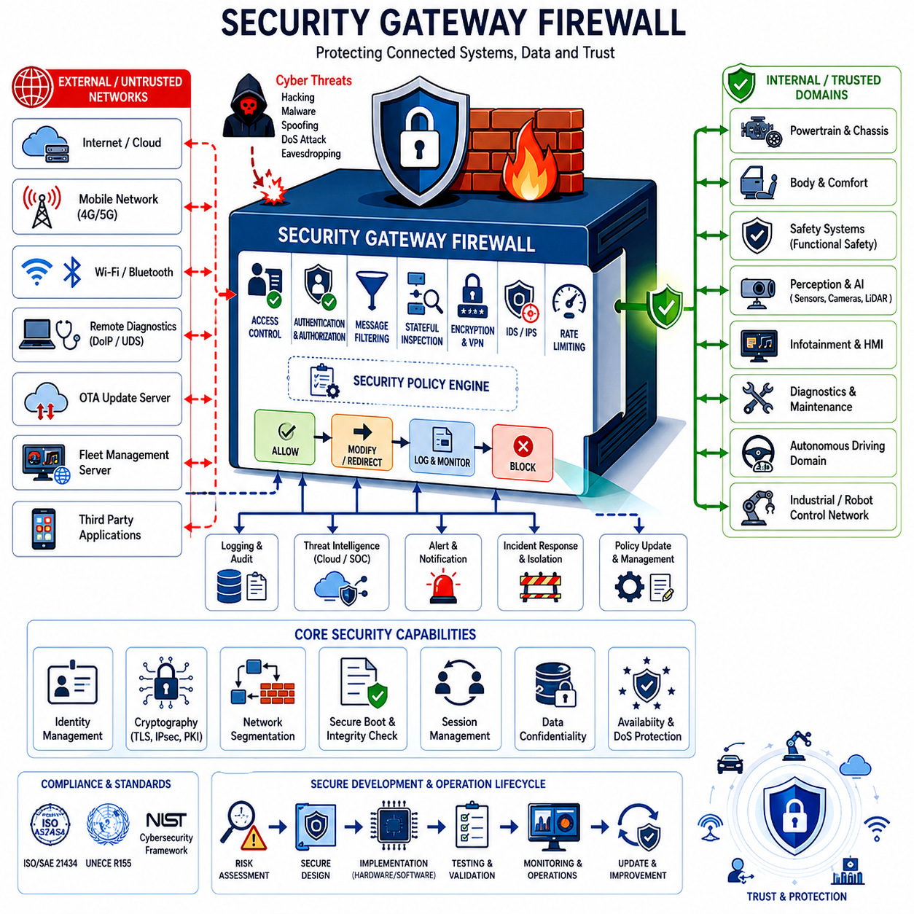
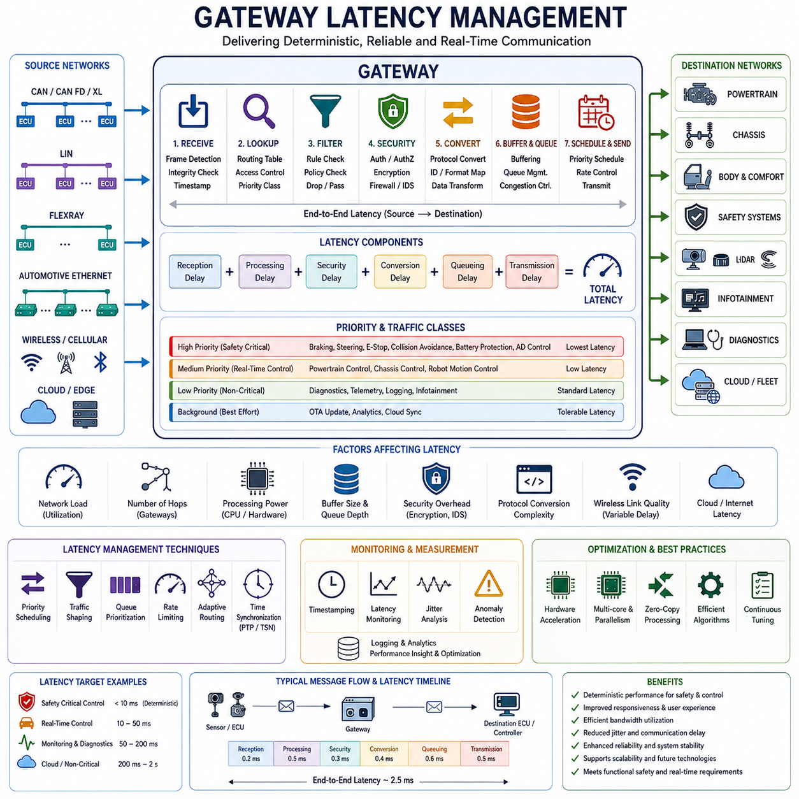
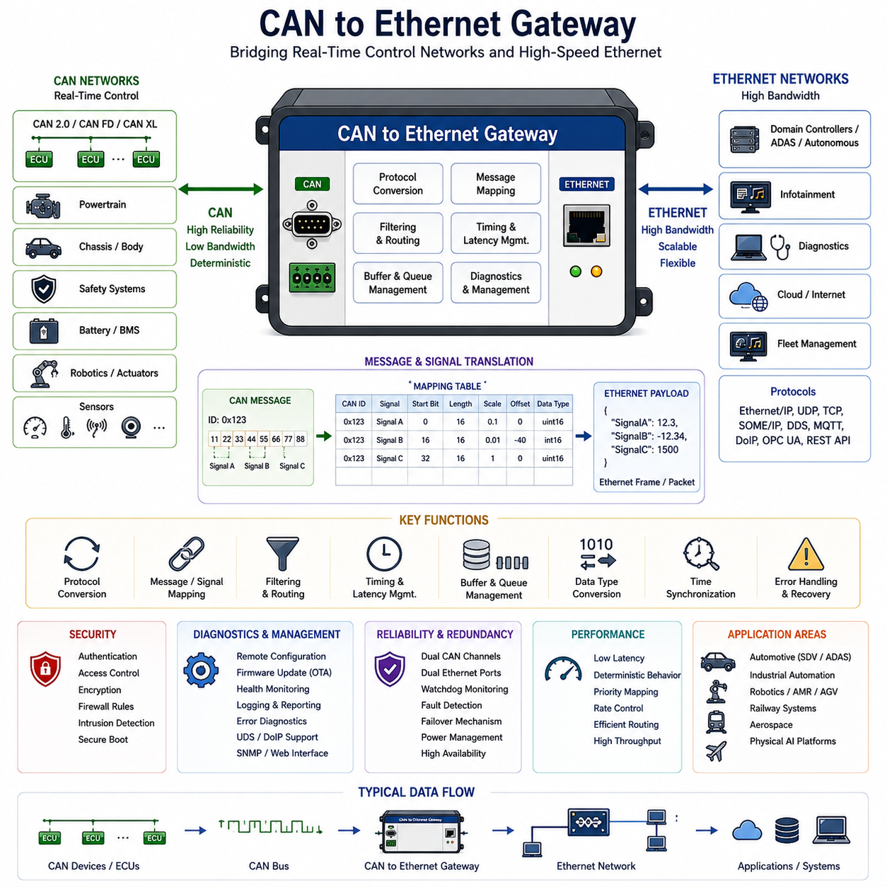

**Volume 06 Automotive Communication**

# Chapter 8. Gateway Design

## 8.1 Protocol Conversion Architecture

{width="7.268055555555556in" height="7.268055555555556in"}

Protocol Conversion Architecture is one of the most important building blocks of modern vehicle communication systems because it enables heterogeneous networks using different communication standards to operate together as a unified system. In early vehicle electronics, most electronic control units communicated using a single communication protocol. As vehicle functionality increased and communication requirements diversified, multiple communication technologies began to coexist within the same platform. Modern vehicles now contain LIN networks for low-cost body electronics, CAN and CAN FD networks for control systems, Automotive Ethernet for high-bandwidth communication, FlexRay in legacy safety systems, wireless communication interfaces, cloud connectivity modules, and diagnostic networks. Similar trends can be observed in autonomous mobile robots, industrial automation systems, humanoid robots, quadruped robots, cargo UAVs, and future Physical AI platforms. As a result, protocol conversion has become a fundamental requirement rather than an optional feature.

At its core, protocol conversion architecture provides a mechanism that allows devices operating under different communication standards to exchange information without requiring direct compatibility between those standards. A protocol converter acts as an intermediary that receives information using one communication protocol, interprets the message content, transforms the data into an appropriate format, and retransmits the information using a different protocol. This process allows systems developed independently or operating under different communication paradigms to interact seamlessly.

The need for protocol conversion arises because communication protocols differ significantly in terms of physical layers, frame structures, addressing schemes, timing mechanisms, synchronization methods, data encoding techniques, security models, and bandwidth characteristics. A CAN node cannot directly communicate with an Ethernet controller because the electrical signaling, frame format, timing behavior, and communication rules are entirely different. Similarly, an EtherCAT motion controller cannot directly interpret LIN messages, and a ROS2 middleware node cannot directly consume raw CAN frames without translation.

Protocol conversion therefore acts as a bridge between communication domains. It allows information generated in one domain to be understood and utilized within another domain while preserving semantic meaning, timing requirements, and operational integrity.

In traditional automotive architectures, protocol conversion was often performed by gateway ECUs. A gateway ECU connected multiple communication buses and acted as a translator between them. For example, a body control module operating on a CAN network might need to exchange information with a diagnostics system operating on Ethernet. The gateway would receive CAN messages, extract the relevant information, map it to corresponding Ethernet structures, and transmit the translated data to the destination network.

As vehicle architectures evolved toward domain controllers and centralized computing systems, protocol conversion became even more important. Modern software-defined vehicles may contain dozens of communication domains. Powertrain systems, chassis systems, body electronics, infotainment systems, autonomous driving modules, cloud connectivity platforms, and cybersecurity services often utilize different communication technologies optimized for their specific requirements.

A typical protocol conversion architecture consists of several major functional components. The first component is the protocol interface layer. This layer contains physical interfaces and communication controllers capable of connecting to different network types. A gateway may include CAN transceivers, CAN FD controllers, Ethernet PHYs, LIN transceivers, FlexRay controllers, RS-485 interfaces, wireless modules, and other communication hardware. Each interface is responsible for receiving and transmitting data according to the rules of its respective protocol.

Above the interface layer resides the protocol parsing layer. This component interprets incoming communication frames and extracts meaningful information. Raw bits arriving from a communication network are converted into structured messages, signal values, status information, diagnostic data, or application-level commands. The parser understands protocol-specific structures such as CAN identifiers, Ethernet packet headers, LIN schedules, UDS diagnostic messages, or DDS topics.

The next component is the data abstraction layer. This layer is one of the most important elements of protocol conversion architecture because it separates application meaning from protocol-specific representation. Instead of working directly with CAN frames or Ethernet packets, the system represents information using protocol-independent data objects. For example, vehicle speed, steering angle, battery voltage, motor temperature, obstacle distance, or GPS position may be represented as abstract signals regardless of how they are transmitted.

This abstraction allows protocol conversion systems to focus on information content rather than communication format. Once information has been converted into a common internal representation, it can be transmitted through any supported communication protocol.

The mapping layer performs the actual translation process. Signal mappings define how information received from one protocol should be represented in another protocol. For example, a vehicle speed signal transmitted as a CAN message may be converted into an Ethernet UDP packet, a DDS topic, a ROS2 message, a Modbus register, or a cloud API payload. Mapping tables define scaling factors, data types, units, encoding rules, address mappings, and message relationships.

Mapping complexity increases significantly as systems become larger. A modern autonomous vehicle may contain thousands of communication signals distributed across multiple networks. Maintaining consistent signal definitions becomes a major engineering challenge. Many organizations therefore use centralized signal databases, DBC files, AUTOSAR descriptions, Interface Definition Languages (IDL), or digital communication models to manage protocol mappings systematically.

Timing management is another critical aspect of protocol conversion architecture. Different communication protocols operate according to different timing models. CAN utilizes event-driven arbitration. LIN uses scheduled communication. Ethernet employs packet switching. TSN uses deterministic scheduling. DDS may utilize publish-subscribe communication. Protocol conversion systems must reconcile these timing differences while preserving system behavior.

For example, a steering control signal originating on a CAN bus may require deterministic delivery to an Ethernet-based autonomous driving controller within a specified latency budget. The gateway must therefore manage buffering, scheduling, prioritization, and transmission timing carefully to avoid introducing unacceptable delays.

Latency management becomes increasingly important as communication networks grow more complex. Every conversion step introduces processing overhead. Frame reception, parsing, abstraction, mapping, validation, security verification, and retransmission all consume time. Engineers must ensure that protocol conversion delays remain within acceptable limits for the intended application.

Safety-critical systems impose particularly stringent latency requirements. Brake-by-wire systems, steer-by-wire architectures, autonomous driving functions, and collision avoidance systems may require communication delays measured in milliseconds or even microseconds. Protocol conversion architectures supporting such applications must be carefully optimized and validated.

Data consistency represents another important challenge. Information may be transmitted at different update rates across different communication domains. A CAN message may update every ten milliseconds while a corresponding Ethernet system operates at one-millisecond intervals. Protocol converters must manage synchronization, buffering, interpolation, and stale-data detection to maintain consistent system behavior.

Cybersecurity considerations have become increasingly important within protocol conversion architectures. Modern gateways frequently serve as security boundaries separating different communication domains. External interfaces such as cloud connections, wireless communication systems, diagnostic ports, and remote access services introduce potential attack vectors.

Security gateways therefore perform protocol conversion alongside authentication, encryption, firewall filtering, intrusion detection, access control, and message validation. Rather than simply forwarding messages, modern gateways actively inspect communication traffic and enforce cybersecurity policies.

Automotive Ethernet has significantly transformed protocol conversion architecture. Traditional gateway systems primarily connected relatively low-bandwidth fieldbus networks. Ethernet enables centralized computing architectures in which large volumes of sensor data, diagnostic traffic, software updates, and cloud communication converge through high-performance backbone networks.

In autonomous vehicles, protocol conversion often occurs between sensor networks and centralized perception systems. Cameras may utilize Gigabit Ethernet, radars may communicate through Ethernet or CAN FD, inertial sensors may employ SPI interfaces, GNSS receivers may use serial communication, and vehicle actuators may operate through CAN networks. The protocol conversion architecture integrates these diverse communication technologies into a unified computational framework.

The same challenges appear in advanced robotics systems. A mobile manipulator may contain EtherCAT servo networks, CAN FD motor controllers, Ethernet perception systems, ROS2 middleware, DDS communication layers, MQTT cloud interfaces, and REST-based management services. Without protocol conversion mechanisms, these systems would operate as isolated communication islands.

ROS2-based robotic platforms provide a useful example. Most robotic applications operate using DDS middleware. However, low-level motor controllers frequently communicate using CAN FD, EtherCAT, or proprietary fieldbus technologies. Protocol conversion layers translate low-level device communication into DDS topics that can be consumed by higher-level software components. This separation improves modularity, scalability, and maintainability.

Industrial automation systems rely heavily on protocol conversion as well. Factories frequently contain equipment from multiple vendors utilizing Modbus RTU, Modbus TCP, EtherCAT, PROFINET, EtherNet/IP, OPC UA, and proprietary communication standards. Industrial gateways enable these systems to exchange information despite protocol differences.

Cloud integration introduces another layer of protocol conversion. Data originating from embedded controllers often undergoes multiple conversion stages before reaching cloud platforms. A CAN message may be converted into Ethernet packets, translated into DDS topics, processed by middleware services, transformed into MQTT messages, and ultimately stored within cloud databases. Each stage requires careful protocol conversion while preserving data integrity and timing requirements.

Scalability is a major design consideration for protocol conversion architecture. Future vehicle and robotics platforms will continue integrating new communication technologies. A well-designed architecture should accommodate new protocols without requiring extensive redesign. This objective is often achieved through modular software frameworks, service-oriented architectures, and standardized data abstraction models.

Functional safety requirements further complicate protocol conversion design. Safety-critical communication pathways must ensure message integrity, fault detection, redundancy management, and deterministic behavior. Protocol converters supporting safety functions often implement error checking, message validation, timeout monitoring, sequence verification, and redundancy mechanisms.

Testing and validation are essential because protocol conversion systems sit at the intersection of multiple communication domains. Engineers must verify protocol compliance, timing behavior, throughput performance, fault handling, cybersecurity effectiveness, scalability characteristics, and interoperability. Comprehensive validation often includes simulation testing, hardware-in-the-loop evaluation, network analysis, latency measurements, fault injection, and cybersecurity assessments.

For Hills Robotics platforms, including Indoor AMRs, Outdoor Autonomous Vehicles, Inspection Robots, Mobile Manipulators, Quadruped Robots, Humanoid Systems, and future Cargo UAV architectures, protocol conversion architecture serves as a foundational integration technology. Low-level motor networks based on CAN FD, safety systems utilizing dedicated communication channels, perception systems operating over Automotive Ethernet, ROS2 middleware using DDS, cloud communication through MQTT, fleet management services, and AI computing platforms must all exchange information efficiently. A robust protocol conversion architecture allows these diverse subsystems to operate as a single coherent platform while preserving reliability, scalability, cybersecurity, and real-time performance. This capability becomes increasingly important as robotics platforms evolve toward centralized computing, AI-native autonomy, cloud connectivity, and software-defined operation.

Ultimately, protocol conversion architecture is not simply a communication bridge. It is the digital nervous system that enables heterogeneous technologies to function together as a unified intelligent machine. As future mobility platforms continue integrating increasingly diverse communication technologies, protocol conversion will remain one of the most critical architectural disciplines in vehicle, robotics, aerospace, and Physical AI system engineering.

## 8.2 Routing Table Design

{width="7.268055555555556in" height="7.268055555555556in"}

Routing Table Design is a fundamental discipline in modern gateway engineering and network architecture. As automotive, railway, aerospace, industrial automation, robotics, and Physical AI systems continue to evolve toward increasingly distributed and interconnected electronic architectures, the role of routing tables becomes more critical than ever. A routing table serves as the decision-making framework that determines how information flows between network segments, communication domains, electronic control units, sensors, actuators, computing platforms, and cloud-connected services. Within a gateway, the routing table acts as the intelligence layer responsible for forwarding, filtering, prioritizing, translating, securing, and managing messages that travel across heterogeneous communication networks. In many respects, the overall performance, reliability, cybersecurity, scalability, and maintainability of a communication architecture are heavily influenced by the quality of its routing table design.

In early vehicle communication systems, network structures were relatively simple. Most Electronic Control Units communicated directly through a single CAN bus or a small number of interconnected buses. Communication paths were predictable, network traffic volumes were relatively low, and the number of ECUs was limited. As modern vehicles and robotic systems became more sophisticated, communication complexity increased dramatically. Today\'s architectures may contain dozens or even hundreds of networked devices operating across multiple communication technologies including LIN, CAN, CAN FD, CAN XL, FlexRay, Automotive Ethernet, EtherCAT, PROFINET, DDS, MQTT, and cloud-based communication services. These systems generate enormous amounts of real-time data that must be delivered accurately and efficiently. Routing tables therefore provide a structured mechanism for controlling information exchange while preventing unnecessary network congestion and ensuring deterministic operation.

The primary purpose of a routing table is to define the path that communication traffic should follow throughout a distributed system. Every message entering a gateway is evaluated according to routing rules. These rules specify the source network, destination network, message identifier, priority classification, forwarding conditions, security requirements, and protocol translation mechanisms associated with the message. Based on this information, the gateway determines whether the message should be forwarded, filtered, modified, aggregated, translated, delayed, duplicated, or discarded. The routing table therefore transforms a gateway from a simple communication bridge into an intelligent network management device.

A routing table entry typically contains several key parameters. These include the source interface, destination interface, protocol type, message identifier, signal mapping information, priority level, bandwidth allocation, timeout thresholds, update rates, diagnostic permissions, and security policies. When a message arrives at the gateway, the routing engine performs a lookup operation against the routing table database. Once a matching rule is found, the corresponding action is executed. Modern routing engines often support thousands of routing entries and perform lookup operations within microseconds to satisfy real-time communication requirements.

One of the most important design objectives of a routing table is bandwidth optimization. Communication resources are always limited regardless of network technology. Traditional CAN networks may operate at speeds ranging from 125 kbps to 1 Mbps, while CAN FD extends bandwidth further and Automotive Ethernet provides even higher throughput. Nevertheless, indiscriminate forwarding of all traffic across all network segments would rapidly consume available bandwidth and reduce overall system performance. Routing tables therefore implement selective forwarding strategies that ensure only relevant information reaches its intended destination. By eliminating unnecessary communication traffic, network utilization can be optimized while maintaining deterministic system behavior.

Filtering is a central component of routing table design. Many messages generated within a network are only relevant to a small subset of devices. For example, a battery management system may periodically transmit cell voltage measurements that are only required by the energy management controller. Forwarding these messages to unrelated subsystems such as infotainment controllers or body electronics would waste network resources. Routing tables allow engineers to define filtering rules that restrict message propagation to authorized destinations. Such filtering mechanisms significantly reduce network load and improve communication efficiency.

Message prioritization represents another essential aspect of routing table engineering. Not all communication traffic carries equal importance. Safety-critical functions such as braking, steering, battery protection, collision avoidance, drive-by-wire control, and emergency shutdown mechanisms require immediate and deterministic communication. In contrast, diagnostic information, software update traffic, telemetry data, or infotainment messages can tolerate higher delays. Routing tables classify traffic according to predefined priority levels and ensure that high-priority messages receive preferential treatment during periods of network congestion. This capability becomes particularly important in autonomous vehicles, industrial robots, and aerospace systems where communication delays may directly affect operational safety.

Protocol translation is a major responsibility of modern gateways and is closely integrated with routing table design. Contemporary electronic architectures often contain multiple communication technologies operating simultaneously. A robotic platform may utilize CAN FD for motor control, Ethernet for perception systems, DDS for distributed computing, and MQTT for cloud connectivity. Similarly, modern vehicles may combine CAN, CAN FD, Ethernet, LIN, and diagnostic communication protocols. Routing tables define how messages are translated when crossing protocol boundaries. Message identifiers, signal formats, data lengths, timestamps, synchronization information, and error detection mechanisms may all require conversion during protocol translation. A well-designed routing table ensures that these transformations occur consistently and accurately.

Signal-level routing has become increasingly important in software-defined architectures. Traditional gateways often forwarded entire messages without modification. Modern gateways frequently perform signal extraction, signal transformation, signal aggregation, and signal redistribution. For example, a CAN frame may contain multiple sensor measurements, only some of which are required by a destination network. Rather than forwarding the entire frame, the gateway may extract specific signals and incorporate them into a new Ethernet packet. Routing tables therefore operate not only at the message level but also at the signal level, enabling more efficient bandwidth utilization and improved network flexibility.

Latency management is another critical consideration in routing table design. Every forwarding operation introduces processing delays. These delays include message reception, routing lookup, filtering, translation, buffering, scheduling, and transmission. While individual delays may be small, cumulative latency across multiple gateways can significantly impact system performance. Routing tables must therefore be optimized to minimize processing overhead while ensuring deterministic communication timing. Engineers often analyze worst-case latency scenarios to verify compliance with system requirements.

Time synchronization requirements further influence routing table architecture. Modern distributed systems increasingly rely on precise timing information for sensor fusion, autonomous navigation, coordinated control, and functional safety. Technologies such as Precision Time Protocol, Time-Sensitive Networking, and hardware-based synchronization mechanisms require routing tables to preserve timestamp integrity across network boundaries. Gateway routing rules must ensure that synchronization traffic is handled appropriately and that timing accuracy is not compromised during protocol conversion or message forwarding.

Scalability is a major design objective for routing table frameworks. Vehicle platforms, robotic fleets, industrial automation systems, and aerospace platforms often evolve over many product generations. New sensors, controllers, communication networks, and software services are continuously introduced throughout the product lifecycle. Routing table structures must therefore support modular expansion without requiring extensive redesign. A scalable routing architecture allows engineers to add new communication paths through configuration updates rather than fundamental software modifications. This approach reduces development effort, simplifies maintenance, and improves long-term system adaptability.

Security has become one of the most important aspects of routing table design. As connected vehicles and intelligent robots gain access to wireless networks, cloud platforms, remote diagnostics systems, and over-the-air update infrastructure, the gateway increasingly serves as a cybersecurity enforcement point. Routing tables play a critical role in controlling communication access between trusted and untrusted domains. Security policies may define which messages are allowed to cross network boundaries, which devices are authorized to communicate, and which communication paths must remain isolated. Unauthorized traffic can be blocked before reaching critical systems. Routing tables can also enforce message authentication requirements, intrusion detection policies, rate limiting mechanisms, and secure communication pathways.

Network segmentation strategies rely heavily on routing table implementation. Modern architectures often divide systems into multiple communication domains such as safety, powertrain, perception, diagnostics, infotainment, fleet management, and cloud connectivity. Routing tables control interactions between these domains and prevent excessive coupling between subsystems. Domain isolation improves fault containment, cybersecurity resilience, maintainability, and overall system robustness. If a fault occurs within one communication domain, carefully designed routing policies can prevent the issue from propagating throughout the entire system.

In autonomous vehicles and Physical AI systems, routing table complexity increases substantially due to the large volume of perception data being generated. Cameras, LiDARs, radars, ultrasonic sensors, GNSS receivers, IMUs, environmental sensors, and AI processing units continuously exchange data at high rates. While raw sensor data is typically transmitted over high-bandwidth Ethernet networks, control commands and status information may continue to utilize CAN-based communication. Routing tables must coordinate communication between these different network layers while ensuring efficient resource utilization and deterministic operation.

Fleet management systems introduce additional routing requirements. Modern robotic fleets often consist of dozens, hundreds, or even thousands of autonomous units communicating with centralized management servers and cloud platforms. Routing tables may define communication paths for telemetry, mission updates, diagnostics, software deployment, health monitoring, predictive maintenance, and operational analytics. Efficient routing policies help minimize communication overhead while ensuring timely delivery of critical operational data.

Diagnostic communication presents another specialized application of routing table design. Service technicians require access to vehicle and robot subsystems for troubleshooting, calibration, software updates, and maintenance procedures. Routing tables determine how diagnostic requests are forwarded through the network and which devices are permitted to respond. Protocols such as UDS and DoIP rely heavily on gateway routing functionality to establish communication pathways between external diagnostic tools and internal electronic systems.

Fault tolerance considerations also influence routing table architecture. Critical systems often implement redundant communication paths to improve reliability and availability. Routing tables may include failover mechanisms that automatically redirect traffic when network failures occur. Redundant Ethernet architectures, dual CAN networks, backup communication channels, and safety-critical communication paths can all be managed through intelligent routing policies. Such capabilities are particularly important in aerospace systems, autonomous transportation platforms, industrial automation environments, and mission-critical robotic applications.

Verification and validation activities are essential throughout routing table development. Engineers must confirm that all required communication paths exist, all unauthorized paths are blocked, timing requirements are satisfied, bandwidth limitations are respected, and fault conditions are handled appropriately. Network simulation tools, bus analyzers, protocol monitoring systems, software-in-the-loop environments, hardware-in-the-loop platforms, and full-system integration testing are commonly employed to validate routing behavior. Comprehensive testing ensures that routing policies remain consistent, predictable, and secure under both normal and abnormal operating conditions.

As software-defined vehicles, autonomous robots, smart factories, connected infrastructure systems, and Physical AI platforms continue to evolve, routing tables will become increasingly sophisticated. Future gateways are expected to incorporate dynamic routing, adaptive bandwidth management, AI-assisted traffic optimization, cybersecurity-aware communication policies, and cloud-integrated network orchestration. Rather than serving merely as static configuration databases, routing tables will evolve into intelligent communication management frameworks capable of adapting to changing operational conditions in real time.

Ultimately, Routing Table Design forms the foundation of modern gateway communication architecture. It governs how information flows across complex distributed systems, enabling interoperability between heterogeneous networks while maintaining efficiency, reliability, security, scalability, and real-time performance. Whether deployed in passenger vehicles, commercial transportation systems, industrial automation platforms, autonomous mobile robots, mobile manipulators, humanoid robots, quadruped robots, or future Physical AI ecosystems, a carefully engineered routing table remains one of the most important components for achieving robust and dependable communication infrastructure.

## 8.3 Security Gateway Firewall

{width="7.268055555555556in" height="7.268055555555556in"}

Security Gateway Firewall is one of the most important architectural elements in modern connected vehicles, autonomous robots, industrial automation systems, railway communication networks, aerospace platforms, and Physical AI infrastructures. As electronic systems become increasingly interconnected and dependent on external communication channels, the traditional concept of isolated embedded systems is rapidly disappearing. Modern systems routinely communicate with cloud platforms, fleet management servers, remote diagnostic tools, mobile applications, software update services, edge computing infrastructure, and third-party ecosystems. While this connectivity enables significant improvements in functionality, efficiency, maintainability, and user experience, it simultaneously introduces new cybersecurity risks. The Security Gateway Firewall serves as the primary defensive barrier between trusted internal networks and potentially untrusted external communication domains.

Historically, automotive Electronic Control Units (ECUs) operated within closed communication environments where physical access to the network was required to interact with the system. Under such conditions, cybersecurity threats were relatively limited. However, the introduction of telematics systems, Wi-Fi connectivity, Bluetooth interfaces, cellular communication, cloud services, Vehicle-to-Everything (V2X) technologies, remote diagnostics, and Over-The-Air (OTA) update capabilities fundamentally changed the threat landscape. Modern vehicles and robots can now be accessed remotely through multiple communication channels, making them potential targets for cyberattacks. Security Gateway Firewalls have therefore become essential components for protecting critical systems from unauthorized access and malicious activities.

The fundamental purpose of a Security Gateway Firewall is to control communication traffic entering and leaving protected network domains. Similar to enterprise network firewalls used in information technology systems, a security gateway examines communication traffic, evaluates security policies, and determines whether messages should be permitted, modified, redirected, logged, rate-limited, quarantined, or blocked entirely. Unlike traditional IT firewalls, however, automotive and robotic gateways must operate under strict real-time constraints while maintaining functional safety requirements. This creates unique design challenges that require specialized security architectures optimized for embedded systems.

Within a modern vehicle architecture, the security gateway typically resides between external communication interfaces and internal control networks. External interfaces may include cellular modems, Wi-Fi access points, Bluetooth modules, cloud communication gateways, telematics control units, diagnostic ports, and fleet management systems. Internal networks may include CAN, CAN FD, CAN XL, Automotive Ethernet, LIN, FlexRay, EtherCAT, DDS-based robotic communication networks, and safety-critical control buses. The security gateway acts as a controlled checkpoint through which all communication traffic must pass before reaching protected subsystems.

One of the primary functions of a security gateway firewall is access control. Not every device, user, application, or service should have unrestricted access to internal networks. Access control policies define who may communicate with specific resources and under what conditions communication is permitted. These policies may be based on user identity, device identity, cryptographic credentials, network location, communication protocol, operational state, or security clearance level. Through carefully designed access control mechanisms, the gateway ensures that only authorized entities can interact with critical vehicle and robotic systems.

Message filtering is another essential capability. Every communication packet entering the gateway is evaluated according to predefined security rules. These rules examine source addresses, destination addresses, message identifiers, protocol types, payload characteristics, timing behavior, authentication status, and communication context. Messages that violate security policies can be blocked before reaching protected networks. Filtering mechanisms reduce attack surfaces by preventing unauthorized or suspicious traffic from propagating throughout the system.

Modern security gateways often implement stateful inspection techniques. Traditional filtering systems evaluate individual packets independently, while stateful inspection monitors entire communication sessions. By tracking session states, communication sequences, authentication status, and protocol behavior, the gateway can identify abnormal activities that may not be visible through simple packet filtering. Stateful inspection is particularly useful for detecting protocol misuse, session hijacking attempts, unauthorized diagnostic access, and advanced cyberattacks targeting communication infrastructure.

Authentication mechanisms play a central role in security gateway design. Before communication is permitted, users, devices, applications, or services must prove their identities. Authentication may be performed using passwords, certificates, cryptographic keys, hardware security modules, trusted platform modules, digital signatures, or challenge-response protocols. Strong authentication prevents unauthorized entities from gaining access to protected systems and provides a foundation for trust within distributed communication environments.

Authorization extends authentication by determining what actions authenticated entities are allowed to perform. For example, a service technician may be authorized to read diagnostic information but not modify safety-critical calibration parameters. A fleet management server may be permitted to receive telemetry data while being prohibited from directly controlling vehicle motion. Security gateway firewalls enforce authorization policies by restricting communication privileges according to predefined security requirements.

Encryption support is another critical function. Sensitive communication data should be protected against interception, modification, and eavesdropping during transmission. Security gateways often support Transport Layer Security (TLS), Internet Protocol Security (IPsec), Secure Shell (SSH), Virtual Private Networks (VPNs), and other cryptographic communication protocols. Encryption ensures confidentiality, integrity, and authenticity of communication data across both public and private networks.

Intrusion Detection Systems (IDS) and Intrusion Prevention Systems (IPS) are increasingly integrated into modern security gateways. These systems continuously monitor communication traffic for indicators of malicious activity. Detection mechanisms may rely on signature-based analysis, anomaly detection algorithms, behavioral monitoring, machine learning models, statistical analysis, or rule-based threat identification techniques. When suspicious behavior is detected, the gateway can generate alerts, block communication paths, isolate affected subsystems, or initiate predefined security responses.

Network segmentation represents a foundational cybersecurity principle implemented through security gateway firewalls. Rather than allowing unrestricted communication between all system components, architectures are divided into separate security domains. Examples include powertrain domains, safety domains, perception domains, infotainment domains, cloud connectivity domains, maintenance domains, and autonomous driving domains. Security gateways regulate communication between these domains, ensuring that compromises within one area do not automatically spread throughout the entire system.

In Software Defined Vehicles (SDVs), autonomous robots, and Physical AI systems, domain-based and zonal architectures significantly increase the importance of security gateways. Centralized computing platforms process information from numerous sensors and actuators while communicating with external services. Security gateways provide isolation boundaries that protect high-value computational assets from less trusted communication channels. As computing centralization increases, the potential impact of cybersecurity incidents also grows, making robust firewall architectures essential.

Diagnostic communication presents unique cybersecurity challenges. Service protocols such as Unified Diagnostic Services (UDS), Diagnostics over Internet Protocol (DoIP), and proprietary maintenance interfaces provide powerful capabilities for accessing and modifying system behavior. While these capabilities are necessary for maintenance and development activities, they can also be exploited by attackers if not properly secured. Security gateways therefore control diagnostic access through authentication, authorization, session management, logging, and policy enforcement mechanisms.

Over-The-Air software updates are another major area of focus. OTA technologies enable manufacturers to deploy software improvements, bug fixes, cybersecurity patches, and feature enhancements without requiring physical service visits. However, OTA infrastructure also creates potential attack vectors. Security gateway firewalls protect OTA processes through secure boot mechanisms, cryptographic signature verification, encrypted communication channels, integrity validation procedures, and update authorization controls. These measures help ensure that only trusted software can be installed on the system.

Rate limiting mechanisms are commonly implemented to protect against denial-of-service attacks and resource exhaustion scenarios. Attackers may attempt to flood communication networks with excessive traffic in order to disrupt normal operations. Security gateways can monitor traffic volumes and enforce transmission limits for specific communication channels, devices, or services. By controlling traffic rates, gateways help maintain system availability even during hostile conditions.

Event logging and security auditing capabilities are essential for cybersecurity monitoring and incident investigation. Security gateways continuously record communication events, authentication attempts, policy violations, anomaly detections, system errors, configuration changes, and security incidents. These logs provide valuable information for forensic analysis, compliance verification, vulnerability assessment, and security operations activities. Comprehensive logging also supports regulatory requirements associated with cybersecurity standards.

Threat intelligence integration is becoming increasingly important in advanced security architectures. Security gateways may receive threat information from cloud-based cybersecurity platforms, fleet management systems, or centralized security operation centers. By incorporating current threat intelligence data, gateways can dynamically update security policies and improve protection against emerging attack techniques. This adaptive security capability enhances long-term resilience against evolving cybersecurity threats.

Functional safety and cybersecurity must coexist within modern embedded systems. Security controls should never interfere with the safe operation of critical functions. A security gateway must therefore be carefully designed to balance security requirements with safety objectives. Safety-critical communication paths may require special treatment to ensure that security mechanisms do not introduce unacceptable delays or failure modes. This interaction between cybersecurity and functional safety is increasingly addressed through coordinated engineering methodologies.

The development of security gateway firewalls requires a comprehensive risk assessment process. Engineers must identify potential attack surfaces, threat actors, vulnerabilities, assets, trust boundaries, communication pathways, and operational scenarios. Security requirements are then derived from risk analysis results and translated into technical controls implemented within the gateway architecture. Continuous validation and penetration testing are necessary to verify the effectiveness of these protections.

Verification and validation activities include security testing, vulnerability scanning, fuzz testing, penetration testing, protocol robustness testing, authentication verification, encryption assessment, intrusion detection evaluation, and incident response validation. Security gateways must demonstrate reliable operation under both normal and hostile conditions. Testing often involves simulated cyberattacks designed to evaluate system resilience against real-world threat scenarios.

International standards increasingly define cybersecurity requirements for connected systems. In the automotive industry, standards such as ISO/SAE 21434 and regulations such as UNECE R155 establish cybersecurity management requirements throughout the vehicle lifecycle. Similar standards are emerging across robotics, industrial automation, aerospace, railway, and critical infrastructure sectors. Security Gateway Firewalls play a central role in achieving compliance with these cybersecurity frameworks.

Future security gateways are expected to become increasingly intelligent and adaptive. Artificial Intelligence, machine learning, behavioral analytics, zero-trust architectures, distributed trust management, secure hardware accelerators, and autonomous threat response mechanisms will likely become standard components of next-generation cybersecurity systems. Rather than serving solely as passive filtering devices, future gateways will operate as intelligent security platforms capable of continuously assessing risks, adapting policies, detecting threats, and coordinating defensive actions across entire fleets of connected systems.

Ultimately, Security Gateway Firewall architecture forms the cybersecurity foundation of modern connected vehicles, intelligent robots, industrial automation systems, and Physical AI ecosystems. It establishes trust boundaries, controls communication flows, protects critical assets, enforces security policies, supports regulatory compliance, and mitigates evolving cyber threats. As connectivity, autonomy, and software-defined functionality continue to expand across transportation and robotics industries, the importance of robust Security Gateway Firewall design will continue to grow, becoming one of the most critical elements of future electronic and communication architectures.

## 8.4 Gateway Latency Management

{width="7.268055555555556in" height="7.268055555555556in"}

Gateway Latency Management is one of the most important engineering disciplines in modern communication architectures because it directly affects system responsiveness, determinism, safety, reliability, and overall operational performance. In automotive systems, autonomous vehicles, industrial automation platforms, railway communication networks, aerospace systems, autonomous mobile robots, humanoid robots, and Physical AI infrastructures, gateways act as communication bridges between heterogeneous networks. While gateways provide essential functions such as routing, protocol conversion, security enforcement, diagnostics, filtering, and traffic management, they also introduce communication delays. These delays, commonly referred to as latency, must be carefully controlled to ensure that critical information reaches its destination within required time constraints.

In simple communication architectures, latency may not represent a major concern because devices communicate directly over a single network segment. However, modern distributed systems frequently contain multiple communication domains interconnected through several gateways. Messages may traverse CAN networks, CAN FD networks, Automotive Ethernet backbones, wireless communication links, cloud services, and edge computing infrastructure before reaching their final destination. Every communication hop introduces processing overhead. Without proper latency management, accumulated delays can degrade control performance, reduce system responsiveness, and potentially create safety hazards.

Latency can be defined as the total time required for information to travel from its source to its destination. In gateway systems, latency consists of multiple components. These include message reception delay, protocol decoding time, routing table lookup time, filtering operations, security validation, protocol conversion processing, buffering delay, scheduling delay, queue management overhead, transmission preparation, and physical transmission time. Each individual component may only contribute a few microseconds or milliseconds, but together they can significantly affect end-to-end communication performance.

The first stage of gateway latency occurs when a message is received from an incoming communication interface. Before any routing decision can be made, the gateway must detect the incoming frame, validate its integrity, and transfer the data into internal memory buffers. Depending on the protocol being used, this process may involve cyclic redundancy check verification, frame structure validation, timestamp generation, and error detection procedures. High-performance gateway architectures are designed to minimize reception latency through hardware acceleration and efficient driver implementation.

Following message reception, routing decision processing introduces additional latency. The gateway must determine where the message should be forwarded and what operations should be applied. This requires routing table lookup operations, access control evaluations, priority classification, and policy verification. Modern gateways may maintain thousands of routing entries, particularly in software-defined vehicles and large robotic systems. Efficient lookup algorithms and optimized memory structures are therefore critical for minimizing processing delays.

Security processing has become an increasingly significant contributor to gateway latency. Modern communication architectures require authentication, authorization, encryption, decryption, digital signature verification, intrusion detection, and firewall policy enforcement. While these security functions provide essential protection against cyber threats, they also consume computational resources. Gateway designers must carefully balance cybersecurity requirements with real-time communication constraints. Hardware security modules, cryptographic accelerators, and dedicated security processors are often employed to reduce security-related latency.

Protocol conversion represents another major source of delay. Modern gateways frequently translate communication between CAN, CAN FD, CAN XL, LIN, Automotive Ethernet, DDS, MQTT, and cloud communication protocols. During this process, message structures may need to be reformatted, identifiers translated, payloads reconstructed, timestamps preserved, and synchronization information updated. Complex protocol transformations require computational effort and can introduce measurable delays. Efficient software architecture and optimized conversion algorithms are essential for maintaining low latency.

Buffering and queue management significantly influence gateway performance. Incoming messages are typically stored in temporary memory buffers before processing. If communication traffic exceeds processing capacity, messages may accumulate in queues, resulting in increased waiting times. This phenomenon is particularly problematic during peak traffic conditions where large numbers of messages arrive simultaneously. Gateway latency management therefore includes careful design of buffer allocation strategies, queue prioritization policies, and congestion control mechanisms.

Message prioritization plays a critical role in controlling latency. Not all communication traffic carries equal importance. Safety-critical messages related to braking, steering, emergency stop systems, collision avoidance, traction control, battery protection, and autonomous navigation require deterministic delivery with minimal delay. Less critical traffic such as diagnostics, software updates, telemetry, maintenance data, or infotainment communication can tolerate longer delays. Gateway schedulers therefore assign higher priority to time-sensitive traffic while allocating remaining bandwidth to lower-priority communications.

Deterministic communication is often more important than achieving the lowest possible latency. In safety-critical systems, engineers must know the maximum latency that may occur under worst-case operating conditions. Predictability allows system designers to guarantee safe behavior even during high network utilization. Gateway latency management therefore focuses not only on reducing average delay but also on controlling latency variation, commonly referred to as jitter. Excessive jitter can disrupt synchronized operations, sensor fusion algorithms, control loops, and distributed computing systems.

Time synchronization mechanisms are closely related to latency management. Modern autonomous systems depend on precise timing information to coordinate sensors, actuators, controllers, and distributed computing resources. Technologies such as Precision Time Protocol, Time Sensitive Networking, hardware timestamping, and synchronized clock distribution help maintain temporal consistency throughout the communication architecture. Gateways must preserve synchronization information while minimizing timing distortion introduced by routing operations.

Automotive Ethernet and Time Sensitive Networking have significantly changed gateway latency management strategies. Traditional CAN networks utilize arbitration-based communication where latency depends on bus utilization and message priority. Ethernet-based systems introduce switched network architectures capable of supporting higher bandwidth and deterministic scheduling. Time Sensitive Networking extends Ethernet with traffic shaping, time-aware scheduling, resource reservation, and bounded latency guarantees. Modern gateway architectures increasingly leverage these technologies to support advanced autonomous functions.

Software-defined vehicle architectures introduce new latency management challenges. Traditional vehicles distributed functionality across numerous ECUs connected through dedicated communication networks. Modern architectures consolidate computation into centralized domain controllers and high-performance computing platforms. While centralization reduces hardware complexity, it increases communication dependency. Large volumes of sensor data must be transported efficiently between perception systems, decision-making modules, and control systems. Gateway latency therefore becomes a critical factor affecting overall system responsiveness.

Autonomous driving systems place particularly stringent requirements on latency management. Sensor data from cameras, LiDARs, radars, ultrasonic sensors, GNSS receivers, and IMUs must be delivered rapidly and consistently to perception and planning algorithms. Delays in communication can reduce situational awareness, increase decision-making latency, and negatively affect vehicle safety. Gateway architectures supporting autonomous functions must therefore be optimized for ultra-low latency and deterministic communication behavior.

Industrial automation environments present similar challenges. Manufacturing systems frequently employ EtherCAT, PROFINET, EtherNet/IP, OPC UA, and various fieldbus technologies. Motion control systems often require synchronization accuracy measured in microseconds. Gateways connecting these networks must maintain deterministic communication performance while supporting protocol interoperability. Excessive latency can directly impact machine precision, production efficiency, and process quality.

Robotic systems introduce additional complexity because they often combine real-time control networks with high-bandwidth perception networks and cloud connectivity services. Mobile robots, autonomous forklifts, inspection robots, humanoids, quadrupeds, and mobile manipulators all depend on efficient communication between sensors, controllers, AI processors, and fleet management systems. Gateway latency directly influences navigation accuracy, obstacle avoidance performance, manipulation precision, and coordinated multi-robot operations.

Wireless communication introduces unique latency challenges. Wi-Fi, Bluetooth, cellular networks, private 5G systems, and satellite communication links exhibit variable latency characteristics due to environmental conditions, signal quality, network congestion, and transmission scheduling. Gateways integrating wireless communication channels must compensate for these variations through buffering strategies, adaptive routing policies, predictive scheduling mechanisms, and quality-of-service management techniques.

Cloud-connected systems further complicate latency management because communication paths extend beyond local networks. Data may travel through internet infrastructure, cloud data centers, edge computing platforms, and remote service providers. While cloud connectivity provides powerful computational capabilities and centralized management functions, it also introduces unpredictable network delays. Critical real-time functions must therefore remain localized whenever possible, while cloud services are reserved for non-time-critical operations such as analytics, fleet management, software deployment, and long-term optimization.

Latency monitoring is an essential aspect of gateway operation. Modern gateways continuously measure communication performance using timestamps, traffic statistics, queue utilization metrics, packet delay measurements, jitter analysis, and network health indicators. Real-time monitoring enables detection of abnormal communication behavior before performance degradation affects system operation. Monitoring data also supports predictive maintenance and long-term performance optimization.

Simulation and modeling play important roles in latency management during system development. Engineers use communication network simulators, digital twins, software-in-the-loop environments, and hardware-in-the-loop testing platforms to evaluate latency behavior under various operating conditions. These tools allow designers to identify bottlenecks, optimize routing policies, validate timing requirements, and assess worst-case communication scenarios before deployment.

Performance optimization techniques include hardware acceleration, multicore processing, direct memory access, zero-copy communication mechanisms, hardware timestamping, intelligent scheduling algorithms, adaptive queue management, and protocol-specific optimizations. Modern gateway platforms increasingly incorporate specialized communication processors and network accelerators designed specifically to reduce latency while maintaining high throughput.

Cybersecurity considerations must also be integrated into latency management strategies. Security controls should not introduce unacceptable communication delays that compromise functional safety requirements. Gateway architects therefore carefully evaluate the performance impact of encryption, authentication, intrusion detection, and firewall processing. Hardware-based security acceleration is frequently employed to achieve both strong cybersecurity and low latency simultaneously.

Verification and validation activities are essential for confirming latency performance. Engineers perform timing analysis, stress testing, congestion testing, fault injection experiments, protocol compliance testing, and worst-case latency measurements. Validation ensures that communication requirements are satisfied under all expected operating conditions, including abnormal situations such as network failures, excessive traffic loads, and cyberattack scenarios.

Future communication architectures are expected to rely increasingly on intelligent latency management mechanisms. Artificial intelligence, machine learning, adaptive traffic control, predictive congestion management, autonomous routing optimization, and software-defined networking technologies will allow gateways to dynamically adjust communication behavior in response to changing operational conditions. Such capabilities will become increasingly important as autonomous systems grow in complexity and scale.

Ultimately, Gateway Latency Management serves as a foundational discipline for achieving reliable, deterministic, and efficient communication in modern distributed systems. It ensures that critical information reaches its destination within acceptable time limits, supports functional safety objectives, enhances system responsiveness, and enables the successful operation of connected vehicles, autonomous robots, industrial automation platforms, aerospace systems, railway networks, and future Physical AI ecosystems. As communication architectures continue to evolve toward higher levels of connectivity, autonomy, and intelligence, effective latency management will remain one of the most important factors determining overall system performance and operational success.

## 8.5 CAN to Ethernet Gateway

{width="7.268055555555556in" height="7.268055555555556in"}

The CAN to Ethernet Gateway is one of the most important communication components in modern distributed electronic architectures. As vehicles, robots, industrial automation systems, railway platforms, aerospace systems, and Physical AI infrastructures continue to evolve toward centralized computing and high-bandwidth networking, communication technologies must support both legacy real-time control networks and modern data-intensive applications. The CAN to Ethernet Gateway serves as the bridge between these two worlds. It enables interoperability between Controller Area Network (CAN) based systems, which have been the backbone of embedded control networks for decades, and Ethernet-based communication infrastructures that now dominate high-performance computing, sensor fusion, cloud connectivity, fleet management, and software-defined architectures.

Historically, CAN networks were designed to provide reliable, deterministic, and low-cost communication among Electronic Control Units (ECUs). Their robustness, fault tolerance, and simplicity made them the preferred communication technology for automotive control systems, industrial equipment, mobile machinery, and robotic platforms. However, the bandwidth limitations of CAN became increasingly apparent as modern systems began generating massive volumes of data from cameras, LiDARs, radars, high-resolution sensors, artificial intelligence processors, and cloud-connected services. While CAN remains highly effective for real-time control applications, Ethernet provides significantly greater bandwidth, scalability, and flexibility. The CAN to Ethernet Gateway emerged as a critical architectural component that allows both technologies to coexist within a single system.

The fundamental role of the gateway is to receive messages from one communication domain, interpret their contents, and transmit equivalent information into another communication domain using the appropriate protocol. On the CAN side, the gateway receives standard CAN, CAN FD, or future CAN XL frames. On the Ethernet side, the gateway typically communicates using protocols such as UDP, TCP, IP, SOME/IP, DDS, MQTT, OPC UA, REST APIs, or proprietary communication frameworks. The gateway performs protocol conversion while preserving the semantic meaning of the information being transmitted. This allows devices operating on fundamentally different communication technologies to exchange information seamlessly.

A modern CAN to Ethernet Gateway consists of several major hardware and software components. The hardware typically includes one or more CAN controllers, CAN transceivers, Ethernet Media Access Controllers (MAC), Ethernet Physical Layer (PHY) devices, memory resources, hardware security modules, and a high-performance microcontroller or processor. The software architecture includes real-time operating system services, communication drivers, protocol stacks, routing engines, message mapping databases, diagnostic services, security modules, and network management applications. Together, these components create a communication platform capable of translating and managing information flows between heterogeneous networks.

Message mapping represents one of the most important gateway functions. CAN messages utilize compact frame structures with predefined message identifiers and limited payload sizes. Ethernet communication, by contrast, typically employs larger packets capable of carrying substantially more information. The gateway must therefore define how CAN signals are represented within Ethernet packets. Message mapping tables describe the relationships between CAN identifiers, signal positions, scaling factors, engineering units, data types, and Ethernet payload structures. These mappings ensure that information retains its meaning when transferred across network boundaries.

Signal-level mapping has become increasingly important in modern systems. Traditional gateways often operated at the message level, forwarding entire CAN frames into corresponding Ethernet messages. Modern architectures frequently require signal extraction, transformation, aggregation, and redistribution. For example, multiple CAN messages may contain vehicle speed, battery status, steering angle, and brake information. The gateway may collect these signals from different CAN frames and combine them into a single Ethernet packet for transmission to a centralized computing platform. This capability reduces network overhead and improves communication efficiency.

Timing management is another critical aspect of CAN to Ethernet Gateway design. CAN and Ethernet networks operate according to fundamentally different communication principles. CAN utilizes arbitration-based access where message priority determines bus access timing. Ethernet utilizes switched network architectures with independent packet forwarding mechanisms. These differing behaviors can create timing mismatches if not carefully managed. The gateway must preserve real-time characteristics for safety-critical communications while adapting messages to the timing behavior of Ethernet networks.

Latency management plays a central role in gateway performance. Every gateway operation introduces processing delays associated with message reception, filtering, routing, protocol conversion, buffering, scheduling, and transmission. While these delays may appear small individually, they accumulate as messages traverse multiple communication domains. For safety-critical applications such as braking systems, steering systems, battery protection systems, emergency stop functions, autonomous driving controllers, and robotic motion control systems, latency must remain within strictly defined limits. Gateway designers therefore employ optimized software architectures, hardware acceleration mechanisms, efficient routing algorithms, and deterministic scheduling techniques to minimize communication delays.

Buffer management is closely related to latency control. Incoming CAN messages are typically stored temporarily before conversion and forwarding. Similarly, outgoing Ethernet packets may require buffering before transmission. During periods of high network utilization, improper buffer management can result in queue congestion, packet loss, increased latency, and degraded system performance. Modern gateways implement sophisticated queue management policies, priority-based scheduling mechanisms, and congestion control algorithms to maintain predictable communication behavior under varying traffic conditions.

Data type conversion represents another important gateway function. CAN signals frequently use compact binary representations optimized for bandwidth efficiency. Ethernet applications may require different data formats depending on software architecture and application requirements. The gateway must therefore convert between integer representations, floating-point values, signed and unsigned data types, endian formats, scaling factors, and engineering units. Accurate conversion is essential for maintaining data integrity and preventing interpretation errors.

Time synchronization has become increasingly important as systems adopt distributed computing architectures. Autonomous vehicles, robotic systems, industrial automation platforms, and Physical AI infrastructures rely heavily on synchronized sensor data. Cameras, LiDARs, radars, GNSS receivers, IMUs, and control systems must operate according to a common time reference. CAN to Ethernet Gateways often participate in synchronization architectures by preserving timestamps, supporting Precision Time Protocol (PTP), enabling Time Sensitive Networking (TSN), and maintaining timing consistency across communication domains.

Filtering capabilities provide significant performance benefits. Not every CAN message must be forwarded to Ethernet networks, and not every Ethernet packet should reach CAN devices. Gateways implement configurable filtering rules that selectively permit or block communication based on message identifiers, source addresses, destination addresses, signal contents, communication frequency, operational state, or security policies. Effective filtering reduces unnecessary traffic, conserves bandwidth, and improves overall network efficiency.

Routing functionality enables intelligent communication management. Modern gateways may connect multiple CAN buses, multiple Ethernet segments, wireless communication links, cloud services, and centralized computing platforms. Routing tables determine how information should flow between these networks. Messages may be forwarded unchanged, modified, translated, aggregated, rate-limited, duplicated, or discarded depending on system requirements. Advanced routing strategies allow engineers to optimize communication paths while maintaining functional requirements.

Diagnostic communication is another major application area for CAN to Ethernet Gateways. Modern service environments increasingly rely on Ethernet-based diagnostic tools. Protocols such as Diagnostics over Internet Protocol (DoIP) allow service technicians to communicate with CAN-based ECUs through Ethernet infrastructure. The gateway acts as a protocol translator, enabling diagnostic requests and responses to traverse communication domains transparently. This capability simplifies maintenance procedures and supports remote diagnostic applications.

Over-the-Air software updates also depend heavily on gateway functionality. Software updates are typically delivered through Ethernet-based communication channels connected to cloud services. However, many target ECUs continue to operate on CAN networks. The gateway therefore serves as an intermediary that manages secure update delivery, data transfer, verification procedures, and communication coordination between cloud infrastructure and embedded controllers.

Cybersecurity considerations have become increasingly important in gateway design. Ethernet networks often connect to external systems including cloud platforms, fleet management servers, mobile applications, wireless communication modules, and remote maintenance tools. CAN networks, on the other hand, frequently connect directly to safety-critical controllers. The gateway therefore functions as a security boundary separating trusted and untrusted domains. Security mechanisms include authentication, authorization, encryption, firewall policies, intrusion detection systems, secure boot processes, certificate management, and communication integrity verification. These protections help prevent unauthorized access to critical control networks.

Reliability and fault tolerance are essential requirements for mission-critical applications. Gateway failures can disrupt communication between major system components, potentially affecting operational safety and functionality. Modern gateways therefore incorporate redundancy mechanisms such as dual CAN channels, redundant Ethernet interfaces, watchdog monitoring, fault detection algorithms, failover communication paths, error recovery mechanisms, and health monitoring systems. These features improve system availability and ensure continuous operation even under fault conditions.

The role of CAN to Ethernet Gateways has expanded significantly with the emergence of Software Defined Vehicles (SDVs). Traditional automotive architectures distributed functionality across numerous ECUs interconnected by CAN networks. Modern SDV architectures increasingly employ centralized domain controllers and high-performance computing platforms connected through Ethernet backbones. Nevertheless, many legacy subsystems continue to utilize CAN communication. The gateway enables smooth integration between legacy control systems and modern computing architectures, supporting gradual migration toward fully Ethernet-based infrastructures.

In autonomous vehicles, gateways support communication between perception systems, planning systems, motion control systems, diagnostics modules, cloud services, and fleet management platforms. Sensor information generated by Ethernet-connected perception devices may influence control decisions executed by CAN-connected actuators. The gateway therefore serves as a critical communication bridge that enables coordinated operation across multiple system layers.

Industrial automation systems similarly benefit from CAN to Ethernet integration. Manufacturing equipment, mobile robots, automated guided vehicles, warehouse automation systems, and process control platforms often combine legacy fieldbus technologies with modern Ethernet-based industrial networks. Gateways facilitate interoperability while preserving existing infrastructure investments. This capability reduces upgrade costs and accelerates digital transformation initiatives.

Robotic systems provide another important application area. Mobile robots, mobile manipulators, humanoids, quadrupeds, inspection robots, agricultural robots, mining vehicles, and autonomous transportation platforms frequently utilize CAN networks for actuator control and Ethernet networks for perception, artificial intelligence, and fleet management. The gateway enables seamless communication between real-time control systems and high-performance computing resources.

As communication architectures continue evolving toward higher bandwidth, increased connectivity, distributed intelligence, and centralized computing, the importance of CAN to Ethernet Gateways will continue to grow. Emerging technologies such as CAN XL, TSN, software-defined networking, edge computing, cloud robotics, fleet intelligence, and Physical AI systems will place even greater demands on communication infrastructure. Future gateways will likely incorporate artificial intelligence for traffic optimization, adaptive routing algorithms, predictive diagnostics, cybersecurity threat detection, and autonomous network management.

Ultimately, the CAN to Ethernet Gateway serves as a foundational technology that enables interoperability between legacy real-time control networks and modern high-bandwidth communication infrastructures. By providing protocol conversion, message translation, routing, filtering, synchronization, diagnostics, cybersecurity, and network management functions, the gateway allows complex distributed systems to operate as unified communication ecosystems. Whether deployed in vehicles, robots, industrial systems, railway networks, aerospace platforms, or future Physical AI architectures, the CAN to Ethernet Gateway remains a critical enabler of scalable, reliable, secure, and efficient communication.
