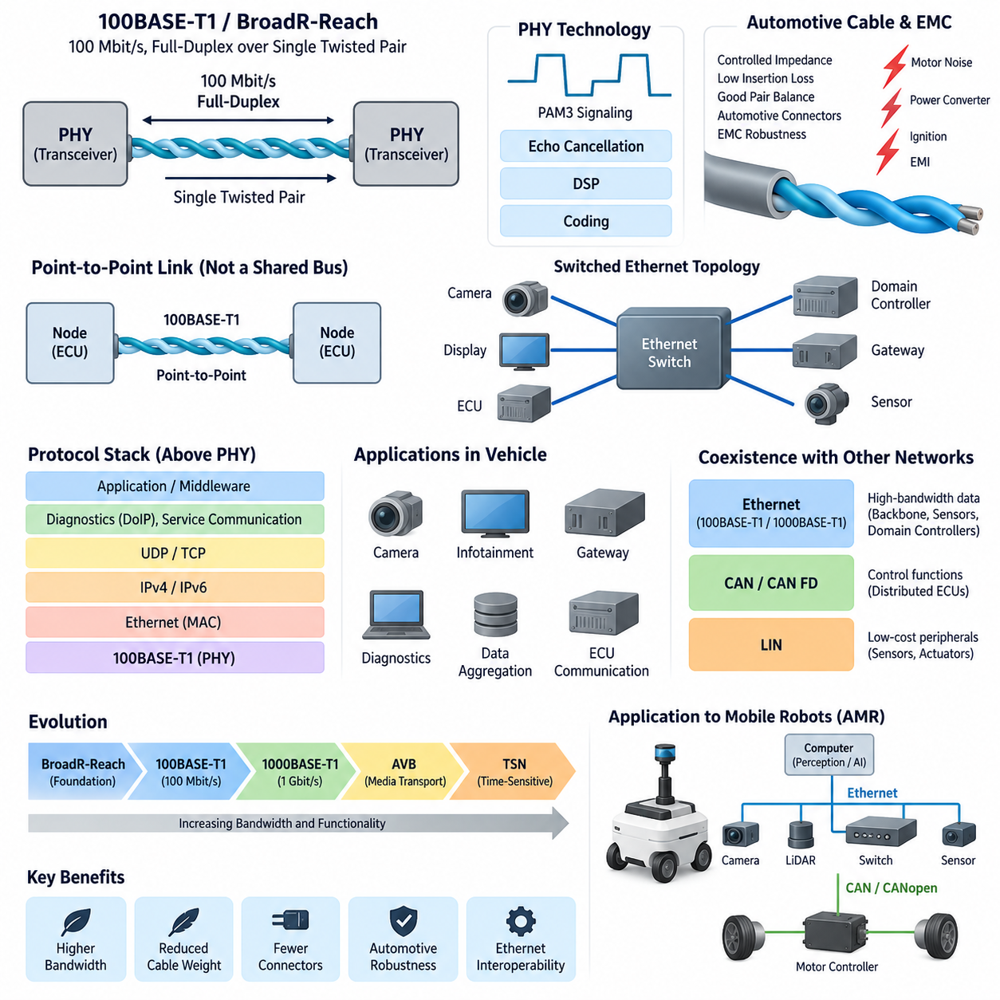
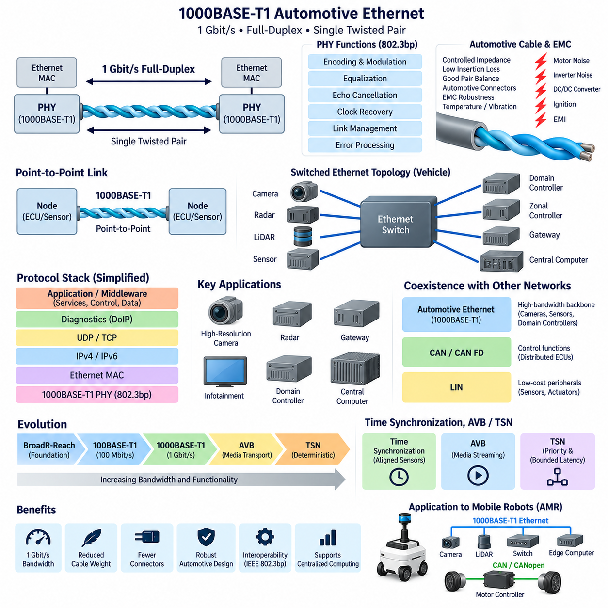
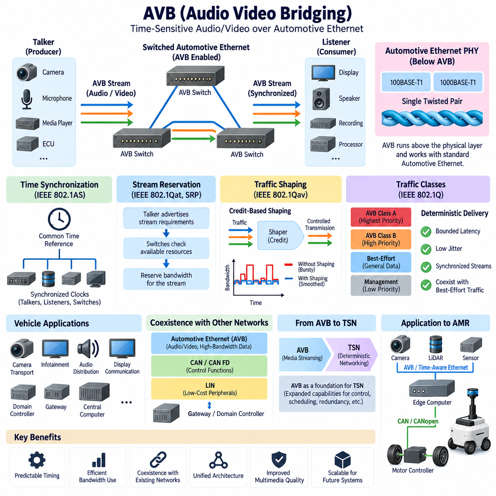
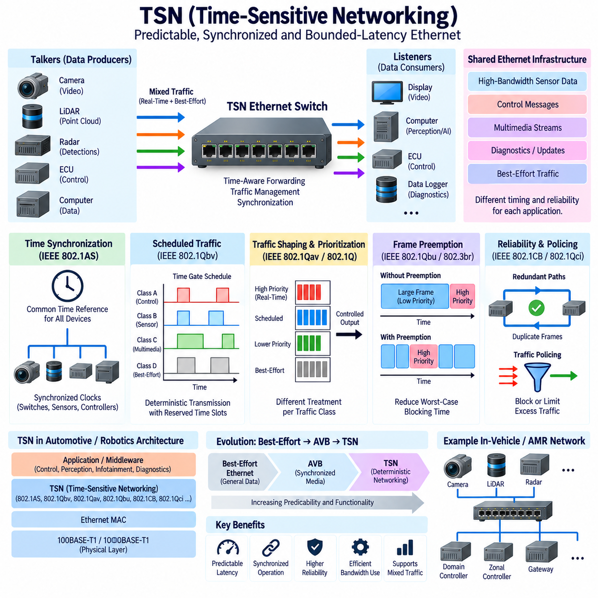
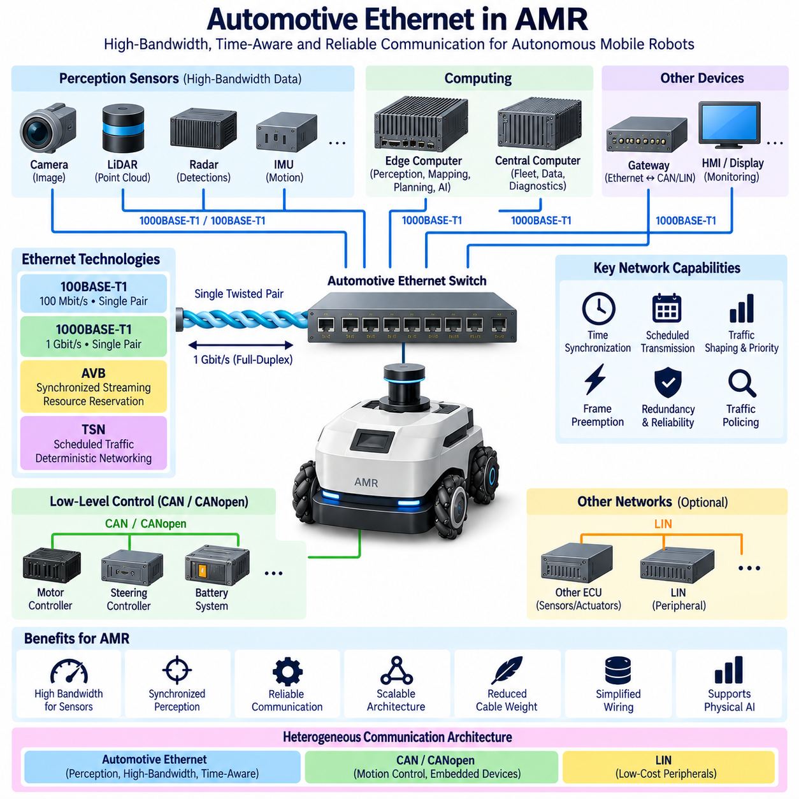

**Volume 06 Automotive Communication**


# Chapter 9. Automotive Ethernet

##  

## 9.1 100BASE T1 BroadR Reach

{width="7.268055555555556in" height="7.268055555555556in"}

100BASE-T1 is a 100 Mbit/s Automotive Ethernet physical-layer technology designed to provide full-duplex Ethernet communication over a single balanced twisted pair. Its development addressed a fundamental automotive requirement: obtaining substantially higher bandwidth than traditional in-vehicle buses while reducing cable weight, connector complexity, and electromagnetic challenges compared with conventional multi-pair Ethernet cabling.

The historical foundation of 100BASE-T1 is closely associated with BroadR-Reach, a single-pair Ethernet technology originally developed for automotive networking. BroadR-Reach demonstrated that standard Ethernet concepts could be adapted to the electrical, environmental, cost, and packaging constraints of vehicles. This technology helped establish the practical foundation that later evolved into standardized 100BASE-T1 Automotive Ethernet implementations.

Conventional 100BASE-TX Ethernet typically uses multiple wire pairs for transmit and receive paths, whereas 100BASE-T1 communicates bidirectionally over one twisted pair. Both endpoints transmit and receive through the same physical medium simultaneously. This approach significantly reduces the amount of copper and connector contacts required for each link, providing important advantages in vehicles containing many distributed electronic control units, cameras, displays, gateways, and sensors.

Simultaneous bidirectional transmission requires each PHY to distinguish the signal received from the remote device from its own transmitted signal. Echo cancellation and digital signal-processing techniques are therefore fundamental elements of the physical-layer implementation. Rather than separating transmit and receive signals onto independent wire pairs, the transceiver processes the combined electrical waveform and reconstructs the incoming information while suppressing its locally generated component.

100BASE-T1 uses sophisticated signaling to achieve 100 Mbit/s operation within an automotive-compatible frequency range. The physical layer employs three-level pulse amplitude modulation, commonly identified as PAM3, together with coding and signal-processing mechanisms designed for reliable transmission. These techniques allow the link to achieve high data throughput without requiring the cabling structure traditionally associated with office-oriented Fast Ethernet implementations.

The single twisted pair must be treated as a controlled transmission medium rather than as ordinary low-speed wiring. Characteristic impedance, insertion loss, return loss, pair balance, connector characteristics, cable length, and termination behavior directly influence signal quality. Harness engineers must therefore coordinate cable selection, routing, connector design, and physical-layer validation with the requirements of the Ethernet PHY rather than evaluating them as independent electrical components.

Electromagnetic compatibility is especially important because automotive Ethernet operates near motors, DC/DC converters, switching power supplies, ignition-related systems, high-current conductors, and other noise sources. Balanced differential signaling helps reject common-mode disturbances, but performance still depends on pair symmetry and the complete electrical path. Poor routing, excessive untwisting, connector discontinuities, or inappropriate grounding can convert common-mode disturbances into differential noise.

100BASE-T1 commonly supports automotive point-to-point links rather than the shared multidrop topology familiar from CAN or LIN. Two Ethernet PHYs form a dedicated physical connection, and larger networks are constructed by connecting multiple links through Ethernet switches. This produces a switched architecture in which cameras, ECUs, gateways, domain controllers, or other devices communicate through dedicated links while switches forward Ethernet frames toward the required destination.

The point-to-point structure changes network engineering significantly. CAN arbitration manages multiple nodes sharing one communication medium, whereas Ethernet switching distributes traffic across individual links. Consequently, network capacity is no longer determined solely by the utilization of one shared bus. Engineers must instead consider link bandwidth, switch forwarding capacity, buffering, queue behavior, traffic priorities, multicast distribution, and end-to-end latency through the switched network.

A 100 Mbit/s link provides substantially more bandwidth than classical automotive control buses, making 100BASE-T1 attractive for applications involving cameras, infotainment devices, gateways, diagnostic communication, and data aggregation. However, nominal link speed should not be interpreted as guaranteed application throughput. Ethernet framing, higher-layer protocols, network contention, switch behavior, synchronization traffic, and application processing all contribute to actual end-to-end communication performance.

Another important distinction is that 100BASE-T1 defines a physical Ethernet communication technology rather than an entire vehicle communication architecture. Ethernet frames operate above the PHY, and higher protocol layers may include IPv4 or IPv6, UDP, TCP, diagnostics, service-oriented communication, synchronization protocols, or application-specific middleware. Selecting a 100BASE-T1 transceiver therefore addresses only part of the complete communication-system design problem.

The relationship between BroadR-Reach and 100BASE-T1 should also be understood in terms of industrial evolution. BroadR-Reach helped prove and commercialize single-pair automotive Ethernet, while standardized 100BASE-T1 provided a broader interoperable foundation for automotive PHY implementations. Engineers maintaining older systems may consequently encounter BroadR-Reach terminology, while newer component documentation and network specifications more commonly reference standardized 100BASE-T1 terminology.

Interoperability requires more than connecting two devices that nominally support 100 Mbit/s Ethernet. PHY operating modes, link initialization, electrical characteristics, cable assemblies, connectors, EMC behavior, software configuration, and network management must all be compatible. Automotive development therefore relies on component-level and system-level validation to confirm that communication remains reliable across voltage variation, temperature, vibration, aging, electromagnetic disturbances, and production tolerances.

100BASE-T1 also became an important bridge between traditional distributed ECU architectures and newer domain-oriented network designs. High-bandwidth Ethernet links can connect gateways and domain controllers while CAN, CAN FD, or LIN subnetworks remain responsible for suitable lower-bandwidth functions. This heterogeneous architecture allows designers to introduce Ethernet where bandwidth provides genuine value without unnecessarily replacing established communication technologies throughout the vehicle.

The progression from 100BASE-T1 toward 1000BASE-T1 reflects the continuing increase in vehicle data requirements. The attached volume deliberately places 100BASE-T1/BroadR-Reach before 1000BASE-T1, followed by AVB, TSN, and Automotive Ethernet applications in AMRs. This sequence represents a logical engineering progression from the physical link toward higher bandwidth, deterministic networking mechanisms, and complete system-level application.

For autonomous mobile robots, similar principles can be applied when cameras, LiDAR, edge computers, gateways, and other high-data-rate devices must communicate through a lightweight network. Ethernet may provide the perception and computing backbone while CAN or CANopen remains appropriate for motor controllers and embedded control devices. Such separation allows each communication technology to operate where its bandwidth, determinism, cost, and implementation characteristics are most appropriate.

The broader robotics electrical-engineering structure places Automotive Ethernet within automotive communication while separately covering Ethernet EMI, robotics communication, time synchronization, compute architecture, and sensor architecture. This organization emphasizes that 100BASE-T1 should not be treated merely as a faster cable interface. Its successful application depends on coordinated PHY, harness, EMC, switching, timing, protocol, diagnostics, and system-architecture engineering.

Ultimately, 100BASE-T1 represents a major transition in embedded mobility networks because it combines Ethernet interoperability with an automotive-oriented single-pair physical layer. BroadR-Reach demonstrated the feasibility of this approach, and standardized 100BASE-T1 established it as a practical foundation for production networks. Its significance lies not only in 100 Mbit/s bandwidth, but in enabling scalable switched Ethernet architectures that connect traditional embedded electronics with increasingly centralized computing systems.

100BASE-T1은 단일 평형 연선(Single Balanced Twisted Pair)을 통해 전이중 이더넷 통신(Full-Duplex Ethernet Communication)을 제공하도록 설계된 100 Mbit/s급 자동차 이더넷(Automotive Ethernet) 물리 계층(Physical Layer) 기술이다. 이 기술은 기존 차량용 버스(In-Vehicle Bus)보다 훨씬 높은 대역폭(Bandwidth)을 확보하면서도, 기존 다중 페어 이더넷(Multi-Pair Ethernet) 배선에 비해 케이블 중량, 커넥터 복잡성, 전자기적 문제를 줄여야 한다는 자동차 산업의 핵심 요구에서 발전하였다.

100BASE-T1의 역사적 기반은 자동차 네트워킹(Automotive Networking)을 위해 개발된 단일 페어 이더넷(Single-Pair Ethernet) 기술인 브로드알리치(BroadR-Reach)와 밀접하게 연결되어 있다. BroadR-Reach는 표준 이더넷(Standard Ethernet)의 기본 개념을 차량의 전기적, 환경적, 비용적, 패키징 제약 조건에 맞게 적용할 수 있음을 보여주었다. 이러한 기술적 기반은 이후 표준화된 100BASE-T1 자동차 이더넷 구현으로 발전하는 중요한 출발점이 되었다.

기존 100BASE-TX 이더넷은 일반적으로 송신과 수신 경로에 여러 개의 와이어 페어(Wire Pair)를 사용하는 반면, 100BASE-T1은 하나의 연선(Twisted Pair)을 통해 양방향 통신을 수행한다. 양쪽 종단 장치는 동일한 물리적 전송 매체를 통해 동시에 송신과 수신을 수행한다. 이러한 방식은 링크(Link)마다 필요한 구리선과 커넥터 접점 수를 크게 줄일 수 있어 다수의 전자제어장치(ECU), 카메라, 디스플레이, 게이트웨이(Gateway), 센서가 탑재되는 차량에서 중요한 장점을 제공한다.

동시 양방향 전송(Simultaneous Bidirectional Transmission)을 구현하려면 각각의 물리 계층 송수신기(PHY)가 원격 장치에서 수신한 신호와 자신이 송신한 신호를 구분할 수 있어야 한다. 따라서 에코 제거(Echo Cancellation)와 디지털 신호 처리(Digital Signal Processing)는 물리 계층 구현의 핵심 요소가 된다. 송신과 수신을 별도의 와이어 페어로 분리하는 대신, 송수신기는 결합된 전기적 파형을 처리하고 자체적으로 발생시킨 신호 성분을 억제하면서 수신 정보를 복원한다.

100BASE-T1은 자동차 환경에 적합한 주파수 범위 내에서 100 Mbit/s 통신을 달성하기 위해 정교한 신호 처리(Signaling) 방식을 사용한다. 물리 계층은 일반적으로 PAM3로 알려진 3레벨 펄스 진폭 변조(Three-Level Pulse Amplitude Modulation)와 함께 신뢰성 높은 데이터 전송을 위한 부호화(Coding) 및 신호 처리 기법을 사용한다. 이러한 기술을 통해 기존 사무용 고속 이더넷(Fast Ethernet)에서 사용되는 복잡한 케이블 구조 없이 높은 데이터 처리량을 확보할 수 있다.

단일 연선(Single Twisted Pair)은 일반적인 저속 배선이 아니라 특성이 제어된 전송 매체(Controlled Transmission Medium)로 취급해야 한다. 특성 임피던스(Characteristic Impedance), 삽입 손실(Insertion Loss), 반사 손실(Return Loss), 페어 균형(Pair Balance), 커넥터 특성, 케이블 길이, 종단 특성(Termination Behavior)은 신호 품질에 직접적인 영향을 준다. 따라서 와이어 하니스 엔지니어(Wire Harness Engineer)는 케이블 선택, 배선 경로, 커넥터 설계, 물리 계층 검증을 이더넷 PHY 요구사항과 통합하여 고려해야 한다.

전자파 적합성(EMC)은 자동차 이더넷에서 특히 중요하다. 자동차 이더넷은 모터, DC/DC 컨버터(DC/DC Converter), 스위칭 전원 공급 장치(Switching Power Supply), 점화 관련 시스템, 대전류 도체 등 다양한 노이즈원(Noise Source) 주변에서 동작하기 때문이다. 평형 차동 신호(Balanced Differential Signaling)는 공통 모드 방해(Common-Mode Disturbance)를 억제하는 데 유리하지만, 실제 성능은 페어 대칭성과 전체 전기적 경로의 품질에 크게 의존한다. 부적절한 배선, 과도한 연선 풀림, 커넥터 불연속성, 잘못된 접지 설계는 공통 모드 노이즈를 차동 노이즈로 변환할 수 있다.

100BASE-T1은 일반적으로 CAN이나 LIN에서 익숙한 공유형 멀티드롭 토폴로지(Shared Multidrop Topology)가 아니라 자동차용 점대점 링크(Point-to-Point Link)를 사용한다. 두 개의 이더넷 PHY가 전용 물리 연결을 구성하며, 더 큰 네트워크는 여러 링크를 이더넷 스위치(Ethernet Switch)를 통해 연결하여 구성한다. 따라서 카메라, ECU, 게이트웨이, 도메인 컨트롤러(Domain Controller) 등의 장치는 전용 링크를 통해 연결되고, 스위치는 목적지에 따라 이더넷 프레임(Ethernet Frame)을 전달한다.

이러한 점대점 구조(Point-to-Point Structure)는 네트워크 엔지니어링(Network Engineering)의 접근 방법을 크게 변화시킨다. CAN에서는 여러 노드가 하나의 통신 매체를 공유하면서 중재(Arbitration)를 수행하지만, 이더넷 스위칭(Ethernet Switching)은 트래픽을 개별 링크에 분산시킨다. 따라서 네트워크 용량은 하나의 공유 버스 이용률만으로 결정되지 않으며, 링크 대역폭, 스위치 전달 용량, 버퍼링(Buffering), 큐 동작(Queue Behavior), 트래픽 우선순위, 멀티캐스트(Multicast) 분배, 종단 간 지연(End-to-End Latency)을 함께 고려해야 한다.

100 Mbit/s 링크는 기존 자동차 제어 버스보다 훨씬 높은 대역폭을 제공하므로 100BASE-T1은 카메라, 인포테인먼트(Infotainment) 장치, 게이트웨이, 진단 통신(Diagnostic Communication), 데이터 집계(Data Aggregation) 등에 적합하다. 그러나 명목상의 링크 속도를 실제 애플리케이션 처리량(Application Throughput)과 동일하게 해석해서는 안 된다. 이더넷 프레이밍(Ethernet Framing), 상위 계층 프로토콜, 네트워크 경합, 스위치 동작, 동기화 트래픽, 애플리케이션 처리 등이 실제 종단 간 통신 성능에 영향을 준다.

또 다른 중요한 특징은 100BASE-T1이 차량 전체의 통신 아키텍처(Communication Architecture)가 아니라 물리적인 이더넷 통신 기술을 정의한다는 점이다. PHY 상위에서는 이더넷 프레임이 동작하며, 그 위의 프로토콜 계층에는 IPv4 또는 IPv6, UDP, TCP, 진단(Diagnostics), 서비스 지향 통신(Service-Oriented Communication), 동기화 프로토콜(Synchronization Protocol), 애플리케이션별 미들웨어(Application-Specific Middleware) 등이 적용될 수 있다. 따라서 100BASE-T1 송수신기를 선택하는 것은 전체 통신 시스템 설계의 일부에 불과하다.

BroadR-Reach와 100BASE-T1의 관계는 산업 기술의 발전 과정이라는 관점에서도 이해할 필요가 있다. BroadR-Reach는 단일 페어 자동차 이더넷의 기술적 가능성과 상용화를 입증하는 데 중요한 역할을 했으며, 이후 표준화된 100BASE-T1은 자동차 PHY 구현을 위한 보다 광범위한 상호운용성(Interoperability) 기반을 제공하였다. 따라서 기존 시스템에서는 BroadR-Reach라는 용어를 접할 수 있지만, 최신 부품 문서와 네트워크 사양에서는 표준화된 100BASE-T1이라는 표현이 더욱 일반적으로 사용된다.

상호운용성(Interoperability)은 단순히 100 Mbit/s 이더넷을 지원하는 두 장치를 연결한다고 보장되는 것이 아니다. PHY 동작 모드, 링크 초기화(Link Initialization), 전기적 특성, 케이블 어셈블리(Cable Assembly), 커넥터, EMC 특성, 소프트웨어 설정, 네트워크 관리가 모두 호환되어야 한다. 따라서 자동차 개발에서는 전압 변화, 온도, 진동, 노화(Aging), 전자기적 방해, 생산 공차(Production Tolerance) 조건에서도 안정적인 통신이 유지되는지를 부품 및 시스템 수준에서 검증해야 한다.

100BASE-T1은 기존 분산형 ECU 아키텍처(Distributed ECU Architecture)에서 새로운 도메인 중심 네트워크(Domain-Oriented Network)로 전환하는 과정에서도 중요한 역할을 담당하였다. 고대역폭 이더넷 링크는 게이트웨이와 도메인 컨트롤러를 연결할 수 있으며, CAN, CAN FD 또는 LIN 서브네트워크(Subnetwork)는 적절한 저대역폭 기능을 계속 담당할 수 있다. 이러한 이종 네트워크 아키텍처(Heterogeneous Network Architecture)는 기존 통신 기술을 불필요하게 모두 교체하지 않으면서 필요한 영역에 이더넷을 적용할 수 있도록 한다.

100BASE-T1에서 1000BASE-T1으로의 발전은 차량 데이터 요구량이 지속적으로 증가하고 있음을 보여준다. 첨부된 구조에서도 100BASE-T1/BroadR-Reach 다음에 1000BASE-T1, 오디오 비디오 브리징(AVB), 시간 민감형 네트워킹(TSN), 그리고 AMR에서의 자동차 이더넷 적용이 순차적으로 배치되어 있다. 이러한 구성은 물리적 링크에서 시작하여 더 높은 대역폭, 결정론적 네트워킹(Deterministic Networking), 그리고 전체 시스템 수준의 응용으로 발전하는 논리적인 엔지니어링 흐름을 나타낸다.

자율이동로봇(Autonomous Mobile Robot, AMR)에서도 카메라, 라이다(LiDAR), 엣지 컴퓨터(Edge Computer), 게이트웨이 및 기타 고속 데이터 장치가 경량 네트워크를 통해 통신해야 하는 경우 동일한 원리를 적용할 수 있다. 이더넷은 인지(Perception) 및 컴퓨팅 백본(Computing Backbone)을 담당하고, CAN 또는 CANopen은 모터 컨트롤러(Motor Controller)와 임베디드 제어 장치(Embedded Control Device)에 사용할 수 있다. 이를 통해 각 통신 기술을 대역폭, 결정성, 비용, 구현 특성에 가장 적합한 영역에 배치할 수 있다.

전체 로보틱스 전기·전자 엔지니어링(Robotics Electrical and Electronic Engineering) 구조에서는 자동차 이더넷을 자동차 통신(Automotive Communication)에 포함하면서, 이더넷 전자파 간섭(Ethernet EMI), 로보틱스 통신(Robotics Communication), 시간 동기화(Time Synchronization), 컴퓨팅 아키텍처(Compute Architecture), 센서 아키텍처(Sensor Architecture)를 별도의 관련 영역으로 다루고 있다. 이는 100BASE-T1을 단순히 더 빠른 케이블 인터페이스로 이해해서는 안 된다는 점을 보여준다. 성공적인 적용을 위해서는 PHY, 하니스, EMC, 스위칭, 타이밍, 프로토콜, 진단 및 시스템 아키텍처를 통합적으로 설계해야 한다.

궁극적으로 100BASE-T1은 이더넷의 상호운용성과 자동차 환경에 최적화된 단일 페어 물리 계층을 결합함으로써 임베디드 모빌리티 네트워크(Embedded Mobility Network)의 중요한 전환점을 만들었다. BroadR-Reach는 이러한 접근 방식의 실현 가능성을 입증하였고, 표준화된 100BASE-T1은 이를 양산 네트워크에 적용할 수 있는 실질적인 기반으로 발전시켰다. 그 중요성은 단순한 100 Mbit/s 대역폭에 있는 것이 아니라, 기존 임베디드 전자 시스템과 점차 중앙집중화되는 컴퓨팅 시스템을 연결하는 확장 가능한 스위치드 이더넷 아키텍처(Switched Ethernet Architecture)를 가능하게 했다는 데 있다.

##  

## 9.2 1000BASE T1 Architecture

{width="7.268055555555556in" height="7.268055555555556in"}

1000BASE-T1 is a Gigabit Automotive Ethernet physical-layer technology designed to transmit 1 Gbit/s full-duplex data over a single balanced twisted pair. It extends the single-pair networking concept established by 100BASE-T1 while providing approximately ten times greater nominal bandwidth. This increase supports the growing communication demands of cameras, gateways, domain controllers, centralized computers, and advanced vehicle sensors.

The architecture retains one of the most important advantages of Automotive Ethernet: simultaneous bidirectional communication over a single twisted pair. Both PHY devices transmit and receive through the same physical medium rather than using separate transmit and receive pairs. Sophisticated signal processing separates the locally transmitted waveform from the incoming signal, enabling full-duplex operation while minimizing cable conductors, connector contacts, harness mass, and packaging requirements.

At each end of a 1000BASE-T1 link, a physical-layer transceiver, or PHY, interfaces the Ethernet MAC with the automotive cable. The PHY performs functions such as encoding, modulation, equalization, echo cancellation, clock recovery, link management, and error-related processing. These functions transform digital Ethernet information into electrical signaling capable of maintaining Gigabit communication through an automotive-qualified single-pair transmission channel.

1000BASE-T1 is standardized within the IEEE 802.3 family, with the automotive Gigabit single-pair physical layer associated with IEEE 802.3bp. Standardization provides common electrical and protocol behavior so PHY devices from different suppliers can be developed around interoperable requirements. Nevertheless, successful interoperability still depends on correct PHY configuration, cable characteristics, connector performance, link parameters, EMC design, and system-level validation.

The physical channel becomes increasingly important as data rate rises. A cable that performs adequately for a lower-speed network cannot automatically be assumed to satisfy Gigabit requirements. Characteristic impedance, insertion loss, return loss, mode conversion, pair balance, propagation characteristics, connector discontinuities, and cable length influence the available signal margin. Harness engineering must therefore be treated as an integral part of the 1000BASE-T1 communication architecture.

Electromagnetic compatibility also becomes a central design concern. Motors, inverters, DC/DC converters, switching regulators, high-current power distribution, and other electrical systems can inject electromagnetic disturbances into nearby communication wiring. Balanced differential signaling and twisted-pair construction provide substantial immunity, but excessive untwisting, poor connector transitions, asymmetric routing, or unsuitable grounding can degrade pair balance and convert common-mode disturbances into differential noise.

1000BASE-T1 is fundamentally a point-to-point communication technology. A physical link normally connects two PHY endpoints, such as a sensor and switch or a switch and domain controller. Larger vehicle networks are constructed by combining many such links through switched Ethernet infrastructure. This differs fundamentally from CAN or LIN, where multiple devices may share the same physical bus, and allows aggregate network bandwidth to increase as additional switched links are introduced.

An Ethernet switch consequently becomes a major architectural component in Gigabit vehicle networks. It receives Ethernet frames from connected ports, examines forwarding information, and directs traffic toward appropriate destinations. Network engineering must therefore account for switch bandwidth, forwarding latency, buffering, queue management, multicast traffic, traffic classes, congestion, and failure behavior rather than considering only the nominal 1 Gbit/s capacity of individual physical links.

Gigabit bandwidth is especially useful for high-data-rate perception systems. High-resolution cameras, radar systems, data acquisition units, gateways, and centralized processing computers can generate or consume significantly more information than traditional CAN-based networks can efficiently transport. 1000BASE-T1 provides a practical backbone connection for these devices, allowing raw or processed sensor information to move between distributed sensing nodes and high-performance computing platforms.

The protocol architecture above 1000BASE-T1 remains based on Ethernet layering. The PHY provides the physical communication channel, while the MAC handles Ethernet frames. Above these layers, systems may employ IPv4 or IPv6, UDP, TCP, diagnostics, synchronization services, service-oriented middleware, or application-specific protocols. Consequently, Gigabit physical bandwidth alone does not determine application latency, determinism, reliability, or software architecture.

Time synchronization becomes increasingly important when Gigabit Ethernet connects multiple perception devices. Camera images, radar detections, LiDAR measurements, IMU information, and computing events may need a common temporal reference before accurate sensor fusion can occur. Ethernet-based time synchronization can distribute a coordinated clock across switches and endpoints, allowing measurements generated by physically separated sensors to be aligned according to their acquisition time rather than their arrival time.

High bandwidth also does not automatically guarantee deterministic communication. Ordinary Ethernet traffic can experience variable delay due to queueing, competing traffic, and switch behavior. Audio Video Bridging, or AVB, and later Time-Sensitive Networking, or TSN, introduce mechanisms that improve synchronization, traffic prioritization, scheduling, and bounded-latency behavior. The attached structure therefore places AVB and TSN immediately after the 100BASE-T1 and 1000BASE-T1 physical-layer topics.

1000BASE-T1 normally operates as part of a heterogeneous vehicle communication architecture rather than replacing every existing bus. LIN remains appropriate for inexpensive peripheral devices, while CAN and CAN FD continue to serve many distributed control functions. Gigabit Ethernet can form the high-bandwidth backbone connecting gateways, domain controllers, zonal controllers, perception sensors, and centralized computers, with gateways providing controlled communication between different network technologies.

This heterogeneous structure is particularly relevant to the transition toward domain and zonal electrical architectures. Instead of connecting every sensor and actuator directly to a dedicated central ECU, local devices can be aggregated through domain or zonal controllers. High-speed Ethernet links then connect these controllers to centralized computing resources. Such an architecture can reduce portions of harness complexity while supporting the increasing software and data requirements of modern vehicles.

Diagnostics and software lifecycle operations can also benefit from Gigabit Ethernet. Large firmware images, logging data, calibration information, and diagnostic records can require substantial transfer capacity. When Ethernet is combined with IP-based diagnostic mechanisms such as Diagnostics over Internet Protocol, high-speed backbone connectivity can accelerate software flashing, manufacturing operations, service procedures, data extraction, and communication with increasingly software-intensive electronic control units.

For autonomous mobile robots, the same architecture can connect cameras, LiDAR, high-performance edge computers, gateways, and Ethernet switches while lower-level motion devices remain connected through CAN or CANopen. The broader engineering structure explicitly includes Automotive Ethernet applications in AMRs after the physical-layer, AVB, and TSN topics. This provides a natural separation between high-bandwidth perception communication and embedded actuator-control networks.

A practical AMR architecture might therefore use 1000BASE-T1 or another Gigabit Ethernet technology between perception sensors and an edge computer while an embedded controller executes faster motor-control functions. Ethernet can transport sensor streams, maps, localization information, AI outputs, diagnostics, and high-level commands, whereas CAN or CANopen can carry commands and feedback associated with motor drives. Each network is then selected according to its actual functional requirements.

The wider robotics electrical architecture also separates automotive communication from grounding and EMC, sensor architecture, compute architecture, robotics communication, and time synchronization. This organization reflects an important engineering principle: successful 1000BASE-T1 deployment requires coordinated design across PHY hardware, cables, connectors, switching, EMC, software protocols, timing, diagnostics, computing systems, and application requirements.

Ultimately, 1000BASE-T1 represents the transition of single-pair Automotive Ethernet from 100 Mbit/s connectivity toward a Gigabit-class communication backbone. Its significance extends beyond the tenfold increase in nominal bandwidth over 100BASE-T1. By combining single-pair cabling, full-duplex communication, switched topology, Ethernet interoperability, and high data capacity, it provides an architectural foundation for sensor-rich vehicles, centralized computing, software-defined platforms, and advanced autonomous robotic systems.

1000BASE-T1은 단일 평형 연선(Single Balanced Twisted Pair)을 통해 1 Gbit/s의 전이중 데이터(Full-Duplex Data)를 전송하도록 설계된 기가비트 자동차 이더넷(Gigabit Automotive Ethernet) 물리 계층(Physical Layer) 기술이다. 100BASE-T1에서 확립된 단일 페어 네트워킹(Single-Pair Networking) 개념을 확장하면서 약 10배 높은 명목 대역폭(Nominal Bandwidth)을 제공한다. 이러한 대역폭 증가는 카메라, 게이트웨이(Gateway), 도메인 컨트롤러(Domain Controller), 중앙집중형 컴퓨터(Centralized Computer), 첨단 차량 센서의 증가하는 통신 요구사항을 지원한다.

이 아키텍처는 자동차 이더넷(Automotive Ethernet)의 가장 중요한 장점 중 하나인 단일 연선(Single Twisted Pair)을 통한 동시 양방향 통신(Simultaneous Bidirectional Communication)을 유지한다. 두 PHY 장치는 송신과 수신을 위해 별도의 와이어 페어(Wire Pair)를 사용하는 대신 동일한 물리적 전송 매체를 통해 동시에 데이터를 송수신한다. 정교한 신호 처리(Signal Processing)를 통해 자체 송신 파형과 수신 신호를 분리함으로써 케이블 도체 수, 커넥터 접점, 하니스 중량, 패키징 요구사항을 최소화하면서 전이중 동작을 구현한다.

1000BASE-T1 링크의 양쪽 끝에는 물리 계층 송수신기(Physical-Layer Transceiver), 즉 PHY가 위치하여 이더넷 MAC(Ethernet MAC)과 자동차용 케이블 사이를 연결한다. PHY는 부호화(Encoding), 변조(Modulation), 등화(Equalization), 에코 제거(Echo Cancellation), 클록 복구(Clock Recovery), 링크 관리(Link Management), 오류 관련 처리 등의 기능을 수행한다. 이러한 기능을 통해 디지털 이더넷 정보를 자동차용으로 인증된 단일 페어 전송 채널을 통해 기가비트 통신이 가능한 전기 신호로 변환한다.

1000BASE-T1은 IEEE 802.3 표준군(IEEE 802.3 Family) 내에서 표준화되어 있으며, 자동차용 기가비트 단일 페어 물리 계층은 IEEE 802.3bp와 연관된다. 표준화는 서로 다른 공급업체의 PHY 장치가 상호운용 가능한 요구사항을 기반으로 개발될 수 있도록 공통된 전기적 및 프로토콜 동작을 제공한다. 그러나 성공적인 상호운용성(Interoperability)을 확보하려면 올바른 PHY 설정, 케이블 특성, 커넥터 성능, 링크 파라미터, EMC 설계 및 시스템 수준 검증이 필요하다.

데이터 전송 속도가 증가할수록 물리 채널(Physical Channel)의 중요성도 더욱 커진다. 낮은 속도의 네트워크에서 충분한 성능을 보이는 케이블이라고 해서 기가비트 요구사항까지 자동으로 만족한다고 가정할 수 없다. 특성 임피던스(Characteristic Impedance), 삽입 손실(Insertion Loss), 반사 손실(Return Loss), 모드 변환(Mode Conversion), 페어 균형(Pair Balance), 전파 특성, 커넥터 불연속성, 케이블 길이는 사용 가능한 신호 마진(Signal Margin)에 영향을 준다. 따라서 하니스 엔지니어링(Harness Engineering)은 1000BASE-T1 통신 아키텍처의 필수적인 일부로 다루어야 한다.

전자파 적합성(Electromagnetic Compatibility, EMC) 역시 핵심적인 설계 요소가 된다. 모터, 인버터(Inverter), DC/DC 컨버터(DC/DC Converter), 스위칭 레귤레이터(Switching Regulator), 대전류 전력 분배 시스템 등은 인접한 통신 배선에 전자기적 방해(Electromagnetic Disturbance)를 유입시킬 수 있다. 평형 차동 신호(Balanced Differential Signaling)와 연선 구조는 높은 노이즈 내성을 제공하지만, 과도한 연선 풀림, 부적절한 커넥터 전이, 비대칭 배선, 잘못된 접지 설계는 페어 균형을 저하시켜 공통 모드 방해(Common-Mode Disturbance)를 차동 노이즈(Differential Noise)로 변환할 수 있다.

1000BASE-T1은 기본적으로 점대점 통신(Point-to-Point Communication) 기술이다. 하나의 물리 링크(Physical Link)는 일반적으로 센서와 스위치 또는 스위치와 도메인 컨트롤러처럼 두 개의 PHY 종단점을 연결한다. 더 큰 차량 네트워크는 이러한 여러 링크를 스위치드 이더넷(Switched Ethernet) 인프라를 통해 결합하여 구성한다. 이는 여러 장치가 하나의 물리 버스를 공유할 수 있는 CAN이나 LIN과 근본적으로 다르며, 스위치 링크가 추가될수록 전체 네트워크의 총 대역폭을 확장할 수 있다.

따라서 이더넷 스위치(Ethernet Switch)는 기가비트 차량 네트워크에서 중요한 아키텍처 구성요소가 된다. 스위치는 연결된 포트에서 이더넷 프레임(Ethernet Frame)을 수신하고 전달 정보를 확인한 후 적절한 목적지로 트래픽을 전달한다. 따라서 네트워크 엔지니어링에서는 개별 물리 링크의 명목상 1 Gbit/s 용량뿐만 아니라 스위치 대역폭, 전달 지연(Forwarding Latency), 버퍼링(Buffering), 큐 관리(Queue Management), 멀티캐스트 트래픽(Multicast Traffic), 트래픽 클래스(Traffic Class), 혼잡(Congestion), 장애 동작(Failure Behavior)을 함께 고려해야 한다.

기가비트 대역폭(Gigabit Bandwidth)은 특히 높은 데이터 전송률이 필요한 인지 시스템(Perception System)에 유용하다. 고해상도 카메라, 레이더 시스템(Radar System), 데이터 수집 장치(Data Acquisition Unit), 게이트웨이, 중앙집중형 처리 컴퓨터는 기존 CAN 기반 네트워크가 효율적으로 처리하기 어려운 대량의 정보를 생성하거나 소비할 수 있다. 1000BASE-T1은 이러한 장치에 실용적인 백본 연결(Backbone Connection)을 제공하여 분산형 센싱 노드(Distributed Sensing Node)와 고성능 컴퓨팅 플랫폼 사이에서 원시 또는 처리된 센서 정보를 전송할 수 있도록 한다.

1000BASE-T1 상위의 프로토콜 아키텍처(Protocol Architecture)는 이더넷 계층 구조(Ethernet Layering)를 기반으로 한다. PHY는 물리 통신 채널을 제공하고 MAC은 이더넷 프레임을 처리한다. 그 상위 계층에서는 IPv4 또는 IPv6, UDP, TCP, 진단(Diagnostics), 동기화 서비스(Synchronization Service), 서비스 지향 미들웨어(Service-Oriented Middleware), 애플리케이션별 프로토콜(Application-Specific Protocol)을 사용할 수 있다. 따라서 기가비트 물리 대역폭만으로 애플리케이션 지연, 결정성(Determinism), 신뢰성 또는 소프트웨어 아키텍처가 결정되는 것은 아니다.

기가비트 이더넷이 여러 인지 장치를 연결하는 경우 시간 동기화(Time Synchronization)의 중요성도 증가한다. 카메라 영상, 레이더 검출 정보, 라이다(LiDAR) 측정값, 관성측정장치(IMU) 정보 및 컴퓨팅 이벤트는 정확한 센서 융합(Sensor Fusion)을 수행하기 전에 공통 시간 기준(Common Temporal Reference)을 가져야 할 수 있다. 이더넷 기반 시간 동기화는 스위치와 종단 장치 전체에 공통 클록을 분배하여 물리적으로 떨어진 센서에서 생성된 측정값을 데이터 도착 시간이 아니라 실제 획득 시간(Acquisition Time)에 따라 정렬할 수 있도록 한다.

높은 대역폭이 자동으로 결정론적 통신(Deterministic Communication)을 보장하는 것은 아니다. 일반적인 이더넷 트래픽은 큐잉(Queueing), 경쟁 트래픽(Competing Traffic), 스위치 동작 등에 의해 가변적인 지연을 경험할 수 있다. 오디오 비디오 브리징(Audio Video Bridging, AVB)과 이후의 시간 민감형 네트워킹(Time-Sensitive Networking, TSN)은 동기화, 트래픽 우선순위 지정, 스케줄링 및 제한된 지연(Bounded Latency) 특성을 향상시키는 메커니즘을 제공한다. 따라서 첨부 구조에서도 100BASE-T1과 1000BASE-T1 물리 계층 주제 다음에 AVB와 TSN이 배치되어 있다.

1000BASE-T1은 일반적으로 기존의 모든 통신 버스를 대체하기보다는 이종 차량 통신 아키텍처(Heterogeneous Vehicle Communication Architecture)의 일부로 동작한다. LIN은 저비용 주변 장치에 적합하며, CAN과 CAN FD는 다양한 분산형 제어 기능(Distributed Control Function)을 계속 담당할 수 있다. 기가비트 이더넷은 게이트웨이, 도메인 컨트롤러, 조널 컨트롤러(Zonal Controller), 인지 센서 및 중앙집중형 컴퓨터를 연결하는 고대역폭 백본을 구성하고, 게이트웨이는 서로 다른 네트워크 기술 간의 통신을 제어한다.

이러한 이종 네트워크 구조는 도메인 및 조널 전기전자 아키텍처(Domain and Zonal E/E Architecture)로 전환하는 과정에서 특히 중요하다. 모든 센서와 액추에이터를 각각 전용 중앙 ECU에 직접 연결하는 대신, 로컬 장치를 도메인 또는 조널 컨트롤러를 통해 집약할 수 있다. 이후 고속 이더넷 링크가 이러한 컨트롤러와 중앙집중형 컴퓨팅 자원을 연결한다. 이러한 아키텍처는 하니스 복잡성의 일부를 줄이는 동시에 현대 차량에서 증가하는 소프트웨어 및 데이터 요구사항을 지원할 수 있다.

진단(Diagnostics)과 소프트웨어 수명주기 운영(Software Lifecycle Operation) 역시 기가비트 이더넷의 이점을 활용할 수 있다. 대용량 펌웨어 이미지(Firmware Image), 로깅 데이터(Logging Data), 캘리브레이션 정보(Calibration Information), 진단 기록(Diagnostic Record)은 상당한 전송 용량을 요구할 수 있다. 이더넷과 인터넷 프로토콜 기반 진단(Diagnostics over Internet Protocol, DoIP)을 결합하면 고속 백본 연결을 통해 소프트웨어 플래싱(Software Flashing), 생산 공정, 정비 작업, 데이터 추출 및 소프트웨어 중심 ECU와의 통신을 더욱 빠르게 수행할 수 있다.

자율이동로봇(Autonomous Mobile Robot, AMR)에서도 동일한 아키텍처를 적용하여 카메라, 라이다, 고성능 엣지 컴퓨터(High-Performance Edge Computer), 게이트웨이 및 이더넷 스위치를 연결하면서 하위 수준의 모션 장치(Motion Device)는 CAN 또는 CANopen으로 유지할 수 있다. 전체 엔지니어링 구조에서도 물리 계층, AVB 및 TSN 주제 다음에 AMR에서의 자동차 이더넷(Automotive Ethernet in AMR)이 배치되어 있다. 이는 고대역폭 인지 통신과 임베디드 액추에이터 제어 네트워크(Embedded Actuator-Control Network)를 자연스럽게 분리하는 구조를 제공한다.

따라서 실제 AMR 아키텍처에서는 인지 센서와 엣지 컴퓨터 사이에 1000BASE-T1 또는 다른 기가비트 이더넷(Gigabit Ethernet) 기술을 사용하고, 임베디드 컨트롤러(Embedded Controller)가 더 빠른 모터 제어 기능을 수행하도록 구성할 수 있다. 이더넷은 센서 스트림, 지도, 위치추정(Localization) 정보, AI 출력, 진단 및 상위 수준 명령을 전송하고, CAN 또는 CANopen은 모터 드라이브(Motor Drive)와 관련된 명령 및 피드백을 전달할 수 있다. 각 네트워크는 실제 기능 요구사항에 따라 선택된다.

더 넓은 로보틱스 전기 아키텍처(Robotics Electrical Architecture)에서는 자동차 통신(Automotive Communication)을 접지 및 EMC(Grounding and EMC), 센서 아키텍처(Sensor Architecture), 컴퓨팅 아키텍처(Compute Architecture), 로보틱스 통신(Robotics Communication), 시간 동기화(Time Synchronization)와 구분하여 다룬다. 이러한 구성은 성공적인 1000BASE-T1 적용을 위해 PHY 하드웨어, 케이블, 커넥터, 스위칭, EMC, 소프트웨어 프로토콜, 타이밍, 진단, 컴퓨팅 시스템 및 애플리케이션 요구사항을 통합적으로 설계해야 한다는 중요한 엔지니어링 원칙을 보여준다.

궁극적으로 1000BASE-T1은 단일 페어 자동차 이더넷(Single-Pair Automotive Ethernet)이 100 Mbit/s 연결에서 기가비트급 통신 백본(Gigabit-Class Communication Backbone)으로 발전하는 중요한 전환점을 나타낸다. 그 의미는 단순히 100BASE-T1보다 명목 대역폭이 10배 증가했다는 데 그치지 않는다. 단일 페어 배선, 전이중 통신, 스위치드 토폴로지(Switched Topology), 이더넷 상호운용성(Ethernet Interoperability), 높은 데이터 용량을 결합함으로써 센서 중심 차량, 중앙집중형 컴퓨팅, 소프트웨어 정의 플랫폼(Software-Defined Platform), 첨단 자율 로봇 시스템을 위한 핵심 통신 아키텍처 기반을 제공한다.

##  

## 9.3 AVB Audio Video Bridging

{width="7.268055555555556in" height="7.268055555555556in"}

Audio Video Bridging, commonly abbreviated as AVB, is a family of IEEE Ethernet technologies developed to transport time-sensitive audio and video streams with more predictable timing than conventional best-effort Ethernet. In Automotive Ethernet, AVB became important because cameras, displays, infotainment systems, amplifiers, and other multimedia devices require coordinated delivery rather than simply high raw bandwidth.

Conventional Ethernet forwards traffic according to a best-effort model, which works well for many data applications but does not inherently guarantee when a particular frame will arrive. Network congestion, switch queues, and competing traffic can introduce variable delay and packet loss. Audio and video streams are sensitive to these effects because excessive latency, jitter, or dropped packets can cause interrupted sound, unstable playback, or synchronization errors.

AVB addresses this problem by combining several coordinated mechanisms rather than defining a completely separate physical network. It operates above Ethernet physical technologies such as 100BASE-T1 or 1000BASE-T1 and adds capabilities for precise time synchronization, stream reservation, traffic shaping, and controlled forwarding. This allows ordinary Ethernet data and time-sensitive multimedia traffic to coexist on the same switched communication infrastructure.

Time synchronization is one of the fundamental elements of AVB. IEEE 802.1AS provides a generalized Precision Time Protocol mechanism that distributes a common time reference among compatible devices. When talkers, listeners, and Ethernet bridges share synchronized clocks, audio samples and video frames can be associated with consistent timestamps, allowing distributed devices to reproduce or process media according to coordinated timing.

This synchronized time base is particularly valuable in systems containing multiple multimedia endpoints. A vehicle may include several speakers, microphones, displays, cameras, and processing units distributed throughout the electrical architecture. Without synchronization, independent clocks gradually drift relative to one another. AVB synchronization provides a common temporal foundation that helps maintain coordinated playback, acquisition, and processing across networked devices.

AVB introduces the concept of streams between a talker and one or more listeners. A talker produces a time-sensitive stream, while listeners consume that stream, and Ethernet bridges transport it through the network. Unlike arbitrary best-effort communication, an AVB stream can be associated with defined traffic characteristics. This enables network resources to be evaluated before time-sensitive communication is accepted across the required path.

The Stream Reservation Protocol, associated with IEEE 802.1Qat in the original AVB framework, provides mechanisms for reserving network resources for streams. Devices can advertise stream requirements, and bridges determine whether sufficient resources are available along the communication path. This prevents a network from accepting more reserved traffic than it can reliably transport while maintaining the expected quality of service for existing streams.

Traffic shaping is another essential AVB capability. IEEE 802.1Qav defines credit-based shaping, which regulates how selected traffic classes are transmitted through Ethernet ports. Instead of allowing one high-priority stream to monopolize the link, the shaper controls transmission opportunities according to accumulated credit. This reduces burstiness and helps provide predictable service for time-sensitive streams while preserving bandwidth for other Ethernet communication.

Traffic classes allow AVB-capable networks to distinguish time-sensitive streams from ordinary best-effort data. Switches can apply different forwarding and queue-management policies according to the traffic class. The objective is not to make every Ethernet frame deterministic, but to create controlled communication behavior for selected streams whose latency and timing requirements justify special treatment while conventional traffic continues to share the network.

AVB also introduced forwarding and queueing enhancements intended to constrain end-to-end latency across compatible bridges. Predictable latency requires every network component along a stream path to participate correctly. Consequently, AVB performance depends not only on the transmitting and receiving devices but also on Ethernet switches, queue configuration, reserved bandwidth, topology, traffic loading, and synchronization quality throughout the communication path.

In Automotive Ethernet, these capabilities enabled Ethernet to expand beyond ordinary data networking into applications previously dependent on specialized multimedia networks. Audio distribution, infotainment, display communication, camera transport, and other synchronized streams could increasingly share Ethernet infrastructure. This consolidation offered opportunities to reduce dedicated network technologies while creating a more unified communication architecture across vehicle electronic systems.

AVB should nevertheless be distinguished from the Ethernet physical layer itself. 100BASE-T1 and 1000BASE-T1 define how Ethernet information is electrically transmitted over automotive single-pair cabling, whereas AVB defines mechanisms above that physical connectivity for synchronized and time-sensitive traffic. A Gigabit Ethernet link therefore provides bandwidth, but AVB provides additional coordination required when application timing matters.

The attached Automotive Communication structure reflects this layering by placing 100BASE-T1 and 1000BASE-T1 before AVB, followed by Time-Sensitive Networking and Automotive Ethernet applications in AMRs. This progression moves from physical connectivity and increasing bandwidth toward time-aware communication mechanisms and then toward their application within complete vehicle and robotic network architectures.

AVB also represents an important historical and technical foundation for Time-Sensitive Networking, or TSN. TSN expands the time-sensitive Ethernet concept into a broader collection of standards supporting industrial control, automotive communication, scheduled traffic, redundancy, bounded latency, and other deterministic networking requirements. AVB can therefore be understood as a major stage in the evolution from ordinary switched Ethernet toward more comprehensive deterministic Ethernet architectures.

The distinction between multimedia timing and control timing is important. Audio and video streams generally require sustained bandwidth, bounded latency, low jitter, and synchronization, whereas closed-loop control systems may require stricter scheduling and highly predictable worst-case response. AVB addresses the former particularly well, while later TSN mechanisms provide additional capabilities for applications where deterministic control traffic must coexist with other Ethernet communication.

Automotive systems frequently combine AVB-capable Ethernet with CAN, CAN FD, and LIN rather than replacing all established communication technologies. Ethernet can transport multimedia and high-bandwidth data, CAN-based networks can continue supporting distributed control, and LIN can connect inexpensive peripheral devices. Gateways and domain controllers integrate these networks, allowing each communication technology to serve functions appropriate to its bandwidth, timing, cost, and reliability characteristics.

The same principle can extend to autonomous mobile robots. Cameras and other high-bandwidth sensors may communicate with an edge computer through switched Ethernet, while synchronized streams can benefit from time-aware networking concepts. Motor controllers and embedded actuator devices may remain on CAN or CANopen. This separates high-volume perception communication from lower-level motion control while maintaining coordinated timing where sensor information must be correlated.

For sensor-rich robotic systems, synchronization can be as significant as bandwidth. Multiple cameras, microphones, LiDAR units, or distributed acquisition devices may generate data that must be temporally aligned before perception algorithms can combine it correctly. AVB\'s emphasis on synchronized clocks and controlled stream delivery therefore provides an important conceptual bridge between multimedia networking and the time-coordinated sensor architectures required by advanced autonomous systems.

The broader robotics engineering structure separately includes Ethernet EMI, Automotive Ethernet, robotics communication, sensor architecture, compute architecture, and time synchronization. This reinforces the system-level nature of AVB deployment: reliable time-sensitive networking requires coordinated PHY design, switches, cabling, EMC engineering, clock synchronization, traffic management, middleware, computing resources, and application-level timing requirements.

Ultimately, AVB transformed Ethernet from a primarily best-effort data network into a platform capable of supporting synchronized, bandwidth-reserved, time-sensitive media streams. Through common time, stream reservation, traffic classification, and shaping, it established important mechanisms for predictable communication over switched Ethernet. Its concepts subsequently became part of the foundation for TSN, which extends deterministic Ethernet toward broader automotive, industrial, and robotic applications.

오디오 비디오 브리징(Audio Video Bridging, AVB)은 기존의 최선형 이더넷(Best-Effort Ethernet)보다 더 예측 가능한 타이밍으로 시간 민감형(Time-Sensitive) 오디오 및 비디오 스트림을 전송하기 위해 개발된 IEEE 이더넷 기술군(IEEE Ethernet Technologies)이다. 자동차 이더넷(Automotive Ethernet)에서 AVB는 카메라, 디스플레이, 인포테인먼트 시스템(Infotainment System), 앰프 및 기타 멀티미디어 장치가 단순한 높은 대역폭뿐만 아니라 조정된 데이터 전달(Coordinated Delivery)을 요구하기 때문에 중요해졌다.

기존 이더넷(Conventional Ethernet)은 최선형 모델(Best-Effort Model)에 따라 트래픽을 전달하며, 이는 많은 데이터 애플리케이션에서 효과적이지만 특정 프레임이 언제 도착할지를 본질적으로 보장하지는 않는다. 네트워크 혼잡(Network Congestion), 스위치 큐(Switch Queue), 경쟁 트래픽(Competing Traffic)은 가변적인 지연과 패킷 손실(Packet Loss)을 발생시킬 수 있다. 오디오 및 비디오 스트림은 이러한 영향에 민감하며 과도한 지연(Latency), 지터(Jitter), 패킷 손실은 음향 끊김, 불안정한 재생 또는 동기화 오류를 발생시킬 수 있다.

AVB는 완전히 별개의 물리 네트워크를 정의하는 대신 여러 가지 상호 연계된 메커니즘을 결합하여 이러한 문제를 해결한다. AVB는 100BASE-T1이나 1000BASE-T1과 같은 이더넷 물리 기술 위에서 동작하며 정밀 시간 동기화(Precise Time Synchronization), 스트림 예약(Stream Reservation), 트래픽 셰이핑(Traffic Shaping), 제어된 전달(Controlled Forwarding) 기능을 추가한다. 이를 통해 일반 이더넷 데이터와 시간 민감형 멀티미디어 트래픽이 동일한 스위치드 통신 인프라(Switched Communication Infrastructure)에서 공존할 수 있다.

시간 동기화(Time Synchronization)는 AVB의 핵심 요소 중 하나이다. IEEE 802.1AS는 호환 장치 사이에 공통 시간 기준(Common Time Reference)을 분배하는 일반화 정밀 시간 프로토콜(Generalized Precision Time Protocol) 메커니즘을 제공한다. 토커(Talker), 리스너(Listener), 이더넷 브리지(Ethernet Bridge)가 동기화된 클록을 공유하면 오디오 샘플과 비디오 프레임을 일관된 타임스탬프(Timestamp)와 연결할 수 있으며, 분산된 장치가 조정된 타이밍에 따라 미디어를 재생하거나 처리할 수 있다.

이러한 동기화된 시간 기준(Synchronized Time Base)은 여러 멀티미디어 종단 장치(Multimedia Endpoint)를 포함하는 시스템에서 특히 중요하다. 차량에는 여러 개의 스피커, 마이크, 디스플레이, 카메라 및 처리 장치가 전기전자 아키텍처(E/E Architecture) 전체에 분산될 수 있다. 동기화가 없으면 독립적인 클록이 시간이 지나면서 서로 다른 방향으로 드리프트(Clock Drift)한다. AVB 동기화는 네트워크 장치 전체에서 재생, 데이터 획득 및 처리를 조정하는 데 필요한 공통 시간 기반을 제공한다.

AVB는 하나의 토커(Talker)와 하나 이상의 리스너(Listener) 사이에서 스트림(Stream)을 구성하는 개념을 도입한다. 토커는 시간 민감형 스트림을 생성하고 리스너는 해당 스트림을 소비하며, 이더넷 브리지가 네트워크를 통해 이를 전달한다. 임의적인 최선형 통신과 달리 AVB 스트림에는 정의된 트래픽 특성(Traffic Characteristics)을 지정할 수 있다. 이를 통해 필요한 경로에서 시간 민감형 통신이 승인되기 전에 네트워크 자원을 평가할 수 있다.

기존 AVB 프레임워크에서 IEEE 802.1Qat와 연관된 스트림 예약 프로토콜(Stream Reservation Protocol, SRP)은 스트림에 필요한 네트워크 자원을 예약하는 메커니즘을 제공한다. 장치는 스트림 요구사항을 알릴 수 있으며 브리지는 통신 경로를 따라 충분한 자원이 존재하는지를 판단한다. 이를 통해 기존 스트림에 요구되는 서비스 품질(Quality of Service, QoS)을 유지하면서 네트워크가 안정적으로 전송할 수 있는 양보다 많은 예약 트래픽을 받아들이는 것을 방지한다.

트래픽 셰이핑(Traffic Shaping)은 AVB의 또 다른 핵심 기능이다. IEEE 802.1Qav는 선택된 트래픽 클래스(Traffic Class)가 이더넷 포트를 통해 전송되는 방식을 제어하는 크레딧 기반 셰이핑(Credit-Based Shaping)을 정의한다. 하나의 높은 우선순위 스트림이 링크를 독점하도록 허용하는 대신 셰이퍼(Shaper)는 누적된 크레딧에 따라 전송 기회를 제어한다. 이를 통해 버스트성(Burstiness)을 감소시키고 다른 이더넷 통신에 필요한 대역폭을 유지하면서 시간 민감형 스트림에 보다 예측 가능한 서비스를 제공한다.

트래픽 클래스(Traffic Class)를 사용하면 AVB 지원 네트워크가 시간 민감형 스트림을 일반적인 최선형 데이터와 구분할 수 있다. 스위치는 트래픽 클래스에 따라 서로 다른 전달 및 큐 관리(Queue Management) 정책을 적용할 수 있다. 목적은 모든 이더넷 프레임을 결정론적으로 만드는 것이 아니라, 지연 및 타이밍 요구사항 때문에 특별한 처리가 필요한 선택된 스트림에 대해 제어된 통신 동작을 제공하면서 일반 트래픽도 동일한 네트워크를 공유하도록 하는 것이다.

AVB는 또한 호환되는 브리지 사이의 종단 간 지연(End-to-End Latency)을 제한하기 위한 전달 및 큐잉(Forwarding and Queueing) 기능을 도입하였다. 예측 가능한 지연을 확보하려면 스트림 경로에 위치한 모든 네트워크 구성요소가 올바르게 동작해야 한다. 따라서 AVB 성능은 송신 및 수신 장치뿐만 아니라 이더넷 스위치, 큐 설정, 예약 대역폭(Reserved Bandwidth), 토폴로지(Topology), 트래픽 부하 및 전체 통신 경로의 동기화 품질에도 영향을 받는다.

자동차 이더넷에서 이러한 기능은 기존의 일반적인 데이터 네트워킹을 넘어 과거에는 전용 멀티미디어 네트워크(Specialized Multimedia Network)에 의존했던 애플리케이션까지 이더넷의 적용 영역을 확장시켰다. 오디오 분배(Audio Distribution), 인포테인먼트, 디스플레이 통신, 카메라 전송 및 기타 동기화된 스트림을 점차 동일한 이더넷 인프라에서 처리할 수 있게 되었다. 이러한 통합은 전용 네트워크 기술을 줄이면서 차량 전자 시스템 전체에 보다 통합된 통신 아키텍처를 구성할 수 있는 가능성을 제공하였다.

그러나 AVB는 이더넷 물리 계층(Ethernet Physical Layer) 자체와 구분하여 이해해야 한다. 100BASE-T1과 1000BASE-T1은 자동차용 단일 페어 케이블을 통해 이더넷 정보를 전기적으로 전송하는 방법을 정의하지만, AVB는 이러한 물리적 연결 위에서 동기화되고 시간에 민감한 트래픽을 처리하기 위한 메커니즘을 정의한다. 따라서 기가비트 이더넷(Gigabit Ethernet) 링크는 대역폭을 제공하지만, 애플리케이션의 타이밍이 중요한 경우 필요한 추가적인 조정 기능은 AVB가 제공한다.

첨부된 자동차 통신(Automotive Communication) 구조에서도 이러한 계층 관계를 반영하여 100BASE-T1과 1000BASE-T1 다음에 AVB를 배치하고, 이후 시간 민감형 네트워킹(Time-Sensitive Networking, TSN)과 AMR에서의 자동차 이더넷(Automotive Ethernet in AMR)을 배치하고 있다. 이러한 흐름은 물리적 연결성과 대역폭 증가에서 시작하여 시간 인식 통신(Time-Aware Communication) 메커니즘으로 발전하고, 최종적으로 완전한 차량 및 로봇 네트워크 아키텍처에 적용되는 과정을 나타낸다.

AVB는 시간 민감형 네트워킹(Time-Sensitive Networking, TSN)의 중요한 역사적·기술적 기반이기도 하다. TSN은 시간 민감형 이더넷 개념을 산업 제어(Industrial Control), 자동차 통신, 스케줄 기반 트래픽(Scheduled Traffic), 이중화(Redundancy), 제한된 지연(Bounded Latency) 및 기타 결정론적 네트워킹 요구사항을 지원하는 보다 광범위한 표준군으로 확장한다. 따라서 AVB는 일반적인 스위치드 이더넷에서 보다 포괄적인 결정론적 이더넷(Deterministic Ethernet) 아키텍처로 발전하는 중요한 단계로 이해할 수 있다.

멀티미디어 타이밍(Multimedia Timing)과 제어 타이밍(Control Timing)의 차이를 이해하는 것도 중요하다. 오디오 및 비디오 스트림은 일반적으로 지속적인 대역폭, 제한된 지연, 낮은 지터 및 동기화를 요구하는 반면, 폐루프 제어 시스템(Closed-Loop Control System)은 더욱 엄격한 스케줄링과 높은 수준의 최악 조건 응답 예측성(Worst-Case Response Predictability)을 요구할 수 있다. AVB는 전자의 요구사항을 특히 효과적으로 처리하며, 이후 TSN 메커니즘은 결정론적 제어 트래픽이 다른 이더넷 통신과 공존해야 하는 애플리케이션을 위한 추가 기능을 제공한다.

자동차 시스템에서는 모든 기존 통신 기술을 AVB 지원 이더넷으로 교체하기보다는 CAN, CAN FD 및 LIN과 함께 사용하는 경우가 많다. 이더넷은 멀티미디어 및 고대역폭 데이터를 전송하고, CAN 기반 네트워크는 분산형 제어(Distributed Control)를 계속 지원하며, LIN은 저비용 주변 장치를 연결할 수 있다. 게이트웨이와 도메인 컨트롤러(Domain Controller)는 이러한 네트워크를 통합하여 각각의 통신 기술이 대역폭, 타이밍, 비용 및 신뢰성 특성에 적합한 기능을 담당하도록 한다.

동일한 원리는 자율이동로봇(Autonomous Mobile Robot, AMR)에도 확장할 수 있다. 카메라와 기타 고대역폭 센서는 스위치드 이더넷을 통해 엣지 컴퓨터(Edge Computer)와 통신할 수 있으며, 동기화된 스트림은 시간 인식 네트워킹(Time-Aware Networking)의 이점을 활용할 수 있다. 모터 컨트롤러(Motor Controller)와 임베디드 액추에이터 장치(Embedded Actuator Device)는 CAN 또는 CANopen을 계속 사용할 수 있다. 이를 통해 대용량 인지 통신(Perception Communication)과 하위 수준 모션 제어(Motion Control)를 분리하면서 센서 정보의 상관관계가 필요한 영역에서는 조정된 타이밍을 유지할 수 있다.

센서가 많은 로봇 시스템(Sensor-Rich Robotic System)에서는 대역폭만큼이나 동기화가 중요할 수 있다. 여러 카메라, 마이크, 라이다(LiDAR) 또는 분산 데이터 획득 장치(Distributed Acquisition Device)는 인지 알고리즘(Perception Algorithm)이 데이터를 정확하게 결합하기 전에 시간적으로 정렬되어야 하는 정보를 생성할 수 있다. 따라서 동기화된 클록과 제어된 스트림 전달을 강조하는 AVB의 개념은 멀티미디어 네트워킹과 첨단 자율 시스템에서 요구되는 시간 조정형 센서 아키텍처(Time-Coordinated Sensor Architecture)를 연결하는 중요한 기술적 기반을 제공한다.

더 넓은 로보틱스 엔지니어링(Robotics Engineering) 구조에서는 이더넷 전자파 간섭(Ethernet EMI), 자동차 이더넷(Automotive Ethernet), 로보틱스 통신(Robotics Communication), 센서 아키텍처(Sensor Architecture), 컴퓨팅 아키텍처(Compute Architecture), 시간 동기화(Time Synchronization)를 각각의 관련 영역으로 다룬다. 이는 AVB 적용이 시스템 수준의 문제임을 보여준다. 신뢰성 높은 시간 민감형 네트워킹을 구현하려면 PHY 설계, 스위치, 케이블, EMC 엔지니어링, 클록 동기화, 트래픽 관리, 미들웨어, 컴퓨팅 자원 및 애플리케이션 수준의 타이밍 요구사항을 통합적으로 고려해야 한다.

궁극적으로 AVB는 이더넷을 주로 최선형 데이터 네트워크(Best-Effort Data Network)로 사용하던 단계에서 동기화되고, 대역폭이 예약되며, 시간에 민감한 미디어 스트림을 지원할 수 있는 플랫폼으로 발전시켰다. 공통 시간(Common Time), 스트림 예약(Stream Reservation), 트래픽 분류(Traffic Classification), 트래픽 셰이핑(Traffic Shaping)을 통해 스위치드 이더넷에서 보다 예측 가능한 통신을 구현하는 핵심 메커니즘을 확립하였다. 이러한 개념은 이후 TSN의 기반 중 하나가 되었으며, TSN은 결정론적 이더넷을 자동차, 산업 및 로보틱스 애플리케이션으로 더욱 광범위하게 확장한다.

##  

## 9.4 TSN Time Sensitive Networking

{width="7.268055555555556in" height="7.268055555555556in"}

Time-Sensitive Networking, commonly abbreviated as TSN, is a family of IEEE 802.1 standards that extends standard switched Ethernet with mechanisms for predictable, synchronized, and bounded-latency communication. In Automotive Ethernet, TSN enables high-bandwidth sensor data, control messages, multimedia streams, and ordinary best-effort traffic to share the same Ethernet infrastructure while receiving different timing and reliability treatment according to application requirements.

Traditional Ethernet was designed primarily around best-effort packet delivery. When multiple frames compete for the same output port, switches place traffic into queues and transmit it according to configured priorities and available bandwidth. This behavior can produce variable latency and jitter, which may be acceptable for general data transfer but problematic for vehicle functions requiring predictable message delivery, synchronized sensing, or coordinated real-time processing.

TSN does not replace Ethernet or define a new physical layer. Instead, it introduces time-aware and traffic-management capabilities above physical technologies such as 100BASE-T1 and 1000BASE-T1. The existing Ethernet MAC, switching infrastructure, and higher-layer protocols can remain part of the architecture. TSN therefore provides a path for transforming conventional Automotive Ethernet into a communication system capable of supporting increasingly demanding real-time applications.

Precise time synchronization is one of the foundations of TSN. IEEE 802.1AS establishes mechanisms for distributing a common time reference among network devices. Ethernet switches, controllers, sensors, and computing nodes can synchronize their local clocks so events throughout the network are referenced to a coordinated time base. This enables accurate timestamping, coordinated transmission, synchronized sensor acquisition, and consistent interpretation of distributed events.

For autonomous vehicles and robots, this common time base is particularly valuable. Cameras, LiDAR, radar, IMUs, and other sensors may capture information at different physical locations and at different moments. Sensor-fusion algorithms need to determine when each measurement was actually acquired rather than merely when its packet arrived at the processor. Network-wide synchronization allows distributed sensor measurements to be aligned more accurately before perception and localization algorithms combine them.

Scheduled traffic is another important TSN concept. IEEE 802.1Qbv introduces time-aware scheduling that can control when selected queues are permitted to transmit. Transmission gates associated with traffic queues open and close according to a predefined schedule. Critical traffic can therefore receive dedicated transmission windows, reducing interference from lower-priority frames and providing much more predictable communication behavior than ordinary priority-based Ethernet alone.

This time-aware scheduling concept effectively allows Ethernet bandwidth to be organized in the time domain. During one interval, a high-criticality control or sensor stream may be transmitted, while another interval can carry other scheduled or best-effort traffic. Proper engineering of these schedules can reduce queueing uncertainty and establish bounded communication latency, although end-to-end performance still depends on every participating bridge and endpoint being configured consistently.

TSN also includes mechanisms for traffic shaping and prioritization. Different traffic classes can receive different treatment according to their timing and criticality requirements. Safety-related or real-time communication may receive tightly controlled resources, while diagnostics, logging, software updates, and ordinary data can use remaining capacity. This enables one physical Ethernet infrastructure to support applications with significantly different communication characteristics without treating every packet identically.

Frame preemption further improves the handling of urgent traffic. A large lower-priority Ethernet frame can otherwise occupy a link while a critical frame waits for transmission. Mechanisms associated with frame preemption allow suitable lower-priority traffic to be interrupted so higher-priority express traffic can proceed with less delay. This reduces worst-case blocking time and can improve latency predictability for critical messages sharing links with larger data transfers.

Reliability is another important aspect of time-sensitive networking. TSN mechanisms can support redundant communication paths and duplicate frame transmission so that critical information can reach its destination even when a particular path experiences a failure. Redundancy is especially valuable in vehicle and robotic architectures where communication failures may affect perception, control, or safety-related functions and where recovery time must be carefully controlled.

Traffic policing is necessary because deterministic communication can be disrupted by a device that transmits more traffic than expected. TSN-capable bridges can apply rules that identify and constrain streams whose behavior violates configured limits. This protects correctly operating critical traffic from malfunctioning or misconfigured nodes. Determinism therefore depends not only on prioritizing important traffic but also on controlling sources that could otherwise consume excessive network resources.

TSN evolved from technologies established through Audio Video Bridging, or AVB. AVB introduced synchronized clocks, stream reservation, traffic classes, and shaping for time-sensitive multimedia communication. TSN expands these concepts toward broader deterministic networking requirements, including scheduled traffic, improved latency control, redundancy, and applications beyond audio and video. The transition from AVB to TSN therefore represents an expansion from media-oriented timing toward general real-time Ethernet communication.

The attached Automotive Communication structure reflects this progression directly. 100BASE-T1 establishes 100 Mbit/s single-pair Ethernet, 1000BASE-T1 expands the physical link to Gigabit communication, AVB introduces synchronized time-sensitive media transport, and TSN extends these concepts toward more deterministic networking. Automotive Ethernet in AMR then applies these technologies at the complete robotic system level.

TSN is particularly relevant to domain and zonal vehicle architectures. High-performance central computers can communicate with zonal controllers, gateways, sensors, and other processors through a switched Ethernet backbone. Instead of maintaining physically separate networks for every traffic category, TSN can enable selected real-time, sensor, diagnostic, and best-effort communication to coexist while switches enforce timing, scheduling, bandwidth, and priority policies throughout the network.

However, TSN should not be interpreted as automatically making every Ethernet application hard real-time. Deterministic behavior depends on network topology, traffic assumptions, synchronization accuracy, queue configuration, scheduling, switch implementation, endpoint behavior, and end-to-end software processing. Engineers must analyze worst-case latency and resource utilization across the complete communication path rather than assuming that the presence of a TSN-capable switch alone guarantees deterministic operation.

TSN also does not necessarily replace CAN, CAN FD, or LIN. CAN-based networks remain effective for many distributed control functions, while LIN provides economical connectivity for simple peripheral devices. Automotive Ethernet with TSN can serve as the high-bandwidth and time-aware backbone connecting centralized computers, domain or zonal controllers, gateways, and advanced sensors. Gateways can integrate these technologies into a heterogeneous electrical architecture.

This layered approach is highly relevant to autonomous mobile robots. A robot may use Ethernet for cameras, LiDAR, radar, high-performance edge computers, and distributed perception devices while CAN or CANopen connects motor controllers and embedded actuator systems. TSN can improve synchronization and predictable communication across the Ethernet portion without requiring low-level motion-control loops to be transferred unnecessarily from dedicated controllers onto the high-level computing network.

For example, an edge computer may execute perception and planning at tens of cycles per second while embedded motor controllers execute control loops at hundreds or thousands of cycles per second. Ethernet and TSN can coordinate sensor streams, state information, trajectories, and high-level commands, while CAN or CANopen handles appropriate actuator communication. This division separates network-level determinism from the even tighter timing requirements of local servo and motor-control loops.

As robots incorporate Physical AI, world models, multimodal perception, and increasingly centralized computation, communication timing becomes part of the intelligence architecture itself. Correctly synchronized sensor data improves state estimation, while predictable delivery reduces uncertainty between perception, planning, and execution. TSN therefore provides more than bandwidth management: it establishes a time-aware communication foundation connecting distributed sensing and computing resources.

The broader robotics electrical engineering structure includes Automotive Ethernet together with grounding and EMC, sensor architecture, compute architecture, robotics communication, and time synchronization. This emphasizes that TSN performance depends on the entire system, including PHY devices, switches, cables, clock architecture, EMC robustness, middleware, operating systems, processing latency, gateway behavior, and application-level timing requirements.

Ultimately, TSN represents the evolution of Ethernet from best-effort packet networking toward a shared communication infrastructure capable of supporting predictable real-time behavior. Through precise synchronization, scheduled transmission, traffic shaping, prioritization, preemption, policing, and redundancy, TSN allows critical and noncritical traffic to coexist more effectively. This makes it a key enabling technology for centralized vehicles, software-defined architectures, advanced AMRs, and future Physical AI systems.

시간 민감형 네트워킹(Time-Sensitive Networking, TSN)은 표준 스위치드 이더넷(Standard Switched Ethernet)에 예측 가능하고 동기화되며 제한된 지연(Bounded Latency)을 갖는 통신 기능을 추가하는 IEEE 802.1 표준군이다. 자동차 이더넷(Automotive Ethernet)에서 TSN은 고대역폭 센서 데이터, 제어 메시지, 멀티미디어 스트림 및 일반 최선형 트래픽(Best-Effort Traffic)이 동일한 이더넷 인프라를 공유하면서도 애플리케이션 요구사항에 따라 서로 다른 타이밍 및 신뢰성 수준을 적용받을 수 있도록 한다.

기존 이더넷(Traditional Ethernet)은 기본적으로 최선형 패킷 전달(Best-Effort Packet Delivery)을 중심으로 설계되었다. 여러 프레임이 동일한 출력 포트를 사용하기 위해 경쟁하면 스위치는 트래픽을 큐(Queue)에 저장한 후 설정된 우선순위와 사용 가능한 대역폭에 따라 전송한다. 이러한 동작은 가변적인 지연(Latency)과 지터(Jitter)를 발생시킬 수 있으며, 일반 데이터 전송에서는 허용될 수 있지만 예측 가능한 메시지 전달, 동기화된 센싱 또는 조정된 실시간 처리가 필요한 차량 기능에서는 문제가 될 수 있다.

TSN은 이더넷을 대체하거나 새로운 물리 계층(Physical Layer)을 정의하지 않는다. 대신 100BASE-T1 및 1000BASE-T1과 같은 물리 기술 위에 시간 인식(Time-Aware) 및 트래픽 관리(Traffic Management) 기능을 추가한다. 기존 이더넷 MAC, 스위칭 인프라 및 상위 계층 프로토콜은 계속 아키텍처의 일부로 유지할 수 있다. 따라서 TSN은 기존 자동차 이더넷을 점점 더 까다로워지는 실시간 애플리케이션을 지원할 수 있는 통신 시스템으로 발전시키는 경로를 제공한다.

정밀 시간 동기화(Precise Time Synchronization)는 TSN의 핵심 기반 중 하나이다. IEEE 802.1AS는 네트워크 장치 사이에 공통 시간 기준(Common Time Reference)을 분배하기 위한 메커니즘을 제공한다. 이더넷 스위치, 컨트롤러, 센서 및 컴퓨팅 노드는 로컬 클록(Local Clock)을 동기화하여 네트워크 전체의 이벤트가 공통된 시간 기준에 따라 처리되도록 할 수 있다. 이를 통해 정확한 타임스탬핑(Timestamping), 조정된 전송, 동기화된 센서 데이터 획득 및 분산 이벤트의 일관된 해석이 가능해진다.

자율주행 차량과 로봇에서는 이러한 공통 시간 기준이 특히 중요하다. 카메라, 라이다(LiDAR), 레이더(Radar), 관성측정장치(IMU) 및 기타 센서는 서로 다른 물리적 위치와 서로 다른 시점에서 정보를 획득할 수 있다. 센서 융합 알고리즘(Sensor-Fusion Algorithm)은 각 패킷이 프로세서에 도착한 시간이 아니라 실제 측정값이 획득된 시간을 판단해야 한다. 네트워크 전체의 동기화를 통해 분산된 센서 측정값을 인지 및 위치추정 알고리즘이 결합하기 전에 보다 정확하게 시간 정렬할 수 있다.

스케줄 기반 트래픽(Scheduled Traffic)은 TSN의 또 다른 중요한 개념이다. IEEE 802.1Qbv는 선택된 큐가 언제 데이터를 전송할 수 있는지를 제어하는 시간 인식 스케줄링(Time-Aware Scheduling)을 도입한다. 트래픽 큐에 연결된 전송 게이트(Transmission Gate)는 미리 정의된 스케줄에 따라 열리고 닫힌다. 따라서 중요 트래픽은 전용 전송 시간 구간을 확보할 수 있으며, 낮은 우선순위 프레임의 간섭을 줄여 일반적인 우선순위 기반 이더넷보다 훨씬 예측 가능한 통신 동작을 구현할 수 있다.

이러한 시간 인식 스케줄링 개념은 이더넷 대역폭을 시간 영역(Time Domain)에서 구성할 수 있도록 한다. 특정 시간 구간에는 높은 중요도를 가진 제어 또는 센서 스트림을 전송하고, 다른 구간에는 다른 스케줄 트래픽이나 최선형 트래픽을 전송할 수 있다. 이러한 스케줄을 적절하게 설계하면 큐잉 불확실성(Queueing Uncertainty)을 줄이고 제한된 통신 지연을 구현할 수 있지만, 종단 간 성능은 여전히 모든 브리지와 종단 장치가 일관되게 설정되어 있는지에 따라 달라진다.

TSN에는 트래픽 셰이핑(Traffic Shaping)과 우선순위 지정(Prioritization)을 위한 메커니즘도 포함된다. 서로 다른 트래픽 클래스(Traffic Class)는 각각의 타이밍 및 중요도 요구사항에 따라 서로 다른 처리를 받을 수 있다. 안전 관련 또는 실시간 통신에는 엄격하게 제어된 자원을 제공하고, 진단, 로깅, 소프트웨어 업데이트 및 일반 데이터는 남은 네트워크 용량을 사용할 수 있다. 이를 통해 하나의 물리적 이더넷 인프라에서 매우 다른 통신 특성을 가진 애플리케이션을 지원할 수 있다.

프레임 선점(Frame Preemption)은 긴급한 트래픽의 처리를 더욱 향상시킨다. 크기가 큰 낮은 우선순위 이더넷 프레임이 링크를 사용하고 있으면 중요한 프레임은 해당 전송이 완료될 때까지 기다려야 할 수 있다. 프레임 선점과 관련된 메커니즘은 적절한 낮은 우선순위 트래픽의 전송을 중단하여 높은 우선순위의 익스프레스 트래픽(Express Traffic)이 더 적은 지연으로 전송되도록 한다. 이를 통해 최악 조건 차단 시간(Worst-Case Blocking Time)을 줄이고 대용량 데이터 전송과 링크를 공유하는 중요 메시지의 지연 예측성을 향상시킬 수 있다.

신뢰성(Reliability) 역시 시간 민감형 네트워킹의 중요한 요소이다. TSN 메커니즘은 이중화 통신 경로(Redundant Communication Path)와 프레임 복제(Frame Replication)를 지원하여 특정 경로에서 장애가 발생하더라도 중요한 정보가 목적지까지 전달될 수 있도록 구성할 수 있다. 이러한 이중화는 통신 장애가 인지, 제어 또는 안전 관련 기능에 영향을 줄 수 있고 장애 복구 시간을 세밀하게 관리해야 하는 차량 및 로봇 아키텍처에서 특히 중요하다.

결정론적 통신(Deterministic Communication)은 장치가 예상보다 많은 트래픽을 전송하는 경우에도 영향을 받을 수 있으므로 트래픽 폴리싱(Traffic Policing)이 필요하다. TSN 지원 브리지(TSN-Capable Bridge)는 설정된 제한을 위반하는 스트림을 식별하고 제어하는 규칙을 적용할 수 있다. 이를 통해 오작동하거나 잘못 설정된 노드가 정상적으로 동작하는 중요 트래픽을 방해하는 것을 방지할 수 있다. 따라서 결정성은 중요한 트래픽의 우선순위를 높이는 것뿐만 아니라 과도한 네트워크 자원을 소비할 수 있는 트래픽 소스를 제어하는 것에도 의존한다.

TSN은 오디오 비디오 브리징(Audio Video Bridging, AVB)을 통해 확립된 기술을 기반으로 발전하였다. AVB는 시간 민감형 멀티미디어 통신을 위해 동기화된 클록, 스트림 예약(Stream Reservation), 트래픽 클래스 및 셰이핑 기능을 도입하였다. TSN은 이러한 개념을 스케줄 기반 트래픽, 향상된 지연 제어, 이중화 및 오디오·비디오를 넘어서는 다양한 애플리케이션으로 확장한다. 따라서 AVB에서 TSN으로의 발전은 미디어 중심의 타이밍에서 일반적인 실시간 이더넷 통신으로 확장되는 과정으로 이해할 수 있다.

첨부된 자동차 통신(Automotive Communication) 구조에서도 이러한 발전 과정이 직접적으로 반영되어 있다. 100BASE-T1은 100 Mbit/s 단일 페어 이더넷(Single-Pair Ethernet)을 구축하고, 1000BASE-T1은 물리 링크를 기가비트 통신으로 확장하며, AVB는 동기화된 시간 민감형 미디어 전송을 도입한다. 이후 TSN은 이러한 개념을 보다 결정론적인 네트워킹으로 확장하고, AMR에서의 자동차 이더넷(Automotive Ethernet in AMR)은 이러한 기술을 완전한 로봇 시스템 수준에 적용한다.

TSN은 특히 도메인 및 조널 차량 아키텍처(Domain and Zonal Vehicle Architecture)와 밀접한 관련이 있다. 고성능 중앙 컴퓨터(High-Performance Central Computer)는 스위치드 이더넷 백본(Switched Ethernet Backbone)을 통해 조널 컨트롤러(Zonal Controller), 게이트웨이, 센서 및 다른 프로세서와 통신할 수 있다. 각 트래픽 유형마다 물리적으로 별도의 네트워크를 유지하는 대신 TSN을 사용하면 스위치가 네트워크 전체에서 타이밍, 스케줄링, 대역폭 및 우선순위 정책을 적용하면서 실시간, 센서, 진단 및 최선형 통신을 선택적으로 공존시킬 수 있다.

그러나 TSN을 적용한다고 해서 모든 이더넷 애플리케이션이 자동으로 하드 실시간(Hard Real-Time) 특성을 갖는 것은 아니다. 결정론적 동작은 네트워크 토폴로지, 트래픽 가정, 동기화 정확도, 큐 설정, 스케줄링, 스위치 구현, 종단 장치 동작 및 종단 간 소프트웨어 처리에 따라 달라진다. 따라서 엔지니어는 TSN 지원 스위치가 존재한다는 사실만으로 결정론적 동작이 보장된다고 가정하지 않고 전체 통신 경로에 대한 최악 조건 지연(Worst-Case Latency)과 자원 이용률을 분석해야 한다.

TSN이 CAN, CAN FD 또는 LIN을 반드시 대체하는 것도 아니다. CAN 기반 네트워크는 다양한 분산형 제어 기능(Distributed Control Function)에 여전히 효과적이며, LIN은 단순한 주변 장치를 경제적으로 연결할 수 있다. TSN을 적용한 자동차 이더넷은 중앙집중형 컴퓨터, 도메인 또는 조널 컨트롤러, 게이트웨이 및 첨단 센서를 연결하는 고대역폭 및 시간 인식 백본(High-Bandwidth and Time-Aware Backbone)으로 사용할 수 있다. 게이트웨이를 통해 이러한 기술을 하나의 이종 전기전자 아키텍처(Heterogeneous E/E Architecture)로 통합할 수 있다.

이러한 계층적 접근 방식은 자율이동로봇(Autonomous Mobile Robot, AMR)에서도 매우 중요하다. 로봇은 카메라, 라이다, 레이더, 고성능 엣지 컴퓨터(High-Performance Edge Computer) 및 분산 인지 장치에 이더넷을 사용하고, 모터 컨트롤러와 임베디드 액추에이터 시스템에는 CAN 또는 CANopen을 사용할 수 있다. TSN은 하위 수준의 모션 제어 루프를 고수준 컴퓨팅 네트워크로 불필요하게 이동시키지 않으면서 이더넷 영역의 동기화 및 예측 가능한 통신을 향상시킬 수 있다.

예를 들어 엣지 컴퓨터(Edge Computer)는 초당 수십 회 수준으로 인지(Perception)와 계획(Planning)을 수행하는 반면, 임베디드 모터 컨트롤러(Embedded Motor Controller)는 초당 수백 또는 수천 회의 제어 루프(Control Loop)를 수행할 수 있다. 이더넷과 TSN은 센서 스트림, 상태 정보, 궤적(Trajectory) 및 상위 수준 명령을 조정하고, CAN 또는 CANopen은 적절한 액추에이터 통신을 담당할 수 있다. 이러한 분리는 네트워크 수준의 결정성과 로컬 서보 및 모터 제어 루프가 요구하는 더욱 엄격한 타이밍 특성을 구분한다.

로봇에 피지컬 AI(Physical AI), 월드 모델(World Model), 멀티모달 인지(Multimodal Perception), 중앙집중형 컴퓨팅(Centralized Computing)이 적용될수록 통신 타이밍은 지능 아키텍처(Intelligence Architecture)의 일부가 된다. 정확하게 동기화된 센서 데이터는 상태 추정(State Estimation)의 정확도를 향상시키며, 예측 가능한 데이터 전달은 인지, 계획 및 실행 사이의 불확실성을 줄인다. 따라서 TSN은 단순한 대역폭 관리 기술을 넘어 분산 센싱 및 컴퓨팅 자원을 연결하는 시간 인식 통신 기반(Time-Aware Communication Foundation)을 제공한다.

더 넓은 로보틱스 전기전자 엔지니어링(Robotics Electrical and Electronic Engineering) 구조에서는 자동차 이더넷과 함께 접지 및 EMC(Grounding and EMC), 센서 아키텍처(Sensor Architecture), 컴퓨팅 아키텍처(Compute Architecture), 로보틱스 통신(Robotics Communication), 시간 동기화(Time Synchronization)를 다룬다. 이는 TSN 성능이 PHY 장치, 스위치, 케이블, 클록 아키텍처, EMC 강건성, 미들웨어, 운영체제, 처리 지연, 게이트웨이 동작 및 애플리케이션 수준의 타이밍 요구사항을 포함하는 전체 시스템에 의존한다는 것을 강조한다.

궁극적으로 TSN은 이더넷을 최선형 패킷 네트워킹(Best-Effort Packet Networking)에서 예측 가능한 실시간 동작을 지원할 수 있는 공유 통신 인프라(Shared Communication Infrastructure)로 발전시키는 기술이다. 정밀 동기화, 스케줄 기반 전송, 트래픽 셰이핑, 우선순위 지정, 프레임 선점, 트래픽 폴리싱 및 이중화를 통해 중요 트래픽과 비중요 트래픽을 보다 효과적으로 공존시킬 수 있다. 이러한 특성으로 TSN은 중앙집중형 차량, 소프트웨어 정의 아키텍처(Software-Defined Architecture), 첨단 AMR 및 미래 피지컬 AI(Physical AI) 시스템을 위한 핵심 기반 기술이 된다.

##  

## 9.5 Automotive Ethernet in AMR

{width="7.268055555555556in" height="7.268055555555556in"}

Automotive Ethernet in an Autonomous Mobile Robot, or AMR, provides a high-bandwidth communication backbone for connecting perception sensors, edge computers, gateways, and other data-intensive electronic systems. The same Ethernet technologies developed for modern vehicles can be adapted to mobile robots, where increasing numbers of cameras, LiDARs, computing platforms, and intelligent modules must exchange large volumes of synchronized information.

An AMR communication architecture normally contains several networks rather than one universal bus. Ethernet is well suited to high-bandwidth perception and computing traffic, while CAN or CANopen can remain responsible for motor controllers, steering controllers, battery systems, and embedded devices. This heterogeneous approach allows each network technology to be selected according to bandwidth, latency, determinism, cost, robustness, and implementation requirements.

100BASE-T1 can provide 100 Mbit/s full-duplex communication over a single twisted pair, while 1000BASE-T1 increases the physical-link capacity to 1 Gbit/s. Single-pair cabling is attractive in mobile robots because cable mass, routing space, connector size, and mechanical flexibility influence system integration. These advantages become increasingly important when numerous network links must pass through compact chassis structures or moving assemblies.

High-resolution cameras are among the devices that benefit most directly from Ethernet connectivity. Image streams can require substantially more bandwidth than conventional control buses can provide, particularly when multiple cameras operate simultaneously. Ethernet allows camera data to be transported toward an edge computer or perception processor where object detection, segmentation, visual localization, depth estimation, and other AI-based perception functions can be executed.

LiDAR and radar sensors can also generate substantial quantities of data that must be transferred to localization and perception systems. Ethernet provides sufficient capacity for point clouds, detections, timestamps, configuration data, and sensor status information to coexist within the communication architecture. A switched topology can connect multiple sensing devices while keeping individual physical links independent and allowing aggregate network capacity to scale with system complexity.

An Ethernet switch becomes a central component when several sensors and computers must communicate within the AMR. Cameras, LiDARs, radar units, gateways, and edge computers can connect through individual Ethernet ports, while the switch forwards frames according to their destinations. Network design must therefore consider port bandwidth, switching capacity, buffering, queueing, multicast behavior, traffic priorities, and end-to-end latency rather than evaluating only individual link speeds.

The edge computer typically represents the primary consumer of high-bandwidth perception information. It may execute localization, mapping, sensor fusion, obstacle recognition, path planning, world modeling, or Physical AI functions using data received through Ethernet. The communication backbone therefore connects distributed physical sensing with centralized or partially centralized intelligence, making network performance an important part of the robot\'s overall perception and decision architecture.

Lower-level motion control has different requirements. Motor controllers may execute current, velocity, or position-control loops at rates substantially higher than the perception and planning cycles running on an edge computer. CAN or CANopen can therefore remain appropriate between embedded controllers and motor drives, while Ethernet transports higher-level commands, trajectories, system states, and perception information. This separation prevents every control function from being unnecessarily moved onto Ethernet.

A practical AMR may consequently use Ethernet between an edge computer and an embedded control computer while CAN or CANopen connects that embedded controller to motor drives. The edge computer determines higher-level motion intentions using perception and planning, whereas the embedded controller executes lower-latency control and safety-related logic. Such hierarchical communication separates AI decision timing from actuator-control timing while preserving coordinated system operation.

Time synchronization becomes critical when multiple sensors participate in perception. Camera images, LiDAR scans, radar measurements, IMU samples, and localization information may arrive through different communication paths and with different delays. The processing computer must know when each measurement was acquired rather than relying only on packet arrival time. Ethernet-based synchronization can establish a common temporal reference across distributed sensing and computing devices.

Audio Video Bridging, or AVB, introduced synchronized streaming, resource reservation, and traffic shaping for time-sensitive Ethernet communication. These mechanisms are useful when an AMR carries continuous camera, audio, or other stream-oriented information that should coexist with ordinary Ethernet traffic. AVB demonstrates how Ethernet can move beyond best-effort communication by providing controlled treatment for streams with defined bandwidth and timing requirements.

Time-Sensitive Networking, or TSN, extends these concepts toward broader deterministic Ethernet communication. Scheduled transmission, precise synchronization, traffic prioritization, shaping, preemption, and redundancy can improve predictable delivery for selected AMR traffic. TSN can therefore support architectures where perception streams, control-related messages, diagnostics, and best-effort data share Ethernet while receiving different treatment according to their timing and criticality requirements.

The attached communication structure deliberately develops these technologies in sequence: 100BASE-T1, 1000BASE-T1, AVB, TSN, and finally Automotive Ethernet in AMR. This organization shows that AMR implementation is a system-level application of the physical-layer bandwidth, switched networking, synchronization, and time-sensitive communication mechanisms introduced in the preceding Automotive Ethernet sections.

Automotive Ethernet does not imply that every AMR connection should use 100BASE-T1 or 1000BASE-T1. Conventional Ethernet physical interfaces may also be appropriate depending on the robot platform, sensor interfaces, environmental requirements, and available hardware. The architectural lesson from Automotive Ethernet is broader: high-bandwidth switched networking, robust physical integration, synchronization, traffic management, and deterministic mechanisms can be applied systematically to robotic communication design.

Electromagnetic compatibility is particularly important in AMRs because communication cables often operate near traction motors, motor drives, DC/DC converters, battery conductors, chargers, relays, and switching power electronics. High-speed Ethernet links require careful attention to cable balance, connector transitions, grounding, shielding strategy, routing, and separation from high-noise circuits. Communication architecture must therefore be coordinated with harness and EMC engineering.

Reliability must also be evaluated at the complete system level. A communication failure affecting a camera or LiDAR link can reduce perception capability, while loss of communication between computing nodes can disrupt navigation or mission execution. Network supervision, diagnostic reporting, link-state monitoring, timeout strategies, degraded operating modes, and appropriate redundancy can therefore become part of the AMR architecture according to the criticality of each communication path.

Diagnostics and maintenance are natural applications for Ethernet connectivity. High-bandwidth links can support software updates, log extraction, sensor configuration, calibration data, diagnostic services, and engineering access. A gateway or central computer can aggregate information from Ethernet, CAN, CANopen, and other networks, providing a unified interface for system monitoring and service while preserving specialized lower-level communication networks inside the robot.

As AMR architectures become more centralized, Ethernet can connect increasingly powerful edge computers with distributed sensors and intelligent controllers. This resembles the transition from distributed ECU architectures toward domain and zonal architectures in modern vehicles. Local devices can be grouped through switches or controllers while a high-bandwidth backbone connects major computing resources, reducing communication fragmentation and creating a clearer path for scalable software integration.

Physical AI increases the importance of this backbone because world models, multimodal perception, vision-language-action systems, and advanced planning algorithms require access to diverse sensor and state information. Ethernet can transport the high-volume data required by these functions, while synchronized timing helps preserve relationships among observations. Communication consequently becomes part of the infrastructure through which physical experience is converted into machine-readable state and intelligent action.

The broader robotics electrical engineering structure separately includes Automotive Ethernet, robotics communication, sensor architecture, compute architecture, grounding and EMC, calibration, and time synchronization. This emphasizes that an AMR Ethernet network cannot be designed independently. Sensor interfaces, computing performance, wiring, connectors, EMC, control architecture, software middleware, diagnostics, safety requirements, and timing must be considered as one integrated system.

Ultimately, Automotive Ethernet in AMRs provides a scalable bridge between distributed sensing, high-performance computing, and embedded control. Ethernet supplies the high-bandwidth backbone, AVB and TSN provide increasingly sophisticated timing and traffic-management capabilities, and CAN or CANopen can continue supporting appropriate low-level control functions. This heterogeneous architecture creates a practical communication foundation for sensor-rich AMRs, autonomous machines, and increasingly capable Physical AI systems.

자율이동로봇(Autonomous Mobile Robot, AMR)에서 자동차 이더넷(Automotive Ethernet)은 인지 센서(Perception Sensor), 엣지 컴퓨터(Edge Computer), 게이트웨이(Gateway) 및 기타 데이터 집약형 전자 시스템을 연결하는 고대역폭 통신 백본(High-Bandwidth Communication Backbone)을 제공한다. 현대 차량을 위해 개발된 동일한 이더넷 기술을 모바일 로봇에도 적용할 수 있으며, 점점 증가하는 카메라, 라이다(LiDAR), 컴퓨팅 플랫폼 및 지능형 모듈이 대량의 동기화된 정보를 교환할 수 있도록 한다.

AMR 통신 아키텍처(Communication Architecture)는 일반적으로 하나의 범용 버스가 아니라 여러 종류의 네트워크로 구성된다. 이더넷은 고대역폭 인지 및 컴퓨팅 트래픽에 적합하며, CAN 또는 CANopen은 모터 컨트롤러(Motor Controller), 조향 컨트롤러(Steering Controller), 배터리 시스템 및 임베디드 장치(Embedded Device)를 계속 담당할 수 있다. 이러한 이종 네트워크 접근 방식(Heterogeneous Network Approach)은 대역폭, 지연, 결정성(Determinism), 비용, 강건성 및 구현 요구사항에 따라 각 네트워크 기술을 선택할 수 있도록 한다.

100BASE-T1은 단일 연선(Single Twisted Pair)을 통해 100 Mbit/s 전이중 통신(Full-Duplex Communication)을 제공할 수 있으며, 1000BASE-T1은 물리 링크 용량을 1 Gbit/s까지 증가시킨다. 단일 페어 케이블링(Single-Pair Cabling)은 케이블 중량, 배선 공간, 커넥터 크기 및 기계적 유연성이 시스템 통합에 영향을 미치는 모바일 로봇에서 매력적인 선택이다. 이러한 장점은 다수의 네트워크 링크가 소형 섀시 구조 또는 움직이는 어셈블리를 통과해야 할 때 더욱 중요해진다.

고해상도 카메라(High-Resolution Camera)는 이더넷 연결의 직접적인 이점을 가장 크게 얻는 장치 중 하나이다. 특히 여러 카메라가 동시에 동작할 경우 이미지 스트림(Image Stream)은 기존 제어 버스가 제공할 수 있는 수준보다 훨씬 높은 대역폭을 요구할 수 있다. 이더넷을 사용하면 카메라 데이터를 엣지 컴퓨터 또는 인지 프로세서(Perception Processor)로 전송하여 객체 검출(Object Detection), 세그멘테이션(Segmentation), 시각 위치추정(Visual Localization), 깊이 추정(Depth Estimation) 및 기타 AI 기반 인지 기능을 수행할 수 있다.

라이다와 레이더(Radar) 센서 역시 위치추정 및 인지 시스템으로 전송해야 하는 상당한 양의 데이터를 생성할 수 있다. 이더넷은 포인트 클라우드(Point Cloud), 검출 정보, 타임스탬프(Timestamp), 설정 데이터 및 센서 상태 정보를 통신 아키텍처 내에서 함께 전송할 수 있는 충분한 용량을 제공한다. 스위치드 토폴로지(Switched Topology)를 사용하면 개별 물리 링크를 독립적으로 유지하면서 여러 센싱 장치를 연결하고 시스템 복잡성에 따라 전체 네트워크 용량을 확장할 수 있다.

여러 센서와 컴퓨터가 AMR 내부에서 통신해야 하는 경우 이더넷 스위치(Ethernet Switch)는 핵심 구성요소가 된다. 카메라, 라이다, 레이더 장치, 게이트웨이 및 엣지 컴퓨터를 개별 이더넷 포트에 연결하고, 스위치는 목적지에 따라 프레임을 전달한다. 따라서 네트워크 설계에서는 개별 링크 속도뿐만 아니라 포트 대역폭, 스위칭 용량, 버퍼링(Buffering), 큐잉(Queueing), 멀티캐스트(Multicast) 동작, 트래픽 우선순위 및 종단 간 지연(End-to-End Latency)을 함께 고려해야 한다.

엣지 컴퓨터는 일반적으로 고대역폭 인지 정보의 주요 소비자 역할을 한다. 이더넷을 통해 수신된 데이터를 사용하여 위치추정(Localization), 매핑(Mapping), 센서 융합(Sensor Fusion), 장애물 인식(Obstacle Recognition), 경로 계획(Path Planning), 월드 모델링(World Modeling) 또는 피지컬 AI(Physical AI) 기능을 실행할 수 있다. 따라서 통신 백본은 분산된 물리 센싱과 중앙집중형 또는 부분적으로 중앙집중화된 지능을 연결하며, 네트워크 성능은 로봇 전체의 인지 및 의사결정 아키텍처에서 중요한 요소가 된다.

하위 수준의 모션 제어(Low-Level Motion Control)는 이와 다른 요구사항을 가진다. 모터 컨트롤러는 엣지 컴퓨터에서 수행되는 인지 및 계획 주기보다 훨씬 높은 주기로 전류, 속도 또는 위치 제어 루프(Control Loop)를 실행할 수 있다. 따라서 임베디드 컨트롤러와 모터 드라이브 사이에는 CAN 또는 CANopen이 계속 적합할 수 있으며, 이더넷은 상위 수준 명령, 궤적(Trajectory), 시스템 상태 및 인지 정보를 전송할 수 있다. 이러한 분리를 통해 모든 제어 기능을 불필요하게 이더넷으로 이동시키는 것을 방지할 수 있다.

따라서 실제 AMR에서는 엣지 컴퓨터와 임베디드 제어 컴퓨터(Embedded Control Computer) 사이에 이더넷을 사용하고, 임베디드 컨트롤러와 모터 드라이브 사이에는 CAN 또는 CANopen을 사용할 수 있다. 엣지 컴퓨터는 인지와 계획을 기반으로 상위 수준의 모션 의도(Motion Intention)를 결정하고, 임베디드 컨트롤러는 보다 낮은 지연의 제어 및 안전 관련 로직을 실행한다. 이러한 계층적 통신(Hierarchical Communication)은 AI 의사결정 타이밍과 액추에이터 제어 타이밍을 분리하면서 전체 시스템의 조정된 동작을 유지한다.

여러 센서가 인지 과정에 참여하는 경우 시간 동기화(Time Synchronization)가 매우 중요해진다. 카메라 이미지, 라이다 스캔, 레이더 측정값, 관성측정장치(IMU) 샘플 및 위치추정 정보는 서로 다른 통신 경로와 서로 다른 지연을 거쳐 도착할 수 있다. 처리 컴퓨터는 단순히 패킷 도착 시간에 의존하는 것이 아니라 각 측정값이 실제로 획득된 시점을 알아야 한다. 이더넷 기반 동기화는 분산된 센싱 및 컴퓨팅 장치 전체에 공통 시간 기준(Common Temporal Reference)을 설정할 수 있다.

오디오 비디오 브리징(Audio Video Bridging, AVB)은 시간 민감형 이더넷 통신을 위해 동기화된 스트리밍(Synchronized Streaming), 자원 예약(Resource Reservation), 트래픽 셰이핑(Traffic Shaping)을 도입하였다. 이러한 메커니즘은 AMR에서 연속적인 카메라, 오디오 또는 기타 스트림 기반 정보를 일반 이더넷 트래픽과 함께 처리해야 할 때 유용하다. AVB는 정의된 대역폭 및 타이밍 요구사항을 가진 스트림을 제어함으로써 이더넷이 단순한 최선형 통신(Best-Effort Communication)을 넘어설 수 있음을 보여준다.

시간 민감형 네트워킹(Time-Sensitive Networking, TSN)은 이러한 개념을 보다 광범위한 결정론적 이더넷 통신(Deterministic Ethernet Communication)으로 확장한다. 스케줄 기반 전송(Scheduled Transmission), 정밀 동기화, 트래픽 우선순위 지정, 셰이핑, 프레임 선점(Preemption), 이중화(Redundancy)는 선택된 AMR 트래픽의 예측 가능한 전달 성능을 향상시킬 수 있다. 따라서 TSN은 인지 스트림, 제어 관련 메시지, 진단 및 최선형 데이터가 동일한 이더넷을 공유하면서 각각의 타이밍과 중요도에 따라 서로 다른 처리를 받도록 지원할 수 있다.

첨부된 통신 구조에서는 이러한 기술을 100BASE-T1, 1000BASE-T1, AVB, TSN, 그리고 최종적으로 AMR에서의 자동차 이더넷(Automotive Ethernet in AMR) 순서로 구성하고 있다. 이러한 구성은 AMR 구현이 앞선 자동차 이더넷 부분에서 설명한 물리 계층 대역폭, 스위치드 네트워킹, 동기화 및 시간 민감형 통신 메커니즘을 통합하는 시스템 수준의 응용이라는 것을 보여준다.

자동차 이더넷을 적용한다고 해서 모든 AMR 연결에 반드시 100BASE-T1 또는 1000BASE-T1을 사용해야 하는 것은 아니다. 로봇 플랫폼, 센서 인터페이스, 환경 요구사항 및 사용 가능한 하드웨어에 따라 기존 이더넷 물리 인터페이스(Conventional Ethernet Physical Interface)도 적절할 수 있다. 자동차 이더넷에서 얻을 수 있는 아키텍처적 교훈은 더 광범위하다. 고대역폭 스위치드 네트워킹, 강건한 물리적 통합, 동기화, 트래픽 관리 및 결정론적 메커니즘을 로봇 통신 설계에 체계적으로 적용할 수 있다는 것이다.

전자파 적합성(Electromagnetic Compatibility, EMC)은 AMR에서 특히 중요하다. 통신 케이블이 주행 모터(Traction Motor), 모터 드라이브, DC/DC 컨버터(DC/DC Converter), 배터리 도체, 충전기, 릴레이 및 스위칭 전력전자 장치 주변에 배치되는 경우가 많기 때문이다. 고속 이더넷 링크에서는 케이블 균형(Cable Balance), 커넥터 전이, 접지, 차폐(Shielding) 전략, 배선 경로 및 고노이즈 회로와의 이격을 신중하게 고려해야 한다. 따라서 통신 아키텍처는 하니스 및 EMC 엔지니어링과 함께 설계되어야 한다.

신뢰성(Reliability) 역시 전체 시스템 수준에서 평가해야 한다. 카메라 또는 라이다 링크의 통신 장애는 인지 능력을 감소시킬 수 있으며, 컴퓨팅 노드 사이의 통신 손실은 내비게이션이나 임무 실행(Mission Execution)을 방해할 수 있다. 따라서 각 통신 경로의 중요도에 따라 네트워크 감시(Network Supervision), 진단 보고, 링크 상태 모니터링(Link-State Monitoring), 타임아웃 전략, 성능 저하 운전 모드(Degraded Operating Mode) 및 적절한 이중화를 AMR 아키텍처의 일부로 구성할 수 있다.

진단(Diagnostics)과 유지보수(Maintenance)는 이더넷 연결을 자연스럽게 활용할 수 있는 영역이다. 고대역폭 링크는 소프트웨어 업데이트, 로그 추출(Log Extraction), 센서 설정, 캘리브레이션 데이터(Calibration Data), 진단 서비스 및 엔지니어링 접근을 지원할 수 있다. 게이트웨이나 중앙 컴퓨터는 이더넷, CAN, CANopen 및 기타 네트워크의 정보를 통합하여 시스템 모니터링 및 정비를 위한 통합 인터페이스를 제공하면서도 로봇 내부의 전문화된 하위 수준 통신 네트워크를 유지할 수 있다.

AMR 아키텍처가 점차 중앙집중화될수록 이더넷은 더욱 강력한 엣지 컴퓨터와 분산 센서 및 지능형 컨트롤러(Intelligent Controller)를 연결할 수 있다. 이는 현대 차량에서 분산형 ECU 아키텍처(Distributed ECU Architecture)가 도메인 및 조널 아키텍처(Domain and Zonal Architecture)로 전환되는 과정과 유사하다. 로컬 장치를 스위치나 컨트롤러를 통해 그룹화하고, 고대역폭 백본으로 주요 컴퓨팅 자원을 연결함으로써 통신의 파편화를 줄이고 확장 가능한 소프트웨어 통합을 위한 보다 명확한 구조를 만들 수 있다.

피지컬 AI(Physical AI)는 월드 모델(World Model), 멀티모달 인지(Multimodal Perception), 비전-언어-행동 시스템(Vision-Language-Action System), 첨단 계획 알고리즘(Advanced Planning Algorithm)이 다양한 센서 및 상태 정보에 접근해야 하므로 이러한 백본의 중요성을 더욱 증가시킨다. 이더넷은 이러한 기능에 필요한 대용량 데이터를 전송할 수 있으며, 동기화된 타이밍은 관측 정보 사이의 관계를 보존하는 데 도움을 준다. 따라서 통신은 물리적 경험이 기계가 해석할 수 있는 상태와 지능적 행동으로 변환되는 인프라의 일부가 된다.

더 넓은 로보틱스 전기전자 엔지니어링(Robotics Electrical and Electronic Engineering) 구조에서는 자동차 이더넷과 함께 로보틱스 통신(Robotics Communication), 센서 아키텍처(Sensor Architecture), 컴퓨팅 아키텍처(Compute Architecture), 접지 및 EMC(Grounding and EMC), 캘리브레이션(Calibration), 시간 동기화(Time Synchronization)를 각각 다룬다. 이는 AMR의 이더넷 네트워크를 독립적으로 설계할 수 없음을 강조한다. 센서 인터페이스, 컴퓨팅 성능, 배선, 커넥터, EMC, 제어 아키텍처, 소프트웨어 미들웨어, 진단, 안전 요구사항 및 타이밍을 하나의 통합 시스템으로 고려해야 한다.

궁극적으로 AMR에서의 자동차 이더넷은 분산 센싱(Distributed Sensing), 고성능 컴퓨팅(High-Performance Computing), 임베디드 제어(Embedded Control)를 연결하는 확장 가능한 통신 기반을 제공한다. 이더넷은 고대역폭 백본을 담당하고, AVB와 TSN은 점차 고도화된 타이밍 및 트래픽 관리 기능을 제공하며, CAN 또는 CANopen은 적절한 하위 수준 제어 기능을 계속 담당할 수 있다. 이러한 이종 통신 아키텍처는 센서 중심 AMR, 자율 시스템 및 점점 더 고도화되는 피지컬 AI 시스템을 위한 실용적인 통신 기반을 형성한다.
