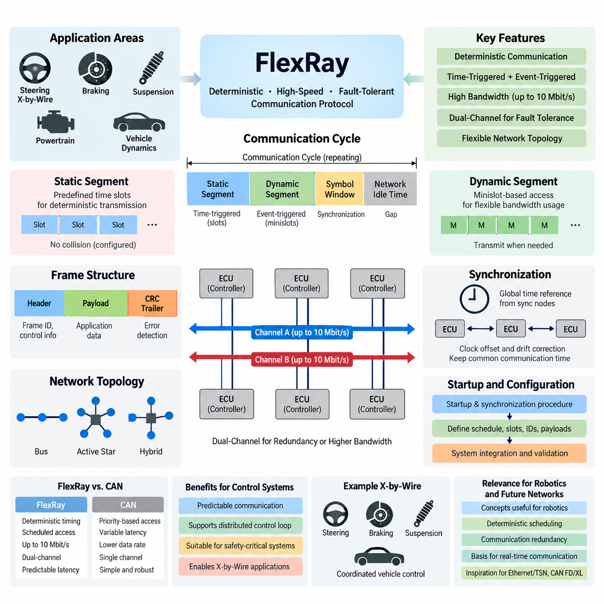
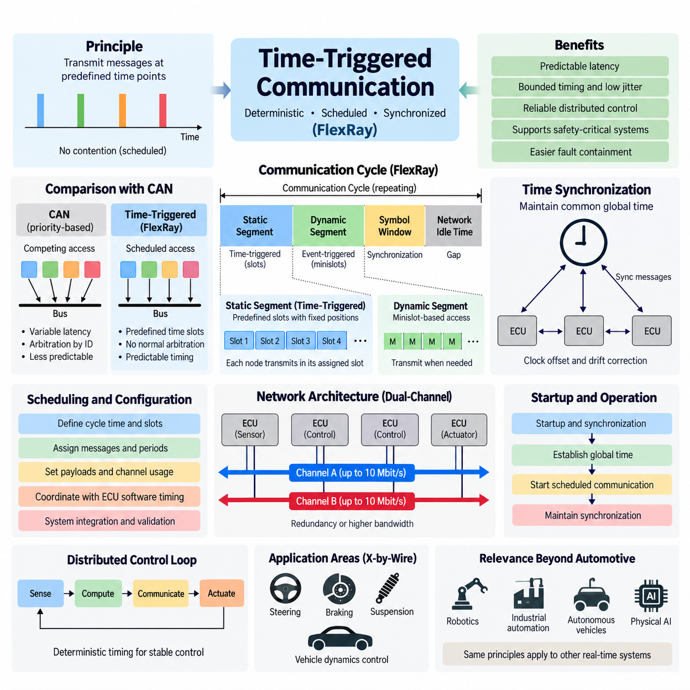
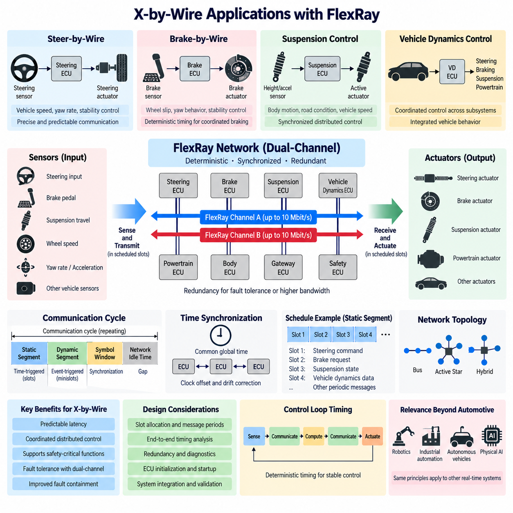
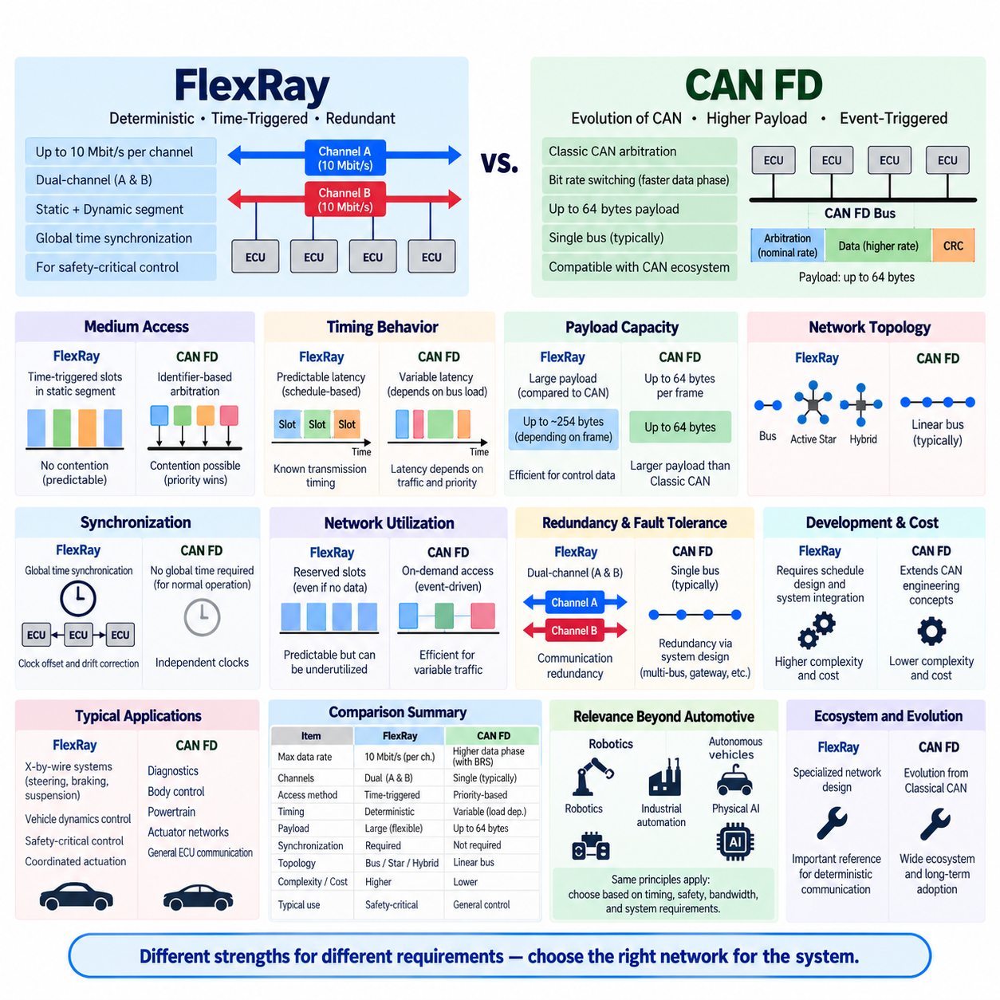
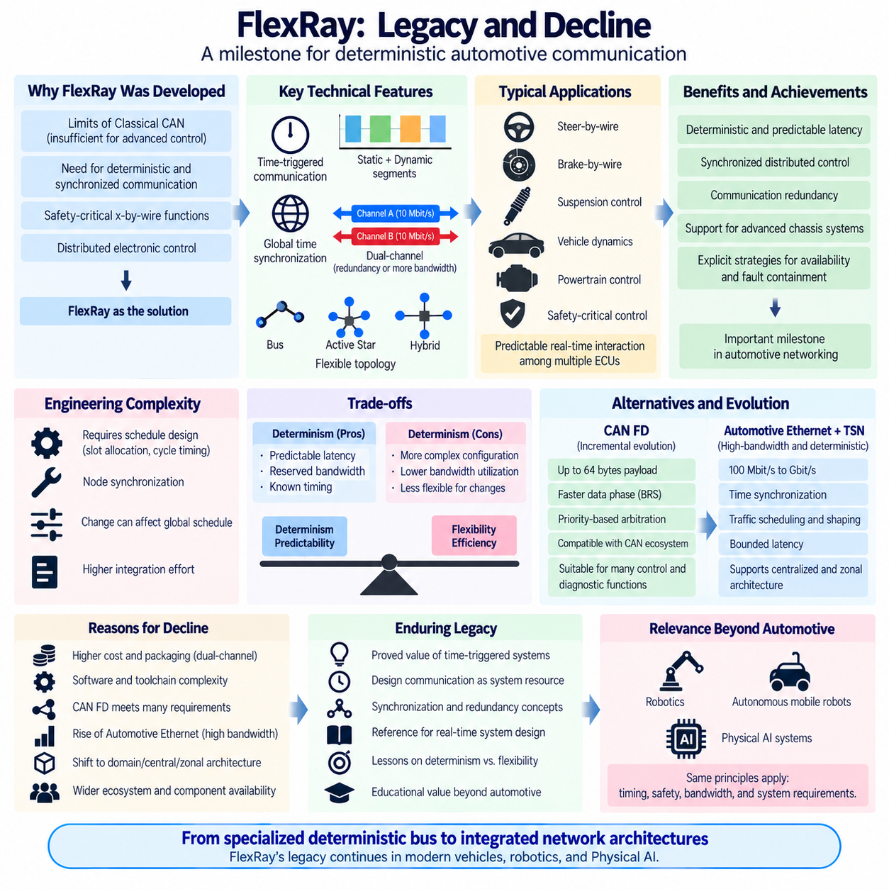

**Volume 06 Automotive Communication**

# Chapter 10. FlexRay

## 10.01. FlexRay Protocol Overview

{width="7.268055555555556in" height="7.268055555555556in"}

FlexRay is a deterministic, high-speed communication protocol developed for distributed electronic control systems that require predictable timing, fault tolerance, and greater bandwidth than traditional CAN networks. It was designed primarily for advanced automotive applications such as chassis control, powertrain coordination, and x-by-wire systems. The protocol combines time-triggered communication with optional event-triggered transmission, allowing safety-critical and conventional control traffic to coexist on the same network.

A fundamental characteristic of FlexRay is its deterministic communication behavior. Instead of allowing nodes to compete continuously for bus access, as occurs with CAN arbitration, FlexRay organizes communication according to a synchronized communication cycle. Each participating electronic control unit follows a common global time reference, enabling messages to be transmitted within predefined temporal positions. This architecture provides bounded latency and highly predictable message delivery for distributed real-time control.

The FlexRay communication cycle is divided primarily into a static segment and a dynamic segment. The static segment uses predefined time slots assigned to specific communication nodes, providing strictly deterministic transmission. The dynamic segment provides more flexible bandwidth utilization through a minislot-based access mechanism. Additional portions of the cycle support symbol transmission and network idle time, creating a structured repeating framework in which synchronization, deterministic control traffic, and flexible traffic can be coordinated.

During the static segment, every configured message occupies a predetermined slot within the communication schedule. A node transmits only when its assigned slot occurs, so collisions between correctly configured nodes are inherently avoided. This behavior makes the static segment especially suitable for signals such as steering commands, braking information, vehicle dynamics data, actuator targets, and synchronized sensor information where timing uncertainty must be tightly controlled.

The dynamic segment complements static scheduling by allowing communication resources to be allocated according to actual transmission requirements. It uses minislots rather than fixed full-length slots, enabling nodes with scheduled dynamic frames to transmit when appropriate. This provides greater flexibility for information that does not require the strict periodic timing of safety-critical control signals. FlexRay can therefore combine deterministic periodic communication and comparatively flexible event-oriented communication within one synchronized protocol.

FlexRay supports data rates of up to 10 Mbit/s per communication channel, representing a significant increase over classical CAN. More importantly, its architecture was designed around two independent physical communication channels, commonly identified as Channel A and Channel B. These channels can be used redundantly to improve fault tolerance or separately to increase available communication capacity. The configuration depends on system safety requirements, bandwidth allocation, topology, and redundancy strategy.

Dual-channel operation is particularly important in fault-tolerant architectures. The same safety-critical information may be transmitted through both channels so that communication can continue when one physical path is damaged or disturbed. Alternatively, different messages can be distributed between the channels to increase effective network capacity. This flexibility allows designers to trade redundancy against bandwidth while maintaining a common protocol and synchronization architecture across participating controllers.

FlexRay networks can employ several physical topologies, including passive bus structures, active star configurations, and combinations of these approaches. An active star contains electronic circuitry that receives and redistributes signals between connected branches, providing improved isolation between network sections. Hybrid arrangements can therefore be designed according to packaging, wiring, fault-containment, and availability requirements rather than forcing every controller onto one simple linear bus.

Time synchronization is one of the most important technical foundations of FlexRay. Selected nodes contribute synchronization information that allows distributed controllers to maintain a sufficiently consistent global communication time. Local oscillator differences inevitably create clock offset and drift, so the protocol periodically performs synchronization corrections. Maintaining this shared temporal reference ensures that nodes agree on communication-cycle boundaries and assigned transmission slots without requiring continuous centralized arbitration.

A FlexRay frame carries protocol control information together with application payload and error-detection information. The frame structure includes a header, payload, and trailer containing a cyclic redundancy check. Header information identifies characteristics such as the frame identifier and payload configuration, while the payload transports application data between distributed controllers. CRC mechanisms help receivers detect transmission corruption so invalid communication can be rejected before application software uses the affected information.

FlexRay also incorporates startup and synchronization procedures required to establish deterministic communication after power-up or network disturbance. Specific nodes may be configured with startup and synchronization capabilities, allowing the network to establish the communication schedule and global timing reference. Because distributed real-time systems cannot depend on arbitrary message timing during initialization, startup behavior is an integral part of the communication architecture rather than merely an implementation detail.

The protocol separates communication scheduling from application behavior through configuration parameters established during system integration. Engineers define communication cycles, slot assignments, frame identifiers, payload lengths, channel usage, and timing parameters before normal operation. Consequently, FlexRay engineering requires careful system-level planning. Changes to message allocation can influence timing across multiple ECUs, making communication schedule design an important part of overall electrical and electronic architecture development.

Compared with CAN, FlexRay places greater emphasis on guaranteed temporal behavior rather than priority-based arbitration. CAN provides excellent robustness and simplicity, but transmission latency varies according to bus load and message priority. FlexRay\'s static scheduling can guarantee that a critical frame receives its transmission opportunity at a known position in every configured cycle. This property historically made FlexRay attractive for distributed control functions requiring tightly coordinated actuator and sensor behavior.

FlexRay was therefore associated strongly with x-by-wire concepts in which mechanical or hydraulic relationships could increasingly be complemented or replaced by electronic sensing, computation, communication, and actuation. Steering, braking, suspension, and coordinated vehicle-dynamics functions require dependable exchange of control information between multiple controllers. Deterministic scheduling, redundant channels, synchronization, and fault-tolerant network structures provided architectural characteristics appropriate for investigating and implementing such safety-related distributed systems.

The deterministic nature of FlexRay also supports distributed control loops. When several controllers exchange sensor states, calculated commands, and actuator feedback, variations in network delay can affect control stability and response quality. A time-triggered schedule allows engineers to coordinate sensing, computation, transmission, and actuation against known temporal boundaries. Communication can therefore become part of the control-system timing design instead of behaving as an unpredictable external transport mechanism.

FlexRay should nevertheless be understood within the broader evolution of vehicle networking. The attached structure places it after Automotive Ethernet and before the historical MOST chapter, while subsequent FlexRay sections specifically address time-triggered communication, x-by-wire applications, comparison with CAN FD, and its legacy and decline. This organization reflects FlexRay\'s importance as both a practical automotive protocol and a reference architecture for understanding deterministic distributed communication.

For robotics and Physical AI systems, FlexRay remains conceptually valuable even where it is not selected as the actual communication technology. Modern robots similarly contain distributed sensors, motor controllers, safety controllers, embedded computers, and high-performance computing nodes with different latency and bandwidth requirements. FlexRay demonstrates how deterministic scheduling, synchronized clocks, communication redundancy, fault containment, and carefully engineered network timing can support dependable coordination between distributed physical components.

Modern Automotive Ethernet and Time-Sensitive Networking increasingly address similar requirements while supporting substantially larger data flows and integration with Ethernet-based computing architectures. CAN FD and CAN XL also extend the capabilities of the CAN family. FlexRay therefore occupies an important transitional position in communication engineering: it demonstrated that deterministic networking could be engineered directly into distributed vehicle control architectures while exposing the cost and complexity associated with rigid schedule configuration and specialized networking technology.

Understanding FlexRay provides a foundation for studying more general real-time communication principles. Its static and dynamic segments illustrate the tradeoff between deterministic resource reservation and flexible bandwidth utilization; its dual channels demonstrate communication redundancy; its global time model illustrates distributed synchronization; and its topology options show how physical architecture affects fault containment. These concepts remain directly relevant when designing safety-critical automotive networks, industrial systems, autonomous robots, and distributed Physical AI platforms.

## 10.02. Time Triggered Communication

{width="7.268055555555556in" height="7.268055555555556in"}

Time-triggered communication is a networking method in which message transmissions occur at predetermined points in time rather than being initiated primarily by asynchronous events. In FlexRay, this principle provides deterministic access to the communication medium and allows distributed electronic control units to exchange critical information according to a precisely defined schedule. Predictable timing is especially valuable when communication latency must be bounded and coordinated with real-time control functions.

The fundamental idea is to divide network operation into repeating communication cycles and assign specific transmission opportunities to participating nodes. Each node knows when it is permitted to transmit and when messages from other nodes are expected. Because these opportunities are established before normal operation, correctly configured nodes do not need to compete for the communication medium during scheduled transmissions. Network timing therefore becomes an engineered system property rather than a consequence of instantaneous traffic conditions.

A shared understanding of time is essential for this architecture. Every participating controller maintains a local clock, but oscillator tolerances cause individual clocks to drift relative to one another. FlexRay therefore incorporates distributed clock synchronization so that nodes maintain a sufficiently consistent global time reference. Periodic synchronization corrections compensate for clock offset and rate differences, allowing all participating nodes to interpret communication-cycle boundaries and scheduled transmission positions consistently.

The FlexRay communication cycle provides the temporal framework for time-triggered operation. It contains a static segment, dynamic segment, symbol window, and network idle time. The static segment is the portion most directly associated with strict time-triggered communication because it consists of predefined communication slots. The overall cycle repeats continuously, creating a periodic timeline that controllers can use to coordinate communication, computation, sensing, and actuation.

Within the static segment, communication resources are divided into slots with predefined positions and durations. A frame associated with a particular slot can be transmitted when that slot occurs during the communication cycle. Slot assignments are configured as part of the network schedule rather than determined dynamically through message arbitration. Consequently, the maximum waiting time for a periodically scheduled message can be analyzed from the communication configuration before the system begins operation.

This approach differs fundamentally from priority-based communication such as classical CAN. In CAN, several nodes may attempt transmission simultaneously, after which identifier-based arbitration determines which frame receives access to the bus. High-priority messages obtain favorable access, but latency depends partly on competing traffic. In a time-triggered static schedule, access has already been allocated in time, eliminating normal arbitration between correctly scheduled transmissions and producing much more predictable temporal behavior.

Deterministic communication does not mean that every message must be transmitted at the same frequency. Different signals can be assigned communication opportunities according to their individual update requirements. Fast control information may be transmitted every communication cycle, while slower status information may be transmitted only in selected cycles. FlexRay scheduling can therefore organize periodic communication according to application timing requirements while preserving deterministic transmission opportunities for critical messages.

The concept of a communication schedule extends beyond simple bus access. In a distributed control system, engineers can coordinate when sensor information is sampled, when data is transmitted, when a controller executes its algorithm, and when actuator commands are applied. This creates a predictable sense-compute-communicate-actuate sequence. When timing relationships are known in advance, control-loop latency and jitter can be analyzed systematically rather than treated as unpredictable network disturbances.

Time-triggered communication is particularly useful for distributed control loops in which timing variation can influence stability or performance. Steering, braking, suspension, and vehicle dynamics controllers may exchange states and commands repeatedly at fixed intervals. If communication timing varies significantly, receiving controllers must accommodate additional uncertainty. A deterministic schedule reduces this uncertainty and allows control algorithms and communication architecture to be designed around known temporal relationships.

FlexRay combines strict time-triggered communication with more flexible communication through its static and dynamic segments. The static segment reserves deterministic slots for periodic traffic, whereas the dynamic segment uses minislot-based access for information requiring greater flexibility. This hybrid structure recognizes that not every network message deserves permanently reserved bandwidth. Safety-critical control information can receive guaranteed communication opportunities while less deterministic traffic can use dynamically allocated portions of the cycle.

Bandwidth reservation is an important consequence of static scheduling. Once a slot is assigned to a particular communication function, that transmission opportunity exists according to the configured schedule even when the application has little new information to send. This provides temporal guarantees but may reduce utilization efficiency compared with fully event-driven communication. Time-triggered architecture therefore trades some flexibility and potentially some bandwidth efficiency for predictability, analyzability, and deterministic behavior.

Schedule design consequently becomes a significant system engineering activity. Engineers must determine communication-cycle parameters, slot allocation, message periods, payload requirements, channel assignments, and relationships among distributed control functions. A poorly designed schedule can waste bandwidth or create unnecessary delays, while an optimized schedule can provide deterministic communication with adequate capacity. Network configuration must therefore be developed together with ECU software timing and overall system architecture.

Startup introduces another important challenge because time-triggered communication cannot operate correctly until participating nodes establish a common understanding of network timing. FlexRay includes startup and synchronization mechanisms through which appropriately configured nodes contribute to establishing communication cycles and global time. After synchronization has been achieved, normal scheduled communication can proceed. Maintaining synchronization then becomes a continuous network function throughout system operation.

Dual-channel communication can further strengthen time-triggered architectures. FlexRay provides Channel A and Channel B, each supporting communication at up to 10 Mbit/s. Safety-critical frames can be transmitted redundantly over both channels when fault tolerance is required, or traffic can be distributed between channels when additional communication capacity is more important. Deterministic scheduling can therefore be combined with physical communication redundancy to support dependable distributed control.

Fault containment is also easier to reason about when communication behavior is temporally constrained. A correctly operating node is expected to transmit according to its configured communication opportunities rather than arbitrarily occupying the network. System designers can therefore define expected temporal behavior and identify deviations from that behavior. Together with error detection, redundant communication paths, synchronized operation, and appropriate network topology, this contributes to structured fault-tolerant communication architecture.

Time-triggered communication became particularly significant in the development of x-by-wire systems. Electronic steering, braking, suspension, and related vehicle control functions require reliable coordination among sensors, controllers, and actuators. Replacing or supplementing traditional mechanical relationships with distributed electronics increases dependence on communication timing. Known transmission opportunities, bounded latency, synchronized controllers, and redundant channels therefore provide valuable properties for safety-related distributed vehicle functions.

The same principles extend beyond automotive systems. Industrial automation, mobile robots, autonomous vehicles, and Physical AI platforms increasingly contain distributed sensors, embedded controllers, motor drives, safety systems, and high-performance computing nodes. Their communication technologies may differ from FlexRay, but predictable scheduling remains important whenever multiple physical components must execute coordinated actions under real-time constraints.

In robotics, a useful architectural distinction can be made between deterministic low-level control traffic and high-bandwidth computational traffic. Motor commands, actuator states, emergency information, and synchronized control signals often require bounded timing, while cameras, LiDAR point clouds, maps, and AI representations require much larger bandwidth. This illustrates why modern robotic systems frequently employ multiple communication technologies rather than forcing all information through one network with identical timing characteristics.

Modern Automotive Ethernet combined with Time-Sensitive Networking provides another approach to deterministic communication while retaining Ethernet compatibility and substantially greater bandwidth. CAN FD and CAN XL also extend traditional CAN architectures. Although these technologies differ from FlexRay, the engineering problem remains similar: critical data must reach the correct destination within an acceptable and preferably predictable time while sharing communication infrastructure with traffic having different priorities and bandwidth requirements.

Time-triggered communication should therefore be understood as a broader architectural principle rather than only a FlexRay mechanism. Its essential concepts are global time, periodic communication cycles, predefined transmission opportunities, bounded latency, controlled jitter, and coordinated distributed execution. FlexRay provides a particularly clear implementation of these concepts, making it useful for understanding how communication timing can become an explicitly designed part of a real-time cyber-physical system.

For Physical AI systems, this principle becomes increasingly important as perception, reasoning, control, and actuation are distributed across heterogeneous computing devices. High-level AI decisions may operate at relatively low frequencies while embedded controllers execute actuator loops at hundreds or thousands of cycles per second. Deterministic communication boundaries can help separate these temporal domains while ensuring that safety-critical commands and state information remain predictable, synchronized, and suitable for dependable physical interaction.

Ultimately, time-triggered communication transforms network access from an uncertain runtime competition into a planned temporal resource. Communication bandwidth, transmission opportunities, control execution, synchronization, and redundancy can be engineered together as part of the system architecture. This is the central lesson provided by FlexRay\'s time-triggered design and remains relevant to modern deterministic Ethernet, safety networks, autonomous machines, distributed robotics, and future Physical AI communication architectures.

## 10.03. FlexRay X-by-Wire Application

{width="7.268055555555556in" height="7.268055555555556in"}

FlexRay was developed in part to support advanced x-by-wire systems in which electronic sensing, communication, computation, and actuation replace or supplement conventional mechanical and hydraulic connections. Applications such as steer-by-wire, brake-by-wire, and electronically coordinated chassis control require communication with predictable timing because actuator behavior may depend directly on commands exchanged among distributed electronic control units.

In a conventional mechanical control system, the driver\'s input may be transmitted physically through shafts, hydraulic pressure, cables, or other mechanical mechanisms. X-by-wire changes this relationship by converting the input into electrical signals that are interpreted by controllers and transmitted to actuators. Communication networks consequently become part of the functional control path, making latency, synchronization, redundancy, error detection, and availability important system-level design considerations.

Steer-by-wire provides a representative example. A steering input sensor measures the driver\'s requested steering action, while electronic controllers calculate the required road-wheel angle and command steering actuators. Additional information such as vehicle speed, yaw rate, wheel speed, and stability-control states may influence the command. The communication system must transfer these signals predictably so sensing, computation, and actuation remain coordinated throughout the steering control loop.

Brake-by-wire creates similar requirements because braking commands can be generated electronically and distributed among braking controllers and wheel actuators. Vehicle dynamics functions may modify individual wheel commands according to wheel slip, yaw behavior, or stability objectives. Communication delays and excessive jitter can influence coordinated braking performance, so deterministic transmission opportunities are valuable when multiple controllers participate in a tightly coupled braking function.

Suspension and chassis-control systems also benefit from synchronized distributed communication. Electronic suspension controllers can process wheel movement, body acceleration, steering state, vehicle speed, and other dynamic information to adjust damping or active suspension forces. When steering, braking, and suspension controllers share synchronized information, vehicle-level control algorithms can coordinate multiple actuators instead of treating each chassis subsystem as an isolated control function.

FlexRay\'s static segment is particularly relevant to these applications because safety-related control messages can be assigned predefined transmission slots. A steering command, brake request, actuator status, or vehicle-dynamics signal can therefore receive a known communication opportunity during configured cycles. Unlike contention-based communication, scheduled transmission reduces uncertainty caused by changing network traffic and allows engineers to analyze communication latency as part of the distributed control-system timing budget.

The communication cycle also supports coordination between sensing and actuation. A sensor measurement can be acquired during a known period, transmitted in an assigned slot, processed by a controller, and followed by an actuator command during another defined communication opportunity. This creates a structured Sense-Communicate-Compute-Communicate-Actuate sequence. Such temporal organization helps engineers evaluate end-to-end response time rather than examining individual network messages independently.

Global time synchronization is essential when this coordination spans multiple ECUs. Each controller contains its own oscillator, and independent clocks naturally develop offset and drift. FlexRay synchronization mechanisms maintain a sufficiently consistent global communication time across participating nodes. Controllers can therefore relate local software execution and communication events to common cycle boundaries, improving the temporal consistency of distributed x-by-wire functions.

Redundancy is another important characteristic of FlexRay for x-by-wire architecture. Channel A and Channel B provide two physical communication paths, each capable of operating at up to 10 Mbit/s. Critical information can be transmitted over both channels when communication redundancy is required. If one path becomes unavailable because of wiring, connector, transceiver, or other communication faults, system architecture can use the redundant path as part of its fault-tolerance strategy.

Dual-channel communication alone does not make an x-by-wire system safe. Functional safety depends on the complete architecture, including sensors, power supplies, processors, communication paths, actuators, diagnostics, monitoring, fault handling, and degraded operating strategies. FlexRay contributes deterministic and redundant communication capabilities, but these capabilities must be combined with appropriate system-level safety mechanisms to achieve the required availability and fault response.

Network topology can also support fault-containment objectives. FlexRay permits passive bus, active star, and hybrid arrangements. An active star can electrically isolate communication branches and limit the propagation of certain physical faults. Designers can therefore consider communication topology together with redundant channels, ECU partitioning, power distribution, wiring routes, and connector architecture when constructing dependable distributed x-by-wire systems.

Predictable communication is especially useful for closed-loop control because variable network delay effectively becomes another uncertainty within the control loop. If sensor information and actuator commands arrive with strongly varying latency, controller design must tolerate additional timing variation. Scheduled FlexRay communication reduces this source of uncertainty by providing bounded transmission opportunities, allowing control engineers to coordinate controller periods and network schedules more systematically.

X-by-wire architectures also illustrate why communication freshness matters as much as successful message delivery. A control message may be correctly received but no longer represent the current physical state if it arrives too late. Deterministic schedules help establish expectations for when information should become available. Application software can then combine timing supervision, sequence monitoring, validity checks, and fault handling to detect information that is missing, delayed, inconsistent, or otherwise unsuitable for control.

Startup behavior requires special consideration because distributed x-by-wire functions cannot assume that synchronized communication exists immediately after power is applied. FlexRay includes startup and synchronization procedures that establish the communication cycle and common timing reference. System designers must coordinate these network states with ECU initialization, sensor readiness, actuator enable conditions, diagnostics, and safety-state management before normal closed-loop operation is permitted.

The deterministic schedule must also be designed according to control requirements. Faster signals may require transmission every communication cycle, whereas slower diagnostic or status information can use less frequent opportunities. Engineers therefore allocate slots and message periods according to control-loop frequency, allowable latency, payload size, redundancy requirements, and available bandwidth. Communication design becomes closely connected to functional architecture rather than remaining an independent wiring consideration.

FlexRay\'s combination of deterministic scheduling and flexible communication is useful when an x-by-wire network carries multiple traffic classes. Critical periodic commands can occupy the static segment, while less timing-critical information can use the dynamic segment. This separation allows the network to reserve predictable resources for control functions while retaining some flexibility for other communication requirements, although careful schedule engineering is necessary to avoid inefficient bandwidth allocation.

Vehicle-level coordination demonstrates the broader value of this architecture. Steering, braking, suspension, powertrain, and vehicle-dynamics controllers may exchange information to produce a coordinated response to driver requests and environmental conditions. A synchronized network provides a shared temporal framework for these distributed functions. The vehicle can therefore be treated increasingly as an integrated mechatronic control system rather than as a collection of independently operating electronic subsystems.

These concepts are also relevant to autonomous vehicles and mobile robots even when FlexRay itself is not used. A robot may contain an edge computer performing perception and planning, embedded controllers executing fast control loops, motor drives controlling actuators, and independent safety controllers supervising motion. The same architectural problem appears: high-level decisions must eventually be converted into reliable, timely, and verifiable commands for physical actuators.

In such robotic systems, high-bandwidth perception traffic and deterministic actuator traffic often have different communication requirements. Camera images, LiDAR point clouds, maps, and AI representations may favor Ethernet-class bandwidth, while motor commands, steering states, braking commands, emergency signals, and actuator feedback require predictable latency. The x-by-wire experience therefore provides useful principles for separating communication domains according to timing, bandwidth, and safety requirements.

Modern Automotive Ethernet with Time-Sensitive Networking increasingly provides deterministic communication capabilities while supporting much higher bandwidth and integration with Ethernet-based computing platforms. CAN FD and CAN XL also extend CAN-based architectures. FlexRay consequently represents an important historical and engineering reference for understanding how deterministic networking was introduced to support distributed safety-related vehicle control before newer communication architectures became dominant.

For Physical AI, the deeper lesson of FlexRay x-by-wire applications is that intelligent decision making cannot be separated from physical execution timing. An AI system may perceive the environment and generate sophisticated motion decisions, but those decisions ultimately reach steering systems, motors, brakes, joints, or other actuators through embedded control and communication layers. Predictable timing, synchronization, redundancy, diagnostics, and fault containment remain essential between intelligence and physical action.

FlexRay x-by-wire architecture therefore demonstrates the transition from communication as simple data transport to communication as an integral component of distributed control. By combining synchronized time, deterministic scheduling, redundant channels, structured topology, and coordinated ECU execution, the network can participate directly in the timing architecture of physical control. These principles remain valuable for modern autonomous vehicles, robotics, safety-critical machines, and distributed Physical AI systems.

## 10.04. FlexRay vs CAN FD Comparison

{width="7.268055555555556in" height="7.268055555555556in"}

FlexRay and CAN FD represent two different approaches to increasing communication capability beyond Classical CAN. FlexRay was designed around deterministic, time-triggered communication for distributed safety-related control, while CAN FD evolved the familiar CAN architecture by increasing payload capacity and accelerating the data phase. Their differences therefore involve not only bandwidth, but also media access, timing behavior, complexity, cost, and system architecture.

FlexRay provides a nominal data rate of up to 10 Mbit/s per channel and supports two independent communication channels. CAN FD retains CAN-style arbitration at the nominal bit rate but allows the data portion of a frame to operate at a higher bit rate through Bit Rate Switching. CAN FD also increases the maximum payload from the 8 bytes of Classical CAN to 64 bytes, improving efficiency when larger amounts of control or diagnostic data must be transferred.

The most fundamental architectural difference is how access to the communication medium is organized. FlexRay divides communication into repeating cycles containing a static segment and a dynamic segment. The static segment assigns predetermined time slots to messages, producing deterministic transmission opportunities. CAN FD instead uses identifier-based arbitration inherited from CAN, allowing nodes to begin transmission according to bus availability while higher-priority identifiers win simultaneous access attempts.

This distinction directly affects latency behavior. In a properly configured FlexRay static schedule, engineers know when a particular frame receives its communication opportunity, making maximum communication delay highly predictable. CAN FD provides priority-based deterministic arbitration in the sense that arbitration rules are precisely defined, but actual message latency still depends on current bus traffic, message priorities, frame lengths, and competing transmissions. FlexRay therefore offers stronger schedule-based temporal predictability.

CAN FD gains an important practical advantage from its evolutionary relationship with Classical CAN. Existing CAN engineering concepts, transceiver technologies, software architectures, diagnostic practices, and development experience can often be extended toward CAN FD without completely redesigning the network philosophy. FlexRay requires a more specialized communication architecture involving global synchronization, communication-cycle configuration, static slot allocation, startup behavior, and more extensive system-level schedule engineering.

Payload capacity also differentiates the technologies. FlexRay frames can transport considerably more application data than Classical CAN, while CAN FD explicitly extends the CAN payload to as much as 64 bytes per frame. Larger payloads reduce the overhead associated with splitting application information across numerous short CAN frames. This made CAN FD particularly attractive where engineers needed more data capacity while preserving the basic distributed and priority-oriented behavior of CAN networks.

FlexRay\'s dual-channel architecture provides another major distinction. Channel A and Channel B can be used redundantly so that important information is available through two communication paths, or they can carry different traffic to increase communication capacity. CAN FD networks are normally based on a single logical bus segment, although redundancy can certainly be implemented at the system level using multiple CAN networks, gateways, duplicated controllers, or other architectural mechanisms.

Time synchronization is much more deeply integrated into FlexRay operation. Participating nodes maintain a common understanding of communication time so they can identify cycle boundaries and assigned transmission slots. Clock offset and drift are continuously managed through synchronization mechanisms. CAN FD does not require this type of globally synchronized time-triggered schedule for normal bus arbitration, making its basic network configuration simpler but providing a different level of inherent temporal coordination.

FlexRay therefore fits naturally into distributed control architectures where communication timing itself forms part of the control design. Sensor sampling, message transmission, controller execution, and actuator commands can be coordinated around known communication cycles. CAN FD is often more suitable when messages must be exchanged efficiently according to priority and event occurrence without requiring every participating ECU to operate within a globally configured static communication schedule.

Network utilization illustrates an important tradeoff. FlexRay\'s static slots reserve communication opportunities even when the associated application does not always need to transmit new information. This reservation supports predictable latency but can leave bandwidth underutilized. CAN FD allows communication activity to follow actual message demand more naturally, which can provide efficient utilization for event-driven traffic, although increasing bus load also increases the possibility of lower-priority frames experiencing additional delay.

The FlexRay dynamic segment reduces some of the rigidity of purely static scheduling by using minislot-based access. Consequently, FlexRay is not exclusively a fixed time-division network; it combines highly deterministic static communication with more flexible dynamic traffic. Nevertheless, its overall architecture remains centered on synchronized communication cycles. CAN FD remains conceptually closer to traditional event-triggered CAN communication and therefore generally requires less schedule-oriented integration effort.

Fault tolerance also differs in implementation philosophy. FlexRay was developed with features such as dual communication channels, synchronized operation, structured startup, and topology options including active stars that can support fault containment. CAN FD inherits the robust error detection, fault confinement, retransmission behavior, and differential physical-layer concepts associated with CAN. Both can support dependable systems, but safety ultimately depends on the complete electronic architecture rather than the protocol alone.

Physical topology and wiring can influence architecture cost. FlexRay can use bus, active-star, and hybrid configurations, while dual-channel implementation may require additional wiring, transceivers, connectors, and network components. CAN FD commonly retains the comparatively straightforward linear bus topology associated with CAN. For applications in which deterministic dual-channel communication is unnecessary, the lower architectural complexity of CAN FD can provide significant cost and packaging advantages.

The development process is correspondingly different. FlexRay requires engineers to define cycle timing, slot allocation, frame identifiers, communication periods, channel usage, synchronization parameters, and startup configuration. Changes to one communication function may influence the global schedule. CAN FD network engineering still requires careful bit timing, bus-load analysis, identifier allocation, payload design, physical-layer validation, and latency analysis, but message additions generally do not require rebuilding a global time-slot schedule.

For x-by-wire and tightly coordinated chassis functions, FlexRay historically offered compelling advantages. Steering, braking, suspension, and vehicle-dynamics controllers could exchange information within predictable time windows while dual channels provided an architectural option for redundancy. CAN FD can also support many real-time control functions, but designers must verify worst-case latency under arbitration and bus-load conditions rather than relying on predefined static transmission slots.

For diagnostics, body control, powertrain communication, actuator networks, and many general ECU interactions, CAN FD offers a strong balance between performance and engineering simplicity. Its larger payload and faster data phase provide substantial improvement over Classical CAN without imposing the complete scheduling and synchronization framework associated with FlexRay. This evolutionary compatibility became an important factor as vehicle manufacturers sought higher network performance without unnecessary architectural complexity.

The comparison becomes especially relevant in robotics and autonomous mobile robots. Motor controllers, steering systems, battery management systems, safety controllers, and embedded devices frequently exchange relatively compact control messages for which CAN FD can be practical. A FlexRay-like deterministic architecture becomes attractive conceptually when multiple actuators require strict synchronized execution, but the added scheduling, hardware, and integration complexity must be justified by actual timing and safety requirements.

Neither FlexRay nor CAN FD is intended to replace high-bandwidth networks for every type of data. Cameras, high-resolution LiDAR, radar streams, maps, and AI representations can require bandwidth far beyond typical control-network requirements. Modern vehicles and Physical AI systems therefore increasingly combine CAN-family networks for embedded control with Automotive Ethernet for high-bandwidth communication, while gateways or domain controllers coordinate information between these network domains.

Automotive Ethernet with Time-Sensitive Networking further changes the comparison by combining Ethernet-scale bandwidth with mechanisms for bounded latency, traffic scheduling, synchronization, and deterministic communication. This addresses many requirements that originally motivated specialized deterministic networks while supporting modern centralized and zonal computing architectures. Consequently, FlexRay\'s architectural role has declined even though its deterministic communication principles remain technically important.

CAN FD followed a different evolutionary path and has remained valuable because it extends an already widespread communication ecosystem. Instead of replacing CAN\'s basic arbitration philosophy, it increases the amount of data transported per frame and accelerates frame transmission where supported. This makes CAN FD an incremental network evolution, whereas FlexRay represents a more fundamental architectural change toward globally synchronized and scheduled distributed communication.

From a system-engineering perspective, the choice should therefore not be reduced to a simple comparison of maximum bit rates. FlexRay emphasizes deterministic timing, synchronized execution, configurable redundancy, and predictable distributed control. CAN FD emphasizes compatibility with CAN concepts, flexible priority-based communication, increased payload capacity, improved throughput, and comparatively straightforward deployment. The appropriate architecture depends on timing guarantees, safety goals, network load, cost, complexity, and lifecycle requirements.

For Physical AI, the comparison illustrates a broader architectural principle. High-level intelligence, embedded control, and physical actuation operate at different time scales and generate different communication requirements. Some information benefits from event-driven priority access, while safety-critical control may require bounded and synchronized timing. Understanding FlexRay and CAN FD therefore helps engineers select communication mechanisms according to the temporal behavior of the physical system rather than bandwidth alone.

## 10.05. FlexRay Legacy and Decline

{width="7.268055555555556in" height="7.268055555555556in"}

FlexRay occupies an important place in the history of automotive networking because it demonstrated how deterministic, synchronized, and fault-tolerant communication could support distributed electronic control. It was developed for applications whose timing and reliability requirements exceeded what conventional CAN could comfortably provide, particularly coordinated chassis control and x-by-wire functions involving steering, braking, suspension, and vehicle dynamics.

Its technical significance came from treating communication timing as a designed system resource. FlexRay organized traffic into repeating communication cycles containing static and dynamic segments, allowing critical messages to receive predefined transmission opportunities. Global time synchronization kept distributed ECUs aligned with the schedule, while deterministic slots provided predictable latency that could be incorporated directly into control-system timing analysis.

The protocol also introduced a strong architectural emphasis on communication redundancy. Two independent channels, commonly called Channel A and Channel B, could carry duplicated safety-related information or be used separately for additional bandwidth. Combined with bus, active-star, and hybrid topologies, this allowed engineers to construct networks with explicit strategies for communication availability, physical fault isolation, and dependable distributed control.

These capabilities made FlexRay technically attractive during a period when automotive electronics were becoming increasingly distributed. Electronic steering, braking, suspension, powertrain, and stability functions required more frequent coordination among controllers. FlexRay offered up to 10 Mbit/s per channel together with deterministic scheduling, giving system designers a communication architecture specifically optimized for predictable real-time interaction among multiple ECUs.

However, the same characteristics that gave FlexRay deterministic behavior also increased engineering complexity. Static communication slots had to be planned before operation, communication cycles had to be configured carefully, and participating nodes required synchronization. Engineers therefore needed to coordinate message periods, slot assignments, payloads, channels, ECU execution timing, startup behavior, and network configuration as interconnected parts of the overall system architecture.

This schedule-oriented approach could make later system changes more difficult. Adding a message or changing its period was not always simply a local modification because communication resources were organized around a globally configured schedule. Engineers might need to reconsider slot allocation, timing relationships, and bandwidth distribution across several ECUs. This created greater integration effort than communication architectures in which messages could be added more flexibly according to priority and available bus capacity.

Reserved bandwidth created another tradeoff. A static slot remained part of the communication schedule even when the associated function did not have significant new information to transmit. This reservation was valuable because it guaranteed a predictable transmission opportunity, but it could reduce bandwidth utilization efficiency. Event-oriented communication could often use network capacity more dynamically, particularly for functions whose messages were irregular rather than strictly periodic.

CAN FD emerged as a practical alternative for many applications because it preserved the familiar CAN communication philosophy while increasing capability. It extended the maximum payload to 64 bytes and allowed a faster data phase through Bit Rate Switching. Engineers could therefore obtain substantially greater data efficiency while retaining identifier-based arbitration, established CAN engineering practices, familiar diagnostic concepts, and a large ecosystem of controllers, tools, and development knowledge.

The contrast with CAN FD illustrates one reason FlexRay became less attractive for functions that did not require strict time-triggered communication. If a system could meet its worst-case latency, reliability, and bandwidth requirements using CAN FD, the additional scheduling and synchronization complexity of FlexRay could be difficult to justify. CAN FD therefore offered an evolutionary path for many embedded control networks rather than requiring adoption of a fundamentally different communication architecture.

At the opposite end of the bandwidth spectrum, Automotive Ethernet became increasingly important as cameras, radar, high-resolution sensors, infotainment systems, centralized computing, and advanced driver-assistance functions generated much larger data flows. Ethernet technologies provided a scalable path toward hundreds of megabits and eventually gigabit-class communication, making specialized control networks with much lower bandwidth less suitable for carrying the growing volume of vehicle data.

Time-Sensitive Networking further strengthened the role of Ethernet by introducing mechanisms relevant to deterministic communication. Time synchronization, traffic scheduling, prioritization, bounded-latency mechanisms, and traffic shaping allow Ethernet networks to address requirements that historically favored specialized real-time protocols. This created a path toward combining high bandwidth and deterministic communication within a common Ethernet-oriented architecture rather than maintaining a separate FlexRay domain.

Vehicle electrical and electronic architecture also changed. Traditional vehicles contained many distributed ECUs connected through multiple specialized buses, while newer designs increasingly employ domain controllers, central computing platforms, and zonal architectures. As computing functions consolidate, communication requirements shift toward high-capacity backbone networks combined with simpler local networks. This architectural evolution reduces the need for a specialized globally scheduled bus connecting numerous distributed control ECUs.

Cost and packaging considerations reinforced this transition. A dual-channel FlexRay implementation can require additional transceivers, wiring, connectors, network interfaces, and potentially active-star components. These elements occupy space, increase harness complexity, and contribute to system cost. When alternative networks can satisfy functional requirements with fewer specialized components, vehicle manufacturers have strong incentives to simplify communication architecture and reduce hardware diversity.

Software and toolchain complexity also influence protocol longevity. A communication technology must be supported not only by physical-layer hardware but also by configuration tools, middleware, diagnostic systems, test equipment, development processes, supplier expertise, and long-term component availability. Technologies based on widely adopted ecosystems can gain substantial economic advantages because engineering knowledge and infrastructure are reused across many applications and product generations.

FlexRay\'s decline should therefore not be interpreted as evidence that deterministic communication was unnecessary. Instead, many of the problems FlexRay addressed remain central to modern vehicle engineering. Predictable latency, clock synchronization, traffic scheduling, redundancy, fault containment, and coordinated distributed execution continue to matter. What changed was the broader technology environment and the availability of alternative mechanisms for achieving these properties.

Its legacy is particularly visible in the engineering discipline surrounding time-triggered systems. FlexRay demonstrated that communication schedules could be designed together with control execution, allowing sensor acquisition, message transmission, computation, and actuator commands to follow known temporal relationships. This approach encouraged engineers to analyze end-to-end timing rather than treating the network merely as a transparent channel between independently operating software components.

The protocol also provides an important lesson about the tradeoff between determinism and flexibility. Reserving resources in advance makes worst-case timing easier to guarantee, but rigid allocation can reduce adaptability and utilization efficiency. Event-driven communication provides greater flexibility, but latency becomes more dependent on traffic conditions. Modern real-time networking continues to manage essentially the same tradeoff through priority mechanisms, scheduled traffic, traffic shaping, and resource reservation.

For robotics and autonomous mobile robots, this history remains relevant. Embedded motor controllers, safety devices, steering systems, battery controllers, sensors, edge computers, and AI processors operate at very different frequencies and generate different types of traffic. A single communication technology is rarely optimal for all of them. CAN FD may handle compact embedded control traffic, while Ethernet can transport perception data and communication among high-performance computers.

Physical AI systems make this distinction even more important. AI perception and reasoning may run at tens of cycles per second, while embedded motion controllers can execute at hundreds or thousands of cycles per second. Camera and LiDAR data require high bandwidth, whereas actuator commands and safety states require predictable latency. FlexRay\'s legacy shows why network architecture should be designed according to timing classes, control criticality, bandwidth, and fault requirements rather than maximum throughput alone.

The historical transition from FlexRay toward CAN FD and Automotive Ethernet also demonstrates that technically sophisticated protocols do not survive solely because they offer superior capabilities in one dimension. Successful communication architectures must balance performance with cost, scalability, configuration effort, compatibility, component availability, software ecosystems, serviceability, and future architectural direction. Excess capability can become unnecessary complexity when system requirements can be satisfied more economically by another technology.

FlexRay consequently remains valuable as an educational reference even as its role in new architectures diminishes. Its static and dynamic communication segments demonstrate deterministic versus flexible resource allocation, its synchronization mechanisms illustrate distributed global time, its dual channels demonstrate communication redundancy, and its topology options illustrate fault containment. These concepts extend far beyond one automotive protocol and remain relevant to real-time cyber-physical systems.

Within the broader automotive communication structure, FlexRay therefore represents both an important technological achievement and a transitional architecture. CAN FD demonstrates the evolutionary extension of established embedded control networking, while Automotive Ethernet and TSN represent movement toward scalable high-bandwidth deterministic infrastructure. Studying FlexRay between these technologies helps explain why vehicle communication evolved from numerous specialized buses toward increasingly integrated network architectures.

The lasting lesson is not that FlexRay failed, but that the requirements it addressed migrated into newer architectures. Deterministic timing, synchronization, redundancy, and coordinated execution remain essential wherever communication participates directly in physical control. FlexRay\'s legacy therefore survives less as a dominant future network and more as a clear engineering model for designing dependable communication between sensing, computation, control, and actuation in vehicles, robotics, and Physical AI systems.
