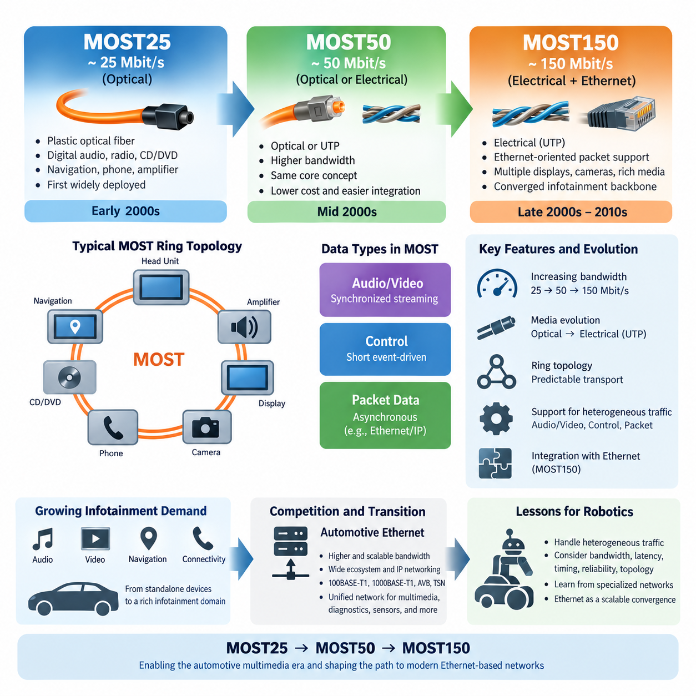
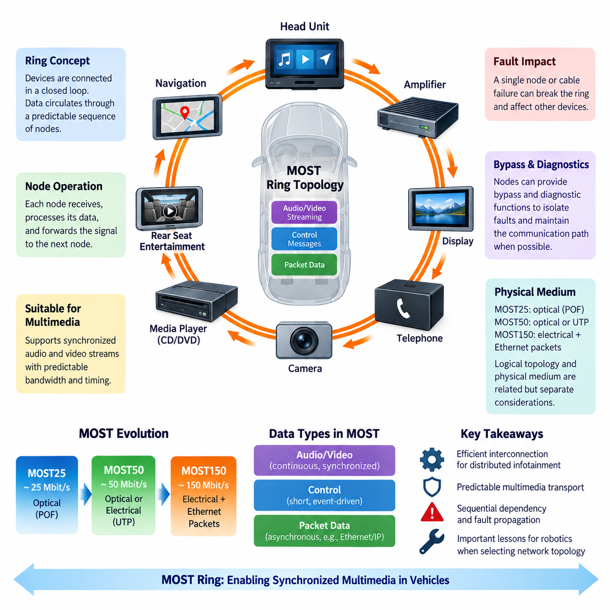
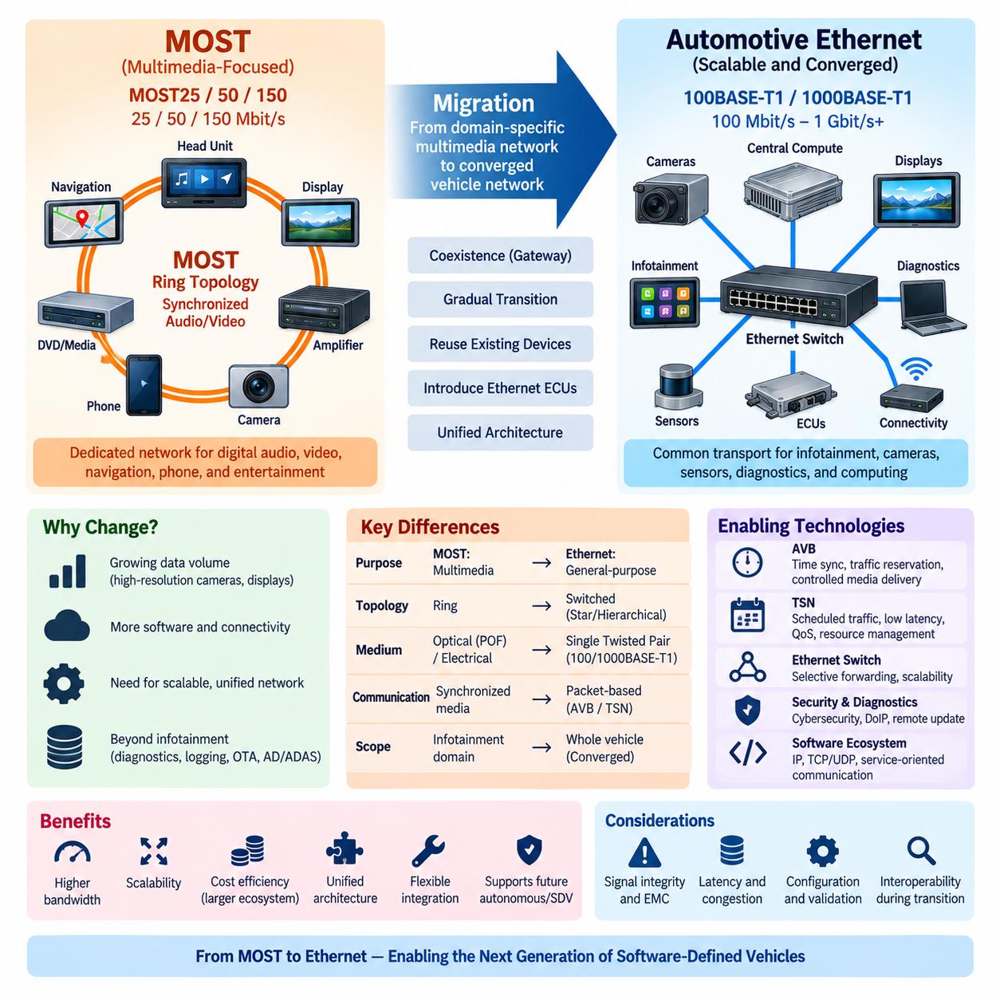
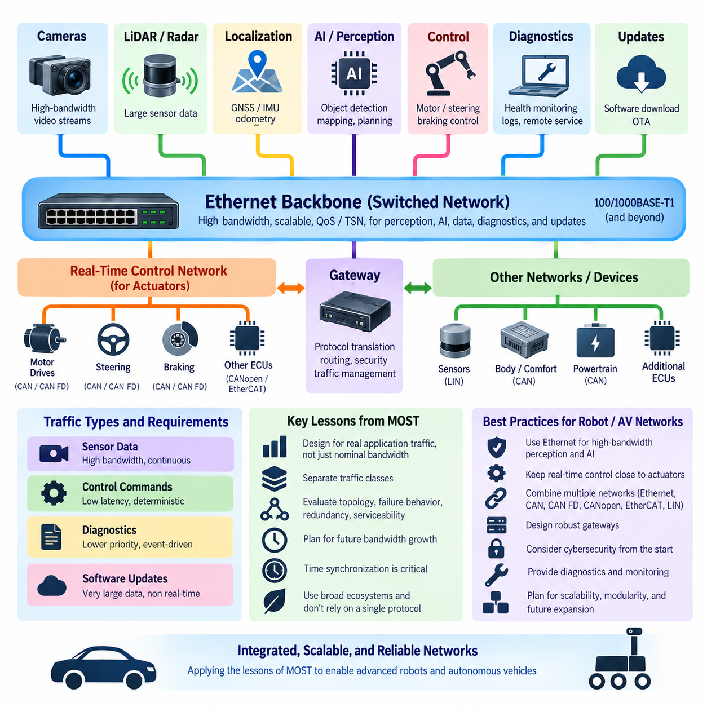

**Volume 06 Automotive Communication**

# Chapter 11. MOST History

## 11.01. MOST 25/50/150 Evolution

{width="7.268055555555556in" height="7.268055555555556in"}

미디어 지향 시스템 전송(Media Oriented Systems Transport, MOST)은 차량 내부에서 멀티미디어 데이터(Multimedia Data)를 전송하기 위해 개발된 전용 네트워크 기술이다. MOST25에서 MOST50을 거쳐 MOST150으로 발전한 과정은 자동차 인포테인먼트(Automotive Infotainment)의 대역폭 요구가 빠르게 증가한 역사를 보여준다. CAN과 같은 제어 중심 네트워크(Control-Oriented Network)와 달리 MOST는 분산된 멀티미디어 장치 사이에서 동기화된 오디오(Audio), 비디오(Video), 패킷 데이터(Packet Data), 제어 정보(Control Information)를 효율적으로 전송하도록 최적화되었다.

MOST25는 최초로 널리 적용된 세대로 약 25 Mbit/s의 전송 속도로 동작하였다. 주로 디지털 오디오 분배(Digital Audio Distribution), 라디오 수신기(Radio Receiver), CD 또는 DVD 시스템, 내비게이션 장치(Navigation Equipment), 전화 인터페이스(Telephone Interface), 앰프(Amplifier) 등에 사용되었다. 기존 차량 네트워크의 대역폭이 비교적 제한적이던 시기에 MOST25는 점차 복잡해지는 인포테인먼트 장치를 상호 연결할 수 있는 효율적인 방법을 제공하였다.

MOST25의 주요 특징 중 하나는 광학 물리 매체(Optical Physical Media), 특히 플라스틱 광섬유(Plastic Optical Fiber, POF)를 사용했다는 점이다. 광 전송(Optical Transmission)은 전자기 간섭(Electromagnetic Interference, EMI)에 대한 높은 내성을 제공하고 차량에 분산된 멀티미디어 장치를 전기적으로 절연하는 데 유리했다. 이러한 특성은 점화 시스템, 전기 모터, 스위칭 전원장치 등 다양한 노이즈원이 존재하는 차량 환경에 적합했지만 광 커넥터와 설치 방식에는 추가적인 엔지니어링 제약이 따랐다.

MOST 네트워크는 일반적으로 멀티미디어 데이터가 여러 노드를 순차적으로 통과하는 논리적 링(Logical Ring) 구조로 구성되었다. 각 장치는 입력되는 데이터 스트림(Data Stream)을 수신하고 자신에게 할당된 정보를 추출한 후 필요한 정보를 삽입하거나 전달하고 다음 노드로 통신을 이어갔다. 이러한 구조는 예측 가능한 멀티미디어 전송을 제공했지만 노드 가용성(Node Availability), 바이패스 메커니즘(Bypass Mechanism), 커넥터 품질, 링 무결성(Ring Integrity)이 시스템 수준의 신뢰성에서 중요한 요소가 되었다.

멀티미디어 기능이 확장되면서 MOST25는 점차 대역폭 한계에 직면하였다. 고품질 오디오, 더욱 복잡한 내비게이션 화면, 뒷좌석 엔터테인먼트(Rear-Seat Entertainment), 향상된 인간-기계 인터페이스(Human-Machine Interface, HMI)는 초기 시스템에서 예상했던 것보다 훨씬 많은 데이터를 발생시켰다. 이에 따라 MOST50은 기존 MOST의 기본 개념을 유지하면서 약 두 배의 대역폭을 제공하여 자동차 산업이 더욱 데이터 집약적인 인포테인먼트 아키텍처로 전환할 수 있도록 지원하였다.

MOST50은 약 50 Mbit/s로 동작했으며 물리 계층(Physical Layer) 측면에서도 중요한 변화를 가져왔다. 광 전송 방식에만 의존하는 대신 비차폐 연선(Unshielded Twisted Pair, UTP)을 이용한 전기적 전송(Electrical Transmission)을 구현할 수 있었다. 이를 통해 MOST를 기존 자동차 제어 버스와 차별화했던 동기식 멀티미디어 네트워킹(Synchronized Multimedia Networking) 개념을 유지하면서 플라스틱 광섬유와 관련된 비용 및 취급상의 일부 문제를 줄일 수 있었다.

전기적 전송으로의 변화는 보다 광범위한 엔지니어링 절충관계(Engineering Tradeoff)를 보여준다. 광섬유는 우수한 전자기 적합성(Electromagnetic Compatibility, EMC)과 전기적 절연을 제공하는 반면, 구리 기반 통신(Copper-Based Communication)은 와이어 하니스 통합, 커넥터 선택, 제조, 수리 및 비용 관리 측면에서 유리할 수 있다. 따라서 MOST50은 단순한 비트 전송률 증가를 넘어 기존 통신 아키텍처가 차량 제조 요구사항에 대응하여 물리적 구현 방식을 변화시킨 사례라고 볼 수 있다.

MOST150은 MOST 기술에서 가장 큰 폭의 확장을 나타낸다. 약 150 Mbit/s의 총 데이터 전송률(Gross Data Rate)을 제공함으로써 다중 디스플레이, 디지털 오디오 채널, 카메라, 내비게이션 기능, 통신 인터페이스 및 다양한 멀티미디어 소스를 포함하는 고급 인포테인먼트 시스템을 지원할 수 있었다. 증가된 대역폭은 차량 제조사가 더욱 풍부한 엔터테인먼트 및 정보 서비스를 하나의 공통 멀티미디어 네트워크에 통합할 수 있도록 하였다.

MOST150의 중요한 발전 중 하나는 기존 MOST 전송 메커니즘에 더하여 이더넷 지향 패킷 통신(Ethernet-Oriented Packet Communication) 기능이 도입되었다는 점이다. 이를 통해 일반적인 이더넷 프레임(Ethernet Frame)과 IP 관련 트래픽(IP-Related Traffic)이 동기화된 스트리밍 서비스와 함께 존재할 수 있게 되었다. 따라서 MOST150은 결정론적 멀티미디어 전송(Deterministic Multimedia Transport)과 보다 유연한 패킷 통신을 결합하여 차량 인포테인먼트 시스템이 인터넷 기반 소프트웨어 및 네트워크 기술과 빠르게 통합되던 시대의 요구에 대응하였다.

MOST 아키텍처는 멀티미디어 시스템에서 요구되는 통신 특성이 서로 다르기 때문에 여러 종류의 트래픽(Traffic)을 구분하였다. 연속적인 오디오 또는 비디오 스트림은 예측 가능한 대역폭과 타이밍이 중요하지만 제어 메시지(Control Message)는 일반적으로 짧고 이벤트 기반(Event-Driven)이다. 반면 패킷 기반 통신(Packet-Oriented Communication)은 비동기적이며 순간적으로 데이터가 집중될 수 있다. 이러한 트래픽 유형을 분리하고 관리함으로써 MOST는 일반적인 ECU 제어 메시지만을 대상으로 하는 네트워크보다 이질적인 인포테인먼트 워크로드를 효과적으로 지원할 수 있었다.

MOST25, MOST50, MOST150에 걸친 발전은 대역폭, 물리 계층의 유연성, 패킷 기반 네트워킹(Packet-Oriented Networking)과의 통합이 단계적으로 향상된 과정으로 이해할 수 있다. MOST25는 약 25 Mbit/s에서 실용적인 동기식 멀티미디어 네트워킹을 확립했고, MOST50은 약 50 Mbit/s로 용량을 확대하면서 전기적 구현 가능성을 확장했으며, MOST150은 약 150 Mbit/s로 용량을 높이고 이더넷 방식의 데이터 통신과 더욱 긴밀하게 통합되었다.

이러한 발전은 차량 전자 시스템(Vehicle Electronics) 자체의 변화도 반영한다. 초기 인포테인먼트 시스템은 오디오와 기본적인 제어 정보를 교환하는 비교적 독립적인 장치들로 구성되었다. 이후 차량에는 내비게이션 컴퓨터, 고해상도 디스플레이, 연결성 모듈(Connectivity Module), 멀티미디어 저장장치, 고성능 앰프, 카메라 및 외부 통신 서비스가 통합되었다. 이에 따라 통신 네트워크 역시 특수한 오디오 분배 시스템에서 인포테인먼트 도메인(Infotainment Domain)을 위한 보다 광범위한 디지털 백본(Digital Backbone)으로 발전하였다.

이러한 발전에도 불구하고 MOST는 결국 자동차 이더넷(Automotive Ethernet)과의 경쟁에 직면하였다. 이더넷은 자동차 산업 외부에서도 막대한 기술 투자가 이루어졌으며 폭넓은 반도체 생태계, 익숙한 IP 네트워킹, 확장 가능한 대역폭 및 방대한 소프트웨어 생태계를 확보하고 있었다. 100BASE-T1, 1000BASE-T1, 오디오 비디오 브리징(Audio Video Bridging, AVB), 이후의 시간 민감형 네트워킹(Time-Sensitive Networking, TSN)이 성숙하면서 차량 제조사는 멀티미디어, 진단, 센서 정보 및 일반 패킷 데이터를 보다 통합된 네트워크 아키텍처에서 처리할 수 있는 대안을 확보하게 되었다.

그럼에도 MOST의 역사적 중요성은 상당하다. MOST는 차량 통신이 저대역폭 제어 버스(Low-Bandwidth Control Bus)를 넘어 분산된 전자 모듈 사이에서 동기화되고 대역폭이 보장된 멀티미디어 트래픽을 지원할 수 있음을 보여주었다. 트래픽 클래스(Traffic Class), 보장된 네트워크 자원(Guaranteed Resources), 네트워크 동기화(Network Synchronization), 스트리밍 통신(Streaming Communication), 제어 및 데이터 전송의 통합과 같은 개념은 이후 이더넷 기반 자동차 아키텍처에서 중요해진 여러 요구사항을 선행하였다.

로보틱스(Robotics)와 피지컬 AI(Physical AI) 시스템의 관점에서도 MOST25에서 MOST150으로의 발전은 MOST 자체가 주로 레거시 자동차 멀티미디어 기술임에도 유용한 아키텍처적 교훈을 제공한다. 현대 로봇 역시 결정론적 모터 제어(Deterministic Motor Control), 동기화된 카메라 스트림, LiDAR 데이터, 오디오와 비디오, 진단, 소프트웨어 업데이트 및 AI 컴퓨팅 통신처럼 특성이 서로 다른 트래픽을 동시에 처리한다. 따라서 통신 기술은 최대 대역폭뿐만 아니라 지연시간(Latency), 타이밍(Timing), 신뢰성(Reliability), 토폴로지(Topology), 트래픽 관리(Traffic Management)를 함께 고려하여 평가해야 한다.

보다 넓은 엔지니어링 관점에서 얻을 수 있는 교훈은 특화된 네트워크(Specialized Network)가 명확하게 정의된 응용 분야에서는 뛰어난 성능을 제공할 수 있지만 장기적인 아키텍처의 방향은 기술 생태계의 규모와 통합화(Convergence)에 의해서도 결정된다는 것이다. MOST는 증가하는 멀티미디어 요구를 충족하기 위해 25에서 50, 그리고 150 Mbit/s로 발전했지만 결국 이더넷이 더욱 확장 가능한 통합 경로를 제공하였다. 이러한 변화는 현대 차량과 고급 로봇 플랫폼이 점차 이더넷 중심 통신 백본(Ethernet-Centered Communication Backbone)을 채택하게 된 배경을 이해하는 데 중요한 역사적 맥락을 제공한다.

## 11.02. MOST Ring Topology

{width="7.268055555555556in" height="7.268055555555556in"}

미디어 지향 시스템 전송(Media Oriented Systems Transport, MOST)은 일반적으로 차량 전체에 분산된 멀티미디어 장치를 상호 연결하기 위해 링 토폴로지(Ring Topology)를 사용하였다. 모든 장치를 하나의 공유 멀티드롭 버스(Shared Multidrop Bus)에 연결하는 대신 MOST 노드는 순차적으로 연결되어 통신 경로가 폐쇄된 논리적 루프(Logical Loop)를 형성하였다. 이러한 구조는 데이터가 예측 가능한 순서로 인포테인먼트 구성요소를 통과할 수 있기 때문에 연속적인 멀티미디어 전송에 적합하였다.

일반적인 MOST 네트워크에서는 헤드 유닛(Head Unit), 내비게이션 시스템(Navigation System), 앰프(Amplifier), 디스플레이(Display), 전화 인터페이스(Telephone Interface), 미디어 플레이어(Media Player) 및 기타 멀티미디어 모듈이 링의 노드(Node)로 참여하였다. 각 노드는 이전 장치로부터 업스트림 연결(Upstream Connection)을 받고 다음 장치를 향해 다운스트림 연결(Downstream Connection)을 유지하였다. 마지막 노드는 통신 경로를 네트워크의 시작 부분으로 되돌려 논리적 링을 완성하였다.

링 내부의 통신은 순차적인 전달 과정(Ordered Forwarding Process)을 따랐다. 각 노드는 입력되는 MOST 신호를 수신하고 전송된 정보를 복원한 후 자신의 기능과 관련된 데이터를 처리하고 통신을 다음 노드로 전달하였다. 구현 방식과 트래픽 유형에 따라 노드는 자신에게 할당된 정보를 소비하거나 다른 장치를 위한 정보를 제공하면서 통신 경로의 연속적인 동작을 유지할 수 있었다.

이러한 순차적 구성은 CAN과 같은 기존 공유 버스 네트워크(Shared-Bus Network)와 근본적으로 달랐다. CAN에서는 여러 전자 제어 장치(Electronic Control Unit, ECU)가 하나의 공통 물리 매체에 접근하기 위해 경쟁하며 중재(Arbitration)를 통해 어떤 메시지가 전송될지를 결정한다. 반면 MOST 링에서는 통신이 정해진 네트워크 경로를 따라 진행되므로 주로 이벤트 기반 제어 메시지보다 연속적인 스트림과 조정된 데이터 전달이 필요한 멀티미디어 응용에 특히 적합하였다.

링 아키텍처(Ring Architecture)는 MOST의 핵심 특성이었던 동기화 전송(Synchronized Transport)을 지원하였다. 디지털 오디오와 비디오 응용은 단순히 패킷을 성공적으로 전달하는 것만으로 충분하지 않으며, 데이터 샘플이 적절하게 제어된 타이밍으로 도착해야 중단, 왜곡, 버퍼 고갈(Buffer Starvation), 동기화 문제를 방지할 수 있다. 따라서 MOST는 여러 상호 연결 장치에서 연속적인 멀티미디어 스트림에 예측 가능한 자원을 제공하도록 설계된 통신 메커니즘과 토폴로지를 결합하였다.

이 토폴로지를 이해하는 유용한 방법은 인포테인먼트 소스(Infotainment Source)에서 생성되어 앰프로 전달되는 오디오 스트림(Audio Stream)을 생각하는 것이다. 정보는 MOST 통신 구조에 진입한 후 필요한 노드의 순서를 거쳐 앰프가 자신에게 할당된 스트림을 수신할 때까지 전달된다. 동시에 다른 노드도 서로 다른 통신 활동에 참여할 수 있으므로 오디오, 제어 정보 및 기타 멀티미디어 관련 데이터를 하나의 네트워크에서 함께 처리할 수 있다.

링 구조는 차량 실내 여러 위치에 분산된 멀티미디어 시스템을 물리적으로 구성하는 데도 효율적이었다. 인포테인먼트 구성요소는 대시보드(Dashboard), 센터 콘솔(Center Console), 트렁크 공간(Luggage Compartment), 도어(Door), 뒷좌석 엔터테인먼트(Rear-Seat Entertainment) 영역 등 서로 다른 위치에 설치되는 경우가 많다. 인접 장치를 순차적으로 연결하면 멀티미디어 구성요소 사이에 다수의 전용 점대점 연결(Point-to-Point Connection)을 구성할 필요를 줄이면서 표준화된 통신 백본(Communication Backbone)을 형성할 수 있었다.

특히 MOST25는 링 토폴로지와 광 통신(Optical Communication)의 관계를 잘 보여주었다. 플라스틱 광섬유(Plastic Optical Fiber, POF)는 멀티미디어 모듈을 서로 연결하면서 전기적 절연과 높은 전자기 간섭(Electromagnetic Interference, EMI) 내성을 제공할 수 있었다. 광 신호가 링을 따라 노드에서 노드로 이동하기 때문에 커넥터 무결성(Connector Integrity), 광 감쇠(Optical Attenuation), 굽힘 반경(Bending Radius), 송신기 성능, 수신기 감도 및 올바른 배선 경로가 중요한 네트워크 엔지니어링 요소가 되었다.

그러나 단순한 링 구조에는 중요한 신뢰성 문제가 존재한다. 통신이 노드를 순차적으로 통과하기 때문에 하나의 노드 고장, 케이블 분리, 커넥터 손상 또는 광 경로 단절이 전체 통신 루프를 끊을 가능성이 있다. 따라서 하나의 물리적 고장이 실제로는 정상인 다른 장치의 통신에도 영향을 줄 수 있으며, 링 기반 아키텍처에서는 네트워크 진단(Network Diagnostics)과 고장 허용 메커니즘(Fault-Tolerance Mechanism)이 특히 중요해진다.

이러한 취약성을 줄이기 위해 실제 MOST 시스템에는 문제가 발생한 네트워크 구간을 식별하거나 격리할 수 있는 바이패스(Bypass) 및 진단 메커니즘(Diagnostic Mechanism)이 적용될 수 있었다. 정상적인 멀티미디어 기능을 수행할 수 없게 된 노드도 가능한 경우 통신 경로 자체는 유지할 필요가 있었다. 이러한 메커니즘은 토폴로지가 정상 상태의 데이터 흐름뿐만 아니라 고장의 전파(Fault Propagation)와 격리(Fault Containment) 방식까지 결정한다는 중요한 시스템 설계 원칙을 보여준다.

링 초기화(Ring Initialization) 역시 MOST 동작에서 중요한 부분이다. 정상적인 멀티미디어 서비스를 제공하기 전에 네트워크는 참여 장치를 인식하고 유효한 통신 구조를 확립해야 한다. 차량이 시동될 때 개별 멀티미디어 모듈은 서로 다른 부팅 시간(Boot Time)을 필요로 할 수 있다. 따라서 네트워크 관리(Network Management)는 전원이 공급된 하드웨어가 정상적인 통신 시스템으로 전환되어 예상되는 노드와 서비스가 올바르게 통신할 수 있도록 조정한다.

논리적 토폴로지(Logical Topology)는 물리 매체(Physical Medium)의 구체적인 구현과도 구분해야 한다. MOST는 MOST25, MOST50, MOST150을 거치며 발전하였고 이에 따라 물리 계층(Physical Layer)의 선택지도 변화하였다. 따라서 MOST 네트워크 개념이 상당한 연속성을 유지했다고 하더라도 광학 방식과 전기적 구현을 동일한 배선 기술로 간주해서는 안 된다. 논리적 데이터 구성과 물리적 전송 매체는 서로 관련되어 있지만 별개의 아키텍처 설계 요소이다.

MOST 링은 네트워크 토폴로지가 진단(Diagnostics)에 큰 영향을 미치는 이유도 보여준다. 통신이 사라졌을 때 엔지니어는 근본 원인이 응용 모듈의 고장인지, 트랜시버(Transceiver) 고장인지, 전원 손실인지, 케이블 손상인지, 커넥터 문제인지, 과도한 광 감쇠인지 또는 링의 다른 위치에서 발생한 단절인지 판단해야 한다. 따라서 링이 끊어진 위치에 따라 관찰 가능한 통신 경로가 달라질 수 있으므로 진단 절차에서는 노드의 연결 순서를 파악하는 것이 중요하다.

시스템 통합(System Integration) 관점에서 링은 서로 독립적인 인포테인먼트 기능 사이에 의존성을 형성한다. 내비게이션 장치, 앰프, 디스플레이 및 미디어 소스는 서로 매우 다른 응용 기능을 수행하지만 통신 가용성(Communication Availability)은 공유 네트워크 구조의 건전성에 의존한다. 따라서 전기 아키텍처 설계에서는 전원 시퀀싱(Power Sequencing), 접지(Grounding), 커넥터, 하니스 라우팅(Harness Routing), 전자기 적합성(Electromagnetic Compatibility, EMC), 진단 및 통신 토폴로지를 서로 독립적으로 보지 않고 함께 고려해야 한다.

MOST 링 토폴로지는 특정 응용 영역의 요구사항을 중심으로 최적화된 아키텍처를 보여준다는 점에서 역사적으로 중요하다. 기존 자동차 제어 네트워크가 이러한 워크로드를 처리하기에 충분한 대역폭을 제공하지 못하던 시기에 MOST는 동기화된 멀티미디어 정보를 전송하는 체계적인 방법을 제공하였다. 예측 가능한 멀티미디어 통신과 구조화된 상호 연결이 주요 장점이었던 반면, 순차적 의존성(Sequential Dependency), 고장 전파 및 특수 네트워크 하드웨어는 해결해야 할 과제였다.

로보틱스(Robotics)와 피지컬 AI(Physical AI) 시스템에서도 MOST 링은 MOST 자체를 사용하지 않더라도 유용한 아키텍처적 교훈을 제공한다. 로봇에는 카메라, 마이크, 디스플레이, 스피커, 인지 컴퓨터(Perception Computer), 모터 컨트롤러(Motor Controller) 및 다양한 분산 장치가 존재하며 각각 다른 대역폭과 타이밍 특성을 가진다. 따라서 설계자는 링, 스타(Star), 스위치드 이더넷(Switched Ethernet), 버스(Bus), 이중화 토폴로지(Redundant Topology) 가운데 어떤 구조가 대역폭, 지연시간, 배선 복잡성, 고장 허용성, 정비성 및 비용의 적절한 균형을 제공하는지 평가해야 한다.

현대 자동차 이더넷(Automotive Ethernet)은 특수한 MOST 링 대신 점차 스위치 기반(Switched) 및 계층형 네트워크 구조(Hierarchical Network Structure)를 채택하고 있다. 그럼에도 MOST를 연구하면 토폴로지를 단순한 배선도(Wiring Diagram)로만 간주해서는 안 되는 이유를 이해할 수 있다. 노드의 배치 방식은 통신 타이밍, 고장 동작, 진단, 확장성 및 시스템 통합에 직접적인 영향을 미친다. 따라서 MOST는 네트워크 토폴로지와 응용 요구사항을 동일한 차량 통신 아키텍처의 구성요소로 함께 설계해야 한다는 점을 보여주는 중요한 역사적 사례로 남아 있다.

## 11.03. MOST to Ethernet Migration

{width="7.268055555555556in" height="7.268055555555556in"}

미디어 지향 시스템 전송(Media Oriented Systems Transport, MOST)에서 자동차 이더넷(Automotive Ethernet)으로의 전환은 차량 통신 아키텍처의 중요한 변화를 의미한다. MOST는 동기화된 멀티미디어 트래픽(Synchronized Multimedia Traffic)을 위해 특별히 개발된 반면, 이더넷(Ethernet)은 범용 네트워킹 기술로 시작되었다. 차량이 점차 소프트웨어 정의(Software-Defined)되고 데이터 집약적으로 변화하면서 제조사는 인포테인먼트, 진단, 센서, 게이트웨이 및 컴퓨팅 플랫폼을 더욱 통합된 구조에서 지원할 수 있는 통신 백본(Communication Backbone)을 필요로 하게 되었다.

MOST는 디지털 오디오, 비디오, 내비게이션, 전화 및 엔터테인먼트 서비스를 위한 비교적 높은 대역폭 전송을 제공함으로써 초기 자동차 네트워크의 중요한 한계를 성공적으로 해결하였다. MOST25, MOST50, MOST150은 동기화된 멀티미디어에 적합한 메커니즘을 유지하면서 통신 용량을 단계적으로 증가시켰다. 그러나 이 기술은 차량 전체를 연결하는 범용 통신 백본으로 발전하기보다는 인포테인먼트 도메인(Infotainment Domain)과 강하게 연관된 기술로 남았다.

차량 전자 시스템(Vehicle Electronics)의 성장은 점차 네트워킹 문제 자체를 변화시켰다. 카메라는 지속적으로 대용량 데이터 스트림을 생성하기 시작했고, 디스플레이 해상도는 증가했으며, 내비게이션 시스템은 연결형 서비스(Connected Service)로 발전하였다. 또한 중앙 컴퓨팅 플랫폼(Central Computing Platform)은 다수의 분산 장치와 통신해야 했다. 동시에 진단, 소프트웨어 다운로드, 로깅(Logging), 외부 연결성이 증가하면서 패킷 기반 트래픽(Packet-Oriented Traffic)이 확대되었고, 이러한 워크로드는 특화된 멀티미디어 아키텍처보다 확장성이 높은 네트워크를 요구하였다.

자동차 이더넷은 기존 이더넷 생태계를 차량 요구사항에 맞게 적용함으로써 이러한 확장성을 제공하였다. 100BASE-T1과 이후의 1000BASE-T1 같은 기술은 자동차용 단일 연선(Single Twisted Pair)을 통해 고속 통신을 가능하게 하였다. 이에 따라 각각의 응용 도메인마다 별도의 네트워크 계열을 유지하는 대신 인포테인먼트, 카메라, 게이트웨이, 진단 및 고성능 컴퓨팅 시스템에 이더넷을 공통 전송 기술(Common Transport Technology)로 사용하는 것이 점차 가능해졌다.

이러한 전환은 단순히 하나의 케이블 기술을 다른 기술로 교체하는 과정이 아니었다. MOST는 멀티미디어 타이밍과 자원 할당(Resource Allocation)에 특별히 최적화된 통신 개념을 포함하고 있었던 반면, 기존 이더넷은 역사적으로 패킷 기반의 최선형 통신(Best-Effort Communication)에 의존하였다. 따라서 까다로운 실시간 응용에서 이더넷이 특화된 멀티미디어 네트워크를 대체하려면 타이밍, 대역폭, 동기화 및 트래픽 우선순위를 보장하는 추가적인 메커니즘이 필요했다.

오디오 비디오 브리징(Audio Video Bridging, AVB)은 이러한 문제를 해결하는 중요한 단계였다. AVB는 이더넷 네트워크에서 시간 동기화(Time Synchronization), 트래픽 예약(Traffic Reservation), 오디오 및 비디오 스트림의 제어된 전달을 위한 메커니즘을 제공하였다. 이러한 기능을 통해 이더넷은 이전에 MOST와 같은 특화된 멀티미디어 네트워크가 담당했던 응용을 지원할 수 있게 되었으며, 예측 가능한 미디어 전달을 유지하면서 훨씬 광범위한 이더넷 생태계를 활용할 수 있게 되었다.

시간 민감형 네트워킹(Time-Sensitive Networking, TSN)은 이러한 개념을 더욱 확장하였다. TSN은 정밀한 시간 동기화, 스케줄 기반 트래픽(Scheduled Traffic), 트래픽 셰이핑(Traffic Shaping), 제한된 지연시간(Bounded Latency), 자원 관리(Resource Management)를 위한 메커니즘을 제공한다. 이러한 기능을 통해 이더넷은 인포테인먼트를 넘어 더욱 다양한 통신 유형에 적합해졌으며, 일반 패킷 트래픽과 시간 민감형 스트림(Time-Sensitive Stream)을 동시에 전송하면서 시스템 요구사항에 따라 트래픽 클래스 사이의 간섭을 제어할 수 있게 되었다.

전환 과정에서는 네트워크 토폴로지(Network Topology) 역시 변화하였다. MOST는 일반적으로 정보가 멀티미디어 노드를 순차적으로 통과하는 논리적 링(Logical Ring)을 사용하였다. 반면 자동차 이더넷은 일반적으로 스타(Star), 계층형(Hierarchical), 존 기반(Zonal) 또는 백본(Backbone) 구조로 구성된 스위치 기반 점대점 링크(Switched Point-to-Point Link)를 사용한다. 따라서 이더넷 스위치(Ethernet Switch)는 모든 스트림이 미리 정해진 장치 순서를 통과하도록 하는 대신 엔드포인트 사이에서 트래픽을 선택적으로 전달하는 핵심 통신 요소가 된다.

이러한 스위치 기반 아키텍처(Switched Architecture)는 하나의 통신 링을 계속 확장하지 않고 추가 스위치 포트 또는 계층형 네트워크 세그먼트를 통해 새로운 장치를 연결할 수 있기 때문에 확장성을 향상시킨다. 또한 대역폭 할당과 트래픽 격리(Traffic Isolation)에 더 높은 유연성을 제공한다. 그러나 스위치는 전달 지연(Forwarding Latency), 큐 관리(Queue Management), 트래픽 우선순위, 동기화, 이중화(Redundancy), 사이버보안(Cybersecurity), 구성 및 진단 가시성(Diagnostic Visibility)과 같은 새로운 엔지니어링 요구사항을 발생시킨다.

따라서 MOST에서 이더넷으로의 전환은 순간적인 교체가 아니라 점진적으로 진행되는 경우가 많았다. 하나의 차량 플랫폼에 기존 MOST 장치와 새로운 이더넷 기반 ECU 및 컴퓨팅 시스템이 동시에 존재할 수 있었다. 이러한 과도기적 아키텍처(Transitional Architecture)에서는 게이트웨이(Gateway)가 서로 다른 통신 도메인을 연결하는 중요한 역할을 수행하였다. 이를 통해 제조사는 모든 서브시스템을 동시에 재설계하지 않고도 새로운 네트워킹 기술을 단계적으로 도입할 수 있었다.

진단(Diagnostics) 역시 이더넷 통합의 중요한 장점 중 하나였다. 기존 자동차 진단 통신은 CAN 기반 프로토콜에 크게 의존했지만 대용량 소프트웨어 전송과 데이터 수집에는 점차 높은 대역폭이 필요해졌다. 이더넷을 사용하면 진단 통신, 응용 데이터, 로깅 및 소프트웨어 전송이 하나의 공통 고속 인프라를 공유할 수 있다. 이러한 방향은 이후 인터넷 프로토콜 기반 진단(Diagnostics over Internet Protocol, DoIP)과 더욱 광범위한 소프트웨어 업데이트 아키텍처를 지원하는 기반이 되었다.

소프트웨어 아키텍처(Software Architecture) 역시 이러한 전환에서 중요했다. 이더넷은 IP, UDP, TCP, 서비스 지향 통신(Service-Oriented Communication), 표준화된 소프트웨어 인터페이스와 같은 기존 컴퓨터 네트워킹 기술을 자연스럽게 지원한다. 이러한 호환성은 임베디드 차량 네트워크, 엣지 컴퓨팅 플랫폼(Edge Computing Platform), 백엔드 인프라(Backend Infrastructure), 개발 환경 사이의 기술적 차이를 줄인다. 결과적으로 차량 통신은 주류 컴퓨팅 및 소프트웨어 엔지니어링 방식과 더욱 긴밀하게 통합될 수 있게 되었다.

경제적인 기술 생태계(Economic Technology Ecosystem) 측면에서도 이더넷이 유리하였다. MOST는 비교적 특화된 자동차 기술 생태계에 의존했지만 이더넷은 엔터프라이즈 네트워킹, 통신, 산업 자동화, 소비자 전자제품 및 데이터센터 등 다양한 산업에서 수십 년 동안 발전해 왔다. 따라서 반도체, 스위치, 물리 계층 장치(Physical Layer Device, PHY), 프로토콜 스택, 진단 도구, 개발 환경 및 엔지니어링 전문성이 훨씬 더 큰 글로벌 기술 기반을 통해 지속적으로 발전할 수 있다.

그러나 이더넷으로의 전환이 대역폭 증가만으로 모든 문제를 해결한 것은 아니다. 고속 전기 링크(High-Speed Electrical Link)는 세심한 신호 무결성(Signal Integrity) 설계, 임피던스 제어(Impedance Control), 커넥터 엔지니어링, 전자기 적합성(Electromagnetic Compatibility, EMC), 케이블 라우팅 및 검증을 요구한다. 또한 네트워크 설계자는 혼잡(Congestion), 지연시간, 동기화, 고장 전파, 사이버보안 및 서비스 품질(Quality of Service, QoS)을 관리해야 한다. 따라서 더 높은 대역폭은 통신 제약을 제거하는 것이 아니라 엔지니어링 문제의 형태를 변화시킨다.

MOST에서 이더넷으로의 전환은 도메인 특화 네트워크(Domain-Specific Network)에서 통합 차량 통신 아키텍처(Converged Vehicle Communication Architecture)로 이동하는 보다 광범위한 변화를 보여준다. 현대 차량은 다른 통신 도메인과 분리된 전용 멀티미디어 백본을 유지하기보다 중앙 집중형 또는 존 기반 컴퓨팅 시스템(Centralized or Zonal Computing System)을 고속 이더넷으로 연결하는 방향으로 발전하고 있다. CAN, CAN FD, LIN과 같은 저속 네트워크는 로컬 엔드포인트(Local Endpoint)에 계속 사용될 수 있으며 이더넷은 집선(Aggregation)과 백본 통신을 담당한다.

이러한 전환은 로보틱스(Robotics)와 피지컬 AI(Physical AI)에도 직접적인 의미가 있다. 현대 로봇은 카메라, LiDAR, 마이크, 모터 컨트롤러, 안전 장치, AI 가속기(AI Accelerator), 저장 시스템 및 원격 관리 인터페이스에서 서로 다른 특성의 트래픽을 생성한다. 확장 가능한 이더넷 백본은 고성능 컴퓨팅 자원을 연결할 수 있으며 CAN, CAN FD, EtherCAT 또는 다른 특화 네트워크는 특정 저수준 제어 기능에 계속 적합할 수 있다. 따라서 네트워크 통합(Network Convergence)이 반드시 모든 위치에서 하나의 프로토콜만 사용한다는 의미는 아니다.

MOST에서 자동차 이더넷으로의 역사적 전환은 대역폭, 소프트웨어 통합, 확장성 및 기술 생태계에 대한 요구가 단순한 특화성보다 중요해질 때 통신 아키텍처가 어떻게 변화하는지를 보여준다. MOST는 효과적인 동기식 멀티미디어 네트워킹(Synchronized Multimedia Networking)을 구현했으며, 이더넷은 보다 광범위한 통합 통신으로 발전할 수 있는 경로를 제공하였다. 미래의 차량 및 로봇 아키텍처가 얻을 수 있는 핵심 교훈은 필요한 영역에서는 결정론적 동작(Deterministic Behavior)을 유지하면서 점점 다양해지는 데이터, 컴퓨팅 및 소프트웨어 서비스를 통합할 수 있는 확장 가능한 네트워크를 구축해야 한다는 것이다.

## 11.04. Lessons for Robot AV Networks

{width="7.268055555555556in" height="7.268055555555556in"}

MOST의 역사는 로봇과 자율주행차(Autonomous Vehicle)의 통신 네트워크를 설계하는 데 여러 가지 유용한 교훈을 제공한다. MOST는 네트워크 아키텍처(Network Architecture)가 단순한 명목 대역폭(Nominal Bandwidth)이 아니라 실제 응용 트래픽(Application Traffic)을 중심으로 설계되어야 한다는 점을 보여주었다. 현대 로봇 플랫폼에서는 제어 명령, 카메라 스트림, LiDAR 데이터, 위치추정 정보, 진단, 소프트웨어 업데이트 및 AI 관련 데이터가 동시에 전달되며, 각각 서로 다른 타이밍과 신뢰성 요구사항을 가진다.

중요한 교훈 중 하나는 이질적인 트래픽(Heterogeneous Traffic)을 모든 메시지가 동일한 통신 특성을 가진 것처럼 취급해서는 안 된다는 것이다. 모터 명령은 낮고 예측 가능한 지연시간(Latency)을 요구할 수 있는 반면, 카메라 또는 LiDAR 스트림은 지속적인 고대역폭을 필요로 한다. 진단 메시지는 일반적으로 시간 중요도가 상대적으로 낮으며, 소프트웨어 업데이트는 밀리초 수준의 응답성을 요구하지 않으면서도 매우 큰 데이터 용량을 전송할 수 있다. 따라서 네트워크 아키텍처는 서로 다른 트래픽 클래스(Traffic Class)를 명확하게 구분해야 한다.

MOST는 동기화된 스트리밍(Synchronized Streaming), 제어 정보(Control Information), 패킷 기반 통신(Packet-Oriented Communication)을 구분함으로써 이러한 문제를 해결하였다. 로봇과 자율주행차 네트워크는 이더넷 서비스 품질(Ethernet Quality of Service, QoS), 트래픽 우선순위(Traffic Prioritization), 시간 민감형 네트워킹(Time-Sensitive Networking, TSN)과 같은 현대적인 메커니즘을 통해 동일한 원칙을 적용할 수 있다. 목적은 MOST를 그대로 재현하는 것이 아니라 대용량 인지 트래픽이 지연시간에 민감한 제어 또는 안전 관련 통신을 예기치 않게 방해하지 않도록 하는 것이다.

두 번째 교훈은 토폴로지(Topology)에 관한 것이다. MOST는 일반적으로 체계적이고 예측 가능한 통신 경로를 제공하는 링 아키텍처(Ring Architecture)를 사용했지만, 이러한 순차적 구조는 노드 사이에 의존성을 만들었다. 현대 로봇은 더욱 유연한 라우팅과 확장을 제공하는 스위치드 이더넷(Switched Ethernet), 스타(Star), 계층형(Hierarchical), 존 기반(Zonal) 구조를 점차 선호한다. 그러나 어떤 토폴로지를 선택하더라도 고장 전파(Failure Propagation), 케이블 복잡성, 지연시간, 이중화(Redundancy), 정비성(Serviceability)을 함께 평가해야 한다.

고장 동작(Fault Behavior)은 자율 시스템에서 특히 중요하다. 정상 상태에서는 완벽하게 작동하는 통신 네트워크라도 하나의 케이블, 커넥터, 스위치 또는 노드 고장으로 핵심 기능이 중단된다면 적절한 구조라고 할 수 없다. MOST의 경험은 네트워크를 통해 고장이 어떻게 전파되는지 검토해야 하는 이유를 보여준다. 로봇 아키텍처에서는 핵심 통신 경로를 식별하고 이중화 링크(Redundant Link), 독립적인 안전 네트워크(Safety Network), 바이패스 경로(Bypass Path) 또는 성능 저하 운전 모드(Degraded Operating Mode)가 필요한지를 판단해야 한다.

대역폭 계획(Bandwidth Planning) 역시 중요한 교훈을 제공한다. MOST는 멀티미디어 요구사항이 지속적으로 증가하면서 약 25 Mbit/s에서 50 Mbit/s, 최종적으로 150 Mbit/s까지 발전하였다. 로봇 네트워크에서는 카메라 해상도와 프레임률(Frame Rate), LiDAR 데이터 밀도, 레이더 처리량, AI 모델 간 데이터 교환이 증가하면서 이러한 현상이 더욱 강하게 나타난다. 따라서 현재의 평균 트래픽만을 기준으로 설계하면 추가 센서나 기능이 도입된 직후 네트워크가 실질적인 한계에 도달할 수 있다.

그러나 최대 대역폭(Peak Bandwidth)만으로는 충분한 설계 지표가 될 수 없다. 네트워크 이용률(Network Utilization), 버스트 동작(Burst Behavior), 패킷 크기, 스위치 버퍼링(Switch Buffering), 프로토콜 오버헤드, 지연시간, 지터(Jitter), 동기화 요구사항도 함께 고려해야 한다. 명목상 1 Gbit/s의 이더넷 링크라고 해서 혼잡 상황에서도 모든 응용에 예측 가능한 서비스를 보장하는 것은 아니다. 따라서 엔지니어링 분석에서는 최악 조건의 트래픽과 인지, 제어, 로깅, 진단 및 업데이트가 동시에 수행될 때의 상호작용을 고려해야 한다.

여러 센서가 하나의 공통 인지 모델(Perception Model)에 정보를 제공하는 경우 시간 동기화(Time Synchronization)는 특히 중요해진다. 카메라 영상, LiDAR 포인트 클라우드(Point Cloud), 레이더 측정값, IMU 데이터, 휠 오도메트리(Wheel Odometry), GNSS 정보는 정확한 센서 융합(Sensor Fusion)을 위해 일관된 타임스탬프(Timestamp)를 필요로 할 수 있다. MOST에서는 멀티미디어 스트림의 동기화를 위해 시간 관리가 중요했지만, 현대 자율 시스템에서는 이러한 요구가 인지, 위치추정, 지도작성, 제어 및 분산 컴퓨팅까지 확대된다.

MOST에서 자동차 이더넷(Automotive Ethernet)으로의 전환은 기술 생태계(Technology Ecosystem)의 중요성도 보여준다. 특화된 프로토콜은 특정 목적에서 매우 뛰어난 성능을 제공할 수 있지만 장기적인 확장성은 반도체 공급, 개발 도구, 소프트웨어 지원, 엔지니어링 전문성, 상호운용성(Interoperability), 산업 전반의 채택 여부에 영향을 받는다. 로봇 역시 광범위한 기술 생태계를 활용하면서 결정론적 제어(Deterministic Control), 안전 또는 장치 호환성을 위해 필요한 영역에서는 특화된 통신 기술을 유지하는 것이 유리하다.

이러한 점은 중요한 아키텍처 원칙으로 이어진다. 네트워크 통합(Network Convergence)이 모든 위치에서 하나의 프로토콜만 사용해야 한다는 의미는 아니다. 고대역폭 카메라, AI 컴퓨터, 저장 시스템 및 중앙 컨트롤러는 이더넷을 통해 통신할 수 있는 반면, 모터 드라이브와 임베디드 컨트롤러(Embedded Controller)는 CAN, CAN FD, CANopen, EtherCAT 또는 기타 적절한 기술을 사용할 수 있다. 따라서 잘 설계된 로봇 네트워크는 내부적으로 이질적인 프로토콜을 사용하면서도 시스템 수준에서는 일관된 통신 아키텍처를 구성할 수 있다.

여러 통신 도메인(Communication Domain)이 공존하는 경우 게이트웨이(Gateway)가 중요해진다. 게이트웨이는 저수준 제어 네트워크와 고대역폭 컴퓨팅 네트워크 사이에서 정보를 라우팅하거나 변환할 수 있지만 동시에 지연시간, 처리 의존성, 구성 복잡성 및 잠재적인 고장 지점을 추가한다. 따라서 게이트웨이 설계에서는 메시지 소유권(Message Ownership), 라우팅 규칙, 타이밍 제약, 진단 동작, 사이버보안 경계(Cybersecurity Boundary), 게이트웨이 양쪽 네트워크 중 하나가 사용할 수 없게 되었을 때의 동작을 정의해야 한다.

자율주행차와 자율이동로봇(Autonomous Mobile Robot, AMR)의 실용적인 아키텍처에서는 저수준 결정론적 제어(Low-Level Deterministic Control)와 상위 수준의 인지 및 판단 연산을 분리하는 경우가 많다. 모터 컨트롤러, 조향 컨트롤러, 제동 장치 및 임베디드 제어 장치는 AI 컴퓨터의 모든 연산 주기에 의존하지 않고 상대적으로 높은 제어 주파수로 동작할 수 있다. AI 또는 엣지 컴퓨터(Edge Computer)는 서로 다른 판단 주기로 동작하면서 적절한 고속 네트워크를 통해 명령, 궤적(Trajectory), 상태 및 진단 정보를 교환할 수 있다.

이러한 분리는 인지 또는 AI 워크로드의 변화가 액추에이터 제어(Actuator Control)를 직접 불안정하게 만드는 것을 방지한다. 카메라 데이터를 처리하고 신경망(Neural Network)을 실행하는 GPU는 실행 시간이 변동될 수 있는 반면, 모터 제어 루프(Motor-Control Loop)는 예측 가능한 타이밍을 요구한다. 따라서 통신 아키텍처는 제어 계층(Control Hierarchy)을 반영해야 하며, 빠른 로컬 제어 루프는 액추에이터 가까이에 유지하고 인지, 계획(Planning), 월드 모델링(World Modeling), 미션 수준 지능(Mission-Level Intelligence)은 명확하게 정의된 인터페이스를 통해 상위 연산 계층에서 수행하도록 구성해야 한다.

이더넷은 인지 및 AI 시스템이 매우 큰 데이터셋을 생성할 수 있기 때문에 고성능 컴퓨팅 노드(High-Performance Computing Node) 사이의 통신에 특히 적합하다. 카메라, LiDAR, 지도작성 모듈, 엣지 GPU(Edge GPU), 데이터 기록장치(Data Recorder), 중앙 컴퓨터는 초당 수백 메가비트에서 수 기가비트 이상의 통신을 요구할 수 있다. 스위치드 이더넷은 확장 가능한 네트워크 분할(Segmentation)과 집선(Aggregation)을 지원하므로 센서와 컴퓨팅 요구사항이 증가할 때 하나의 공유 버스보다 자연스럽게 아키텍처를 확장할 수 있다.

그럼에도 저수준 네트워크(Lower-Level Network)는 여전히 중요하다. 대역폭만이 통신 기술 선택의 유일한 기준은 아니기 때문이다. CAN과 CAN FD는 임베디드 컨트롤러 사이에서 견고한 메시지 기반 통신(Message-Oriented Communication)을 제공하며, CANopen은 표준화된 장치 프로파일(Device Profile)과 제어 메커니즘을 제공한다. 산업용 로보틱스에서는 고도로 동기화된 분산 모션 제어(Distributed Motion Control)가 필요한 경우 EtherCAT을 사용할 수 있다. 따라서 단순히 가장 높은 대역폭을 가진 기술이 최선이라고 가정하기보다 기능적 요구사항에 따라 프로토콜을 선택해야 한다.

로봇 네트워크가 이더넷과 IP 기반 통신을 채택할수록 사이버보안(Cybersecurity)의 중요성도 커진다. 연결성이 증가하면 원격 진단, 플릿 관리(Fleet Management), 소프트웨어 업데이트, 클라우드 통합 및 서비스 지향 아키텍처(Service-Oriented Architecture)가 가능해지는 반면 공격 표면(Attack Surface)도 확대된다. 따라서 네트워크 분할, 인증(Authentication), 보안 게이트웨이(Secure Gateway), 통제된 외부 인터페이스, 업데이트 보안 및 모니터링은 네트워크 구현 이후에 추가되는 기능이 아니라 통신 아키텍처 자체의 일부로 고려해야 한다.

진단성과 정비성 역시 초기 설계 단계부터 고려해야 한다. MOST는 한 위치에서 발생한 고장이 다른 위치의 통신에 영향을 줄 수 있기 때문에 토폴로지가 문제 해결 과정에 직접적인 영향을 미친다는 점을 보여주었다. 로봇 네트워크는 관찰 가능한 링크 상태(Link Status), 노드 상태 정보(Node Health Information), 오류 카운터(Error Counter), 타임스탬프, 네트워크 통계, 진단 로그 및 명확한 물리적 접근 지점을 제공해야 한다. 이러한 기능은 자율 기계가 원격으로 운용되거나 대규모 플릿의 일부로 운영될수록 더욱 중요해진다.

결국 MOST에서 얻을 수 있는 가장 중요한 교훈은 통신 기술이 전체 시스템 아키텍처를 지배하는 것이 아니라 이를 지원해야 한다는 것이다. 로봇과 자율주행차 네트워크는 대역폭, 결정론적 특성(Determinism), 동기화, 안전성, 신뢰성, 비용 및 수명주기 요구사항에 따라 적절한 프로토콜을 조합해야 한다. 이더넷은 확장 가능한 고속 백본(High-Speed Backbone)을 제공하고, 필요한 경우 특화된 네트워크를 실시간 장치 가까이에 유지함으로써 더욱 정교한 피지컬 AI(Physical AI) 시스템을 지원할 수 있는 계층형 통신 아키텍처를 구축할 수 있다.
