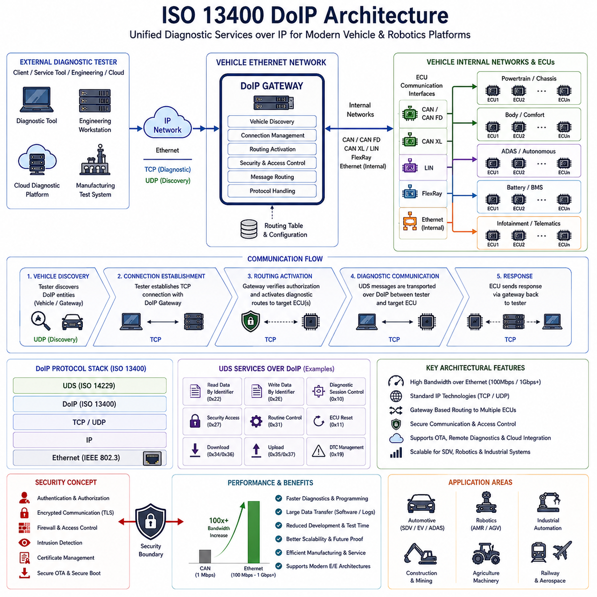
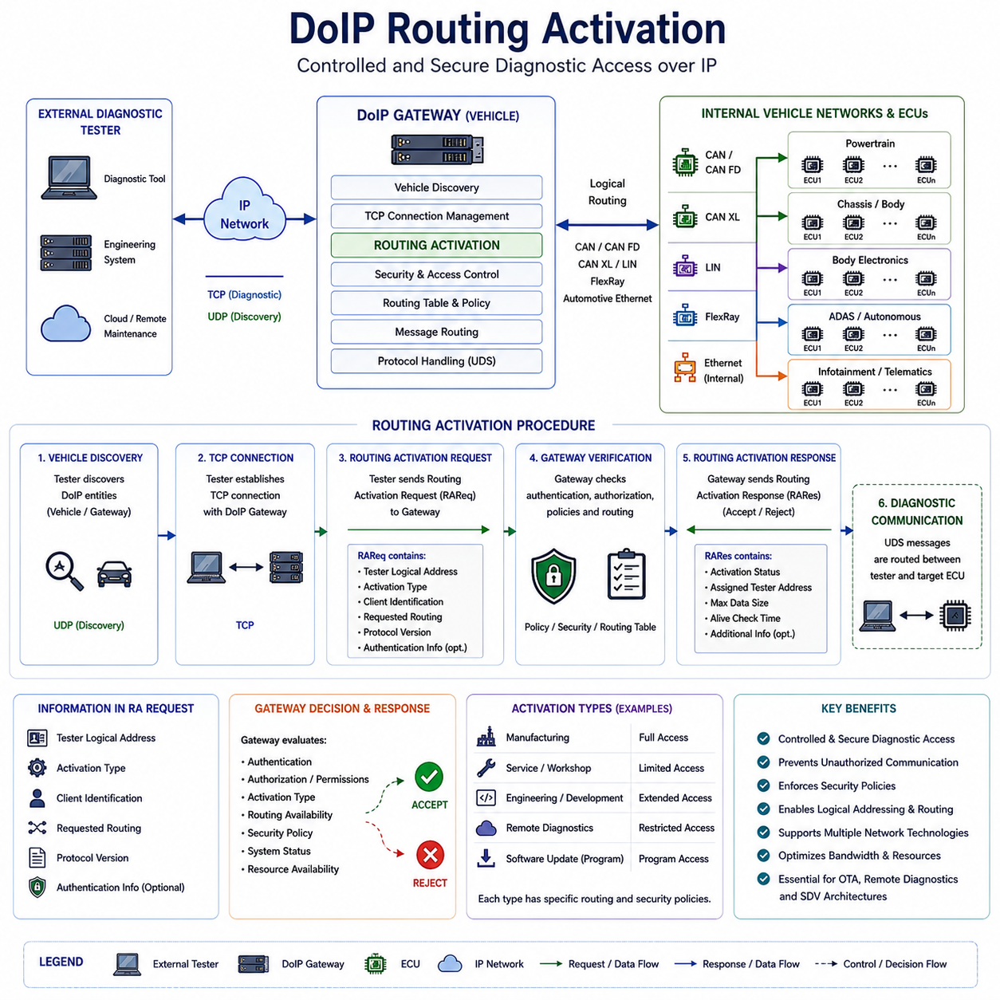
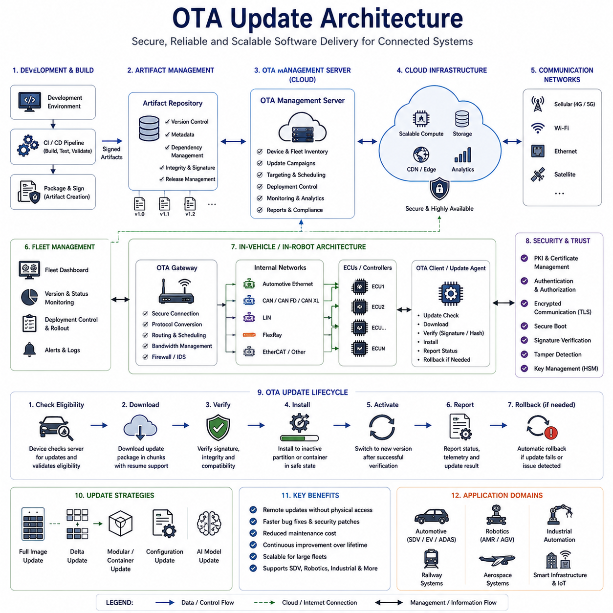
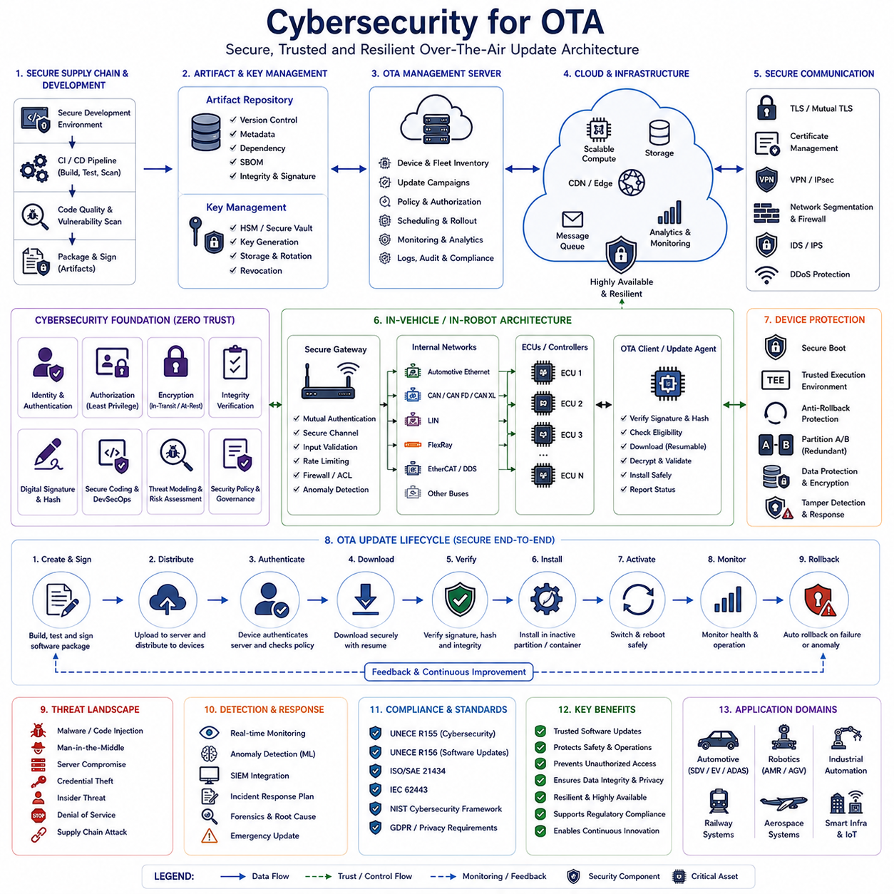
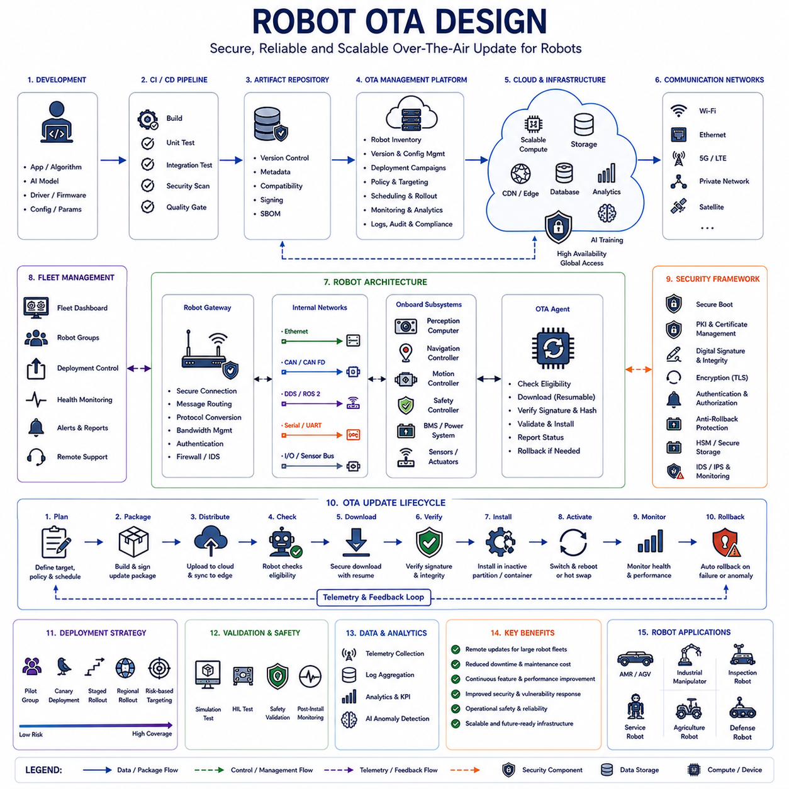

**Volume 06 Automotive Communication**

# Chapter 12. DoIP and OTA

## 12.1 ISO 13400 DoIP Architecture

{width="7.268055555555556in" height="7.268055555555556in"}

ISO 13400 Diagnostics over Internet Protocol (DoIP) Architecture represents one of the most significant advancements in modern automotive diagnostic communication systems. As vehicle electronic architectures evolve from traditional distributed ECU-based designs toward domain-based and zonal architectures supported by high-speed Automotive Ethernet networks, conventional diagnostic communication methods based on CAN, K-Line, and other low-bandwidth transport mechanisms increasingly struggle to satisfy modern requirements. The growing complexity of Software Defined Vehicles (SDVs), autonomous driving platforms, electric vehicles, industrial autonomous mobile robots, intelligent transportation systems, and Physical AI platforms has created demand for faster, more scalable, and more flexible diagnostic communication technologies. ISO 13400 DoIP addresses these requirements by enabling Unified Diagnostic Services (UDS) communication over Internet Protocol networks and Ethernet infrastructures. This transition represents a fundamental shift from traditional vehicle diagnostics toward network-oriented diagnostic architectures that align with future mobility platforms.

Historically, automotive diagnostics were implemented through serial communication technologies such as K-Line and later Controller Area Network. These technologies were highly effective when vehicles contained a relatively small number of ECUs and limited software complexity. However, modern vehicles frequently contain more than one hundred ECUs, multiple high-performance domain controllers, centralized computing platforms, advanced driver assistance systems, battery management systems, infotainment systems, telematics modules, and autonomous driving computers. Software sizes have increased from a few megabytes to hundreds of gigabytes, and firmware updates now involve transferring massive quantities of data. Under these conditions, traditional CAN-based diagnostic communication becomes a bottleneck. DoIP was developed to leverage Ethernet bandwidth and Internet Protocol communication principles, allowing diagnostic services to operate more efficiently within modern network architectures.

The fundamental objective of DoIP is to transport diagnostic information using standard Ethernet and IP-based communication infrastructures. Instead of relying on dedicated diagnostic buses, DoIP allows diagnostic testers, service tools, engineering workstations, manufacturing systems, and remote diagnostic platforms to communicate with vehicle ECUs using standard network technologies. This approach simplifies network integration while dramatically increasing communication bandwidth. The architecture enables diagnostic communication to coexist with other Ethernet-based services such as software updates, fleet management, cloud connectivity, sensor data exchange, cybersecurity monitoring, and centralized computing functions.

At the highest architectural level, a DoIP system consists of several key components. These include the external diagnostic tester, the vehicle Ethernet network, the DoIP Gateway, diagnostic servers residing within ECUs, routing mechanisms, transport protocols, network discovery services, and diagnostic applications. Each component contributes to establishing a reliable communication path between external diagnostic equipment and internal vehicle systems. Together they create a unified diagnostic environment capable of supporting both local and remote diagnostic operations.

The external diagnostic tester represents the client side of the DoIP architecture. This device may be a dealership service tool, manufacturing validation station, engineering development workstation, automated test system, fleet maintenance server, or remote cloud diagnostic platform. The tester initiates communication with the vehicle by establishing a network connection and identifying available diagnostic resources. Unlike traditional diagnostic systems that require specialized physical interfaces, DoIP enables standard Ethernet communication technologies to be utilized throughout the diagnostic process.

Within the vehicle, the DoIP Gateway serves as the central communication coordinator. The gateway acts as an interface between Ethernet-based diagnostic networks and internal communication domains. Modern vehicles often contain multiple communication technologies including CAN, CAN FD, CAN XL, LIN, FlexRay, Automotive Ethernet, and proprietary communication buses. The DoIP Gateway routes diagnostic requests between external testers and target ECUs regardless of the underlying communication technology used by those ECUs. This abstraction significantly simplifies diagnostic access and reduces the complexity of diagnostic tool implementation.

One of the most important functions within the DoIP architecture is vehicle discovery. Before diagnostic communication can begin, the external tester must identify the presence of the vehicle and obtain information about available diagnostic services. ISO 13400 defines discovery mechanisms that allow testers to locate DoIP-enabled vehicles within an Ethernet network environment. Discovery messages enable identification of vehicle identity, network addresses, supported services, protocol versions, and communication capabilities. This process is conceptually similar to device discovery mechanisms used in enterprise networking environments.

Following vehicle discovery, connection establishment procedures are performed. The diagnostic tester establishes communication with the DoIP Gateway using standard IP networking principles. Typically, TCP is utilized for reliable diagnostic message exchange because diagnostic communication requires guaranteed delivery and ordered transmission. UDP may also be employed for specific discovery and announcement services. The use of standardized transport protocols allows DoIP systems to leverage existing networking infrastructure while maintaining compatibility with established IT technologies.

Once communication has been established, routing activation becomes a critical process. Routing activation enables the gateway to determine which diagnostic communication paths should be enabled between the tester and target ECUs. This mechanism provides both communication control and security management. The gateway verifies that diagnostic requests are authorized and then establishes appropriate routing configurations. Routing activation ensures that diagnostic communication only occurs through explicitly authorized channels, reducing the risk of unauthorized access.

The core diagnostic communication layer within DoIP continues to utilize Unified Diagnostic Services as defined by ISO 14229. DoIP does not replace UDS; instead, it provides a transport mechanism for UDS messages. Diagnostic services such as Read Data By Identifier, Write Data By Identifier, Diagnostic Session Control, Security Access, Routine Control, ECU Reset, Download Request, Upload Request, and Trouble Code Management remain unchanged from a logical perspective. The primary difference lies in the communication transport layer. Rather than using CAN frames, diagnostic messages are encapsulated within DoIP packets and transmitted over Ethernet networks.

One of the most significant advantages of DoIP is bandwidth improvement. Traditional CAN networks typically operate at speeds ranging from 500 kbps to 1 Mbps, while CAN FD extends these limits further. In contrast, Automotive Ethernet networks commonly support 100 Mbps, 1 Gbps, or even higher bandwidths. This enormous increase in available bandwidth dramatically reduces diagnostic communication times. Software downloads that previously required hours can often be completed in minutes. This capability is particularly important for modern vehicles containing large software images and complex firmware architectures.

DoIP plays a crucial role in Over-the-Air update systems. Modern software-defined vehicles increasingly rely on remote software deployment mechanisms to deliver new features, security updates, bug fixes, and performance improvements. OTA systems require efficient transport mechanisms capable of handling large data transfers. DoIP provides a natural foundation for such operations by leveraging Ethernet infrastructure and high-bandwidth communication channels. The architecture supports reliable transmission of firmware packages while maintaining compatibility with existing diagnostic standards.

Cybersecurity has become a central concern within DoIP architectures. Because Ethernet networks provide greater connectivity than traditional diagnostic buses, stronger security mechanisms are required. Modern DoIP implementations frequently incorporate authentication procedures, encryption technologies, secure communication channels, certificate management systems, firewall protections, intrusion detection mechanisms, and access control policies. These measures help ensure that diagnostic services cannot be exploited by unauthorized users or malicious actors.

Security Access services defined by UDS become particularly important within DoIP environments. Sensitive operations such as firmware updates, configuration modifications, calibration adjustments, actuator control, and safety-related parameter changes require authentication and authorization. The combination of UDS security services and DoIP transport capabilities creates a layered security model capable of protecting critical vehicle functions while supporting legitimate diagnostic activities.

The evolution toward centralized vehicle architectures has further increased the importance of DoIP. Traditional vehicles distributed functionality across many independent ECUs. Modern Software Defined Vehicles increasingly consolidate computation into centralized domain controllers and high-performance computing platforms. Ethernet serves as the primary communication backbone connecting these systems. Since DoIP operates natively within Ethernet environments, it aligns naturally with the architectural direction of future mobility systems.

In manufacturing environments, DoIP significantly improves production efficiency. Vehicle assembly plants perform extensive diagnostic validation during production. End-of-line testing procedures require communication with numerous ECUs to verify functionality, configure parameters, download software, and validate system integrity. High-speed Ethernet-based diagnostics reduce production cycle times while improving testing coverage. This contributes directly to manufacturing productivity and product quality.

Engineering development activities also benefit from DoIP capabilities. Calibration engineers, software developers, system integration teams, validation engineers, and cybersecurity specialists require efficient access to vehicle systems during development programs. High-bandwidth diagnostic communication enables faster data collection, accelerated software deployment, more efficient debugging, and improved development workflows. Engineering productivity increases substantially when diagnostic bottlenecks are eliminated.

The applicability of DoIP extends beyond traditional passenger vehicles. Autonomous mobile robots, industrial automation systems, agricultural vehicles, mining equipment, construction machinery, logistics platforms, defense vehicles, railway systems, and future Physical AI platforms increasingly employ Ethernet-based communication infrastructures. These systems face many of the same diagnostic challenges encountered in automotive environments. As a result, DoIP concepts are increasingly influencing diagnostic architectures across multiple industries.

Cloud-connected diagnostics represent another emerging application area. Modern fleets often require remote health monitoring, predictive maintenance, fault diagnosis, software management, and operational analytics. DoIP provides a standardized framework for transporting diagnostic information between distributed assets and centralized management platforms. Combined with secure communication technologies, cloud-integrated diagnostics enable continuous monitoring and maintenance optimization throughout the operational lifecycle.

Time-sensitive applications also benefit indirectly from DoIP integration. Modern Ethernet technologies such as Time Sensitive Networking provide deterministic communication characteristics suitable for safety-critical systems. While diagnostic communication itself may not always require deterministic timing, integration with TSN-enabled infrastructures simplifies network management and improves overall communication efficiency. Future diagnostic systems are likely to leverage these capabilities more extensively.

Verification and validation activities are essential when implementing DoIP architectures. Engineers must confirm correct vehicle discovery behavior, reliable connection establishment, proper routing activation, accurate UDS transport, cybersecurity compliance, network performance, fault recovery mechanisms, and interoperability between devices from different suppliers. Comprehensive testing ensures that diagnostic communication remains reliable under normal and abnormal operating conditions.

As mobility platforms continue transitioning toward Software Defined Vehicle architectures, centralized computing, autonomous operation, cloud integration, and Physical AI ecosystems, DoIP will become increasingly important. Future implementations are expected to integrate more deeply with cybersecurity frameworks, OTA infrastructures, digital twins, predictive maintenance systems, cloud diagnostics platforms, and AI-assisted service environments. The convergence of Ethernet networking, diagnostic services, software management, and cybersecurity will further strengthen the role of DoIP as a foundational technology within next-generation electronic architectures.

Ultimately, ISO 13400 DoIP Architecture represents the modernization of automotive diagnostics for the Ethernet era. By combining the diagnostic capabilities of UDS with the scalability, bandwidth, flexibility, and interoperability of Internet Protocol networks, DoIP enables efficient communication across increasingly complex electronic systems. It serves as a critical enabler for Software Defined Vehicles, intelligent robotic platforms, industrial automation systems, and future Physical AI infrastructures, providing the diagnostic foundation required to support the next generation of connected and autonomous systems.

## 12.2 DoIP Routing Activation

{width="7.268055555555556in" height="7.268055555555556in"}

DoIP Routing Activation is one of the most critical mechanisms defined within the ISO 13400 Diagnostics over Internet Protocol architecture. While Ethernet-based communication provides the physical and network infrastructure for high-speed diagnostic communication, Routing Activation serves as the control process that determines whether diagnostic communication is permitted and how diagnostic traffic is routed through the vehicle network. In essence, Routing Activation acts as the gateway authorization procedure that establishes a secure and controlled communication path between an external diagnostic tester and internal Electronic Control Units. Without Routing Activation, diagnostic communication over DoIP cannot proceed beyond basic network discovery and connection establishment.

The importance of Routing Activation has increased significantly as vehicle architectures have evolved from isolated ECU-based systems toward highly interconnected Software Defined Vehicles, autonomous driving platforms, centralized computing systems, and cloud-connected mobility ecosystems. Modern vehicles may contain dozens or hundreds of ECUs distributed across multiple communication domains including powertrain systems, chassis systems, body electronics, battery management systems, infotainment platforms, telematics modules, Advanced Driver Assistance Systems, autonomous driving controllers, and cybersecurity management units. Allowing unrestricted access to these systems would create substantial cybersecurity and safety risks. Routing Activation therefore provides a structured mechanism for controlling diagnostic access while ensuring that communication occurs only through authorized channels.

From a conceptual perspective, Routing Activation can be compared to the authentication and session establishment procedures commonly found in enterprise network security architectures. Before an external diagnostic tool can communicate with internal vehicle controllers, the DoIP Gateway must verify the identity, permissions, communication purpose, and routing requirements associated with the diagnostic session. Only after successful Routing Activation can diagnostic requests be forwarded to their intended destinations.

The Routing Activation procedure occurs after two fundamental preliminary steps have been completed. The first step is vehicle discovery, during which the external tester identifies the presence of a DoIP-capable vehicle on the network. The second step is TCP connection establishment between the tester and the DoIP Gateway. Once a stable network connection has been created, the tester initiates Routing Activation by transmitting a Routing Activation Request message to the gateway.

The Routing Activation Request contains information that allows the gateway to evaluate the communication request. This information typically includes the tester logical address, activation type, diagnostic client identification, requested routing capabilities, protocol version information, and optional authentication parameters. The gateway analyzes the request according to its internal routing policies and security rules. If the request satisfies all requirements, the gateway responds with a Routing Activation Response indicating successful activation. If authorization fails or system conditions do not permit access, the gateway returns an appropriate error response.

One of the most important functions of Routing Activation is logical address management. Within a DoIP architecture, every diagnostic entity is assigned a logical address. These logical addresses provide an abstraction layer that allows diagnostic communication to occur independently of underlying physical network technologies. The gateway maintains mappings between logical addresses and actual target ECUs located on CAN, CAN FD, CAN XL, LIN, FlexRay, Automotive Ethernet, or other internal communication networks. Routing Activation establishes the relationship between the external tester\'s logical address and the internal network destinations that may be accessed during the diagnostic session.

The activation type specified within the request plays an important role in determining how the gateway processes the communication session. Different activation types may correspond to manufacturing operations, engineering development activities, production diagnostics, service diagnostics, remote diagnostics, software update operations, or specialized maintenance procedures. Each activation type may have unique permissions, routing policies, security requirements, and communication restrictions. By differentiating activation types, the gateway can enforce context-specific security controls and communication rules.

Security considerations are central to Routing Activation design. Modern vehicles are increasingly connected to external networks through cellular communication systems, Wi-Fi interfaces, Bluetooth connections, Vehicle-to-Everything technologies, cloud services, and remote maintenance infrastructures. These connectivity features create potential attack surfaces that could be exploited if diagnostic communication were left unrestricted. Routing Activation therefore functions as a cybersecurity enforcement point where access control decisions are applied before diagnostic communication is permitted.

Authentication mechanisms are often integrated into Routing Activation procedures. Depending on the system architecture, the gateway may require certificates, cryptographic credentials, digital signatures, challenge-response authentication, hardware security tokens, or other forms of identity verification. These mechanisms help ensure that only authorized diagnostic equipment can establish communication sessions with internal vehicle systems.

Authorization extends beyond authentication by defining what actions an authenticated entity may perform. For example, a dealership diagnostic tool may be authorized to access maintenance-related ECUs but prohibited from modifying cybersecurity configurations. A manufacturing station may be allowed to perform software programming operations that are unavailable during normal service procedures. An engineering development tool may require access to experimental diagnostic functions unavailable to production service equipment. Routing Activation allows these distinctions to be enforced through policy-based access control mechanisms.

The gateway\'s routing table plays a fundamental role in Routing Activation. Routing tables define communication paths between external diagnostic clients and internal vehicle networks. When a Routing Activation Request is processed, the gateway consults its routing database to determine which communication routes are available for the requested activation type. Only routes explicitly permitted by system configuration are activated. This approach minimizes unnecessary communication exposure while maintaining operational flexibility.

In modern zonal architectures, Routing Activation becomes even more important. Traditional vehicle architectures often contained relatively isolated network segments connected through domain gateways. Zonal architectures consolidate communication infrastructure and increase network interconnectivity. As a result, improper routing configuration could potentially expose large portions of the vehicle network to unauthorized access. Routing Activation provides a mechanism for dynamically controlling network visibility and limiting diagnostic communication to specific zones or functional domains.

Routing Activation is particularly important for Unified Diagnostic Services communication. UDS services such as Diagnostic Session Control, Security Access, ECU Reset, Routine Control, Read Data By Identifier, Write Data By Identifier, Request Download, and Request Upload often provide powerful capabilities that can affect system behavior. By requiring Routing Activation before these services can be utilized, the gateway ensures that diagnostic functionality remains under controlled access conditions.

Software programming operations represent one of the most security-sensitive use cases. Modern ECUs frequently receive software updates through service procedures, manufacturing processes, or Over-the-Air deployment systems. Firmware programming requires high-bandwidth communication and access to critical system resources. Routing Activation allows gateways to verify that programming sessions are authorized before enabling communication routes required for software transfer operations.

Remote diagnostics further increase the importance of Routing Activation. Fleet management systems, cloud-based maintenance platforms, predictive maintenance infrastructures, and remote support services increasingly rely on network-based diagnostic communication. Unlike traditional service environments where diagnostic tools are physically connected to the vehicle, remote diagnostics introduce additional security challenges. Routing Activation helps ensure that remote communication channels are carefully controlled and monitored.

Session management is another important aspect of Routing Activation. Once communication has been activated, the gateway must maintain information about the active session. Session state information may include tester identity, authorization level, activation type, communication statistics, security status, timeout parameters, and routing permissions. Proper session management allows the gateway to monitor communication behavior and terminate sessions when necessary.

Timeout management contributes to both security and resource efficiency. Diagnostic sessions should not remain active indefinitely after communication has ceased. The gateway therefore monitors activity levels and automatically deactivates routing sessions when predefined timeout thresholds are exceeded. This prevents stale communication sessions from remaining unnecessarily active and reduces potential security exposure.

Error handling mechanisms are carefully defined within the Routing Activation process. Various conditions may prevent successful activation, including invalid logical addresses, unsupported activation types, authorization failures, resource limitations, network configuration errors, incompatible protocol versions, or internal gateway faults. Standardized response codes allow diagnostic tools to identify the cause of activation failures and take appropriate corrective actions.

The relationship between Routing Activation and cybersecurity standards continues to strengthen. Regulations such as UNECE R155 and standards such as ISO/SAE 21434 emphasize the importance of controlling diagnostic access to vehicle systems. Routing Activation supports compliance with these requirements by providing a formalized access control mechanism that can be integrated into broader cybersecurity management frameworks.

Modern Security Gateway architectures frequently extend Routing Activation with additional security features. These may include certificate validation, secure communication establishment, intrusion detection integration, behavioral monitoring, access logging, privilege management, and security event reporting. Together, these capabilities transform Routing Activation from a simple communication setup procedure into a comprehensive access control framework.

The emergence of centralized vehicle computing platforms further increases the significance of Routing Activation. High-performance computing systems increasingly control multiple vehicle functions that were previously distributed across independent ECUs. Diagnostic access to these centralized systems potentially affects larger portions of the vehicle architecture. Routing Activation helps mitigate associated risks by enforcing strict communication controls and authorization requirements.

Manufacturing environments also benefit from Routing Activation. Production facilities require extensive diagnostic communication for software installation, configuration, calibration, quality verification, and end-of-line testing. Routing Activation allows manufacturing-specific communication routes to be enabled while maintaining isolation from other operational modes. This improves both efficiency and security throughout the production process.

Engineering development activities often require specialized routing capabilities unavailable during normal operation. Development engineers may need access to prototype controllers, experimental software functions, advanced debugging interfaces, and internal system parameters. Routing Activation provides a mechanism for enabling these capabilities in controlled development environments without exposing them in production vehicles.

Future DoIP architectures are expected to incorporate increasingly sophisticated Routing Activation mechanisms. Artificial intelligence-assisted access management, adaptive security policies, dynamic trust evaluation, cloud-integrated authorization services, certificate-based identity frameworks, zero-trust communication architectures, and context-aware routing decisions may all become part of future implementations. These advancements will further enhance both security and operational flexibility.

As vehicles evolve toward Software Defined Vehicle architectures, autonomous operation, cloud connectivity, fleet intelligence, and Physical AI ecosystems, Routing Activation will remain a foundational element of diagnostic communication security. It provides the essential bridge between connectivity and protection, allowing authorized diagnostic access while preventing unauthorized communication. By controlling routing permissions, enforcing security policies, managing diagnostic sessions, and enabling flexible communication architectures, DoIP Routing Activation serves as one of the most important mechanisms within the ISO 13400 diagnostic framework and will continue to play a critical role in future intelligent mobility platforms.

## 12.3 OTA Update Architecture

{width="7.268055555555556in" height="7.268055555555556in"}

Over-The-Air Update Architecture is one of the most transformative technologies in modern connected systems, enabling software, firmware, configuration data, security certificates, artificial intelligence models, and digital services to be deployed remotely without requiring physical access to the target device. Originally developed to improve the maintainability of connected consumer electronics, OTA technology has become a foundational capability in Software Defined Vehicles, autonomous driving systems, electric vehicles, industrial robots, autonomous mobile robots, railway systems, aerospace platforms, smart factories, edge computing infrastructures, and future Physical AI ecosystems. As software increasingly defines the functionality, performance, safety, and value of intelligent machines, OTA architectures provide the mechanism through which these systems evolve throughout their operational lifetime.

Historically, software updates required service technicians to connect diagnostic equipment directly to target devices. In the automotive industry, firmware updates often required vehicles to be brought into service centers where specialized programming tools were used to install new software versions. Similar maintenance procedures existed in industrial automation, robotics, and embedded control systems. While effective, these approaches were costly, time-consuming, difficult to scale, and often resulted in delayed deployment of critical fixes. The increasing complexity of software-defined systems created demand for a more efficient solution. OTA architecture emerged as the answer, allowing manufacturers to distribute updates remotely through communication networks while maintaining reliability, security, and operational safety.

At its highest level, an OTA architecture consists of several interconnected domains. These typically include software development environments, build and integration systems, artifact repositories, OTA management servers, cloud infrastructure, communication gateways, security management systems, fleet management platforms, edge devices, onboard controllers, and update agents residing within target devices. Together, these components form a complete software distribution ecosystem capable of securely delivering updates from development teams to deployed systems operating anywhere in the world.

The OTA lifecycle begins within the software development environment. Engineers create new software features, bug fixes, performance improvements, cybersecurity patches, AI model updates, configuration changes, and system enhancements. Once development activities are completed, the software enters Continuous Integration and Continuous Delivery pipelines where automated testing, validation, compilation, packaging, and signing processes are performed. The resulting software artifacts become candidates for OTA deployment. This integration between software engineering workflows and OTA infrastructure is particularly important within Software Defined Vehicle programs where software releases may occur continuously throughout the product lifecycle.

After software packages have been generated, they are stored within secure artifact repositories. These repositories maintain version control, traceability, metadata management, dependency tracking, release information, and integrity verification records. Every software package receives a unique identity and associated cryptographic signatures that allow its authenticity to be verified later. Artifact management is essential because modern vehicles and robotic systems may contain hundreds of software components with complex interdependencies. OTA platforms must ensure that only compatible software versions are deployed to target devices.

The OTA Management Server serves as the central orchestration platform for update distribution. This server maintains information regarding software versions, target device inventories, deployment campaigns, scheduling policies, security credentials, deployment status, failure reports, and compliance records. Fleet operators, manufacturers, service organizations, and system administrators interact with the OTA Management Server to define update strategies and monitor deployment progress. The server determines which devices should receive specific updates and coordinates communication throughout the deployment process.

Cloud infrastructure plays a critical role in large-scale OTA deployments. Modern connected fleets may consist of thousands or millions of deployed devices distributed across multiple geographic regions. Cloud platforms provide scalable computing resources, distributed storage systems, content delivery networks, analytics services, monitoring platforms, and security services necessary to support global update operations. Cloud-based OTA systems allow software vendors to distribute updates efficiently while maintaining centralized visibility into deployment activities.

Communication infrastructure forms the transport layer of the OTA architecture. Various communication technologies may be utilized depending on system requirements and operating environments. Passenger vehicles frequently employ cellular networks, Wi-Fi connections, and telematics systems. Industrial robots may rely on factory Ethernet networks, private 5G infrastructure, or industrial wireless communication systems. Autonomous mobile robots often utilize Wi-Fi and cloud connectivity. Future Physical AI systems may combine multiple communication technologies simultaneously. OTA architectures must accommodate diverse network environments while ensuring reliable data delivery.

Within vehicles and robotic platforms, the OTA Gateway functions as the entry point for update communication. The gateway receives software packages from external communication networks and distributes update data throughout internal electronic architectures. Modern systems often contain multiple communication technologies including Automotive Ethernet, CAN, CAN FD, CAN XL, LIN, FlexRay, EtherCAT, and DDS-based communication frameworks. The OTA Gateway coordinates update delivery across these heterogeneous networks while managing bandwidth, security, routing, and scheduling considerations.

The OTA Client or Update Agent resides within the target device and is responsible for managing local update operations. This software component communicates with the OTA Management Server, verifies update eligibility, downloads software packages, validates integrity, manages installation procedures, monitors progress, and reports status information. Update Agents are often embedded within Electronic Control Units, domain controllers, high-performance computing platforms, robot controllers, edge devices, and other intelligent subsystems. The reliability of the Update Agent is critical because it directly influences update success rates and system stability.

Software package preparation represents an important aspect of OTA architecture. Modern OTA systems frequently support multiple deployment strategies including full image updates, delta updates, container-based updates, application-level updates, configuration updates, and AI model updates. Full image updates replace entire software partitions, while delta updates transfer only modified portions of software, significantly reducing bandwidth requirements. Containerized deployment approaches allow software modules to be updated independently, improving flexibility and reducing operational risk.

Bandwidth optimization is a major consideration in OTA system design. Software images for modern vehicles and autonomous systems may exceed several gigabytes in size. Efficient update delivery requires advanced compression algorithms, delta encoding techniques, content caching strategies, peer-to-peer distribution mechanisms, and adaptive transfer protocols. Bandwidth optimization becomes especially important in environments where communication resources are limited or expensive.

Security is arguably the most critical component of OTA architecture. OTA systems possess the capability to modify software controlling safety-critical functions, autonomous behavior, cybersecurity controls, power management systems, motion control systems, and communication infrastructure. Unauthorized access to OTA functionality could have catastrophic consequences. As a result, OTA architectures employ multiple layers of cybersecurity protection including cryptographic signing, certificate management, authentication mechanisms, authorization controls, secure communication channels, intrusion detection systems, hardware security modules, secure boot processes, and integrity verification procedures.

Digital signatures provide the foundation for software authenticity verification. Every software package is signed using cryptographic keys controlled by trusted software publishers. Before installation, target devices verify these signatures to ensure that software originates from authorized sources and has not been modified during transmission. Signature verification protects against malicious software injection and unauthorized modifications.

Secure Boot mechanisms extend protection beyond the update process itself. Following installation, devices verify the integrity of bootloaders, operating systems, middleware components, applications, and configuration data before execution. This ensures that only trusted software can operate within the system. Secure Boot and OTA architectures work together to establish an end-to-end chain of trust extending from software development environments to deployed devices.

Update installation strategies vary depending on system requirements. One commonly used approach is the A/B partition architecture. In this model, software is installed into an inactive partition while the active partition continues operating normally. After successful installation and verification, the system switches to the updated partition during reboot. If problems occur, the system can automatically revert to the previous software version. This rollback capability significantly improves reliability and reduces deployment risk.

Rollback mechanisms are essential for maintaining operational continuity. Despite extensive testing, software defects may occasionally escape detection. OTA architectures therefore include procedures for restoring previous software versions when updates fail or introduce unexpected behavior. Rollback functionality is particularly important in safety-critical systems where operational availability must be preserved under all circumstances.

Scheduling and deployment management play important roles within OTA architectures. Updates should not be installed during inappropriate operational conditions. Vehicles should not receive critical software updates while driving. Industrial robots should not be reprogrammed while performing production operations. Autonomous mobile robots should avoid update activities during active missions. OTA systems therefore evaluate operational context, system state, battery levels, network availability, maintenance schedules, and user preferences before initiating installation procedures.

Fleet management integration expands OTA capabilities beyond individual devices. Modern organizations frequently manage large fleets of connected assets. OTA platforms provide centralized visibility into software versions, deployment progress, update compliance, cybersecurity posture, and operational readiness across entire fleets. Fleet operators can deploy updates gradually, perform staged rollouts, monitor deployment outcomes, and rapidly respond to emerging issues.

Artificial intelligence models increasingly participate in OTA workflows. Autonomous vehicles, intelligent robots, machine vision systems, predictive maintenance platforms, and Physical AI architectures continuously improve through machine learning model updates. OTA infrastructure enables deployment of improved perception models, planning algorithms, anomaly detection systems, language models, and decision-making frameworks without requiring physical intervention. AI model management is expected to become one of the most important OTA applications in future intelligent systems.

Regulatory compliance considerations are becoming increasingly significant. Automotive regulations such as UNECE R156 define Software Update Management System requirements, while UNECE R155 establishes cybersecurity management requirements. Similar regulations are emerging across robotics, industrial automation, aerospace, railway, and critical infrastructure sectors. OTA architectures must support traceability, auditability, security verification, deployment control, and compliance reporting to satisfy these regulatory obligations.

Verification and validation activities are fundamental to OTA deployment processes. Software updates must undergo extensive testing before release. OTA systems themselves require validation to ensure correct operation under both normal and abnormal conditions. Testing typically includes functional verification, cybersecurity assessment, communication reliability evaluation, failure recovery testing, rollback validation, compatibility analysis, and large-scale deployment simulation. Comprehensive testing reduces deployment risks and improves operational confidence.

As connected systems continue evolving toward Software Defined Vehicles, autonomous robotics, intelligent infrastructure, cloud-native architectures, edge computing ecosystems, and Physical AI platforms, OTA technology will become increasingly important. Future OTA architectures are expected to incorporate artificial intelligence-assisted deployment planning, predictive update scheduling, adaptive bandwidth optimization, autonomous rollback decision-making, digital twin validation environments, distributed trust frameworks, and self-healing software ecosystems.

Ultimately, OTA Update Architecture serves as the software distribution backbone of modern intelligent systems. It enables continuous improvement throughout operational lifecycles, reduces maintenance costs, accelerates innovation, enhances cybersecurity resilience, supports regulatory compliance, and allows complex connected systems to evolve long after initial deployment. As software becomes the primary driver of functionality across vehicles, robots, industrial automation platforms, and future Physical AI ecosystems, robust OTA architectures will remain one of the most critical enabling technologies for next-generation intelligent systems.

## 12.4 Cybersecurity for OTA

{width="7.268055555555556in" height="7.268055555555556in"}

Cybersecurity for Over-The-Air (OTA) systems has become one of the most critical engineering disciplines in modern connected platforms. As software increasingly defines the functionality, safety, performance, and commercial value of vehicles, robots, industrial automation systems, railway platforms, aerospace systems, smart infrastructure, and Physical AI ecosystems, OTA technology has evolved from a convenience feature into a mission-critical operational capability. OTA architectures allow manufacturers and operators to remotely deploy software updates, firmware upgrades, security patches, configuration changes, artificial intelligence models, and digital services throughout the operational lifetime of a system. While this capability provides enormous benefits in terms of maintainability, scalability, and continuous improvement, it also creates a powerful attack surface that must be protected through comprehensive cybersecurity mechanisms.

The fundamental challenge of OTA cybersecurity arises from the fact that OTA systems possess privileged access to software execution environments. An OTA platform can potentially modify operating systems, bootloaders, application software, control algorithms, safety functions, communication modules, sensor processing pipelines, and artificial intelligence models. If an attacker gains control of the OTA infrastructure, the consequences can extend far beyond data theft. Compromised OTA systems may allow malicious software installation, unauthorized system control, safety-critical failures, operational disruption, intellectual property theft, privacy violations, and large-scale cybersecurity incidents. Consequently, OTA security must be treated as a foundational architectural requirement rather than an optional enhancement.

Historically, software updates were performed through physical service procedures. Technicians connected specialized diagnostic equipment directly to vehicles, machines, or embedded systems. The physical nature of these processes provided a degree of inherent protection because attackers required direct access to target systems. OTA architectures fundamentally change this model by introducing remote connectivity. Software updates may be transmitted through cellular networks, Wi-Fi infrastructure, Ethernet backbones, cloud platforms, satellite communication systems, private 5G networks, fleet management systems, and edge computing environments. Every communication pathway introduces potential vulnerabilities that must be identified, assessed, and mitigated.

Cybersecurity for OTA begins with the principle of trust establishment. Every component participating in the OTA ecosystem must be capable of verifying the identity and trustworthiness of every other component. This trust relationship extends across software development environments, build servers, signing systems, artifact repositories, cloud platforms, OTA management servers, communication gateways, update agents, embedded controllers, and target devices. Without a verifiable chain of trust, the integrity of software updates cannot be guaranteed.

The concept of Root of Trust forms the foundation of OTA security architecture. A Root of Trust typically consists of hardware-based security mechanisms that provide cryptographic identity and secure key storage. Examples include Hardware Security Modules (HSMs), Trusted Platform Modules (TPMs), secure elements, trusted execution environments, and dedicated cryptographic processors. These components establish the initial trust anchor from which all other security functions derive their legitimacy. Every subsequent verification process ultimately depends upon the integrity of the Root of Trust.

Digital signatures represent one of the most important cybersecurity mechanisms within OTA architectures. Before any software package is released for deployment, it is cryptographically signed using private keys controlled by authorized software publishers. When the software reaches the target device, the corresponding public key is used to verify the authenticity and integrity of the package. Digital signatures provide strong assurance that software originates from a trusted source and has not been modified during storage or transmission. Without signature verification, malicious actors could potentially inject unauthorized software into the update process.

Integrity verification extends beyond signature validation. Modern OTA systems frequently employ cryptographic hash algorithms such as SHA-256, SHA-384, and SHA-512 to verify that software content remains unchanged throughout its lifecycle. Hash values generated during software creation are compared against values calculated during installation. Any discrepancy indicates potential corruption, tampering, transmission errors, or malicious modification. Integrity verification protects against both intentional attacks and accidental data corruption.

Authentication mechanisms ensure that only authorized entities participate in OTA operations. Authentication applies to software developers, build systems, OTA servers, cloud services, gateways, update agents, diagnostic tools, fleet management systems, and end devices. Multiple authentication methods may be employed including passwords, certificates, cryptographic keys, mutual Transport Layer Security authentication, challenge-response protocols, hardware security tokens, and multifactor authentication systems. Strong authentication reduces the likelihood of unauthorized access to critical update infrastructure.

Authorization provides an additional layer of protection beyond authentication. An authenticated entity should only be allowed to perform actions explicitly permitted by organizational security policies. For example, software developers may be authorized to submit software packages but not approve deployment campaigns. Fleet operators may schedule updates but not modify software contents. Service organizations may access diagnostic information but not initiate firmware programming operations. Fine-grained authorization policies help limit potential damage resulting from compromised credentials or insider threats.

Secure communication channels are essential for protecting data in transit. OTA updates frequently traverse public communication networks where eavesdropping, interception, and manipulation attacks are possible. Modern OTA architectures therefore utilize encryption technologies such as TLS, IPsec, Virtual Private Networks, secure tunnels, and end-to-end encryption mechanisms. These technologies provide confidentiality, integrity, and authenticity throughout the communication process.

Certificate management represents a fundamental operational requirement for OTA cybersecurity. Certificates establish cryptographic identities for devices, servers, applications, and communication endpoints. Large-scale connected fleets may contain millions of certificates distributed across numerous systems. OTA architectures must therefore support certificate generation, distribution, renewal, revocation, expiration monitoring, trust chain validation, and lifecycle management. Effective certificate management is essential for maintaining long-term security.

Secure Boot serves as a critical protection mechanism following software installation. The OTA process itself may successfully deliver legitimate software, but additional protections are required to ensure that only trusted software executes during system startup. Secure Boot establishes a cryptographic chain of trust extending from hardware initialization through bootloaders, operating systems, middleware components, application software, and configuration data. Every component verifies the integrity and authenticity of the next component before execution proceeds. This process prevents unauthorized software from operating even if an attacker gains access to storage systems.

Anti-rollback protection has become increasingly important in OTA environments. Attackers may attempt to install older software versions containing known vulnerabilities that have already been corrected in newer releases. Anti-rollback mechanisms prevent systems from reverting to insecure software versions by maintaining protected version records and enforcing minimum software version requirements. These protections help ensure that security improvements remain permanently effective.

OTA cybersecurity must also address supply chain security. Modern software products often incorporate components obtained from multiple suppliers, open-source projects, third-party libraries, middleware vendors, and cloud service providers. Every external dependency introduces potential risks. Supply chain security programs therefore include software bill of materials management, dependency tracking, vulnerability scanning, supplier assessment, provenance verification, and secure software development lifecycle practices. The objective is to ensure that every component included within an OTA package originates from trusted sources and satisfies security requirements.

Threat modeling plays a central role in OTA cybersecurity engineering. Security architects systematically identify potential adversaries, attack vectors, vulnerabilities, assets, trust boundaries, and threat scenarios. Common threats include software tampering, man-in-the-middle attacks, server compromise, credential theft, malware injection, denial-of-service attacks, unauthorized firmware modification, certificate forgery, and insider attacks. Threat modeling helps organizations prioritize security investments and develop effective mitigation strategies.

Intrusion Detection Systems and Intrusion Prevention Systems increasingly participate in OTA security architectures. These technologies monitor communication traffic, server activity, device behavior, and update operations for signs of malicious activity. Behavioral analysis, anomaly detection, signature-based monitoring, machine learning algorithms, and threat intelligence integration allow security systems to identify suspicious events before significant damage occurs. Security monitoring capabilities become particularly important in large fleets where manual observation is impractical.

OTA cybersecurity must also consider availability requirements. Security mechanisms should not prevent legitimate updates from reaching target systems during critical situations. Excessively restrictive controls may delay deployment of urgent security patches, creating additional risks. Architects must therefore balance confidentiality, integrity, availability, safety, and operational requirements. High availability architectures often include redundant servers, distributed content delivery networks, backup communication channels, failover mechanisms, and disaster recovery procedures.

Safety-critical systems introduce additional cybersecurity challenges. Vehicles, robots, railway systems, aerospace platforms, medical devices, and industrial automation systems may directly influence physical processes and human safety. Cybersecurity failures in these environments can potentially result in physical consequences. OTA architectures must therefore integrate cybersecurity engineering with functional safety engineering. Security controls should support safety objectives while safety mechanisms should remain resilient against cyber threats.

Artificial intelligence models introduce a new dimension of OTA cybersecurity complexity. Modern autonomous systems frequently receive updated perception models, planning algorithms, language models, anomaly detection systems, and decision-making frameworks through OTA mechanisms. AI models represent valuable intellectual property and may directly influence system behavior. OTA architectures must therefore protect AI models against theft, tampering, adversarial modification, model poisoning, and unauthorized replacement. Future OTA cybersecurity frameworks are expected to incorporate specialized protections specifically designed for AI workloads.

Fleet-wide deployment strategies also influence cybersecurity risk. Simultaneously updating millions of devices may create systemic vulnerabilities if problems are discovered after deployment begins. Modern OTA platforms therefore utilize staged rollouts, canary deployments, pilot groups, regional deployment waves, and risk-based deployment strategies. These approaches limit exposure while allowing organizations to monitor update behavior before broader deployment occurs.

Regulatory requirements increasingly shape OTA cybersecurity architectures. Automotive regulations such as UNECE R155 Cybersecurity Management Systems and UNECE R156 Software Update Management Systems establish formal security expectations for connected vehicles. Standards such as ISO/SAE 21434 provide cybersecurity engineering frameworks, while IEC 62443 influences industrial automation environments. Similar requirements continue to emerge across robotics, railway, aerospace, healthcare, and critical infrastructure sectors. OTA architectures must support compliance through traceability, auditability, monitoring, documentation, and evidence generation.

Incident response planning represents another essential component of OTA cybersecurity. Even the most sophisticated security architectures cannot guarantee complete immunity from attacks. Organizations must therefore prepare procedures for detecting incidents, containing threats, recovering systems, revoking compromised credentials, distributing emergency patches, communicating with stakeholders, and restoring operational normality. OTA infrastructure itself often becomes a critical tool for delivering corrective actions during cybersecurity incidents.

Continuous monitoring supports long-term cybersecurity effectiveness. Security is not a one-time activity performed during development. Vulnerabilities, attack techniques, threat actors, and technology environments evolve continuously. OTA platforms must therefore incorporate security telemetry collection, vulnerability intelligence integration, security analytics, compliance monitoring, certificate health monitoring, and operational risk assessment. Continuous monitoring allows organizations to adapt security controls as new threats emerge.

Future OTA cybersecurity architectures are expected to become increasingly intelligent and autonomous. Artificial intelligence may assist with anomaly detection, vulnerability prioritization, adaptive policy management, threat hunting, risk assessment, certificate lifecycle management, deployment validation, and autonomous response actions. Zero Trust architectures, distributed trust frameworks, post-quantum cryptography, confidential computing, decentralized identity systems, and blockchain-based integrity mechanisms may further enhance OTA security in future connected ecosystems.

Ultimately, Cybersecurity for OTA is not simply a collection of security technologies but a comprehensive architectural discipline that protects the entire software distribution lifecycle. It establishes trust, safeguards software integrity, protects communication channels, secures infrastructure, enforces authorization policies, supports regulatory compliance, and preserves operational safety. As Software Defined Vehicles, intelligent robots, industrial automation platforms, autonomous transportation systems, and Physical AI ecosystems continue to expand, cybersecurity will remain the fundamental enabler that allows OTA technology to deliver its full potential while maintaining trust, safety, reliability, and resilience throughout the connected world.

## 12.5 Robot OTA Design

{width="7.268055555555556in" height="7.268055555555556in"}

Robot Over-The-Air (OTA) Design represents a specialized extension of modern software update architectures adapted for robotic systems operating in dynamic, distributed, and often safety-critical environments. While OTA technology originated in consumer electronics and later became a foundational capability within Software Defined Vehicles (SDVs), robotic systems introduce unique operational requirements that significantly influence OTA architecture design. Autonomous Mobile Robots (AMRs), Automated Guided Vehicles (AGVs), industrial robotic manipulators, humanoid robots, quadruped robots, warehouse automation platforms, inspection robots, agricultural robots, mining robots, service robots, defense robots, and future Physical AI systems all rely increasingly on software-defined functionality. As robot intelligence grows more sophisticated and software complexity expands, the ability to remotely deploy software updates, AI models, security patches, operational parameters, and behavioral improvements becomes essential for maintaining performance, safety, cybersecurity, and operational competitiveness throughout the robot lifecycle.

Historically, robotic systems were maintained through manual service procedures. Engineers physically connected laptops or diagnostic equipment to robot controllers, downloaded firmware, updated operating systems, adjusted configuration files, and deployed software revisions directly. This approach was manageable when robot fleets were relatively small and software architectures remained simple. However, modern robotics deployments may involve hundreds, thousands, or even tens of thousands of robots operating simultaneously across multiple facilities, geographic regions, and operational environments. Physical maintenance becomes increasingly expensive, time-consuming, and operationally disruptive under these conditions. OTA architecture provides the scalability necessary to manage large robotic fleets while reducing maintenance costs and improving deployment efficiency.

The fundamental objective of Robot OTA Design is to enable secure, reliable, and autonomous software lifecycle management throughout the entire robotic ecosystem. Unlike traditional embedded systems that may receive infrequent updates, modern robots often require continuous software evolution. Navigation algorithms improve over time, perception systems receive updated machine learning models, cybersecurity vulnerabilities require immediate patching, fleet management software evolves, and operational workflows change according to customer requirements. OTA systems provide the infrastructure necessary to support this continuous improvement process without interrupting robot deployment at scale.

At a high architectural level, Robot OTA systems consist of several major components. These include software development environments, Continuous Integration and Continuous Delivery pipelines, software artifact repositories, OTA management platforms, cloud infrastructure, fleet management systems, communication networks, robot gateways, onboard controllers, update agents, security frameworks, and monitoring systems. Together, these components form a comprehensive software distribution ecosystem capable of managing updates across diverse robotic platforms.

The software development environment serves as the origin point for OTA deployments. Robotics software teams continuously develop navigation improvements, perception enhancements, localization updates, motion control optimizations, cybersecurity patches, hardware driver revisions, cloud integration features, fleet management capabilities, and AI model improvements. These software changes pass through automated testing pipelines where functionality, performance, safety, and cybersecurity properties are validated before deployment eligibility is granted.

Continuous Integration and Continuous Delivery infrastructure plays a particularly important role in robotics OTA architectures. Modern robots often depend on complex software stacks that include operating systems, middleware frameworks such as ROS2, perception modules, planning systems, localization services, communication components, database services, AI inference engines, containerized applications, and cloud connectivity modules. Automated build and validation pipelines ensure that software packages remain compatible across these interconnected components before updates are distributed to deployed robots.

Artifact repositories maintain secure storage for software packages, firmware images, configuration files, machine learning models, container images, calibration datasets, and supporting metadata. Every software artifact is version-controlled, cryptographically signed, and associated with detailed traceability records. Artifact management becomes especially important in robotics because different robot models, hardware configurations, sensor packages, payload systems, and operational environments may require different software versions. The repository ensures that only appropriate software packages are delivered to specific robot populations.

The OTA Management Platform acts as the central orchestration layer of the update ecosystem. This platform maintains inventory information regarding deployed robots, software versions, hardware configurations, deployment policies, operational status, geographic locations, maintenance schedules, and cybersecurity posture. Fleet operators use the management platform to define deployment campaigns, monitor update progress, analyze deployment outcomes, and coordinate software distribution across large robot populations.

Cloud infrastructure provides scalability and global accessibility for OTA operations. Robotics deployments increasingly rely on cloud-native architectures that support fleet management, analytics, monitoring, AI model training, digital twin simulations, and operational optimization. Cloud-based OTA platforms leverage scalable storage systems, distributed content delivery networks, edge computing resources, and high-availability server infrastructures to efficiently distribute software updates regardless of fleet size or geographic distribution.

Communication networks form the transport layer of Robot OTA Design. Unlike passenger vehicles that primarily rely on cellular connectivity, robots may operate in a wide variety of networking environments. Warehouse robots often utilize industrial Wi-Fi networks. Manufacturing robots may rely on Ethernet infrastructure. Outdoor autonomous robots frequently combine Wi-Fi, cellular communication, private 5G systems, and satellite connectivity. Military and defense robots may utilize secure tactical communication systems. OTA architectures must accommodate these diverse communication environments while maintaining reliable software delivery under varying network conditions.

The Robot OTA Gateway serves as the entry point for software updates within the robot architecture. Modern robots frequently contain multiple computational domains including perception computers, motion controllers, safety controllers, battery management systems, communication modules, sensor processing units, and edge AI accelerators. The OTA Gateway coordinates update distribution across these subsystems while managing communication routing, security verification, bandwidth allocation, and installation sequencing.

Within the robot itself, the OTA Agent is responsible for executing local update operations. This software component communicates with the OTA platform, determines update eligibility, downloads software packages, verifies cryptographic signatures, validates software integrity, coordinates installation procedures, manages rollback mechanisms, and reports operational status. The OTA Agent must be highly reliable because failures during update execution can directly impact robot availability and operational safety.

One of the most distinctive aspects of Robot OTA Design is the requirement for operational awareness. Unlike smartphones or consumer devices, robots actively interact with physical environments. Installing software updates while a robot is moving, carrying payloads, manipulating objects, interacting with humans, or performing mission-critical tasks could introduce significant safety risks. OTA architectures must therefore incorporate context-awareness mechanisms capable of evaluating operational state before initiating update procedures.

Operational state assessment typically considers factors such as mission status, robot location, battery charge level, charging station proximity, communication quality, environmental conditions, payload state, safety system status, and fleet utilization requirements. Updates may be delayed until robots enter safe operational states such as charging stations, maintenance zones, standby modes, or designated service areas. This approach minimizes disruption while maintaining safety throughout deployment activities.

Safety considerations occupy a central role in Robot OTA Design. Autonomous robots directly influence physical systems and often operate in close proximity to humans. Software updates affecting navigation, motion control, obstacle avoidance, localization, sensor fusion, manipulation behavior, or safety monitoring functions must undergo rigorous validation before deployment. OTA architectures therefore incorporate multiple layers of safety verification including simulation testing, hardware-in-the-loop validation, staged deployment strategies, rollback protection, and post-installation monitoring.

Artificial intelligence models represent an increasingly important OTA workload within robotic systems. Modern robots rely heavily on machine learning for perception, object recognition, semantic understanding, anomaly detection, predictive maintenance, navigation optimization, human-robot interaction, and autonomous decision-making. OTA infrastructure enables deployment of improved neural networks, foundation models, vision-language models, reinforcement learning policies, and large-scale perception systems without requiring physical access to deployed robots.

AI model management introduces unique challenges compared to traditional software updates. Machine learning models often require substantially larger storage capacity, increased bandwidth, specialized validation procedures, and performance benchmarking. OTA platforms must therefore support efficient model compression, delta updates, adaptive download mechanisms, and model-specific verification workflows. As Physical AI systems become increasingly dependent on foundation models, AI-focused OTA capabilities will become even more important.

Cybersecurity serves as a foundational requirement throughout the OTA architecture. Robots frequently operate within enterprise networks, manufacturing facilities, logistics centers, public environments, critical infrastructure installations, and cloud-connected ecosystems. Compromised OTA systems could potentially provide attackers with access to motion control systems, sensor data, operational workflows, safety functions, and intellectual property assets. Consequently, Robot OTA architectures employ strong cybersecurity controls including mutual authentication, digital signatures, certificate management, encrypted communication channels, secure boot mechanisms, hardware security modules, intrusion detection systems, and continuous security monitoring.

Secure Boot extends OTA protections beyond software delivery. Following installation, robots verify the integrity and authenticity of bootloaders, operating systems, middleware components, applications, and AI models before execution. This chain of trust prevents unauthorized software from operating within the robot even if storage systems are compromised. Secure Boot and OTA security mechanisms together establish end-to-end protection across the software lifecycle.

Rollback management represents another critical design consideration. Despite extensive testing, software updates may occasionally introduce unexpected behavior, performance degradation, interoperability issues, or operational instability. Robot OTA architectures therefore include automated rollback mechanisms capable of restoring previous software versions if post-installation validation detects anomalies. This capability is particularly important for mission-critical robotic systems operating in industrial, logistics, healthcare, defense, and infrastructure environments.

Fleet-wide deployment strategies significantly influence OTA reliability and risk management. Simultaneously updating thousands of robots creates the potential for systemic failures if defects are discovered after deployment begins. Modern OTA platforms therefore employ phased deployment strategies including pilot groups, canary deployments, regional rollouts, operational segmentation, risk-based targeting, and progressive deployment waves. These approaches allow organizations to validate update behavior on limited robot populations before expanding deployment scope.

Monitoring and telemetry collection provide continuous visibility into OTA operations. OTA systems collect information regarding software versions, installation progress, resource utilization, communication performance, failure conditions, cybersecurity events, rollback incidents, operational health indicators, and deployment outcomes. Advanced analytics platforms process this telemetry to identify emerging issues, optimize deployment strategies, and improve overall fleet reliability.

Digital twin technologies are increasingly integrated into Robot OTA workflows. Before deployment, software updates may be validated within simulation environments representing actual robot configurations and operational conditions. Digital twins allow organizations to evaluate update behavior, verify safety properties, assess performance impacts, and identify compatibility issues before affecting physical systems. This capability significantly reduces deployment risk while accelerating software innovation.

Regulatory compliance is becoming increasingly important for robotic OTA systems. As robots expand into industrial automation, healthcare, logistics, transportation, defense, and public infrastructure applications, regulatory requirements related to cybersecurity, safety, software management, traceability, and operational accountability continue to evolve. OTA architectures must therefore support auditability, deployment traceability, software provenance verification, security evidence generation, and lifecycle documentation.

The future of Robot OTA Design will likely be influenced by emerging technologies including AI-assisted deployment planning, autonomous update scheduling, predictive risk assessment, edge computing orchestration, distributed trust frameworks, software-defined robotics architectures, and Physical AI ecosystems. Future OTA platforms may dynamically evaluate robot readiness, optimize deployment timing, predict potential failures, and automatically coordinate updates across heterogeneous robot fleets with minimal human intervention.

Ultimately, Robot OTA Design serves as the software evolution infrastructure for modern robotics. It enables continuous improvement, reduces operational costs, enhances cybersecurity resilience, accelerates innovation, supports fleet scalability, and ensures that robotic systems remain capable of adapting to changing operational requirements throughout their service life. As autonomous systems, intelligent robots, fleet-scale automation, and Physical AI technologies continue to expand, robust OTA architectures will become one of the most important enabling technologies supporting the next generation of robotic ecosystems.
